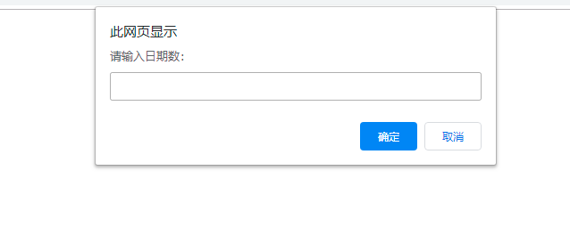

# 每日作业-JavaScript第02天

###1- 判断时间阶段。 

​	

- 题目描述： 

   通过弹出框提示用户输入时间信息，根据用户输入的时间弹出问候信息；

   

   	如：
   		用户输入的时间在6-12之间 弹出“上午好”；
   		用户输入的时间在13-18之间 弹出“下午好”；
   		用户输入的时间在19-23之间 弹出“晚上好”；
   		用户输入的时间在0-5之间 弹出“这是休息时间，不要说话！”；

- 题目提示：

  ​	通过比较运算符判定输入的时间的范围，弹出相应的问候信息

### 2 - 比较两个数的最大值   

- 题目描述：

  ​	通过提示框提示用户依次输入2个数值，用户输入完成后弹出用户输入的最大值、

  

- 题目提示：

  ​	通过比较运算符得到最大值

### 3 - 判断奇偶性

- 题目描述：

  ​	通过提示框提示用户输入一个数值，用户输入完成后弹出数值的奇偶性

  

- 题目提示：

  ​	通过%运算符可以判断数字的奇偶性

### 4 - 判断星期

- 题目描述：

  ​	假设这个月1号是星期一，提示用户输入本月的日期（即1日-31日），返回用户输入日期是星期几

  

- 题目提示：

  ​	利用%和7取余，再判定是星期几

### 5 - 请客吃饭

- 题目描述：

  ​	接收班长口袋里的钱数？

  ​	若大于等于2000，请大家吃西餐。

  ​	若小于2000，大于等于1500，请大家吃快餐。

  ​	若小于1500，大于等于1000，请大家喝饮料。

  ​	若小于1000，大于等于500，请大家吃棒棒糖。

  ​	否则提醒班长下次把钱带够

- 题目提示：

  ​	使用switch或者if else if 来完成本题目

### 6 - 成绩表

- 题目描述：

  ​	通过弹出输入框提示用户输入一个分数，判定份数的等级。大于等于90 --- 在控制台打印A，大于等于80小于90 ---- 在控制台打印B，大于等于70小于80 ---- 在控制台打印C ，大于等于60小于70 ---- 在控制台打印D，小于60 ---- 在控制台打印E

- 题目提示：

  ​	使用switch或者if else if 来完成本题目
