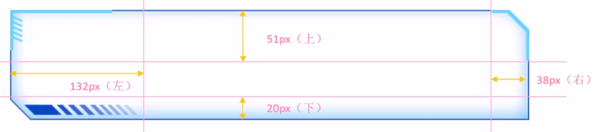

# HTML

## 第1章 HTML框架

1. 文件类型：`<!DOCTYPE html>`

2. 网站语言：`<html lang="zh-CN">`

3. 头部：`<head>`

   1）`<META ...>`：编码UTF-8、视图自适应、其他、渲染
   
   ```html
   <meta http-quiv="X-UA-Compatible content="IE="edge">
   <!--如果版本低于IE9-->
   [if lt IE 9]>
   <script src="https://oss.maxcdn.com/html5shiv/3.7.2/html5shiv.min.js"></script>
   <script src="https://oss.maxcdn.com/respond/1.4.2/respond.min.js"></script>
   <![endif]
   ```

   2）标题`<title>`

4. 主体：`<body>`

------

## 第2章 基础文字

1. 标题：`<h1>`、`<h2>`、`<h3>`、`<h4>`、`<h5>`、`<h6>`

2. 段落：`<p>`、`<br />`

3. 文本格式化：

   1）加粗：`<strong>`、`<b>`

   2）倾斜：`<em>`、`<i>`

   3）删除线：`<del>`、`<s>`

   4）下划线：`<ins>`、`<u>`

4. 盒子元素：

   1）独占一行：`<div>`

   2）小箱体：`<span>`

5. 图像：``

   1）路径：src

   2）替换：alt

   3）标题：title

   4）宽高：width、height

   5）边框：border

   ```html
   
   ```

6. 超链接：`<a>`

   1）打开方式：target

   * 当前窗口(默认)：`_self`

   * 新窗口：`_blank`

   2）提示文字：title

   3）锚点：

   * 起点：`<a href："#...">`
   * 终点：`<h3 id="...">`

   ```html
   1.外部链接：
   target 打开窗口的方式：_self当前窗口打开页面（默认）、_blank 新窗口打开页面
   <a href="http://www.qq.com" target="_blank"> 腾讯</a>
   <a href="http://www.itcast.cn" target="_blank">传智播客</a>
   
   2.内部链接: 网站内部页面之间的相互链接
   <a href="gongsijianjie.html" target="_blank">公司简介</a>
   
   3.空链接:#
   <a href="#">公司地址</a>
   
   4.下载链接: 地址链接的是 文件 .exe 或者是 zip 等压缩包形式
   <a href="img.zip">下载文件</a>
   
   5.网页元素的链接
   <a href="http://www.baidu.com"></a>
   
   6.锚点链接
   <a href="#live">个人生活</a><br />
   <a href="#zuopin">主要作品</a><br />
   
   <h3 id="live">个人生活</h3>
   个人生活内容部分....
   <h3 id="zuopin">主要作品</h3>
   主要作品内容部分....
   ```

7. 特殊字符

   1）空格：`&nbsp;`

   2）左尖头<：`&lt;`

   3）右尖头>：`&gt;`

   4）注释：`<!-- -->`、`/*`

------

## 第3章 表格Table

1. 结构：

   1）表头：`<thead>`

   2）主体：`<tbody>`

2. 元素：

   1）行：`<tr>`

   2）标题单元格：`<th>`

   3）单元格：`<td>`

3. 属性：

   1）对齐：align

   2）边框：border

   3）文字距单元格距离：cellpadding

   4）单元格之间的距离：cellspacing

   5）宽高：width、height

   ```html
   <table align="center" border="1" cellpadding="0" cellspacing="0" width="500" height="249">
     <tr>
       <th>姓名</th>
       <th>性别</th>
       <th>年龄</th>
     </tr>
     <tr>
       <td>刘德华</td>
       <td>男</td>
       <td>56</td>
     </tr>
     <tr>
       <td>张学友</td>
       <td>男</td>
       <td>58</td>
     </tr>
     <tr>
       <td>郭富城</td>
       <td>男</td>
       <td>51</td>
     </tr>
     <tr>
       <td>黎明</td>
       <td>男</td>
       <td>57</td>
     </tr>
   </table>
   ```

4. 合并单元格：

   1）横向合并列：colspan，例：`<td colspan="2"></td>`

   2）纵向合并行：rowspan，例：`<td rowspan="2"></td>`

   ```html
   <table width="500" height="249" border="1" cellspacing="0">
     <tr>
       <td></td>
       <td colspan="2"></td>
     </tr>
     <tr>
       <td rowspan="2"></td>
       <td></td>
       <td></td>
     </tr>
     <tr>
       <td></td>
       <td></td>
     </tr>
   </table>
   ```

------

## 第4章 列表

1. 无序列表`<ul>`：项目`<li>`

2. 有序列表`<ol>`：项目`<li>`

3. 自定义列表`<dl>`

   1）项目1：`<dt>`：一个`<dt>`对应多个`<dd>`

   2）项目2：`<dd>`

   ```html
   <dl>
     <dt>关注我们</dt>
       <dd>新浪微博</dd>
       <dd>官方微信</dd>
       <dd>联系我们</dd>
     <dt>关注我们</dt>
       <dd>新浪微博</dd>
       <dd>官方微信</dd>
       <dd>联系我们</dd>
   </dl>
   ```

   

------

## 第5章 表单Form

### 5.1 表单属性

1. 动作：`action`，例：`"XXX.php"`

2. 方法：`method`，例：`"POST"`、`"GET"`

3. 名称：`name`

   ```html
   <form action="demo.php" method="POST" name="name1">
     <!-- 里面储存各种表单元素 -->
   </form>
   ```

4. 必填：`required`

5. 提示：`placeholder`，提示文本，若输入文字则自动消失

6. 自动聚焦：`autofocus`，页面加载完后光标自动聚焦到指定表单

7. 自动填写：`autocomplate`，可填：`off/on（默认）`，必须有name属性，且曾经成功提交过

   ```html
   <style>
     /* 这里有2个冒号，因为placeholder是伪元素 */
     input::placeholder {
       color: pink;
     }
   </style>
   <form action="">
     <input type="search" name="sear" id="" required="required" placeholder="pink老师" autofocus="autofocus" 
   autocomplete="on" />
     <input type="file" name="" id="" multiple="multiple" />
     <input type="submit" value="提交" />
   </form>
   ```

### 5.2 输入型 input

1. 属性

   1）名称：name

   2）值：value

2. H5之前的类型：`type`

   1）文字：text，最大长度：maxlength

   2）密码：password

   3）单选：radio

   4）多选：checkbox，选中状态：checked

   5）提交：submit

   6）重置：reset

   7）文件：file，多选文件：multiple

   8）按钮：button

   ```html
   <form action="xxx.php" method="get">
     <!-- text 文本框 用户可以里面输入任何文字 -->
     用户名: <input type="text" name="username" value="请输入用户名" maxlength="6" /> <br />
       
     <!-- password 密码框 用户看不见输入的密码 -->
     密码: <input type="password" name="pwd" /> <br />
       
     <!-- radio 单选按钮 可以实现多选一 -->
     <!-- name 是表单元素名字 这里性别单选按钮必须有相同的名字 name 才可以实现多选 -->
     <!-- 单选按钮和复选框可以设置checked 属性, 当页面打开的时候就可以默认选中这个按钮 -->
     性别: <input type="radio" name="sex" value="男" /> 男 <input type="radio" name="sex" value="女" 
   checked="checked" /> 女 <input type="radio" name="sex" value="不明" /> 不明 <br />
     <!-- checkbox 复选框 可以实现多选 name值也必须相同-->
     爱好: 吃饭 <input type="checkbox" name="hobby" value="吃饭" checked="checked" /> 睡觉 <input 
   type="checkbox" name="hobby" value="睡觉" /> 打豆豆 <input type="checkbox" name="hobby" value="打豆豆" 
   checked="checked" />
     <br />
       
     <!-- 点击了提交按钮,可以把 表单域 form 里面的表单元素 里面的值 提交给后台服务器 -->
     <input type="submit" value="免费注册" />
       
     <!-- 重置按钮可以还原表单元素初始的默认状态 -->
     <input type="reset" value="重新填写" />
       
     <!-- 普通按钮 button  后期结合js 搭配使用-->
     <input type="button" value="获取短信验证码" /> <br />
       
     <!-- 文件域 使用场景 上传文件使用的 -->
     上传头像: <input type="file" />
   </form>
   ```

3. H5之后新增类型：`type`

   1）邮箱：email：以下类型可添加提交按钮：`type="submit" value="提交"`，可以对输入的值进行验证

   2）网址：url

   3）日期：date

   4）时间：time

   5）数量：number

   6）手机：tel

   7）搜索：search

   8）颜色：color

   ```html
   <form action="">
     <ul>
       <li>邮箱: <input type="email" /></li>
       <li>网址: <input type="url" /></li>
       <li>日期: <input type="date" /></li>
       <li>时间: <input type="time" /></li>
       <li>数量: <input type="number" /></li>
       <li>手机号码: <input type="tel" /></li>
       <li>搜索: <input type="search" /></li>
       <li>颜色: <input type="color" /></li>
       <!-- 点击提交按钮就可以验证表单了 -->
       <li><input type="submit" value="提交" /></li>
     </ul>
   </form>
   ```

### 5.3 标签型 label

1. 作用：绑定一个表单元素，点击文字即可跳转到表单元素上

2. 属性：<label>起点：`for`，表单元素终点：`id`

   ```html
   <label for="text"> 用户名:</label> <input type="text" id="text" value="请输入用户名">
   <input type="radio" id="male" name="sex" value="male" checked="checked" /><label for="male">男</label>
   <input type="radio" id="female" name="sex" value="female" /> <label for="female">女</label>
   ```

### 5.4 下拉表单 select

1. 选项：`<option>`

2. 属性：选中状态：`selected="selected"`

   ```html
   <form>
     籍贯:
     <select>
       <option>山东</option>
       <option>北京</option>
       <option>天津</option>
       <option selected="selected">火星</option>
     </select>
   </form>
   ```

### 5.5 文本域 textarea

1. 属性：列：`cols`，行：`rows`

2. 预留文字：写在`<textarea>....</textarea>`之间

   ```html
   <form>
     今日反馈:
     <textarea cols="50" rows="5">我知道这个反馈留言是textarea来做的 </textarea>
   </form>
   ```

------

## 第6章 语义化标签

> 兼容性较差，只能在IE9+的浏览器使用，IE9中需要将这些元素转为块级元素（display: block）

1. 头部标签：`<header>`

2. 导航标签：`<nav>`

3. 内容标签：`<article>`

4. 定义文档某个区域：`<section>`

5. 侧边栏标签：`<aside>`

6. 尾部标签：`<footer>`

   ```html
   <body>
     <header>头部标签</header>
     <nav>导航栏标签</nav>
     <section>某个区域</section>
   </body>
   ```

------

## 第7章 多媒体标签

### 7.1 音频 audio

1. 格式：MP3(主流)、Wav、Ogg

2. 考虑兼容性：`type`，可填：`"audio/mpeg"`、`"audio/ogg"`

3. 自动播放：`autoplay`，谷歌禁用了此项功能

4. 播放组件：`controls`

   ```html
   <audio src="media/music.mp3" autoplay="autoplay" controls="controls"></audio>
   ```

### 7.2 视频 vedio

1. 格式：MP4(主流)、WebM、Ogg

2. 地址：`src`，填写视频地址url

3. 自动播放：`autoplay`

4. 播放组件：`controls`，一般不显示控制组件

5. 宽高：`width`、`height`

6. 循环播放：`loop`

7. 预加载：`preload`

8. 预加载：`auto`

9. 不加载：`none`

10. 静音播放：`muted`

11. 等待加载的画面：`poster`，填写图片地址`url`

12. 考虑兼容性：type，可填：`"vedio/mp4"`、`"vedio/ogg"`

    ```html
    <style>
      video { width: 100%; }
    </style>
    <video src="media/mi.mp4" autoplay="autoplay" muted="muted" loop="loop" poster="media/mi9.jpg"></video>
    ```

------

## 第8章 框架标签 iframe

1. 语法：

   ```html
   <iframe name="fm" src="/xx.html"></iframe>
   ```

2. 配合超链接标签：

   1）href：用来打开的网页地址

   2）target：用来指定在哪里打开网页，例子中在name="fm"的框架中打开网页

   ```html
   <a href="/xx.html" target="fm"></a>
   ```

------


# CSS

## 第1章 CSS基础知识

### 1.1 CSS结构与类型

1. 结构：头部`<head>`里写`<style>...</style>`

2. 样式表类型：

   1）内部样式表：单独写到style标签内部

   ```html
   <style>
     div {
       color: pink;
     }
   </style>
   ```
   
   2）行内样式表：直接在标签内写样式属性
   
   ```html
   <p style="color: pink; font-size: 20px">给我一个粉红的回忆</p>
   ```
   
   3）外部样式表：
   
   ```html
   <link rel="stylesheet" href="style.css">
   ```

### 1.2 CSS书写顺序

1. 布局定位

   ```css
   display / position / float / clear / visibility / overflow
   ```

2. 自身属性

   ```css
   width / height / margin / padding / margin / border / background
   ```

3. 文本属性

   ```css
   color / font / text-decoration / text-align / vertical-align / white-space / break-word
   ```

4. 其他属性

   ```css
   content / cursor / border-radius / box-shadow / text-shadow / background:linear-gradient
   ```

### 1.3 CSS常用工具

#### 1.3.1 emmet语法

1. 标签：

   1）输入标签名，按Tab键即可生成

   2）生成多个相同标签，加上`*`即可，如：`div*3 ` + Tab

   3）生成多个不同选择器的div：`.name1+.name2+...+.namex` + Tab

   4）生成父子级关系标签，用>即可，如：`ul>li` + Tab

   5）生成兄弟级关系标签，用+即可，如：`div+p `+ Tab

   6）生成带有类名或id名的标签，用 `标签名.name或#name` + Tab

   7）生成带顺序的标签，用 `标签名$.name*n` + Tab

   8）生成标签内部写内容，用{}表示：`标签名{}` + Tab

2. 样式名缩写:数值 + Tab

   1）`w200` --> width:200px

   2）`lh26` --> line-height:26px

   3）`ti2` --> text-indent: 2em

3. 首字母缩写 + Tab

   1）`tac` --> text-align: center

   2）`tdn` --> text-decoration: none

#### 1.3.2 自动格式化代码

* 设置 --> emmet.include--> settings.json

  ```json
  "editor.formatOnType": true
  "editor.formatOnSave": true
  ```

#### 1.3.3 兼容性检查

* 网站：[caniuse.com](https://caniuse.com/)

### 1.4 CSS初始化

1. CSS reset：消除不同浏览器差异，重设浏览器样式

2. 所有标签`*`：内外边距清零

   ```css
   * {
     margin: 0;
     padding: 0;
   }
   ```

3. 文字样式`em, i`：不倾斜

   ```css
   em,
   i {
     font-style: normal;
   }
   ```

4. 列表项目`li`：去掉圆点

   ```css
   il {
     list-style: none;
   }
   ```

5. 图片`img`：去除边框、消除图片底侧的空白缝隙

   ```css
   img {
     /* 照顾低版本浏览器，如果图片外面包含了链接会有边框的问题 */
     border: 0;
     /* 取消图片底侧有空白缝隙的问题 */
     vertical-align: middle;
   }
   ```

6. 按钮`buttton`：鼠标经过时变为小手、设置字体

   ```css
   button {
     cursor: pointer;
   }
   ```

7. 超链接`a`：删除下划线、设置鼠标经过颜色

   ```css
   a {
     color: #666;
     text-decoration: none;
   }
   a:hover {
     color: #c81623;
   }
   ```

8. 输入框`input`：设置字体

   ```css
   button,
   input {
     /* "\5B8B\4F53" 就是宋体的意思 这样浏览器兼容性比较好 */
     font-family: Microsoft YaHei, Heiti SC, tahoma, arial, Hiragino Sans GB, '\5B8B\4F53', sans-serif;
   }
   ```

9. 主体`body`：CSS3抗锯齿性、背景色、字体（"\5B8B\4F53"代表宋体）、字体颜色

   ```css
   body {
     /* CSS3抗锯齿形：让文字显示的更加清晰 */
     -webkit-font-smoothing: antialiased;
     background-color: #fff;
     font: 12px/1.5 Microsoft YaHei, Heiti SC, tahoma, arial, Hiragino Sans GB, '\5B8B\4F53', sans-serif;
     color: #666;
   }
   ```

10. 清除浮动：.clearfix:after；.clearfix

    ```css
    .clearfix:after {
      visibility: hidden;
      clear: both;
      display: block;
      content: '.';
      height: 0;
    }
    
    .clearfix {
      *zoom: 1;
    }
    ```

### 1.5 网站标准

#### 1.5.1 文件结构

1. 样式：css

   1）初始化样式：base.css

   2）公共样式：common.css

   * 首页
   * 列表页
   * 详情页

2. 脚本：js

3. 素材：images

4. 产品：upload

5. 字体：fonts

#### 1.5.2 开发技巧

1. 导航栏：

   1）用`<li>`包含`<a>`，并给`<li>`加浮动

   2）如果直接用`<a>`，搜索引擎容易辨别为有堆砌关键字嫌疑，降低排名

   3）由于导航栏文字不一样多，给`<a>`左右padding撑开盒子，而不是给宽度

2. 陈列窗的图片，设定 `width=100%`，这样不会超出盒子大小

#### 1.5.3 头部 head

1. 浏览器私有前缀

   1）firefox：`-moz-border-radius: 10px`

   2）Safari/Chrome：`-webkit-border-radius: 10px`

   3）Opera：`-o-border-radius: 10px`

   4）最后添加：`border-radius: 10px`

2. SEO优化：TDK

   1）标题：网站名（产品名）-网站介绍30字内

   ```html
   <title>website name-awesome website</title>
   ```

   2）网站说明：SEO专业文案

   ```html
   <meta name="description" content="XXX" />
   ```

   3）关键字：6~8个关键词逗号隔开

   ```html
   <meta name="keywords" content="XXX" />
   ```

3. favicon图标

   ```html
   <link rel="shortcut icon" href="favicon.ico" />
   ```

#### 1.5.4 常用模块命名

1. 快捷导航栏：`shortcut`
2. 购物车：`shopcar`
3. 热点词：`hotwords`
4. 导航：`nav`
5. 导航左侧：`dropdown` 包含 `.dd``.dt`
6. 导航右侧：`navitems`
7. 页面底部服务模块：`mod_service`
8. 页面底部帮助模块：`mod_help`
9. 页面底部版权模块：`mod_copyright`

#### 1.5.5 LOGO SEO优化

1. `<h1>`标签提升权重，里面放置链接可返回首页，背景图设置为logo

2. 链接里面放文字但不显现：

   1）方法1（淘宝）

   ```css
   text-indent:-9999px;
   overflow：hidden
   ```

   2）方法2（京东）

   ```css
   font-size: 0
   ```

3. 给链接一个 title 属性，鼠标放在logo上显示提示文字

#### 1.5.6 Tab栏切换

1. 用JavaScript实现，但是对HTML结构有严格要求
2. 分为2个部分：tab_list、tab_content
3. 可以用box_hd装tab-list，用box_bd装tab-content

#### 1.5.7 注册界面

1. 不需要做SEO优化，因为保护个人信息隐私

2. 常用写法：

   1）注册专区：registerarea

   2）注册内容：reg-form

   3）错误/成功/默认：error/success/default

------

## 第2章 基础属性

### 2.1 字体属性

1. `font-style`：文字风格

   1）正常：normal

   2）倾斜：italic

   ```css
   em {
     /* 让倾斜的字体不倾斜*/
     font-style: normal;
   }
   ```

2. `font-weight`：字体粗细（无单位）

   1）正常：400

   2）加粗：700

3. `font-size`：字体大小，标题h1~h6需要单独指定文字大小

   ```css
   h2 {
     font-weight: 400;
   }
   ```

4. `font-family`：字体类型，可以写多个，用逗号隔开

   ```css
   font-family: 'Times New Roman', Times, serif;
   ```

5. `font`：复合简写，默认顺序：文字风格、字体粗细、字体大小/行高、字体类型

   ```css
   font: font-style font-weight font-size/line-height font-family
   
   font: italic 700 16px 'Microsoft yahei';
   font: 12px/1.5 'Microsoft YaHei';
   ```

------

### 2.2 文本属性

1. `color`：颜色

   1）预定义文字：deeppink

   2）十六进制：#cc00ff

   3）RGB：rgb(255, 0, 255)

   ```css
   div {
     /* color: deeppink; */
     /* color: #cc00ff; */
     color: rgb(255, 0, 255);
   }
   ```

2. `text-align`：对齐

   1）left：默认，左对齐

   2）right：右对齐

   3）center：居中对齐（图片居中对齐，要为其父元素添加此代码）

   ```css
   h1 {
     /* 本质是让h1盒子里面的文字水平居中对齐 */
     /* text-align: center; */
     text-align: right;
   }
   ```

3. `text-decoration`：装饰

   1）none：默认，无

   2）underline：下划线

   3）overline：上划线

   4）line-through：删除线

   ```css
   div {
     /* 下划线 */
     text-decoration: underline;
     /* 删除线 */
     text-decoration: line-through;
     /* 上划线 */
     text-decoration: overline;
   }
   
   a {
     /* 取消a默认的下划线 */
     text-decoration: none;
     color: #333;
   }
   ```

4. `text-indent`：缩进，单位：em，表示缩进几个文字大小

   ```css
   p {
     /* 文本的第一行首行缩进多少距离  */
     text-indent: 20px;
     /* 如果写了2em，则是缩进当前元素2个文字大小的距离  */
     text-indent: 2em;
   }
   ```

5. `line-height`：行间距，单位：px，如果写成【字体大小/行高X】的样式，则行高为字体大小的X倍

   ```css
   div {
     line-height: 26px;
   }
   ```

6. `user-select`：用户是否可以选中文字

   1）auto：默认，可选中

   2）none：不可选中

------

### 2.3 透明度属性

1. `opacity(0~1)`：0完全透明，1完全不透明

------

### 2.4 背景属性

1. 背景颜色：`background-color`

   1）颜色：pink ....

   2）透明：transparent

   3）半透明：rgba（X, X, X, alpha【0~1小数】）

   ```css
   div {
     width: 200px;
     height: 200px;
     /* 透明 */
     background-color: transparent;
     /* 红色 */
     background-color: red;
     /* 半透明 */
     background-color: rgba(0, 0, 0, 0.3);
   }
   ```

2. 背景图片：`background-img`

   1）参数：`url（images/logo.png）`

   2）注意：页面元素既可以添加背景颜色也可以添加背景图片，只不过背景图片会压住背景颜色

   ```css
   div {
     width: 300px;
     height: 300px;
     background-image: url(images/logo.png);
   }
   ```

3. 背景平铺：`background-repeat`

   1）不平铺：no-repeat

   2）平铺：repeat

   3）沿着X轴平铺：repeat-x

   4）沿着Y轴平铺：repeat-y

   ```css
   div {
     width: 300px;
     height: 300px;
     background-image: url(images/logo.png);
     /* 1.背景图片不平铺 */
     background-repeat: no-repeat;
     /* 2.默认的情况下,背景图片是平铺的 */
     background-repeat: repeat;
     /* 3.沿着x轴平铺 */
     background-repeat: repeat-x;
     /* 4. 沿着Y轴平铺 */
     background-repeat: repeat-y;
   }
   ```

4. 背景固定：`background-attachment`

   1）背景图片固定：fixed

   2）随着页面其余部分滚动：scroll

   ```css
   body {
     background-image: url(images/bg.jpg);
     background-repeat: no-repeat;
     background-position: center top;
     /* 把背景图片固定住 */
     background-attachment: fixed;
     color: #fff;
     font-size: 20px;
   }
   ```

5. 背景位置：`background-position：x y`

   1）方位名词：`top`、`center`、`bottom`、`left`、`center`、`right`

   * 先写哪个没关系，center right 和 right center是等价的，默认居中对齐

   2）精确单位：

   * 百分数、浮点数字+单位标识符
   * 顺序：第一个肯定是X坐标，第二个肯定是Y坐标（距上顶、左侧的距离）

   3）混合单位：

   * 方位名词+精确单位：第一个肯定是X坐标，第二个肯定是Y坐标
   * 注意：x和y之间没有逗号，是空格！

   ```css
   div {
     width: 300px;
     height: 300px;
     background-color: pink;
     background-image: url(images/logo.png);
     background-repeat: no-repeat;
     /* x轴20，y轴50 */
     background-position: 20px 50px;
     /* x轴20，y轴垂直居中 */
     background-position: 20px;
     /* 中间靠上 */
     background-position: center top;
     /* 中间靠右 */
     background-position: right center;
     /* 水平靠右：第二个参数省略，y轴垂直居中 */
     background-position: right;
     /* 中间靠上：第二个参数省略，y轴垂直居中 */
     background-position: top;
     /* x轴水平居中，y轴20 */
     background-position: center 20px;
   }
   ```

6. 背景缩放：`background-size：x y`

   1）像素单位px：宽、高，只写一个则默认是宽度，高度随着等比例缩放

   2）百分比单位%：相对于父级盒子拉伸，只写一个则默认是宽度，高度随着等比例缩放

   3）cover：等比例拉伸铺满，可能有部分背景图显示不全

   4）contain：宽高等比例拉伸，如果宽或高其中一个铺满盒子就不再拉伸，可能有部分空白

   5）注意：x和y之间没有逗号，是空格！

   ```html
   <style>
     div {
       width: 500px;
       height: 500px;
       border: 2px solid red;
       background: url(images/dog.jpg) no-repeat;
       /* 1. 像素单位px：宽、高，只写一个则默认是宽度，高度随着等比例缩放 */
       background-size: 500px 200px;
       background-size: 500px;
       /* 2. 百分比单位%：相对于父级盒子拉伸 */
       background-size: 50%;
       /* 3. cover：等比例拉伸铺满，可能有部分背景图显示不全 */
       background-size: cover;
       /* 4. contain：宽高等比例拉伸，如果宽或高其中一个铺满盒子就不再拉伸，可能有部分空白 */
       background-size: contain;
     }
   </style>
   ```

7. 复合简写：`background`，默认顺序：颜色、图片地址、平铺、固定、位置 / 缩放

   ```css
   background: url(../images/bg.jpg) no-repeat 0 0 / cover;
   ```

8. 背景渐变：`background: -webkit-linear-gradient（起始方向，颜色1，眼色2，……）`

   1）方位名词：`top`(默认)、`bottom`、`left`、`right`，以及它们的组合使用

   2）注意：必须添加浏览器私有前缀
   
   ```html
   <style>
     div {
       width: 600px;
       height: 200px;
       /* 背景渐变必须添加浏览器私有前缀 */
       /* background: -webkit-linear-gradient(left, red, blue); */
       /* background: -webkit-linear-gradient(red, blue); */
       background: -webkit-linear-gradient(top left, red, blue);
     }
   </style>
   <div></div>
   ```

------

### 2.5 边框属性

#### 2.5.1 默认边框 border

> 边框会向外延伸大小，如盒子大小为200px，10px的边框让盒子整体变为220px

1. 边框粗细：`border-width`，单位：px

2. 边框颜色：`border-color`

3. 边框样式：`border-style`

   1）实线边框：solid

   2）虚线边框：dashed

   3）点线边框：dotted

   ```css
   div {
     width: 300px;
     height: 200px;
     /* border-width 边框的粗细 */
     border-width: 5px;
     /* border-style 边框的样式*/
     border-style: solid;
     border-style: dashed;
     border-style: dotted;
     /* border-color 边框颜色  */
     border-color: pink;
   }
   ```

4. 边框位置：

   1）上边框：`border-top`

   2）下边框：`border-bottom`

   3）左边框：`border-left`

   4）右边框：`border-right`

5. 复合简写：`border`，没有顺序：粗细、样式、颜色

   ```css
   div {
     width: 300px;
     height: 200px;
     /* 边框的复合写法 */
     border: 5px solid pink;
     /* 上边框 */
     border-top: 5px solid pink;
     /* 下边框 */
     border-bottom: 10px dashed purple;
   }
   ```

6. 表格相邻边框合并：`border-collapse`

   1）分开：separate（默认）

   2）合并：collapse

   ```css
   table {
     width: 500px;
     height: 249px;
   }
   th {
     height: 35px;
   }
   table,
   td,
   th {
     border: 1px solid pink;
     /* 合并相邻的边框 */
     border-collapse: collapse;
     font-size: 14px;
     text-align: center;
   }
   ```

7. 相邻单元格边框间距：`border-spacing`

   1）仅用于“边框分离 separate”模式

   2）两个数值：水平间隔px，垂直间隔px

------

#### 2.5.2 圆角边框 border-radius

1. 边框半径：

   1）单位：px

   2）百分比：50%（半径是宽高的一半，可以做圆形）

2. 多种写法：例：`border-top-left-radius`

3. 复合简写：`border-radius`，顺序：左上、右上、右下、左下（规则与padding相同）

   ```css
   <style>
     .yuanxing {
       width: 200px;
       height: 200px;
       background-color: pink;
       /* border-radius: 100px; */
       /* 50% 就是宽度和高度的一半  等价于 100px */
       border-radius: 50%;
     }
     .juxing {
       width: 300px;
       height: 100px;
       background-color: pink;
       /* 圆角矩形设置为高度的一半 */
       border-radius: 50px;
     }
     .radius {
       width: 200px;
       height: 200px;
       border-radius: 10px 20px 30px 40px;
       /* border-radius: 10px 40px; */
       /* border-top-left-radius: 20px; */
       background-color: pink;
     }
   </style>
   
   1. 圆形的做法:
   <div class="yuanxing"></div>
   2. 圆角矩形的做法:
   <div class="juxing"></div>
   3. 可以设置不同的圆角:
   <div class="radius"></div>
   ```

------

#### 2.5.3 边框图片 border-image

> 需要与border、border-width、内部盒子相配合使用，盒子模型设置为 `box-sizing:border-box`

1. 作用：盒子大小不一，但边框样式相同，可以自定义边框样式

2. 图片路径：`border-image-source:url(...)`

3. 边框切图：`border-image-slice`

   

   1）原理：把四个角切出去（类似九宫格），中间部分可以铺排、拉抻、环绕

   2）顺序：上、右、下、左（不加单位）

   ```css
   border-image-slice: 51 38 20 132;
   ```

4. 边框宽度：`border-image-width`，里面的内容不会被挤压、保持原位

5. 边框平铺：拉抻的是九宫格上下左右中间部分

   1）平铺：repeat

   2）铺满：round

   3）拉抻：stretch（默认）

------

### 2.6 边距属性

> 不同浏览器有不同的默认设定值，为了统一起见，最好清除默认边距：`* {margin: 0;padding: 0;}`

#### 2.6.1 内边距：padding

> 内边距会向外延伸大小，如盒子大小为200px，10px的边距让盒子整体变为220px。

1. 内边距：`padding-XXX`，顺时针顺序：上/右/下/左（top/right/bottom/left)

   ```css
   div {
     width: 200px;
     height: 200px;
     background-color: pink;
     padding-left: 20px;
     padding-top: 30px;
   }
   ```

2. 复合简写：`padding`

   1）1个值：padding: 5px （上下左右都有5px内边距）

   2）2个值：padding: 5px 10px（上下5px，左右10px）

   3）3个值：padding: 5px 10px 20px（上5px，左右10px，下20px）

   4）4个值：padding: 5px 10px 20px 30px（上5px，左10px，右20px，下30px）

   ```css
   div {
     width: 200px;
     height: 200px;
     background-color: pink;
     /* 内边距复合写法 */
     padding: 5px;
     padding: 5px 10px;
     padding: 5px 10px 20px;
     padding: 5px 10px 20px 30px;
   }
   ```

3. 注意：

   1）如果盒子本身没有指定width/height属性，则padding不会撑开盒子大小

   2）对于子级元素，如果仅是继承了父级元素的width/height属性，padding也不会撑开盒子大小

------

#### 2.6.2 外边距：margin

> 外边距不会撑大盒子，但会使盒子周围出现空白。

1. 外边距：`margin-XXX`，顺时针顺序：上/右/下/左（top/right/bottom/left)

2. 块级元素水平居中：

   ```css
   margin-left/right: auto
   margin: auto
   margin: 0 auto
   ```

   ```css
   .header {
     width: 900px;
     height: 200px;
     background-color: pink;
     margin: 100px auto;
   }
   ```

3. 行内、行内块元素水平居中

   ```css
   text-align：center
   ```

   ```css
   .header {
     width: 900px;
     height: 200px;
     background-color: pink;
     margin: 100px auto;
     text-align: center;
   }
   ```

4. 复合简写：`margin`（与padding规则相同）

   * 特殊应用：auto自动适应

   ```css
   margin：100px auto
   ```

5. 外边距合并问题

   1）相邻块元素垂直外边距合并：总边距取最大值(上盒子`margin-bottom`，下盒子`margin-top`)

   ```html
   <style>
     .damao,
     .ermao {
       width: 200px;
       height: 200px;
       background-color: pink;
     }
     .damao {
       margin-bottom: 100px;
     }
     .ermao {
       margin-top: 200px;
     }
   </style>
   <!--总边距：200px-->
   <div class="damao">大毛</div>
   <div class="ermao">二毛</div>
   ```

   2）嵌套块元素垂直外边距塌陷：对于嵌套父子元素，父元素有上边距，同时子元素也有上边距，此时父元素会塌陷较大的外边距值

   * 为父元素定义上边框：`border: 1px solid transparent`
   * 为父元素定义上内边框：`padding: 1px`
   * 为父元素添加：`overflow: hidden`
   * 注意：浮动、固定、绝对定位的盒子不会有塌陷问题

   ```html
   <style>
     .father {
       width: 400px;
       height: 400px;
       background-color: purple;
       margin-top: 50px;
       /* border: 1px solid red; */
       /* border: 1px solid transparent; */
       /* padding: 1px; */
       overflow: hidden;
     }
     .son {
       width: 200px;
       height: 200px;
       background-color: pink;
       margin-top: 100px;
     }
   </style>
   
   <div class="father">
     <div class="son"></div>
   </div>
   ```

6. margin负值应用：浮动盒子一行紧密排列时，如果都有边框，会出现边框合并变粗的问题

   1）写法：`margin-left：-1`

   2）鼠标移动时显示边框

   * 若盒子无定位，hover里加 `pisition：relative`，可覆盖盒子
   * 若盒子有定位，hover里加 `z-index：1`，提高层级

   ```html
   <style>
     ul li {
       position: relative;
       float: left;
       list-style: none;
       width: 150px;
       height: 200px;
       border: 1px solid red;
       margin-left: -1px;
     }
     
     /* 1. 如果盒子没有定位，则鼠标经过添加相对定位即可 */
     /* ul li:hover {
       position: relative;
       border: 1px solid blue;
     } */
     
     /* 2.如果li都有定位，则利用 z-index提高层级 */
     ul li:hover {
       z-index: 1;
       border: 1px solid blue;
     }
   </style>
   <ul>
     <li>1</li>
     <li>2</li>
     <li>3</li>
     <li>4</li>
     <li>5</li>
   </ul>
   ```

   

------

### 2.7 列表属性

1. 列表项的标记：`list-style-type`

   1）去掉小圆点：none

   2）实心圆：disc

   3）空心圆：circle

   4）实心方块：suqare

   5）阿拉伯数字：decimal

------

### 2.8 阴影属性

1. 盒子阴影：`box-shadow`

   1）h-shadow：水平阴影距离，允许负值

   2）v-shadow：垂直阴影距离，允许负值

   3）blur：模糊距离，可选

   4）spread：阴影尺寸，可选

   5）color：阴影颜色，可选

   6）inset：将外部阴影(outset)改为内部阴影，可选

   ```css
   div {
     width: 200px;
     height: 200px;
     background-color: pink;
     margin: 100px auto;
   }
   div:hover {
     box-shadow: 10px 10px 10px -4px rgba(0, 0, 0, 0.3);
   }
   ```

2. 文字阴影：`text-shadow`

   1）h-shadow：水平阴影距离，允许负值

   2）v-shadow：垂直阴影距离，允许负值

   3）blur：模糊距离，可选

   4）color：阴影颜色，可选
   
   ```css
   div {
     font-size: 50px;
     color: orangered;
     font-weight: 700;
     text-shadow: 5px 5px 6px rgba(0, 0, 0, 0.3);
   }
   ```

------

## 第3章 高级属性

### 3.1 盒子模型 box-sizing

1. `content-box`（默认）：盒子大小 = width+padding+border

2. `border-box`：盒子大小 = width（无需再担心边框、内边距撑大盒子）

   * 注意：此时使用`line-height=height`值不一定能居中对齐了，需要将`line-height`设置为`height减去边框后的大小`

   ```html
   <style>
     div:nth-child(1) {
       /* 传统盒子模型：盒子大小 = width + border + padding */
       width: 200px;
       height: 200px;
       background-color: pink;
       padding: 10px;
       border: 10px solid red;
       box-sizing: content-box;
     }
     div:nth-child(2) {
       /* CSS3盒子模型：盒子大小 = width */
       /* padding 和 border 不会撑大盒子 */
       box-sizing: border-box;
       width: 200px;
       height: 200px;
       background-color: purple;
       padding: 10px;
       border: 10px solid blue;
     }
   </style>
   <div></div>
   <div></div>
   ```

### 3.2 图片滤镜 filter

1. `blur(5px)`：图片模糊，括号中填写像素大小，越大越模糊

   ```html
   <style>
     img {
       /* blur是一个函数：括号里面数值越大，图片越模糊，注意数值要加px单位 */
       filter: blur(15px);
     }
     img:hover {
       filter: blur(0);
     }
   </style>
   
   ```

### 3.3 计算函数 calc()

1. 宽度计算：`width:calc(100%-30)`，子元素比父元素宽度小30px

   ```html
   <style>
     .father {
       width: 300px;
       height: 200px;
       background-color: pink;
     }
     .son {
       /* width: calc(150px + 30px); */
       width: calc(100% - 30px);
       height: 30px;
       background-color: skyblue;
     }
   </style>
   <!-- 子盒子宽度永远比父盒子小30像素 -->
   <div class="father">
     <div class="son"></div>
   </div>
   ```

### 3.4 过渡效果 transition

1. 作用：可以不用Flash或JS的情况下制作元素样式变换的效果，常与`:hover`配合使用

2. 书写位置：谁做过渡给谁加，要写在原来的元素上！

   ```html
   <style>
     div {
       width: 200px;
       height: 100px;
       background-color: pink;
       /* transition: 变化的属性、花费时间、运动曲线、何时开始; */
       transition: width .5s ease 0s, height .5s ease 1s;
       /* 如果想要写多个属性，利用逗号进行分割 */
       transition: width .5s, height .5s;
       /* 如果想要多个属性都变化，属性写all就可以了 */
       transition: height .5s ease 1s;
       /* 谁做过渡，给谁加 */
       transition: all 0.5s;
     }
     div:hover {
       width: 400px;
       height: 200px;
       background-color: skyblue;
     }
   </style>
   <div></div>
   ```

3. 属性：添加多个属性可用逗号分隔，按顺序写

   1）要变换的属性：如width、height，全部变换为all

   2）花费时间 ：如 .5s

   3）运动曲线：

   * 逐渐变慢：`ease`（默认）
   * 匀速：`linear`
   * 加速：`ease-in`
   * 减速：`ease-out`
   * 先加速再减速：`ease-in-out`

   4）何时开始：延迟触发时间，如 .5s，可省略

   ```html
   <!--案例：进度条-->
   <style>
     .bar {
       width: 150px;
       height: 15px;
       border: 1px solid red;
       border-radius: 7px;
       padding: 1px;
     }
     .bar_in {
       width: 50%;
       height: 100%;
       background-color: red;
       border-radius: 7px 0 0 7px;
       /* 谁做过渡给谁加 */
       transition: all 0.7s;
     }
     .bar:hover .bar_in {
       width: 100%;
     }
   </style>
   ```

### 3.5 2D转换 transform

1. 位移：`translate(x,y)`

   1）单位：px 或 百分比%（相对于自身）

   2）沿轴移动：`translateX(n)`、`translateY(n)`

   ```html
   <style>
     div {
       width: 200px;
       height: 200px;
       background-color: pink;
       margin-top: 30px;
       /* transform: translate(x, y); */
       transform: translate(100px, 100px);
       /* 1. 如果只移动x坐标 */
       transform: translate(100px, 0);
       transform: translateX(100px);
       /* 2. 如果只移动y坐标 */
       transform: translate(0, 100px);
       transform: translateY(100px); 
     }
     div:first-child {
       transition: all 0.5s;
     }
     div:first-child:hover {
       transform: translate(0, -10px);
       background-color: rebeccapurple;
     }
     div:last-child {
       background-color: purple;
     }
   </style>
   <div></div>
   <div></div>
   ```

   3）水平垂直居中：绝对定位-50%，位移-50%

   ```html
   <style>
     div {
       position: relative;
       width: 500px;
       height: 500px;
       background-color: pink;
       /* 1. tranlate参数可以用 % */
       /* 2. 如果参数是 %，移动的距离是盒子自身的宽度或高度 */
       /* 这里的50%就是 50px，因为盒子的宽度是 100px */
       transform: translateX(50%);
     }
     p {
       position: absolute;
       top: 50%;
       left: 50%;
       width: 200px;
       height: 200px;
       background-color: purple;
       /* translate(-50%, -50%)：盒子往左右各走自己的一半  */
       transform: translate(-50%, -50%);
     }
     span {
       /* translate 对于行内元素是无效的 */
       transform: translate(300px, 300px);
     }
   </style>
   <div>
     <p></p>
   </div>
   ```

   4）注意：对行内元素无效，比如`<span>`

   ```html
   <style>
     span {
       /* translate 对于行内元素是无效的 */
       transform: translate(300px, 300px);
     }
   </style>
   <span>123</span>
   ```

2. 旋转：`rotate(n deg)`

   1）单位：deg，正数顺时针，负数逆时针

   ```html
   <style>
     img {
       width: 150px;
       border-radius: 50%;
       border: 5px solid pink;
       /* 过渡写到本身上，谁做动画给谁加 */
       transition: all 0.3s;
     }
     img:hover {
       /* 顺时针旋转360度 */
       transform: rotate(360deg);
     }
   </style>
   
   ```

   2）应用：制作CSS三角形，div旋转45度，只给底部、右侧边框

   ```html
   <style>
     div {
       position: relative;
       width: 249px;
       height: 35px;
       border: 1px solid #000;
     }
     div::after {
       content: '';
       position: absolute;
       top: 8px;
       right: 15px;
       width: 10px;
       height: 10px;
       border-right: 1px solid #000;
       border-bottom: 1px solid #000;
       transform: rotate(45deg);
       transition: all 0.2s;
     }
     /* 鼠标经过div，里面的三角旋转 */
     div:hover::after {
       transform: rotate(225deg);
     }
   </style>
   <div></div>
   ```

3. 中心点：`transform-origin:x y`

   1）像素：px（x和y之间没有逗号，是空格！）

   2）方位名词：left、right、top、bottom、center

   3）百分比：50% 50%（默认，等价于center center）

   ```html
   <style>
     div {
       width: 200px;
       height: 200px;
       background-color: pink;
       margin: 100px auto;
       transition: all 1s;
       /* 1. 方位名词 */
       transform-origin: left bottom;
       /* 2. 默认50% 50%，等价于center center */
       transform-origin: 50% 50%;
       /* 3. 可以是px 像素 */
       transform-origin: 50px 50px;
     }
     div:hover {
       transform: rotate(360deg);
     }
   </style>
   <div></div>
   ```

   4）应用：制作鼠标移动从底部旋转出现的效果

   ```html
   <style>
     div {
       float: left;
       overflow: hidden;
       width: 200px;
       height: 200px;
       margin: 10px;
       border: 1px solid pink;
     }
     div::before {
       display: block;
       content: '黑马';
       text-align: center;
       line-height: 200px;
       width: 100%;
       height: 100%;
       background-color: hotpink;
       transform: rotate(180deg);
       transform-origin: left bottom;
       transition: all 0.4s;
     }
     /* 鼠标经过div，里面的before 复原 */
     div:hover::before {
       transform: rotate(0deg);
     }
   </style>
   <div></div>
   <div></div>
   <div></div>
   ```

4. 缩放：`scale(x,y)`

   1）2个数字：等于倍数，如scale(2,3)即宽度变成2倍，高度变成3倍

   2）1个数字：等于倍数，如scale(2)即宽高都变成2倍

   3）可以设置缩放中心点，如果写了宽高则以最新数值为参考，且不影响其他盒子位置

   ```html
   <style>
     div {
       width: 200px;
       height: 200px;
       background-color: pink;
       margin: 100px auto;
       /* 缩放中心点，如果写了宽高则以最新数值为参考 */
       transform-origin: left bottom;
     }
     div:hover {
       /* 1. 参数无单位，代表倍数：transform: scale(x, y) */
       transform: scale(2, 2);
       /* 2. 修改宽度为原来的2倍，高度不变 */
       transform: scale(2, 1);
       /* 3. 等比例缩放：同时修改宽度和高度 */
       transform: scale(2);
       /* 4. 缩放：参数小于1 */
       transform: scale(0.5, 0.5);
       transform: scale(0.5);
       /* 5. scale 的优势：不会影响其他的盒子，而且可以设置缩放的中心点 */
       width: 300px;
       height: 300px;
       transform: scale(2);
     }
   </style>
   ```

   ```html
   <!--案例：图片放大-->
   <style>
     div {
       overflow: hidden;
       float: left;
       margin: 10px;
     }
     div img {
       transition: all 0.4s;
     }
     div img:hover {
       transform: scale(1.1);
     }
   </style>
   <div>
     <a href="#"></a>
   </div>
   ```

   ```html
   <!--案例：分页按钮-->
   <style>
     li {
       float: left;
       width: 30px;
       height: 30px;
       border: 1px solid pink;
       margin: 10px;
       text-align: center;
       line-height: 30px;
       list-style: none;
       border-radius: 50%;
       cursor: pointer;
       transition: all 0.4s;
     }
     li:hover {
       transform: scale(1.2);
     }
   </style>
   <ul>
     <li>1</li>
     <li>2</li>
     <li>3</li>
   </ul>
   ```

5. 复合简写：`transform: translate(x,y) rotatae(n deg) scale(n)`

   * 注意：书写顺序会影响效果，有位移的时候必须先写位移

   ```html
   <style>
     div {
       width: 200px;
       height: 200px;
       background-color: pink;
       transition: all 0.5s;
     }
     div:hover {
       /* 以下两种效果完全不同 */
       transform: translate(150px, 50px) rotate(180deg);
       transform: rotate(180deg) translate(150px, 50px);
       
       /* 同时有位移和其他属性，需要把位移放到最前面 */
       transform: translate(1200px, 0px) rotate(180deg) scale(1.2);
     }
   </style>
   ```

### 3.5 3D转换 transform

1. 坐标系：x轴右正左负，y轴下正上负，z轴外正里负

2. 透视：`perspective`

   1）单位：px，数值越小，盒子越大

   2）写到被观察元素的父盒子上面，即眼睛到屏幕的距离，近大远小

3. 3D移动：`translate3d（x,y,z）`

   1）等价写法：`transform: translateX(n) translateY(n) translateZ(n)`

   2）x、y、z不能省略，没有就写0

   ```html
   <style>
     body {
       /* 透视写到被观察元素的父盒子上面 */
       perspective: 200px;
     }
     div {
       width: 200px;
       height: 200px;
       background-color: pink;
       transform: translateX(100px) translateY(100px) translateZ(100px); 
       /* 简写方法 */
       transform: translate3d(100px, 100px, 100px);
     }
   </style>
   ```

4. 3D旋转：`rotate3d（x,y,z,deg）`

   1）x,y,z用：0/1 代表是否选中，并合成矢量，例：rotate3d(1, 1, 0, 45deg)

   2）等价写法：`transform:rotateX(n deg) rotateY(n deg) rotateZ(n deg)`

   3）X/Y/旋转：左手准则，大拇指指向正轴，四指弯曲指向正角度旋转方向

   4）Z轴旋转：类似2D旋转效果

   ```html
   <style>
     body {
       perspective: 500px;
     }
     img {
       display: block;
       margin: 100px auto;
       transition: all 1s;
     }
     img:hover {
       /* transform: rotateZ(180deg); */
       /* transform: rotate3d(x,y,z,deg); */
       /* transform: rotate3d(1, 0, 0, 45deg); */
       /* transform: rotate3d(0, 1, 0, 45deg); */
       transform: rotate3d(1, 1, 0, 45deg);
     }
   </style>
   
   ```

5. 3D呈现：`trasnform-style`

   1）preserve-3d：让子元素保持3D立体空间环境

   2）flat：默认，子元素不开启3D立体空间环境
   
   ```html
   <style>
     body {
       perspective: 500px;
     }
     .box {
       position: relative;
       width: 200px;
       height: 200px;
       margin: 100px auto;
       transition: all 2s;
       /* 让子元素保持3d立体空间环境 */
       transform-style: preserve-3d;
     }
     .box:hover {
       transform: rotateY(60deg);
     }
     .box div {
       position: absolute;
       top: 0;
       left: 0;
       width: 100%;
       height: 100%;
       background-color: pink;
     }
     .box div:last-child {
       background-color: purple;
       transform: rotateX(60deg);
     }
   </style>
   <div class="box">
     <div></div>
     <div></div>
   </div>
   ```

6. 案例：两面反转的盒子

   ```html
   <style>
     body {
       perspective: 400px;
     }
     .box {
       position: relative;
       width: 300px;
       height: 300px;
       margin: 100px auto;
       transition: all 0.4s;
       /* 让背面的盒子保留立体空间 */
       transform-style: preserve-3d;
     }
     .box:hover {
       transform: rotateY(180deg);
     }
     .front,
     .back {
       position: absolute;
       top: 0;
       left: 0;
       width: 100%;
       height: 100%;
       border-radius: 50%;
       font-size: 30px;
       color: #fff;
       text-align: center;
       line-height: 300px;
     }
     .front {
       background-color: pink;
       z-index: 1;
     }
     .back {
       background-color: purple;
       /* 背靠背旋转 */
       transform: rotateY(180deg);
     }
   </style>
   <div class="box">
     <div class="front">黑马程序员</div>
     <div class="back">pink老师这里等你</div>
   </div>
   ```

7. 案例：3D导航

   ```html
   <style>
     * {
       margin: 0;
       padding: 0;
     }
     ul {
       margin: 100px;
     }
     ul li {
       float: left;
       margin: 0 5px;
       width: 120px;
       height: 35px;
       list-style: none;
       text-align: center;
       line-height: 35px;
       color: white;
       /* 子盒子都有透视效果 */
       perspective: 500px;
     }
     .box {
       position: relative;
       width: 100%;
       height: 100%;
       transform-style: preserve-3d;
       transition: all 0.4s;
     }
     .box:hover {
       transform: rotateX(90deg);
     }
     .front,
     .bottom {
       position: absolute;
       left: 0;
       top: 0;
       width: 100%;
       height: 100%;
     }
     .front {
       background-color: pink;
       color: purple;
       z-index: 1;
       /* 注意：如果在正面的盒子不往前移动，则旋转效果会像T型一样，一定要保持中心点在立方体中间 */
       transform: translateZ(17.5px);
     }
     .bottom {
       background-color: purple;
       /* x轴一定是负值 */
       /* 如果有移动或者其他样式，必须先写移动 */
       transform: translateY(17.5px) rotateX(-90deg);
     }
   </style>
   <ul>
     <li>
       <div class="box">
         <div class="front">黑马程序员</div>
         <div class="bottom">pink老师等你</div>
       </div>
     </li>
     <li>
       <div class="box">
         <div class="front">黑马程序员</div>
         <div class="bottom">pink老师等你</div>
       </div>
     </li>
   </ul>
   ```

8. 案例：旋转木马

   ```html
   <style>
     body {
       perspective: 1000px;
     }
     section {
       position: relative;
       width: 300px;
       height: 200px;
       margin: 150px auto;
       transform-style: preserve-3d;
       /* 添加动画效果 */
       animation: rotate 10s linear infinite;
       background: url(media/pig.jpg) no-repeat;
     }
     section:hover {
       /* 鼠标放入section 停止动画 */
       animation-play-state: paused;
     }
     @keyframes rotate {
       0% {
         transform: rotateY(0);
       }
       100% {
         transform: rotateY(360deg);
       }
     }
     section div {
       position: absolute;
       top: 0;
       left: 0;
       width: 100%;
       height: 100%;
       background: url(media/dog.jpg) no-repeat;
     }
     section div:nth-child(1) {
       transform: rotateY(0) translateZ(300px);
     }
     section div:nth-child(2) {
       /* 先旋转、再移动距离 */
       transform: rotateY(60deg) translateZ(300px);
     }
     section div:nth-child(3) {
       /* 先旋转、再移动距离 */
       transform: rotateY(120deg) translateZ(300px);
     }
     section div:nth-child(4) {
       /* 先旋转、再移动距离 */
       transform: rotateY(180deg) translateZ(300px);
     }
     section div:nth-child(5) {
       /* 先旋转、再移动距离 */
       transform: rotateY(240deg) translateZ(300px);
     }
     section div:nth-child(6) {
       /* 先旋转、再移动距离 */
       transform: rotateY(300deg) translateZ(300px);
     }
   </style>
   <section>
     <div></div>
     <div></div>
     <div></div>
     <div></div>
     <div></div>
     <div></div>
   </section>
   ```

### 3.6 轮播图 swiper

1. 插件工具：swiper，网址：[www.swiper.com.cn](www.swiper.com.cn)
2. 下载文件：swiper.min.js、swiper.min.css
3. 使用方法：找到案例查看源码，复制HTML、CSS、JS代码，按需修改

------

## 第4章 动画效果

1. 语法：中间可以自定义百分比过程

   1）`@keyframes 动画名称 { 0% { 开始状态的效果 } 100% {结束状态的效果}}`

   2）`@keyframes 动画名称 { from { 开始状态的效果 } to {结束状态的效果}}`

   ```html
   <style>
     /* from to：等价于0%和100% */
     /* @keyframes move {
       from {
         transform: translate(0, 0);
       }
       to {
         transform: translate(1000px, 0);
       }
     } */
     /* 动画序列 */
     /* 1. 可以做多个状态的变化 keyframe 关键帧 */
     /* 2. 里面的百分比要是整数 */
     /* 3. 里面的百分比就是总的时间 */
     @keyframes move {
       0% {
         transform: translate(0, 0);
       }
       25% {
         transform: translate(1000px, 0);
       }
       50% {
         transform: translate(1000px, 500px);
       }
       75% {
         transform: translate(0, 500px);
       }
       100% {
         transform: translate(0, 0);
       }
     }
     div {
       width: 100px;
       height: 100px;
       background-color: pink;
       animation-name: move;
       animation-duration: 10s;
     }
   </style>
   <div></div>
   ```

2. 调用：至少写动画名称、动画时间2个属性，同一个元素中多个动画可以一起调用，用逗号隔开即可

3. 属性：

   1）动画名称（必填）：`animation-name`

   2）动画时间（必填）：`animation-duration`

   3）运动曲线：`animation-timing-function`

   * 效果：ease/ease-in/ease-out/ease-in-out/linear
   * 步长：steps（n），适合做轮播图式动画

   4）延迟时间：`animation-delay: 1s`

   5）重复次数：`animation-iteration-count: infinite/数字次数`

   6）反方向播放：`animation-direction: alternate（是）/normal（否）`

   7）结束后状态：`animation-fill-mode: forwards（停留在结束状态）/backwards（默认恢复初始状态）`

4. 播放状态：`animation-play-state: paused/running`

   ```html
   <style>
     @keyframes move {
       0% {
         transform: translate(0, 0);
       }
       100% {
         transform: translate(500px, 500px);
       }
     }
     div {
       width: 100px;
       height: 100px;
       background-color: pink;
       border-radius: 50%;
       box-shadow: 1px 1px 1px;
       /* 动画名称 */
       animation-name: move;
       /* 持续时间 */
       animation-duration: 1s;
       /* 运动曲线 */
       animation-timing-function: ease-in-out;
       /* 何时开始 */
       animation-delay: 1s;
       /* 重复次数 */
       animation-iteration-count: infinite;
       /* 是否反方向播放 */
       animation-direction: alternate;
       /* 动画结束后的状态 */
       animation-fill-mode: forwards;
     }
     div:hover {
       /* 鼠标经过停止动画，鼠标离开就继续动画 */
       animation-play-state: paused;
     }
   </style>
   <div></div>
   ```

5. 复合简写：动画名称(必填)，持续时间(必填)，运动曲线，延迟时间，重复次数，反方向播放，结束后状态

   ```css
   animation: name duration timing-function delay iteration-count direction fill-mode; 
   ```

   ```html
   <style>
     @keyframes move {
       0% {
         transform: translate(0, 0);
       }
       100% {
         transform: translate(500px, 500px);
       }
     }
     div {
       width: 100px;
       height: 100px;
       background-color: pink;
       border-radius: 50%;
       box-shadow: 1px 1px 1px;
       /* 复合简写：动画名称，持续时间，运动曲线，延迟时间，重复次数，反方向播放，结束后状态 */
       animation: name duration timing-function delay iteration-count direction fill-mode;
       animation: move 2s linear 0s 1 alternate forwards;
       animation: move 2s linear alternate forwards;
     }
     div:hover {
       /* 鼠标经过停止动画，鼠标离开就继续动画 */
       animation-play-state: paused;
     }
   </style>
   <div></div>
   ```

6. 案例：无限无缝滚动效果（竖向）

   1）先用JS的遍历clone方法克隆一份元素，添加到大盒子后面

   ```js
   $('.marquee-view .marquee').each(function () {
     var rows = $(this).children().clone()
     $(this).append(rows)
   })
   ```

   2）用CSS的@keyframes定义动画，translateY(-50%)

   ```css
   @keyframes move {
     0% {
     }
     100% {
       transform: translateY(-50%);
     }
   }
   ```

   3）动作效果animation：move 10s linear infinite

   ```css
   .marquee-view .marquee {
     animation: move 15s linear infinite;
   }
   ```

7. 案例：大数据热点图

   ```html
   <style>
     body {
       background-color: #333;
     }
     .map {
       position: relative;
       width: 747px;
       height: 616px;
       background: url(media/map.png) no-repeat;
       margin: 0 auto;
     }
     .city {
       position: absolute;
       top: 227px;
       right: 193px;
       color: #fff;
     }
     .tb {
       top: 500px;
       right: 80px;
     }
     .gz {
       top: 539px;
       right: 190px;
     }
     .dotted {
       width: 8px;
       height: 8px;
       background-color: #09f;
       border-radius: 50%;
     }
     .city div[class^='pulse'] {
       /* 保证小波纹在父盒子里面水平垂直居中，放大之后就会中心向四周发散 */
       position: absolute;
       top: 50%;
       left: 50%;
       transform: translate(-50%, -50%);
       width: 8px;
       height: 8px;
       box-shadow: 0 0 12px #009dfd;
       border-radius: 50%;
       animation: pulse 1.2s linear infinite;
     }
     .city div.pulse2 {
       animation-delay: 0.4s;
     }
     .city div.pulse3 {
       animation-delay: 0.8s;
     }
     @keyframes pulse {
       0% {
       }
       70% {
         width: 40px;
         height: 40px;
         opacity: 1;
       }
       100% {
         width: 70px;
         height: 70px;
         opacity: 0;
       }
     }
   </style>
   <div class="map">
     <div class="city">
       <div class="dotted"></div>
       <div class="pulse1"></div>
       <div class="pulse2"></div>
       <div class="pulse3"></div>
     </div>
     <div class="city tb">
       <div class="dotted"></div>
       <div class="pulse1"></div>
       <div class="pulse2"></div>
       <div class="pulse3"></div>
     </div>
     <div class="city gz">
       <div class="dotted"></div>
       <div class="pulse1"></div>
       <div class="pulse2"></div>
       <div class="pulse3"></div>
     </div>
   </div>
   ```

8. 案例：无限奔跑的大熊

   ```html
   <style>
     body {
       background-color: #ccc;
     }
     .box {
       position: relative;
       margin-top: 150px;
       height: 350px;
       width: 100%;
     }
     .am {
       position: absolute;
       width: 100%;
     }
     .bg2_big {
       height: 350px;
       opacity: 0.6;
       background: url(media/bg2.png) repeat;
       background-size: auto 100%;
       animation: bg2_move 500s linear infinite;
     }
     .bg2 {
       top: 70px;
       height: 250px;
       background: url(media/bg2.png) repeat;
       background-size: auto 100%;
       animation: bg2_move 200s linear infinite;
     }
     @keyframes bg2_move {
       0% {
         background-position: 0 0;
       }
       100% {
         background-position: -3840px 0;
       }
     }
     .bg1 {
       top: 130px;
       height: 200px;
       background: url(media/bg1.png) repeat;
       background-size: auto 100%;
       animation: bg1_move 60s linear infinite;
     }
     @keyframes bg1_move {
       0% {
         background-position: 0 0;
       }
       100% {
         background-position: -3840px 0;
       }
     }
     .bear {
       top: 200px;
       width: 200px;
       height: 100px;
       background: url(media/bear.png) no-repeat;
       /* 元素可以添加多个动画，用逗号分隔 */
       animation: bear 0.4s steps(8) infinite, move 2s forwards;
     }
     @keyframes bear {
       0% {
         background-position: 0 0;
       }
       100% {
         background-position: -1600px 0;
       }
     }
     @keyframes move {
       0% {
         left: 0;
       }
       100% {
         left: 50%;
         transform: translateX(-50%);
       }
     }
   </style>
   <div class="box">
     <div class="am bg2_big"></div>
     <div class="am bg2"></div>
     <div class="am bg1"></div>
     <div class="am bear"></div>
   </div>
   ```

------

## 第5章 选择器

### 5.1 选择器特性

1. 层叠性：相同选择器如有最新属性定义，会覆盖旧定义

   ```css
   div {
     color: red;
     font-size: 12px;
   }
   div {
     color: pink;
   }
   ```

2. 继承性：如果不特殊定义子元素选择器，子元素会继承父元素的选择器样式

   ```html
   <style>
     div {
       color: pink;
       font-size: 14px;
     }
   </style>
   <div>
     <p>龙生龙，凤生凤，老鼠生的孩子会打洞</p>
   </div>
   ```

3. 优先级：

   1）若选择器相同，执行层叠性

   2）若选择器不同，根据权重执行

   |    权重     |                      适用情况                      |
   | :---------: | :------------------------------------------------: |
   | （0,0,0,0） | 继承、*【父级选择器无论权重多大，继承的权重都为0】 |
   | （0,0,0,1） |              元素选择器、伪元素选择器              |
   | （0,0,1,0） |  类选择器、伪类选择器、属性选择器、结构伪类选择器  |
   | （0,1,0,0） |                      ID选择器                      |
   | （1,0,0,0） |                      行内样式                      |
   |   无穷大    |                     !important                     |

4. 权重叠加：可以叠加，但不会有进位

   ```html
   <style>
     /* 权重：0,0,0,1 + 0,0,0,1 = 0,0,0,2  */
     ul li {
       color: green;
     }
     /* 权重：0,0,0,1 */
     li {
       color: red;
     }
     /* 权重：0,0,1,0 + 0,0,0,1 = 0,0,1,1 */
     .nav li {
       color: pink;
     }
   </style>
   <!--最终效果：color: pink-->
   <ul class="nav">
     <li>大猪蹄子</li>
     <li>大肘子</li>
     <li>猪尾巴</li>
   </ul>
   ```

### 5.2 基础选择器

1. 标签选择器：对HTML默认标签定义属性

   ```css
   div {
     color: pink;
   }
   ```

2. 类选择器（最常用）：点.+文字（.name)

   1）调用：`class="name"`

   2）叠加调用：`class="name1 name2 ..."`

   ```html
   <style>
     .red {
       color: red;
     }
     .font35 {
       font-size: 35px;
     }
   </style>
   
   <div class="red font35">刘德华</div>
   ```

3. id选择器：井号#+文字（#name）

   1）调用：id="name"

   2）注意：只能调用一次，别人不能使用

   ```css
   #pink {
     color: pink;
   }
   ```

4. 通配符选择器：星号 `* `，把所有HTML默认标签都进行修改，覆盖全局

   ```css
   * {
     color: red;
   }
   ```

### 5.3 复合选择器

1. 后代选择器：针对父子级&兄弟级元素嵌套

   1）`ol li`：针对有序列表中的子项目

   2）`ol li a`：针对有序列表中子项目中的`<a>`

   3）`.nav li a`：针对nav类选择器中子项目中的`<a>`

   4）`.nav .bg`：针对nav类选择器中的bg伪类，只能在nav的子项目中应用

   ```html
   <style>
     .nav li a {
       color: yellow;
     }
   </style>
   <div class="nav"><p class="bg">...</p></div>
   ```

2. 子元素选择器：只针对嵌套1个层级的子元素

   1）`.nav>a`：只能更改nav类选择器中第1层子项目的`<a>`

   ```css
   .nav > a {
     color: red;
   }
   ```

3. 并集选择器：选取多个元素合并修改，竖着写并用逗号隔开，最后一个选择器不要加逗号

   ```css
   div,
   p,
   .pig li {
     color: pink;
   }
   ```

4. 链接伪类选择器：

   1）未访问的链接：`a:link`

   2）已访问的链接：`a:visited`

   3）鼠标经过的链接：`a:hover`

   4）鼠标按下的链接：`a:active`

   5）注意：一般要把`<a>`的默认样式改成不加下划线的

   ```css
   /* 1.未访问的链接 a:link  把没有点击过的(访问过的)链接选出来 */
   a:link {
     color: #333;
     text-decoration: none;
   }
   /*2. a:visited 选择点击过的(访问过的)链接 */
   a:visited {
     color: orange;
   }
   /*3. a:hover 选择鼠标经过的那个链接 */
   a:hover {
     color: skyblue;
   }
   /* 4. a:active 选择的是我们鼠标正在按下还没有弹起鼠标的那个链接 */
   a:active {
     color: green;
   }
   ```

5. focus伪类选择器：把获得光标的元素选出来，常与input元素结合使用

   ```css
   /* 把获得光标的input表单元素选取出来 */
   input:focus {
     background-color: pink;
     color: red;
   }
   ```

### 5.4 属性选择器

1. 无需借助类/ID选择器：`E[att]`，选中具有att属性的E元素

2. 选择属性等于某值的某元素：`E[att=val]`，选中具有att属性且属性值等于val的E元素

3. 选择属性值开头的元素：`E[att^=val]`，匹配具有att属性且值以val开头的E元素

4. 选择属性值结尾的元素：`E[att$=val]`，匹配具有att属性且值以val结尾的E元素

5. 选择属性包含某值的某元素：`E[att*=val]`，匹配具有att属性且值包含val的E元素

   ```html
   <style>
     /* 选中具有value属性的input元素 */
     input[value] {
       color: pink;
     }
     /* 选中type='text'的input元素 */
     input[type='text'] {
       color: pink;
     }
     /* 选中包含class属性，且属性值以icon开头的div元素 */
     div[class^='icon'] {
       color: red;
     }
     /* 选中包含class属性，且属性值以data结尾的section元素 */
     section[class$='data'] {
       color: blue;
     }
     div.icon1 {
       color: skyblue;
     }
     /* 权重：元素选择器+属性选择器，1+10=11 */
     /* 选中包含class属性，且属性值包含ico的section元素 */
     section[class*='ico'] {
       color: rebeccapurple;
     }
   </style>
   
   <!-- 1. 属性选择器：选中具有某属性的元素 -->
   <input type="text" value="请输入用户名" />
   <input type="text" />
   <!-- 2. 属性选择器：选中属性=某值的元素-->
   <input type="text" name="" id="" />
   <input type="password" name="" id="" />
   <!-- 3. 属性选择器：选中属性以某值开头的元素 -->
   <div class="icon1">小图标1</div>
   <div class="icon2">小图标2</div>
   <div class="icon3">小图标3</div>
   <div class="icon4">小图标4</div>
   <div>我是打酱油的</div>
   <!-- 4. 属性选择器：选中属性以某值结尾的元素 -->
   <section class="icon1-data">我是安其拉</section>
   <section class="icon2-data">我是哥斯拉</section>
   <section class="icon3-ico">哪我是谁</section>
   ```

### 5.5 结构伪类选择器

1. 匹配父元素中的第一个子元素：`E：first-child`

2. 匹配父元素中最后一个E元素：`E：last-child`

3. 匹配父元素中第n个子元素E：`E：nth-child(n)`

   1）n=数字：选中第n个

   2）n=odd、even：选中奇数/偶数个（隔行效果）

   3）n=公式（从0开始算）

   * n：选中所有
   * 2n：选中偶数
   * 2n+1：选中奇数
   * 5n：选中5的倍数
   * n+3：选中从第3个开始到最后
   * -n+3：选中前3个

   4）执行的时候首先看 `:nth-child(n)`中的n，即先把所有父元素中的子元素排序，之后回去看前面的E是否能对上，如果不匹配则语法无效

   ```css
   /* 1. 选择ul里面的第一个孩子 */
   ul li:first-child { background-color: pink; }
   /* 2. 选择ul里面的最后一个孩子 */
   ul li:last-child { background-color: pink; }
   /* 3. 选择ul里面的第2个孩子 */
   ul li:nth-child(2) { background-color: skyblue; }
   /* 4.把所有的偶数even的孩子选出来 */
   ul li:nth-child(even) { background-color: #ccc; }
   /* 5.把所有的奇数odd的孩子选出来 */
   ul li:nth-child(odd) { background-color: gray;}
   /* 6.nth-child(n)：选中所有孩子 */
   ol li:nth-child(n) { background-color: pink; }
   /* 7.nth-child(2n)：选中偶数的孩子 */
   ol li:nth-child(2n) { background-color: pink; }
   /* 8.nth-child(2n+1)：选中奇数的孩子 */
   ol li:nth-child(2n + 1) { background-color: skyblue; }
   /* 9.nth-child(5n)：选中5的倍数 */
   ol li:nth-child(5n) { background-color: pink; }
   /* 10.nth-child(n+3)：选中从第3个开始到最后 */
   ol li:nth-child(n + 3) { background-color: pink;}
   /* 11.nth-child(-n+3)：选中前3个 */
   ol li:nth-child(-n + 3) { background-color: pink;}
   ```

4. 指定类型E的第一个：`E：first-of-type`

5. 指定类型E的最后一个：`E：last-of-type`

6. 指定类型E的第n个：`E：nth-of-type(n)`
   * 执行的时候首先看E，即选中了哪个子元素，之后再去看后面的`:nth-child(n)`中的n，判断是E中的第n个元素
   
   ```html
   <style>
     ul li:first-of-type {
       background-color: pink;
     }
     ul li:last-of-type {
       background-color: pink;
     }
     ul li:nth-of-type(even) {
       background-color: skyblue;
     }
     /* nth-child 会把所有的盒子都排列序号 */
     /* 执行的时候首先看 :nth-child(1)，之后回去看前面 div */
     section div:nth-child(1) {
       background-color: red;
     }
     /* nth-of-type 会把指定元素的盒子排列序号 */
     /* 执行的时候首先看div指定的元素，之后回去看 :nth-of-type(1) 第几个孩子 */
     /* 权重计算：2个元素选择器+1个结构伪类选择器，1+1+10=12 */
     section div:nth-of-type(1) {
       background-color: blue;
     }
   </style>
   <ul>
     <li>我是第1个孩子</li>
     <li>我是第2个孩子</li>
     <li>我是第3个孩子</li>
     <li>我是第4个孩子</li>
     <li>我是第5个孩子</li>
     <li>我是第6个孩子</li>
     <li>我是第7个孩子</li>
     <li>我是第8个孩子</li>
   </ul>
   <!-- 区别 -->
   <section>
     <p>光头强</p>
     <div>熊大</div>
     <div>熊二</div>
   </section>
   ```

### 5.6 伪元素选择器

1. 语法：`element::before/after{ content:XXX；....}`（必须有content属性）

2. 权重：1，与元素选择器一起写的话权重变为2

3. 作用：利用CSS创建新标签元素，而不需要HTML标签，简化HTML结构，在文档树中找不到

4. 注意：有行内元素属性，如果想设置宽高需要转换，或添加浮动、定位

   ```html
   <style>
     div {
       width: 200px;
       height: 200px;
       background-color: pink;
     }
     /* div::before 权重是2 */
     div::before {
       /* content必须要写 */
       content: '我';
       /* 伪元素有行内元素的属性，如果想设置宽高，需要转换为行业块元素 */
       /* display: inline-block;
       width: 30px;
       height: 40px;
       background-color: purple; */
     }
     div::after {
       content: '小猪佩奇';
     }
   </style>
   <div>是</div>
   ```

5. 应用1：伪元素字体图标

   ```css
   <style>
     @font-face {
       font-family: 'icomoon';
       src: url('fonts/icomoon.eot?1lv3na');
       src: url('fonts/icomoon.eot?1lv3na#iefix') format('embedded-opentype'), url('fonts/icomoon.ttf?1lv3na') 
   format('truetype'), url('fonts/icomoon.woff?1lv3na') format('woff'), url('fonts/icomoon.svg?
   1lv3na#icomoon') format('svg');
       font-weight: normal;
       font-style: normal;
       font-display: block;
     }
     div {
       position: relative;
       width: 200px;
       height: 35px;
       border: 1px solid red;
     }
     div::after {
       position: absolute;
       top: 10px;
       right: 10px;
       font-family: 'icomoon';
       /* content: ''; */
       content: '\e91e';
       color: red;
       font-size: 18px;
     }
   </style>
   <div></div>
   ```

6. 应用2：播放缩略图遮罩（伪元素版）

   ```css
   <style>
     .tudou {
       position: relative;
       width: 444px;
       height: 320px;
       background-color: pink;
       margin: 30px auto;
     }
     .tudou img {
       width: 100%;
       height: 100%;
     }
     .tudou::before {
       content: '';
       /* 隐藏遮罩层 */
       display: none;
       position: absolute;
       top: 0;
       left: 0;
       width: 100%;
       height: 100%;
       background: rgba(0, 0, 0, 0.4) url(images/arr.png) no-repeat center;
     }
     /* 当鼠标经过土豆这个盒子，就让里面before遮罩层显示出来 */
     .tudou:hover::before {
       /* 显示元素 */
       display: block;
     }
   </style>
   <div class="tudou">
     
   </div>
   ```

------

## 第6章 显示模式

### 6.1 块级元素

1. 包括：`<div>`、`<h1~h6>`、`<p>`、`<ul>`、`<ol>`、`<li>`

2. 特点:

   1）自己独占一行

   2）高度、行高、内外边距都可以控制

   3）宽度默认是容器（父级宽度）的100%

   4）是一个大容器及盒子，里面可以放行内或块级元素

3. 文字类元素内不可使用块级元素：`<p>`、`<h1~h6>`里面不能放其他块级元素

4. 特殊应用：单行文字垂直居中

   1）直接在`<div>`中输入文字会顶格显示，而不会垂直居中

   2）设置：hight、line-height 两者同样数值，即可使文字垂直居中
   
   ```html
   <style>
     div {
       width: 200px;
       height: 40px;
       line-height: 40px;
       background-color: pink;
     }
   </style>
   <div>我要居中</div>
   ```

### 6.2 行内元素

1. 包括：`<span>`、`<a>`、`<strong>`、`<b>`、`<em>`、`<i>`、`<del>`、`<s>`、`<ins>`、`<u>`

2. 特点:

   1）相邻行内元素在一行上，一行可显示多个

   2）高度、宽度直接设置是无效的

   3）默认宽度就是它本身内容的宽度

   4）行内元素只能容纳文本或其他行内元素

3. 注意：链接里不能再放链接了，如果非要放需要将`<a>`转为块级元素

### 6.3 行内块元素

1. 包括：`<input />`、``、`<td>`

2. 特点：

   1）和相邻行内元素在同一行上，之间有空白缝隙，一行可以显示多个

   2）如果想去掉一行元素之间的空白缝隙，可以设置为浮动排列

   ```css
   div {
     float: left;
     width: 150px;
     height: 200px;
     background-color: pink;
     /* display: inline-block;  如果已经设置为float，这里默认转换为block块级元素 */
   }
   ```

   3）默认宽度就是它本身内容的宽度

   4）高度、行高、内外边距都可以控制

3. 应用：侧边栏

   ```html
   <!--案例：简单版小米侧边栏-->
   <style>
     /* 1. 把a转换为块级元素 */
     a {
       display: block;
       width: 200px;
       height: 40px;
       background-color: #55585a;
       font-size: 14px;
       color: #fff;
       text-decoration: none;
       padding-left: 30px;
       line-height: 40px;
     }
     /* 2 鼠标经过链接变换背景颜色 */
     a:hover {
       background-color: #ff6700;
     }
   </style>
   <a href="#">手机 电话卡</a>
   <a href="#">电视 盒子</a>
   <a href="#">笔记本 平板</a>
   <a href="#">出行 穿戴</a>
   <a href="#">智能 路由器</a>
   <a href="#">健康 儿童</a>
   <a href="#">耳机 音响</a>
   ```

4. 应用：页码模块，点击跳转页面

   ```html
   <style>
     * {
       margin: 0;
       padding: 0;
     }
     .box {
       text-align: center;
     }
     .box a {
       /* 行内块元素 */
       display: inline-block;
       width: 36px;
       height: 36px;
       background-color: #f7f7f7;
       border: 1px solid #ccc;
       text-align: center;
       line-height: 36px;
       text-decoration: none;
       color: #333;
       font-size: 14px;
     }
     .box .prev,
     .box .next {
       width: 85px;
     }
     .box .current,
     .box .elp {
       background-color: #fff;
       border: none;
     }
     .box input {
       height: 36px;
       width: 45px;
       border: 1px solid #ccc;
       outline: none;
     }
     .box button {
       width: 60px;
       height: 36px;
       background-color: #f7f7f7;
       border: 1px solid #ccc;
     }
   </style>
   <div class="box">
     <a href="#" class="prev">&lt;&lt;上一页</a>
     <a href="#" class="current">2</a>
     <a href="#">3</a>
     <a href="#">4</a>
     <a href="#">5</a>
     <a href="#">6</a>
     <a href="#" class="elp">...</a>
     <a href="#" class="next">&gt;&gt;下一页</a>
     到第
     <input type="text" />
     页
     <button>确定</button>
   </div>
   ```

### 6.4 元素转换

1. 块级元素-->行内元素：`display: inline`

   ```css
   div {display: inline;}
   ```

2. 行内元素-->块级元素：`display: block`

   ```css
   a {display: block;}
   ```

3. 行内元素-->行内块元素：`display: inline-block`

   ```css
   span {display: inline-block;}
   ```

------

## 第7章 布局模式

### 7.1 普通布局

1. 名称：普通流、标准流、文档流

2. 标签按默认方式排列

   1）块级元素独占一行，从上向下排列

   2）行内元素按顺序从左到右排列，碰到父级元素边缘自动换行

------

### 7.2 浮动布局

> 将块级元素`<div>`转为行内块元素无法紧密排列，中间有空隙，此时使用 float 属性可以解决空隙问题。

#### 7.2.1 浮动布局

1. 属性：`float`，选项：`none`、`left`、`right`

2. 特性：

   1）浮动元素会脱离标准流（脱标），不再保留原位置

   ```html
   <style>
     /* 设置了浮动（float）的元素会：
       1. 脱离标准普通流的控制（浮）移动到指定位置（动）。
       2.浮动的盒子不在保留原先的位置 */
     .box1 {
       float: left;
       width: 200px;
       height: 200px;
       background-color: pink;
     }
     .box2 {
       width: 300px;
       height: 300px;
       background-color: rgb(0, 153, 255);
     }
   </style>
   <div class="box1">浮动的盒子</div>
   <div class="box2">标准流的盒子</div>
   ```

   2）浮动元素会一行内显示且元素顶对齐，若父元素装不下则会另起一行对齐

   ```html
   <style>
     div {
       float: left;
       width: 200px;
       height: 200px;
       background-color: pink;
     }
     .two {
       background-color: purple;
       height: 249px;
     }
     .four {
       background-color: skyblue;
     }
   </style>
   <div>1</div>
   <div class="two">2</div>
   <div>3</div>
   <div class="four">4</div>
   ```

   3）浮动元素具有行内块元素的属性

   * 任何元素都可以浮动
   * 行内元素有了浮动，无需再转为行内块元素，可直接设置宽高

   ```html
   <style>
     /* 任何元素都可以浮动。不管原先是什么模式的元素，添加浮动之后具有行内块元素相似的特性。 */
     span,
     div {
       float: left;
       width: 200px;
       height: 100px;
       background-color: pink;
     }
     /* 如果行内元素有了浮动,则不需要转换块级\行内块元素就可以直接给高度和宽度 */
     p {
       float: right;
       height: 200px;
       background-color: purple;
     }
   </style>
   <span>1</span>
   <span>2</span>
   <div>div</div>
   <p>ppppppp</p>
   ```

3. 垂直居中：直接在父元素中定义`height`和`line-height`相同值，子元素继承后便垂直居中了

4. 应用：文字围绕浮动元素：利用浮动不会盖住文字的特性，制作左图+右文字的效果，无需再另用盒子装文字

   ```html
   <style>
     * {
       margin: 0;
       padding: 0;
     }
     .box {
       width: 300px;
       height: 70px;
       background-color: pink;
       margin: 0 auto;
       padding: 5px;
     }
     .pic {
       /* 设置图片为浮动定位 */
       float: left;
       width: 120px;
       height: 60px;
       margin-right: 5px;
     }
     .pic img {
       width: 100%;
     }
   </style>
   <div class="box">
     <div class="pic">
       
     </div>
     <p>【集锦】热身赛-巴西0-1秘鲁 内马尔替补两人血染赛场</p>
   </div>
   ```

5. 注意：

   1）先用标准流父元素排列上下位置，之后内部子元素浮动排列左右位置

   2）若一个子元素浮动，其他元素也要浮动，保证子元素同一行显示

   3）浮动盒子只能影响后面的标准流，无法覆盖前面的标准流

   4）浮动只会压住下面标准流的盒子，但不会压住下面标准流盒子里面的文字、图片，因为浮动最初目的是为了做文字环绕效果的

   ```html
   <style>
     .box {
       width: 1226px;
       height: 615px;
       background-color: pink;
       margin: 0 auto;
     }
     .left {
       float: left;
       width: 234px;
       height: 615px;
       background-color: purple;
     }
     .right {
       float: left;
       width: 992px;
       height: 615px;
       background-color: skyblue;
     }
     .right > div {
       float: left;
       width: 234px;
       height: 300px;
       background-color: pink;
       margin-left: 14px;
       margin-bottom: 14px;
     }
   </style>
   <div class="box">
     <div class="left">左青龙</div>
     <div class="right">
       <div>1</div>
       <div>2</div>
       <div>3</div>
       <div>4</div>
       <div>5</div>
       <div>6</div>
       <div>7</div>
       <div>8</div>
     </div>
   </div>
   ```

#### 7.2.2 清除浮动

> 如果不确定内容长度、子元素数量，父元素无法事先定义高度，但会使下方标准流元素错误排列，需要清除浮动的影响，让父元素自动检测高度

1. 额外标签法（隔墙法）：`clear：both（主要）、left、right`

   1）末尾新增一个块级元素，属性包含clear

   2）新增的元素必须是块元素，不能是行内元素，否则无效

   ```html
   <style>
     .box {
       width: 800px;
       border: 1px solid blue;
       margin: 0 auto;
     }
     .damao {
       float: left;
       width: 300px;
       height: 200px;
       background-color: purple;
     }
     .ermao {
       float: left;
       width: 200px;
       height: 200px;
       background-color: pink;
     }
     .footer {
       height: 200px;
       background-color: black;
     }
     .clear {
       clear: both;
     }
   </style>
   <div class="box">
     <div class="damao">大毛</div>
     <div class="ermao">二毛</div>
     <div class="ermao">二毛</div>
     <div class="ermao">二毛</div>
     <div class="ermao">二毛</div>
     <!-- 这个新增的盒子要求必须是块级元素不能是行内元素 -->
     <div class="clear"></div>
     <!-- <span class="clear"></span> -->
   </div>
   ```

2. 父级添加overflow属性：`overflow：hidden、auto、scroll`

   * 缺点：无法显示溢出部分

   ```html
   <style>
     .box {
       /* 清除浮动 */
       overflow: hidden;
       width: 800px;
       border: 1px solid blue;
       margin: 0 auto;
     }
     .damao {
       float: left;
       width: 300px;
       height: 200px;
       background-color: purple;
     }
     .ermao {
       float: left;
       width: 200px;
       height: 200px;
       background-color: pink;
     }
     .footer {
       height: 200px;
       background-color: black;
     }
   </style>
   <div class="box">
     <div class="damao">大毛</div>
     <div class="ermao">二毛</div>
   </div>
   <div class="footer"></div>
   ```

3. 父级添加after伪元素：`.clearfix:after`

   * 父级元素引用：`class="box clearfix"`

   ```html
   <style>
     .clearfix:after {
       content: '';
       display: block;
       height: 0;
       clear: both;
       visibility: hidden;
     }
     .clearfix {
       /* IE6、7 专有 */
       *zoom: 1;
     }
     .box {
       width: 800px;
       border: 1px solid blue;
       margin: 0 auto;
     }
     .damao {
       float: left;
       width: 300px;
       height: 200px;
       background-color: purple;
     }
     .ermao {
       float: left;
       width: 200px;
       height: 200px;
       background-color: pink;
     }
     .footer {
       height: 200px;
       background-color: black;
     }
   </style>
   <div class="box clearfix">
     <div class="damao">大毛</div>
     <div class="ermao">二毛</div>
   </div>
   <div class="footer"></div>
   ```

4. 父级添加双伪元素：`.clearfix:before, .clearfix:after`

   ```html
   <style>
     .clearfix:before,
     .clearfix:after {
       content: '';
       display: table;
     }
     .clearfix:after {
       clear: both;
     }
     .clearfix {
       *zoom: 1;
     }
     .box {
       width: 800px;
       border: 1px solid blue;
       margin: 0 auto;
     }
     .damao {
       float: left;
       width: 300px;
       height: 200px;
       background-color: purple;
     }
     .ermao {
       float: left;
       width: 200px;
       height: 200px;
       background-color: pink;
     }
     .footer {
       height: 200px;
       background-color: black;
     }
   </style>
   
   <div class="box clearfix">
     <div class="damao">大毛</div>
     <div class="ermao">二毛</div>
   </div>
   <div class="footer"></div>
   ```

------

### 7.3 定位布局

> 定位 position：某元素自由在盒子内移动、或固定在屏幕的某个位置，并压住其他盒子。

#### 7.3.1 定位属性

##### 7.3.1.1 边偏移

1. 方位：顶、底、左、右：`top、bottom、left、right`
2. 单位：px
3. 注意：如果left、right冲突时，按left执行；如果top、bottom冲突时，按top执行

##### 7.3.1.2 叠放次序 z-index

1. 单位：数字，可正可负，默认为`auto`，数值越大越靠上

2. 如果属性相同，按照书写顺序，后来者居上

3. 只有定位的盒子才有z-index属性

   ```html
   <style>
     .box {
       position: absolute;
       top: 0;
       left: 0;
       width: 200px;
       height: 200px;
     }
     .xiongda {
       background-color: red;
       z-index: 1;
     }
     .xionger {
       background-color: green;
       left: 50px;
       top: 50px;
       z-index: 2;
     }
     .qiangge {
       background-color: blue;
       left: 100px;
       top: 100px;
     }
   </style>
   <div class="box xiongda">熊大</div>
   <div class="box xionger">熊二</div>
   <div class="box qiangge">光头强</div>
   ```

#### 7.3.2 静态定位：static

1. 定义：默认方式，无定位，依然是标准流

#### 7.3.3 相对定位：relative

> 原位置继续占有，后面盒子依然以标准流方式对待。元素可以直接设置宽高。

1. 以元素原来的位置作为参照点

2. 应用：【子绝父相】父元素用相对定位，子元素用绝对定位；可以不写边偏移，并配合float使用

   ```html
   <style>
     .box1 {
       position: relative;
       top: 100px;
       left: 100px;
       width: 200px;
       height: 200px;
       background-color: pink;
     }
     .box2 {
       width: 200px;
       height: 200px;
       background-color: deeppink;
     }
   </style>
   <div class="box1"></div>
   <div class="box2"></div>
   ```

3. 注意：

   1）行内元素加绝对、相对定位，可以直接设置宽高

   2）跨级元素加绝对、相对定位，如果不给宽高，默认大小是内容大小

   ```html
   <style>
     span {
       position: absolute;
       top: 300px;
       width: 200px;
       height: 150px;
       background-color: pink;
     }
     div {
       position: absolute;
       background-color: skyblue;
     }
   </style>
   <span>123</span>
   <div>abcd</div>
   ```

#### 7.3.4 绝对定位：absolute

> 不在占有原先的位置（脱标），后面元素会“上位”，会完全压住下面盒子的所有内容（与浮动不同之处）。元素可以直接设置宽高。

1. 若没有祖先元素、或祖先元素没有定位，则以浏览器定位为准（定位于父元素无关了）

   ```html
   <style>
     .father {
       width: 500px;
       height: 500px;
       background-color: skyblue;
     }
     .son {
       position: absolute;
       left: 10px;
       bottom: 10px;
       width: 200px;
       height: 200px;
       background-color: pink;
     }
   </style>
   <div class="father">
     <div class="son"></div>
   </div>
   ```

2. 若祖先元素有定位（相对、绝对、固定），则以最近一级的有定位的祖先元素为参考位置

   ```html
   <style>
     .yeye {
       position: relative;
       width: 800px;
       height: 800px;
       background-color: hotpink;
       padding: 50px;
     }
     .father {
       width: 500px;
       height: 500px;
       background-color: skyblue;
     }
     .son {
       position: absolute;
       left: 30px;
       bottom: 10px;
       width: 200px;
       height: 200px;
       background-color: pink;
     }
   </style>
   <div class="yeye">
     <div class="father">
       <div class="son"></div>
     </div>
   </div>
   ```

3. 小技巧：水平垂直居中

   ```css
   left: 50%;
   margin-left: 自身长度的一半（magin: auto失效）
   ```

   ```html
   <style>
     .box {
       position: absolute;
       /* 1. left走50%：父容器宽度的一半 */
       left: 50%;
       /* 2. margin负值：往左边走自己盒子宽度的一半 */
       margin-left: -100px;
       top: 50%;
       margin-top: -100px;
       width: 200px;
       height: 200px;
       background-color: pink;
     }
   </style>    
   ```

4. 注意：为了照顾IE兼容性，需要加上

   ```css
   line-height: 0;
   font-size: 0;
   ```

5. 绝对定位会压住下面标准流所有的内容（而浮动布局不会）

   ```html
   <style>
     .box {
       position: absolute;
       width: 150px;
       height: 150px;
       background-color: pink;
     }
   </style>
   <div class="box"></div>
   <p>阁下何不同风起，扶摇直上九万里</p>
   ```

6. 注意：

   1）行内元素加绝对、相对定位，可以直接设置宽高

   2）块级元素加绝对、相对定位，如果不给宽高，默认大小是内容大小

   ```html
   <style>
     span {
       position: absolute;
       top: 300px;
       width: 200px;
       height: 150px;
       background-color: pink;
     }
     div {
       position: absolute;
       background-color: skyblue;
     }
   </style>
   <span>123</span>
   <div>abcd</div>
   ```

#### 7.3.5 固定定位：fixed

> 不在占有原先的位置（脱标），后面元素会“上位”，会完全压住下面盒子的所有内容（与浮动不同之处）。

1. 固定于浏览器可视区的位置，滚动时位置不变

2. 参考位置：浏览器的可视窗口（默认），与父级元素无关

3. 必须要有宽度，不然显示不出来；其中的子元素也可以使用绝对定位

   ```html
   <style>
     .dj {
       position: fixed;
       top: 100px;
       left: 40px;
     }
   </style>
   <div class="dj">
     
   </div>
   <p>请尽情吩咐妲己，主人</p>
   <p>请尽情吩咐妲己，主人</p>
   <p>请尽情吩咐妲己，主人</p>
   <p>请尽情吩咐妲己，主人</p>
   <p>请尽情吩咐妲己，主人</p>
   ```

4. 紧贴版心右侧

   ```css
   left: 50%;
   margin-left: 版心宽度/2+5px
   ```

   ```html
   <style>
     .w {
       width: 800px;
       height: 1400px;
       background-color: pink;
       margin: 0 auto;
     }
     .fixed {
       position: fixed;
       /* 1. 走浏览器宽度的一半 */
       left: 50%;
       /* 2. 利用 margin 走版心盒子宽度的一半距离 */
       margin-left: 405px;
       width: 50px;
       height: 150px;
       background-color: skyblue;
     }
   </style>
   <div class="fixed"></div>
   <div class="w">版心盒子 800像素</div>
   ```

5. 水平居中

   ```css
   left: 50%;
   transform: translateX(-50%);
   
   移动端另加：
   -webkit-transform: translateX(-50%);
   ```

#### 7.3.6 粘性定位：sticky

> 相对定位+固定定位的混合，如某元素先随着页面滚动，随后到某位置固定住。

1. 特点：浏览器的可视窗口（绝对定位特点）+占有原先的位置（相对定位特点）

2. 必须添加 `top、bottom、left、right` 其中一个才能有效

3. 注意：兼容性差，IE完全不支持，尽量用JS实现

   ```html
   <style>
     body {
       height: 3000px;
     }
     .nav {
       position: sticky;
       top: 0;
       width: 800px;
       height: 50px;
       background-color: pink;
       margin: 100px auto;
     }
   </style>
   <div class="nav">我是导航栏</div>
   ```

------

### 7.4 隐藏布局

> 应用：网站广告，点击关闭就不见了，重新刷新页面又会出现

#### 7.4.1 显示隐藏：display

> 元素隐藏后，不再占有原来的位置。

1. `none`：隐藏元素

2. `block`：转换为块级元素、或显示元素；与hover等属性配合，可以做出很多效果

3. 案例：播放缩略图遮罩（隐藏布局版）

   ```html
   <style>
     .tudou {
       position: relative;
       width: 444px;
       height: 320px;
       background-color: pink;
       margin: 30px auto;
     }
     .tudou img {
       width: 100%;
       height: 100%;
     }
     .mask {
       /* 隐藏遮罩层 */
       display: none;
       position: absolute;
       top: 0;
       left: 0;
       width: 100%;
       height: 100%;
       background: rgba(0, 0, 0, 0.4) url(images/arr.png) no-repeat center;
     }
     /* 当鼠标经过了土豆这个盒子，就让里面遮罩层显示出来 */
     .tudou:hover .mask {
       /* 显示元素 */
       display: block;
     }
   </style>
   <div class="tudou">
     <div class="mask"></div>
     
   </div>
   ```

#### 7.4.2 显示隐藏：visibility

> 元素隐藏后，继续占有原来的位置。

1. `hidden`：隐藏元素

2. `visible`：显示元素

   ```html
   <style>
     .baba {
       visibility: hidden;
       width: 200px;
       height: 200px;
       background-color: pink;
     }
     .mama {
       width: 200px;
       height: 200px;
       background-color: skyblue;
     }
   </style>
   <div class="baba">猪爸爸</div>
   <div class="mama">猪妈妈</div>
   ```

#### 7.4.3 溢出显示隐藏：overflow

1. `hidden`：不显示超过对象尺寸的内容，注意：对于有定位的盒子，慎用hidden，因为会隐藏多余部分

2. `visible`：不剪切内容也不加滚动条

3. `auto`：剪切内容并添加滚动条（默认）

4. `scroll`：无论是否溢出，总显示滚动条

   ```html
   <style>
     .peppa {
       /* overflow: visible; */
       /* overflow: hidden; */
       /* scroll：溢出的部分显示滚动条，不溢出也显示滚动条 */
       overflow: scroll;
       /* auto：溢出的时候才显示滚动条，不溢出不显示滚动条 */
       /* overflow: auto; */
       width: 200px;
       height: 200px;
       border: 3px solid pink;
       margin: 100px auto;
     }
   </style>
   <div class="peppa">
     《小猪佩奇》，又译作《粉红猪小妹》，是由英国人阿斯特利（Astley）、贝克（Baker）、戴维斯（Davis）创作、导演和...
      Pig》，是历年来最具潜力的学前儿童品牌。故事围绕小猪佩奇与家人的愉快经历，幽默而有趣，借此宣扬传统家庭观念与...
   </div>
   ```

------

## 第8章 常用技巧

### 8.1 精灵图 sprites

1. 对于网页上的小图片，频繁请求服务器会造成压力，把所有小图拼到一张大图上，利用背景定位原理进行切割，称为精灵图

2. 位移：利用PS中的x/y轴坐标，注意变为负号，网页端的原点在左上角，水平向右为X轴，垂直向下为Y轴

   ```html
   <style>
     .box1 {
       float: left;
       width: 60px;
       height: 60px;
       background: url(images/sprites.png) no-repeat -182px 0;
     }
     .box2 {
       float: left;
       width: 27px;
       height: 25px;
       margin-left: 10px;
       background: url(images/sprites.png) no-repeat -155px -106px;
     }
   </style>
   <div class="box1"></div>
   <div class="box2"></div>
   ```

------

### 8.2 字体图标 iconfont

> 展示的是图标，本质是字体，可以自由变换颜色和大小

1. 下载站：

   1）icomoon字体库：[icomoon.io](https://icomoon.io/)

   2）iconfont字体库：[iconfont.cn](https://www.iconfont.cn/)

   3）追加：上传之前下载包中的selection.json文件，添加图标后重新下载

2. 格式：

   1）ttf：Windows、Mac最常见字体

   2）woff：较新的主流字体，不太兼容旧的浏览器

   3）eot：IE专用字体

   4）svg：SVG字体渲染的格式

3. 使用方法1：

   1）找到style.css中默认代码块，复制粘贴即可

   2）注意路径问题：相对路径要用 ../XXX

   3）span 的样式中指定 font-family：icomoon

   4）在下载站找到对应的方块图标□，或用VS插件找到ttf中对应的符号，复制到<span>中

   ```css
   <style>
     /* 字体声明 */
     @font-face {
       font-family: 'icomoon';
       src: url('fonts/icomoon.eot?p4ssmb');
       src: url('fonts/icomoon.eot?p4ssmb#iefix') format('embedded-opentype'), url('fonts/icomoon.ttf?p4ssmb') 
   format('truetype'), url('fonts/icomoon.woff?p4ssmb') format('woff'), url('fonts/icomoon.svg?
   p4ssmb#icomoon') format('svg');
       font-weight: normal;
       font-style: normal;
       font-display: block;
     }
     span {
       font-family: 'icomoon';
       font-size: 100px;
       color: pink;
     }
   </style>
   
   <span></span>
   <span></span>
   <span>&#xe902;</span>
   ```

4. 使用方法2：

   1）引入css文件：

   ```html
   <link rel="stylesheet" href="fonts/style.css">
   ```

   2）标签调用类名：

   ```html
   <span class="icon-angelist"></span>
   ```

------

### 8.3 CSS三角

1. 原理：给没有width的元素加上四个有粗度的边框，将其余三个边框变为透明色

2. 如果想在元素上方加三角，可以用子绝父相定位，top值设为负数

   ```html
   <style>
     .box1 {
       width: 0;
       height: 0;
       border-top: 10px solid pink;
       border-right: 10px solid red;
       border-bottom: 10px solid blue;
       border-left: 10px solid green;
     }
     .box2 {
       width: 0;
       height: 0;
       border: 50px solid transparent;
       border-left-color: pink;
       margin: 100px auto;
     }
     .jd {
       /* 父元素：相对定位 */
       position: relative;
       width: 120px;
       height: 249px;
       background-color: blueviolet;
     }
     .jd span {
       /* 子元素：绝对定位 */
       position: absolute;
       right: 15px;
       /* top设为负值，相当于放置在父元素的上侧 */
       top: -10px;
       width: 0;
       height: 0;
       /* 为了照顾兼容性 */
       line-height: 0;
       font-size: 0;
       border: 5px solid transparent;
       border-bottom-color: blueviolet;
     }
   </style>
   <div class="box1"></div>
   <div class="box2"></div>
   <div class="jd">
     <span></span>
   </div>
   ```

3. 应用：价格标签梯形（长方形+直角三角形叠加）：上/下边框大，左/右边框小，保证有2条挨着的边为0px，绝对定位

   ```css
   <style>
     .box1 {
       width: 0;
       height: 0;
       /* 1.只保留右边的边框有颜色 */
       border-color: transparent red transparent transparent;
       /* 2. 样式都是solid */
       border-style: solid;
       /* 3. 上边框宽度要大， 右边框 宽度稍小， 其余的边框该为 0 */
       border-width: 100px 50px 0 0;
     }
     .price {
       width: 160px;
       height: 24px;
       line-height: 24px;
       border: 1px solid red;
       margin: 0 auto;
     }
     .miaosha {
       position: relative;
       float: left;
       width: 90px;
       height: 100%;
       background-color: red;
       text-align: center;
       color: #fff;
       font-weight: 700;
       margin-right: 8px;
     }
     /* 直角三角形 */
     .miaosha i {
       position: absolute;
       right: 0;
       top: 0;
       width: 0;
       height: 0;
       border-color: transparent #fff transparent transparent;
       border-style: solid;
       border-width: 24px 10px 0 0;
     }
     .origin {
       font-size: 12px;
       color: gray;
       text-decoration: line-through;
     }
   </style>
   <div class="box1"></div>
   <div class="price">
     <span class="miaosha">
       ¥1650
       <i></i>
     </span>
     <span class="origin">¥5650</span>
   </div>
   ```

------

### 8.4 用户界面

1. 鼠标样式：`cursor`

   1）default：小白

   2）pointer：小手

   3）move：移动

   4）text：文本

   5）not-allowed：禁止

   ```html
   <ul>
     <li style="cursor: default">我是默认的小白鼠标样式</li>
     <li style="cursor: pointer">我是鼠标小手样式</li>
     <li style="cursor: move">我是鼠标移动样式</li>
     <li style="cursor: text">我是鼠标文本样式</li>
     <li style="cursor: not-allowed">我是鼠标禁止样式</li>
   </ul>
   ```

2. 表单轮廓：`outline`

   1）none：取消蓝色选中轮廓

3. 防止拖拽：`resize`

   1）none：防止拖拽textarea右下角

   ```html
   <style>
     * {
       margin: 0;
       padding: 0;
     }
     input,
     textarea {
       display: block;
       width: 400px;
       /* 取消表单轮廓 */
       outline: none;
     }
     textarea {
       margin-top: 5px;
       width: 400px;
       /* 防止拖拽文本域 */
       resize: none;
     }
   </style>
   
   <!-- 1. 取消表单轮廓 -->
   <input type="text" />
   <!-- 2. 防止拖拽文本域 -->
   <textarea name="" id="" cols="30" rows="10">Jason</textarea>
   ```

------

### 8.5 垂直居中 

1. `vertical-align`，属性：`baseline`、`top`、`middle`、`bottom`

2. 去除图片的顶端缝隙：`vertical-align: middle`

3. 文字和图片垂直居中对齐，只针对行内元素、行内块元素有效

   ```html
   <style>
     img {
       /* vertical-align: bottom; */
       /* vertical-align: top; */
       /* 让图片和文字垂直居中 */
       vertical-align: middle;
     }
     textarea {
       vertical-align: middle;
     }
   </style>
    pink老师是刘德华
   <br />
   <textarea name="" id="" cols="30" rows="10"></textarea> 请您留言
   ```

4. 盒子装入图片后加边框，底部有空白缝隙，因为图片默认和文字是基线对齐

   1）方法1：设置图片对齐：`vertical-align: middle | top | bottom`

   2）方法2：设置图片属性：`display：block`

   ```html
   <style>
     div {
       border: 2px solid red;
     }
     img {
       /* 以下两种方式任选其一 */
       /* vertical-align: middle; */
       display: block;
     }
   </style>
   <div>
     
   </div>
   ```

   

------

### 8.6 溢出文字

1. 换行：`white-spcae`

   1）normal：自动换行

   2）nowrap：强制一行内显示

2. 单行文本：

   1）强制一行内显示：`white-spcae：nowrap`

   2）超出部分隐藏：`overflow：hidden`

   3）用省略号代替超出部分：`text-overflow：ellipsis`

   ```css
   div {
     width: 150px;
     height: 80px;
     background-color: pink;
     margin: 100px auto;
     /* 如果文字显示不开自动换行 */
     /* white-space: normal; */
     /* 如果文字显示不开也必须强制一行内显示 */
     white-space: nowrap;
     /* 溢出的部分隐藏起来 */
     overflow: hidden;
     /* 文字溢出的时候用省略号来显示 */
     text-overflow: ellipsis;
   }
   ```

3. 多行文本：有兼容性问题，适用于webkit浏览器或移动端

   1）隐藏多余部分：`overflow：hidden`

   2）弹性伸缩盒子模型显示：`display：-webkit-box`

   3）限制在块元素显示的文本行数：`-webkit-line-clamp：3`

   4）伸缩盒子子元素的排列方式：`-webkit-box-orient：vertical`

   ```css
   div {
     width: 150px;
     height: 65px;
     background-color: pink;
     margin: 100px auto;
     /* 溢出的部分隐藏起来 */
     overflow: hidden;
     /* 文字溢出的时候用省略号来显示 */
     text-overflow: ellipsis;
     /* 弹性伸缩盒子模型显示 */
     display: -webkit-box;
     /* 限制在一个块元素显示的文本的行数 */
     -webkit-line-clamp: 3;
     /* 设置或检索伸缩盒对象的子元素的排列方式 */
     -webkit-box-orient: vertical;
   }
   ```

------

## 第9章 移动端设计

### 9.1 移动端基础知识

#### 9.1.1 技术选型

1. 单独制作移动端页面（主流）

   1）流式布局（百分比布局）

   2）flex弹性布局（推荐）

   3）less+rem+媒体查询布局

   4）混合布局

2. 响应式页面兼容移动端：

   1）媒体查询

   2）bootstrap

#### 9.1.2 CSS初始化

1. 使用 normalize.css
2. 官网：[necolas.github.io/normalize.css/](https://necolas.github.io/normalize.css/)

#### 9.1.3 视口Viewport

1. 定义：浏览器显示界面内容的屏幕区域

2. 分类：

   1）布局视口 layout viewport：解决早期PC端界面在手机显示问题，IOS/安卓默认为980px

   2）视觉视口 visual viewport：是网站的区域，可以缩放操作，但不影响布局视口

   3）理想视口 ideal viewport：手动填写meta视口标签，让布局视口宽度与理想视口宽度一致，乔布斯发明

3. meta标签

   1）width：宽度，可设置device-width特殊值

   2）initial-scale：初始缩放比

   3）maximum-scale：最大缩放比

   4）minimum-scale：最小缩放比

   5）user-scalable：用户是否可以缩放，yes/no (1/0)

   ```html
   <meta name="viewport" content="width=device-width, initial-scale=1.0,maximum-scale=1.0, minimum-scale=1.0, user-scalable=no">
   ```

#### 9.1.4 二倍图

1. 像素概念：

   1）物理像素点：分辨率，屏幕的最小颗粒，是物理真实存在的，厂商出厂时已经设置好

   2）物理像素比：1px能显示的物理像素点的个数

   3）开发时1px不一定等于1个物理像素，PC端基本符合，移动端不符合，iphone8中 1px=2个物理像素

   4）注意：chrome模拟器中的尺寸就是开发尺寸的px，已经转换完毕了

2. 对于低像素的图片，经过retina级别显示屏的放大，会造成模糊的情况，需要二倍图

3. 方法：手机需要`50*50`的图片，准备`100*100`的图片设置宽高缩小为`50*50`，背景图另外需要用`background-size`设置

   ```html
   <style>
     /* 2倍图：准备的图片比实际需要的大小大2倍*/
     /* 需要一个50*50像素（css像素）的图片，直接放到iphone8里会放大2倍（即100* 100）就会模糊 */
     /* 放一个100* 100图片，然后手动的把这个图片缩小为 50* 50（css像素） */
     img:nth-child(2) {
       width: 50px;
       height: 50px;
     }
   </style>
   <!-- 模糊的 -->
   
   <!-- 2倍图 -->
   
   ```

4. 工具：[cutterman](http://www.cutterman.cn/zh)

5. 二倍精灵图：

   1）先用PS把原来的精灵图等比例缩小一半，测量坐标位置
   2）`background-size`: 精灵图原来的宽度一半 auto;

#### 9.1.5 特殊属性

1. 盒子模型

   ```css
   -webkit-box-sizing: border-box
   ```

2. 点击效果：点击高亮去除

   ```css
   * {
     -webkit-tap-highlight-color: transparent;
   }
   ```

3. 输入框`<input>`：去除iOS默认样式，才能给按钮和输入框自定义样式

   ```css
   input {
     -webkit-tap-highlight-color: transparent;
   }
   ```

4. 图片``+链接`<a>`：禁用长按页面时的弹出菜单

   ```css
   img,
   a {
     -webkit-touch-callout: none;
   }
   ```

5. 字体`font-family`：苹果默认字体

   ```css
   font-family: -apple-system
   ```

#### 9.1.6 图片格式

1. `dpg`：京东推出的一种压缩格式，缩减至1/2，全平台兼容
2. `webp`：谷歌推出的一种压缩格式，缩减至2/3

------

### 9.2 流式布局

1. 父盒子设置

   ```css
   width: 100%
   max-width: xxx px
   min-width: xxx px
   ```

2. 子盒子设置

   ```css
   width: xxx %
   ```

3. 案例

   ```html
   <style>
     * {
       margin: 0;
       padding: 0;
     }
     section {
       width: 100%;
       max-width: 980px;
       min-width: 320px;
       margin: 0 auto;
     }
     section div {
       float: left;
       width: 50%;
       height: 400px;
     }
     section div:nth-child(1) {
       background-color: pink;
     }
     section div:nth-child(2) {
       background-color: purple;
     }
   </style>
   <section>
     <div></div>
     <div></div>
   </section>
   ```

------

### 9.3 flex布局

#### 9.3.1 flex特点

1. 任何元素都可以用，布局极为简单，移动端应用广泛，但PC端支持较差
2. 行内元素也可以直接调整大小
3. 父元素设为flex布局后，子元素的float、clear、vertical-align都失效
4. 伸缩布局=弹性布局=伸缩盒布局=flex布局
5. 父元素为容器(container)，子元素为项目（item)

#### 9.3.2 flex父元素

1. `display: flex`：flex布局

2. `flex-direction`：主轴方向

   1）row：从左到右（默认）

   2）row-reverse：从右到左

   3）column：从上到下

   4）column-reverse：从下到上

   ```html
   <style>
     div {
       /* 给父级添加flex属性 */
       display: flex;
       width: 800px;
       height: 300px;
       background-color: pink;
       /* 默认主轴是x轴，y轴为侧轴 */
       flex-direction: row;
       /* 翻转 */
       flex-direction: row-reverse;
       /* 主轴设置为y轴，x轴就成了侧轴 */
       flex-direction: column;
     }
     div span {
       width: 150px;
       height: 100px;
       background-color: purple;
       margin: 1px;
     }
   </style>
   <div>
     <span>1</span>
     <span>2</span>
     <span>3</span>
   </div>
   ```

3. `justify-content`：主轴上子元素的排列方式

   1）flex-start：从头部开始（默认）

   2）flex-end：从尾部开始

   3）center：在主轴居中对齐

   4）space-around：平分剩余空间

   5）space-between：先分布两边，再平分剩余空间

   ```html
   <style>
     div {
       display: flex;
       width: 800px;
       height: 300px;
       background-color: pink;
       /* 设置x轴为主轴 */
       flex-direction: row;
       /* 设置主轴上子元素的排列方式 */
       justify-content: flex-start; /* 从头部开始（默认）*/
       justify-content: flex-end;   /* 从尾部开始 */
       justify-content: center;   /* 居中对齐 */
       justify-content: space-around;   /* 平分剩余空间 */
       justify-content: space-between;  /* 先分布两边，再平分剩余空间 */
     }
     div span {
       width: 150px;
       height: 100px;
       background-color: purple;
     }
   </style>
   <div>
     <span>1</span>
     <span>2</span>
     <span>3</span>
     <span>4</span>
   </div>
   ```

4. `flex-wrap`：子元素是否换行

   1）no-wrap：不换行（默认），如果装不开，会自动缩小宽度

   2）wrap：换行

   ```html
   <style>
     div {
       display: flex;
       width: 600px;
       height: 400px;
       background-color: pink;
       /* flex布局中，默认子元素不换行，如果装不开会缩小子元素的宽度 */
       /* flex-wrap: nowrap; */
       flex-wrap: wrap;
     }
     div span {
       width: 150px;
       height: 100px;
       background-color: purple;
       color: #fff;
       margin: 10px;
     }
   </style>
   <div>
     <span>1</span>
     <span>2</span>
     <span>3</span>
     <span>4</span>
     <span>5</span>
   </div>
   ```

5. `align-items`：侧轴上子元素排列方式（单行，flex-wrap: no-warp 不换行）

   1）stretch：拉伸（默认），但主轴沿行/列排列时子盒子不要给高度/宽度

   2）center：挤在一起居中（垂直居中）

   3）flex-start：从上到下

   4）flex-end：从下岛上

   ```html
   <style>
     div {
       display: flex;
       width: 800px;
       height: 400px;
       background-color: pink;
       /* 主轴是 x 轴*/
       flex-direction: row;
       /* 主轴子元素的排列方式：居中 */
       justify-content: center;
       /* 侧轴子元素排列方式：拉伸，但子盒子不要给高度 */
       align-items: stretch;
       /* 侧轴子元素排列方式：挤在一起居中（垂直居中） */
       /* align-items: center; */
     }
     div span {
       width: 150px;
       /* height: 100px; */
       background-color: purple;
       color: #fff;
       margin: 10px;
     }
   </style>
   <div>
     <span>1</span>
     <span>2</span>
     <span>3</span>
   </div>
   ```

6. `align-content`：侧轴上子元素排列方式（多行，flex-wrap: warp 换行）

   1）flex-start：从头部开始（默认）

   2）flex-end：从尾部开始

   3）center：在侧轴居中对齐

   4）space-around：平分剩余空间

   5）space-between：先分布两边，再平分剩余空间

   6）stretch：平分父元素高度

   ```html
   <style>
     div {
       display: flex;
       width: 800px;
       height: 400px;
       background-color: pink;
       /* 子元素换行 */
       flex-wrap: wrap;
       /* 因为有了换行，此时侧轴上子元素对齐方式用 align-content */
       /* 从头部开始（默认） */
       align-content: flex-start;
       /* 在侧轴居中对齐 */
       align-content: center;
       /* 先分布两边，再平分剩余空间 */
       align-content: space-between;
       /* 平分剩余空间 */
       align-content: space-around;
     }
     div span {
       width: 150px;
       height: 100px;
       background-color: purple;
       color: #fff;
       margin: 10px;
     }
   </style>
   ```

7. `flex-flow`：复合简写，即同时设置 `flex-direction` 和 `flex-wrap`

   ```css
   <style>
     div {
       display: flex;
       width: 600px;
       height: 300px;
       background-color: pink;
       /* flex-direction: column; */
       /* flex-wrap: wrap; */
       /* 复合简写：设置主轴方向、是否换行 */
       flex-flow: column wrap;
     }
     div span {
       width: 150px;
       height: 100px;
       background-color: purple;
     }
   </style>
   <div>
     <span>1</span>
     <span>2</span>
     <span>3</span>
     <span>4</span>
     <span>5</span>
   </div>
   ```

#### 9.3.3 flex子元素

1. `flex`：定义子项目分配剩余空间，表示占多少份数，默认为0

   1）如果单元素为1表示占领所有剩余空间（所有元素全是1的话表示均分空间）

   2）可以写成百分比%，相对父元素而言

   ```html
   <style>
     section {
       display: flex;
       width: 60%;
       height: 150px;
       background-color: pink;
       margin: 0 auto;
     }
     section div:nth-child(1) {
       width: 100px;
       height: 150px;
       background-color: red;
     }
     section div:nth-child(2) {
       flex: 1;
       background-color: green;
     }
     section div:nth-child(3) {
       width: 100px;
       height: 150px;
       background-color: blue;
     }
     p {
       display: flex;
       width: 60%;
       height: 150px;
       background-color: pink;
       margin: 100px auto;
     }
     p span {
       flex: 1;
     }
     p span:nth-child(2) {
       flex: 2;
       background-color: purple;
     }
   </style>
   <section>
     <div></div>
     <div></div>
     <div></div>
   </section>
   <p>
     <span>1</span>
     <span>2</span>
     <span>3</span>
   </p>
   ```

2. `align-self`：控制子项在侧轴上的排列方式，允许单个元素与其他元素不同的排列方式，可覆盖align-items属性

   1）auto：继承父元素align-items属性（默认），若没有父元素，等同于stretch

   2）flex-start：从头部开始（默认）

   3）flex-end：从尾部开始

   4）center：在侧轴居中对齐

   5）stretch：平分父元素高度

3. `order`：定义项目的排列顺序，数值越小排列越靠前，默认为0

   1）与z-index不同之处：order是排列次序，如1、2盒子左右排列可以改成2、1盒子左右排列
   
   ```html
   <style>
     div {
       display: flex;
       width: 80%;
       height: 300px;
       background-color: pink;
     }
     div span {
       width: 150px;
       height: 100px;
       background-color: purple;
       margin-right: 5px;
     }
     div span:nth-child(2) {
       /* 默认是0，-1比0小所以在前面 */
       order: -1;
     }
     div span:nth-child(3) {
       /* 让3号子盒子沿着侧轴底侧对齐 */
       align-self: flex-end;
     }
   </style>
   <div>
     <span>1</span>
     <span>2</span>
     <span>3</span>
   </div>
   ```

------

### 9.4 rem布局

> 通过修改html里面的文字大小来改变页面中元素的大小，可以整体控制，等比例缩放。

#### 9.4.1 rem单位

1. rem：全称`root em`，是相对单位，类似于em，em是父元素字体大小，但rem是根元素html元素字体大小

2. 例：html设置font-size=12px，非根元素设置width=2rem，换成px为24px

   ```html
   <style>
     html {
       font-size: 12px;
     }
     div {
       font-size: 12px;
       width: 15rem;
       height: 15rem;
       background-color: purple;
     }
     p {
       /* 1. em 相对于父元素的字体大小来说的 */
       width: 10em;
       height: 10em;
       /* 2. rem 相对于html元素字体大小来说的 */
       width: 10rem;
       height: 10rem;
       background-color: pink;
       /* 3.rem的优点：可以通过修改html的文字大小来改变页面中元素的大小 */
     }
   </style>
   <div>
     <p></p>
   </div>
   ```

#### 9.4.2 媒体查询

1. 用途：针对不同的屏幕尺寸设置不同样式，最好的方法是按从小到大的尺寸来设置

2. 语法：`@media 媒体类型 and/not/only (媒体特性){...}`

   1）媒体类型：

   * all：所有设备
   * print：用于打印和预览
   * screen：用于PC、平板、手机等

   2）关键字：

   * and：且，将多个媒体特性连接到一起
   * not：排除某个媒体类型，可省略
   * only：指定某特定的媒体类型，可省略

   3）媒体特性：

   * width：宽度
   * min-width：最大宽度
   * max-width：最小宽度

3. 案例：根据不同窗口尺寸，变更页面背景颜色

   ```css
   /* 小于540px：页面背景变为蓝色 */
   @media screen and (max-width: 539px) {
     body {
       background-color: blue;
     }
   }
   /* 540px-970px：页面背景变为绿色 */
   @media screen and (min-width: 540px) and (max-width: 969px) {
     body {
       background-color: green;
     }
   }
   /* 大于等于970px：页面背景变为红色 */
   @media screen and (min-width: 970px) {
     body {
       background-color: red;
     }
   }
   ```

4. 案例：配合rem，根据窗口尺寸调整元素大小

   ```html
   <style>
     * {
       margin: 0;
       padding: 0;
     }
     @media screen and (min-width: 320px) {
       html {
         font-size: 50px;
       }
     }
     @media screen and (min-width: 640px) {
       html {
         font-size: 100px;
       }
     }
     .top {
       height: 1rem;
       font-size: 0.5rem;
       background-color: green;
       color: #fff;
       text-align: center;
       line-height: 1rem;
     }
   </style>
   <div class="top">购物车</div>s
   ```

5. 引入资源：

   1）原理：根据屏幕大小引入不同css文件进行适配

   2）语法：`<link rel="stylesheet" media="mediatype and|not|only (media feature)" href="stylesheet.css">`

   ```html
   <style>
     /* 当屏幕大于等于640px，让div一行显示2个 */
     /* 当屏幕小于640px，让div一行显示一个 */
     /* 引入资源：针对于不同的屏幕尺寸，调用不同的css文件 */
   </style>
   <link rel="stylesheet" href="style320.css" media="screen and (min-width: 320px)" />
   <link rel="stylesheet" href="style640.css" media="screen and (min-width: 640px)" />
   ```

#### 9.4.3 less语言

> 全称[Leaner Style Sheets](http://lesscss.cn/)，是一门CSS扩展语言，引入了变量、Mixin、运算、函数功能。（其他CSS预处理器：Sass、Stylus）

1. less变量：`@变量名: 值；`，不能包含特殊字符、不能以数字开头、大小写敏感

   ```less
   @color: pink;
   body {
     background-color: @color;
   }
   ```

2. less编译：由于html不能直接引入less，需要编译成css文件才行

   1）工具：`easy LESS`

   2）方法：control+s保存之后自动生成css文件

3. less嵌套：

   1）直接在父选择器里面写子选择器，不用再单独另起一行

   2）如果有伪类、交集选择器、 伪元素选择器，内层选择器：

   * 内层选择器前没有&号，被解析为父选择器的后代
   * 如果有&号，解析为父元素自身或父元素伪类：`&:hover`、`&::before`

   ```less
   .header {
     width: 200px;
     height: 200px;
     background-color: pink;
     // 1. less嵌套 子元素的样式直接写到父元素里面就好了
     a {
       color: red;
       // 2. 如果有伪类、交集选择器、 伪元素选择器 我们内层选择器的前面需要加&
       &:hover {
         color: blue;
       }
     }
   }
   .nav {
     .logo {
       color: green;
     }
     &::before {
       content: '';
     }
   }
   ```

4. less运算：数字、颜色、变量都可以参与运算（加减乘除）

   1）运算符的左右两侧必须用一个空格隔开

   2）除法需要用括号括起来，如:（80/50rem）

   3）两个数参与运算  如果只有一个数有单位，则最后的结果就以这个单位为准

   4）两个数参与运算，如果2个数都有单位，而且不一样的单位，最后的结果以第一个单位为准
   
   ```less
   @baseFont: 50px;
   html {
     font-size: @baseFont;
   }
   @border: 5px + 5;
   div {
     width: 200px - 50;
     height: (200px + 50px) * 2;
     border: @border solid red;
     background-color: #666 - #222;
   }
   img {
     width: 82rem / @baseFont;
     height: 82rem / @baseFont;
   }
   ```

#### 9.4.4 适配方案

1. 方案1：rem+less+媒体查询

   1）常见屏幕尺寸：750px（大多数适用）

   2）html里的文字大小：把屏幕划分为15等份（也可以是20、10份），每份为50px，设为字体大小，如果屏幕为320px则设置为21.33px

   3）页面元素 rem ：页面元素px /（屏幕宽度/划分份数）= 页面元素px / HTML字体大小

   ```css
   @media screen and (min-width: 320px) {
     html {
       font-size: 21.33px;
     }
   }
   @media screen and (min-width: 750px) {
     html {
       font-size: 50px;
     }
   }
   div {
     width: 2rem;
     height: 2rem;
     background-color: pink;
   }
   ```

2. 方案2：flexible.js+rem（主流）

   1）简介：手机淘宝团队出品的简洁高效移动端适配库，无需再做媒体查询适配不同屏幕，可以自动计算处理，默认10等份，即在750px的屏幕下设置html文字大小为75px即可

   2）网址：github.com/amfe/lib-flexible

   3）引入JS：`<script src="js/flexible.js"> </script>`

   4）工具：`cssrem`，可以自动将px转为rem，但是他默认的字体大小是16px，需要在设置中修改为750px/10=75px

   5）注意：需要限定屏幕宽度最大为750px

   ```less
   /* 如果屏幕超过了750px，就按750px设计稿来，不让页面超过750px */
   @media screen and (min-width: 750px) {
     html {
       font-size: 75px !important;
     }
   }
   ```

#### 9.4.5 文件结构

1. common.less

   1）常见尺寸：320、360、375、384、400、414、424、480、540、720、750px

   2）划分份数：15份，@no=15;

   3）默认html字体大小为50px，必须写到最上面：`html {font-size: 50px;}`

   ```less
   @no=15;
   @media screen and (min-width: 320px) {
     html {
       font-size: 320px / @no;
     }
   }
   @media screen and (min-width: 360px) {
     html {
       font-size: 360px / @no;
     }
   }
   /* 按上面规律一直写到750px */
   @media screen and (min-width: 750px) {
     html {
       font-size: 750px / @no;
     }
   }
   ```

2. index.less：

   1）引入common文件：@import "common"

   2）body指定宽度width: 份数rem，默认15rem

   3）指定基础字体大小：@baseFont: 50px;

   4）所有涉及大小的属性，先在750px分辨率下测量px大小，再转换为rem形式

   ```less
   // @import：可以把一个样式文件导入到另外一个样式文件里面
   @import 'common';
   @baseFont: 50;
   nav {
     width: 750rem / @baseFont;
     a {
       float: left;
       width: 150rem / @baseFont;
       height: 140rem / @baseFont;
       text-align: center;
       img {
         display: block;
         width: 82rem / @baseFont;
         height: 82rem / @baseFont;
         margin: 10rem / @baseFont auto 0;
       }
       span {
         font-size: 25rem / @baseFont;
         color: #333;
       }
     }
   }
   ```

### 9.5 响应式布局

> 利用媒体查询适配不同屏幕宽度，每个宽度下有一个container，令网页大盒子class="container"。

#### 9.5.1 屏幕尺寸

1. 超小屏幕（手机）：<767px，宽度：100%

2. 小屏设备（平板）：768px-991px，宽度：750px

3. 中屏设备（显示器）：992px-1200px，宽度：970px

4. 大屏设备（大显示器）：>=1201px，宽度：1170px

   ```html
   <style>
     .container {
       height: 150px;
       background-color: pink;
       margin: 0 auto;
     }
     /* 1. 超小屏幕下  小于 768  布局容器的宽度为 100% */
     @media screen and (max-width: 767px) {
       .container {
         width: 100%;
       }
     }
     /* 2. 小屏幕下  大于等于768  布局容器改为 750px */
     @media screen and (min-width: 768px) {
       .container {
         width: 750px;
       }
     }
     /* 3. 中等屏幕下 大于等于 992px   布局容器修改为 970px */
     @media screen and (min-width: 992px) {
       .container {
         width: 970px;
       }
     }
     /* 4. 大屏幕下 大于等于1200 布局容器修改为 1170 */
     @media screen and (min-width: 1200px) {
       .container {
         width: 1170px;
       }
     }
   </style>
   <!-- 响应式开发里面，首先需要一个布局容器 -->
   <div class="container"></div>
   ```

   ```html
   <!--案例：响应式布局-->
   <style>
     * {
       margin: 0;
       padding: 0;
     }
     ul {
       list-style: none;
     }
     .container {
       width: 750px;
       margin: 0 auto;
     }
     .container ul li {
       float: left;
       width: 93.75px;
       height: 30px;
       background-color: green;
     }
     @media screen and (max-width: 767px) {
       .container {
         width: 100%;
       }
       .container ul li {
         width: 33.33%;
       }
     }
   </style>
   <div class="container">
     <ul>
       <li>导航栏</li>
       <li>导航栏</li>
       <li>导航栏</li>
       <li>导航栏</li>
       <li>导航栏</li>
       <li>导航栏</li>
       <li>导航栏</li>
       <li>导航栏</li>
     </ul>
   </div>
   ```

#### 9.5.2 Bootstrap框架

> [Bootstrap官网](https://www.bootcss.com/)下载，复制css/js/font三个文件夹

##### 9.5.2.1 容器

1. 作用：无需再写媒体查询了，已经预先定义完成了，直接放进`<div class="container"></div>`即可

2. `container`类：响应式布局，固定宽度（先放大缩小屏幕进行试验，选择一个最常用的尺寸进行编辑，再单独对其他尺寸编辑）

   1）大屏（>=1200px）：1170px，类前缀：`.col-lg-`

   2）中屏（>=992px）：970px，类前缀：`.col-md-`

   3）小屏（>=768px）：750px，类前缀：`.col-sm-`

   4）超小屏（<768px）：100%，类前缀：`.col-xs-`

3. `container-fluid`类：流式布局，百分百宽度；适合单独做移动端开发

   ```html
   <!--[if lt IE 9]>
     <script src="https://oss.maxcdn.com/html5shiv/3.7.2/html5shiv.min.js"></script>
     <script src="https://oss.maxcdn.com/respond/1.4.2/respond.min.js"></script>
   <![endif]-->
   <link rel="stylesheet" href="bootstrap/css/bootstrap.min.css" />
   <div class="container">123</div>
   <div class="container-fluid">123</div>
   ```

##### 9.5.2.2 栅格系统 Grid

1. 定义：布局模式，将页面划分成等宽的列，通过列数定义布局，默认划分成12列

2. 行：`class="row"`，可以消除容器内边距

3. 用法：

   1）给盒子加上类前缀，最后加数字，使得所有数字之和为12

   2）如果数字相加之和小于12，则不占满整个屏幕

   3）如果数字相加之和大于12，则多于12的列会另起一行显示

   4）全适配

   ```html
   <link rel="stylesheet" href="bootstrap/css/bootstrap.min.css" />
   <style>
     [class^='col'] {
       border: 1px solid #ccc;
     }
     .row:nth-child(1) {
       background-color: pink;
     }
   </style>
   <div class="container">
     <div class="row">
       <div class="col-lg-3 col-md-4 col-sm-6 col-xs-12">1</div>
       <div class="col-lg-3 col-md-4 col-sm-6 col-xs-12">2</div>
       <div class="col-lg-3 col-md-4 col-sm-6 col-xs-12">3</div>
       <div class="col-lg-3 col-md-4 col-sm-6 col-xs-12">4</div>
     </div>
     <!-- 如果孩子的份数相加等于12，则孩子能占满整个的container的宽度 -->
     <div class="row">
       <div class="col-lg-6">1</div>
       <div class="col-lg-2">2</div>
       <div class="col-lg-2">3</div>
       <div class="col-lg-2">4</div>
     </div>
     <!-- 如果孩子的份数相加小于12，则占不满整个container的宽度（会有空白） -->
     <div class="row">
       <div class="col-lg-6">1</div>
       <div class="col-lg-2">2</div>
       <div class="col-lg-2">3</div>
       <div class="col-lg-1">4</div>
     </div>
     <!-- 如果孩子的份数相加大于 12，则多于的那一列会另起一行显示 -->
     <div class="row">
       <div class="col-lg-6">1</div>
       <div class="col-lg-2">2</div>
       <div class="col-lg-2">3</div>
       <div class="col-lg-3">4</div>
     </div>
   </div>
   ```

4. 列嵌套：

   1）在其中一列里再写一个row，里面再放列

   2）如果不写row直接放子列，则有内边距，无法顶边排列

   ```html
   <link rel="stylesheet" href="bootstrap/css/bootstrap.min.css" />
   <style>
     .row > div {
       height: 50px;
       background-color: pink;
     }
   </style>
   <div class="container">
     <div class="row">
       <div class="col-md-4">
         <!-- 列嵌套最好加1个行row，这样可以取消父元素的padding值，而且高度自动和父级一样高 -->
         <div class="row">
           <div class="col-md-4">a</div>
           <div class="col-md-8">b</div>
         </div>
       </div>
       <div class="col-md-4">2</div>
       <div class="col-md-4">3</div>
     </div>
   </div>
   ```

5. 列偏移：`col-md-offset-偏移量`

   1）如果是一个盒子，偏移量=（12-盒子所占份数）/2

   2）如果是多个盒子，确保偏移量+盒子所占份数=12

   ```html
   <link rel="stylesheet" href="bootstrap/css/bootstrap.min.css" />
   <style>
     .row div {
       height: 50px;
       background-color: pink;
     }
   </style>
   <div class="container">
     <div class="row">
       <div class="col-md-3">左侧</div>
       <!-- 偏移的份数=12，两个盒子的份数=6 -->
       <div class="col-md-3 col-md-offset-6">右侧</div>
     </div>
     <div class="row">
       <!-- 如果只有一个盒子，那么偏移 = (12 - 8) /2 -->
       <div class="col-md-8 col-md-offset-2">中间盒子</div>
     </div>
   </div>
   ```

6. 列排序

   1）左移：`col-md-pull-数值`

   2）右移：`col-md-push-数值`

   ```html
   <link rel="stylesheet" href="bootstrap/css/bootstrap.min.css" />
   <style>
     .row div {
       height: 50px;
       background-color: pink;
     }
   </style>
   <div class="container">
     <div class="row">
       <div class="col-md-4 col-md-push-8">左侧</div>
       <div class="col-md-8 col-md-pull-4">右侧</div>
     </div>
   </div>
   ```

7. 响应式工具：针对不用设备展示/隐藏页面内容

   1）隐藏：`hidden-xs`、`hidden-sm`、`hidden-md`、`hidden-lg`

   2）显示：`visible-xs`、`visible-sm`、`visible-md`、`visible-lg`

   ```html
   <link rel="stylesheet" href="bootstrap/css/bootstrap.min.css" />
   <style>
     .row div {
       height: 300px;
       background-color: purple;
     }
     .row div:nth-child(3) {
       background-color: pink;
     }
     span {
       font-size: 50px;
       color: #fff;
     }
   </style>
   <div class="container">
     <div class="row">
       <div class="col-xs-3">
         <span class="visible-lg">我会显示哦</span>
       </div>
       <div class="col-xs-3">2</div>
       <div class="col-xs-3 hidden-md hidden-xs">我会变魔术哦</div>
       <div class="col-xs-3">4</div>
     </div>
   </div>
   ```

------

### 9.6 vw/vh布局

> vw/vh是一个相对单位，vw是viewport width视口宽度，vh是viewport height视口高度（一般使用vw就够了，无需使用vh）

1. 尺寸：

   1）1vw = 1/100视口宽度

   2）1vh = 1/100视口高度

2. 换算

   1）元素尺寸/(屏幕尺寸/100)：例：375px屏幕下，元素宽50px，换算：50/(375/100)=13.3333vw

   3）工具：像素大厨

   4）插件：`px2vw`
   
   ```html
   <style>
     div {
       width: 13.3333vw;
       height: 13.3333vw;
       background-color: pink;
       font-size: 5.3333vw;
       white-space: nowrap;
       overflow: hidden;
       text-overflow: ellipsis;
     }
   </style>
   <div>pink老师真帅</div>
   ```

------


# JavaScript

## 第1章 JavaScript介绍

### 1.1 计算机编程基础

1. 编程语言：

   1）汇编语言和机器语言实质是相同的，都是直接对硬件操作，只不过指令采用了英文缩写的标识符，容易识别和记忆。

   2）高级语言主要是相对于低级语言而言，它并不是特指某一种具体的语言，而是包括了很多编程语言，常用的有C语言、C++、Java、C#、Python、PHP、JavaScript、Go语言、Objective-C、Swift等。

2. 翻译器：高级语言所编制的程序不能直接被计算机识别，必须经过转换才能被执行，为此我们需要一个翻译器。翻译器可以将我们所编写的源代码转换为机器语言，这也被称为二进制化。记住1和0。

3. 编程语言和标记语言区别：

   1）编程语言有很强的逻辑和行为能力。在编程语言里, 你会看到很多`if else 、for 、while`等具有逻辑性和行为能力的指令，这是主动的。

   2）标记语言（`html`）不用于向计算机发出指令，常用于格式化和链接。标记语言的存在是用来被读取的, 是被动的。

### 1.2 初识JavaScript

1. 发明者：Brendan Eich，1995年10天完成。最初叫LiveScript由网景公司所有，后来被Sun收购改名为JavaCript。

2. JavaScript 是什么：JavaScript 是世界上最流行的语言之一，是一种运行在客户端的脚本语言（Script 是脚本的意思）

   * 脚本语言：不需要编译，运行过程中由 js 解释器(js 引擎）逐行来进行解释并执行
   * 现在也可以基于 Node.js 技术进行服务器端编程

3. JavaScript 的作用：

   * 表单动态校验（密码强度检测）（JS产生最初的目的）
   * 网页特效
   * 服务端开发(Node.js)
   * 桌面程序(Electron)
   * App(Cordova) 
   * 控制硬件-物联网(Ruff)
   * 游戏开发(cocos2d-js)

4. 语言区别：

   1）解释型语言：JavaScript，解释器是在运行时进行及时解释，并立即执行

   2）编译型语言：Java，编译器在代码执行之前进行编译，生成中间代码文件

5. 浏览器执行JS流程：

   1）浏览器分成两部分：渲染引擎、JS引擎

   * 渲染引擎：用来解析HTML与CSS，俗称内核，比如 chrome 浏览器的 blink ，老版本的 webkit
   * JS引擎：也称为 JS 解释器。用来读取网页中的JavaScript代码，对其处理后运行:
     * Chrome：V8（性能最好）
     * Firefox：OdinMonkey 奥丁猴
     * Safari：JSCore
     * IE浏览器：Chakra 查克拉

   2)浏览器本身并不会执行JS代码，而是通过内置 JavaScript 引擎(解释器) 来执行 JS 代码

   * V8引擎：负责解析和执行 JavaScript 代码
   * 内置API：由运行环境提供的特殊接口，只能在所属的运行环境中被调用（如DOM、BOM、Canvas、XHR等）

6. JS 的组成：

   1）[`ECMAScript`](https://developer.mozilla.org/zh-CN/docs/Web/JavaScript/JavaScript_technologies_overview)：JavaScript语法：由ECMA国际（原欧洲计算机制造商协会）标准化的语言，分为JavaScript（网景）、JScript（微软）

   2）`DOM`：页面文档对象类型：Document Object Model，标准编程接口，对页面上各种元素进行操作（大小、位置、颜色等）

   3）`BOM`：浏览器对象类型：Browser Object Model，提供独立于内容的、可与浏览器窗口进行互动的对象结构，如弹出框、跳转、获取分辨率等

7. JS的书写位置

   1）行内式：

   ```js
   <input type="button" value="点我试试" onclick="alert('Hello World')" />
   ```

   * 可以将单行或少量 JS 代码写在HTML标签的事件属性中（以 on 开头的属性），如：onclick
   * 注意单双引号的使用：在HTML中我们推荐使用双引号, JS 中我们推荐使用单引号
   * 可读性差， 在html中编写JS大量代码时，不方便阅读；
   * 引号易错，引号多层嵌套匹配时，非常容易弄混；
   * 特殊情况下使用

   2）内嵌式：可以将多行JS代码写到`<script>`标签中，内嵌 JS 是学习时常用的方式

   ```html
   <script>
     alert('Hello World~!');
   </script>
   ```

   3)外部式：

   ```js
   <script src="my.js"></script>
   ```

   * 利于HTML页面代码结构化，把大段 JS代码独立到 HTML 页面之外，既美观，也方便文件级别的复用
   * 引用外部 JS文件的 script 标签中间不可以写代码
   * 适合于JS 代码量比较大的情况

8. JS注释

   1）单行注释：`ctrl + /`

   ```js
   // 我是一行文字，不想被 JS引擎 执行，所以 注释起来
   ```

   2）多行注释：`shift + ctrl + a`

   ```js
   /*
    获取用户年龄和姓名
    并通过提示框显示出来
   */
   ```

9. JS输入输出语句
   * 浏览器弹出警示框：`alert(msg) `
   * 浏览器控制台打印输出信息：`console.log(msg) `
   * 浏览器弹出输入框，用户可以输入：`prompt(info)`

### 1.3 面向对象编程

1. 面向过程编程（POP）

   1）定义：Process-Oriented Progtamming，用函数一步步实现步骤，依次调用

   2）优点：性能比OOP高，合适跟硬件联系紧密的东西，如单片机

   3）缺点：没有面向对象易维护、易复用、易扩展

2. 面向对象编程（OOP）

   1）定义：Object-Oriented Progamming：把事务分解成一个个对象，由对象之间分工与合作

   2）特性：封装性、继承性、多态性

   3）优点：易维护、易复用、易扩展，可以设计出低耦合系统，使系统更加灵活、更易于维护

   4）缺点：性能比POP低

### 1.4 JS历史版本

1. ECMA（European Computer Manufacturers Association）：欧洲计算机制造商协会
2. ECMAScript ：由 Ecma 国际通过 ECMA-262 标准化的脚本程序设计语言
3. [ES历史版本](https://www.ecma-international.org/publications-and-standards/standards/ecma-262/)：
   * ES1：1997年，制定了语言的基本语法
   * ES2：1998年，较小改动
   * ES3：1999年，引入正则、异常处理、格式化输出等。IE 开始支持
   * ES4：2007年，过于激进，未发布
   * ES5：2009年，引入严格模式、JSON，扩展对象、数组、原型、字符串、日期方法
   * ES6：2015年，模块化、面向对象语法、Promise、箭头函数、let、const、数组解构赋值等
   * ES7：2016年，幂运算符、数组扩展、Async/await 关键字
   * ES8：2017年，Async/await、字符串扩展
   * ES9：2018年，对象解构赋值、正则扩展
   * ES10：2019年，扩展对象、数组方法
   * ES11：2020年

## 第2章 JavaScript基础

### 2.1 JS变量

#### 2.1.1 var 关键字

1. 变量的使用：

   1）方法1：声明变量：var age，计算机自动分配内存空间，给变量赋值：age = 18;

   2）方法2：变量初始化，例：var age=18;

   3）方法3：不声明直接赋值使用，age = 18;

   4）多变量赋值：可以直接赋值多个变量，用逗号隔开

   ```js
   var age = 18,
       address = '火影村',
       gz = 2000;
   ```

2. 变量命名规范：

   1）由字母、数字、下换线`_`、美元符号`$`构成，下划线和美元符号都可以开头

   2）严格区分大小写、不能以数字开头

   3）不能是关键字、保留字，如：var、for、while

   4）驼峰命名法，首字母小写，后面单词首字母大写

3. 变量命名规范的拓展知识：

   1）标识符：开发人员为变量、属性、函数、参数取的名字，不能是关键字、保留字

   2）关键字：JS本身已经使用了的字，不能再用它们充当变量名、方法名

   ```js
   break、case、catch、continue、default、delete、do、else、finally、for、function、if、in、instanceof、new、return、switch、this、throw、try、typeof、var、void、while、with
   ```

   3）保留字：是预留的“关键字”，现在虽然还不是关键字，但是未来可能会成为关键字

   ```js
   boolean、byte、char、class、const、debugger、double、enum、export、extends、fimal、float、goto、implements、import、int、interface、long、mative、package、private、protected、public、short、static、super、synchronized、throws、transient、volatile
   ```

4. 交换两个变量的值：使用一个临时变量用来做中间存储

   ```js
   // 两个变量
   var a = '青苹果';
   var b = '红苹果';
   // 声明一个临时变量
   var temp
   // 三次交换,可以使得a变为b
   temp = a; a = b; b = temp;
   ```

#### 2.1.2 let 关键字

1. 作用：声明非对象类型

2. 特点：

   1）不允许重复声明

   2）块级作用域：块级作用域包括：if else、while、for、花括号{}等

   3）不存在变量提升：不允许在声明变量之前调用它，直接报错，但如果是var会返回undefinded

   ```js
   console.log(song);
   let song = '恋爱达人';
   
   // 对比
   console.log(song);
   var song = '恋爱达人';
   ```

   * 不影响作用域链

   ```js
   {
     let school = '尚硅谷'
     function fn() {
       console.log(school)
     }
     fn()
   }
   ```

3. 可以同时声明多个变量

   ```js
   let b, c, d
   let f = 521, g = 'iloveyou', h = []
   ```

4. 经典案例：for循环中的i

   1）使用var，i会成为全局变量，直接跳到最终遍历结果

   ```js
     <body>
       <div class="container">
         <h2 class="page-header">点击切换颜色</h2>
         <div class="item"></div>
         <div class="item"></div>
         <div class="item"></div>
       </div>
       <script>
         //获取div元素对象
         let items = document.getElementsByClassName('item')
   
         //遍历并绑定事件
         for (let i = 0; i < items.length; i++) {
           items[i].onclick = function () {
             //修改当前元素的背景颜色
             // var只能用这一种方法：this
             this.style.background = 'pink';
           }
         }
       </script>
     </body>
   ```

   2）使用let，i会成为函数变量，可以跟随遍历动态变化

   ```js
     <body>
       <div class="container">
         <h2 class="page-header">点击切换颜色</h2>
         <div class="item"></div>
         <div class="item"></div>
         <div class="item"></div>
       </div>
       <script>
         //获取div元素对象
         let items = document.getElementsByClassName('item')
   
         //遍历并绑定事件
         for (let i = 0; i < items.length; i++) {
           items[i].onclick = function () {
             //修改当前元素的背景颜色
             //let可以用这两种方法：this、items[i]
             items[i].style.background = 'pink'
           }
         }
       </script>
     </body>
   ```

------

#### 2.1.3 const 关键字

1. 作用：声明常量、对象

2. 特点：

   1）声明必须赋初始值

   ```js
   // 正确方法
   const SCHOOL = '尚硅谷'
   
   // 错误方法
   const A;
   ```

   2）一般常量使用大写(潜规则)，不用也不会报错

   ```js
   const a = 100;
   ```

   3）常量的值不能修改

   ```js
   SCHOOL = 'ATGUIGU'; // 报错
   ```

   4）块级作用域

   ```js
   {
     const PLAYER = 'UZI';
   }
   console.log(PLAYER);
   ```

   5）对于数组和对象的元素修改, 不算做对常量的修改, 不会报错

   ```js
   const TEAM = ['UZI', 'MXLG', 'Ming', 'Letme']
   TEAM.push('Meiko');
   ```

#### 2.1.4 解构赋值

1. 定义：从数组和对象中提取值，对变量进行赋值

2. 数组的解构

   ```js
   const F4 = ['小沈阳', '刘能', '赵四', '宋小宝']
   let [xiao, liu, zhao, song] = F4
   ```

3. 对象的解构

   ```js
   const zhao = {
     name: '赵本山',
     age: '不详',
     xiaopin: function () {
       console.log('我可以演小品')
     },
   }
   let { name, age, xiaopin } = zhao
   console.log(name)
   console.log(age)
   console.log(xiaopin)
   xiaopin()
   ```

#### 2.1.5 globalThis

1. 定义：无论执行环境是什么（浏览器、nodejs等），始终指向全局对象。

   ```js
   console.log(globalThis)
   // 浏览器结果：Window
   // nodejs结果：Object [global] {...}
   ```

------

### 2.2 数据类型

> JavaScript是一种弱类型（动态语言）。这意味着不用提前声明变量的类型，在程序运行过程中，类型会被自动确定。使用`typeof`获取变量类型。

#### 2.2.1 简单数据类型

* 基本数据类型，又称值类型，储存的是值本身。栈：由操作系统自动分配释放存放函数的参数值、局部变量的值等，简单数据类型存放到栈中。

##### 2.2.1.1 Number：数字型

* 默认为0

1. 八进制（0-7）：数字前加0，例：010，代表8

2. 十六进制（0-9、a-f）：数字前加0x，例：0x9，代表9；0xa，代表10

3. 数字型最大值：`Number.MAX_VALUE`

4. 数字型最小值：`Number.MIN_VALUE`

5. 无穷大Infinity：`Number.MAX_VALUE * 2`

6. 无穷小-Infinity：`- Number.MAX_VALUE * 2`

7. 非数值：`NaN`，用`isNaN()`判断，如果是数字返回false，否则为true

8. `Number.EPSILON`：是 JavaScript 表示的最小精度，EPSILON 属性的值接近于 2.2204460492503130808472633361816E-16

   ```js
   function equal(a, b) {
     if (Math.abs(a - b) < Number.EPSILON) {
       return true
     } else {
       return false
     }
   }
   console.log(0.1 + 0.2 === 0.3)      // false
   console.log(equal(0.1 + 0.2, 0.3))  // true
   ```

9. 二进制和八进制：ES6 提供了二进制和八进制数值的新的写法，分别用前缀`0b`和`0o`表示。

   ```js
   let b = 0b1010
   let o = 0o777
   let d = 100
   let x = 0xff
   console.log(x)  // 255
   ```

10. `Number.isFinite`：检测一个数值是否为有限数

    ```js
    console.log(Number.isFinite(100))      // true
    console.log(Number.isFinite(100 / 0))  // false
    console.log(Number.isFinite(Infinity)) // false
    ```

11. `Number.isNaN`：检测一个数值是否为NaN

    ```js
    console.log(Number.isNaN(123))  // false
    ```

12. `Number.parseInt`、`Number.parseFloat`：字符串转整数、小数

    ```js
    console.log(Number.parseInt('5211314love'))   // 5211314
    console.log(Number.parseFloat('3.1415926神奇'))  // 3.1415926
    ```

13. `Number.isInteger`：判断一个数是否为整数

    ```js
    console.log(Number.isInteger(5))  // true
    console.log(Number.isInteger(2.5))  // false
    ```

14. BigInt：大整数，用于进行更大的数值运算。语法：整数后加`n`。

    ```js
    //大整数
    let n = 521n
    console.log(n, typeof n) // 521n, 'bigint'
    
    //函数
    let m = 123
    console.log(BigInt(m))  // 123n
    console.log(BigInt(12)) // 12n
    // console.log(BigInt(1.2)) // 报错：1.2是小数，无法转换为大整数
    
    //大数值运算
    let max = Number.MAX_SAFE_INTEGER  // 最大安全整数
    console.log(max)      // 9007199254740991
    console.log(max + 1)  // 9007199254740992
    console.log(max + 2)  // 9007199254740992（不能进一步相加了）
    
    // BigInt不能直接和普通整数运算，需要转换为BigInt才行
    console.log(BigInt(max))              // 9007199254740991n
    console.log(BigInt(max) + BigInt(1))  // 9007199254740992n
    console.log(BigInt(max) + BigInt(2))  // 9007199254740993n
    ```

##### 2.2.1.2 Boolean：布尔值

* 默认为`false`

##### 2.2.1.3 String：字符串

* 默认为`""`

1. 用法：单引号（推荐）、双引号

2. 引号嵌套：单引号内放双引号，反之亦然

3. 转义符：
   * 换行：`\n`
   * 斜杠：`\\`
   * 单引号：`\'`
   * 双引号：`\"`
   * tab缩进：`\t`
   * 空格：`\b`

4. 属性：`length`：长度，例：str.length

5. 拼接：只要有字符串和其他类型相拼接，最终结果都为字符串

     ```js
     "pink"+true // pinkture
     "pink" + 18 // pink18
     "12" + 12   // 1212
     ```

##### 2.2.1.4 Undefined：未赋值

* 声明变量但未赋值，和数字相加结果是：NaN

##### 2.2.1.5 Null：空值

1. JS有个历史遗留问题，如果var x = null;  typeof x 输出的是 Object，而不是 Null
2. 如果有个变量以后打算存储为对象，暂时没想好放啥，这个时候就给 null

------

#### 2.2.2 简单数据类型转换

##### 转为字符串

1. `.toString()`：例：var num=1; num.toString()
2. `String()`：强制转换，例：var num=1; String(num)
3. 加号拼接字符串（隐式转换）：例：var num=1; num + ''

##### 转为数字型

1. `parseInt(string)`：字符串转整数

   1）只截取整数部分，不做四舍五入

   2）简单自动提取数字部分，如输入"120px”，输出为120

   3）如果开头不是数字，则无法提取，如"rem120px"，输出为NaN

2. `parseFloat(string)`：字符串转小数
3. `Number()`：强制转换
4. 减乘除运算（隐式转换)：例："12" - 0、"123"-"120"

##### 转为布尔型

1. Boolean()

   1）代表空、否定的值都会被转为false：`''、0、NaN、null、undefined`

   2）其余值都被转为true

------

#### 2.2.3 复杂数据类型

1. 定义：又称引用类型，使用new关键字创建的对象（系统对象、自定义对象），如`Object、Array、Date`等

2. JS中的7种数据类型（USONB）:

   * u：undefined
   * s：string 、symbol
   * o：object
   * n：null、number
   * b：boolean

3. 堆：一般由程序员分配释放，若程序员不释放，由垃圾回收机制回收，复杂数据类型存放到堆中

4. 过程：首先在栈里面存放地址，十六进制表示，然后这个地址指向堆里面的数据

   ```js
   // 复杂数据类型传参
   function Person(name) {
     this.name = name
   }
   function f1(x) {
     console.log(x.name) // 刘德华
     x.name = '张学友'
     console.log(x.name) // 张学友
   }
   var p = new Person('刘德华')
   console.log(p.name) // 刘德华
   f1(p)
   console.log(p.name) // 张学友
   ```

------

### 2.3 运算符

#### 2.3.1 算术运算符

1. 包括：加+、减-、乘*、除/、取模（取余数）%、幂**

2. 注意：

   1）浮点数的运算里面会有问题，尽量避免用小数运算

   2）不能直接用浮点数进行比较是否相等

   ```js
   var num = 0.1 + 0.2;
   console.log(num == 0.3); // false
   ```

#### 2.3.2 递增运算符

1. 前提：必须和变量配合使用

2. 前置递增运算符：`++num`，等价于 num = num + 1

3. 后置递增运算符：`num++`

   1）单独使用：和前置递增效果相同

   2）配合运算：先返回原值，再自加1

   ```js
   var age = 10
   console.log(age++ + 10)  // 20
   console.log(age)    // 11
   ```

4. 综合案例：

   ```js
   var a = 10
   ++a // 11
   var b = ++a + 2 // 12+2
   console.log(b) // 14
   
   var c = 10
   c++ // 11
   
   var d = c++ + 2 //  先返回原值，再自加1：此时c=12，但是c++返回的是11，故此运算为：11+2
   console.log(d)  // 13
   
   var e = 10
   var f = e++ + ++e // 1. e++ =  10  e = 11  2. e = 12  ++e = 12
   console.log(f) // 22
   ```

#### 2.3.3 递减运算符

* 原理同递增运算符

#### 2.3.4 比较运算符

* 小于:`<`
* 大于:`>`
* 大于等于:`>=`
* 小于等于:`<=`
* 判等号:`==`（注意：判等号会自动转换类型，如：18=='18' --> true）
* 4 不等号:`!=`
* 全等号（值、数据类型全等）：`===`
* 全不等号:`!==`

#### 2.3.5 逻辑运算符

1. 基础符号：与（`&&`）、或（`||`）、非（`!`）

   ```js
   // 编写一个函数，带一个参数n，在页面上输出1～n（n>1）之间所有能同时被3和5整除的偶数，并要求每行只输出6个
   function fn(n) {
     var count = 0
     for (var i = 1; i <= n; i++) {
       if (i % 3 == 0 && i % 5 == 0 && i % 2 == 0) {
         document.write(i + ' ')
         count++
         if (count % 6 == 0) {
           document.write('<br />')
         }
       }
     }
   }
   fn(1000)
   ```

2. 短路运算：当有多个表达式（值）时，左边的表达式可以确定结果时，就不在继续运算右边的表达式的值

   1）与：a && b，若a为真，返回b；若a为假，返回a

   2）或：a || b，若a为真，返回a；若a为假，返回b

   3）注意：如果左侧被短路，右侧前置/后置递增/减运算就不会进行了

   ```js
   console.log(123 && 456) // 456
   console.log(0 && 456) //  0
   console.log(0 && 1 + 2 && 456 * 56789) // 0
   console.log('' && 1 + 2 && 456 * 56789) // ''
   console.log(123 || 456) // 123
   console.log(123 || 456 || 456 + 123) // 123
   console.log(0 || 456 || 456 + 123) // 456
   var num = 0
   console.log(123 || num++)
   console.log(num) // 0
   ```

#### 2.3.6 赋值运算符

1. 直接赋值：`=`
2. 加减一个数后再赋值：`+=`、`-=`
3. 乘除取模后再赋值：`*=`、`/=`、`%=`

#### 2.3.7 运算符优先级

- 1级：小括号（）
- 2级：一元运算符：`++、--、！`
- 3级：算数运算符：先`*、/、%`，后`+、-`
- 4级：关系运算符：`>、>=、<、<=`
- 5级：相等运算符：`==、!=、===、!==`
- 6级：逻辑运算符：先 `&&`、后`||`
- 7级：赋值运算符：`=`
- 8级：逗号运算符：`，`

#### 2.3.7 扩展运算符 Spread

1. 形式：三个点（`...`）

2. 作用：好比 rest 参数的逆运算，将一个数组转为用逗号分隔的参数序列，对数组进行解包

   ```js
   const tfboys = ['易烊千玺', '王源', '王俊凯']
   // 声明一个函数
   function chunwan() {
     console.log(arguments)
   }
   chunwan(...tfboys) // chunwan('易烊千玺','王源','王俊凯')
   ```

3. 应用：

   1）数组的合并

   ```js
   // 传统方法
   arr1.concat(arr2)
   
   // 扩展运算符
   [...arr1, ...arr2]
   ```

   2）数组的克隆

   ```js
   // 将arr2克隆成arr1
   const arr2 = [...arr1]
   ```

   3）将伪数组转为真正的数组

   ```js
   const divs = document.querySelectorAll('div')
   const divArr = [...divs]
   ```

   4）展开对象（ES9新特性）：`let newObj = {...obj1, ...obj2, ...obj3}`

   ```js
   let skillOne = {
    q: '致命打击',
   };
   let skillTwo = {
    w: '勇气'
   };
   let skillThree = {
    e: '审判'
   };
   let skillFour = {
    r: '德玛西亚正义'
   };
   let gailun = {...skillOne, ...skillTwo,...skillThree,...skillFour}
   ```

------

### 2.4 流程控制

#### 2.4.1 顺序结构

> 常规从上到下执行语句。

#### 2.4.2 分支结构

> 从上到下执行代码时，根据不同条件执行不同的路径代码，得到不同的结果。

##### 2.4.2.1 if语句

1. if分支语句：`if（条件表达式）{执行语句}`

2. if else双分支语句：`if（条件表达式）{执行语句1} else {执行语句2}`

3. if else if多分支语句：`if（条件表达式1）{执行语句1} else if（条件表达式2）{执行语句2} else {执行语句3}`

   ```js
   //if分支语句
   if (3 < 5) {
       alert('沙漠骆驼');
   }
   
   // if else双分支语句
   var age = prompt('请输入您的年龄:');
   if (age >= 18) {
       alert('我想带你去网吧偷耳机');
   } else {
       alert('滚， 回家做作业去');
   }
   
   // if else if多分支语句
   var score = prompt('请您输入分数:');
   if (score >= 90) {
       alert('宝贝，你是我的骄傲');
   } else if (score >= 80) {
       alert('宝贝，你已经很出色了');
   } else if (score >= 70) {
       alert('你要继续加油喽');
   } else if (score >= 60) {
       alert('孩子，你很危险');
   } else {
       alert('熊孩子，我不想和你说话，我只想用鞭子和你说话');
   }
   ```

##### 2.4.2.2 三元表达式

1. 语法：`条件表达式 ？表达式1 ：表达式2`

   ```js
   // 数字补0案例
   var time = prompt('请您输入一个 0 ~ 59 之间的一个数字')
   var result = time < 10 ? '0' + time : time
   alert(result)
   ```

##### 2.4.2.3 switch语句

1. 定义：针对变量设置一系列特定值的选项，若表达式值与case后面的value相匹配，则执行条件语句。

2. 语法：`switch (表达式) {case value1: 执行语句1; break; case value2: 执行语句2; break; ...default: 执行最后的语句; }`

3. 注意：

   1）表达式的值和 case 里面的值相匹配的时候是全等（`===`），值和数据类型全都相同才可以

   2）如果当前的case里面没有break 则不会退出switch，而是继续执行下一个case
   
   ```js
   var num = prompt('请输入数值：')
   switch (parseFloat(num)) {
     case 1:
       console.log('这是1')
       alert('这是1')
       break
     case 2:
       console.log('这是2')
       alert('这是2')
       break
     case 3:
       console.log('这是3')
       alert('这是3')
       break
     default:
       console.log('没有匹配结果')
       alert('没有匹配结果')
   }
   ```

------

#### 2.4.3 循环结构

##### 2.4.3.1 for循环

1. 语法：`for (初始化变量; 条件表达式; 操作表达式) {循环体}`

2. 执行顺序：

   ```js
   for (var i = 1; i <= 100; i++) {
     console.log('你好吗')
   }
   ```

   1）var i=1：初始化执行一次

   2）i <= 100：判断

   3）console.log('你好吗')：打印

   4）i++：自增+1

3. for案例：

   ```js
   // 打印n行n列的星星
   var rows = prompt('请您输入行数:');
   var cols = prompt('请您输入列数:');
   var str = '';
   for (var i = 1; i <= rows; i++) {
       for (var j = 1; j <= cols; j++) {
           str = str + '★';
       }
       str += '\n';
   }
   console.log(str);
   ```

   ```js
   // 打印倒三角形案例
   var str = ''
   for (var i = 1; i <= 10; i++) {
     // 外层循环控制行数
     for (var j = i; j <= 10; j++) {
       // 里层循环打印的个数不一样  j = i
       str = str + '★'
     }
     str += '\n'
   }
   console.log(str)
   ```

   ```js
   // 九九乘法表
   var str = ''
   for (var i = 1; i <= 9; i++) {
     // 外层循环控制行数
     for (var j = 1; j <= i; j++) {
       // 里层循环控制每一行的个数  j <= i
       // 1 × 2 = 2
       // str = str + '★';
       str += j + '×' + i + '=' + i * j + '\t'
     }
     str += '\n'
   }
   console.log(str)
   ```

##### 2.4.3.2 while循环

1. 语法：`while (条件表达式) {循环体}`

2. 区别：相比for循环，可以判断更复杂的条件

   ```js
   // 1. 打印人的一生，从1岁到100岁
   var i = 1
   while (i <= 100) {
     console.log('这个人今年' + i + '岁了')
     i++
   }
   // 2. 计算 1 ~ 100 之间所有整数的和
   var sum = 0
   var j = 1
   while (j <= 100) {
     sum += j
     j++
   }
   console.log(sum)
   // 3. 弹出一个提示框，你爱我吗？如果输入我爱你，就提示结束，否则一直询问
   var message = prompt('你爱我吗?')
   while (message !== '我爱你') {
     message = prompt('你爱我吗?')
   }
   alert('我也爱你啊！')
   ```

##### 2.4.3.3 do while循环

1. 语法：`do{循环体} while (条件表达式)`

2. 区别：先执行一次循环体，再判断条件，如果表达式为真则继续执行循环体

   ```js
   // 1. 打印人的一生，从1岁到100岁
   var i = 1
   do {
     console.log('这个人今年' + i + '岁了')
     i++
   } while (i <= 100)
   // 2. 计算 1 ~ 100 之间所有整数的和
   var sum = 0
   var j = 1
   do {
     sum += j
     j++
   } while (j <= 100)
   console.log(sum)
   // 3. 弹出一个提示框，你爱我吗？如果输入我爱你，就提示结束，否则一直询问
   do {
     var message = prompt('你爱我吗?')
   } while (message !== '我爱你')
   alert('我也爱你啊')
   ```

##### 2.4.3.4 continue关键字

1. 作用：立即跳出本次循环，继续下一个循环

   ```js
   // continue 关键字：退出本次（当前次的循环），继续执行剩余次数循环
   for (var i = 1; i <= 5; i++) {
     if (i == 3) {
       continue // 只要遇见 continue就退出本次循环 直接跳到 i++
     }
     console.log('我正在吃第' + i + '个包子')
   }
   
   // 求1~100 之间，除了能被7整除之外的整数和
   var sum = 0
   for (var i = 1; i <= 100; i++) {
     if (i % 7 == 0) {
       continue
     }
     sum += i
   }
   console.log(sum)
   ```

##### 2.4.3.5 break关键字

1. 作用：退出整个循环

   ```js
   // break 退出整个循环
   for (var i = 1; i <= 5; i++) {
     if (i == 3) {
       break
     }
     console.log('我正在吃第' + i + '个包子')
   }
   ```

------

#### 2.4.4 迭代器

1. 定义：遍历器（Iterator）就是一种机制。它是一种接口，为各种不同的数据结构提供统一的访问机制。任何数据结构只要部署 Iterator 接口（可以理解为对象中的属性），就可以完成遍历操作。

2. ES6 创造了一种新的遍历命令`for...of`循环，Iterator 接口主要供`for...of`消费

3. 原生具备 iterator 接口的数据(可用`for of`遍历)

   * Array
   * Arguments
   * Set
   * Map
   * String
   * TypedArray
   * NodeList

   ```js
   //声明一个数组
   const xiyou = ['唐僧', '孙悟空', '猪八戒', '沙僧']
   
   // 使用 for...of 遍历数组：键值
   for (let v of xiyou) {
     console.log(v)
   }
   
   // 【对比】使用 for...of 遍历数组：键名：0、1、2、3
   for (let v in xiyou) {
     console.log(v)
   }
   ```

4. 工作原理:

   1）创建一个指针对象，指向当前数据结构的起始位置

   2）第一次调用对象的 `next` 方法，指针自动指向数据结构的第一个成员

   3）接下来不断调用 `next` 方法，指针一直往后移动，直到指向最后一个成员

   4）每调用 `next` 方法返回一个包含 `value` 和 `done` 属性的对象

   ```js
   //声明一个数组
   const xiyou = ['唐僧', '孙悟空', '猪八戒', '沙僧']
   
   // 创建迭代器
   let iterator = xiyou[Symbol.iterator]()
   
   //调用对象的next方法
   console.log(iterator.next()) //{value: '唐僧', done: false}
   console.log(iterator.next()) //{value: '孙悟空', done: false}
   console.log(iterator.next()) //{value: '猪八戒', done: false}
   console.log(iterator.next()) //{value: '沙僧', done: false}
   console.log(iterator.next()) //{value: undefined, done: true}
   ```

5. 需要自定义遍历数据的时候，要想到迭代器

   ```js
   //声明一个对象
   const banji = {
     name: '终极一班',
     stus: ['xiaoming', 'xiaoning', 'xiaotian', 'knight'],
     [Symbol.iterator]() {
       //索引变量
       let index = 0
       //保存this，指向banji对象
       let _this = this
       return {
         next: function () {
           if (index < _this.stus.length) {
             const result = { value: _this.stus[index], done: false }
             //下标自增
             index++
             //返回结果
             return result
           } else {
             return { value: undefined, done: true }
           }
         },
       }
     },
   }
   
   //遍历对象：如果不用迭代器，会报错：is not iterable
   //遍历这个对象中的stus：
   for (let v of banji) {
     console.log(v)
   }
   ```

------

#### 2.4.5 生成器

1. 定义：生成器函数是 ES6 提供的一种异步编程解决方案，语法行为与传统函数完全不同

2. 常见的异步编程：文件操作（`fs`）、网络操作（`ajax`、`request`）、数据库操作（`mongodb`）等

3. 特点：

   1）*的位置没有限制

   2）生成器函数返回的结果是迭代器对象，调用迭代器对象的`next`方法可以得到`yield`语句后的值

   3）`yield`相当于函数的暂停标记，也可以认为是函数的分隔符，每调用一次`next`方法，执行一段代码

   4）`next`方法可以传递实参，作为`yield`语句的返回值

   ```js
   function* gen() {
     console.log(111)
     yield '一只没有耳朵'
     console.log(222)
     yield '一只没有尾部'
     console.log(333)
     yield '真奇怪'
     console.log(444)
   }
   
   let iterator = gen()
   console.log(iterator.next())
   console.log(iterator.next())
   console.log(iterator.next())
   console.log(iterator.next())
   
   //遍历
   for (let v of gen()) {
     console.log(v)
   }
   ```

4. 参数：

   1）在实例化迭代器时，可以传递参数：`let iterator = gen('args')`

   2）next方法可以传入实参，作为上一个yield语句的返回结果

   ```js
   function* gen(arg) {
     console.log(arg)     // AAA
     let one = yield 111 // {value: 111, done: false}，这里的one，承接next中传入的参数 BBB
     
     console.log(one)     // BBB
     let two = yield 222 // {value: 222, done: false}，这里的two，承接next中传入的参数 CCC
     
     console.log(two)     // CCC
     let three = yield 333 // {value: 333, done: false}，这里的three，承接next中传入的参数 DDD
     
     console.log(three) // DDD
               // {value: undefined, done: true}
   }
   //执行获取迭代器对象
   let iterator = gen('AAA')
   console.log(iterator.next())
   
   //next方法可以传入实参
   console.log(iterator.next('BBB'))
   console.log(iterator.next('CCC'))
   console.log(iterator.next('DDD'))
   ```

5. 案例1：定时器——1s后控制台输出111、2s后输出222、3s后输出333

   1）普通做法：层级嵌套太多，非常麻烦（回调地狱）

   ```js
   setTimeout(() => {
     console.log(111)
     setTimeout(() => {
       console.log(222)
       setTimeout(() => {
         console.log(333)
       }, 3000)
     }, 2000)
   }, 1000)
   ```

   2）生成器函数

   ```js
   function one() {
     setTimeout(() => {
       console.log(111)
       // 内部直接调用next，自动执行下一个函数
       iterator.next()
     }, 1000)
   }
   function two() {
     setTimeout(() => {
       console.log(222)
       iterator.next()
     }, 2000)
   }
   function three() {
     setTimeout(() => {
       console.log(333)
       iterator.next()
     }, 3000)
   }
   function* gen() {
     yield one()
     yield two()
     yield three()
   }
   //调用生成器函数
   let iterator = gen()
   iterator.next()
   ```

6. 案例2：模拟获取——用户数据、订单数据、商品数据（逻辑：必须先调用用户数据，才有订单数据，然后才有商品数据）

   ```js
   function getUsers() {
     setTimeout(() => {
       let data = '用户数据'
       //调用 next 方法，传入实参【作为上一个yield语句的返回结果】
       iterator.next(data)
     }, 1000)
   }
   function getOrders() {
     setTimeout(() => {
       let data = '订单数据'
       iterator.next(data)
     }, 1000)
   }
   function getGoods() {
     setTimeout(() => {
       let data = '商品数据'
       iterator.next(data)
     }, 1000)
   }
   function* gen() {
     let users = yield getUsers()
     let orders = yield getOrders()
     let goods = yield getGoods()
   }
   //调用生成器函数
   let iterator = gen()
   iterator.next()
   ```

------

### 2.5 数组 Array

> 数组(Array)：就是一组数据的集合，存储在单个变量下的优雅方式

#### 2.5.1 创建数组

1. new方法创建：`var 数组名 = new Array()`

   1）new Array(2)：表示数组的长度为 2，里面有2个空的数组元素 

   2）new Array(2, 3)：等价于 [2,3]

2. 数组字面量创建：`var 数组名 = [ ]`

3. 获取数组元素：`array[index]`，如果index超出数组长度，返回undefined

#### 2.5.2 检测数组

1. `instanceof`：检测对象 instanceof Array
2. `.isArray`：Array.isArray(检测对象)

3. `.includes`：includes 方法用来检测数组中是否包含某个元素，返回布尔类型值（对比 indexOf，返回的是索引数值，不存在返回-1）

   ```js
   // includes
   const mingzhu = ['西游记', '红楼梦', '三国演义', '水浒传']
   
   //判断
   console.log(mingzhu.includes('西游记'))
   console.log(mingzhu.includes('金瓶梅'))
   
   //对比indexOf
   console.log(mingzhu.indexOf('三国演义'))
   console.log(mingzhu.indexOf('葫芦娃'))
   ```

#### 2.5.3 数组长度

1. 显示长度：`arr.length`

2. 修改长度：`arr.length=X`，新增的元素未赋值前为undefined

   ```js
   // 数组求和、平均值
   var arr = [2, 6, 1, 7, 4]
   var sum = 0
   var average = 0
   for (var i = 0; i < arr.length; i++) {
     sum += arr[i] // 我们加的是数组元素 arr[i] 不是计数器 i
   }
   average = sum / arr.length
   console.log(sum, average) // 想要输出多个变量，用逗号分隔即可
   
   // 数组求最大值
   var arr = [2, 6, 1, 77, 52, 25, 7, 99]
   var max = arr[0]
   for (var i = 1; i < arr.length; i++) {
     if (arr[i] > max) {
       max = arr[i]
     }
   }
   console.log('该数组里面的最大值是：' + max)
   ```

#### 2.5.4 新增元素

1. 直接赋值：`arr[i]=X`

2. `arr.push(...)`：在数组末尾添加一个或多个元素

   1）返回结果：新数组长度

   2）直接修改原数组

3. `arr.unshift(...)`：在数组前面添加一个或多个元素

   1）返回结果：新数组长度

   2）直接修改原数组

#### 2.5.5 删除元素

1. `arr.pop()`：删除数组的最后一个元素

   1）返回结果：被删除的元素

   2）直接修改原数组

2. `arr.shift()`：删除数组的第一个元素

   1）返回结果：被删除的元素

   2）直接修改原数组

#### 2.5.6 修改元素

1. 直接修改：`arr[i]=X`

2. `arr.splice(开始位置，删除元素数量，插入元素...)`

   1）返回值：由被删除的元素组成的一个数组；只删除了一个元素，返回只包含一个元素的数组；如果没有删除元素，则返回空数组

   2）直接修改原数组

   ```js
   // 从索引 2 的位置开始删除 0 个元素，插入“drum”
   arr.splice(2, 0, "drum")
   // 从索引 3 的位置开始删除 1 个元素
   arr.splice(3, 1)
   // 从索引 2 的位置开始删除所有元素
   arr.splice(2)
   ```

#### 2.5.7 数组排序

1. `arr.reverse()`：颠倒数组元素顺序

   ```js
   // 普通方法翻转数组
   var arr = ['red', 'green', 'blue', 'pink', 'purple', 'hotpink']
   var newArr = []
   for (var i = arr.length - 1; i >= 0; i--) {
     newArr[newArr.length] = arr[i]
   }
   console.log(newArr)
   
   // reverse方法
   console.log(arr.reverse())
   ```

2. `arr.sort()`：对数组元素排序

   1）直接使用：升序排列，但是遇到位数不同的数字，先看个位数、十位数、...进行排序

   2）升序排列：`arr.sort(function(a, b) {return a - b;}`

   3）降序排列：`arr.sort(function(a, b) {return b - a;}`

   ```js
   // 重新随机排序得到一个新数组
   var arr = ['鹿晗', '王俊凯', '蔡徐坤', '彭于晏', '周杰伦', '刘德华', '赵本山']
   arr.sort(function () {
     // Math.random 结果是：0-1之间的数字，减去0.5，这样的最后的结果是不准确的（丢失精度问题）
     return Math.random() - 0.5
   })
   document.write(arr)
   ```

3. 冒泡排序

   1）原理：一次比较两个元素，如果他们的顺序错误就把他们交换过来，一直循环比较并交换，直到没有元素需要交换为止

   2）外层循环：次数=arr.length -1

   3）内层循环：次数=arr.length - i - 1

   4）内部交换：借助临时变量，交换元素数值

   ```js
   var arr = [4, 1, 2, 3, 5]
   for (var i = 0; i <= arr.length - 1; i++) {
     // 外层循环管趟数
     for (var j = 0; j <= arr.length - i - 1; j++) {
       // 里面的循环管 每一趟的交换次数
       // 内部交换2个变量的值 前一个和后面一个数组元素相比较
       if (arr[j] < arr[j + 1]) {
         var temp = arr[j]
         arr[j] = arr[j + 1]
         arr[j + 1] = temp
       }
     }
   }
   ```

#### 2.5.8 数组索引

1. `arr.indexOf(...)`：从前开始查找，返回第一个满足条件的索引号，如果没有该元素，返回-1
2. `arr.lastIndexOf(...)`：从后开始查找，返回第一个满足条件的索引号，如果没有该元素，返回-1

#### 2.5.9 数组截取

1. `arr.slice(开始位置, 结束位置)`：返回被截取的新数组

#### 2.5.10 转字符串

1. 普通方法：遍历数组+字符串拼接

   ```js
   var arr = ['red', 'green', 'blue', 'pink']
   var str = ''
   var sep = '*'
   for (var i = 0; i < arr.length; i++) {
     str += arr[i] + sep
   }
   console.log(str)
   ```

2. `arr.toString()`：默认用逗号分隔

   ```js
   var arr = [1, 2, 3]
   console.log(arr.toString()) // 1,2,3
   ```

3. `arr.join(分隔符)`：自定义分隔符

   ```js
   var arr1 = ['green', 'blue', 'pink']
   console.log(arr1.join()) // green,blue,pink
   console.log(arr1.join('-')) // green-blue-pink
   console.log(arr1.join('&')) // green&blue&pink
   ```

#### 2.5.11 数组拼接

1. `arr1.concat(arr2,arr3,...)`：返回一个新数组，不影响原数组，

#### 2.5.12 数组遍历

1. 普通索引方法：

   ```js
   var arr = ['red', 'green', 'blue']
   for (var i = 0; i < arr.length; i++) {
     console.log(arr[i])
     document.write(arr[i], ',')
   }
   ```

2. `arr.forEach(function(value[,index][,array]){})`

   ```js
   var arr = [1, 2, 3]
   var sum = 0
   arr.forEach(function (value, index, array) {
     console.log('每个数组元素' + value)
     console.log('每个数组元素的索引号' + index)
     console.log('数组本身' + array)
     sum += value
   })
   ```

   ```js
   // 动态生成表格
   setDate(data)
   function setDate(mydata) {
     // 先清空原来tbody 里面的数据
     tbody.innerHTML = ''
     mydata.forEach(function (value) {
       var tr = document.createElement('tr')
       tr.innerHTML = '<td>' + value.id + '</td><td>' + value.pname + '</td><td>' + value.price + '</td>'
       tbody.appendChild(tr)
     })
   }
   var data = [
     {
       id: 1,
       pname: '小米',
       price: 3999,
     },
     {
       id: 2,
       pname: 'oppo',
       price: 999,
     },
     {
       id: 3,
       pname: '荣耀',
       price: 1299,
     },
     {
       id: 4,
       pname: '华为',
       price: 1999,
     },
   ]
   ```

3. `arr.reduce(function(accumulator,currentValue[,index[,array]])[,initialValue])`

   1）参数：

   * 累计器：accumulator
   * 当前值：currentValue
   * 当前索引：index
   * 源数组：array

   2）案例：

   ```js
   [1, 2, 3, 4].reduce((accumulator, currentValue, currentIndex, array) => {
     accumulator + currentValue
   })
   ```

   

4. 案例：找出两个数组之间的补集（在currentArr但不在arr中的元素）

   ```js
   // 方法一：
   function arrMath(arr, currentArr) {
     var flag = false // 表示在arr数组中去匹配，匹配到就false，没有找到就是true
     var newArr = new Array() //存放筛选出来的元素
     for (var i = 0; i < arr.length; i++) {
       for (var j = 0; j < currentArr.length; j++) {
         if (arr[i] === currentArr[j]) {
           flag = false
           break //找到匹配的之后就不必继续匹配了
         } else {
           flag = true
         }
       }
       if (flag === true) {
         newArr[newArr.length] = arr[i]
       }
     }
     return newArr
   }
   
   // 方法二：
   function arrMath(arr, currentArr) {
     for (var i = 0; i < arr.length; i++) {
       for (var j = 0; j < currentArr.length; j++) {
         if (arr[i] === currentArr[j]) {
           // 删除i位置的元素
           arr.splice(i, 1)
         }
       }
     }
     return arr
   }
   ```

#### 2.5.13 数组筛选

1. `arr.filter(function(value[,index][,array]){})`

   1）创建一个新数组，元素是通过检查指定数组中符合条件的所有元素，用于筛选数组，返回新数组

   ```js
   var arr = [12, 66, 4, 88, 3, 7]
   var newArr = arr.filter(function (value, index) {
     return value % 2 === 0
   })
   ```

   2）如果数组里面装的是一个个对象，可以按对象属性值筛选，返回数组中装的元素依然是符合条件的对象

   ```js
   var newData = data.filter(function (value) {
     return value.price >= 1000 && value.price <= 1500
   })
   var data = [
     {
       id: 1,
       pname: '小米',
       price: 3999,
     },
     {
       id: 2,
       pname: 'oppo',
       price: 999,
     },
     {
       id: 3,
       pname: '荣耀',
       price: 1299,
     },
     {
       id: 4,
       pname: '华为',
       price: 1999,
     },
   ]
   ```

2. `arr.some(function(value[,index][,array]){})`

   1）检测数组中的元素是否满足指定条件，查找数组中是否有满足条件的元素，返回布尔值，如果找到第一个满足条件的元素则终止循环

   ```js
   var arr = [10, 30, 4]
   var flag = arr.some(function (value) {
     return value < 3 // false
   })
   console.log(flag)
   
   var arr1 = ['red', 'pink', 'blue']
   var flag1 = arr1.some(function (value) {
     return value == 'pink'
   })
   console.log(flag1) // true
   ```

   2）注意：如果在内部函数中写return，一定要跟true终止迭代，否则一直循环下去

   ```js
   // 查找数组中唯一对象，并返回该完整对象
   var data = [
     {
       id: 1,
       pname: '小米',
       price: 3999,
     },
     {
       id: 2,
       pname: 'oppo',
       price: 999,
     },
     {
       id: 3,
       pname: '荣耀',
       price: 1299,
     },
     {
       id: 4,
       pname: '华为',
       price: 1999,
     },
   ]
   var arr = []
   data.some(function (value) {
     if (value.pname === 'oppo') {
       arr.push(value)
       return true // return 后面必须写true
     }
   })
   console.log(arr)
   ```
   
   3）区别：forEach、filter中的函数如果写return，不会终止迭代，而some会
   
   ```js
   var arr = ['red', 'green', 'blue', 'pink']
   // forEach遍历
   arr.forEach(function (value) {
     if (value == 'green') {
       console.log('找到了该元素')
       return true // forEach里面return true不会终止迭代
     }
     console.log(11)
   })
   // some遍历：适合查询数组中唯一的元素
   arr.some(function (value) {
     if (value == 'green') {
       console.log('找到了该元素')
       return true // some里面return true就是终止遍历，迭代效率更高
     }
     console.log(11)
   })
   // filter筛选
   arr.filter(function (value) {
     if (value == 'green') {
       console.log('找到了该元素')
       return true // filter里面return true不会终止迭代
     }
     console.log(11)
   })
   ```

#### 2.5.14 数组去重

1. 自定义去重函数：

   ```js
   function unique(arr) {
     var newArr = []
     for (var i = 0; i < arr.length; i++) {
       if (newArr.indexOf(arr[i]) === -1) {
         newArr.push(arr[i])
       }
     }
     return newArr
   }
   var demo = unique(['c', 'a', 'z', 'a', 'x', 'a', 'x', 'c', 'b'])
   console.log(demo)
   ```

#### 2.5.14 数组降维

1. `array.flat(arg)`：用于将多维数组转化为低位数组，可选参数arg为“深度”，输入数字选择展开层级，默认1层。

   ```js
   //flat：将多维数组转化为低位数组
   const arr = [1, 2, 3, 4, [5, 6]]
   console.log(arr.flat())
   
   const arr2 = [1, 2, 3, 4, [5, 6, [7, 8, 9]]]
   console.log(arr2.flat())
   console.log(arr2.flat(2))
   ```

2. `array.flatMap(function(){...})`：相当于Map和flat的结合，可以把Map返回的多维数组降维，深度为1层。

   ```js
   // flatMap：相当于Map和flat的结合
   const arr3 = [1, 2, 3, 4]
   // 直接用map返回的是多维数组
   const result = arr3.map((item) => [item * 10])
   console.log(result)
   // flatMap可以把多维数组降维
   const result2 = arr3.flatMap((item) => [item * 10])
   console.log(result2)
   ```

------

### 2.6 字符串 String

1. 定义：属于基本包装类型，即JS把简单数据类型包装成为了复杂数据类型，使其具有了属性和方法
2. 不可变性：里面的值不可变，虽然看上去可以改变内容，但其实是地址变了，内存中新开了一个空间，原数据依然存在，所以不要大量拼接字符串

#### 2.6.1 字符串索引

1. 索引位

   1）`str.indexOf('要查找的字符',[起始的位置])`，起始的位置可不填，如果未查找到结果，返回-1

   ```js
   // 统计字符串中某字符出现的次数
   var str = 'oabcoefoxyozzopp'
   var index = str.indexOf('o')
   var num = 0
   while (index !== -1) {
     console.log(index)
     num++
     index = str.indexOf('o', index + 1)
   }
   console.log('o出现的次数是: ' + num)
   ```
   
   ```js
   // 判断一个字符（比如”a”）是否出现在另一个字符（比如”2340sadfj2affa2”）中，如果出现，并求出现了几次
   var str = '2340sadfj2affa2'
   var n = str.indexOf('a')
   if (n == -1) {
     alert('没出现')
   } else {
     alert('出现了')
   }
   var count = 0
   var arr = str.split('')
   for (var i = 0; i < arr.length; i++) {
     if (arr[i] == 'a') {
       count++
     }
   }
   document.write('出现了' + count + '次')
   ```
   
   2）`str.lastIndexOf('要查找的字符',[起始的位置])`，起始的位置可不填，如果未查找到结果，返回-1
   
   ```js
   // 获取一个长文件路径中的文件名及其后缀
   // 注意：字符串中的特殊字符需要使用反斜杠进行转义，比如“\”要写成“\\”，换行要写成“\n”，单引号要写成“ \’ ”，双引号要写成“ \” ”
   var str = 'E:\\itcast\\class\\php\\js\\day2\\abc.html'
   var gang = str.lastIndexOf('\\')
   var dian = str.lastIndexOf('.')
   var ming = str.substring(gang + 1, dian)
   var houzhui = str.substr(dian + 1)
   document.write('文件名' + ming + '后缀' + houzhui)
   ```
   
   3）注意：所有字符串都包含空字符''，且位置在最前面
   
   ```js
   'abc'.indexOf('') // 结果：0
   'abc'.lastIndexOf('') // 结果：3
   ```
   
2. 索引值：

   1）`str.charAt(index)`：返回指定位置的字符

   2）`str.charCodeAt(index)`：返回相应索引号的字符ASCII值，目的是判断用户按下了哪个键（ASCII：American Standard Code for Information Interchange，美国标准信息交换代码）

   3）`str[index]`：获取指定位置处的字符，H5新增
   
   ```js
   // charAt(index)：根据位置返回字符
   var str = 'andy'
   console.log(str.charAt(3))
   // 遍历所有的字符
   for (var i = 0; i < str.length; i++) {
     console.log(str.charAt(i))
   }
   // charCodeAt(index)  返回相应索引号的字符ASCII值，目的：判断用户按下了那个键
   console.log(str.charCodeAt(0)) // 97
   // H5新增：str[index]
   console.log(str[0]) // a
   ```
   
   ```js
   // 统计字符串中出现最多的字符和次数
   var str = 'abcoefoxyozzopp'
   var o = {} // 声明一个空对象，用作字典储存每个字符串对应的出现次数
   for (var i = 0; i < str.length; i++) {
     var chars = str.charAt(i)
     if (o[chars]) {
       o[chars]++
     } else {
       o[chars] = 1
     }
   }
   
   var max = 0
   var ch = ''
   for (var k in o) {
     if (o[k] > max) {
       max = o[k]
       ch = k
     }
   }
   console.log(max)
   console.log(`最多的字符是${ch}，一共出现了${max}次`)
   ```

#### 2.6.2 字符串拼接

1. `str.concat(str2,str3,...)`

#### 2.6.3 截取字符串

1. `str.substr(开始位置, 截取长度)`：如果不写截取长度，默认从开始位置一直截取到最后

   ```js
   var str1 = '改革春风吹满地'
   console.log(str1.substr(2)) // 春风吹满地
   console.log(str1.substr(2, 2)) // 春风
   ```

2. `str.slice(开始位置, 结束位置)`

3. `str.substring(开始位置, 结束位置)`：基本与slice相同，但不接受负数

#### 2.6.4 替换字符串

1. `str.replace('被替换的字符','替换为的字符' )`

   1）只会替换第一个字符

   ```js
   var str = 'andyandy'
   console.log(str.replace('a', 'b'))
   ```
   
   2）若要全部替换，需配合while+indexOf使用，或用正则表达式
   
   ```js
   var str1 = 'abcoefoxyozzopp'
   while (str1.indexOf('o') !== -1) {
     str1 = str1.replace('o', '*')
   }
   console.log(str1)
   ```

#### 2.6.5 字符串转数组

1. `str.split('字符串中的分隔符')`

   ```js
   var str2 = 'red, pink, blue'
   console.log(str2.split(','))
   var str3 = 'red&pink&blue'
   console.log(str3.split('&'))
   ```

#### 2.6.6 大小写转换

1. 转换大写：`str.toUpperCase()`

2. 转为小写：`str.toLowerCase()`

   ```js
   // 将用户输入的字符串翻转，并将首尾转换为大写，其余转为小写
   var s1 = prompt('请输入任意字符', '')
   var arr = s1.split('') //转成数组
   var newArr = arr.reverse() //翻转顺序保存给newArr=['c','b','a']
   for (var i = 0; i < newArr.length; i++) {
     if (i == 0 || i == newArr.length - 1) {
       newArr[i] = newArr[i].toUpperCase()
     } else {
       newArr[i] = newArr[i].toLowerCase()
     }
   }
   var str = newArr.join('')
   alert(str)
   ```

#### 2.6.7 去除空白字符

1. `str.trim()`：去除两端空白字符，不影响字符串本身，返回一个新字符串

   ```js
   <!--案例：输入框自动去除两端空格（无法去除中间空格）-->
   <input type="text" /> <button>点击</button>
   <script>
     var input = document.querySelector('input')
     var btn = document.querySelector('button')
     var div = document.querySelector('div')
     btn.onclick = function () {
       var str = input.value.trim()
       if (str === '') {
         alert('请输入内容')
       } else {
         console.log(str)
         console.log(str.length)
         div.innerHTML = str
       }
     }
   </script>
   ```

2. `str.trimStart()`、`str.trimEnd()`：trimStart用于删除字符串左侧的空格，trimEnd用于删除字符串右侧的空格。

   ```js
   // trim
   let str = '   iloveyou   '
   console.log(str.trimStart())  // 'iloveyou   '
   console.log(str.trimEnd())    // '   iloveyou'
   ```

#### 2.6.8 模板字符串

1. 定义：是增强版的字符串，用反引号（`）标识

2. 特点：

   1）字符串中可以出现换行符

   ```js
   let str = `<ul>
                 <li>沈腾</li>
                 <li>玛丽</li>
                 <li>魏翔</li>
                 <li>艾伦</li>
             </ul>`
   ```

   2）可以使用 ${xxx} 形式输出变量

   ```js
   let lovest = '魏翔'
   let out = `${lovest}是我心目中最搞笑的演员!!`
   console.log(out)
   ```

3. 注意：当遇到字符串与变量拼接的情况使用模板字符串

#### 2.6.9 匹配字符串

1. str.matchAll(regObj)：用来得到正则表达式批量匹配的结果

   ```js
   let str = `<ul>
         <li>
             <a>肖生克的救赎</a>
             <p>上映日期: 1994-09-10</p>
         </li>
         <li>
             <a>阿甘正传</a>
             <p>上映日期: 1994-07-06</p>
         </li>
     </ul>`
   //声明正则
   const reg = /<li>.*?<a>(.*?)<\/a>.*?<p>(.*?)<\/p>/gs
   //调用方法
   const result = str.matchAll(reg)
   
   // 方法1：for of遍历
   /* for (let v of result) {
     console.log(v)
   } */
   
   // 方法2：扩展字符串展开
   const arr = [...result]
   console.log(arr)
   ```

------

### 2.7 函数 Function

#### 2.7.1 声明函数

1. 函数关键字（命名函数）：`function 函数名(形参1,形参2,...) {函数体 return...}`，函数体换行用分号`；`隔开

2. 函数表达式（匿名函数）：`var 变量名 = function(形参1,形参2,...) {函数体 return...}`，调用时用`变量名()`

3. 利用`Function()构造函数`来定义函数：

   1）语法：`var f = new Function('参数1','参数2', ..., '函数体')`，注意：里面要用字符串的格式写

   2）所有函数都是Function的实例对象

   3）函数也属于对象：`f instanceof Object`

   

   

------

#### 2.7.2 函数参数

##### 2.7.2.1 形参与实参

1. 形参与实参不匹配：

   1）如果实参的个数多于形参的个数，会取到形参的个数 

   2）如果实参的个数小于形参的个数，多余的形参定义为undefined，最终输出的结果是 NaN

   ```js
   function getSum(num1, num2) {
     console.log(num1 + num2)
   }
   // 如果实参的个数和形参的个数一致 则正常输出结果
   getSum(1, 3)  // 4
   // 如果实参的个数多于形参的个数，会取到形参的个数
   getSum(1, 2, 3)   // 3
   // 如果实参的个数小于形参的个数，多于的形参定义为undefined，最终的结果就是 NaN
   getSum(1)     // NaN
   ```

##### 2.7.2.2 arguments对象

1. arguments存储了传递的所有实参

2. 形式：伪数组 Arguments(x)

   1）可用`arguments[i]`调用

   2）有`length`属性

   3）没有`pop()`、`push()`方法

   ```js
   // 只有函数才有 arguments对象，而且是每个函数都内置好了这个arguments
   function fn() {
     console.log(arguments)     // 里面存储了所有传递过来的实参，arguments = [1,2,3]（伪数组：Arguments(3)）
     console.log(arguments.length)
     console.log(arguments[2])
     // 可以按照数组的方式遍历arguments
     for (var i = 0; i < arguments.length; i++) {
       console.log(arguments[i])
     }
   }
   fn(1, 2, 3)
   fn(1, 2, 3, 4, 5)
   ```

   ```js
   // 只有函数才有 arguments对象，而且是每个函数都内置好了这个arguments
   function fn() {
     console.log(arguments)     // 里面存储了所有传递过来的实参，arguments = [1,2,3]（伪数组：Arguments(3)）
     console.log(arguments.length)
     console.log(arguments[2])
     // 可以按照数组的方式遍历arguments
     for (var i = 0; i < arguments.length; i++) {
       console.log(arguments[i])
     }
   }
   fn(1, 2, 3)
   fn(1, 2, 3, 4, 5)
   ```

##### 2.7.2.3 函数参数默认值

1. 定义：ES6允许给函数参数赋值初始值

2. 形参初始值：具有默认值的参数，一般位置要靠后(潜规则)

   ```js
   function add(a, b, c = 10) {
     return a + b + c
   }
   let result = add(1, 2)
   console.log(result)
   ```

3. 与解构赋值结合

   ```js
   function connect({ host = '127.0.0.1', username, password, port }) {
     console.log(host)
     console.log(username)
     console.log(password)
     console.log(port)
   }
   connect({
     host: 'atguigu.com',
     username: 'root',
     password: 'root',
     port: 3306,
   })
   ```

##### 2.7.2.4 rest参数

1. 形式：`...args`

2. 作用：用于获取函数的实参，用来代替 arguments

   ```js
   function date(...args) {console.log(args)}
   ```

3. 注意：rest 参数必须要放到参数最后

   ```js
   function fn(a,b,...args){...}
   ```

4. 返回：数组Array

   ```js
   // rest参数
   function connect({ host, port, ...user }) {
     console.log(host)
     console.log(port)
     console.log(user)
   }
   // username、password、type都会存到user对象中
   connect({
     host: '127.0.0.1',
     port: 3306,
     username: 'root',
     password: 'root',
     type: 'master',
   })
   ```

------

#### 2.7.3 函数返回结果

1. 终止函数：函数中return后面的语句不会被执行

2. return只能返回一个值，想返回多个值用数组存储

3. 如果没有return，函数返回的值是undefined

   ```js
   // return 终止函数
   function getSum(num1, num2) {
     return num1 + num2 // return 后面的代码不会被执行
     alert('我是不会被执行的哦！')
   }
   console.log(getSum(1, 2))
   
   // return 只能返回一个值
   function fn(num1, num2) {
     return num1, num2 // 返回的结果是最后一个值
   }
   console.log(fn(1, 2))
   
   // 想返回多个值用数组存储：求任意两个数的加减乘数结果
   function getResult(num1, num2) {
     return [num1 + num2, num1 - num2, num1 * num2, num1 / num2]
   }
   var re = getResult(1, 2) // 返回的是一个数组
   console.log(re)
   
   // 函数如果有return，则返回的是 return 后面的值，如果函数没有 return，则返回 undefined
   function fun1() {
     return 666
   }
   console.log(fun1()) // 返回 666
   function fun2() {}
   console.log(fun2()) // 函数返回的结果是 undefined
   ```

------

#### 2.7.4 函数的调用

1. 普通函数：`function fn(){}`

   1）直接调用：fn()

   2）call()调用：fn.call()

   3）this指向：window（正常调用的完整写法是：window.fn()）

2. 对象中的方法：`var obj = {fun: function(){}}`

   1）调用：obj.fun()
   2）this指向：obj

3. 构造函数：`function Star(){}`

   1）调用：var ldh = new Star()

   2）this指向：实例对象ldh（原型对象中的this也指向ldh）

4. 绑定事件函数：`btn.onclick = function(){}`

   1）点击按钮调用

   2）this指向：btn

5. 定时器函数：`setInterval(function(){}, 1000)`
   1）自动1秒钟调用一次

   2)this指向：window（正常调用的完整写法是：window.setInterval()）

6. 立即执行函数：`(function(){})()`

   1）自动调用

   2）this指向：window

------

#### 2.7.5 改变this指向

1. call()：`function.call(thisArg,arg1,arg2 ...)`，thisArg：当前调用函数this的指向对象

   1）用法：调用函数：有函数fun(x,y){...}，正常可以用fun()调用，也可以用fun.call()调用

   2）改变函数指向：`var o = {...}, fun.call (o, x, y)`, 此时fun中的this指向了对象o

2. apply()：`function.apply(thisArg,[argsArray])`

   1）参数：

   * thisArg：当前调用函数this的指向对象
   * argsArray：传递的值，必须包含在【数组】里

   ```js
   var o = {
     name: 'andy',
   }
   function fn(arr) {
     console.log(this)  // 对象o：{name: 'andy'}
     console.log(arr)  // pink
   }
   fn.apply(o, ['pink'])
   ```

   2）应用：数组求最大最小值

   ```js
   var arr = [1, 66, 3, 99, 4]
   var max = Math.max.apply(Math, arr)
   var min = Math.min.apply(Math, arr)
   ```

3. bind()：`function.bind(thisArg,arg1,arg2,...)`，thisArg：当前调用函数this的指向对象

   1）作用：如果有的函数不需要立即调用，但是又想改变这个函数内部的this指向，此时用bind

   2）返回：由指定的this值和初始化参数改造的原函数拷贝（新函数）

   3）注意：不会调用原来的函数，需要手动调用新函数才会执行

   ```js
   var o = {
     name: 'andy',
   }
   function fn(a, b) {
     console.log(this)
     console.log(a + b)
   }
   var f = fn.bind(o, 1, 2)
   f()  // {name: 'andy'}, 3
   ```

   4）案例1：点击按钮后禁用，3秒钟后恢复正常

   ```js
   // 难点：在定时器中如果想用 this.disabled = false 是无法做到的，因为定时器函数中的this指向windows
   
   // 方法1：在btn事件函数中声明 var that = this，再令定时器中的 that.disabled = false
   var btn1 = document.querySelector('button')
   btn1.onclick = function () {
     this.disabled = true // 这个this 指向的是 btn 这个按钮
     var that = this
     setTimeout(function () {
       that.disabled = false
     }, 3000)
   }
   
   // 方法2：在定时器函数后用bind(this)即可改变this指向
   var btn1 = document.querySelector('button')
   btn1.onclick = function () {
     this.disabled = true
     setTimeout(
       function () {
         this.disabled = false // 此时定时器函数里面的this指向的是btn
       }.bind(this),      // 这个this指向的是btn
       3000
     )
   }
   ```

   5）案例2：Tab栏增删改内容完善（不需要在外部声明that，直接内部修改this指向即可）

   ```html
   <div class="tabsbox" id="tab">
     <!-- tab 标签 -->
     <nav class="fisrstnav">
       <ul>
         <li class="liactive">
           <span>测试1</span>
           <span class="iconfont icon-guanbi"></span>
         </li>
         <li>
           <span>测试2</span>
           <span class="iconfont icon-guanbi"></span>
         </li>
         <li>
           <span>测试3</span>
           <span class="iconfont icon-guanbi"></span>
         </li>
       </ul>
       <div class="tabadd">
         <span>+</span>
       </div>
     </nav>
     <!-- tab 内容 -->
     <div class="tabscon">
       <section class="conactive">测试1</section>
       <section>测试2</section>
       <section>测试3</section>
     </div>
   </div>
   ```
   
   ```js
   class Tab {
     constructor(id) {
       // 获取元素
       this.main = document.querySelector(id)
       this.add = this.main.querySelector('.tabadd')
       // li的父元素
       this.ul = this.main.querySelector('.fisrstnav ul:first-child')
       // section 父元素
       this.fsection = this.main.querySelector('.tabscon')
       this.init()
     }
     init() {
       this.updateNode()
       // init 初始化操作让相关的元素绑定事件
       this.add.onclick = this.addTab.bind(this.add, this)
       for (var i = 0; i < this.lis.length; i++) {
         this.lis[i].index = i
         this.lis[i].onclick = this.toggleTab.bind(this.lis[i], this)
         this.remove[i].onclick = this.removeTab.bind(this.remove[i], this)
         this.spans[i].ondblclick = this.editTab
         this.sections[i].ondblclick = this.editTab
       }
     }
     // 因为我们动态添加元素 需要从新获取对应的元素
     updateNode() {
       this.lis = this.main.querySelectorAll('li')
       this.sections = this.main.querySelectorAll('section')
       this.remove = this.main.querySelectorAll('.icon-guanbi')
       this.spans = this.main.querySelectorAll('.fisrstnav li span:first-child')
     }
     // 1. 切换功能
     // 这里的that，只是一个形参
     toggleTab(that) {
       that.clearClass()
       this.className = 'liactive'
       that.sections[this.index].className = 'conactive'
     }
     // 清除所有li和section的类
     clearClass() {
       for (var i = 0; i < this.lis.length; i++) {
         this.lis[i].className = ''
         this.sections[i].className = ''
       }
     }
     // 2. 添加功能
     addTab(that) {
       that.clearClass()
       // (1) 创建li元素和section元素
       var random = Math.random()
       var li = '<li class="liactive"><span>新选项卡</span><span class="iconfont icon-guanbi"></span></li>'
       var section = '<section class="conactive">测试 ' + random + '</section>'
       // (2) 把这两个元素追加到对应的父元素里面
       that.ul.insertAdjacentHTML('beforeend', li)
       that.fsection.insertAdjacentHTML('beforeend', section)
       that.init()
     }
     // 3. 删除功能
     removeTab(that, e) {
       e.stopPropagation() // 阻止冒泡 防止触发li 的切换点击事件
       var index = this.parentNode.index
       console.log(index)
       // 根据索引号删除对应的li和section，remove()方法可以直接删除指定的元素
       that.lis[index].remove()
       that.sections[index].remove()
       that.init()
       // 当我们删除的不是选中状态的li的时候，原来的选中状态li保持不变
       if (document.querySelector('.liactive')) return
       // 当我们删除了选中状态的这个li 的时候, 让它的前一个li 处于选定状态
       index--
       // 手动调用我们的点击事件  不需要鼠标触发
       that.lis[index] && that.lis[index].click()
     }
     // 4. 修改功能
     editTab() {
       var str = this.innerHTML
       // 双击禁止选定文字
       window.getSelection ? window.getSelection().removeAllRanges() : document.selection.empty()
       this.innerHTML = '<input type="text" />'
       var input = this.children[0]
       input.value = str
       input.select() // 文本框里面的文字处于选定状态
       // 当我们离开文本框就把文本框里面的值给span
       input.onblur = function () {
         this.parentNode.innerHTML = this.value
       }
       // 按下回车也可以把文本框里面的值给span
       input.onkeyup = function (e) {
         if (e.keyCode === 13) {
           // 手动调用表单失去焦点事件  不需要鼠标离开操作
           this.blur()
         }
       }
     }
   }
   new Tab('#tab')
   ```

------

#### 2.7.6 严格模式

1. 定义：ES5的严格模式(Strict Mode)是采用具有限制性JS变体的一种方式，即在严格的条件下运行JS代码

2. 兼容性：IE10+支持，旧版本浏览器会忽略

3. 作用：

   1）消除了JS语法不合理、不安全之处，提高编译器效率

   2）禁用了ES未来版本可能会定义的一些语法，为未来版本JS做好铺垫，某些保留关键字不能用作变量名

4. 语法：

   1）为整个脚本(script标签)开启严格模式

   ```html
   <!--方法1-->
   <script> 'use strict'; ...</script>
   <!--方法2-->
   <script>(function(){'use strict'; ...})()</script>
   ```

   2）为某个函数开启严格模式

   ```js
   function fn() {'use strict'; ...}
   ```

5. 特性：

   1）变量名必须先声明再使用

   2）不能随意删除已经声明好的变量

   3）全局作用域中函数中的 this 是 undefined

   4）如果构造函数不加new调用, this 指向的是undefined，如果给 this.属性 赋值则会报错

   5）定时器 this 还是指向 window

   6）严格模式下函数里面的参数不允许有重名

------

#### 2.7.7 高阶函数

1. 定义：对其他函数进行操作的函数，接收函数作为参数，或将函数作为返回值输出

2. 接收函数作为参数：

   ```js
   function fn(callback) {
     callback && callback()
   }
   fn(function () {
     alert('hi')
   })
   ```

3. 将函数作为返回值输出：

   ```js
   function fn() {
     return function () {}
   }
   fn()
   ```

------

#### 2.7.8 闭包 Closure

1. 定义：指有权访问另一个函数作用域中变量的【函数】（注：本质上是函数）

2. 浏览器检查：F12-来源(source)-代码打断点刷新逐步运行-作用域(scope)，可以看到闭包(fn)

3. 作用：延伸了变量的作用范围

5. 案例：

   1）案例1：点击li输出索引号

   ```js
   // 传统方法
   var lis = document.querySelector('.nav').querySelectorAll('li')
   for (var i = 0; i < lis.length; i++) {
     lis[i].index = i
     lis[i].onclick = function () {
       console.log(this.index)
     }
   }
   ```
   
   ```js
   // 闭包方法
   for (var i = 0; i < lis.length; i++) {
     // 利用for循环创建了4个立即执行函数
     // 立即执行函数也称为小闭包，因为立即执行函数里面的任何一个函数都可以使用它的i这个变量
     (function (i) {
       lis[i].onclick = function () {
         console.log(i)
      }
     })(i)
   }
   ```
   
   2）案例2：定时器中的闭包（外面的for循环是同步任务，里面的定时器是异步任务，会产生冲突，需要立即执行函数包裹进去解决问题）
   
   ```js
   // 3秒钟之后,打印所有li元素的内容
   var lis = document.querySelector('.nav').querySelectorAll('li')
   for (var i = 0; i < lis.length; i++) {
     (function (i) {
       setTimeout(function () {
         console.log(lis[i].innerHTML)
      }, 3000)
     })(i)
   }
   ```
   
   3）案例3：打车价格
   
   ```js
   // 打车起步价13(3公里内)，之后每多一公里增加5块钱，用户输入公里数就可以计算打车价格
   // 如果有拥堵情况，总价格多收取10块钱拥堵费
   var car = (function () {
     var start = 13 // 起步价：局部变量
     var total = 0  // 总价：局部变量
     return {
       // 正常的总价
       price: function (n) {
         if (n <= 3) {
           total = start
         } else {
           total = start + (n - 3) * 5
         }
         return total
       },
       // 拥堵之后的费用
       yd: function (flag) {
         return flag ? total + 10 : total
       },
     }
   })()
   console.log(car.price(5)) // 23
   console.log(car.yd(true)) // 33
   ```

------

#### 2.7.9 递归函数

1. 定义：如果一个函数在内部可以调用其本身，这个函数为递归函数

2. 注意：递归里面必须加退出条件，但如果是有限循环的话就不用加

3. 案例：

   1）求阶乘

   ```js
   // 利用递归函数求1~n的阶乘 1 * 2 * 3 * 4 * ..n
   function fn(n) {
     if (n == 1) {
       return 1
     }
     return n * fn(n - 1)
   }
   console.log(fn(3))
   ```

   2）斐波那契数列

   ```js
   // 利用递归函数求斐波那契数列(兔子序列) 1、1、2、3、5、8、13、21...
   // 用户输入一个数字n就可以求出这个数字对应的兔子序列值
   // 只需要知道用户输入的n的前面两项(n-1 n-2)就可以计算出n对应的序列值
   function fb(n) {
     if (n === 1 || n === 2) {
       return 1
     }
     return fb(n - 1) + fb(n - 2)
   }
   console.log(fb(3))
   ```

   3）深度嵌套数据查找

   ```js
   // 输入id号，就可以返回数据对象
   var data = [
     {
       id: 1,
       name: '家电',
       goods: [
         {
           id: 11,
           gname: '冰箱',
           goods: [
             {
               id: 111,
               gname: '海尔',
             },
             {
               id: 112,
               gname: '美的',
             },
           ],
         },
         {
           id: 12,
           gname: '洗衣机',
         },
       ],
     },
     {
       id: 2,
       name: '服饰',
     },
   ]
   // 1. 用forEach遍历里面的每一个对象
   function getID(json, id) {
     var o = {}
     json.forEach(function (item) {
       if (item.id == id) {
         o = item
         // 2. 里层的数据可以利用递归函数，里面应该有goods这个数组且长度不为0
       } else if (item.goods && item.goods.length > 0) {
         o = getID(item.goods, id)
       }
     })
     return o
   }
   console.log(getID(data, 1))
   console.log(getID(data, 2))
   console.log(getID(data, 11))
   console.log(getID(data, 12))
   console.log(getID(data, 111))
   ```

------

#### 2.7.10 深浅拷贝

##### 2.7.10.1 浅拷贝

1. 定义：只是拷贝一层，更深层次对象级别的只拷贝引用，修改拷贝对象会影响原对象

2. 方法1：用for循环拷贝对象

   ```js
   var obj = {
     id: 1,
     name: 'andy',
     msg: {
       age: 18,
     },
   }
   var o = {}
   for (var k in obj) {
     o[k] = obj[k]
   }
   console.log(o)     // {id: 1,name: 'andy',msg: {age: 18,},}
   o.msg.age = 20
   console.log(obj)   // 原对象也跟随改变：{id: 1,name: 'andy',msg: {age: 18}}
   ```

3. 方法2：`Object.assign（拷贝对象，原对象）`

   ```js
   var obj = {
     id: 1,
     name: 'andy',
     msg: {
       age: 18,
     },
   }
   var o = {}
   Object.assign(o, obj)
   console.log(o)     // {id: 1,name: 'andy',msg: {age: 18,},}
   o.msg.age = 20
   console.log(obj)   // 原对象也跟随改变：{id: 1,name: 'andy',msg: {age: 18}}
   ```

##### 2.7.10.2 深拷贝

1. 定义：拷贝多层，每一级别的数据都会拷贝

2. 方法：利用递归函数进行深度拷贝，if 判断数据类型（注意：判断数据类型时，要先筛出数组，因为array即是Object也是Array）

   ```js
   function deepCopy(newobj, oldobj) {
     for (var k in oldobj) {
       // 判断属性值属于那种数据类型
       // 1. 获取属性值：oldobj[k]
       var item = oldobj[k]
       // 2. 判断这个值是否是数组
       if (item instanceof Array) {
         newobj[k] = []
         deepCopy(newobj[k], item)
       } else if (item instanceof Object) {
         // 3. 判断这个值是否是对象
         newobj[k] = {}
         deepCopy(newobj[k], item)
       } else {
         // 4. 属于简单数据类型
         newobj[k] = item
       }
     }
   }
   ```

------

#### 2.7.11 箭头函数

1. 定义：使用「箭头」（=>）定义函数

2. 语法：

   ```js
   let fn = (arg1, arg2, arg3) => { return arg1 + arg2 + arg3;}
   ```

3. 特点：

   1）this是静态的：this始终指向函数声明时所在作用域下的this的值

   ```js
   function getName() {
     console.log(this.name)
   }
   let getName2 = () => {
     console.log(this.name)
   }
   //设置 window 对象的 name 属性
   window.name = '尚硅谷'
   const school = {
     name: 'ATGUIGU',
   }
   // 直接调用：window.name '尚硅谷'
   getName()
   getName2()
   
   // call 方法调用：school.name 'ATGUIGU'
   getName.call(school)
   getName2.call(school)
   ```

   2）不能作为构造函数实例化

     ```js
     let Person = (name, age) => {
       this.name = name
       this.age = age
     }
     let me = new Person('xiao', 30)
     console.log(me)
     
     // 提示：会报错，Person is not a constructor
     ```

   3）不能使用 arguments变量：在普通函数中，arguments变量是用来储存实参的

     ```js
     let fn = () => {
       console.log(arguments)
     }
     fn(1, 2, 3)
     
     // 对比
     let fn = function () {
       console.log(arguments)
     }
     fn(1, 2, 3)
     ```

   4）箭头函数的简写

     ```js
     // 省略小括号：当形参有且只有一个的时候
     let add = n => {
       return n + n
     }
     console.log(add(9))
     
     // 省略花括号：函数体只有一条语句，函数的返回值为该条语句的执行结果
     let pow = n => n * n
     console.log(pow(8))
     ```

4. 应用场景：

   1）箭头函数适合 this无关的回调：定时器、数组的方法回调

   2）箭头函数不适合与 this 有关的回调：事件回调、对象的方法

5. 案例1：事件回调函数中的定时器：setTimeout

   1）普通函数：绑定事件后，回调函数内必须先保存this，否则定时器内的回调函数this指向的是windows

   ```js
   ad.addEventListener('click', function () {
     //保存 this 的值
     let _this = this
     //定时器
     setTimeout(function () {
       //修改背景颜色 this
       _this.style.background = 'pink'
     }, 2000)
   })
   ```

   2）箭头函数：定时器内的回调函数使用箭头函数，this依然指向事件函数中的this

   ```js
   // 因为this始终指向函数声明时所在作用域下的this的值
   // setTimeout函数是在事件函数内部定义的
   ad.addEventListener('click', function () {
     //定时器
     setTimeout(() => {
       this.style.background = 'pink'
     }, 2000)
   ```

6. 案例2：数组筛选：arr.filter(function(){...})

   1）普通函数

   ```js
   const arr = [1, 6, 9, 10, 100, 25]
   const result = arr.filter(function (item) {
     if (item % 2 === 0) {
       return true
     } else {
       return false
     }
   })
   console.log(result)
   ```

   2）箭头函数

   ```js
   // 一般写法
   const arr = [1, 6, 9, 10, 100, 25]
   const result = arr.filter((item) => {
     if (item % 2 === 0) {
       return true
     } else {
       return false
     }
   })
   console.log(result)
   
   // 精简写法
   const arr = [1, 6, 9, 10, 100, 25]
   const result = arr.filter((item) => item % 2 === 0)
   ```


------

### 2.8 作用域

1. 定义：变量在某个范围内起作用和效果，为了提高程序的可靠性，减少命名冲突

2. 分类：

   1）全局作用域：整个script标签，或者是一个单独的js文件

   2）局部作用域：在函数内部就是局部作用域

   3）块级作用域（ES6）：在函数内部用`let`或`const`定义变量

   ```js
   // 外面的是不能调用num的
   if (3 < 5) {
     let num = 10 // 如果是var，外面就可以调用了
   }
   console.log(num)
   ```

3. 变量作用域：

   1）全局变量：全局作用域下的变量，在全局下都可以使用；只有浏览器关闭的时候才会销毁，比较占内存资源

   * 如果在函数内部，没有声明直接赋值的变量也属于全局变量
   * 没有声明即无var，直接令x=a，例：foo() {var a = 1; b = 2;}，b为全局变量

   2）局部变量：在局部作用域下的变量，在函数内部的变量就是局部变量

   * 函数的形参也可以看做是局部变量
   * 当程序执行完毕就会销毁，比较节约内存资源

   ```js
   // 全局变量：在全局作用域下的变量，在全局下都可以使用
   // 注意：如果在函数内部 没有声明直接赋值的变量也属于全局变量
   var num = 10 // num就是一个全局变量
   console.log(num)
   function fn() {
     console.log(num)
   }
   fn()
   
   // 局部变量：在局部作用域下的变量，后者在函数内部的变量就是局部变量
   // 注意：函数的形参也可以看做是局部变量
   function fun(aru) {
     var num1 = 10  // num1就是局部变量 只能在函数内部使用
     num2 = 20
   }
   fun()
   console.log(num1)  // Uncaught ReferenceError: num1 is not defined
   console.log(num2)  // 20
   ```

4. 作用域链：

   1）就近原则：内部函数访问外部函数的变量，采取的是链式查找的方式来决定取那个值

   2）例：全局变量num=10，函数内局部变量num=20，内部函数调用num，取的是20
   
   ```js
   // 案例1：结果是0
   function f1() {
     var num = 123
     function f2() {
       var num = 0
       console.log(num) // 0
     }
     f2()
   }
   var num = 456
   f1()
   
   // 案例2：结果是4、22
   var a = 1
   function fn1() {
     var a = 2
     var b = '22'
     fn2()
     function fn2() {
       var a = 3
       fn3()
       function fn3() {
         var a = 4
         console.log(a) // 4
         console.log(b) // 22
       }
     }
   }
   fn1()
   ```

------

### 2.9 预解析

1. 预解析

   1）原理：把js里面所有的 var 和 function 提升到当前作用域的最前面

   2）变量提升：把所有的变量声明提升到当前的作用域最前面，不提升赋值操作

   3）函数提升：把所有的函数声明提升到当前作用域的最前面 ，不调用函数

2. 代码执行：按书写顺序从上到下执行

3. 案例：

   1）先调用变量但后赋值，输出结果为undefined

   2）先用变量名调用匿名函数后定义函数，提示报错

   3）先调用命名函数但后定义函数，可以成功运行

4. 经典案例：

   1）var a = b = c = 9; 仅有a是局部变量，b、c都是直接赋值，为全局变量

   2）想同时赋值多个变量，要用逗号隔开：var a = 9, b = 9, c =9;

   ```js
   // 原始代码（命名函数）
   f1()
   console.log(c)
   console.log(b)
   console.log(a)
   function f1() {
     var a = (b = c = 9)
     console.log(a)
     console.log(b)
     console.log(c)
   }
   
   // 预解析后
   function f1() {
     var a
     a = b = c = 9
     console.log(a) // 9
     console.log(b) // 9
     console.log(c) // 9
   }
   f1()
   console.log(c) // 9
   console.log(b) // 9
   console.log(a) // undefined
   ```

------

### 2.10 对象 Obejct

> 对象是一组无序的相关属性和方法的集合，所有事物都是对象，如字符串、数值、数组、函数等。

#### 2.10.1 创建对象

##### 2.10.1.1 字面量法

1. 传统写法：`var 对象名 = {key1：value1，key2：value2，key3：function(){}....}`

   ```js
   var obj = {
     uname: '张三疯',
     age: 18,
     sex: '男',
     sayHi: function () {
       console.log('hi~')
     },
   }
   ```

2. 简化对象写法：在大括号里面直接写入变量和函数，作为对象的属性和方法

   ```js
   let name = '尚硅谷'
   let change = function () {
     console.log('我们可以改变你!!')
   }
   const school = {
     name,
     change,
     improve() {
       console.log('我们可以提高你的技能')
     },
   }
   ```

##### 2.10.1.2 new关键字

1. 语法：`var 对象名 = new Object()`

2. 定义属性：`对象名.属性名 = 属性`

3. 定义方法：`对象名.方法名 = function() {...}`

4. new关键字执行过程

   1）new 构造函数可以在内存中创建了一个空的对象

   2）this 就会指向刚才创建的空对象

   3）执行构造函数里面的代码 给这个空对象添加属性和方法

   5）返回这个对象

   ```js
   var obj = new Object()
   obj.uname = '张三疯'
   obj.age = 18
   obj.sex = '男'
   obj.sayHi = function () {
     console.log('hi~')
   }
   ```

##### 2.10.1.3 构造函数

1. 定义：如果需要重复引用同一个对象进行定义，可以利用函数的方法重复相同的代码，称为构造函数

2. 目前大多数浏览器的JS是ES5版本，少部分高版本浏览器支持ES6；ES5中的对象不是基于类创建的，而是基于构造函数创建的

3. 缺点：存在浪费内存的问题，每进行一次实例化，便新开辟一个内存空间

4. 规则：

   1）构造函数名字首字母要大写

   2）构造函数不需要return就可以返回结果

   3）用构造函数必须使用`new`

   4）属性和方法前面必须添加`this`

5. 语法：`function Classname(arg1,arg2,...){this.attr1=arg1 this.attr2=arg2 this.method=function(){...}}`

   ```js
   function Star(uname, age) {
     this.uname = uname
     this.age = age
     this.sing = function () {
       console.log('我会唱歌')
     }
   }
   // 创建新对象
   var ldh = new Star('刘德华',18)
   ```

6. 实例成员：构造函数内部通过this添加的成员，只能通过实例化的对象来访问

   ```js
   // 构造函数Star的age属性，只能通过以下方法访问
   var ldh = new Star('刘德华',48)
   ldh.age
   ```

7. 静态成员：在构造函数本身上添加的成员（在外部后添加的），只能通过构造函数来访问，不能通过实例化对象来访问

   ```js
   // 构造函数Star没有sex属性，只能通过以下方法访问
   Star.sex = '男'
   Star.sex
   ```

------

#### 2.10.2 调用对象

1. 调用属性：

   1）对象名.属性名：`object.attribute`

   2）对象名['属性名']：`object['attribute']`

2. 调用方法：对象名.方法名()：`object.method()`

#### 2.10.3 遍历对象

1. 传统方法：`for (var k in obj) {obj[k]}`

   ```js
   for (var k in obj) {
     console.log(k)   // k：属性名
     console.log(obj[k]) // obj[k]：属性值
   }
   ```

2. `Object.keys()`：用于获取对象自身所有的属性名

   ```js
   var obj = {
     name: 'pink老师',
     age: 18,
     sex: '男',
     fn: function () {},
   }
   // 先用数组储存对象属性名
   var arr = Object.keys(obj)
   // 用forEach遍历
   arr.forEach(function (value) {
     console.log(value) // 输出的value是属性名：name age sex fn
   })
   ```

#### 2.10.4 对象属性

1. 传统方法：`obj.属性名=属性值`

2. ES5新方法：`Object.defineProperty(obj,prop,descriptor)`

   1）descriptor说明：以对象的形式书写

   * value：设置属性值，默认为undefined
   * writable: 布尔值，值是否可以重写，默认为false
   * enumerable: 布尔值，目标属性是否可以被枚举，默认为 false，即Object.keys()是否可以遍历出该属性
   * configurable：布尔值，目标属性是否可以被删除或是否可以再次修改特性，默认为false，如果已经设置过一次descriptor了，不允许在下面再次修改descriptor中的参数

   2）对于obj初始时内部定义的属性，descriptor中后三项默认都是true

   ```js
   var obj = {
     id: 1,
     pname: '小米',
     price: 1999,
   }
   Object.defineProperty(obj, 'address', {
     value: '中国山东蓝翔技校xx单元',
     // 如果只为false 不允许修改这个属性值 默认值也是false
     writable: false,
     // enumerable 如果值为false 则不允许遍历, 默认的值是 false
     enumerable: false,
     // configurable 如果为false 则不允许删除这个属性 不允许在修改第三个参数里面的特性 默认为false
     configurable: false,
   })
   ```

------

#### 2.10.5 对象方法

1. `Object.is`：比较两个值是否严格相等，与`===`行为基本一致（+0 与 NaN）

   ```js
   console.log(Object.is(120, 120)) // true
   console.log(Object.is(NaN, NaN)) // true
   console.log(NaN === NaN)         // false
   ```

2. `Object.assign`：对象的合并，将源对象的所有可枚举属性，复制到目标对象，如果属性重名则会覆盖掉

   ```js
   const config1 = {
     host: 'localhost',
     port: 3306,
     name: 'root',
     pass: 'root',
     test: 'test',
   }
   
   const config2 = {
     host: 'http://atguigu.com',
     port: 33060,
     name: 'atguigu.com',
     pass: 'iloveyou',
     test2: 'test2',
   }
   
   console.log(Object.assign(config1, config2))
   ```

3. `__proto__`、`setPrototypeOf`、`setPrototypeOf`：可以直接设置对象的原型

   ```js
   const school = {
     name: '尚硅谷',
   }
   const cities = {
     xiaoqu: ['北京', '上海', '深圳'],
   }
   // 将cities设置为school的原型对象
   Object.setPrototypeOf(school, cities)
   console.log(Object.getPrototypeOf(school)) // 结果：xiaoqu: ['北京', '上海', '深圳']
   console.log(school)  // 结果：{name: '尚硅谷'}，进一步展开后里面有Prototype：xiaoqu: ['北京', '上海', '深圳']
   ```

4. `Object.keys()`：返回一个给定对象的所有可枚举属性键的数组

5. `Object.values()`：返回一个给定对象的所有可枚举属性值的数组

   ```js
   const school = {
     name: '尚硅谷',
     cities: ['北京', '上海', '深圳'],
     xueke: ['前端', 'Java', '大数据', '运维'],
   }
   //获取对象所有的键
   console.log(Object.keys(school))
   //获取对象所有的值
   console.log(Object.values(school))
   ```

6. `Object.entries()`：返回一个给定对象自身可遍历属性`[key,value]`的数组

   ```js
   const school = {
     name: '尚硅谷',
     cities: ['北京', '上海', '深圳'],
     xueke: ['前端', 'Java', '大数据', '运维'],
   }
   //entries
   console.log(Object.entries(school))
   //可以利用entries创建 Map
   const m = new Map(Object.entries(school))
   console.log(m.get('cities'))
   ```

7. `Object.getOwnPropertyDescriptors()`：返回指定对象所有自身属性的描述对象（writable、configurable、enumerable）

   ```js
   const obj = Object.create(null, {
     name: {
       //设置值
       value: '尚硅谷',
       //属性特性
       writable: true,
       configurable: true,
       enumerable: true,
     },
   })
   // 对象属性的描述对象
   console.log(Object.getOwnPropertyDescriptors(school))
   ```

8. `Object.fromEntries()`：ES10新特性，用来创建对象，但参数比较特殊，接收一个二维数组或Map

   ```js
   // 二维数组：返回结果：{name: '尚硅谷', xueke: 'Java,大数据,前端,云计算'}
   const result = Object.fromEntries([
     ['name', '尚硅谷'],
     ['xueke', 'Java,大数据,前端,云计算'],
   ])
   
   // Map：返回结果：{name: 'ATGUIGU'}
   const m = new Map()
   m.set('name', 'ATGUIGU')
   const result2 = Object.fromEntries(m)
   
   // 对比Object.entries：反向操作，将对象转为二维数组，返回：['name', '尚硅谷']
   const arr = Object.entries({
     name: '尚硅谷',
   })
   console.log(arr)
   ```

------

#### 2.10.6 可选链操作符

1. 格式为问号+点（`?.`），用于简化判断深层级对象中的属性和方法。

   ```js
   function main(config) {
     // 需求：判断用户是否传入config，是否传入config.db，是否传入config.db.host
       
     // 旧方法：如果不判断直接调用dbHost，用户未传入的情况下，会报错
     // const dbHost = config && config.db && config.db.host
     
     // 新方法
     const dbHost = config?.db?.host
     console.log(dbHost)
     
     const cacheUser = config?.cache?.username
     console.log(cacheUser)    // undefined
   }
   main({
     db: {
       host: '192.168.1.100',
       username: 'root',
     }
   })
   ```

------

#### 2.10.7 内置对象

> 内置对象：JS已经定义好的，直接拿来使用即可，都是首字母大写的。

##### 2.10.7.1 Math对象

1. 定义：不是构造函数，不用new实例化

2. 圆周率：`Math.PI`

3. 最大值：`Math.max()`

4. 最小值：`Math.min()`

5. 绝对值：`Math.abs()`，如果输入字符串自动转为数字

6. 向下取整：`Math.floor()`，往小了取值

7. 向上取整：`Math.ceil()`，往大了取值

8. 四舍五入：`Math.round()`，0.5往大取，1.5变成2，-1.5变成-1

9. 将数字的小数部分抹掉：`Math.trunc()`

   ```js
   console.log(Math.trunc(3.5)) // 3
   ```

10. 判断一个数到底为正数、负数、还是零：`Math.sign()`

    ```js
    console.log(Math.sign(100))   // 1
    console.log(Math.sign(0))   // 0
    console.log(Math.sign(-20000))  // -1
    ```

11. 随机数：`Math.random()`，取值范围 [0,1)

    ```js
    // 案例：得到一个两数之间的随机数
    function getRandomArbitrary(min, max) {
      return Math.random() * (max - min) + min;
    }
    
    // 案例：得到一个两数之间的随机整数
    function getRandomInt(min, max) {
      min = Math.ceil(min);
      max = Math.floor(max);
      return Math.floor(Math.random() * (max - min)) + min; //不含最大值，含最小值
    }
    
    // 案例：得到一个两数之间的随机整数，包括两个数在内
    function getRandomIntInclusive(min, max) {
      min = Math.ceil(min);
      max = Math.floor(max);
      return Math.floor(Math.random() * (max - min + 1)) + min; //含最大值，含最小值 
    }
    ```

    ```js
    // 案例：从学员名单中不重复地选出4名学员
    //           0       1      2         3        4        5       6
    var arr = ['鹿晗', '王三', '彭于晏', '刘德华', '张学友', '张三丰', '乔峰']
    // 定义函数：得到一个两数之间的随机整数
    function getRandomInt(min, max) {
      min = Math.ceil(min)
      max = Math.floor(max)
      return Math.floor(Math.random() * (max - min)) + min
    }
    var numArray = [] // 存放索引的数组
    var newArray = [] // 存放筛选出来的4个学员
    
    // 如果真的突然出现筛选出重复的人，最多不会出现3次等
    for (var i = 0; i < 11; i++) {
      var num = getRandomInt(0, 6)
      // console.log(num);
      if (numArray.indexOf(num) == -1) {
        // 如果在numArray空数组里面检测不到随机的num，就放到数组里面
        numArray[numArray.length] = num
        newArray[newArray.length] = arr[num]
      }
      if (numArray.length == 4) {
        break
      }
    }
    document.write(newArray)
    document.write(numArray)
    ```

##### 2.10.7.2 Date对象

1. 定义：是构造函数，需要new实例化

2. 语法：`var date = Date(参数)`，如果没有参数，返回系统当前时间

3. 参数：

   1）数字型：2019,10,01，注意：数字型月份默认+1，即输入10，输出为11月

   2）字符串：'2019-10-1 8:8:8'

4. 格式化：`var date = new Date()`

   1）获取当年：`date.getFullYear()`

   2）获取当月：`date.getMonth()`，注意：返回的数值需要+1才是当前月份

   3）获取当天日期：`date.getDate()`

   4）获取星期几：`date.getDay()`，注意：周日返回的是0，最好用数组自定义一下，然后arr[day]

   ```js
   // 格式化日期
   var date = new Date()
   var year = date.getFullYear()
   var month = date.getMonth() + 1
   var dates = date.getDate()
   var arr = ['星期日', '星期一', '星期二', '星期三', '星期四', '星期五', '星期六']
   var day = date.getDay()
   console.log('今天是：' + year + '年' + month + '月' + dates + '日 ' + arr[day])
   ```

   5）获取当前小时：`date.getHours()`，补零：`h = h < 10 ? '0' + h : h`

   6）获取当前分钟：`date.getMinutes()`，补零：`m = m < 10 ? '0' + m : m`

   7）获取当前秒钟：`date.getSeconds()`，补零：`s = s < 10 ? '0' + s : s`

   ```js
   // 格式化时间
   function getTimer() {
     var time = new Date()
     var h = time.getHours()
     h = h < 10 ? '0' + h : h
     var m = time.getMinutes()
     m = m < 10 ? '0' + m : m
     var s = time.getSeconds()
     s = s < 10 ? '0' + s : s
     return h + ':' + m + ':' + s
   }
   console.log(getTimer())
   ```

5. 时间戳：当前距离1970年1月1日的总毫秒数

   ```js
   // 方法1
   var date = new Date()
   date.valueOf()
   date.getTime()
   // 方法2
   var date = +new Date()
   // 方法3
   Date.now()
   ```

6. 案例：倒计时

   1）输入的时间减去现在的时间就是剩余的时间，但是不能拿着时分秒相减，比如05分减去25分，结果会是负数的

   2）用时间戳：用户输入时间总的毫秒数减去现在时间的总的毫秒数，得到的就是剩余时间的毫秒数

   3）把剩余时间总的毫秒数转换为天、时、分、秒 （时间戳转换为时分秒）

   * 毫秒转为秒：除1000
   * 计算天数：parseInt(总秒数/ 60/60 /24)
   * 计算小时：parseInt(总秒数/ 60/60 %24)
   * 计算分钟：parseInt(总秒数 /60 %60 )
   * 计算秒数：parseInt(总秒数%60)
   
   ```js
   function countDown(time) {
     var nowTime = +new Date() // 返回的是当前时间总的毫秒数
     var inputTime = +new Date(time) // 返回的是用户输入时间总的毫秒数
     var times = (inputTime - nowTime) / 1000 // times是剩余时间总的秒数
     var d = parseInt(times / 60 / 60 / 24) // 天
     d = d < 10 ? '0' + d : d
     var h = parseInt((times / 60 / 60) % 24) //时
     h = h < 10 ? '0' + h : h
     var m = parseInt((times / 60) % 60) // 分
     m = m < 10 ? '0' + m : m
     var s = parseInt(times % 60) // 当前的秒
     s = s < 10 ? '0' + s : s
     return d + '天' + h + '时' + m + '分' + s + '秒'
   }
   console.log(countDown('2023-01-01 18:00:00'))
   ```
   

##### 2.10.7.3 扩展内置对象

1. 作用：通过原型对象prototype，对JS内置对象进行扩展自定义的方法，如给Array添加求和的功能

2. 正确写法：

   ```js
   Array.prototype.sum = function () {
     var sum = 0
     for (var i = 0; i < this.length; i++) {
       sum += this[i]
     }
     return sum
   }
   ```

3. 错误写法：即使用constructor: Array重新定向也不行，内置对象扩展方法必须用上面的写法

   ```js
   Array.prototype = {
     sum: function () {
       var sum = 0
       for (var i = 0; i < this.length; i++) {
         sum += this[i]
       }
       return sum
     },
   }
   ```

------

#### 2.10.8 原型 Proto

##### 2.10.8.1 原型对象：prototype

1. 定义：

   1）每个构造函数都有一个prototype属性，指向另一个【对象】，这个对象的所有属性和方法，都会被构造函数拥有

   2）把不变的方法直接定义在 prototype 对象上，所有对象实例都可以共享这些方法，可以有效解决浪费内存问题

2. 语法：`Object.prototype.method = function() {...}`

   1）一般来说，公共属性定义到构造函数里面，公共的方法放到原型对象身上

   2）用原型在外部定义的成员，可以通过实例对象访问

   ```js
   // 构造函数创建Star类
   function Star(uname, age) {
     this.uname = uname
     this.age = age
   }
   // 使用原型对象在外部定义sing方法，可以通过实例对象ldh或zxy访问（如果直接用Star.sing定义，实例对象无法调用）
   Star.prototype.sing = function () {
     console.log('我会唱歌')
   }
   
   var ldh = new Star('刘德华', 18)
   var zxy = new Star('张学友', 19)
   
   console.log(ldh.sing === zxy.sing) // true
   ldh.sing() // 我会唱歌
   zxy.sing() // 我会唱歌
   ```

##### 2.10.8.2 对象原型: `__proto__`

1. 定义：每个对象都会有一个属性`__proto__`指向【构造函数】的【原型对象prototype】，之所以对象可以使用【构造函数】的【原型对象prototype】的属性和方法，就是因为对象有`__proto__`原型存在

2. 实例化对象的`__proto__`指向【构造函数】的【原型对象prototype】

   ```js
   var ldh = new Star(...)
   console.log(ldh.__proto__ === Star.prototype)  // ture
   ```

3. 方法的查找规则：

   1）首先先看ldh对象身上是否有sing方法，如果有就执行这个对象上的sing

   2）如果没有sing这个方法，因为有`__proto__`的存在，就去【构造函数Star】的【原型对象prototype】身上去查找sing这个方法

   3)`__proto__`对象原型的意义就在于为对象成员查找机制提供一个方向，或者说一条路线

##### 2.10.8.3 构造函数 Constructor

1. 定义：

   1）【对象原型（`__proto__`）】和【构造函数】的【原型对象（`prototype`）】里都有一个`constructor`属性，指回【构造函数】本身

   2）用于记录该对象引用于哪个构造函数，可以让原型对象prototype重新指向原来的构造函数

   ```js
   function Star(uname, age) {
     this.uname = uname
     this.age = age
   }
   console.log(ldh.__proto__.constructor === Star.prototype.constructor)  // ture
   ```

2. 作用：由于通过【原型对象prototype】定义公共的方法，而方法往往有多个，不可能重复书写，此时需要重新定义【原型对象prototype】

   1）单一公共方法的定义

   ```js
   Star.prototype.sing = function () {
     console.log('我会唱歌')
   }
   ```

   2）多个公共方法的定义：此处修改了原来的原型对象，给原型对象赋值的是一个对象，则必须手动的利用constructor指回原来的构造函数

   ```js
   Star.prototype = {
     constructor: Star,
     sing: function () {
       console.log('我会唱歌')
     },
     movie: function () {
       console.log('我会演电影')
     },
   }
   ```

##### 2.10.8.4 原型链


1. 只要是对象就有`__proto__`原型，指向原型对象【Object.prototype】

   ```js
   // 三者等价
   ldh.__proto__.__proto__
   Star.prototype.__proto__
   Object.prototype
   ```

2. 【Object.prototype】原型对象里面的`__proto__`原型，指向为 null

   ```js
   Object.prototype.__proto__ === null
   ```

3. 成员查找规则（就近原则）

   1）先看 `ldh` 自身是否有该属性/方法

   2）没有的话查找它的原型 `Star.prototype`（即 `ldh.__proto__` 所指向的）

   3）还没有的话查找原型对象的原型 `Object.prototype`（即 `Star.prototype.__proto__` 所指向的）

   4）再没有的话，返回 `Object.prototype.__proto__`，即 `null`

   5）注意：ldh、Star、Object身上可能有相同属性名但不同属性值的情况，此时要就近原则查找

##### 2.10.8.5 this指向

1. 都指向实例对象 ldh：

   1）构造函数 Star(){...} 中的this

   2）原型对象函数 Star.prototype.sing = function() {...} 中的this

------

### 2.11 类 Class

> ES6 提供了更接近传统语言的写法，引入了 Class（类）这个概念，作为对象的模板。通过 class 关键字，可以定义类。基本上，ES6 的 class 可以看作只是一个语法糖，它的绝大部分能，ES5 都可以做到，新的 class 写法只是让对象原型的写法更加清晰、更像面向对象编程的语法而已。

#### 2.11.1 创建类

1. 类必须使用new实例化对象

   ```js
   // 首字母大写，不加小括号
   class Name {...}
   var xx = new Name()
   ```

2. 构造函数：`constructor()`

   1）定义：接受传递过来的参数，同时返回实例对象，只要 new 生成实例时就会自动调用这个函数

   2）语法：`class Name {constructor(arg) {this.xx = arg ... }}`

   ```js
   // 1. 创建类 class
   class Star {
     constructor(uname, age) {
       this.uname = uname
       this.age = age
     }
     sing(song) {
       console.log(this.uname + song)
     }
   }
   // 2. 利用类创建对象 new
   var ldh = new Star('刘德华', 18)
   ```

3. 注意：

   1）ES6中类没有变量提升，所以必须先定义类，才能通过类实例化对象

   2）类里面的共有的属性和方法一定要加this使用

   3）在类中调用内部定义的函数，不用加括号

4. 类其实是构造函数的另一种写法而已：

   1）类有原型对象prototype：`Star.prototype`

   2）类原型对象prototype里面有constructor指向类本身：`Star.prototype.constructor`

   3）类可以通过原型对象添加方法：`Star.prototype.sing = function () {...}`

   4）类创建的实例对象有`__proto__`原型指向类的原型对象：`ldh.__proto__ === Star.prototype`

#### 2.11.2 类的方法

1. 语法：直接写到类里面即可，在constructor下面写

2. 注意：不用写function关键字，直接写函数名，如 sing(song) {...}，函数/方法之间不能加逗号分割

   ```js
   class Star {
     // 类的共有属性放到 constructor 里面
     constructor(uname, age) {
       this.uname = uname
       this.age = age
     }
     sing(song) {
       console.log(this.uname + song)
     }
   }
   ```

#### 2.11.3 静态属性

1. 定义：属于类的属性和方法，但不属于实例对象的属性和方法

2. ES5方法：给实例对象添加属性和方法，使用 `Obj.prototype`，直接在类上添加的属性和方法，属于静态方法

   ```js
   // ES5方法
   function Phone() {}
   Phone.name = '手机'
   Phone.change = function () {
       console.log('我可以改变世界')
   }
   Phone.prototype.size = '5.5inch'
   
   let nokia = new Phone()
   // 直接在函数对象上添加属性，实例对象无法读取，必须用prototype添加，否则属于静态属性和方法
   console.log(nokia.name)    // undefined
   console.log(Phone.name)     // '手机'
   nokia.change()            // 报错nokia.change is not a function
   Phone.change()        // '我可以改变世界'
   console.log(nokia.size)   // '5.5inch'
   ```

3. ES6方法：使用static定义静态方法

   ```js
   // ES6方法
   class Phone {
     //静态属性：属于类的属性和方法，但不属于实例对象的属性和方法
     static name = '手机'
     static change() {
       console.log('我可以改变世界')
     }
   }
   let nokia = new Phone()
   console.log(nokia.name)  // undefined
   console.log(Phone.name)  // '手机'
   nokia.change() // 报错nokia.change is not a function
   Phone.change() //'我可以改变世界' */
   ```

#### 2.11.4 私有属性

1. 定义：私有属性是不能被直接访问的属性，在属性名前添加井号`#`即可。需要在外部先单独声明，如果要访问，需要在类内部定义访问函数。

   ```js
   class Person {
     //公有属性（写不写都行）
     name
     //私有属性（需要在外部先声明）
     #age
     #weight
     //构造方法
     constructor(name, age, weight) {
       this.name = name
       this.#age = age
       this.#weight = weight
     }
     // 如果要访问私有属性，需要在类内部定义函数
     intro() {
       console.log(this.name)
       console.log(this.#age)
       console.log(this.#weight)
     }
   }
   //实例化
   const girl = new Person('晓红', 18, '45kg')
   
   // console.log(girl.name)
   // console.log(girl.#age)    // 无法这样直接访问
   // console.log(girl.#weight) // 无法这样直接访问
   
   // 这样可以访问私有属性
   girl.intro()
   ```

#### 2.11.5 类的继承

##### 2.11.5.1 ES6之后继承

1. 就近原则：

   1）继承中，如果实例化子类输出一个方法，先看子类有没有这个方法，如果有就先执行子类的

   2）如果子类里面没有，就去查找父类有没有这个方法，如果有就执行父类的这个方法

2. extends关键字：`class Son extends Father {...}`

   ```js
   class Father {
     constructor() {}
     money() {
       console.log(100)
     }
   }
   class Son extends Father {}
   var son = new Son()
   son.money()
   ```

3. super关键字：用于访问和调用父类上的函数，可以调用父类的构造函数、普通函数

   1）调用构造函数

   ```js
   class Father {
     constructor(x, y) {
       this.x = x
       this.y = y
     }
     sum() {
       console.log(this.x + this.y)
     }
   }
   class Son extends Father {
     constructor(x, y) {
       super(x, y) //调用了父类中的构造函数
     }
   }
   var son = new Son(1, 2)
   var son1 = new Son(11, 22)
   son.sum()
   son1.sum()
   ```

   2）调用普通函数

   ```js
   class Father {
     say() {
       return '我是爸爸'
     }
   }
   class Son extends Father {
     say() {
       // super.say() 就是调用父类中的普通函数 say()
       console.log(super.say() + '的儿子')  
     }
   }
   var son = new Son()
   son.say()
   ```

4. 继承的同时扩展自己的方法：

   1）利用super调用父类的构造函数（注意：super 必须在子类this之前调用）

   2）然后直接在子类的构造函数下写自己的函数方法

   ```js
   class Phone {
     //构造方法
     constructor(brand, price) {
       this.brand = brand
       this.price = price
     }
     //父类的成员属性
     call() {
       console.log('我可以打电话!!')
     }
   }
   // extends关键字继承父类
   class SmartPhone extends Phone {
     //构造方法
     constructor(brand, price, color, size) {
       // super调用父级构造方法
       super(brand, price) // 等价于Phone.call(this, brand, price)
       this.color = color
       this.size = size
     }
     photo() {
       console.log('拍照')
     }
     playGame() {
       console.log('玩游戏')
     }
     // 可以重写父类中的属性和方法
     call() {
       console.log('我可以进行视频通话')
     }
   }
   const xiaomi = new SmartPhone('小米', 799, '黑色', '4.7inch')
   console.log(xiaomi)
   xiaomi.call()
   xiaomi.photo()
   xiaomi.playGame()
   ```

##### 2.11.5.2 ES6之前继承

1. 组合继承：构造函数+原型对象，模拟实现继承

2. `function.call(thisArg,arg1,arg2,...)`：thisArg：当前调用函数this的指向对象

   1）作用：修改函数运行时的this指向

   2）调用函数：有函数fun(x,y){...}，正常可以用fun()调用，也可以用fun.call()调用

   3）改变函数指向：`var o = {...}, fun.call (o, x, y)`, 此时fun中的this指向了对象o

3. 借用父构造函数继承【属性】：在子构造函数中添加 `Father.call(this, arg1,arg2,...)`

   ```js
   function Father(uname, age) {
     this.uname = uname
     this.age = age
   }
   
   function Son(uname, age, score) {
     Father.call(this, uname, age)
     this.score = score
   }
   ```

4. 借用原型对象继承【方法】：子构造函数的原型对象=new 父构造函数，同时用constructor指回子构造函数

   ```js
   Father.prototype.money = function () {
     console.log(100000)
   }
   // 注意：如果用Son.prototype = Father.prototype赋值会有问题，修改Son的同时也会修改Father的方法
   Son.prototype = new Father()
   Son.prototype.constructor = Son
   ```

#### 2.11.6 get和set

1. get：获取属性

2. set：对某属性进行设置

   ```js
   class Phone {
     get price() {
       console.log('价格属性被读取了')
       return 'iloveyou'
     }
     // 注意：set至少要有一个参数
     set price(newVal) {
       console.log('价格属性被修改了')
     }
   }
   
   //实例化对象
   let s = new Phone()
   
   console.log(s.price)
   s.price = 'free'
   ```

#### 2.11.7 this指向

1. constructor中的this指向的是创建的实例对象

2. 类的方法函数中的this指向的是调用它的对象，一般就是实例对象

   * 特殊案例：如果在构造函数中调用内部函数，比如点击按钮触发函数，函数中的this指向的是按钮

3. 如果想保留constructor中的this指向，最好用其他变量保存一下，防止命名冲突，如：that = this（先在类的外面声明全局变量 var that）

   ```html
   <button>点击</button>
   <script>
     var that
     var _that
     class Star {
       constructor(uname, age) {
         // constructor 里面的this 指向的是创建的实例对象
         that = this
         console.log(this) // Star{...}，即ldh
         this.uname = uname
         this.age = age
         this.btn = document.querySelector('button')
         this.btn.onclick = this.sing
       }
       sing() {
         // 这个sing方法里面的this指向的是btn这个按钮，因为这个按钮调用了这个函数
         console.log(this)    // <button>点击</button>
         console.log(that.uname) // 刘德华，that里面存储的是constructor里面的this
       }
       dance() {
         // 这个dance里面的this指向的是实例对象ldh，因为ldh调用了这个函数
         _that = this
         console.log(this)    // Star{...}，即ldh
       }
     }
     var ldh = new Star('刘德华')
     console.log(that === ldh)    // true
     ldh.dance()
     console.log(_that === ldh) // true
   </script>
   ```

------

### 2.12 正则表达式

> Regular Expression，用于匹配字符串中字符组合的模式，在JS中正则表达式也是对象。

#### 2.12.1 创建正则表达式

1. 调用RegExp对象的构造函数：`var 变量名 = new RegExp(/表达式/)`
2. 利用字面量创建：`var 变量名 = /表达式/`
3. 注意：正则表达式里面不需要加引号，不管是数字型还是字符串型

#### 2.12.2 测试正则表达式

1. 检测字符串是否符合规则，返回布尔值

2. 语法：`regObj.test（str）`

   ```js
   var rg = /123/
   console.log(rg.test(123))
   ```

3. 正则测试工具：[http://tool.oschina.net/regex](http://tool.oschina.net/regex)

#### 2.12.3 检索正则表达式

1. exec()函数：`regObj.exec(string)`，用于检索字符串中的正则表达式的匹配，如果有匹配的值，返回该匹配值，否则返回null

   ```js
   var str = 'hello'
   var pattern = /o/
   var result = pattern.exec(str)
   console.log(result)
   // 输出结果：['o', index: 4, input: 'hello', groups: undefined]
   ```

#### 2.12.4 元字符

* 在正则表达式中具有特殊意义的专用符号，如：^、$、+ 等

##### 2.12.4.1 边界符

1. `^`：表示匹配行首的文本

2. `$`：表示匹配行尾的文本

3. 如果`^`和`$`在一起，表示必须是精确匹配

   ```js
   // 边界符 ^ $
   var rg = /abc/ // 正则表达式里面不需要加引号 不管是数字型还是字符串型
   // /abc/ 只要包含有abc这个字符串返回的都是true
   console.log(rg.test('abc'))
   console.log(rg.test('abcd'))
   console.log(rg.test('aabcd'))
   console.log('---------------------------')
   var reg = /^abc/
   console.log(reg.test('abc')) // true
   console.log(reg.test('abcd')) // true
   console.log(reg.test('aabcd')) // false
   console.log('---------------------------')
   var reg1 = /^abc$/ // 精确匹配 要求必须是 abc字符串才符合规范
   console.log(reg1.test('abc')) // true
   console.log(reg1.test('abcd')) // false
   console.log(reg1.test('aabcd')) // false
   console.log(reg1.test('abcabc')) // false
   ```

##### 2.12.4.2 字符类

* 定义：表示有一系列字符可供选择，只要匹配其中一个就可以了，所有可供选择的字符都放在方括号内。

1. `[]`：只要包含里面任意一个字符即可

   ```js
   var rg = /[abc]/ // 只要包含有a 或者 包含有b 或者包含有c 都返回为true
   console.log(rg.test('andy'))
   console.log(rg.test('baby'))
   console.log(rg.test('color'))
   console.log(rg.test('red'))
   ```

2. `^[]$`：只能是包含其中任意一个字符的单个字符

   ```js
   var rg1 = /^[abc]$/ // 三选一，只有是a或b或c这三个字母才返回 true
   console.log(rg1.test('aa'))
   console.log(rg1.test('a'))
   console.log(rg1.test('b'))
   console.log(rg1.test('c'))
   console.log(rg1.test('abc'))
   ```

3. `[-]`：表示范围，如`[a-z]`代表包含任意26个字母之一即可

   ```js
   var reg = /^[a-z]$/ // 26个英文字母任何一个字母返回true，- 表示的是a到z的范围
   console.log(reg.test('a'))
   console.log(reg.test('z'))
   console.log(reg.test(1))
   console.log(reg.test('A'))
   ```

4. `^[a-zA-Z0-9_-]$`：26个大小写英文字母+0-9数字+下划线_+短横线-，包含任意其中之一的一个

   ```js
   var reg1 = /^[a-zA-Z0-9_-]$/ // 26个大小写英文字母+0-9数字+下划线_+短横线-，包含任意其中之一的一个，返回true
   console.log(reg1.test('1'))
   console.log(reg1.test('B'))
   console.log(reg1.test(8))
   console.log(reg1.test('-'))
   console.log(reg1.test('_'))
   console.log(reg1.test('!'))
   ```

5. `[^]`：方括号内部取反符^，只要包含其中任意字符，都返回false

   ```js
   var reg2 = /^[^a-zA-Z0-9_-]$/  // 26个大小写英文字母+0-9数字+下划线_+短横线-，包含任意其中之一的一个，返回false
   console.log(reg2.test('a'))
   console.log(reg2.test('B'))
   console.log(reg2.test(8))
   console.log(reg2.test('-'))
   console.log(reg2.test('_'))
   console.log(reg2.test('!'))
   ```

##### 2.12.4.3 量词符

* 定义：设定某个模式出现的次数

1. `*`：可以出现0次或很多次

   ```js
   // * 相当于 >= 0 可以出现0次或者很多次
   var reg = /^a*$/
   console.log(reg.test(''))
   console.log(reg.test('a'))
   console.log(reg.test('aaaa'))
   ```

2. `+`：可以出现1次或者很多次

   ```js
   // + 相当于 >= 1 可以出现1次或者很多次
   var reg1 = /^a+$/
   console.log(reg1.test('')) // false
   console.log(reg1.test('a')) // true
   console.log(reg1.test('aaaa')) // true
   ```

3. `?` ：可以出现0次或1次

   ```js
   //  ?  相当于 1 || 0
   var reg2 = /^a?$/
   console.log(reg2.test('')) // true
   console.log(reg2.test('a')) // true
   console.log(reg2.test('aaaa')) // false
   ```

4. `{n}`：重复n次

   ```js
   // {3} 就是重复3次
   var reg3 = /^a{3}$/
   console.log(reg3.test('')) // false
   console.log(reg3.test('a')) // false
   console.log(reg3.test('aaaa')) // false
   console.log(reg3.test('aaa')) // true
   ```

5. `{n, }`：大于等于n次

   ```js
   //  {3,}  大于等于3
   var reg4 = /^a{3,}$/
   console.log(reg4.test('')) // false
   console.log(reg4.test('a')) // false
   console.log(reg4.test('aaaa')) // true
   console.log(reg4.test('aaa')) // true
   ```

6. `{n,m}`：大于等于n次，并且小于等于m次（注意：n,m之间不要有空格）

   ```js
   //  {3,16}  大于等于3并且小于等于16
   var reg5 = /^a{3,6}$/
   console.log(reg5.test('')) // false
   console.log(reg5.test('a')) // false
   console.log(reg5.test('aaaa')) // true
   console.log(reg5.test('aaa')) // true
   console.log(reg5.test('aaaaaaa')) // false
   ```

7. `var reg = /^[a-zA-Z0-9_-]{6,16}$/`：26个大小写英文字母+0-9数字+下划线_+短横线-，包含任意其中之一，6-16个字符之间

   ```html
   <!--案例：用户名验证-->
   <style>
     span {
       color: #aaa;
       font-size: 14px;
     }
     .right {
       color: green;
     }
     .wrong {
       color: red;
     }
   </style>
   <input type="text" class="uname" /> <span>请输入用户名</span>
   <script>
     // 用户只能输入英文字母、数字、下划线、短横线但是有边界符和[]，包含任意其中之一，6-16个字符之间
     var reg = /^[a-zA-Z0-9_-]{6,16}$/ 
     var uname = document.querySelector('.uname')
     var span = document.querySelector('span')
     uname.onblur = function () {
       if (reg.test(this.value)) {
         console.log('正确的')
         span.className = 'right'
         span.innerHTML = '用户名格式输入正确'
       } else {
         console.log('错误的')
         span.className = 'wrong'
         span.innerHTML = '用户名格式输入不正确'
       }
     }
   </script>
   ```

   

##### 2.12.4.4 或者符

1. 或者符：`|`

##### 2.12.4.5 括号类

1. 小括号`()`：表示优先级，可与模板语法配合：`{{(...)}}`小括号内表示一个分组，提取想要的内容

   ```js
   // 让abc重复三次
   var reg = /^(abc){3}$/
   // 仅让c重复三次
   var reg = /^abc{3}$/
   ```

2. 中括号`[]`：字符集合，匹配方括号中的任意字符

   ```js
   // 匹配a、b、c中的任意一个
   var reg = /^[abc]$/;
   ```

3. 大括号`{}`：量词符，里面表示重复次数

   ```js
   // 匹配连续出现3次的c
   var reg = /^abc{3}$/
   console.log(reg.test('abcabcabc')) // false
   console.log(reg.test('abccc'))   // true
   ```

##### 2.12.4.6 预定义类

* 定义：某些常见模式的简写方式

1. `\d`：匹配一个数字字符，等价于`[0-9]`

2. `\D`：匹配一个非数字字符，等价于`[^0-9]``

3. `\w`：匹配包括下划线的任何单词字符，等价于`[A-Za-z0-9_]`

4. `\W`：匹配任何非单词字符，等价于`[^A-Za-z0-9_]`

5. `\s`：匹配任何空白字符，包括空格、制表符、换页符等等，等价于`[ \f\n\r\t\v]`

   1）`\f`：匹配一个换页符，等价于`\x0c`和`\cL`

   2）`\n`：匹配一个换行符，等价于`\x0a`和`\cJ`

   3）`\r`：匹配一个回车符，等价于`\x0d`和`\cM`

   4）`\t`：匹配一个制表符，等价于`\x09`和`\cI`

   5）`\v`：匹配一个垂直制表符，等价于`\x0b`和`\cK`

6. `\S`：匹配任何非空白字符，等价于`[^ \f\n\r\t\v]`

##### 2.12.4.7 常用表达式

1. 座机号：

   1）区号（3-4位）：`/^\d{3,4}-\d{7,8}$/`

   2）座机号（7-8位）：`/^\d{3}-\d{8}|\d{4}-\d{7}$/`

2. 表单验证

   1）手机号：`/^1[3|4|5|7|8]\d{9}$/`

   2）QQ号：`/^[1-9]\d{4,}$/`

   3）中文昵称：`/^[\u4e00-\u9fa5]{2,8}$/`

   4）短信验证码：`/^\d{6}$/`

   5）密码：`/^[a-zA-Z0-9_-]{6,16}$/`
   
   ```html
   <!--案例：表单验证-->
   <ul>
     <li>
       <label for="tel">手机号:</label>
       <input type="text" class="inp" id="tel" />
       <span class=""> </span>
     </li>
     <li>
       <label for="">QQ:</label>
       <input type="text" class="inp" id="qq" />
       <span></span>
     </li>
     <li>
       <label for="">昵称:</label>
       <input type="text" class="inp" id="nc" />
       <span></span>
     </li>
     <li>
       <label for="">短信验证码:</label>
       <input type="text" class="inp" id="msg" />
       <span></span>
     </li>
     <li>
       <label for="">登陆密码:</label>
       <input type="text" class="inp" id="pwd" />
       <span> </span>
     </li>
     <li>
       <label for="">确认密码:</label>
       <input type="text" class="inp" id="surepwd" />
       <span></span>
     </li>
   </ul>
   <script>
     window.onload = function () {
       var regtel = /^1[3|4|5|7|8]\d{9}$/ // 手机号码的正则表达式
       var regqq = /^[1-9]\d{4,}$/ // 10000
       var regnc = /^[\u4e00-\u9fa5]{2,8}$/
       var regmsg = /^\d{6}$/
       var regpwd = /^[a-zA-Z0-9_-]{6,16}$/
       var tel = document.querySelector('#tel')
       var qq = document.querySelector('#qq')
       var nc = document.querySelector('#nc')
       var msg = document.querySelector('#msg')
       var pwd = document.querySelector('#pwd')
       var surepwd = document.querySelector('#surepwd')
       
       regexp(tel, regtel) // 手机号码
       regexp(qq, regqq) // qq号码
       regexp(nc, regnc) // 昵称
       regexp(msg, regmsg) // 短信验证
       regexp(pwd, regpwd) // 密码框
       
       // 表单验证的函数
       function regexp(ele, reg) {
         ele.onblur = function () {
           if (reg.test(this.value)) {
             this.nextElementSibling.className = 'success'
             this.nextElementSibling.innerHTML = '<i class="success_icon"></i> 恭喜您输入正确'
           } else {
             this.nextElementSibling.className = 'error'
             this.nextElementSibling.innerHTML = '<i class="error_icon"></i> 格式不正确，请从新输入 '
           }
         }
       }
       surepwd.onblur = function () {
         if (this.value == pwd.value) {
           this.nextElementSibling.className = 'success'
           this.nextElementSibling.innerHTML = '<i class="success_icon"></i> 恭喜您输入正确'
         } else {
           this.nextElementSibling.className = 'error'
           this.nextElementSibling.innerHTML = '<i class="error_icon"></i> 两次密码输入不一致'
         }
       }
     }
   </script>
   ```

#### 2.12.5 正则表达式参数

1. 语法：`/表达式/[switch]`，switch又称修饰符，表示按照什么样的模式匹配
2. 全局匹配：g
3. 忽略大小写：i
4. 全局匹配+忽略大小写：gi

#### 2.12.6 正则表达式替换

1. repalce()：`stringObject.replace(regexp/substr,replacement)`

2. 用法：

   ```js
   var str = 'andy和red'
   // 旧方法
   var newStr = str.replace('andy', 'baby')
   // 新方法
   var newStr = str.replace(/andy/, 'baby')
   ```

3. 注意：只能替换第一个满足条件的字符串，后面的不会替换，如果要全部替换令`switch=g`

   ```js
   // 使用星号替换敏感词
   div.innerHTML = text.value.replace(/激情|gay/g, '**');
   ```

#### 2.12.7 正则表达式匹配

1. match()：`stringObject.match(searchvalue/regexp)`

2. 返回：指定的值，而不是字符串的位置

3. 注意：如果使用正则匹配，一定要配合g进行全局匹配

4. 案例：与replace搭配，动态匹配值

   ```js
   function htmlUnEscape(str) {
     return str.replace(/&lt;|&gt;|&quot;|&amp;/g, (match) => {
       switch (match) {
         case '&lt;':
           return '<'
         case '&gt;':
           return '>'
         case '&quot;':
           return '"'
         case '&amp;':
           return '&'
       }
     })
   }
   ```

#### 2.12.8 命名捕获组

> ES9允许命名捕获组使用符号`?<name>`,这样获取捕获结果可读性更强，无需通过改变index来获取结果。

1. 传统方法

   ```js
   // 声明一个字符串
   let str = '<a href="http://www.atguigu.com">尚硅谷</a>'
   // 提取 url 与 『标签文本』
   const reg = /<a href="(.*)">(.*)<\/a>/
   // 执行
   const result = reg.exec(str)
   // 返回结果：数组：[整个正则匹配结果,第一个小括号匹配结果,第二个小括号匹配结果,...]
   console.log(result)
   console.log(result[1])
   console.log(result[2])
   ```

2. ES9新特性

   ```js
   // ES9新特性：分组命名
   // 声明一个字符串
   let str = '<a href="http://www.atguigu.com">尚硅谷</a>'
   //分组命名
   const reg = /<a href="(?<url>.*)">(?<text>.*)<\/a>/
   // 返回结果，与传统方法相同，但多了一个groups属性，里面有url、text属性
   // 优势：如果正则发生变化，也无需通过改变小括号内index来获取结果
   const result = reg.exec(str)
   console.log(result.groups.url)
   console.log(result.groups.text)
   ```

#### 2.12.9 反向断言

1. ES9支持反向断言，通过对匹配结果前面的内容进行判断，对匹配进行筛选。

   ```js
   //需求：提取“你知道么”和“啦啦啦”之间的数字
   let str = 'JS5211314你知道么555啦啦啦'
   
   //正向断言
   const reg = /\d+(?=啦)/
   const result = reg.exec(str)
   
   //反向断言
   const reg2 = /(?<=么)\d+/
   const result2 = reg2.exec(str)
   console.log(result2)
   ```

#### 2.12.10 dotAll模式

1. 正则表达式中 dot（`.`）匹配除回车外的任意单个字符，标记`s`改变这种行为，允许行终止符出现。

   ```js
   // 传统方法
   // 需求：分别把电影名和日期提取出来，存入数组
   let str = `
     <ul>
         <li>
             <a>肖生克的救赎</a>
             <p>上映日期: 1994-09-10</p>
         </li>
         <li>
             <a>阿甘正传</a>
             <p>上映日期: 1994-07-06</p>
         </li>
     </ul>`
   // 声明正则
   const reg = /<li>\s+<a>(.*?)<\/a>\s+<p>(.*?)<\/p>/
   //执行匹配
   const result = reg.exec(str)
   console.log(result)
   ```

   ```js
   // ES9新方法：dotAll模式
   // 声明正则
   const reg = /<li>.*?<a>(.*?)<\/a>.*?<p>(.*?)<\/p>/gs
   // 执行匹配
   let result
   let data = []
   while ((result = reg.exec(str))) {
     data.push({ title: result[1], time: result[2] })
   }
   //输出结果
   console.log(data)
   ```

------

### 2.13 唯一值 Symbol

1. 定义：ES6中新的原始数据类型，是JS中第7种数据类型，表示独一无二的值，类似于字符串的数据类型

2. 特点：

   1）Symbol 的值是唯一的，用来解决命名冲突的问题

   ```js
   // Symbol创建：即便symbol里面值相同，这两个变量也不相等
   let s = Symbol()
   onsole.log(s, typeof s)
   
   let s2 = Symbol('尚硅谷')
   let s3 = Symbol('尚硅谷')
   console.log(s2 === s3)
   ```

   ```js
   // Symbol.for创建：如果symbol里面值相同，这两个变量相等
   let s4 = Symbol.for('尚硅谷')
   let s5 = Symbol.for('尚硅谷')
   console.log(s4 === s5)
   ```

   2）Symbol 值不能与其他数据进行运算

   ```js
   // 以下运算会报错
   let result = s + 100;
   let result = s > 100;
   let result = s + s;
   ```

   3）Symbol 定义的对象属性不能使用for…in循环遍历，但是可以使用`Reflect.ownKeys`来获取对象的所有键名

3. 作用：给对象添加/创建属性（用中括号`[ ]`添加）

   1）如果想给对象添加属性，传统方法需要查看对象中是否已经有某种属性名，以防重名覆盖

   2）外部添加法

   ```js
   // 向对象中添加方法 up down
   let game = {
     name: '俄罗斯方块',
     up: function () {},
     down: function () {},
   }
   // 声明一个对象
   let methods = {
     up: Symbol(),
     down: Symbol(),
   }
   game[methods.up] = function () {
     console.log('我可以改变形状')
   }
   game[methods.down] = function () {
     console.log('我可以快速下降!!')
   }
   console.log(game)
   ```

   3）内部添加法

   ```js
   let youxi = {
     name: '狼人杀',
     [Symbol('say')]: function () {
       console.log('我可以发言')
     },
     [Symbol('zibao')]: function () {
       console.log('我可以自爆')
     },
   }
   console.log(youxi)
   ```

4. 内置值：除了定义自己使用的 Symbol 值以外，ES6 还提供了11个内置的 Symbol 值指向语言内部使用的方法。可以称这些方法为魔术方法，因为它们会在特定的场景下自动执行。

   1）`Symbol.hasInstance`：当其他对象使用 instanceof 运算符，判断是否为该对象的实例时，会调用这个方法

   ```js
   class Person {
     static [Symbol.hasInstance](param) {
       console.log(param)
       console.log('我被用来检测类型了')
       return false
     }
   }
   let o = {}
   console.log(o instanceof Person)
   ```

   2）`Symbol.isConcatSpreadable`：布尔值，表示该对象用于 Array.prototype.concat()时，是否可以展开

   ```js
   const arr = [1, 2, 3]
   const arr2 = [4, 5, 6]
   console.log(arr.concat(arr2))
   arr2[Symbol.isConcatSpreadable] = false
   console.log(arr.concat(arr2))
   ```

   3）`Symbol.species`：创建衍生对象时，会使用该属性

   4）`Symbol.match`：当执行 str.match(myObject) 时，如果该属性存在，会调用它，返回该方法的返回值

   5）`Symbol.replace`：当该对象被 str.replace(myObject)方法调用时，会返回该方法的返回值

   6）`Symbol.search`：当该对象被 str.search (myObject)方法调用时，会返回该方法的返回值

   7）`Symbol.split`：当该对象被 str.split(myObject)方法调用时，会返回该方法的返回值

   8）`Symbol.iterator`：对象进行 for...of 循环时，会调用该方法，返回该对象的默认遍历器

   9）`Symbol.toPrimitive`：该对象被转为原始类型的值时，会调用这个方法，返回该对象对应的原始类型值

   10）`Symbol.toStringTag`：在该对象上面调用 toString 方法时，返回该方法的返回值

   11）`Symbol.unscopables`：该对象指定了使用 with 关键字时，哪些属性会被 with 环境排除

5. `description`属性：用于获取Symbol的字符串描述

   ```js
   let s = Symbol('尚硅谷')
   console.log(s.description) // '尚硅谷'
   ```

------

### 2.14 集合 Set

1. 定义：ES6 提供了新的数据结构Set（集合）。它类似于数组，但成员的值都是唯一的，集合实现了 iterator 接口，所以可以使用扩展运算符`...`展开、`for...of...`进行遍历。

2. 属性与方法：

   * size：返回集合的元素个数
   * add：增加一个新元素，返回当前集合
   * delete：删除元素，返回 boolean 值
   * has：检测集合中是否包含某个元素，返回 boolean 值
   * clear：清空集合，返回 undefined

   ```js
   //声明一个 set
   let s = new Set()
   let s2 = new Set(['大事儿', '小事儿', '好事儿', '坏事儿', '小事儿'])
   //元素个数
   console.log(s2.size)
   //添加新的元素
   s2.add('喜事儿')
   //删除元素
   s2.delete('坏事儿')
   //检测
   console.log(s2.has('糟心事'))
   //清空
   s2.clear()
   console.log(s2)
   // for of遍历
   for (let v of s2) {
     console.log(v)
   }
   ```

3. 应用：

   * 数组去重

   ```js
   let arr = [1, 2, 3, 4, 5, 4, 3, 2, 1]
   let result = [...new Set(arr)];
   console.log(result);
   ```

   * 求交集

   ```js
   let arr2 = [4, 5, 6, 5, 6]
   // 方法1：详细写法
   let result = [...new Set(arr)].filter((item) => {
     let s2 = new Set(arr2) // 4 5 6
     if (s2.has(item)) {
       return true
     } else {
       return false
     }
   })
   
   // 方法2：简便写法
   let result = [...new Set(arr)].filter((item) => new Set(arr2).has(item))
   console.log(result)
   ```

   * 求并集

   ```js
   let union = [...new Set([...arr, ...arr2])];
   console.log(union);
   ```

   * 求差集

   ```js
   let diff = [...new Set(arr)].filter((item) => !new Set(arr2).has(item))
   console.log(diff)
   ```

------

### 2.15 高级对象 Map

1. 定义：ES6 提供了 Map 数据结构。它类似于对象，也是键值对的集合。但是“键”的范围不限于字符串，各种类型的值（包括对象）都可以当作键。Map 也实现了iterator接口，所以可以使用扩展运算符`...`展开、`for...of...`进行遍历。

2. 属性与方法：

   * size：返回 Map 的元素个数
   * set：增加一个新元素，返回当前 Map
   * get：返回键名对象的键值
   * has：检测 Map 中是否包含某个元素，返回 boolean 值
   * delete：删除元素，指定键名
   * clear：清空集合，返回 undefine

   ```js
   //声明 Map
   let m = new Map()
   
   //set：增加一个新元素，返回当前 Map
   m.set('name', '尚硅谷')
   m.set('change', function () {
     console.log('我们可以改变你!!')
   })
   let key = {
     school: 'ATGUIGU',
   }
   m.set(key, ['北京', '上海', '深圳'])
   
   //size：返回 Map 的元素个数
   console.log(m.size)
   
   //delete：删除元素，指定键名
   m.delete('name')
   
   //get：返回键名对象的键值
   console.log(m.get('change'))
   console.log(m.get(key))
   
   //clear：清空集合，返回 undefine
   m.clear()
   
   //for of：遍历，返回数组，第一个元素为键，第二个元素为值
   for (let v of m) {
     console.log(v)
   }
   console.log(m);
   ```

------

### 2.16 模块化 Module

#### 2.16.1 模块化定义

1. 定义：模块化是指将一个大的程序文件，拆分成许多小的文件，然后将小文件组合起来。
2. 优点：防止命名冲突、代码复用、高维护性。
3. ES6 之前的模块化规范产品：
   * CommonJS => NodeJS、Browserify
   * AMD => requireJS
   * CMD => seaJS

#### 2.16.2 模块化语法

##### 2.16.2.1 暴露模块 export

> `export`：用于规定模块的对外接口

1. 分别暴露

   ```js
   // 分别暴露
   // m1.js
   export let school = '尚硅谷'
   export function teach() {
     console.log('我们可以教给你开发技能')
   }
   ```

2. 统一暴露

   ```js
   // 统一暴露
   // m2.js
   let school = '尚硅谷'
   function findJob() {
     console.log('我们可以帮助你找工作!!')
   }
   export { school, findJob }
   ```

3. 默认暴露

   ```js
   // 默认暴露
   // m3.js
   export default {
     school: 'ATGUIGU',
     change: function () {
       console.log('我们可以改变你!!')
     },
   }
   ```

##### 2.16.2.2 导入模块 import

> `import`：用于输入其他模块提供的功能（需要用 `<script type="module"> </script> `包裹）

1. 通用导入：调用属性和方法时，需要用 m1.xxx、m2.xxx、m3.default.xxx

   ```js
   <script type="module">
       import * as m1 from './src/js/m1.js'
       import * as m2 from './src/js/m2.js'
       import * as m3 from './src/js/m3.js'  // 注意：由于是默认暴露，调用m3的方法和属性时，需要用m3.default.xxx
   </script>
   ```

2. 解构赋值导入：可以直接调用导入的属性和方法

   ```js
   <script type="module">
       import { school, teach } from './src/js/m1.js'
       import { school as guigu, findJob } from './src/js/m2.js'
       import { default as m3 } from './src/js/m3.js'
   </script>
   ```

3. 简便形式：针对默认暴露，可以直接用 m3.xxx 调用default默认暴露的属性和方法

   ```js
   <script type="module">
       import m3 from './src/js/m3.js'
       console.log(m3)
   </script>
   ```

##### 2.16.2.3 整体导入模块

> 整体导入模块：`<script src="..." type="module"></script>`

1. 如果把需要导入的模块全部写在html下的script中，会显得很长，可以把需要导入的部分单独写成独立js入口文件，统一导入

2. 缺点：兼容性问题，目前只有chrome等浏览器支持，并非所有浏览器都支持此方法

   ```html
   // index.html
   <script src="./src/js/app.js" type="module"></script>
   ```

   ```js
   // app.js（入口文件）
   //模块引入
   import * as m1 from './m1.js'
   import * as m2 from './m2.js'
   import * as m3 from './m3.js'
   
   console.log(m1);
   console.log(m2);
   console.log(m3);
   
   m1.teach()
   m2.findJob()
   m3.default.change()
   ```

##### 2.16.2.4 动态导入模块

1. ES6导入是静态的，需要全部导入，不能实现懒加载（按需加载）。ES11可以用动态import导入，按需加载。

2. 语法：`import('xxx.js').then((module)=>{module.xxx()})`，then后面返回的是promise对象，对应的就是导入的模块，可以调用其属性和方法。

   ```js
   // 模块：hello.js
   export function hello() {
     alert('Hello')
   }
   ```

   ```js
   // 入口文件：app.js
   const btn = document.getElementById('btn')
   
   btn.onclick = function () {
     import('./hello.js').then((module) => {
       module.hello()
     })
   }
   ```

   ```js
   // html页面
   <button id="btn">点击</button>
   <script src="./js/app.js" type="module"></script>
   ```

#### 2.16.3 Babel模块化转换

1. 作用：解决其他浏览器无法整体导入模块，以及ES6无法直接导入npm模块的问题

2. 官网：[www.babeljs.cn](https://www.babeljs.cn/)

3. 步骤：

   * 配置环境：一次即可

   ```js
   // 安装工具：真正项目开发会使用 webpack 代替 browserify
   npm init --yes
   npm i babel-cli babel-preset-env browserify -D
   ```

   * 编译+打包：如果代码改动，需要重新编译打包

   ```js
   // 编译（如果是全局安装，省略npx，直接babel...
   // 语法：npx babel 需要编译的代码目录 编译后代码存放目录 --presets=babel-preset-env
   npx babel src/js -d dist/js --presets=babel-preset-env
   
   // 打包
   // 语法：npx browserify 入口文件目录app.js -o 打包文件目录bundle.js
   npx browserify dist/js/app.js -o dist/bundle.js
   ```

4. 整体导入模块：`<script src="...bundle.js" type="module"></script>`

#### 2.16.4 引入npm包

1. 安装所需的npm包：`npm i jquery`

2. 使用包：

   ```js
   // app.js（入口文件）
   
   //修改背景颜色为粉色
   import $ from 'jquery' // 等价于const $ = require('jquery')
   $('body').css('background', 'pink')
   ```

3. 编译+打包：如果代码改动，需要重新编译打包（代码见上）

4. 整体导入模块：`<script src="...bundle.js" type="module"></script>`

------

### 2.17 Promise

#### 2.17.1 Promise的基本使用

##### 2.17.1.1 Promise简介

1. 抽象表达：

   * Promise 是一门新的技术（ES6 规范）
   * Promise 是 JS 中进行异步编程的新解决方案（旧方案是单纯使用回调函数）
   * 异步编程包括：`fs`、定时器、数据库操作、`ajax`等

2. 具体表达：

   * 从语法上来说: Promise 是一个构造函数
   * 从功能上来说: Promise 对象用来封装一个异步操作并可以获取其成功或失败的结果值

3. Promise的状态 `PromiseState`：只有以下2种, 且一个 promise 对象只能改变一次。无论变为成功还是失败, 都会有一个结果数据

   * 成功：pending 变为 resolved/fulfilled
   * 失败：pending 变为 rejected

4. Promise对象的值 `PromiseResult`：

   * 成功的结果数据: `value`
   * 失败的结果数据: `reason`

5. Promise 的基本流程：

   

------

##### 2.17.1.2 Promise优势

1. 指定回调函数的方式更加灵活：

   * 旧方法：必须在启动异步任务前指定
   * promise：启动异步任务 => 返回promie对象 => 给promise对象绑定回调函数(甚至可以在异步任务结束后指定/多个)

2. 支持链式调用, 可以解决回调地狱问题：

   * 回调地狱：回调函数嵌套调用, 外部回调函数异步执行的结果是嵌套的回调执行的条件。不便于阅读、不便于异常处理。
   * 解决方案：promise 链式调用
   * 终极解决方案：async与await

   ```js
   // 回调地狱
   doSomething(function (result) {
     doSomethingElse(
       result,
       function (newResult) {
         doThirdThing(
           newResult,
           function (finalResult) {
             console.log('Got the final result: ' + finalResult)
           },
           failureCallback
         )
       },
       failureCallback
     )
   }, failureCallback)
   ```

   ```js
   // 使用 promise 的链式调用解决回调地狱
   doSomething()
     .then(function (result) {
       return doSomethingElse(result)
     })
     .then(function (newResult) {
       return doThirdThing(newResult)
     })
     .then(function (finalResult) {
       console.log('Got the final result: ' + finalResult)
     })
     .catch(failureCallback)
   ```

   ```js
   // async+await: 回调地狱的终极解决方案
   // 注意：doSomething()、doSomethingElse()、doThirdThing()函数需要返回的是Promise对象
   async function request() {
     try {
       const result = await doSomething()
       const newResult = await doSomethingElse(result)
       const finalResult = await doThirdThing(newResult)
       console.log('Got the final result: ' + finalResult)
     } catch (error) {
       failureCallback(error)
     }
   }
   ```

------

##### 2.17.1.3 Promise基本案例

1. 定时器模拟中奖：点击按钮, 1s 后显示是否中奖（30%概率中奖）

   ```js
   // 若中奖弹出:恭喜恭喜, 奖品为 10万 RMB 劳斯莱斯优惠券
   // 若未中奖弹出:再接再厉
   
   // 定时器实现
   // 生成随机数
   function rand(m, n) {
     return Math.ceil(Math.random() * (n - m + 1)) + m - 1
   }
   //获取元素对象
   const btn = document.querySelector('#btn')
   
   // 绑定单击事件
   btn.addEventListener('click', function () {
     //定时器实现
     setTimeout(() => {
       // 30%中奖概率
       // 获取从1-100的一个随机数
       let n = rand(1, 100)
       //判断
       if (n <= 30) {
         alert('恭喜恭喜, 奖品为 10万 RMB 劳斯莱斯优惠券')
       } else {
         alert('再接再厉')
       }
     }, 1000)
   })
   ```

   ```js
   // Promise形式实现
   // 生成随机数
   function rand(m, n) {
     return Math.ceil(Math.random() * (n - m + 1)) + m - 1
   }
   //获取元素对象
   const btn = document.querySelector('#btn')
   // 绑定单击事件
   btn.addEventListener('click', function () {
     //Promise形式实现
     const p = new Promise((resolve, reject) => {
       setTimeout(() => {
         // 30%中奖概率
         // 获取从1-100的一个随机数
         let n = rand(1, 100)
         //判断
         if (n <= 30) {
           resolve(n) // 将 promise 对象的状态设置为 『成功』
         } else {
           reject(n) // 将 promise 对象的状态设置为 『失败』
         }
       }, 1000)
     })
     console.log(p)
     //调用 then 方法
     p.then(
       (value) => {
         alert('恭喜恭喜, 奖品为 10万 RMB 劳斯莱斯优惠券, 您的中奖数字为：' + value)
       },
       (reason) => {
         alert('再接再厉, 您的号码为：' + reason)
       }
     )
   })
   ```

2. 判断时间戳是否为奇数

   ```js
   // 1.创建 promise 对象(pending 状态), 指定执行器函数
   const p = new Promise((resolve, reject) => {
     // 2.在执行器函数中启动异步任务
     setTimeout(() => {
       const time = Date.now()
       // 3.根据结果做不同处理
       // 如果成功了, 调用 resolve(), 指定成功的 value, 变为 resolved 状态
       if (time % 2 === 1) {
         resolve('成功的值 ' + time)
       } else {
         // 如果失败了, 调用 reject(), 指定失败的 reason, 变为rejected 状态
         reject('失败的值' + time)
       }
     }, 2000)
   })
   // 4.指定成功或失败的回调函数来获取成功的 value 或失败的 reason
   p.then(
     (value) => {
       // 成功的回调函数 onResolved, 得到成功的 value
       console.log('成功的 value: ', value)
     },
     (reason) => {
       // 失败的回调函数 onRejected, 得到失败的 reason
       console.log('失败的 reason: ', reason)
     }
   )
   ```

3. 与fs模块结合读取文件

   ```js
   const fs = require('fs')
   
   // 方法1：回调函数:
   fs.readFile('./resource/content.txt', (err, data) => {
     // 如果出错 则抛出错误
     if (err) throw err
     //输出文件内容
     console.log(data.toString())
   })
   
   // 方法2：Promise 形式
   let p = new Promise((resolve, reject) => {
     fs.readFile('./resource/content.txt', (err, data) => {
       //如果出错
       if (err) reject(err)
       //如果成功
       resolve(data)
     })
   })
   
   //调用 then
   p.then(
     (value) => {
       console.log(value.toString())
     },
     (reason) => {
       console.log(reason)
     }
   )
   ```

------

##### 2.17.1.4 Promise封装功能

1. 使用 promise 封装 fs 模块 (node.js)

   ```js
   // 封装一个函数 mineReadFile 读取文件内容
   // 参数:  path  文件路径
   // 返回:  promise 对象
   
   function mineReadFile(path) {
     return new Promise((resolve, reject) => {
       //读取文件
       require('fs').readFile(path, (err, data) => {
         //判断
         if (err) reject(err)
         //成功
         resolve(data)
       })
     })
   }
   
   mineReadFile('./resource/content.txt').then(
     (value) => {
       //输出文件内容
       console.log(value.toString())
     },
     (reason) => {
       console.log(reason)
     }
   )
   ```

2. 使用 promise 封装基于定时器的异步

   ```js
   function doDelay(time) {
     // 1.创建 promise 对象
     return new Promise((resolve, reject) => {
       // 2.启动异步任务
       console.log('启动异步任务')
       setTimeout(() => {
         console.log('延迟任务开始执行...')
         const time = Date.now() // 假设: 时间为奇数代表成功, 为偶数代表失败
         if (time % 2 === 1) {
           // 成功了，调用 resolve()并传入成功的 value
           resolve('成功的数据 ' + time)
         } else {
           // 失败了，调用 reject()并传入失败的 reason
           reject('失败的数据 ' + time)
         }
       }, time)
     })
   }
   
   const promise = doDelay(2000)
   promise.then(
     (value) => {
       console.log('成功的 value: ', value)
     },
     (reason) => {
       console.log('失败的 reason: ', reason)
     }
   )
   ```

3. 使用 promise 封装 Ajax 异步请求

   ```js
   function promiseAjax(url) {
     return new Promise((resolve, reject) => {
       //1.创建对象
       const xhr = new XMLHttpRequest()
       //2. 初始化
    xhr.open('GET', url)
    //3. 发送
    xhr.send()
       //4. 处理响应结果
       xhr.onreadystatechange = () => {
         if (xhr.readyState !== 4) return
         const { status, response } = xhr
         // 请求成功, 调用 resolve(value)
         if (status >= 200 && status < 300) {
           resolve(JSON.parse(response))
         } else {
           // 请求失败, 调用 reject(reason)
           reject(new Error('请求失败: status: ' + status))
         }
       }
     })
   }
   
   promiseAjax('https://api.apiopen.top/getJoke').then(
     (data) => {
       console.log('显示成功数据', data)
     },
     (error) => {
       alert(error.message)
     }
   )
   ```

##### 2.17.1.5 util.promisify方法

1. 第三方插件`util`：传入一个遵循常见错误优先的回调风格函数（即以`(err,value)=>...`回调作为最后一个参数），并返回一个promise版本。可以使用它来达到用promise封装功能的效果。

   ```js
   // 封装fs读取模块（node.js）
   // 引入 util 模块
   const util = require('util')
   // 引入 fs 模块
   const fs = require('fs')
   // 返回一个新的函数
   let mineReadFile = util.promisify(fs.readFile)
   
   mineReadFile('./resource/content.txt').then((value) => {
     console.log(value.toString()),
       (reason) => {
         console.log(reason)
       }
   })
   ```

------

#### 2.17.2 Promise API

##### 2.17.2.1 Promise构造函数

> Promise (excutor) {}：executor 会在 Promise 内部立即同步调用,异步操作在执行器中执行。

1. `executor` 函数: 执行器 (resolve, reject) => {} 
2. `resolve` 函数: 内部定义成功时调用的函数 value => {}
3. `reject`函数: 内部定义失败时调用的函数 reason => {}

------

##### 2.17.2.2 Promise.prototype.then

> Promise.prototype.then(onResolved, onRejected) => {}
>
> 指定用于得到成功 value 的成功回调和用于得到失败 reason 的失败回调返回一个新的 promise 对象

1. `onResolved` 函数: 成功的回调函数 (value) => {}
2. `onRejected` 函数: 失败的回调函数 (reason) => {}

------

##### 2.17.2.3 Promise.prototype.catch

> Promise.prototype.catch(onRejected) => {}，then()的语法糖, 但只能指定失败的回调函数，相当于: then(undefined, onRejected)

1. onRejected 函数: 失败的回调函数 (reason) => {}

   ```js
   new Promise((resolve, reject) => {
     if (Date.now() % 2 === 0) {
       resolve(1)
     } else {
       reject(2)
     }
   })
     .then((value) => {
       console.log('onResolved1()', value)
     })
     .catch((reason) => {
       console.log('onRejected1()', reason)
     })
   ```

------

##### 2.17.2.4 Promise.resolve

> Promise.resolve(value) => {}，返回一个成功/失败的 promise 对象

1. value: 成功的数据或 promise 对象

   ```js
   //如果传入的参数为：非Promise类型的对象, 则返回的结果为成功promise对象
   let p1 = Promise.resolve(521)
   //如果传入的参数为：Promise 对象, 则参数的结果决定了 resolve 的结果
   let p2 = Promise.resolve(
     new Promise((resolve, reject) => {
       //   resolve('OK')
       reject('Error')
     })
   )
   console.log(p2)
   p2.catch((reason) => {
     console.log(reason)
   })
   ```

------

##### 2.17.2.5 Promise.reject

> Promise.reject(reason) => {}，返回一个失败的 promise 对象

1. reason: 失败的原因

   ```js
   let p = Promise.reject(521)           // Promise {<rejected>: 521}
   let p2 = Promise.reject('iloveyou')   // Promise {<rejected>: 'iloveyou'}
   let p3 = Promise.reject(              // Promise {<rejected>: Promise}
     new Promise((resolve, reject) => {
       resolve('OK')
     })
   )
   console.log(p3)
   ```

------

##### 2.17.2.6 Promise.all

> Promise.all(promises) => {}，返回一个新的 promise, 只有所有的 promise 都成功才成功, 只要有一个失败了就直接失败
>

1. promises: 包含 n 个 promise 的数组

   ```js
   let p1 = new Promise((resolve, reject) => {
     resolve('OK')
   })
   let p2 = Promise.resolve('Success')
   let p3 = Promise.reject('Error')
   let p4 = Promise.resolve('Oh Yeah')
   
   const pAll = Promise.all([p1, p2, p4])  // PromiseState: "fulfilled", PromiseResult: ["OK", "Success", "Oh Yeah"]
   const pAll2 = Promise.all([p1, p3, p4]) // PromiseState: "rejected", PromiseResult: "Error"
   
   pAll.then(
     (values) => {
       console.log('all 成功了', values)
     },
     (reason) => {
       console.log('all 失败了', reason)
     }
   )
   pAll2.then(
     (values) => {
       console.log('all 成功了', values)
     },
     (reason) => {
       console.log('all 失败了', reason)
     }
   )
   ```

------

##### 2.17.2.8 Promise.allSettled

> Promise.allSettled(promises) => {}，返回一个新的 promise, PromiseState始终为"fulfilled"，PromiseResult为数组，其成员为原始数组中promise的返回对象，包含states、value或reason。

1. promises: 包含 n 个 promise 的数组

   ```js
   //声明两个promise对象
   const p1 = new Promise((resolve, reject) => {
     setTimeout(() => {
       resolve('商品数据 - 1')
     }, 1000)
   })
   const p2 = new Promise((resolve, reject) => {
     setTimeout(() => {
       // resolve('商品数据 - 2')
       reject('出错啦!')
     }, 1000)
   })
   
   //调用 allSettled 方法
   const result = Promise.allSettled([p1, p2])
   console.log(result)
   ```

------

##### 2.17.2.7 Promise.race

> Promise.race(promises) => {}，返回一个新的 promise, 第一个完成的 promise 的结果状态就是最终的结果状态
>

1. promises: 包含 n 个 promise 的数组

   ```js
   let p1 = new Promise((resolve, reject) => {
     setTimeout(() => {
       resolve('OK')
     }, 1000)
   })
   let p2 = Promise.resolve('Success')
   let p3 = Promise.resolve('Oh Yeah')
   const pRace = Promise.race([p1, p2, p3]) // PromiseState: "fulfilled", PromiseResult: "Success"
   pRace.then(
     (value) => {
       console.log('race 成功了', value)
     },
     (reason) => {
       console.log('race 失败了', reason)
     }
   )
   ```

------

#### 2.17.3 Promise的关键问题

1. 如何改变 Promise 的状态?

   (1) resolve(value): 如果当前是 pending 就会变为 resolved
   
   (2) reject(reason): 如果当前是 pending 就会变为 rejected
   
   (3) 抛出异常 throw('error'): 如果当前是 pending 就会变为 rejected

   ```js
   let p = new Promise((resolve, reject) => {
     // 1. resolve 函数
     // resolve('ok');   // pending => fulfilled (resolved)
     // 2. reject 函数
     // reject("error"); // pending =>  rejected
     // 3. 抛出错误
     throw '出问题了'
   })
   console.log(p)
   ```

2. 一个 Promise 指定多个成功/失败回调函数, 都会调用吗？

   * 当 promise 改变为对应状态时都会调用

   ```js
   let p = new Promise((resolve, reject) => {
     // resolve('OK') // 如果里面不写resolve或reject，promise状态一直为pending，下面的回调不会执行
     reject('error')
   })
   
   //指定回调-1
   p.then(
     (value) => {
       console.log(value)
     },
     (reason) => {
       console.warn(reason)
     }
   )
   //指定回调-2
   p.then(
     (value) => {
       alert(value)
     },
     (reason) => {
       alert(reason)
     }
   )
   ```

3. 改变 Promise 状态和指定回调函数谁先谁后？

   (1) 都有可能, 同步任务是先改变状态、再指定回调，异步任务是先指定回调、再改变状态
   
   (2) 如何先改状态再指定回调？
   
   * 在执行器中直接调用 resolve()/reject()
   
   * 延迟更长时间才调用 then()
   
   (3) 什么时候才能得到数据？
   
   * 如果先指定的回调, 那当状态发生改变时, 回调函数就会调用, 得到数据
   * 如果先改变的状态, 那当指定回调时, 回调函数就会调用, 得到数据

   ```js
   // 同步任务：先改变状态，再指定回调
   let p = new Promise((resolve, reject) => {
     resolve('OK')
   })
   
   p.then(
     (value) => {
       console.log(value)
     },
     (reason) => {}
   )
   ```

   ```js
   // 异步任务：先指定回调，再改变状态
   let p = new Promise((resolve, reject) => {
     setTimeout(() => {
       resolve('OK')
     }, 1000)
   })
   p.then(
     (value) => {
       console.log(value)
     },
     (reason) => {}
   )
   ```

4. Promise.then()返回的新 promise 的结果状态由什么决定？

   (1) 简单表达: 由 then()指定的回调函数执行的结果决定
   
   (2) 详细表达:
   
   * 如果抛出异常, 新 promise 变为 rejected, reason 为抛出的异常
   * 如果返回的是非 promise 的任意值, 新 promise 变为 resolved, value 为返回的值
   * 如果返回的是另一个新 promise, 此 promise 的结果就会成为新 promise 的结果

   ```js
   let p = new Promise((resolve, reject) => {
     resolve('ok')
     // reject('Error')
   })
   //执行 then 方法
   let result = p.then(
     (value) => {
       //1. 抛出错误：新 promise 变为 rejected, reason 为抛出的异常
       //   throw '出了问题'
         
       //2. 返回结果是非 Promise 类型的对象：新 promise 变为 resolved, value 为返回的值
       // return 521
         
       //3. 返回结果是 Promise 对象：新 promise 的结果就会成为新 promise 的结果
       return new Promise((resolve, reject) => {
         // resolve('success')
         reject('error2')
       })
     },
     (reason) => {
       console.warn(reason)
     }
   )
   console.log(result)
   ```

5. Promise 如何串连多个操作任务？

   (1) promise 的 then()返回一个新的 promise, 可以开成 then()的链式调用
   
   (2) 通过 then 的链式调用串连多个同步/异步任务

   ```js
   let p = new Promise((resolve, reject) => {
     setTimeout(() => {
       resolve('OK')
     }, 1000)
   })
   p.then((value) => {
     return new Promise((resolve, reject) => {
       resolve('success')
     })
   })
     .then((value) => {
       console.log(value) // 'success'
     })
     .then((value) => {
       console.log(value) // undefined（因为由then()指定的回调函数执行的结果决定）
     })
   ```

6. Promise 异常穿透？

   (1) 当使用 promise 的 then 链式调用时, 可以在最后指定失败的回调

   (2) 前面任何操作出了异常, 都会传到最后失败的回调中处理

   ```js
   let p = new Promise((resolve, reject) => {
     setTimeout(() => {
       resolve('OK')
       // reject('Err') // 如果开启此行代码，提示的错误就是'Err'
     }, 1000)
   })
   p.then((value) => {
     console.log(111)
     throw '失败啦!'    // 如果前面没有错误，则最终提示的错误是：'失败啦!'
   })
     .then((value) => {
       console.log(222)
     })
     .then((value) => {
       console.log(333)
     })
     .catch((reason) => {
       console.warn(reason)
     })
   ```

7. 中断 Promise 链？

   (1) 当使用 promise 的 then 链式调用时, 在中间中断, 不再调用后面的回调函数
   
   (2) 办法: 在回调函数中返回一个 pendding 状态的 promise 对象
   
   ```js
   let p = new Promise((resolve, reject) => {
     setTimeout(() => {
       resolve('OK')
     }, 1000)
   })
   p.then((value) => {
     console.log(111)
     // 有且只有一个方式中断 Promise 链
     return new Promise(() => {})
   })
     .then((value) => {
       console.log(222)
     })
     .then((value) => {
       console.log(333)
     })
     .catch((reason) => {
       console.warn(reason)
     })
   ```

------

### 2.18 async与await

#### 2.18.1 [async函数](https://developer.mozilla.org/zh-CN/docs/Web/JavaScript/Reference/Statements/async_function)

1. 函数的返回值为 promise 对象

2. promise 对象的结果由 async 函数执行的返回值决定

   ```js
   async function main() {
     // 1. 如果返回值是一个非Promise类型的数据：return一个成功状态的promise
     // PromiseState: "fulfilled", PromiseResult: 521
     return 521
     // PromiseState:'fulfilled'，PromiseResult:undefined
     return
     
     // 2. 如果返回的是一个Promise对象：return一个与该promise对象状态相同的promise对象
     return new Promise((resolve, reject) => {
       resolve('OK')   // PromiseState: "fulfilled", PromiseResult: "OK"
       reject('Error') //  PromiseState: "rejected", PromiseResult: "Error"
     })
     
     // 3. 抛出异常：返回一个失败状态的promise
     //  PromiseState: "rejected", PromiseResult: "Oh NO"
     throw 'Oh NO'
   }
   let result = main()
   // 如果想直接返回promise值（value或reason），可以用then
   result.then(
     (value) => {
       console.log(value)
     },
     (reason) => {
       console.warn(reason)
     }
   )
   ```

#### 2.18.2 [await表达式](https://developer.mozilla.org/zh-CN/docs/Web/JavaScript/Reference/Operators/await)

1. await 右侧的表达式一般为 promise 对象, 但也可以是其它的值

2. 如果表达式是 promise 对象, await 返回的是 promise 成功的值

3. 如果表达式是其它值, 直接将此值作为 await 的返回值

4. await 必须写在 async 函数中, 但 async 函数中可以没有 await

5. 如果 await 的 promise 失败了, 就会抛出异常, 需要通过 try...catch 捕获处理

   ```js
   async function main() {
     let p = new Promise((resolve, reject) => {
       // resolve('OK')
       reject('Error')
     })
     //1. 右侧为promise的情况：返回promise成功的值：'OK'
     let res = await p
     console.log(res)
     
     //2. 右侧为其他类型的数据：20
     let res2 = await 20
     console.log(res2)
     
     //3. 如果promise是失败的状态：res、res2、res3都不会执行，直接执行catch部分
     try {
       let res3 = await p
       console.log(res3)
     } catch (e) {
       console.log(e)
     }
   }
   main()
   ```

#### 2.18.3 async与await结合

1. 使用fs读取文件内容

   ```js
   const fs = require('fs')
   const util = require('util')
   // util.promisify可以返回一个promise对象，免去封装过程
   const mineReadFile = util.promisify(fs.readFile)
   
   //async 与 await
   async function main() {
     try {
       //读取第一个文件的内容
       let data1 = await mineReadFile('./resource/1x.html')
       let data2 = await mineReadFile('./resource/2.html')
       let data3 = await mineReadFile('./resource/3.html')
       console.log(data1 + data2 + data3)
     } catch (e) {
       console.log(e.code)
     }
   }
   
   main()
   ```

2. 封装Ajax请求

   ```js
   function sendAJAX(url) {
     return new Promise((resolve, reject) => {
       const xhr = new XMLHttpRequest()
       xhr.responseType = 'json'
       xhr.open('GET', url)
       xhr.send()
       //处理结果
       xhr.onreadystatechange = function () {
         if (xhr.readyState === 4) {
           //判断成功
           if (xhr.status >= 200 && xhr.status < 300) {
             //成功的结果
             resolve(xhr.response)
           } else {
             reject(xhr.status)
           }
         }
       }
     })
   }
   let btn = document.querySelector('#btn')
   btn.addEventListener('click', async function () {
     try {
       let duanzi = await sendAJAX('https://api.apiopen.top/getJoke')
       console.log(duanzi)
     } catch (e) {
       alert(e)
     }
   })
   ```

------

## 第3章 Web API

> API：Application Progamming Interface，应用程序接口，无需关心内部构造，直接调用即可

### 3.0 常用方法集锦

1. `console.dir`：显示元素对象的属性和方法

2. `document.write()`：如果页面文档流加载完毕，再调用这句话会导致页面重绘，例：document.write('<div>123</div>')

3. `window.onload=function(){}`：页面加载完毕再执行JS的函数

4. `window.parent.XXX()`：如果存在页面嵌套（如iframe），子页面可以跳到父页面js中的方法

5. 阻止链接`<a>`跳转：`href=javascript:void(0)'`或 `href=javascript:;`

6. 立即执行函数：`(function(){})()`、`(function(){}())`

7. flag开关：

   ```html
   <button id="btn">开关灯</button>
   <script>
     var btn = document.getElementById('btn')
     var flag = 0
     btn.onclick = function () {
       if (flag == 0) {
         document.body.style.backgroundColor = 'black'
         flag = 1
       } else {
         document.body.style.backgroundColor = '#fff'
         flag = 0
       }
     }
   </script>
   ```

### 3.1 API基本概念

#### 3.1.1 API简介

1. Web API：浏览器提供的一套操作浏览器功能和页面元素的API，包括DOM、BOM
2. 书写顺序：文档页面从上到下加载，所以先写HTML标签，`<script>`写到标签的最下面

3. 常用命令：`console.dir`：显示元素对象的属性和方法

#### 3.1.2 API重要概念

##### 回调函数

1. 定义：callback，即需要等待时间才去调用函数
2. 定时器：`setTimeout()`、`setInterval()`
3. 注册事件中的函数，如addEventListener('click',fn）中的fn

##### this指向

1. 指向window

   1）全局作用域：`console.log(this)`

   2）普通函数

   ```js
   function fn() {
     console.log(this)
   }
   window.fn()
   ```

    3）计时器

    ```js
    // 注意：定时器里面的函数不能用this代替元素
    window.setTimeout(function () {
      console.log(this)
    }, 1000)
    ```

2. 指向调用它的对象

   1）方法调用

    ```js
    var o = {
      sayHi: function () {
        console.log(this) // this指向的是 o 这个对象
      },
    }
    o.sayHi()
    
    var btn = document.querySelector('button')
   btn.onclick = function () {
      console.log(this) // this指向的是btn这个按钮对象
    }
    btn.addEventListener('click', function () {
      console.log(this) // this指向的是btn这个按钮对象
    })
    ```
   
   2）构造函数
   
    ```js
    function Fun() {
      console.log(this) // this 指向的是fun 实例对象
    }
    var fun = new Fun()

##### JS执行机制

1. JS是单线程：同一个时间只能做一件事，所有的任务需要排队执行，可能会造成阻塞、渲染不连贯

2. 同步：前一个任务结束后再执行后一个任务，按顺序进行

   同步任务：都在主线程上执行，形成一个执行栈

3. 异步：同时处理多个任务，目前 JS 默认是异步的

   异步任务：通过回调函数实现，放在任务队列（消息队列）中

   1）普通事件：`click`、`resize`

   2）资源加载：`load`、`error`

   3）定时器：`setTimeout`、`setInterval`

   ```js
   // 问题1：结果：1、2、3
   console.log(1)
   setTimeout(function () {
     console.log(3)
   }, 1000)
   console.log(2)
   
   // 问题2：结果：1、2、3
   console.log(1)
   setTimeout(function () {
     console.log(3)
   }, 0)
   console.log(2)
   
   // 问题3：结果：1、2、3、cilck出现位置取决于何时点击
   console.log(1)
   document.onclick = function () {
     console.log('click')
   }
   console.log(2)
   setTimeout(function () {
     console.log(3)
   }, 3000)
   ```

4. 执行机制：先执行执行栈中的同步任务

   1）异步任务（回调函数）放到任务队列中：是先给异步进程处理，判断时间先后顺序，再放入任务队列

   ```js
   // 例：多个异步任务，有点击事件、倒计时等，如果点击先于倒计时，则先执行点击，否则先执行倒计时
   console.log(1)
   document.onclick = function () {
     console.log('click')
   }
   console.log(2)
   setTimeout(function () {
     console.log(3)
   }, 3000)
   ```

   2）一旦执行栈中的所有同步任务执行完毕，系统按次序读取任务队列中的异步任务，被读取的异步任务结束等待状态，进入执行栈执行

   3）事件循环（event loop）：主线程不断重复获得任务、执行任务的机制

##### 立即执行函数

1. 定义：不需要调用，立刻能够自己执行的函数

2. 特点：独立创建了一个作用域，里面所有的变量都是局部变量，不会有命名冲突的情况

3. 语法：第一个括号定义参数，第二个括号既可以传参、也有调用的作用

   1）方法1：`(function(){})()`

   2）方法2：`(function(){}())`
   
   ```js
   ;(function (a, b) {
     console.log(a + b)
     var num = 10
   })(1, 2) // 第二个小括号可以看做是调用函数
   
   ;(function sum(a, b) {
     console.log(a + b)
     var num = 10 // 局部变量
   })(2, 3)
   ```

------

### 3.2 DOM

> 文档对象模型 (Document Object Model) 是HTML和XML文档的编程接口，它提供了对文档的结构化的表述，并定义了一种方式可以使从程序中对该结构进行访问，从而改变文档的结构、样式和内容。

#### 3.2.1 DOM简介

1. 文档：document，一个页面即一个文档
2. 元素：element，页面中所有标签都是元素
3. 节点：node，网页中所有内容都是节点，如标签、属性、文本、注释等
4. 对象：DOM把文档、元素、节点都看做是对象

------

#### 3.2.2 获取元素

1. `document.getElementById（id名）`：根据id获取元素

   1）语法：var element = document.getElementById(id)

   2）参数：id 是大小写敏感的字符串

   3）返回：一个元素对象

   ```html
   // 案例：点击隐藏或显示密码
   <div class="box">
     <label for="">
       
     </label>
     <input type="password" name="" id="pwd" />
   </div>
   
   <script>
     // 1. 获取元素
     var eye = document.getElementById('eye')
     var pwd = document.getElementById('pwd')
     // 2. 注册事件
     var flag = 0
     eye.onclick = function () {
       // 点击一次之后， flag 一定要变化
       if (flag == 0) {
         pwd.type = 'text'
         eye.src = 'images/open.png'
         flag = 1 // 赋值操作
       } else {
         pwd.type = 'password'
         eye.src = 'images/close.png'
         flag = 0
       }
     }
   </script>
   ```

2. `document.getElementsByTagName（标签名）`：根据html标签获取元素

   1）语法：var element = document.getElementsByTagName(标签名)

   2）返回：带有指定标签名对象的集合，以伪数组的形式存储（HTMLCollection(n)）

   3）获取父元素中的子元素

   * 方法1：element.getElementsByTagName('标签名')，父元素必须是指定的单个元素

     ```js
     var ol = document.getElementsByTagName('ol')
     console.log(ol[0].getElementsByTagName('li'))
     ```

   * 方法2：给父元素指定id，配合getElementById使用

     ```js
     var ol = document.getElementById('ol')
     console.log(ol.getElementsByTagName('li'))
     ```

3. `document.getElementsByClassName（类名）`：根据class获取元素

   1）语法：var element = document.getElementsByClassName(类名)

   2）返回：带有指定类名对象的集合，以伪数组的形式存储

4. `document.querySelector（选择器名）`：根据选择器名获取元素（仅返回第一个元素）

   1）语法：var element = document.querySelector(选择器名)，选择器要加符号（eg: .box，#nav)

   2）返回：根据指定选择器返回第一个元素对象

   3）注意：如果直接写标签选择器（如：li），前面不用加符号，也是选出第一个标签元素

5. `document.querySelectorAll（选择器名）`：根据选择器名获取元素（返回全部元素）

   1）返回：指定选择器的所有元素对象集合（NodeList(n)）

   2）可以配合使用：选中父元素中所有子元素的集合

   ```js
   document.querySelector('father').querySelectorAll('children')
   ```

   ```html
   // 案例：循环精灵图
   <ul>
     <li></li>
     <li></li>
     <li></li>
     <li></li>
   </ul>
   
   <script>
       var lis = document.querySelectorAll('li')
       for (var i = 0; i < lis.length; i++) {
         // 让索引号乘以44，就是每个li的背景y坐标，x坐标都为0
         var index = i * 44
         lis[i].style.backgroundPosition = '0 -' + index + 'px'
       }
   </script>
   ```

6. 特殊元素：

   1）body元素：`document.body`

   2）html元素：`document.documentElement`

------

#### 3.2.3 事件

##### 3.2.3.1 事件介绍

###### 事件三要素

1. 事件源：事件被触发的对象，如按钮
2. 事件类型：如何触发事件，如鼠标点击/经过
3. 事件处理程序：通过一个函数赋值的方式完成

###### 事件执行步骤

1. 获取事件源

2. 绑定事件（注册事件）

3. 添加事件处理程序（函数赋值）

   ```js
   <button id="btn">唐伯虎</button>
   
   var btn = document.getElementById('btn')
   btn.onclick = function () {
     alert('点秋香')
   }
   ```

###### DOM事件流：捕获与冒泡

1. 定义：事件流描述的是从页面中接收事件的顺序，事件发生时会在元素节点之间按照特定的顺序传播，传播过程称为DOM事件流

2. 三阶段：

   1）捕获阶段：由网景提出，由DOM最顶层节点开始，逐级向下传播到最具体的元素接收的过程

   * 如果 addEventListener 第三个参数是 `true`，那么则处于捕获阶段
   * 从外往里执行：document -> html -> body -> father -> son

   ```html
   <div class="father">
     <div class="son">son盒子</div>
   </div>
   <script>
     // 捕获阶段：addEventListener 第三个参数是 true
     var son = document.querySelector('.son')
     son.addEventListener(
       'click',
       function () {
         alert('son')
       },
       true
     )
     var father = document.querySelector('.father')
     father.addEventListener(
       'click',
       function () {
         alert('father')
       },
       true
     )
   </script>  
   ```

   2）目标阶段

   3）冒泡阶段：由IE提出，事件开始时由最具体的元素接收，逐级向上传播到DOM最顶层节点的过程

   * onclick、attachEvent只能得到冒泡阶段
   * 如果 addEventListener 第三个参数是 `false` 或省略，那么则处于冒泡阶段
   * 从里往外执行：son -> father ->body -> html -> document

   ```html
   <div class="father">
     <div class="son">son盒子</div>
   </div>
   <script>
     // 冒泡阶段：addEventListener 第三个参数是 false 或 省略
     var son = document.querySelector('.son')
     son.addEventListener(
       'click',
       function () {
         alert('son')
       },
       false
     )
     var father = document.querySelector('.father')
     father.addEventListener(
       'click',
       function () {
         alert('father')
       },
       false
     )
     document.addEventListener('click', function () {
       alert('document')
     })
   </script>  
   ```

   

3. JS代码中只能执行捕获、冒泡其中之一的阶段

4. 有些事件没有冒泡：onblur、onfocus、onmouseenter、onmouseleave

------

##### 3.2.3.2 事件对象

###### 基本概念

1. event 就是一个事件对象，写到侦听函数的小括号里面，当形参来看

   ```js
   var div = document.querySelector('div')
   div.onclick = function (event) {
     console.log(window.event)
     console.log(event)
   }
   ```

2. 事件对象只有有了事件才会存在，是系统自动创建的，不需要传递参数

3. 事件对象是事件的一系列相关数据的集合，如鼠标点击包含了鼠标相关信息（坐标），键盘事件包含键盘事件信息（按键）

4. 事件对象可以自己命名，如 event、evt、e

5. 事件对象也有兼容性问题：ie678 通过 window.event 兼容性的写法

   ```js
   var div = document.querySelector('div')
   div.onclick = function (e) {
     e = e || window.event;
     console.log(e)
   }
   ```

###### 属性和方法

1. `e.target`：返回触发事件的对象（标准）

   1）e.target：返回的是触发事件的对象（元素），点击了哪个元素，就返回哪个元素

   2）this：返回的是绑定事件的对象（元素），哪个元素绑定了这个点击事件，那么就返回谁

   3）e.currentTarget：和this效果相同，但是不兼容IE6-8，不如直接用this

   ```js
   <ul>
     <li>abc</li>
     <li>abc</li>
     <li>abc</li>
   </ul>
   <script>
     // e.target：返回的是触发事件的对象（元素）：点击了哪个元素，就返回哪个元素
     // this：返回的是绑定事件的对象（元素）：哪个元素绑定了这个点击事件，那么就返回谁
     var ul = document.querySelector('ul')
     ul.addEventListener('click', function (e) {
       console.log(this)        // ul绑定了点击事件，返回ul
       console.log(e.currentTarget) // ul绑定了点击事件，返回ul
       console.log(e.target)      // 点击谁，返回谁
     })
   </script>
   ```

2. `e.srcElement`：返回触发事件的对象（非标准，IE6-8使用）

   ```html
   <div>123</div>
   <script>
     div.onclick = function (e) {
       e = e || window.event
       var target = e.target || e.srcElement
       console.log(target)
     }
   </script>
   ```

3. `e.type`：返回事件类型，如：click、mouseover，前面不带on

4. 阻止冒泡：

   1）`e.stopPropagation()`：标准写法

   2）`e.canceBubble=true`：非标准，IE6-8使用

   ```html
   <div class="father">
     <div class="son">son儿子</div>
   </div>
   <script>
     // 常见事件对象的属性和方法
     // 阻止冒泡  dom 推荐的标准 stopPropagation()
     var son = document.querySelector('.son')
     son.addEventListener(
       'click',
       function (e) {
         alert('son')
         e.stopPropagation() // stop 停止 Propagation 传播
         // e.cancelBubble = true // 非标准 cancel 取消 bubble 泡泡
       },
       false
     )
     var father = document.querySelector('.father')
     father.addEventListener(
       'click',
       function () {
         alert('father')
       },
       false
     )
     document.addEventListener('click', function () {
       alert('document')
     })
   </script>
   ```

   

5. 阻止默认事件：如不让链接跳转等

   1）`e.preventDefault()`：标准方法

   ```js
   var a = document.querySelector('a')
   a.onclick = function (e) {
     // 普通浏览器：e.preventDefault()方法
     e.preventDefault()
   }
   ```

   2）`e.returnValue`：非标准方法，IE6-8使用

   ```js
   var a = document.querySelector('a')
   a.onclick = function (e) {
     // 低版本浏览器 ie678：returnValue 属性
     e.returnValue
   }
   ```

   3）`return false`：也能阻止默认行为，没有兼容性问题，但return后面的代码不执行，且只限于传统的注册方式

   ```js
   var a = document.querySelector('a')
   a.onclick = function (e) {
     return false
     alert(11) // 不会执行此行代码了
   }
   ```

6. `e.persisted`：返回true代表页面从是缓存中取出的，返回false代表不是从缓存取出的，常与pageshow事件搭配使用

   ```js
   window.addEventListener('pageshow', function (e) {
     // e.persisted 返回的是true 就是说如果这个页面是从缓存取过来的页面，也需要从新计算一下rem 的大小
     if (e.persisted) {
       setRemUnit()
     }
   })
   ```

------

##### 3.2.3.3 注册事件

1. 传统方式：

   1）以on开头的事件，如：onclick

   2）特点：唯一性，同一个元素同一个事件只能设置一个处理函数，最后注册的处理函数将会覆盖前面注册的处理函数

   ```js
   var btns = document.querySelectorAll('button')
   // 1. 传统方式注册事件
   btns[0].onclick = function () {
     alert('hi')
   }
   ```

2. `addEventListener()`：方法监听注册

   1）语法：`eventTarget.addEventListener(type,listener,[,useCapture])`

   2）参数：

   * type：事件类型字符串，必须加引号，如：click, mouseover，前面无需加on
   * listener：事件处理函数，事件发生时，会调用该监听函数
   * userCapture：DOM事件流方向，可选，布尔值，默认false（冒泡阶段）

   ```js
   var btns = document.querySelectorAll('button')
   // 1. 传统方式注册事件
   btns[1].addEventListener('click', function () {
     alert(22)
   })
   ```

3. `attachEvent()`：方法监听注册，IE9之前的方法

   1）语法：`attachEvent(eventNameWithOn, callback)`

   2）参数：

   * eventNameWithOn：事件类型字符串，必须加引号，如：onclick, onmouseover，前面需要加on
   * callback：事件处理函数，目标出发事件时调用回调函数

4. 兼容性处理函数：

   ```js
   function addEventListener(element, eventName, fn) {
     // 判断当前浏览器是否支持 addEventListener 方法
     if (element.addEventListener) {
       element.addEventListener(eventName, fn) // 第三个参数默认是false
     } else if (element.attachEvent) {
       element.attachEvent('on' + eventName, fn)
     } else {
       // 相当于 element.onclick = fn;
       element['on' + eventName] = fn
     }
   }
   ```

------

##### 3.2.3.4 删除事件

1. `eventTarget.onclick = null`：传统方式，需要写到函数的末尾

   ```js
   divs[0].onclick = function () {
     alert(11)
     // 传统方式删除事件
     divs[0].onclick = null
   }
   ```

2. `removeEventListener()`：方法监听注册

   1）语法：`eventTarget.removeEventListener(type,listener[,useCapture])`

   2）需要移除的事件函数不能是匿名函数，否则无法移除，要把removeEventListener写到需要删除的函数末尾

   ```js
   divs[1].addEventListener('click', fn)
   function fn() {
     alert(22)
     divs[1].removeEventListener('click', fn)
   }
   ```

3. `deachEvent()`：方法监听注册，IE9之前的方法

   1）语法：`deachEvent(eventNameWithOn,callback)`

   2）同样写到需要删除函数事件的末尾

------

##### 3.2.3.5 事件委托

1. 定义：不给每个子节点单独设置事件监听器，而将其设置在父节点上，利用冒泡原理影响设置每个子节点

2. 作用：只操作一次DOM，提高程序性能

   ```js
   <ul>
     <li>知否知否，点我应有弹框在手！</li>
     <li>知否知否，点我应有弹框在手！</li>
     <li>知否知否，点我应有弹框在手！</li>
   </ul>
   <script>
     // 事件委托的核心原理：给父节点添加侦听器，利用事件冒泡影响每一个子节点
     var ul = document.querySelector('ul')
     ul.addEventListener('click', function (e) {
       alert('知否知否，点我应有弹框在手！')
       for (var i = 0; i < ul.children.length; i++) {
         ul.children[i].style.backgroundColor = null
       }
       e.target.style.backgroundColor = 'pink'   // e.target 可以得到点击的对象
     })
   </script>
   ```

------

##### 3.2.3.6 鼠标事件

###### 事件动作

1. `click`：点击左键触发

2. `dblclick`：双击左键触发

3. 鼠标经过触发：
   * `mouseover`：经过自身盒子触发，经过子盒子还会触发
   * `mouseenter`：仅经过自身盒子触发，因为它不冒泡

   ```html
   <style>
     .father {
       width: 300px;
       height: 300px;
       background-color: pink;
       margin: 100px auto;
     }
     .son {
       width: 200px;
       height: 200px;
       background-color: purple;
     }
   </style>
   
   <div class="father">
     <div class="son"></div>
   </div>
   
   <script>
     var father = document.querySelector('.father')
     var son = document.querySelector('.son')
     // mouseover：经过自身盒子触发，经过子盒子还会触发
     father.addEventListener('mouseover', function () {
       console.log('mouseover触发')
     })
     // mouseenter：仅经过自身盒子触发，因为它不冒泡
     father.addEventListener('mouseenter', function () {
       console.log('mouseenter触发')
     })
   </script>
   ```
   
4. 鼠标离开触发：

   * `mouseout`：经过自身盒子触发，经过子盒子还会触发
   * `mouseleave`：仅经过自身盒子触发，因为它不冒泡

5. `focus`：获得鼠标焦点触发

6. `blur`：失去鼠标焦点触发

7. `mousemove`：鼠标移动触发

8. `mouseup`：鼠标弹起触发

9. `mousedown`：鼠标按下触发

10. `contextmenu`：右键菜单

    ```js
    // 例：禁用右键菜单
    document.addEventListener('contextmenu', function (e) {
      e.preventDefault()
    })
    ```

11. `selectstart`：选中文字

    ```js
    // 例：禁止选中文字
    document.addEventListener('selectstart', function (e) {
      e.preventDefault()
    })
    ```

12. 双击禁止选中文字

    ```js
    window.getSelection ? window.getSelection().removeAllRanges() : document.selection.empty()
    ```

###### 事件对象：MouseEvent

1. `e.clientX`：鼠标相对浏览器可视区的X坐标

2. `e.clientY`：鼠标相对浏览器可视区的Y坐标

3. `e.pageX`：鼠标相对于文档页面的X坐标（IE9+支持）

4. `e.pageY`：鼠标相对于文档页面的Y坐标（IE9+支持）

5. `e.screenX`：鼠标相对于电脑屏幕的X坐标

6. `e.screenY`：鼠标相对于电脑屏幕的Y坐标

   ```js
   document.addEventListener('click', function (e) {
     // 1. client 鼠标在可视区的x和y坐标
     console.log(e.clientX)
     console.log(e.clientY)
     console.log('---------------------')
     // 2. page 鼠标在页面文档的x和y坐标
     console.log(e.pageX)
     console.log(e.pageY)
     console.log('---------------------')
     // 3. screen 鼠标在电脑屏幕的x和y坐标
     console.log(e.screenX)
     console.log(e.screenY)
   })
   ```

   ```html
   <!--案例：跟随鼠标移动的天使-->
   <style>
     img {
       position: absolute;
       top: 2px;
     }
   </style>
   
   <script>
     var pic = document.querySelector('img')
     document.addEventListener('mousemove', function (e) {
       // 每次鼠标移动都会获得最新的鼠标坐标，把这个x和y坐标做为图片的top和left值就可以移动图片
       var x = e.pageX
       var y = e.pageY
       console.log('x坐标是' + x, 'y坐标是' + y)
       // 不要忘记给left和top添加px单位
       pic.style.left = x - 40 + 'px'
       pic.style.top = y - 40 + 'px'
     })
   </script>
   ```

###### 手动调用事件

1. `element.click()`：点击事件

------

##### 3.2.3.7 键盘事件

###### 事件动作

* 执行顺序：keydown --> keypress --> keyup

1. `keyup`：某个按键松开时触发，注意：在文本框中的特点：事件触发时，文字还没落入文本框，所以最好用keyup

   ```js
   // 按回车触发
   input.onkeyup = function (e) {
     if (e.keyCode === 13) {
       // 执行触发后的函数
     }
   }
   ```

2. `keydown`：某个按键按下时触发

3. `keypress`：某个按键按下时触发，但不能识别功能键，如ctrl、shift、箭头等

   ```html
   <!--案例：快递单号查询放大效果-->
   <div class="search">
     <div class="con">123</div>
     <input type="text" placeholder="请输入您的快递单号" class="jd" />
   </div>
   <script>
     // 快递单号输入内容时，上面的大号字体盒子（con）显示（里面的字号更大）
     // 表单检测用户输入：给表单添加键盘事件
     // 同时把快递单号里面的值（value）获取过来赋值给 con盒子（innerText）做为内容
     // 如果快递单号里面内容为空，则隐藏大号字体盒子(con)盒子
     var con = document.querySelector('.con')
     var jd_input = document.querySelector('.jd')
     jd_input.addEventListener('keyup', function () {
       if (this.value == '') {
         con.style.display = 'none'
       } else {
         con.style.display = 'block'
         con.innerText = this.value
       }
     })
     // 当失去焦点，就隐藏这个con盒子
     jd_input.addEventListener('blur', function () {
       con.style.display = 'none'
     })
     // 当获得焦点，就显示这个con盒子
     jd_input.addEventListener('focus', function () {
       if (this.value !== '') {
         con.style.display = 'block'
       }
     })
   </script>
   ```

###### 事件对象：KeyboardEvent

1. `e.keyCode`：返回按键的ASCII值，其中keyup、keydown不区分大小写，keypress区分大小写

   ```js
   // 案例：按下s键，键盘定位到搜索框中
   <input type="text" />
   <script>
     // 核心思路：检测用户是否按下了s键，如果按下s键，就把光标定位到搜索框里面
     // 使用键盘事件对象里面的keyCode判断用户按下的是否是s键
     // 搜索框获得焦点：使用js里面的focus()方法
     var search = document.querySelector('input')
     document.addEventListener('keyup', function (e) {
       // console.log(e.keyCode);
       if (e.keyCode === 83) {
         search.focus()
       }
     })
   </script>
   ```

##### 3.2.3.8 表单事件

1. checkbox复选框：`change`：状态变化

2. input输入框：

   1）`select()`：文本框里面的文字处于选定状态

   ```js
   this.innerHTML = '<input type="text" />'
   var input = this.children[0]
   input.value = str
   input.select() // 文本框里面的文字处于选定状态
   ```

   2）`onfocus`、`onblur`：获得、失去焦点

   ```js
   <!--案例：显示隐藏文本框内容-->
   <input type="text" value="手机" />
   <script>
     // 1.获取元素
     var text = document.querySelector('input')
     // 2.注册事件 获得焦点事件 onfocus
     text.onfocus = function () {
       if (this.value === '手机') {
         this.value = ''
       }
       // 获得焦点需要把文本框里面的文字颜色变黑
       this.style.color = '#333'
     }
     // 3. 注册事件：失去焦点事件 onblur
     text.onblur = function () {
       if (this.value === '') {
         this.value = '手机'
       }
       // 失去焦点需要把文本框里面的文字颜色变浅色
       this.style.color = '#999'
     }
   </script>
   ```

3. form表单域：`reset()`：重置，清空内容

   ```js
   // JS对象转DOM对象
   $('#formAddCmt')[0].reset()
   ```

4. 文字选择框：

   1）结构：`<input type="file" accept="..." />`，accept代表可以选择的文件类型，如image/png, image/jpeg

   ```html
   <input type="file" id="file" accept="image/png,image/jpeg" />
   ```

   2）`change`：绑定change事件，意味着文件选择框被激活

   3）e.target.files：文件列表

   4）e.target.files[0]：单个文件

   5）URL.createObjectURL(file)：文件转化为路径

   ```js
   $('#file').on('change', function (e) {
       // 获取用户选择的文件
       var filelist = e.target.files
       if (filelist.length === 0) {
           return layer.msg('请选择照片！')
       }
       // 1. 拿到用户选择的文件
       var file = e.target.files[0]
       // 2. 将文件，转化为路径
       var imgURL = URL.createObjectURL(file)
   }
   ```

------

#### 3.2.4 元素操作

##### 3.2.4.1 元素内容

1. `element.innerText`：从起始位置到终止位置的内容，去除html标签、空格、换行

   1）非标准，IE推出的

   2）不识别html标签，如果替换内容有标签会按原型打印出来

   ```js
   // innerText不识别html标签：非标准，去除空格和换行
   var div = document.querySelector('div')
   div.innerText = "<b>今天是：</b> 2019"
   ```

2. `element.innerHTML`：从起始位置到终止位置的内容，保留html标签、空格、换行

   1）W3C标准，推荐使用

   2）识别html标签，可用html标签给文字添加效果

   ```js
   // innerHTML：识别html标签，W3C标准，保留空格和换行
   var div = document.querySelector('div')
   div.innerHTML = '<strong>今天是：</strong> 2019'
   ```
   
   3）创建新元素
   
   * 拼接法：大量创建标签效率低下，因为字符串拼接占用内存太多
   
     ```js
     var inner = document.querySelector('.inner')
     for (var i = 0; i <= 100; i++) {
       inner.innerHTML += '<a href="#">百度</a>'
     }
     ```
   
   * 数组法：创建空数组，用push方法添加，可以提升创建效率
   
     ```js
     var inner = document.querySelector('.inner')
     var arr = []
     for (var i = 0; i <= 100; i++) {
       arr.push('<a href="#">百度</a>')
     }
     inner.innerHTML = arr.join('')
     ```

##### 3.2.4.2 元素属性

###### 修改表单属性

1. 表单常用属性：type、value、checked、selected、disabled

2. 内容：`value`，无法用innerHTML获取/修改内容，要通过value修改，例：input.value = XXX

3. 禁用：`disabled`，例btn.disabled = true，点击按钮后无法再次点击，如果是通过btn.onclick定义的事件，可以用this.disabled = ture

   ```html
   <button>按钮</button>
   <input type="text" value="输入内容" />
   <script>
     // 1. 获取元素
     var btn = document.querySelector('button')
     var input = document.querySelector('input')
     // 2. 注册事件
     btn.onclick = function () {
       // input.innerHTML = '点击了' // 不能用这种方法修改，只能修改普通盒子div中的内容
       // 表单里面的值，文字内容是通过 value 来修改的
       input.value = '被点击了'
       // 如果想要某个表单被禁用，不能再点击：disabled
       this.disabled = true
     }
   </script>
   ```

###### 设置元素属性

1. `element.属性`：通过函数/流程控制，直接对元素属性进行设置

   ```html
   <button id="ldh">刘德华</button>
   <button id="zxy">张学友</button> <br />
   
   
   <script>
     // 修改元素属性：src
     // 1. 获取元素
     var ldh = document.getElementById('ldh')
     var zxy = document.getElementById('zxy')
     var img = document.querySelector('img')
     // 2. 注册事件  处理程序
     zxy.onclick = function () {
       img.src = 'images/zxy.jpg'
       img.title = '张学友思密达'
     }
     ldh.onclick = function () {
       img.src = 'images/ldh.jpg'
       img.title = '刘德华'
     }
   </script>
   ```

2. `element.setAttribute（属性名，属性值）`：可以自定义元素属性，目的：保存并使用数据，有些数据可以直接保存在页面中，无需从数据库中调用

   ```html
   <div id="demo" index="1" class="nav"></div>
   <script>
     var div = document.querySelector('div')
     div.setAttribute('index', 2)
     div.setAttribute('class', 'footer') // class特殊：这里面写的就是class，不是className
   </script>
   ```

3. H5自定义属性：

   1）格式：`data-属性名=属性值`，例：`<div data-index="1" >`

   2）目的：消除歧义，便于区分内置属性和自定义属性

###### 获取元素属性

1. `element.属性`：只能获取元素内置属性

2. `element.getAttribute（属性名）`：可以获取自定义属性

3. `element.dataset.属性名`、`element.dataset[属性名]`：H5自定义属性

   1）dataset：是一个集合（DOMStringMap），里面存放了所有以data开头的自定义属性，获取时属性名前无需再加'data-'

   2）自定义属性里面有多个" - "链接的单词，获取的时候采取驼峰命名法，例：属性: data-list-name，获取: listName

   3）例：div.dataset.listName、div.dataset['listName']

   ```html
   <div getTime="20" data-index="2" data-list-name="andy"></div>
   <script>
     var div = document.querySelector('div')
     div.setAttribute('data-time', 20)
     // 只能用getAttuibute获取自定义属性
     console.log(div.getAttribute('data-index'))    // 2
     console.log(div.getAttribute('data-list-name'))  // andy
   
     // dataset 是一个集合，里面存放了所有以data开头的自定义属性
     console.log(div.dataset)     // DOMStringMap
     console.log(div.dataset.index) // 2
     console.log(div.dataset['index'])  // 2
     
     // 如果自定义属性里面有多个-链接的单词，获取的时候采取驼峰命名法
     console.log(div.dataset.listName)    // andy
     console.log(div.dataset['listName']) // andy
   </script>
   ```


###### 移除元素属性

1. `element.removeAttibute（属性名）`

##### 3.2.4.3 元素样式

* 注意：样式属性需要采用驼峰命名法，background-color需要写成backgroundColor

1. `element.style.样式属性`：行内样式操作，产生的是行内样式，权重较高

   ```js
   var div = document.querySelector('div')
   div.onclick = function () {
     // div.style里面的属性：采取驼峰命名法
     this.style.backgroundColor = 'purple'
     this.style.width = '250px'
   }
   ```

2. `element.className = '新类名'`：类名样式操作

   1）适用于需要修改样式较多的情况，先在css中写一个新类名，然后达到修改元素类名的效果

   2）会直接更改元素的类名，覆盖原先的类名

   3）如果希望保留原类名，可以在原类名后加空格，再写新类名

   ```js
   var test = document.querySelector('div')
   test.onclick = function () {
     // this.className = 'change'
     // 如果想要保留原先的类名，可以用多类名选择器
     this.className = 'first change'
   }
   ```

3. `element.classList`：获取元素类名，返回DOMTokenList

   1）增加类名：element.classList.add(类名)，不会覆盖原有类，类名不用加“.”

   2）删除类名：element.classList.remove(类名)

   3）切换类名：element.classList.toggle(类名)，若类名存在则删除，若类名不存在则添加上
   
   ```html
   <div class="one two"></div>
   <button>开关灯</button>
   <script>
     // classList 返回元素的类名
     var div = document.querySelector('div')
     // 1. 添加类名  是在后面追加类名不会覆盖以前的类名 注意前面不需要加.
     div.classList.add('three')
     // 2. 删除类名
     div.classList.remove('one')
     // 3. 切换类
     var btn = document.querySelector('button')
     btn.addEventListener('click', function () {
       document.body.classList.toggle('bg')
     })
   </script>
   ```

##### 3.2.4.4 创建元素

1. `document.write()`：如果页面文档流加载完毕，再调用这句话会导致页面重绘，例：document.write('<div>123</div>')
2. `window.onload=function(){}`：页面加载完毕再执行JS的函数

##### 3.2.4.5 常用方法

###### 排他思想

* 多个按钮点击其中一个时，其余按钮恢复原样（首先先排除其他人，然后才设置自己的样式）

  ```html
  <button>按钮1</button>
  <button>按钮2</button>
  <button>按钮3</button>
  <button>按钮4</button>
  <button>按钮5</button>
  <script>
    // 获取所有按钮元素
    var btns = document.getElementsByTagName('button')
    // btns得到的是伪数组，里面的每一个元素 btns[i]
    for (var i = 0; i < btns.length; i++) {
      btns[i].onclick = function () {
        // 1. 先把所有的按钮背景颜色去掉：干掉所有人
        for (var i = 0; i < btns.length; i++) {
          btns[i].style.backgroundColor = ''
        }
        // 2. 然后才让当前的元素背景颜色为pink：留下我自己
        this.style.backgroundColor = 'pink'
      }
    }
  </script>
  ```

###### 换肤效果

* 更改图片的src路径

  ```html
  <ul class="baidu">
    <li></li>
    <li></li>
    <li></li>
    <li></li>
  </ul>
  
  <script>
    // 1. 获取元素
    var imgs = document.querySelector('.baidu').querySelectorAll('img')
    // 2. 循环注册事件
    for (var i = 0; i < imgs.length; i++) {
      imgs[i].onclick = function () {
        // this.src 就是点击图片的路径，把这个路径给body就可以了
        document.body.style.backgroundImage = 'url(' + this.src + ')'
      }
    }
  </script>
  ```

###### 表格操作

1. 表格变色

   ```html
   <style>
     .bg {
       background-color: pink;
     }
   </style>
   <script>
     // 1.获取元素：获取的是 tbody 里面所有的行
     var trs = document.querySelector('tbody').querySelectorAll('tr')
     // 2. 利用循环绑定注册事件
     for (var i = 0; i < trs.length; i++) {
       // 3. 鼠标经过事件 onmouseover
       trs[i].onmouseover = function () {
         this.className = 'bg'
       }
       // 4. 鼠标离开事件 onmouseout
       trs[i].onmouseout = function () {
         this.className = ''
       }
     }
   </script>
   ```

2. 表格选项框全选反选

   ```js
   // 1. 全选和取消全选做法：让下面所有复选框的checked属性（选中状态）跟随，全选按钮即可
   // 获取元素
   var j_cbAll = document.getElementById('j_cbAll') // 全选按钮
   var j_tbs = document.getElementById('j_tb').getElementsByTagName('input') // 下面所有的复选框
   // 注册事件
   j_cbAll.onclick = function () {
     // this.checked 它可以得到当前复选框的选中状态如果是true 就是选中，如果是false 就是未选中
     console.log(this.checked)
     for (var i = 0; i < j_tbs.length; i++) {
       j_tbs[i].checked = this.checked
     }
   }
   // 2. 下面复选框需要全部选中，上面全选才能选中做法：给下面所有复选框绑定点击事件，每次点击，都要循环查看下面所有的复选框是否有没选中的，如果有一个没选中的，上面全选就不选中。
   for (var i = 0; i < j_tbs.length; i++) {
     j_tbs[i].onclick = function () {
       // flag 控制全选按钮是否选中
       var flag = true
       // 每次点击下面的复选框都要循环检查者4个小按钮是否全被选中
       for (var i = 0; i < j_tbs.length; i++) {
         if (!j_tbs[i].checked) {
           flag = false
           break // 退出for循环 这样可以提高执行效率，因为只要有一个没有选中，剩下的就无需循环判断了
         }
       }
       j_cbAll.checked = flag
     }
   }
   ```

###### Tab栏切换内容

1. tab栏选中效果：排他算法

2. 底部内容区域跟随变化：通过对应tab栏的index编号进行索引，设置display属性（也用到了排他算法）

   ```html
   <style>
     .current {
       background-color: red;
     }
   </style>
   
   <div class="tab">
     <div class="tab_list">
       <ul>
         <li class="current">商品介绍</li>
         <li>规格与包装</li>
         <li>售后保障</li>
         <li>商品评价（50000）</li>
         <li>手机社区</li>
       </ul>
     </div>
     <div class="tab_con">
       <div class="item" style="display: block">商品介绍模块内容</div>
       <div class="item">规格与包装模块内容</div>
       <div class="item">售后保障模块内容</div>
       <div class="item">商品评价（50000）模块内容</div>
       <div class="item">手机社区模块内容</div>
     </div>
   </div>
   <script>
     // 获取元素
     var tab_list = document.querySelector('.tab_list')
     var lis = tab_list.querySelectorAll('li')
     var items = document.querySelectorAll('.item')
     // for循环绑定点击事件
     for (var i = 0; i < lis.length; i++) {
       // 开始给5个小li，设置索引号（用于下面显示内容模块）
       lis[i].setAttribute('index', i)
       lis[i].onclick = function () {
         // 1. 上面的模块选项卡：点击某一个，当前这一个底色会是红色，其余不变（排他思想）
         // 干掉所有人：其余的li清除 class 这个类
         for (var i = 0; i < lis.length; i++) {
           lis[i].className = ''
         }
         // 留下我自己
         this.className = 'current'
           
         // 2. 下面的显示内容模块
         var index = this.getAttribute('index')
         // 干掉所有人 让其余的item 这些div 隐藏
         for (var i = 0; i < items.length; i++) {
           items[i].style.display = 'none'
         }
         // 留下我自己 让对应的item 显示出来
         items[index].style.display = 'block'
       }
     }
   </script>
   ```

------

#### 3.2.5 Node操作

1. 特点：相对DOM获取元素而言，节点操作利用父子兄节点关系获取元素，逻辑性强，但是兼容性差

2. 基本属性：nodeType（节点类型）、nodeName（节点名称）、nodeValue（节点值）

3. 节点类型：`nodeType`

   1）Element：元素节点

   2）Attribute：属性节点

   3）Text：文本节点

   4）CDATA Section

   5）Entity Reference

   6）Entity

   7）Processing Instrucion

   8）Comment

   9）Document

   10）Document Type

   11）Document Fragment

   12）Notation

##### 3.2.5.1 父节点

1. 语法：`node.parentNode`

2. 就近原则：得到的是离元素最近的父级节点，如果找不到父节点就返回为 null

   ```html
   <div class="demo">
     <div class="box">
       <span class="erweima">×</span>
     </div>
   </div>
   <script>
     // 父节点 parentNode
     // 得到的是离元素最近的父级节点(亲爸爸) 如果找不到父节点就返回为 null
     var erweima = document.querySelector('.erweima')
     console.log(erweima.parentNode)
     // html元素的父节点是 #document
     var demo = document.documentElement
     console.log(demo.parentNode)
   </script>
   ```

3. 如果存在页面嵌套（如iframe），子页面可以跳到父页面js中的方法，如：`window.parent.XXX()`

##### 3.2.5.2 子节点

1. 语法：

   1）`parentNode.childNodes`：指定节点的子节点的集合（包含元素节点、文本节点等），形式为 NodeList(x)

   ```js
   <ul>
     <li>我是li</li>
     <li>我是li</li>
   </ul>
   <script>
     var ul = document.querySelector('ul')
     var lis = ul.querySelectorAll('li')
     // childNodes：所有的子节点，包含元素节点、文本节点等
     console.log(ul.childNodes)       // NodeList(9)
     console.log(ul.childNodes[0].nodeType) // 3（text：文本节点，类型为3）
     console.log(ul.childNodes[1].nodeType) // 1（li：元素节点，类型为1）
   </script>
   ```

   2）`parentNode.children`：返回所有的子元素节点（仅有元素节点），形式为HTMLCollection(x)，指定子元素节点：parentNode.children[i]

   ```js
   <ul>
     <li>我是li</li>
     <li>我是li</li>
   </ul>
   <script>
     var ul = document.querySelector('ul')
     var lis = ul.querySelectorAll('li')
     // children：获取所有的子元素节点，实际开发常用
     console.log(ul.children) // HTMLCollection(4)
   </script>
   ```

2. 获取第一个子节点：

   1）`parent.firstChild`：第一个子节点（所有类型）

   2）`parent.firstElementChild`：第一个元素子节点，IE9上才支持

   3）`parentNode.children[0]`：第一个元素子节点，兼容性较好

3. 获取最后一个子节点:

   1）`parent.lastChild`：最后一个子节点（所有类型）

   2）`parent.lastElementChild`：最后一个元素子节点，IE9上才支持

   3）`parentNode.children[parentNode.children.length-1]`：最后一个元素子节点，兼容性较好
   
   ```js
   <ol>
     <li>我是li1</li>
     <li>我是li2</li>
     <li>我是li3</li>
   </ol>
   <script>
     var ol = document.querySelector('ol')
     // 1. firstChild 第一个子节点：不管是文本节点还是元素节点
     console.log(ol.firstChild)
     console.log(ol.lastChild)
     // 2. firstElementChild 返回第一个子元素节点（ie9支持）
     console.log(ol.firstElementChild)
     console.log(ol.lastElementChild)
     // 3. 实际开发写法：既没有兼容性问题又返回第一个子元素
     console.log(ol.children[0])
     console.log(ol.children[ol.children.length - 1])
   </script>
   ```

4. 案例：下拉菜单

   ```js
   <ul class="nav">
     <li>
       <a href="#">微博</a>
       <ul>
         <li>
           <a href="">私信</a>
         </li>
         <li>
           <a href="">评论</a>
         </li>
       </ul>
     </li>
     <li>
       <a href="#">微博</a>
       <ul>
         <li>
           <a href="">私信</a>
         </li>
         <li>
           <a href="">@我</a>
         </li>
       </ul>
     </li>
   </ul>
   <script>
     // 获取元素
     var nav = document.querySelector('.nav')
     var lis = nav.children // 得到里面的小li
     // 循环注册事件
     for (var i = 0; i < lis.length; i++) {
       lis[i].onmouseover = function () {
         this.children[1].style.display = 'block'
       }
       lis[i].onmouseout = function () {
         this.children[1].style.display = 'none'
       }
     }
   </script>
   ```

##### 3.2.5.3 兄弟节点

1. 下一个兄弟节点

   1）`node.nextSibling`：获取下一个兄弟节点（所有类型）

   2）`node.nextElementSibling`：获取下一个兄弟元素节点

2. 上一个兄弟节点：

   1）`node.previousSibling`：获取下一个兄弟节点（所有类型）

   2）`node.previousElementSibling`：获取下一个兄弟远元素节点
   
   ```html
   <div>我是div</div>
   <span>我是span</span>
   <script>
     var div = document.querySelector('div')
   
     // 1.nextSibling 下一个兄弟节点：包含元素节点、文本节点等
     console.log(div.nextSibling)
     console.log(div.previousSibling)
   
     // 2. nextElementSibling 得到下一个兄弟元素节点
     console.log(div.nextElementSibling)
     console.log(div.previousElementSibling)
   </script>
   ```

##### 3.2.5.4 创建节点

1. `document.createElement('tagName')`：动态创建节点

   ```html
   <textarea name="" id="">请输入您的留言...</textarea>
   <button>发布</button>
   <ul></ul>
   <script>
     // 1. 获取元素
     var btn = document.querySelector('button')
     var text = document.querySelector('textarea')
     var ul = document.querySelector('ul')
     // 2. 注册事件
     text.onclick = function () {
       text.value = ''
     }
     btn.onclick = function () {
       if (text.value == '') {
         alert('您没有输入内容')
         return false
       } else {
         // (1) 创建元素
         var li = document.createElement('li')
         // 先有li 才能赋值
         li.innerHTML = text.value
         // (2) 添加元素
         ul.insertBefore(li, ul.children[0])
         text.value = ''
       }
     }
   </script>
   ```

##### 3.2.5.5 添加节点

1. `node.appendChild(child)`：将一个节点添加到指定父节点的子节点列表末尾，像CSS的after伪元素

   ```html
   <div class="create"></div>
   <script>
     var create = document.querySelector('.create')
     for (var i = 0; i <= 100; i++) {
       var a = document.createElement('a')
       create.appendChild(a)
   }
   </script>
   ```

2. `node.insertBefore(child, 指定元素)`：将一个节点添加到指定元素之前

3. `node.insertAdjacentHTML(位置, 字符串元素)`：与appendChild的区别在于，此方法支持直接在父元素插入以字符串形式定义的新元素

   1）beforebegin：元素自身的前面

   2）afterbegin：插入元素内部第一个子节点之前

   3）beforeend：插入元素内部最后一个子节点之后

   4）afterend：元素自身后面

   ```js
   var ul = document.querySelector('div')
   var li = '<li class=avtive><span>new</span></li>'
   ul.insertAdjacentHTML('brforeend', li)
   ```

##### 3.2.5.6 删除节点

1. `node.removeChild(child)`：删除父节点下的子节点

2. 案例：删除留言：制作删除按钮，阻止链接`<a>`跳转：href = 'javascript: void(0);' 或 'javascript:;'

   ```html
   <textarea name="" id=""></textarea>
   <button>发布</button>
   <ul></ul>
   
   <script>
     // 1. 获取元素
     var btn = document.querySelector('button')
     var text = document.querySelector('textarea')
     var ul = document.querySelector('ul')
     // 2. 注册事件
     btn.onclick = function () {
       if (text.value == '') {
         alert('您没有输入内容')
         return false
       } else {
         // 1. 创建元素
         var li = document.createElement('li')
         // 先有li才能赋值
         li.innerHTML = text.value + "<a href='javascript:;'>删除</a>"
         // 2. 添加元素：让最新的留言在前面
         ul.insertBefore(li, ul.children[0])
         // 3. 删除元素：删除的是当前链接的li的父亲
         var as = document.querySelectorAll('a')
         for (var i = 0; i < as.length; i++) {
           as[i].onclick = function () {
             // 删除的是 li：即当前 a 所在的父节点 li：this.parentNode
             ul.removeChild(this.parentNode)
           }
         }
       }
     }
   </script>
   ```

##### 3.2.5.7 复制节点

1. `node.cloneNode()`：括号内为空或false，浅拷贝，只复制标签不复制里面的内容

2. `node.cloneNode(true)`：括号内为true，深拷贝，复制标签和内容

   ```js
   <button>复制</button>
   <ul>
     <li>Jack</li>
     <li>Emliy</li>
     <li>Alice</li>
   </ul>
   <script>
     var ul = document.querySelector('ul')
     var btn = document.querySelector('button')
     // 1. node.cloneNode(); 括号为空或者里面是false 浅拷贝 只复制标签不复制里面的内容
     // 2. node.cloneNode(true); 括号为true 深拷贝 复制标签复制里面的内容
     btn.onclick = function () {
       var lili = ul.children[0].cloneNode(true)
       ul.appendChild(lili)
     }
   </script>
   ```

##### 3.2.5.8 动态创建表格

1. 创建行：for循环储存数据的数组，有几条数据创建几行

2. 创建单元格：for循环对象，对象有几个属性创建几个单元格，如果需要额外添加单元格（如：删除按钮），则再单独创建单元格

3. 删除按钮`<a>`：tbody.removeChild( this.parentNode.parentNode)，即删除`<a>`的父元素`<td>`的父元素`<tr>`

   ```js
   <style>
     table {
       width: 500px;
       margin: 100px auto;
       border-collapse: collapse;
       text-align: center;
     }
     td,
     th {
       border: 1px solid #333;
     }
     thead tr {
       height: 40px;
       background-color: #ccc;
     }
   </style>
   
   <body>
     <table cellspacing="0">
       <thead>
         <tr>
           <th>姓名</th>
           <th>科目</th>
           <th>成绩</th>
           <th>操作</th>
         </tr>
       </thead>
       <tbody></tbody>
     </table>
       
     <script>
       // 1. 准备好学生的数据
       var datas = [
         {
           name: '魏璎珞',
           subject: 'JavaScript',
           score: 100,
         },
         {
           name: '弘历',
           subject: 'JavaScript',
           score: 98,
         },
         {
           name: '傅恒',
           subject: 'JavaScript',
           score: 99,
         },
         {
           name: '明玉',
           subject: 'JavaScript',
           score: 88,
         },
         {
           name: '大猪蹄子',
           subject: 'JavaScript',
           score: 0,
         },
       ]
       // 2. 往tbody里面创建行：有几个人（通过数组的长度）我们就创建几行
       var tbody = document.querySelector('tbody')
       for (var i = 0; i < datas.length; i++) {
         // 外面的for循环：行tr
         // 1. 创建 tr行
         var tr = document.createElement('tr')
         tbody.appendChild(tr)
          
         // 2. 行里面创建单元格(跟数据有关系的3个单元格) td，单元格的数量取决于每个对象里面的属性数量
         for (var k in datas[i]) {
           // 里面的for循环：列td
           // 创建单元格
           var td = document.createElement('td')
           // 把对象里面的属性值 datas[i][k] 给 td
           td.innerHTML = datas[i][k]
           tr.appendChild(td)
         }
         
         // 3. 创建有删除2个字的单元格
         var td = document.createElement('td')
         td.innerHTML = '<a href="javascript:;">删除 </a>'
         tr.appendChild(td)
       }
         
       // 4. 删除操作
       var as = document.querySelectorAll('a')
       for (var i = 0; i < as.length; i++) {
         as[i].onclick = function () {
           // 点击a，删除当前a所在的行(链接的爸爸的爸爸)
           tbody.removeChild(this.parentNode.parentNode)
         }
       }
     </script>
   </body>
   ```

------

### 3.3 BOM

> 浏览器对象模型（Browser Object Model），提供独立于内容而与浏览器窗口进行交互的对象，核心对象是window。

#### 3.3.1 BOM简介

1. BOM由一系列相关的对象构成，每个对象提供了很多方法和属性
2. BOM缺乏标准，JS标准是ECMA，DOM标准是W3C，BOM是网景浏览器标准的一部分，兼容性较差
3. 结构：window
   * document
   * location
   * navigation
   * screen
   * history

------

#### 3.3.2 Windows对象

1. 是浏览器的顶级对象，具有双重角色
2. 是JS访问浏览器窗口的一个接口
3. 是一个全局对象，定义在全局作用域中的变量、函数，都会变成windows对象的属性和方法

##### 3.3.2.1 Windows属性

1. `window.name`：窗口名字，用于为超链接和表单设置目标（targets）

2. `window.devicePixelRatio`：物理像素比（1px能显示的物理像素点的个数）

3. `window.innerWidth`：当前窗口大小

4. 页面滚动：

   1）`window.pageYOffset`：页面被卷去的头部大小（无单位）（IE9+支持）

   2）`window.pageXOffset`：页面被卷去的左侧大小（无单位）（IE9+支持）

   3）旧版兼容：

   * 已声明DTD（即`<!DOCTYPE html>`）：`document.documentElement.scrollTop`
   * 未声明DTD：`document.body.scrollTop`

   ```js
   // 使用时： getScroll().left 或 getScroll().top
   function getScroll() {
     return {
       left: window.pageXOffset || document.documentElement.scrollLeft || document.body.scrollLeft || 0,
       top: window.pageYOffset || document.documentElement.scrollTop || document.body.scrollTop || 0,
     }
   }
   ```

##### 3.3.2.2 Windows方法

###### 窗口加载: load

1. load

   1）定义：当文档内容完全加载会触发该事件（包括图像、脚本、CSS等），可以把JS放在head里

   2）触发动作：`<a>`、F5刷新、前进后退按钮

   3）`window.onload`：传统注册事件，只能写一次，如果有多个以最后一个为准

   ```js
   window.onload = function () {
     var btn = document.querySelector('button')
     btn.addEventListener('click', function () {
       alert('点击我')
     })
   }
   ```

   4）`window.addEventListener('load',fn)`：方法监听注册，可以写多个

   ```js
   window.addEventListener('load', function () {
     var btn = document.querySelector('button')
     btn.addEventListener('click', function () {
       alert('点击我')
     })
   })
   window.addEventListener('load', function () {
     alert(22)
   })
   ```

   5）`document.addEventListener('DOMContentLoaded',fn)`：仅当DOM加载完成时触发，包括JS，但不包括图片、CSS、flash等（IE9+支持），适用于多媒体较多的网页，不耽误用户操作其他按钮

   ```js
   document.addEventListener('DOMContentLoaded', function () {
     alert(33)
   })
   ```

2. `window.addEventListener('pageshow',fn)`

   1）火狐浏览器具有“往返缓存”的特点，使用后退按钮返回页面时，如果使用load不会重新加载页面，此时需要pageshow，页面先执行其中的回调函数

   ```html
   <script>
     // 会先执行pageshow内定义的回调函数
     window.addEventListener('pageshow', function () {
       alert(11)
     })
   </script>
   <!--执行完毕后，才会显示下面内容-->
   <a href="http://www.itcast.cn">链接</a>
   ```
   
   2）页面显示时触发，无论页面是否来自于缓存，会在load事件后触发，可配合使用 e.persisted 判断是否是缓存中的页面
   
   ```js
   window.addEventListener('pageshow', function (e) {
     // e.persisted 返回的是true 就是说如果这个页面是从缓存取过来的页面，也需要从新计算一下rem 的大小
     if (e.persisted) {
       setRemUnit()
     }
   })
   ```

###### 窗口大小: resize

1. `window.onresize`

2. `window.addEventListener('resize',fn)`

   ```html
   <style>
     div {
       width: 200px;
       height: 200px;
       background-color: pink;
     }
   </style>
   <script>
     window.addEventListener('load', function () {
       var div = document.querySelector('div')
       window.addEventListener('resize', function () {
         console.log(window.innerWidth)
         console.log('变化了')
         if (window.innerWidth <= 800) {
           div.style.display = 'none'
         } else {
           div.style.display = 'block'
         }
       })
     })
   </script>
   <div></div>
   ```

###### 窗口滚动: scroll

1. `window.scroll(x,y)`：里面数值不加单位

###### 定时器: setTimeout

* 注意：如果重复点击按钮触发定时器，动作会越来越快，这是由于定时器叠加导致的，需要清除掉旧定时器，只保留一个定时器

1. `setTimeout(回调函数，[延迟的毫秒数])`：仅执行一次

   1）调用函数可以直接写函数，还可以写函数名或 '函数名()'

   2）页面中可能有很多的定时器，经常给定时器加名字

   ```js
   function callback() {
     console.log('爆炸了')
   }
   var timer1 = setTimeout(callback, 3000)
   var timer2 = setTimeout(callback, 5000)
   ```

   3)案例：页面广告自动隐藏

   ```html
   
   
   <script>
     var ad = document.querySelector('.ad')
     setTimeout(function () {
       ad.style.display = 'none'
     }, 5000)
   </script>
   ```

   4）停止定时器：`clearTimeout(定时器名称)`

   ```html
   <button>点击停止定时器</button>
   
   <script>
     var btn = document.querySelector('button')
     var timer = setTimeout(function () {
       console.log('爆炸了')
     }, 5000)
     btn.addEventListener('click', function () {
       clearTimeout(timer)
     })
   </script>
   ```

2. `setInterval(回调函数，[延迟的毫秒数])`：重复调用一个函数，每隔这个时间就调用一次回调函数

   ```html
   <!--案例：倒计时-->
   <div>
       <span class="hour">1</span>
       <span>时</span>
       <span class="minute">2</span>
       <span>分</span>
       <span class="second">3</span>
       <span>秒</span>
   </div>
   <script>
       // 1. 获取元素 
       var hour = document.querySelector('.hour');    // 小时的黑色盒子
       var minute = document.querySelector('.minute');  // 分钟的黑色盒子
       var second = document.querySelector('.second');  // 秒数的黑色盒子
       var inputTime = +new Date('2025-12-31 18:00:00');  // 返回的是用户输入时间总的毫秒数
       countDown()                    // 先调用一次这个函数，防止第一次刷新页面有空白 
       // 2. 开启定时器
       setInterval(countDown, 1000);
       function countDown() {
           var nowTime = +new Date();             // 返回的是当前时间总的毫秒数
           var times = (inputTime - nowTime) / 1000;    // times是剩余时间总的秒数 
           var h = parseInt(times / 60 / 60 % 24);    //时
           h = h < 10 ? '0' + h : h;
           hour.innerHTML = h;              // 把剩余的小时给 小时黑色盒子
           var m = parseInt(times / 60 % 60);         // 分
           m = m < 10 ? '0' + m : m;
           minute.innerHTML = m;
           var s = parseInt(times % 60);          // 秒
           s = s < 10 ? '0' + s : s;
           second.innerHTML = s;
       }
   </script>
   ```

   1）停止定时器：`clearInterval(定时器名称)`

   2）注意：如果定时器被写入了注册事件函数内部的匿名函数，需要在外面声明一个与定时器同名的全局变量，令其为null

   ```html
   <button class="begin">开启定时器</button>
   <button class="stop">停止定时器</button>
   
   <script>
     var begin = document.querySelector('.begin')
     var stop = document.querySelector('.stop')
     var timer = null // 全局变量，null是一个空对象
     begin.addEventListener('click', function () {
       timer = setInterval(function () {
         console.log('ni hao ma')
       }, 1000)
     })
     stop.addEventListener('click', function () {
       clearInterval(timer)
     })
   </script>
   ```

   ```html
   <!--案例：手机发送短信-->
   手机号码： <input type="tel" /> <button>发送</button>
   <script>
     // 按钮点击之后，会禁用 disabled 为true，按钮里面内容变化
     // 注意 button 里面的内容通过 innerHTML修改
     var btn = document.querySelector('button')
     var time = 3 // 定义剩下的秒数
     btn.addEventListener('click', function () {
       btn.disabled = true
       var timer = setInterval(function () {
         if (time == 0) {
           // 清除定时器和复原按钮
           clearInterval(timer)
           btn.disabled = false
           btn.innerHTML = '发送'
           time = 3
         } else {
           btn.innerHTML = '还剩下' + time + '秒'
           time--
         }
       }, 1000)
     })
   </script>
   ```

###### 本地储存: localStorage

1. 特性：

   1）数据储存在用户浏览器中

   2）设置/读取方便，页面刷新不丢失数据

   3）容量大，sessionStorage存5M、localStorage存20M

   4）查看数据：点击F12中的应用，本地储存空间/会话储存空间

2. 储存与读取：

   1）只能存储字符串，可以将对象`JSON.stringify()`编码后储存（格式为字符串）

   2）读取数据时，也要先用`JSON.parse()`转化后才能使用（格式为数组）

3. sessionStorage：会话储存，生命周期：关闭浏览器窗口

   1）`sessionStorage.setItem(key,value)`：存储数据

   ```js
   sessionStorage.setItem('todo', JSON.stringify(todolist))
   ```

   2）`sessionStorage.getItem(key)`：获取数据

   ```js
   var data = sessionStorage.getItem('todo')
   data = JSON.parse(data)
   ```

   3）`sessionStorage.removeItem(key)`：删除数据

   4）`sessionStorage.clear()`：删除所有数据

   ```html
   <input type="text" />
   <button class="set">存储数据</button>
   <button class="get">获取数据</button>
   <button class="remove">删除数据</button>
   <button class="del">清空所有数据</button>
   <script>
     console.log(localStorage.getItem('username'))
     var ipt = document.querySelector('input')
     var set = document.querySelector('.set')
     var get = document.querySelector('.get')
     var remove = document.querySelector('.remove')
     var del = document.querySelector('.del')
     set.addEventListener('click', function () {
       // 当点击了之后，就可以把表单里面的值存储起来
       var val = ipt.value
       sessionStorage.setItem('uname', val)
       sessionStorage.setItem('pwd', val)
     })
     get.addEventListener('click', function () {
       // 当点击了之后，就可以把表单里面的值获取过来
       console.log(sessionStorage.getItem('uname'))
     })
     remove.addEventListener('click', function () {
       //
       sessionStorage.removeItem('uname')
     })
     del.addEventListener('click', function () {
       // 当点击了之后，清除所有的
       sessionStorage.clear()
     })
   </script>
   ```

4. localStorage：本地储存，生命周期：永久，除非手动删除

   1）可以多窗口/页面共享（同一浏览器可以共享）

   2）方法：与sessionStorage相同

5. 案例：记住用户名

   ```js
   <input type="text" id="username" /> <input type="checkbox" name="" id="remember" /> 记住用户名
   <script>
     var username = document.querySelector('#username')
     var remember = document.querySelector('#remember')
     if (localStorage.getItem('username')) {
       username.value = localStorage.getItem('username')
       remember.checked = true
     }
     remember.addEventListener('change', function () {
       if (this.checked) {
         localStorage.setItem('username', username.value)
       } else {
         localStorage.removeItem('username')
       }
     })
   </script>
   ```

6. 案例：ToDoList

   1）页面刷新内容不会丢失：本地存储localStorage

   2）文本框输入内容，按下回车生成代办事项：`$("element").on("keydown",function(event){if(event.keyCode===13){...}})`

   3）先从localStorage取数据，再将新数据push添加到数组，再存储给localStorage

   4）点击删除按钮，内容消失：

   * 点击<a>链接删除的不是li，而是本地存储中对应的数据
   * 先获取本地存储数据，删除对应数据后保存，重新渲染列表li
   * 给每个<a>添加index属性，便于查找要删除的数据索引

   5）点击待办事项复选框，把当前数据添加到已完成事项中：点击之后获取本地存储数据，修改done属性值为当前复选框checked状态

   6）点击已完成事项复选框，把当前数据添加到待办事项中

   ```html
   <header>
     <section>
       <label for="title">ToDoList</label>
       <input type="text" id="title" name="title" placeholder="添加ToDo" required="required" autocomplete="off" />
     </section>
   </header>
   <section>
     <h2>正在进行 <span id="todocount"></span></h2>
     <ol id="todolist" class="demo-box"></ol>
     <h2>已经完成 <span id="donecount"></span></h2>
     <ul id="donelist"></ul>
   </section>
   <footer>Copyright &copy; 2014 todolist.cn</footer>
   ```
   
   ```js
   $(function () {
     // 1. 按下回车，把完整数据存储到本地存储里面
     // 存储的数据格式：var todolist = [{title: "xxx", done: false}]
     load()
     $('#title').on('keydown', function (event) {
       if (event.keyCode === 13) {
         if ($(this).val() === '') {
           alert('请输入您要的操作')
         } else {
           // 先读取本地存储原来的数据
           var local = getDate()
           // 把local数组进行更新数据，把最新的数据追加给local数组
           local.push({ title: $(this).val(), done: false })
           // 把这个数组给本地存储
           saveDate(local)
           // 2. toDoList 本地存储数据渲染加载到页面
           load()
           $(this).val('')
         }
       }
     })
     // 3. toDoList 删除操作
     $('ol, ul').on('click', 'a', function () {
       // 先获取本地存储
       var data = getDate()
       console.log(data)
       // 修改数据
       var index = $(this).attr('id')
       console.log(index)
       data.splice(index, 1)
       // 保存到本地存储
       saveDate(data)
       // 重新渲染页面
       // load()
       // 用fadeOut效果淡出
       $(this).parent('li').fadeOut()
     })
     // 4. toDoList 正在进行和已完成选项操作
     $('ol, ul').on('click', 'input', function () {
       // 先获取本地存储的数据
       var data = getDate()
       // 修改数据
       var index = $(this).siblings('a').attr('id')
       data[index].done = $(this).prop('checked')
       // 保存到本地存储
       saveDate(data)
       // 重新渲染页面
       load()
     })
   
     // 读取本地存储的数据
     function getDate() {
       var data = localStorage.getItem('todolist')
       if (data !== null) {
         // 本地存储里面的数据是字符串格式的 但是需要的是对象格式的
         return JSON.parse(data)
       } else {
         return []
       }
     }
     // 保存本地存储数据
     function saveDate(data) {
       localStorage.setItem('todolist', JSON.stringify(data))
     }
     // 渲染加载数据
     function load() {
       // 读取本地存储的数据
       var data = getDate()
       // 遍历之前先要清空ol里面的元素内容
       $('ol, ul').empty()
       var todoCount = 0 // 正在进行的个数
       var doneCount = 0 // 已经完成的个数
       // 遍历这个数据
       $.each(data, function (i, n) {
         if (n.done) {
           $('ul').prepend("<li><input type='checkbox' checked='checked' > <p>" + n.title + "</p> <a href='javascript:;' id=" + i + ' ></a></li>')
           doneCount++
         } else {
           $('ol').prepend("<li><input type='checkbox' > <p>" + n.title + "</p> <a href='javascript:;' id=" + i + ' ></a></li>')
           todoCount++
         }
       })
       $('#todocount').text(todoCount)
       $('#donecount').text(doneCount)
     }
   })
   ```

------

#### 3.3.3 location对象

1. 用途：用于获取或设置窗体的URL，可以解析URL

2. URL：统一资源定位符（Uniform Resource Locator），互联网上每个文件都有唯一的URL

   * 语法：`protocol://host[:port]/path/[?query]#fragment`

   1）protocol：通信协议，如http、https、maito等

   2）host：主机（域名）

   3）port：端口号，可选，省略时使用方案默认端口，如http默认端口为80

   4）path：路径，表示主机上的一个目录或文件地址

   5）query：参数，以键值对的形式通过&符号分隔开来

   6）fragment：片段，#后面内容常见于链接锚点

   ```html
   <!--案例：获取URL参数-->
   <!--login.html-->
   <form action="index.html">
     用户名： <input type="text" name="uname" />
     <input type="submit" value="登录" />
   </form>
   ```

   ```html
   <!--index.html-->
   <div></div>
   <script>
     console.log(location.search) // ?uname=andy
     // 1.先去掉问号
     var params = location.search.substr(1) // uname=andy
     console.log(params)
     // 2. 把字符串分割为数组
     var arr = params.split('=')
     console.log(arr) // ["uname", "ANDY"]
     // 3.把数据写入div中，decodeURIComponent可以显示中文
     var div = document.querySelector('div')
     div.innerHTML = decodeURIComponent(arr[1]) + '欢迎您'
   </script>
   ```

3. 属性：

   1）`location.href`：获取或设置整个URL

   2）`location.host`：返回主机（域名）

   3）`location.port`：返回端口号，如果未写返回空字符串" "

   4）`location.pathname`：返回路径，对应的path

   5）`location.search`：返回参数，对应的query，注意：如果参数中带有中文，需要用`decodeURIComponent()`解码

   6）`location.hash`：返回片段，对应的fragment

   ```html
   <button>点击</button>
   <div></div>
   <script>
     var btn = document.querySelector('button')
     var div = document.querySelector('div')
     btn.addEventListener('click', function () {
       // console.log(location.href);
       location.href = 'http://www.itcast.cn'
     })
     var timer = 5
     var count_down = function () {
       if (timer == 0) {
         location.href = 'http://www.itcast.cn'
       } else {
         div.innerHTML = '您将在' + timer + '秒钟之后跳转到首页'
         timer--
       }
     }
     count_down()
     setInterval(count_down, 1000)
   </script>
   ```

4. 方法:

   1）location.assign()：与href相同，可以跳转页面，可以后退

   2）location.replace()：替换当前页面，但不记录历史，不能后退页面

   3）location.reload()：重新加载页面，相当于刷新按钮/F5，如果参数为true，强制刷新Ctrl+F5（不读取缓存）
   
   ```html
   <button>黑马IT(可后退)</button>
   <button>黑马IT(不可后退)</button>
   <button>刷新页面</button>
   <script>
     var btns = document.querySelectorAll('button')
     // 记录浏览历史，可以实现后退功能
     btns[0].addEventListener('click', () => {
       location.assign('http://www.itcast.cn')
     })
     // 不记录浏览历史，不可以实现后退功能
     btns[1].addEventListener('click', () => {
       location.replace('http://www.itcast.cn')
     })
     // 强制刷新页面
     btns[2].addEventListener('click', () => {
       location.reload(ture)
     })
   </script>
   ```

------

#### 3.3.4 navigator对象

1. `navigator.userAgent`：适配不同设备，如果是移动端，可以自动跳转到H5页面；返回由客户端发送服务器的user-agent头部的值

   ```js
   if (navigator.userAgent.match(/(phone|pad|pod|iPhone|iPod|ios|iPad|Android|Mobile|BlackBerry|IEMobile|MQQBrowser|JUC|Fennec|
   wOSBrowser|BrowserNG|WebOS|Symbian|Windows Phone)/i)) {
     window.location.href = '../H5/index.html' //手机页面所在文件
   }
   ```

------

#### 3.3.5 history对象

1. 定义：与浏览器历史进行交互，包含用户访问过的URL

2. 方法：

   1）`back()`：后退

   2）`forward()`：前进

   3）`go(参数)`：前进后退功能，参数为1即前进1个页面，参数为-1即后退1个页面
   
   ```html
   <!-- index.html -->
   <a href="list.html">点击我去往列表页</a>
   <button>前进</button>
   <script>
     var btn = document.querySelector('button')
     btn.addEventListener('click', function () {
       // history.forward();
       history.go(1)
     })
   </script>
   ```
   
   ```html
   <a href="list.html">点击我去往首页</a>
   <button>后退</button>
   <script>
     var btn = document.querySelector('button')
     btn.addEventListener('click', function () {
       // history.back();
       history.go(-1)
     })
   </script>
   ```

------

### 3.4 网页特效

#### 3.4.1 offset偏移量

* 带边框：padding、边框、内容

1. 属性：只读属性，不可赋值，无法更改元素样式

   1）`element.offsetParent`：返回作为该元素带有定位的父级元素，如过父级元素没有定位返回body

   2）`element.offsetTop`：返回元素相对带有定位父元素上方的偏移

   3）`element.offsetLeft`：返回元素相对带有定位父元素左边框的偏移

   4）`element.offsetWidth`：返回自身包括padding、边框、内容区的宽度，返回数值不带单位

   5）`element.offsetHeight`：返回自身包括padding、边框、内容区的高度，返回数值不带单位

   ```html
   <style>
     .father {
       /* position: relative; */
       width: 200px;
       height: 200px;
       background-color: pink;
       margin: 150px;
     }
     .son {
       width: 100px;
       height: 100px;
       background-color: purple;
       margin-left: 45px;
     }
     .w {
       height: 200px;
       background-color: skyblue;
       margin: 0 auto 200px;
       padding: 10px;
       border: 15px solid red;
     }
   </style>
   
   <div class="father">
     <div class="son"></div>
   </div>
   <div class="w"></div>
   <script>
     var father = document.querySelector('.father')
     var son = document.querySelector('.son')
     // 1.可以得到元素的偏移位置，返回的不带单位的数值
     console.log(father.offsetTop)
     console.log(father.offsetLeft)
     // 它以带有定位的父亲为准，如果没有父亲或者父亲没有定位，则以body为准
     console.log(son.offsetLeft)
     var w = document.querySelector('.w')
     
     // 2.可以得到元素的大小：宽度和高度，包含padding + border + width
     console.log(w.offsetWidth)
     console.log(w.offsetHeight)
     
     // 3. 返回带有定位的父亲，否则返回的是body
     console.log(son.offsetParent) // 返回带有定位的父亲，否则返回的是body
     console.log(son.parentNode)   // 对比：返回最近一级的父亲，不管父亲有没有定位
   </script>
   ```

2. 与sytle的区别：想获取元素大小位置用offset，想改变元素样式用style

   1）offset可获取任意样式表样式值，style只能得到行内样式表的样式值

   2）offset获得值没有单位，style获得值有单位

   3）offsetWidth 包含 padding+border+width，style.width只包含width

   4）offsetWidth是只读属性不能赋值，style.width可读写属性可以赋值

   ```html
   <style>
     .box {
       width: 200px;
       height: 200px;
       background-color: pink;
       padding: 10px;
     }
   </style>
   <div class="box" style="width: 200px"></div>
   <script>
     // offset与style的区别
     var box = document.querySelector('.box')
     console.log(box.offsetWidth) // 220
     console.log(box.style.width) // 200px
     // box.offsetWidth = '300px'  // 不能这样修改
     box.style.width = '300px'
   </script>
   ```

3. 案例1：计算鼠标在盒子内的坐标

   ```html
   <style>
     .box {
       width: 300px;
       height: 300px;
       background-color: pink;
       margin: 200px;
     }
   </style>
   
   <body>
     <div class="box"></div>
     <script>
       // 1. 首先得到鼠标在页面中的坐标（e.pageX, e.pageY）
       // 2. 其次得到盒子在页面中的距离(box.offsetLeft, box.offsetTop)
       // 3. 用鼠标距离页面的坐标减去盒子在页面中的距离，得到鼠标在盒子内的坐标
       var box = document.querySelector('.box')
       box.addEventListener('mousemove', function (e) {
         var x = e.pageX - this.offsetLeft
         var y = e.pageY - this.offsetTop
         this.innerHTML = 'x坐标是' + x + ' y坐标是' + y
       })
     </script>
   </body>
   ```

4. 案例2：模态框拖拽效果（mousedown开始拖拽事件，mouseup取消拖拽监听事件）

   ```html
   <style>
     .login-header {
       width: 100%;
       text-align: center;
       height: 30px;
       font-size: 24px;
       line-height: 30px;
     }
     a {
       text-decoration: none;
       color: #000000;
     }
     .login {
       display: none;
       width: 512px;
       height: 280px;
       position: fixed;
       border: #ebebeb solid 1px;
       left: 50%;
       top: 50%;
       background: #ffffff;
       box-shadow: 0px 0px 20px #ddd;
       z-index: 9999;
       transform: translate(-50%, -50%);
     }
     .login-title {
       width: 100%;
       margin: 10px 0px 0px 0px;
       text-align: center;
       line-height: 40px;
       height: 40px;
       font-size: 18px;
       position: relative;
       cursor: move;
     }
     .login-title span {
       position: absolute;
       font-size: 12px;
       right: -20px;
       top: -30px;
       background: #ffffff;
       border: #ebebeb solid 1px;
       width: 40px;
       height: 40px;
       border-radius: 20px;
     }
     .login-input-content {
       margin-top: 20px;
     }
     .login-input {
       overflow: hidden;
       margin: 0px 0px 20px 0px;
     }
     .login-input label {
       float: left;
       width: 90px;
       padding-right: 10px;
       text-align: right;
       line-height: 35px;
       height: 35px;
       font-size: 14px;
     }
     .login-input input.list-input {
       float: left;
       line-height: 35px;
       height: 35px;
       width: 350px;
       border: #ebebeb 1px solid;
       text-indent: 5px;
     }
     .login-button {
       width: 50%;
       margin: 30px auto 0px auto;
       line-height: 40px;
       font-size: 14px;
       border: #ebebeb 1px solid;
       text-align: center;
     }
     .login-button a {
       display: block;
     }
     .login-bg {
       display: none;
       width: 100%;
       height: 100%;
       position: fixed;
       top: 0px;
       left: 0px;
       background: rgba(0, 0, 0, 0.3);
     }
   </style>
   
   <div class="login-header"><a id="link" href="javascript:;">点击，弹出登录框</a></div>
   <div id="login" class="login">
     <div id="title" class="login-title">
       登录会员
       <span><a id="closeBtn" href="javascript:void(0);" class="close-login">关闭</a></span>
     </div>
     <div class="login-input-content">
       <div class="login-input">
         <label>用户名：</label>
         <input type="text" placeholder="请输入用户名" name="info[username]" id="username" class="list-input" />
       </div>
       <div class="login-input">
         <label>登录密码：</label>
         <input type="password" placeholder="请输入登录密码" name="info[password]" id="password" class="list-input" />
       </div>
     </div>
     <div id="loginBtn" class="login-button"><a href="javascript:void(0);" id="login-button-submit">登录会员</a></div>
   </div>
   <!-- 遮盖层 -->
   <div id="bg" class="login-bg"></div>
   
   <script>
       // 1. 获取元素
       var login = document.querySelector('.login')
       var mask = document.querySelector('.login-bg')
       var link = document.querySelector('#link')
       var closeBtn = document.querySelector('#closeBtn')
       var title = document.querySelector('#title')
       // 2. 点击弹出层这个链接 link，让 mask 和 login 显示出来
       link.addEventListener('click', function () {
         mask.style.display = 'block'
         login.style.display = 'block'
       })
       // 3. 点击 closeBtn 就隐藏 mask 和 login
       closeBtn.addEventListener('click', function () {
         mask.style.display = 'none'
         login.style.display = 'none'
       })
       // 4. 开始拖拽
       // (1) 当我们鼠标按下，就获得鼠标在盒子内的坐标（一旦鼠标按下，这个坐标就是固定住了）
       title.addEventListener('mousedown', function (e) {
         var x = e.pageX - login.offsetLeft
         var y = e.pageY - login.offsetTop
         // (2) 鼠标移动的时候，把鼠标在页面中的坐标，减去鼠标在盒子内的坐标，就是模态框的left和top值
         document.addEventListener('mousemove', move)
         function move(e) {
           login.style.left = e.pageX - x + 'px'
           login.style.top = e.pageY - y + 'px'
         }
         // (3) 鼠标弹起，就让鼠标移动事件移除
         document.addEventListener('mouseup', function () {
           document.removeEventListener('mousemove', move)
         })
       })
   </script>
   ```

5. 案例3：电商详情页放大镜

   1）鼠标经过橱窗preview_img，显示/隐藏遮挡层 mask 和放大镜大盒子 big

   2）鼠标移动时，遮挡层mask跟着鼠标走
   
   3）鼠标移动时，大图片也跟随mask移动
   
   ```js
   window.addEventListener('load', function () {
     var preview_img = document.querySelector('.preview_img')
     var mask = document.querySelector('.mask')
     var big = document.querySelector('.big')
     
     // 1. 当鼠标经过 preview_img 就显示和隐藏 mask 遮挡层 和 big 大盒子
     preview_img.addEventListener('mouseover', function () {
       mask.style.display = 'block'
       big.style.display = 'block'
     })
     preview_img.addEventListener('mouseout', function () {
       mask.style.display = 'none'
       big.style.display = 'none'
     })
      
     // 2. 鼠标移动的时候，让黄色的盒子跟着鼠标来走
     preview_img.addEventListener('mousemove', function (e) {
       // (1). 先计算出鼠标在盒子内的坐标
       var x = e.pageX - this.offsetLeft
       var y = e.pageY - this.offsetTop
       // (2) 减去盒子高度 300的一半是150，就是mask的最终left和top值了
       // (3) mask 移动的距离
       var maskX = x - mask.offsetWidth / 2
       var maskY = y - mask.offsetHeight / 2
       // (4) 如果x坐标小于0，就让他停在0的位置
       // 遮挡层的最大移动距离
       var maskMax = preview_img.offsetWidth - mask.offsetWidth
       if (maskX <= 0) {
         maskX = 0
       } else if (maskX >= maskMax) {
         maskX = maskMax
       }
       if (maskY <= 0) {
         maskY = 0
       } else if (maskY >= maskMax) {
         maskY = maskMax
       }
       mask.style.left = maskX + 'px'
       mask.style.top = maskY + 'px'
       
       // 3. 大图片的移动距离 = 遮挡层移动距离 * 大图片最大移动距离 / 遮挡层的最大移动距离
       // 大图
       var bigIMg = document.querySelector('.bigImg')
       // 大图片最大移动距离
       var bigMax = bigIMg.offsetWidth - big.offsetWidth
       // 大图片的移动距离 X Y
       var bigX = (maskX * bigMax) / maskMax
       var bigY = (maskY * bigMax) / maskMax
       bigIMg.style.left = -bigX + 'px'
       bigIMg.style.top = -bigY + 'px'
     })
   })
   ```
   

------

#### 3.4.2 client可视区

* 不带边框：padding、内容

1. `event.clientTop`：返回元素上边框大小

2. `event.clientLeft`：返回元素左边框大小

3. `event.clientWidth`：返回自身包括padding、内容区的宽度，不含边框，返回数值不带单位

4. `event.clientHeight`：返回自身包括padding、内容区的高度，不含边框，返回数值不带单位

   ```html
   <style>
     div {
       width: 200px;
       height: 200px;
       background-color: pink;
       border: 10px solid red;
       padding: 10px;
     }
   </style>
   <div></div>
   <script>
     // client与offsetWidth最大的区别就是：不包含边框
     var div = document.querySelector('div')
     console.log(div.clientWidth)
   </script>
   ```

------

#### 3.4.3 scroll滚动区

* 与client的区别：scroll是内容真正宽高大小（含隐藏部分），而client只是可见部分的宽高大小

1. 属性：

   1）`event.scrollTop`：返回被卷去的上侧距离（无单位）

   2）`event.scrollLeft`：返回被卷去的左侧距离（无单位）

   3）`event.scrollWidth`：返回自身实际宽度，不含边框（无单位）

   4）`event.scrollHeight`：返回自身实际高度，不含边框（无单位）

2. 事件：scroll

   1）定义：只要滚动条发生变化，就会触发该事件

   2）语法：`element.addEventListener('scroll', fn)`

   ```html
   <style>
     div {
       width: 200px;
       height: 200px;
       background-color: pink;
       border: 10px solid red;
       padding: 10px;
       overflow: auto;
     }
   </style>
   <div>
     我是内容 我是内容 我是内容 我是内容 我是内容 我是内容 我是内容 我是内容 我是内容 我是内容 我是内容 我是内容 我是内容 我是内容 
   我是内容 我是内容 我是内容 我是内容 我是内容 我是内容 我是内容 我是内容 我是内容 我是内容 我是内容 我是内容 我是内容
     我是内容 我是内容 我是内容 我是内容 我是内容 我是内容 我是内容
   </div>
   <script>
     // scroll 系列
     var div = document.querySelector('div')
     console.log(div.scrollHeight) // 290：自身实际高度，不含边框
     console.log(div.clientHeight) // 220：自身包括padding、内容区的高度，不含边框
   
     // scroll滚动事件：当滚动条发生变化会触发的事件
     div.addEventListener('scroll', function () {
       console.log(div.scrollTop) // 在顶部：0；在底部：70
     })
   </script>
   ```

3. 案例：淘宝粘性固定侧边栏

   1）原理：计算页面被卷去的头部大小，滚动到指定位置后，侧边栏变为固定定位

   2）注意：侧边栏变成固定定位时，需要修改对应的距离顶部值，不然会出现向下跳的情况，返回时也需要修改回原值
   
   ```html
   <style>
     .slider-bar {
       position: absolute;
       left: 50%;
       top: 300px;
       margin-left: 600px;
       width: 45px;
       height: 130px;
       background-color: pink;
     }
     .w {
       width: 1200px;
       margin: 10px auto;
     }
     .header {
       height: 150px;
       background-color: purple;
     }
     .banner {
       height: 250px;
       background-color: skyblue;
     }
     .main {
       height: 5000px;
       background-color: yellowgreen;
     }
     span {
       display: none;
       position: absolute;
       bottom: 0;
     }
   </style>
   
   <div class="slider-bar">
     <span class="goBack">返回顶部</span>
   </div>
   <div class="header w">头部区域</div>
   <div class="banner w">banner区域</div>
   <div class="main w">主体部分</div>
   <script>
     //1. 获取元素
     var sliderbar = document.querySelector('.slider-bar')
     var banner = document.querySelector('.banner')
     // banner与顶部的距离，用于判断是否令侧边栏显示
     var bannerTop = banner.offsetTop
     // 当侧边栏固定定位之后应该变化的数值
     var sliderbarTop = sliderbar.offsetTop - bannerTop
     // 获取main 主体元素
     var main = document.querySelector('.main')
     var goBack = document.querySelector('.goBack')
     var mainTop = main.offsetTop
     // 2. 页面滚动事件 scroll
     document.addEventListener('scroll', function () {
       // window.pageYOffset 页面被卷去的头部
       // 当页面被卷去的头部大于等于banner距离页面顶端高度时，侧边栏就要改为固定定位，与页面顶部始终保持固定距
       if (window.pageYOffset >= bannerTop) {
         sliderbar.style.position = 'fixed'
         sliderbar.style.top = sliderbarTop + 'px'
       } else {
         sliderbar.style.position = 'absolute'
         sliderbar.style.top = '300px'
       }
       // 当页面滚动到main盒子，就显示 goback模块
       if (window.pageYOffset >= mainTop) {
         goBack.style.display = 'block'
       } else {
         goBack.style.display = 'none'
       }
     })
     goBack.addEventListener('click', function () {
       animate(window, 0)
     })
     // 动画函数
     function animate(obj, target, callback) {
       clearInterval(obj.timer)
       obj.timer = setInterval(function () {
         // obj.offsetLeft 改为 window.pageYOffset
         var step = (target - window.pageYOffset) / 10
         step = step > 0 ? Math.ceil(step) : Math.floor(step)
         if (window.pageYOffset == target) {
           clearInterval(obj.timer)
           callback && callback()
         } else {
           window.scroll(0, window.pageYOffset + step)
         }
       }, 15)
     }
   </script>
   ```

------

#### 3.4.4 动画函数封装

1. 原理：通过定时器`setInterval()`不断移动盒子位置，附加定时器停止的条件

   ```js
   var div = document.querySelector('div')
   var timer = setInterval(function () {
     if (div.offsetLeft >= 400) {
       // 停止动画：本质是停止定时器
       clearInterval(timer)
     }
     div.style.left = div.offsetLeft + 1 + 'px'
   }, 30)
   ```

   1）通过函数封装动画函数，里面的定时器名字最好用`obj.timer`的方式命名，同时要先清除旧定时器，可以避免重复调用定时器（后果是越来越快）

   2）注意：盒子有绝对定位才能动起来

   ```html
   <style>
     div {
       position: absolute;
       left: 0;
       width: 200px;
       height: 200px;
       text-align: center;
       line-height: 200px;
       background-color: #00e5ee;
       border-radius: 200px;
     }
   </style>
   
   <div>大明湖</div>
   
   <script>
     function animate(obj, target) {
       // 当我们不断的点击按钮，这个元素的速度会越来越快，因为开启了太多的定时器
       // 解决方案：让元素只有一个定时器执行，先清除以前的定时器，只保留当前的一个定时器执行
       clearInterval(obj.timer)
       obj.timer = setInterval(function () {
         if (obj.offsetLeft >= target) {
           clearInterval(obj.timer)
         } else {
           obj.style.left = obj.offsetLeft + 1 + 'px'
         }
       }, 30)
     }
     var div = document.querySelector('div')
     // 调用函数
     animate(div, 300)
   </script>
   ```

2. 缓动动画：让盒子每次移动距离变小，速度就会慢下来

   1）算法：步长=(目标值-当前位置)/n份数

   2）除法计算步长容易出现小数问题，需要转换为整数：`step = step > 0 ? Math.ceil(step) : Math.floor(step);`

   3）由于步长可以为负数，所以算法可以直接实现倒退效果

   4）回调函数：如果想让元素在动画结束后执行某函数，可以将回调函数写到定时器结束语句后

   * 写法1：`if(callback){callback()}`
   * 写法2：`callback && callback()`（短路运算a && b，当a为真时返回b）

   ```js
   <style>
     span {
       position: absolute;
       left: 0;
       top: 200px;
       display: block;
       width: 150px;
       height: 150px;
       background-color: purple;
     }
   </style>
   <button class="btn800">点击夏雨荷到800</button>
   <span>夏雨荷</span>
   <script>
     function animate(obj, target, callback) {
       clearInterval(obj.timer)
       obj.timer = setInterval(function () {
         var step = (target - obj.offsetLeft) / 10
         step = step > 0 ? Math.ceil(step) : Math.floor(step)
         if (obj.offsetLeft == target) {
           // 停止动画：本质是停止定时器
           clearInterval(obj.timer)
           // 回调函数写到定时器结束里面
           if (callback) {
             callback()
           }
           // 另外写法
           // callback && callback()
         } else {
           obj.style.left = obj.offsetLeft + step + 'px'
         }
       }, 15)
     }
     var span = document.querySelector('span')
     var btn800 = document.querySelector('.btn800')
     btn800.addEventListener('click', function () {
       animate(span, 800, function () {
         span.style.backgroundColor = 'red'
       })
     })
   </script>
   ```

3. 插件：animate

#### 3.4.5 轮播图特效

> 轮播图插件：[swiper](https://www.swiper.com.cn/)

1. 轮播图片：

   1）ul>li放轮播图片（最后需要复制一个第一张图），共n+1张图

   2）ul超大宽度，li在内浮动，使ul可以装下所有图

   3）触发动画时，ul运动，li不动

   4）自动播放：计时器触发右箭头点击事件，鼠标移入后清除计时器

2. 底部圆点：

   1）ol>li放小圆点，使用createElement创建圆点

   2）添加index属性，代表图片编号：li.setAttribute('index',i)

   3）用排他算法，令被选中的圆点具有突出效果

   4）圆点索引变量：circle

   5）同步左右箭头索引变量：num

3. 左右箭头：

   1）鼠标移动进轮播图主区域才显示箭头，离开时箭头消失

   2）走到最前/最后时修改ul的left值，控制图片看起来像无缝衔接

   3）箭头索引变量：num

   4）同步底部圆点索引变量：circle

4. 节流阀：

   1）作用：在轮播图中，防止连续点击造成图片滚动过快，使用节流阀控制速度

   2）算法：声明全局变量flag=true，if判断flag条件执行动画，先令flag=false，然后在动画函数传参使flag=true
   
   ```js
   window.addEventListener('load', function () {
     // 1. 获取元素
     var arrow_l = document.querySelector('.arrow-l')
     var arrow_r = document.querySelector('.arrow-r')
     var focus = document.querySelector('.focus')
     var focusWidth = focus.offsetWidth
     // 2. 鼠标经过focus 就显示隐藏左右按钮
     focus.addEventListener('mouseenter', function () {
       arrow_l.style.display = 'block'
       arrow_r.style.display = 'block'
       clearInterval(timer)
       timer = null // 清除定时器变量
     })
     focus.addEventListener('mouseleave', function () {
       arrow_l.style.display = 'none'
       arrow_r.style.display = 'none'
       timer = setInterval(function () {
         //手动调用点击事件
         arrow_r.click()
       }, 2000)
     })
     // 3. 动态生成小圆圈  有几张图片，我就生成几个小圆圈
     var ul = focus.querySelector('ul')
     var ol = focus.querySelector('.circle')
     // console.log(ul.children.length);
     for (var i = 0; i < ul.children.length; i++) {
       // 创建一个小li
       var li = document.createElement('li')
       // 记录当前小圆圈的索引号 通过自定义属性来做
       li.setAttribute('index', i)
       // 把小li插入到ol 里面
       ol.appendChild(li)
       // 4. 小圆圈的排他思想 我们可以直接在生成小圆圈的同时直接绑定点击事件
       li.addEventListener('click', function () {
         // 干掉所有人 把所有的小li 清除 current 类名
         for (var i = 0; i < ol.children.length; i++) {
           ol.children[i].className = ''
         }
         // 留下我自己  当前的小li 设置current 类名
         this.className = 'current'
         // 5. 点击小圆圈，移动图片 当然移动的是 ul
         // ul 的移动距离 小圆圈的索引号 乘以 图片的宽度 注意是负值
         // 当我们点击了某个小li 就拿到当前小li 的索引号
         var index = this.getAttribute('index')
         // 当我们点击了某个小li 就要把这个li 的索引号给 num
         num = index
         // 当我们点击了某个小li 就要把这个li 的索引号给 circle
         circle = index
         // num = circle = index;
         console.log(focusWidth)
         console.log(index)
         animate(ul, -index * focusWidth)
       })
     }
     // 把ol里面的第一个小li设置类名为 current
     ol.children[0].className = 'current'
     // 6. 克隆第一张图片(li)放到ul 最后面
     var first = ul.children[0].cloneNode(true)
     ul.appendChild(first)
     // 7. 点击右侧按钮， 图片滚动一张
     var num = 0
     // circle 控制小圆圈的播放
     var circle = 0
     // flag 节流阀
     var flag = true
     arrow_r.addEventListener('click', function () {
       if (flag) {
         flag = false // 关闭节流阀
         // 如果走到了最后复制的一张图片，此时ul要快速复原 left 改为 0
         if (num == ul.children.length - 1) {
           ul.style.left = 0
           num = 0
         }
         num++
         // 之所以会调到第二张图，是因为num=0后，又进行了num++，此时num=1
         animate(ul, -num * focusWidth, function () {
           flag = true // 打开节流阀
         })
         // 8. 点击右侧按钮，小圆圈跟随一起变化 可以再声明一个变量控制小圆圈的播放
         circle++
         // 如果circle == 4 说明走到最后我们克隆的这张图片了 我们就复原
         if (circle == ol.children.length) {
           circle = 0
         }
         // 调用函数
         circleChange()
       }
     })
     // 9. 左侧按钮做法
     arrow_l.addEventListener('click', function () {
       if (flag) {
         flag = false
         if (num == 0) {
           num = ul.children.length - 1
           ul.style.left = -num * focusWidth + 'px'
         }
         num--
         animate(ul, -num * focusWidth, function () {
           flag = true
         })
         // 点击左侧按钮，小圆圈跟随一起变化 可以再声明一个变量控制小圆圈的播放
         circle--
         // 如果circle < 0  说明第一张图片，则小圆圈要改为第4个小圆圈（3）
         // if (circle < 0) {
         //     circle = ol.children.length - 1;
         // }
         circle = circle < 0 ? ol.children.length - 1 : circle
         // 调用函数
         circleChange()
       }
     })
     function circleChange() {
       // 先清除其余小圆圈的current类名
       for (var i = 0; i < ol.children.length; i++) {
         ol.children[i].className = ''
       }
       // 留下当前的小圆圈的current类名
       ol.children[circle].className = 'current'
     }
     // 10. 自动播放轮播图
     var timer = setInterval(function () {
       //手动调用点击事件
       arrow_r.click()
     }, 2000)
   })
   ```

5. 插件[swiper](https://www.swiper.com.cn/)：

   ```js
   window.addEventListener('load', function () {
     var swiper = new Swiper('.swiper-container', {
       spaceBetween: 30,
       centeredSlides: true,
       autoplay: {
         delay: 5000,
         disableOnInteraction: false,
       },
       pagination: {
         el: '.swiper-pagination',
         clickable: true,
       },
       navigation: {
         nextEl: '.swiper-button-next',
         prevEl: '.swiper-button-prev',
       },
     })
   })
   
   ```

#### 3.4.6 返回顶部

1. 原理：将缓动动画函数中的 obj.offsetLeft 改为 window.pageYOffset

2. 动作：window.scroll(0, window.pageYOffset + step)

3. 调用：animate(window, 0)

   ```js
   function animate(obj, target, callback) {
     clearInterval(obj.timer)
     obj.timer = setInterval(function () {
       // obj.offsetLeft 改为 window.pageYOffset
       var step = (target - window.pageYOffset) / 10
       step = step > 0 ? Math.ceil(step) : Math.floor(step)
       // obj.offsetLeft 改为 window.pageYOffset
       if (window.pageYOffset == target) {
         clearInterval(obj.timer)
         callback && callback()
       } else {
         window.scroll(0, window.pageYOffset + step)
       }
     }, 15)
   }
   ```

------

#### 3.4.7 筋斗云

1. 鼠标经过li，筋斗云跟到当前li：mouseenter --> animate(cloud, this.offsetLeft)

2. 鼠标离开li，筋斗云恢复原位：mouseleave --> animate(cloud, current)

3. 鼠标点击li，筋斗云留在当前li：click --> current = this.offsetLeft

   ```html
   <style>
     * {
       margin: 0;
       padding: 0;
     }
     ul {
       list-style: none;
     }
     body {
       background-color: black;
     }
     .c-nav {
       width: 900px;
       height: 42px;
       background: #fff url(images/rss.png) no-repeat right center;
       margin: 100px auto;
       border-radius: 5px;
       position: relative;
     }
     .c-nav ul {
       position: absolute;
     }
     .c-nav li {
       float: left;
       width: 83px;
       text-align: center;
       line-height: 42px;
     }
     .c-nav li a {
       color: #333;
       text-decoration: none;
       display: inline-block;
       height: 42px;
     }
     .c-nav li a:hover {
       color: white;
     }
     .c-nav li.current a {
       color: #0dff1d;
     }
     .cloud {
       position: absolute;
       left: 0;
       top: 0;
       width: 83px;
       height: 42px;
       background: url(images/cloud.gif) no-repeat;
     }
   </style>
   
   <script>
     // 缓动动画函数
     function animate(obj, target, callback) {
       clearInterval(obj.timer)
       obj.timer = setInterval(function () {
         var step = (target - obj.offsetLeft) / 10
         step = step > 0 ? Math.ceil(step) : Math.floor(step)
         if (obj.offsetLeft == target) {
           clearInterval(obj.timer)
           // 回调函数写到定时器结束里面
           callback && callback()
         }
         obj.style.left = obj.offsetLeft + step + 'px'
       }, 15)
     }
     // 窗口加载
     window.addEventListener('load', function () {
       // 1. 获取元素
       var cloud = document.querySelector('.cloud')
       var c_nav = document.querySelector('.c-nav')
       var lis = c_nav.querySelectorAll('li')
       // 2. 给所有的小li绑定事件
       // 这个current 做为筋斗云的起始位置
       var current = 0
       for (var i = 0; i < lis.length; i++) {
         // (1) 鼠标经过把当前小li 的位置做为目标值
         lis[i].addEventListener('mouseenter', function () {
           animate(cloud, this.offsetLeft)
         })
         // (2) 鼠标离开就回到起始的位置
         lis[i].addEventListener('mouseleave', function () {
           animate(cloud, current)
         })
         // (3) 当鼠标点击，就把当前位置做为目标值
         lis[i].addEventListener('click', function () {
           current = this.offsetLeft
         })
       }
     })
   </script>
   
   <div id="c_nav" class="c-nav">
     <span class="cloud"></span>
     <ul>
       <li class="current"><a href="#">首页新闻</a></li>
       <li><a href="#">师资力量</a></li>
       <li><a href="#">活动策划</a></li>
       <li><a href="#">企业文化</a></li>
       <li><a href="#">招聘信息</a></li>
       <li><a href="#">公司简介</a></li>
       <li><a href="#">我是佩奇</a></li>
       <li><a href="#">啥是佩奇</a></li>
     </ul>
   </div>
   ```

------

#### 3.4.8 移动端特效

##### 3.4.8.1 触摸屏幕

1. 事件动作：

   1）`touchstart`：手指获取元素

   2）`touchmove`：手指移动元素

   3）`touchend`：手指离开元素

   ```html
   <style>
     div {
       width: 100px;
       height: 100px;
       background-color: pink;
     }
   </style>
   <div></div>
   <script>
     // 1. 手指触摸DOM元素事件
     var div = document.querySelector('div')
     div.addEventListener('touchstart', function () {
       console.log('我摸了你')
     })
     // 2. 手指在DOM元素身上移动事件
     div.addEventListener('touchmove', function () {
       console.log('我继续摸')
     })
     // 3. 手指离开DOM元素事件
     div.addEventListener('touchend', function () {
       console.log('轻轻的我走了')
     })
   </script>
   ```

2. 事件对象：

   1）`e.touches`：正在触摸屏幕的所有手指的列表

   2）`e.targetTouches`：正在触摸当前DOM元素上的手指列表

   3）`e.changedTouches`：手指状态发生改变的列表

   ```html
   <style>
     div {
       width: 100px;
       height: 100px;
       background-color: pink;
     }
   </style>
   <div></div>
   <script>
     // 1. 手指触摸DOM元素事件
     var div = document.querySelector('div')
     div.addEventListener('touchstart', function (e) {
       // 得到正在触摸dom元素的第一个手指的相关信息：如手指的坐标等等
       console.log(e.targetTouches[0])
     })
     // 2. 手指在DOM元素身上移动事件
     div.addEventListener('touchmove', function () {})
     // 3. 手指离开DOM元素事件
     div.addEventListener('touchend', function (e) {
       // 当手指离开屏幕的时候，就没有了 touches 和 targetTouches 列表，但会有changedTouches
       console.log(e.changedTouches[0])
     })
   </script>
   ```

3. click事件延迟300ms：

   1）原因：由于移动端双击手指可以放大/缩小屏幕，在第一次点击后的300ms内如果有第二次点击，则会放大屏幕

   2）解决方案：

   * 禁用缩放：<meta name="viewport" content="user-scalable=no">

   * 自己定义函数tap：如果手指触摸和离开时间小于150ms算作点击，但每次只能添加一个元素，非常麻烦

   * [fastclick.js](https://github.com/ftlabs/fastclick)插件：引入即可，按官方文档用法调用

   ```html
   <script src="fastclick.js"></script>
   <div></div>
   <script>
     if ('addEventListener' in document) {
       document.addEventListener(
         'DOMContentLoaded',
         function () {
           FastClick.attach(document.body)
         },
         false
       )
     }
     var div = document.querySelector('div')
     div.addEventListener('click', function () {
       alert(11)
     })
   </script>
   ```

##### 3.4.8.2 拖动元素

1. touchstart：初始坐标

   1）手指初始坐标：

   ```js
   startX = e.targetTouches[0].pageX
   startY = e.targetTouches[0].pageY
   ```

   2）元素初始坐标：

   ```js
   x = this.offsetLeft
   y = this.offsetTop
   ```

2. touchmove：移动距离

   1）手指移动距离

   ```js
   var moveX = e.targetTouches[0].pageX - startX
   var moveY = e.targetTouches[0].pageY - startY
   ```

   2）元素移动距离

   ```js
   this.style.left = x + moveX + 'px'
   this.style.top = y + moveY + 'px'
   ```

   3）阻止屏幕滚动默认行为：`e.preventDefault()`
   
   ```html
   <!--案例：手指移动盒子-->
   <style>
     div {
       position: absolute;
       left: 0;
       width: 100px;
       height: 100px;
       background-color: pink;
     }
   </style>
   <div></div>
   <script>
     // （1） 触摸元素 touchstart： 获取手指初始坐标，同时获得盒子原来的位置
     // （2） 移动手指 touchmove： 计算手指的滑动距离，并且移动盒子
     // （3） 离开手指 touchend:
     var div = document.querySelector('div')
     var startX = 0
     var startY = 0
     var x = 0 
     var y = 0
     div.addEventListener('touchstart', function (e) {
       //  获取手指初始坐标
       startX = e.targetTouches[0].pageX
       startY = e.targetTouches[0].pageY
       // 获得盒子原来的位置
       x = this.offsetLeft
       y = this.offsetTop
     })
     div.addEventListener('touchmove', function (e) {
       //  计算手指的移动距离： 手指移动之后的坐标减去手指初始的坐标
       var moveX = e.targetTouches[0].pageX - startX
       var moveY = e.targetTouches[0].pageY - startY
       // 移动盒子：盒子原来的位置 + 手指移动的距离
       this.style.left = x + moveX + 'px'
       this.style.top = y + moveY + 'px'
       e.preventDefault() // 阻止屏幕滚动的默认行为
     })
   </script>
   ```

##### 3.4.8.3 移动端轮播图

1. 图片索引：index，由于ul一开始就往右移动了一格，最左侧的复制最后一张图被隐藏，这张图没有索引

2. 轮播图片：

   1）ul>li放图片，第一张前复制最后一张图，最后一张图复制第一张图，共n+2张图

   2）在移动端中，装图片的li要用百分比表示，如有5张图，li宽度为20%，此时才能设置img宽度100%，不然图片会以ul宽度为参考溢出屏幕

   3）利用CSS3过渡+位移：transition、transform

   4）移动距离：var translatex = -index * w;

3. 无缝滚动：

   1）等图片滚动完毕后在判断，即过渡完判断

   2）监听过渡完成的事件：transitionend

   3）到最后一张图：若index>=ul.length-2，index恢复为0，取消transition='none'，translateX归位

   4）手指在第一张图往前划：若index<0，index恢复为ul.length-3，取消transition='none'，translateX归位

4. 圆点跟随：利用classList添加/删除类名选择器

   ```js
   ol.querySelector('.current').classList.remove('current')
   ol.children[index].classList.add('current')
   ```

5. 手指滑动轮播图：

   1）ul添加touchstart事件，获取手指初始X坐标，并停止计时器

   2）ul添加touchmove事件，获取手指移动距离，移动ul，并取消过渡效果transition

   3）e.preventDefault()：阻止滚动屏幕默认行为

   4）添加flag=false全局变量，只有当手指滑动事件发生后，使flag=ture，便于后面手指松开效果触发的判断

6. 手指离开图片回弹/跳转：

   1）ul添加touchend事件，判断盒子移动距离的绝对值Math.abs(moveX)

   * 大于某值：跳转
     * 右划往左走：moveX>0：index--
     * 左划往右走：moveX<0，index++
   * 小于某值：回弹
     * index不变
     * 利用CSS3过渡+位移：transition、transform

   2）利用flag判断是否为手指滑动了图片再触发事件，而不是滑动了其他地方

   3）重新启动定时器
   
   ```html
   <!-- 焦点图模块 -->
   <div class="focus">
     <ul>
       <li></li>
       <li></li>
       <li></li>
       <li></li>
       <li></li>
     </ul>
     <!-- 小圆点 -->
     <ol>
       <li class="current"></li>
       <li></li>
       <li></li>
     </ol>
   </div>
   ```
   
   ```js
   window.addEventListener('load', function () {
     // 1. 获取元素
     var focus = document.querySelector('.focus')
     var ul = focus.children[0]
     // 获得focus 的宽度
     var w = focus.offsetWidth
     var ol = focus.children[1]
     // 2. 利用定时器自动轮播图图片
     var index = 0
     var timer = setInterval(function () {
       index++
       var translatex = -index * w
       ul.style.transition = 'all .3s'
       ul.style.transform = 'translateX(' + translatex + 'px)'
     }, 2000)
     // 等着过渡完成之后，再去判断（监听过渡完成的事件：transitionend）
     ul.addEventListener('transitionend', function () {
       // 无缝滚动
       if (index >= 3) {
         index = 0
         // console.log(index);
         // 去掉过渡效果，这样让的ul快速的跳到目标位置
         ul.style.transition = 'none'
         // 利用最新的索引号乘以宽度 去滚动图片
         var translatex = -index * w
         ul.style.transform = 'translateX(' + translatex + 'px)'
       } else if (index < 0) {
         index = 2
         ul.style.transition = 'none'
         // 利用最新的索引号乘以宽度去滚动图片
         var translatex = -index * w
         ul.style.transform = 'translateX(' + translatex + 'px)'
       }
       // 3. 小圆点跟随变化
       // 把ol里面li带有current类名的选出来去掉类名 remove
       ol.querySelector('.current').classList.remove('current')
       // 让当前索引号的小li，加上 current（add）
       ol.children[index].classList.add('current')
     })
   
     // 4. 手指滑动轮播图
     // 触摸元素 touchstart： 获取手指初始坐标
     var startX = 0
     var moveX = 0 // 后面会使用这个移动距离所以要定义一个全局变量
     var flag = false
     ul.addEventListener('touchstart', function (e) {
       startX = e.targetTouches[0].pageX
       // 手指触摸的时候就停止定时器
       clearInterval(timer)
     })
     // 移动手指 touchmove：计算手指的滑动距离，并移动盒子
     ul.addEventListener('touchmove', function (e) {
       // 计算移动距离
       moveX = e.targetTouches[0].pageX - startX
       // 移动盒子：  盒子原来的位置 + 手指移动的距离
       var translatex = -index * w + moveX
       // 手指拖动的时候，不需要动画效果所以要取消过渡效果
       ul.style.transition = 'none'
       ul.style.transform = 'translateX(' + translatex + 'px)'
       flag = true // 如果用户手指移动过再去判断否则不做判断效果
       e.preventDefault() // 阻止滚动屏幕的行为
     })
     // 手指离开，根据移动距离去判断是回弹还是播放上一张下一张
     ul.addEventListener('touchend', function (e) {
       if (flag) {
         // (1) 如果移动距离大于50像素就播放上一张或者下一张
         if (Math.abs(moveX) > 50) {
           // 如果是右滑就是 播放上一张 moveX 是正值
           if (moveX > 0) {
             index--
           } else {
             // 如果是左滑就是 播放下一张 moveX 是负值
             index++
           }
           var translatex = -index * w
           ul.style.transition = 'all .3s'
           ul.style.transform = 'translateX(' + translatex + 'px)'
         } else {
           // (2) 如果移动距离小于50像素就回弹
           var translatex = -index * w
           ul.style.transition = 'all .1s'
           ul.style.transform = 'translateX(' + translatex + 'px)'
         }
       }
       // 手指离开的时候就重新开启定时器
       clearInterval(timer)
       timer = setInterval(function () {
         index++
         var translatex = -index * w
         ul.style.transition = 'all .3s'
         ul.style.transform = 'translateX(' + translatex + 'px)'
       }, 2000)
     })
   
     // 返回顶部模块制作
     var goBack = document.querySelector('.goBack')
     var nav = document.querySelector('nav')
     window.addEventListener('scroll', function () {
       if (window.pageYOffset >= nav.offsetTop) {
         goBack.style.display = 'block'
       } else {
         goBack.style.display = 'none'
       }
     })
     goBack.addEventListener('click', function () {
       window.scroll(0, 0)
     })
   })
   ```

##### 3.4.8.4 视频插件

1. `zy.media.js`：可以解决不同浏览器之间视频播放器样式不同的情况

   ```html
   <style type="text/css">
     #modelView {
       background-color: #dddddd;
       z-index: 0;
       opacity: 0.7;
       height: 100%;
       width: 100%;
       position: relative;
     }
     .playvideo {
       padding-top: auto;
       z-index: 9999;
       position: relative;
       width: 300px;
       height: 200px;
     }
     .zy_media {
       z-index: 999999999;
     }
   </style>
   <link rel="stylesheet" href="zy.media.min.css" />
       
   <div class="playvideo">
     <div class="zy_media">
       <video data-config='{"mediaTitle": "测试视频--视频"}'>
         <source src="mov.mp4" type="video/mp4" />
         您的浏览器不支持HTML5视频
       </video>
     </div>
     <div id="modelView">&nbsp;</div>
   </div>
   <script src="zy.media.min.js"></script>
   <script>
     zymedia('video', {
       autoplay: true,
     })
   </script>
   ```

------

## 第4章 jQuery

> 官网：[jquery.com](https://jquery.com/)

### 4.1 jQuery基本概念

#### 4.1.1 jQuery简介

1. JS库：是一个封装好的特定的集合（方法和函数），如animate、hide、show等
2. 常见的JS库：jQuery、Prototype、YUI、Dojo、Ext JS、移动端的zepto
3. jQuery的意思是查询JS库，把JS中的DOM操作进行了封装，可以快速查询使用里面的功能

------

#### 4.1.2 入口函数

1. 作用：等待页面DOM加载完毕执行代码，相当于DOMContentLoaded

2. 顶级对象` $`：`$`是jQuery的别称，可以用jQuery代替`$`符号，`$`也是jQuery的顶级对象，相当于window

3. 语法：`$(document).ready(function(){...})`，`$(function() { ... })`

   ```js
   // 等着页面DOM加载完毕再去执行js代码（以下三种写法等价）
   $(document).ready(function () {
     ...
   })
   
   $(function () {
     ...
   })
   
   jQuery(function () {
     ...
   })
   ```

4. 多库共存：

   1）若`$`符号冲突，使用jQuery代替`$`

   ```js
   // 定义一个$()函数
   function $(ele) {
     return document.querySelector(ele)
   }
   console.log($('div'))
   jQuery.each()
   ```

   2）noConflick()：让jquery释放对`$`的控制权，自定义一个符号或名称

   ````js
   // 用￥代替$
   var ￥ = $.noConflict()
   ````

------

#### 4.1.3 jQuery对象

1. DOM对象：用原生JS获取的对象，如：`document.querySelector('div')`，只能使用原生JS的属性和方法

2. jQuery对象：用jQuery方式获取过来的对象，利用`$`包装DOM元素（w.fn.init(n)），如：`$(div)`，只能使用 jQuery方法

   ```js
   // 1. DOM 对象：用原生js获取过来的对象就是DOM对象
   var myDiv = document.querySelector('div') // myDiv 是DOM对象
   var mySpan = document.querySelector('span') // mySpan 是DOM对象
   console.dir(myDiv)
   
   // 2. jQuery对象：用jquery方式获取过来的对象是jQuery对象。 本质：通过$把DOM元素进行了包装
   $('div') // $('div')是一个jQuery 对象
   $('span') // $('span')是一个jQuery 对象
   console.dir($('div'))
   
   // 3. jQuery 对象只能使用 jQuery 方法，DOM 对象则使用原生的 JavaScirpt 属性和方法
   myDiv.style.display = 'none'
   myDiv.hide() // myDiv是一个dom对象不能使用 jquery里面的hide方法
   $('div').style.display = 'none' // 这个$('div')是一个jQuery对象不能使用原生js的属性和方法
   ```

3. DOM转JQ：

   1）DOM对象：`$('element')`，里面有引号

   2）用原生JS获取来的DOM对象：`$(object)`，里面没有引号

   ```js
   <video src="mov.mp4" muted></video>
   <script>
     // (1) 直接获取视频，得到就是jQuery对象
     $('video')
     // (2) 已经使用原生js获取过来DOM对象
     var myvideo = document.querySelector('video')
     $(myvideo)
   </script>
   ```

4. JQ转DOM：

   1）`$('element')[index]`

   2）`$('element').get(index)`

   ```js
   <video src="mov.mp4" muted></video>
   <script>
     // play()方法只有原生DOM才能使用，需要把jQuery对象转为DOM
     $('video')[0].play()
     $('video').get(0).play()
   </script>
   ```

------

#### 4.1.4 jQuery方法

1. `index()`：获取当前元素的索引值

   1）如果只有一层嵌套，`$(this).index()`可以获取当前元素索引

   ```html
   <div>
     <a href="#">1</a>
     <a href="#">2</a>
     <a href="#">3</a>
   </div>
   <script>
     $('div a').click(function () {
       console.log($(this).index())
     })
   </script>
   ```

   2）如果有多层嵌套，`$(this).index()`无法获取当前元素索引，返回值0

   ```html
   <ul>
     <li><a href="#">a</a></li>
     <li><a href="#">b</a></li>
     <li><a href="#">c</a></li>
   </ul>
   <script>
     $('ul a').click(function () {
       console.log($(this).index())
     })
   </script>
   ```

2. `toFixed(n)`：保留n位小数

3. `hover([over,] out)`：鼠标事件

   1）第一个位置over（可选）：相当于mouseenter触发的函数

   2）第二个位置out：相当于mouseleave触发的函数

   3）注意：如果里面只写一个函数，鼠标经过、离开都会触发这个函数

4. `change(fn{...})`：表单事件，checkbox中checked属性发生变化的事件

   ```js
   $('input').change(function () {
     console.log($(this).prop('checked'))
   })
   ```

------

### 4.2 jQuery API

#### 4.2.1 jQuery选择器

> 语法：`$("选择器")`

##### 4.2.1.1 基础选择器

1. ID选择器：`$("#id")`

2. 全选择器：`$("*")`

3. 类选择器：`$(".class")`

4. 标签选择器：`$("div")`

5. 并集选择器：`$("div,p,li")`

6. 交集选择器：`$("li.current")`

7. 子代选择器：`$("ul>li")`，选中最近一级子元素

8. 后代选择器：`$("ul li")`，选中全部子元素

   ```html
   <!--案例：下拉菜单-->
   <ul class="nav">
     <li>
       <a href="#">微博</a>
       <ul>
         <li>
           <a href="">私信</a>
         </li>
       </ul>
     </li>
     <li>
       <a href="#">微博</a>
       <ul>
         <li>
           <a href="">私信</a>
         </li>
       </ul>
     </li>
   </ul>
   <script>
     $(function () {
       // 鼠标经过
       $('.nav>li').mouseover(function () {
         $(this).children('ul').show()
       })
       // 鼠标离开
       $('.nav>li').mouseout(function () {
         $(this).children('ul').hide()
       })
     })
   </script>
   ```

##### 4.2.1.2 筛选选择器

1. `:first`：获取第一个元素，例：`$("li:first")`

2. `:last`：获取最后一个元素，例：`$("li:last")`

3. `:eq(index)`：获取到的元素中索引号为index的元素，例：`$("li:eq(2)")`

4. `:odd`：获取到的元素中索引号为奇数的元素，例：`$("li:odd")`

5. `:even`：获取到的元素中索引号为偶数的元素，例：`$("li:even"):checked`：获取被选中的元素（如应用在checkbox）

   ```js
   <ul>
     <li>多个里面筛选几个</li>
     <li>多个里面筛选几个</li>
     <li>多个里面筛选几个</li>
     <li>多个里面筛选几个</li>
   </ul>
   <ol>
     <li>多个里面筛选几个</li>
     <li>多个里面筛选几个</li>
     <li>多个里面筛选几个</li>
     <li>多个里面筛选几个</li>
   </ol>
   <script>
     $(function () {
       $('ul li:first').css('color', 'red')
       $('ul li:eq(2)').css('color', 'blue')
       $('ol li:odd').css('color', 'skyblue')
       $('ol li:even').css('color', 'pink')
     })
   </script>
   ```

##### 4.2.1.3 筛选方法

1. `parent()`：查找最近一级父元素，例：`$("li").parent()`

   ```js
   // 如果有多个嵌套祖先，可以在parent()中指定祖先类名进行查找
   <div class="one">
     <div class="two">
       <div class="three">
         <div class="four">我不容易</div>
       </div>
     </div>
   </div>
   <script>
     console.log($('.four').parent().parent().parent())
     console.log($('.four').parents())
     console.log($('.four').parents('.one'))
   </script>
   ```

2. `children(selector)`：查找最近一级子元素，例：`$("ul").children("li")`，相当于`$("ul>li")`

3. `find(selector)`：后代选择器，包含所有孩子，例：`$("ul").find("li")`，相当于`$("ul li")`

   ```js
   <div class="one">
     <div class="two">
       <div class="three">
         <div class="four">我不容易</div>
       </div>
     </div>
   </div>
   <script>
     // 查找最近一级子元素
     console.log($('.one').children('div'))
     // 后代选择器，包含所有孩子
     console.log($('.one').find('div'))
   </script>
   ```

4. `siblings(selector)`：查找兄弟节点，不包括自身，例：`$(".first").siblings("li")`

   ```html
   // 应用：排他思想
   <button>快速</button>
   <button>快速</button>
   <button>快速</button>
   <script>
     $(function () {
       // 1. 隐式迭代，给所有的按钮都绑定了点击事件
       $('button').click(function () {
         // 2. 当前的元素变化背景颜色
         $(this).css('background', 'pink')
         // 3. 其余的兄弟去掉背景颜色
         $(this).siblings('button').css('background', '')
       })
     })
   </script>
   ```

5. `nextAll([expr])`：查找当前元素之后所有的同辈元素，例：`$(".first").nextAll()`

6. `prevtAll([expr])`：查找当前元素之前所有的同辈元素，例：`$(".last").prevtAll()`

7. `hasClass(class)`：检查当前元素是否含有某个特定类，返回true，例：`$("div").hasClass("protected")`

   ```html
   <div class="current">俺有current</div>
   <div>俺没有current</div>
   <script>
     $(function () {
       // 判断是否有某个类名
       console.log($('div:first').hasClass('current'))
       console.log($('div:last').hasClass('current'))
     })
   </script>
   ```

8. `eq(index)`：等同于:eq(index)，例：`$("li").eq(2)`，相当于`$("li:eq(2)")`

   ```html
   <ul>
     <li>我是ol 的li</li>
     <li>我是ol 的li</li>
     <li>我是ol 的li</li>
   </ul>
   <script>
     $(function () {
       var index = 2
       // (1) 可以利用选择器的方式选择
       $('ul li:eq(2)').css('color', 'blue')
       $('ul li:eq(' + index + ')').css('color', 'blue')
       // (2) 可以利用选择方法的方式选择（更推荐这种写法）
       $('ul li').eq(2).css('color', 'blue')
       $('ul li').eq(index).css('color', 'blue')
     })
   </script>
   ```

   

------

#### 4.2.2 jQuery样式操作

> 隐式迭代：遍历内部DOM元素的过程，不再需要for循环修改样式了

##### 4.2.2.1 CSS方法

1. 只写属性名，返回属性值：`$('element').css('属性')`

2. 修改单个样式：`$('element').css('属性', '值')`

   1）属性名一定要加引号

   2）属性值如果是数字不用加引号和单位

   ```js
   $("div").css("background", "pink")
   ```

3. 以对象形式修改多个样式：`$('element').css({属性1:值1, 属性2:值2, ...})`

   1）属性名不用加引号，复合属性必须用驼峰命名法

   2）属性值如果不是数字需要加引号
   
   ```js
   $('div').css({
     width: 400,
     height: 400,
     backgroundColor: 'red',
   })
   ```

##### 4.2.2.2 类样式方法

* 里面写的类名不用加“.”

1. 添加类：`$("element").addClass("classname")`,不影响原类名，类似JS的classList操作，而原生JS的element.className会覆盖原类名

2. 删除类：`$("element").removeClass("classname")`

3. 切换类：`$("element").toggleClass("classname")`，若类名存在则删除，若类名不存在则添加上

   ```js
   <style>
     div {
       width: 150px;
       height: 150px;
       background-color: pink;
       margin: 100px auto;
       transition: all 0.5s;
     }
     .current {
       background-color: red;
       transform: rotate(360deg);
     }
   </style>
   
   <div class="current"></div>
   
   <script>
     $(function () {
       // 1. 添加类 addClass()
       $('div').click(function () {
         $(this).addClass("current");
       })
       // 2. 删除类 removeClass()
       $('div').click(function () {
         $(this).removeClass('current')
       })
       // 3. 切换类 toggleClass()
       $('div').click(function () {
         $(this).toggleClass('current')
       })
     })
   </script>
   ```

4. 案例：Tab栏切换

   ```html
   <!--案例：Tab栏切换-->
   <style>
     * {
       margin: 0;
       padding: 0;
     }
     li {
       list-style-type: none;
     }
     .tab {
       width: 978px;
       margin: 100px auto;
     }
     .tab_list {
       height: 39px;
       border: 1px solid #ccc;
       background-color: #f1f1f1;
     }
     .tab_list li {
       float: left;
       height: 39px;
       line-height: 39px;
       padding: 0 20px;
       text-align: center;
       cursor: pointer;
     }
     .tab_list .current {
       background-color: #c81623;
       color: #fff;
     }
     .item_info {
       padding: 20px 0 0 20px;
     }
     .item {
       display: none;
     }
   </style>
   
   <div class="tab">
     <div class="tab_list">
       <ul>
         <li class="current">商品介绍</li>
         <li>规格与包装</li>
         <li>售后保障</li>
         <li>商品评价（50000）</li>
         <li>手机社区</li>
       </ul>
     </div>
     <div class="tab_con">
       <div class="item" style="display: block">商品介绍模块内容</div>
       <div class="item">规格与包装模块内容</div>
       <div class="item">售后保障模块内容</div>
       <div class="item">商品评价（50000）模块内容</div>
       <div class="item">手机社区模块内容</div>
     </div>
   </div>
   <script>
     $(function () {
       // 1.点击上部的li，当前li添加current类，其余兄弟移除类
       $('.tab_list li').click(function () {
         // 链式编程操作
         $(this).addClass('current').siblings().removeClass('current')
         // 2.点击的同时，得到当前li的索引号
         var index = $(this).index()
         // 3.让下部里面相应索引号的item显示，其余的item隐藏
         $('.tab_con .item').eq(index).show().siblings().hide()
       })
     })
   </script>
   ```

------

#### 4.2.3 jQuery动态效果

##### 4.2.3.1 显示隐藏

1. `show(speed,callback)`：显示

2. `hide(speed,callback)`：隐藏

3. `togggle(speed,callback)`：切换

   ```html
   <style>
     div {
       width: 150px;
       height: 300px;
       background-color: pink;
     }
   </style>
   
   <button>显示</button>
   <button>隐藏</button>
   <button>切换</button>
   <div></div>
   
   <script>
     $(function () {
       $('button')
         .eq(0)
         .click(function () {
           $('div').show(1000, function () {
             alert(1)
           })
         })
       $('button')
         .eq(1)
         .click(function () {
           $('div').hide(1000, function () {
             alert(1)
           })
         })
       $('button')
         .eq(2)
         .click(function () {
           $('div').toggle(1000)
         })
     })
   </script>
   ```

##### 4.2.3.2 滑动

1. `slideDown(speed,callback)`：下滑，一般和display: none配合

2. `slideUp(speed,callback)`：上滑，一般和display: none配合

3. `slideToggle(speed,callback)`：切换滑动

   ```html
   <style>
     div {
       width: 150px;
       height: 300px;
       background-color: pink;
       display: none;
     }
   </style>
   
   <button>下拉滑动</button>
   <button>上拉滑动</button>
   <button>切换滑动</button>
   <div></div>
   
   <script>
     $(function () {
       $('button')
         .eq(0)
         .click(function () {
           // 下滑动 slideDown()
           $('div').slideDown()
         })
       $('button')
         .eq(1)
         .click(function () {
           // 上滑动 slideUp()
           $('div').slideUp(500)
         })
       $('button')
         .eq(2)
         .click(function () {
           // 滑动切换 slideToggle()
           $('div').slideToggle(500)
         })
     })
   </script>
   ```

   ```html
   <!--案例：下拉菜单-->
   <ul class="nav">
     <li>
       <a href="#">微博</a>
       <ul>
         <li>
           <a href="">私信</a>
         </li>
       </ul>
     </li>
     <li>
       <a href="#">微博</a>
       <ul>
         <li>
           <a href="">私信</a>
         </li>
       </ul>
     </li>
   </ul>
   <script>
     $(function () {
       $('.nav>li').hover(function () {
         // 注意：这里有个问题，如果鼠标快速滑动，会造成动画效果卡顿（后面可以用stop()解决）
         $(this).children('ul').slideToggle()
       })
     })
   </script>
   ```

##### 4.2.3.3 淡入淡出

1. `fadeIn(speed,callback)`：淡入

2. `fadeOut(speed,callback)`：淡出

3. `fadeToggle(speed,callback)`：淡入淡出切换

4. `fadeTo(speed,opacity,[easing],callback)`：修改透明度，速度和透明度参数必须写

   ```html
   <style>
     div {
       width: 150px;
       height: 300px;
       background-color: pink;
       display: none;
     }
   </style>
   
   <button>淡入效果</button>
   <button>淡出效果</button>
   <button>淡入淡出切换</button>
   <button>修改透明度</button>
   <div></div>
   
   <script>
     $(function () {
       $('button')
         .eq(0)
         .click(function () {
           // 淡入 fadeIn()
           $('div').fadeIn(1000)
         })
       $('button')
         .eq(1)
         .click(function () {
           // 淡出 fadeOut()
           $('div').fadeOut(1000)
         })
       $('button')
         .eq(2)
         .click(function () {
           // 淡入淡出切换 fadeToggle()
           $('div').fadeToggle(1000)
         })
       $('button')
         .eq(3)
         .click(function () {
           //  修改透明度 fadeTo() 这个速度和透明度要必须写
           $('div').fadeTo(1000, 0.5)
         })
     })
   </script>
   ```

   ```html
   <!--案例：图片高亮显示-->
   <style>
     * {
       margin: 0;
       padding: 0;
     }
     ul {
       list-style: none;
     }
     body {
       background: #000;
     }
     .wrap {
       margin: 100px auto 0;
       width: 630px;
       height: 394px;
       padding: 10px 0 0 10px;
       background: #000;
       overflow: hidden;
       border: 1px solid #fff;
     }
     .wrap li {
       float: left;
       margin: 0 10px 10px 0;
     }
     .wrap img {
       display: block;
       border: 0;
     }
   </style>
   <script>
     $(function () {
       //鼠标进入的时候，其他的li标签透明度：0.5
       $('.wrap li').hover(
         function () {
           $(this).siblings().stop().fadeTo(400, 0.5)
         },
         function () {
           // 鼠标离开，其他li 透明度改为 1
           $(this).siblings().stop().fadeTo(400, 1)
         }
       )
     })
   </script>
   <div class="wrap">
     <ul>
       <li><a href="#"></a></li>
       <li><a href="#"></a></li>
       <li><a href="#"></a></li>
       <li><a href="#"></a></li>
       <li><a href="#"></a></li>
       <li><a href="#"></a></li>
     </ul>
   </div>
   ```

##### 4.2.3.4 效果函数参数

1. speed：动画速度

   1）预设字符：slow、normal、fast

   2）毫秒数值：如1000，即为1秒

2. easing：切换效果

   1）swing：先快再慢（默认）

   2）linear：匀速运动

##### 4.2.3.4 动画停止排队

1. 语法：`stop()`

2. 作用：如果不加stop()，鼠标多次经过触发按钮的动画事件，会反复执行

3. 写到效果/动画函数的前面

   ```js
   <!--案例：下拉菜单-->
   <ul class="nav">
     <li>
       <a href="#">微博</a>
       <ul>
         <li>
           <a href="">私信</a>
         </li>
       </ul>
     </li>
     <li>
       <a href="#">微博</a>
       <ul>
         <li>
           <a href="">私信</a>
         </li>
       </ul>
     </li>
   </ul>
   <script>
     $(function () {
       $('.nav>li').hover(function () {
         // 解决了鼠标快速滑动，造成动画效果卡顿的问题
         $(this).children('ul').slideToggle()
       })
     })
   </script>
   ```

##### 4.2.3.5 自定义动画

1. 语法：`animate(params,[speed],[easing],[callback])`，params：想要更改的样式属性，以对象形式传递

   ```html
   <style>
     div {
       position: absolute;
       width: 200px;
       height: 200px;
       background-color: pink;
     }
   </style>
   <button>动起来</button>
   <div></div>
   <script>
     $(function () {
       $('button').click(function () {
         $('div').animate(
           {
             left: 500,
             top: 300,
             opacity: 0.4,
             width: 500,
           },
           500
         )
       })
     })
   </script>
   ```

2. 案例：王者荣耀手风琴效果

   ```html
   <style type="text/css">
     * {
       margin: 0;
       padding: 0;
     }
     img {
       display: block;
     }
     ul {
       list-style: none;
     }
     .king {
       width: 852px;
       margin: 100px auto;
       background: url(https://game.gtimg.cn/images/yxzj/web201605/top_banner/bg_header.png) no-repeat;
       overflow: hidden;
       padding: 10px;
     }
     .king ul {
       overflow: hidden;
     }
     .king li {
       position: relative;
       float: left;
       width: 69px;
       height: 69px;
       margin-right: 10px;
     }
     .king li.current {
       width: 224px;
     }
     .king li.current .big {
       display: block;
     }
     .king li.current .small {
       display: none;
     }
     .big {
       width: 224px;
       display: none;
     }
     .small {
       position: absolute;
       top: 0;
       left: 0;
       width: 69px;
       height: 69px;
       border-radius: 5px;
     }
   </style>
   <script src="js/jquery.min.js"></script>
   <script>
     $(function () {
       // 鼠标经过某个小li 有两步操作：
       $('.king li').mouseenter(function(){
         // 1.当前小li宽度变为 224px，同时里面的小图片淡出，大图片淡入
         $(this)
           .stop()
           .animate({
             width: 224,
           })
           .find('.small')
           .stop()
           .fadeOut()
           .siblings('.big')
           .stop()
           .fadeIn()
         // 2.其余兄弟小li宽度变为69px，小图片淡入，大图片淡出
         $(this)
           .siblings('li')
           .stop()
           .animate({
             width: 69,
           })
           .find('.small')
           .stop()
           .fadeIn()
           .siblings('.big')
           .stop()
           .fadeOut()
       })
     })
   </script>
     
   <div class="king">
     <ul>
       <li class="current">
         <a href="#">
           
           
         </a>
       </li>
       <li>
         <a href="#">
           
           
         </a>
       </li>
       <li>
         <a href="#">
           
           
         </a>
       </li>
       <li>
         <a href="#">
           
           
         </a>
       </li>
       <li>
         <a href="#">
           
           
         </a>
       </li>
       <li>
         <a href="#">
           
           
         </a>
       </li>
       <li>
         <a href="#">
           
           
         </a>
       </li>
     </ul>
   </div>
   ```

------

#### 4.2.4 jQuery属性操作

1. `prop()`

   1）获取固有属性：`prop("属性")`

   2）设置固有属性：`prop("属性", "属性值")`

2. `attr()`

   1）获取自定义属性：`attr("属性")`，类似原生JS中的getAttribute()

   2）设置自定义属性：`attr("属性","属性值")`，类似原生JS中的setAttribute()

3. `data()`

   1）设置缓存属性：`data("属性","属性值")`，缓存在内存，浏览器刷新后消失

   2）获取缓存属性：`data("属性")`，注意：获取H5定义的“data-属性名”不用加“data-"
   
   ```js
   <a href="http://www.itcast.cn" title="都挺好">都挺好</a>
   <input type="checkbox" name="" id="" checked />
   <div index="1" data-index="2">我是div</div>
   <span>123</span>
   <script>
     $(function () {
       //1. prop()：获取元素固有的属性值
       console.log($('a').prop('href'))
       $('a').prop('title', '我们都挺好')
       $('input').change(function () {
         console.log($(this).prop('checked'))
       })
       
       // 2. attr()：获取元素的自定义属性
       console.log($('div').attr('index'))
       $('div').attr('index', 4)
       console.log($('div').attr('data-index'))
       
       // 3. data()：缓存在内存，浏览器刷新后消失
       $('span').data('uname', 'andy')  // 为span设置uname属性，值为andy
       console.log($('span').data('uname'))
       // 获取H5定义的“data-属性名”不用加“data-"
       console.log($('div').data('index'))
     })
   </script>
   ```

------

#### 4.2.5 jQuery文本属性

1. 获取设置文本内容：`text()`，相当于原生JS的innerText

2. 获取设置元素内容：`html()`，相当于原生JS的innerHTML

3. 获取设置表单值：val()，例：清空表单值：`$('element').val('')`

   ```js
   <div>
     <span>我是内容</span>
   </div>
   <input type="text" value="请输入内容" />
   <script>
     // 1. 获取设置元素内容 html()
     console.log($('div').html())
     $('div').html('123')
     // 2. 获取设置元素文本内容 text()
     console.log($('div').text())
     $('div').text('123')
     // 3. 获取设置表单值 val()
     console.log($('input').val())
     $('input').val('123')
   </script>
   ```

------

#### 4.2.6 jQuery元素操作

##### 4.2.6.1 遍历元素

1. 隐式迭代（默认）：只能统一修改样式，无法差异化

2. 语法1：`$("element").each(function(index, domEle){...})`

   1）index：索引号（JQ已自动编号）

   2）domEle：每个DOM元素对象，不是JQ对象

   ```html
   <div>1</div>
   <div>2</div>
   <div>3</div>
   <script>
     $(function () {
       var sum = 0
       // each() 方法遍历元素
       var arr = ['red', 'green', 'blue']
       $('div').each(function (i, domEle) {
         // 第一个参数：索引号；第二个参数：dom元素对象
         $(domEle).css('color', arr[i])
         sum += parseInt($(domEle).text())
       })
       console.log(sum)
     })
   </script>
   ```

3. 语法2：`$.each($("element"),function(index, domEle){...})`

   1）区别：用于遍历、处理数据

   2）如果element是对象，index输出属性名，domEle输出属性值
   
   ```html
   <div>1</div>
   <div>2</div>
   <div>3</div>
   <script>
     $(function () {
       // $.each()方法遍历元素
       $.each($('div'), function (i, ele) {
         console.log(i)
         console.log(ele)
       })
       $.each(arr, function (i, ele) {
         console.log(i)
         console.log(ele)
       })
       $.each(
         {
           name: 'andy',
           age: 18,
         },
         function (i, ele) {
           console.log(i)   // 属性名：name age
           console.log(ele) // 属性值：andy  18
         }
       )
     })
   </script>
   ```

##### 4.2.6.2 创建元素

1. `$("html标签")`：例：$("<li>我是后来创建的li</li>")

##### 4.2.6.3 添加元素

1. 内部添加：

   1）添加到最前面：`$("element").prepend(jQuery元素)`

   2）添加到最后面：`$("element").append(jQuery元素)`

2. 外部添加：

   1）添加到前面：`$("element").before(jQuery元素)`

   2）添加到后面：`$("element").after(jQuery元素)`

3. 删除元素：

   1）删除匹配的元素：`$("element").remove()`

   2）删除匹配的元素里面的子节点：`$("element").empty()`

   3）清空匹配的元素内容：`$("element").html("")`
   
   ```js
   <ul>
     <li>原先的li</li>
   </ul>
   <div class="test">我是原先的div</div>
   <script>
     $(function () {
       // 1. 创建元素
       var li = $('<li>我是后来创建的li</li>')
       // 2. 添加元素
       // (1) 内部添加
       $('ul').append(li) //内部添加并且放到内容的最后面
       $('ul').prepend(li) // 内部添加并且放到内容的最前面
       // (2) 外部添加
       var div = $('<div>我是后妈生的</div>')
       $('.test').after(div)
       $('.test').before(div)
       // 3. 删除元素
       $('ul').remove() // 可以删除匹配的元素 自杀
       $('ul').empty() // 可以删除匹配的元素里面的子节点 孩子
       $('ul').html('') // 可以删除匹配的元素里面的子节点 孩子
     })
   </script>
   ```

------

#### 4.2.7 jQuery大小操作

* 注意：若不填参数则返回数字值；若参数为数字则修改相应值，可以不写单位

1. `width()` / `height()`：元素本身宽、高

2. `innderWidth()` / `innerHeight()`：包含padding

3. `outerWidth()` / `outerHeight()`：包含padding、border

4. `outerWidth(ture)` / `outerHeight(ture)`：包含padding、border、margin

   ```html
   <style>
     div {
       width: 200px;
       height: 200px;
       background-color: pink;
       padding: 10px;
       border: 15px solid red;
       margin: 20px;
     }
   </style>
   <div></div>
   <script>
     $(function () {
       // 1. width() / height() 获取设置元素 width和height大小
       console.log($('div').width())
       // 2. innerWidth() / innerHeight()  获取设置元素 width和height + padding 大小
       console.log($('div').innerWidth())
       // 3. outerWidth()  / outerHeight()  获取设置元素 width和height + padding + border 大小
       console.log($('div').outerWidth())
       // 4. outerWidth(true) / outerHeight(true) 获取设置 width和height + padding + border + margin
       console.log($('div').outerWidth(true))
     })
   </script>
   ```

------

#### 4.2.8 jQuery位置操作

1. `offset()`：元素相对于文档的偏移坐标，与父级无关

   1）属性：top、left

   2）括号内填写数字可以修改数值

2. `position()`：元素相对于父级的偏移坐标，没有父级则以文档为参考

   1）属性：top、left

   2）只能获取，不能修改

   ```html
   <style>
     .father {
       width: 400px;
       height: 400px;
       background-color: pink;
       margin: 100px;
       overflow: hidden;
       position: relative;
     }
     .son {
       width: 150px;
       height: 150px;
       background-color: purple;
       position: absolute;
       left: 10px;
       top: 10px;
     }
   </style>
   <div class="father">
     <div class="son"></div>
   </div>
   <script>
     $(function () {
       // 1. offset：获取设置距离文档的位置（偏移）
       console.log($('.son').offset())    // {top: 200, left: 200}
       console.log($('.son').offset().top)  // 200
       $('.son').offset({
         top: 200,
         left: 200,
       })
       // 2. position：获取距离带有定位父级位置（偏移），如果没有带有定位的父级，则以文档为准
       // 这个方法只能获取不能设置偏移
       console.log($('.son').position())  // {top: 100, left: 100}
     })
   </script>
   ```

3. `scrollTop()` / `scrollLeft()`：元素被卷去的头部和左侧

   1）配合页面滚动事件：`$(window).scroll(function(){...})`

   2）页面被卷去的头部：`$(document).scrollTop()`

   3）返回顶部动画：`$("body, html").stop().animate({scrollTop:0})`

   ```html
   <style>
     body {
       height: 2000px;
     }
     .back {
       position: fixed;
       width: 50px;
       height: 50px;
       background-color: pink;
       right: 30px;
       bottom: 100px;
       display: none;
     }
     .container {
       width: 900px;
       height: 500px;
       background-color: skyblue;
       margin: 400px auto;
     }
   </style>
   
   <div class="back">返回顶部</div>
   <div class="container"></div>
   <script>
     $(function () {
       $(document).scrollTop(100)
       // 页面滚动事件
       var boxTop = $('.container').offset().top
       $(window).scroll(function () {
         console.log($(document).scrollTop())
         if ($(document).scrollTop() >= boxTop) {
           $('.back').fadeIn()
         } else {
           $('.back').fadeOut()
         }
       })
       // 返回顶部
       $('.back').click(function () {
         $('body, html').stop().animate({
           scrollTop: 0,
         })
       })
     })
   </script>
   ```
   
   ```js
   // 案例：电梯导航
   $(function () {
     // 当点击了小li，此时不需要执行，页面滚动事件里面的li的背景选择，添加current
     // 节流阀（互斥锁）
     var flag = true
     // 1.显示隐藏电梯导航
     var toolTop = $('.recommend').offset().top
     toggleTool()
     function toggleTool() {
       if ($(document).scrollTop() >= toolTop) {
         $('.fixedtool').fadeIn()
       } else {
         $('.fixedtool').fadeOut()
       }
     }
     $(window).scroll(function () {
       toggleTool()
       // 3. 页面滚动到某个内容区域，左侧电梯导航小li相应添加和删除current类名
       if (flag) {
         $('.floor .w').each(function (i, ele) {
           if ($(document).scrollTop() >= $(ele).offset().top) {
             console.log(i)
             $('.fixedtool li').eq(i).addClass('current').siblings().removeClass()
           }
         })
       }
     })
     // 2. 点击电梯导航页面可以滚动到相应内容区域
     $('.fixedtool li').click(function () {
       flag = false
       console.log($(this).index())
       // 当每次点击小li，就需要计算出页面要去往的位置
       // 选出对应索引号的内容区的盒子，计算它的.offset().top
       var current = $('.floor .w').eq($(this).index()).offset().top
       // 页面动画滚动效果
       $('body, html')
         .stop()
         .animate(
           {
             scrollTop: current,
           },
           function () {
             flag = true
           }
         )
       // 点击之后，让当前的小li添加current类名，姐妹移除current类名
       $(this).addClass('current').siblings().removeClass()
     })
   })
   ```

------

### 4.3 jQuery事件

#### 4.3.1 单事件注册

1. `$("element").事件动作(fn(){...})`：每次只能绑定一个事件

   ```js
   $('div').click(function () {
     $(this).css('background', 'purple')
   })
   ```

#### 4.3.2 事件处理: on()

1. 可以绑定多个事件处理程序

   1）语法：`$("element").on(events, [selector], fn)`

   ```js
   $('div').on({
     mouseenter: function () {
       $(this).css('background', 'skyblue')
     },
     click: function () {
       $(this).css('background', 'purple')
     },
     mouseleave: function () {
       $(this).css('background', 'blue')
     },
   })
   ```

   2）若多个事件处理方法相同可合并写

   ```js
   $('div').on('mouseenter mouseleave', function () {
     $(this).toggleClass('current')
   })
   ```

2. 可以实现事件委托/委派

   1）定义：把原来加在子元素身上的绑定事件绑在父元素身上

   2）注意：旧方法bind()、live()、delegate()已经被on()替代

   ```js
   // click绑定在ul上，但触发的对象是里面的li
   $('ul').on('click', 'li', function () {
     alert(11)
   })
   ```

3. 给未来动态创建的元素绑定事件

   1）绑定尚未创建的子元素：`$("ol").on("click", "li",fn{...} )`

   2）创建子元素：`var li = $("<li>我是后来创建的</li>")`

   3）添加子元素：`$("ol").append(li)`

   4）注意：此时$("ol li").click()是无效的，无法给动态创建的元素添加事件
   
   ```html
   <ol></ol>
   <script>
     // 错误写法：单事件注册无法给动态创建的元素添加事件
     // $('ol li').click(function () {
     //   alert(11)
     // })
     // 正确写法：事件处理on()
     $('ol').on('click', 'li', function () {
       alert(11)
     })
     var li = $('<li>我是后来创建的</li>')
     $('ol').append(li)
   </script>
   ```

   ```html
   <!--案例：微博发布效果-->
   <style>
     ul {
       list-style: none;
     }
     .box {
       width: 600px;
       margin: 100px auto;
       border: 1px solid #000;
       padding: 20px;
     }
     textarea {
       width: 450px;
       height: 160px;
       outline: none;
       resize: none;
     }
     ul {
       width: 450px;
       padding-left: 80px;
     }
     ul li {
       line-height: 25px;
       border-bottom: 1px dashed #cccccc;
       display: none;
     }
     input {
       float: right;
     }
     ul li a {
       float: right;
     }
   </style>
   
   <script>
     $(function () {
       // 1.点击发布按钮，动态创建一个小li，放入文本框的内容和删除按钮，并且加到ul中
       $('.btn').on('click', function () {
         var li = $('<li></li>')
         li.html($('.txt').val() + "<a href='javascript:;'> 删除</a>")
         $('ul').prepend(li)
         li.slideDown()
         $('.txt').val('')
       })
       // 2.点击删除按钮，可以删除当前的微博留言li
       $('ul').on('click', 'a', function () {
         // this是a, a的parent是li
         $(this)
           .parent()
           .slideUp(function () {
             $(this).remove()
           })
       })
     })
   </script>
   
   <div class="box" id="weibo">
     <span>微博发布</span>
     <textarea name="" class="txt" cols="30" rows="10"></textarea>
     <button class="btn">发布</button>
     <ul></ul>
   </div>
   ```

#### 4.3.3 单次触发: one()

1. `$("element").one(events,[selector],fn)`：只能触发一次事件

   ```js
   <p>我是P</p>
   <script>
     $(function () {
       // one()：只能触发事件一次
       $('p').one('click', function () {
         alert(11)
       })
     })
   </script>
   ```

#### 4.3.4 事件解绑: off()

* off()可以移除通过on()添加的事件处理程序

1. 解绑所有事件：`$("element").off()`

2. 解绑指定事件：`$("element").off(events)`

3. 解除事件委托：`$("element").off(events, [selector])`

   ```html
   <div></div>
   <ul>
     <li>我们都是好孩子</li>
     <li>我们都是好孩子</li>
     <li>我们都是好孩子</li>
   </ul>
   <script>
     $(function () {
       $('div').on({
         click: function () {
           console.log('我点击了')
         },
         mouseover: function () {
           console.log('我鼠标经过了')
         },
       })
       $('ul').on('click', 'li', function () {
         alert(11)
       })
       // 事件解绑 off
       $('div').off()         // 解除div身上的所有事件
       $('div').off('click')    // 解除div身上的点击事件
       $('ul').off('click', 'li') // 解除ul身上的事件委托
     })
   </script>
   ```

#### 4.3.5 自动触发: trigger()

1. `$("element").事件()`：默认方法

2. `$("element").trigger("事件")`：触发元素的默认行为

3. `$("element").triggerHandler("事件")`：不会触发元素的默认行为，例：表单获得焦点后会有光标闪烁，可以用此方法取消光标闪烁

   ```html
   <div></div>
   <input type="text" />
   <script>
     $(function () {
       $('div').on('click', function () {
         alert(11)
       })
       // 自动触发事件
       // 1. 元素.事件()：会触发元素的默认行为
       $('div').click()
       // 2. 元素.trigger("事件")：会触发元素的默认行为
       $('div').trigger('click')
       // 3. 元素.triggerHandler("事件") ：不会触发元素的默认行为
       // 表单获得焦点后会有光标闪烁，可以用此方法取消光标闪烁
       $('input').triggerHandler('focus', function () {
         $(this).val('你好吗')
       })
     })
   </script>
   ```

#### 4.3.6 事件对象: event

1. `$("element").on( events,[selector],fn(event){...})`：使用方法与原生JS相同

   ```html
   <style>
     div {
       width: 100px;
       height: 100px;
       background-color: pink;
     }
   </style>
   <div></div>
   <script>
     $(function () {
       $(document).on('click', function () {
         console.log('点击了document')
       })
       $('div').on('click', function (event) {
         console.log('点击了div')
         event.stopPropagation()
       })
     })
   </script>
   ```

#### 4.3.7 对象拷贝: extend

1. 语法：`.extend([deep],target,object1,[objectN])`

2. 参数：

   1）deep：可选，默认false浅拷贝，true深拷贝

   * 浅拷贝：把原来对象里面的复杂数据类型地址拷贝给目标对象，修改目标对象也会同时修改原对象
   * 深拷贝：把里面的数据完全复制一份给目标对象，如果里面有不冲突的属性会合并到一起 

   2）target：要拷贝的目标对象

   3）object1：待拷贝到第一个对象的对象
   
   ```js
   var targetObj = {
     id: 0,
     msg: {
       sex: '男',
     },
   }
   var obj = {
     id: 1,
     name: 'andy',
     msg: {
       age: 18,
     },
   }
   // 1. 浅拷贝把原来对象里面的复杂数据类型地址拷贝给目标对象
   $.extend(targetObj, obj)
   console.log(targetObj)   // 覆盖targetObj：{id: 1, msg: {age: 18}, name: 'andy'}
   targetObj.msg.age = 20
   console.log(targetObj)   // {id: 1, msg: {age: 20}, name: 'andy'}
   console.log(obj)     // 跟随targetObj变化：{id: 1, msg: {age: 20}, name: 'andy'}
   
   // 2. 深拷贝把里面的数据完全复制一份给目标对象，如果里面有不冲突的属性，会合并到一起
   $.extend(true, targetObj, obj)
   console.log(targetObj)   // 覆盖targetObj：{id: 1, msg: {age: 18}, name: 'andy'}
   targetObj.msg.age = 20
   console.log(targetObj)   // {id: 1, msg: {sex: '男', age: 20}, name: 'andy'}
   console.log(obj)     // 不跟随targetObj变化：{id: 1, msg: {age: 18}, name: 'andy'}
   ```

------

### 4.4 jQuery插件

1. 网站：

   1）jQuery插件库：[www.jq22.com](www.jq22.com)

   2）jQuery之家：[www.htmleaf.com](www.htmleaf.com)

2. 瀑布流插件：[http://www.htmleaf.com/jQuery/pubuliuchajian](http://www.htmleaf.com/jQuery/pubuliuchajian)

3. 图片懒加载：[https://www.jq22.com/jquery-info11629](https://www.jq22.com/jquery-info11629)

   1）作用：页面滑动到可视区域再显示图片

   2）注意：此插件需要写到DOM元素的最后面

4. 全屏滚动：[github.com/alvarotrigo/fullPage.js](github.com/alvarotrigo/fullPage.js)
5. Bootstrap插件：[https://v3.bootcss.com/javascript/](https://v3.bootcss.com/javascript/)

------


# Server

## 第1章 Ajax

### 1.1 Ajax基础知识

#### 1.1.1 URL

1. 定义：统一资源定位符（Uniform Resource Locator），互联网上每个文件都有唯一的URL

2. 语法：`protocol: // host [:port] / path / [?query] #fragment`

   1）protocol：通信协议，如http、https、maito等

   2）host：主机（域名）

   3）port：端口号，可选，省略时使用方案默认端口，如http默认端口为80

   4）path：路径，表示主机上的一个目录或文件地址

   5）query：参数，以键值对的形式通过&符号分隔开来

   6）fragment：片段，#后面内容常见于链接锚点

#### 1.1.2 客户端与服务器

1. 客户端与服务器通信（三次握手）

   1）请求：客户端请求服务器。打开浏览器输入网址，向服务器发起资源请求

   2）处理：服务器处理请求。服务器收到客户端的资源请求；服务器内部处理请求，找到相应资源

   3）响应：服务器响应客户端。服务器把找到的资源发送给客户端

2. Chrome开发者工具分析通信过程

   1）Ctrl+Shift+I：开发者工具面板

   2）Network网络，Doc标签，刷新页面

3. 网页中请求数据

   1）XMLHttpRequest对象：简称XHR，是浏览器提供的JS成员，通过它可以请求服务器上的数据资源

   2）语法：`var xhrObj = new XMLHttpRequest()`

   3）get请求：获取服务器资源，根据URL地址从服务器获取HTML、CSS、JS、图片、数据资源等

   4）post请求：向服务器提交数据，提交登录信息、注册信息、用户信息等

#### 1.1.3 Ajax简介

1. 全称：Asynchronous Javascript And XML（异步JS和XML）

2. 定义：在网页中利用XMLHttpRequest对象和服务器进行数据交互的方式

3. 应用场景

   1）用户注册：动态监测用户名是否被占用

   2）搜索提示：输入关键字，动态加载搜索提示列表

   3）分页显示：点击页码值，动态刷新表格中的数据

   4）数据操作：增删改查，进行数据交互

#### 1.1.4 数据接口

1. 定义：使用Ajax请求数据时，被请求的URL地址称为接口，每个接口必须有【请求方式】
2. 测试工具：[PostMan](https://www.getpostman.com/downloads/)

------

### 1.2 HTTP协议

#### 1.2.1 HTTP协议简介

1. 通信协议（Communication Protocol）：通信的双方完成通信所必须遵守的规则和约定

2. 通信协议三要素：

   1）通信的主体：服务器、客户端浏览器

   2）通信的内容：数据文本

   3）通信的方式：响应

3. 超文本传输协议（HyperText Transfer Protocol，HTTP 协议） ：网页内容传输协议

   1）规定了客户端与服务器之间进行网页内容传输时，所必须遵守的传输格式

   2）采用【请求/响应】的交互模型

   3）客户端：以HTTP协议要求的格式把数据【提交】到服务器

   4）服务器：以HTTP协议要求的格式把内容【响应】给客户端

#### 1.2.2 HTTP请求

> * HTTP 请求：客户端发起的请求
> * HTTP 请求消息（请求报文）：客户端发送到服务器的消息


1. 请求行（request line）

   1）由 请求方式、URL 和 HTTP 协议版本 3 个部分组成，使用空格隔开

   2）例：POST /api/post HTTP/1.1

2. [请求头部（header）](https://developer.mozilla.org/zh-CN/docs/Web/HTTP/Headers)：描述客户端的基本信息并告知服务器

   1）Host：要请求的服务器域名

   2）Connection：客户端与服务器的连接方式(close 或 keepalive)

   3）Content-Length：描述请求体的大小

   4）Accept：客户端可识别的响应内容类型列

   5）User-Agent：产生请求的浏览器类型

   6）Content-Type：发送到服务器的数据类型

   7）Accept-Encoding：客户端可接收的内容压缩编码形式

   8）Accept-Language：用户期望获得的自然语言的优先顺序

3. 空行：

   1）最后一个请求头字段的后面是一个空行，通知服务器请求头部至此结束

   2）请求消息中的空行，用来分隔请求头部与请求体

4. 请求体：

   1）存放通过 POST 方式提交到服务器的数据

   2）注意：只有 POST 请求才有请求体，GET 请求没有请求体

#### 1.2.3 HTTP响应

> HTTP响应消息（响应报文）：服务器响应给客户端的消息内容
>


1. 状态行

   1）由 HTTP 协议版本、状态码、状态码的描述文本 3 个部分组成，用空格隔开

   2）例：HTTP/1.1 200 OK

2. [响应头部](https://developer.mozilla.org/zh-CN/docs/Web/HTTP/Headers)：用来描述服务器的基本信息，由多行【键/值】组成，每行的键和值之间用英文的冒号分隔

3. 空行：

   1）最后一个响应头部字段结束之后，会跟一个空行，用来通知客户端响应头部至此结束

   2）响应消息中的空行，用来分隔响应头部与响应体

4. 响应体：存放服务器响应给客户端的资源内容

#### 1.2.4 HTTP请求方法

> 用来表明要对服务器上的资源执行的操作，常用GET、POST

1. `GET`：(查询)发送请求来获得服务器上的资源，请求体中不会包含请求数据，请求数据放在协议头中
2. `POST`：(新增)向服务器提交资源（例如提交表单或上传文件），数据被包含在请求体中提交给服务器
3. `PUT`：(修改)向服务器提交资源，并使用提交的新资源，替换掉服务器对应的旧资源
4. `DELETE`：(删除)请求服务器删除指定的资源
5. `HEAD`：请求一个与 GET 请求的响应相同的响应，但没有响应体
6. `OPTIONS`：获取http服务器支持的http请求方法，允许客户端查看服务器的性能，比如ajax跨域时的预检等
7. `CONNECT`：建立一个到由目标资源标识的服务器的隧道
8. `TRACE`：沿着到目标资源的路径执行一个消息环回测试，主要用于测试或诊断
9. `PATCH`：是对 PUT 方法的补充，用来对已知资源进行局部更新 

#### 1.2.5 HTTP响应状态代码

> HTTP Status Code，属于 HTTP 协议的一部分，用来标识响应的状态，随着响应消息一起被发送至客户端浏览器。由3个十进制数字组成，第1个十进制数字定义了状态码的类型，后2个数字用来对状态码进行细分。

1. `1**`：信息，服务器收到请求，需要请求者继续执行操作（少见）

2. `2**`：成功，操作被成功接收并处理

   1）200：OK，请求成功。一般用于 GET 与 POST 请求

   2）201：Created，已创建。成功请求并创建了新的资源，通常用于 POST 或 PUT 请求

3. `3**`：重定向，需要进一步的操作以完成请求

   1）301：Moved Permanently，永久移动。请求的资源已被永久的移动到新URI，返回信息会包括新的URI，浏览器会自动定向到新URI。今后任何新的请求都应使用新的URI代替

   2）302：Found，临时移动。与301类似，但资源只是临时被移动。客户端应继续使用原有URI

   3）304：Not Modified，未修改。所请求的资源未修改，服务器返回此状态码时，不会返回任何资源（响应消息中不包含响应体），客户端通常会缓存访问过的资源

4. `4**`：客户端错误，请求包含语法错误或无法完成请求

   1）400：Bad Request，语义有误，当前请求无法被服务器理解，除非进行修改，否则客户端不应该重复提交这个请求；请求参数有误

   2）401：Unauthorized，当前请求需要用户验证

   3）403：Forbidden，服务器已经理解请求，但是拒绝执行它

   4）404：Not Found，服务器无法根据客户端的请求找到资源（网页）

   5）408：Request Timeout，请求超时。服务器等待客户端发送的请求时间过长超时

5. `5**`：服务器错误，服务器在处理请求的过程中发生了错误

   1）500：Internal Server Error，服务器内部错误，无法完成请求

   2）501：Not Implemented，服务器不支持该请求方法，无法完成请求。只有 GET 和 HEAD 请求方法是要求每个服务器必须支持的，其它请求方法在不支持的服务器上会返回501

   3）503：Service Unavailable，由于超载或系统维护，服务器暂时的无法处理客户端的请求

------

### 1.3 XMLHttpRequest

> XMLHttpRequest 是浏览器提供的 Javascript 对象，通过它可以请求服务器上的数据资源，Ajax就是基于XHR对象封装出来的。

#### 1.3.1 GET请求

##### 1.3.1.1 一般步骤

1. 创建 xhr 对象：`var xhr = new XMLHttpRequest()`

2. 调用 `xhr.open()` 函数：指定请求方式和URL地址，`xhr.open('GET', url)`

3. 调用 `xhr.send()` 函数：发起ajax请求，`xhr.send()`

4. 监听 xhr.onreadystatechange 事件

   1）xhr对象的请求状态：`readyState`

   * 0：UNSENT，xhr对象已创建，但未调用open方法
   * 1：OPENED，open方法已调用
   * 2：HEADERS_RECEIVED，send方法已调用，响应头已被接收
   * 3：LOADING，数据接收中，response属性中已包含部分数据
   * 4：DONE，Ajax请求完成，数据传输已经彻底完成或失败

   2）服务器的响应状态：status，这里的status和数据中的status不是一个东西

   3）返回结果：`xhr.responseText`

   ```js
   // 1. 创建 XHR 对象
   var xhr = new XMLHttpRequest()
   // 2. 调用 open 函数
   xhr.open('GET', 'http://www.liulongbin.top:3006/api/getbooks')
   // 3. 调用 send 函数
   xhr.send()
   // 4. 监听 onreadystatechange 事件
   xhr.onreadystatechange = function () {
     if (xhr.readyState === 4 && xhr.status === 200) {
       // 获取服务器响应的数据
       console.log(xhr.responseText)
     }
   }
   ```

##### 1.3.1.2 携带参数

1. 查询字符串：在 URL 的末尾加上用于向服务器发送信息的字符串（变量）

   1）将英文的`?`放在URL的末尾，然后再加上`参数＝值 `

   2）想加上多个参数的话，使用 `&` 符号进行分隔

   3）例：`http://www.liulongbin.top:3006/api/getbooks?id=1&bookname=西游记`

   ```js
   // 发起携带参数的GET请求
   var xhr = new XMLHttpRequest()
   xhr.open('GET', 'http://www.liulongbin.top:3006/api/getbooks?id=1')
   xhr.send()
   xhr.onreadystatechange = function () {
     if (xhr.readyState === 4 && xhr.status === 200) {
       console.log(xhr.responseText)
     }
   }
   ```

2. 本质上就是将查询字符串追加到url地址后面

   ```js
   // 以下两者等价
   $.get('url', {name: 'zs', age: 20}, function() {})
   $.get('url?name=zs&age=20', function() {})
   
   // 以下两者等价
   $.ajax({ method: 'GET', url: 'url', data: {name: 'zs', age: 20}, success: function() {} })
   $.ajax({ method: 'GET', url: 'url?name=zs&age=20', success: function() {} })
   ```

3. URL编码与解码：URL中不允许出现中文字符，故需要用英文字符去表示非英文字符

   1）encodeURI() ：编码的函数

   2）decodeURI() ：解码的函数

   3）规律：每1个中文字符对应3个百分号字符

   ```js
   encodeURI('黑马程序员')         // 输出字符串  %E9%BB%91%E9%A9%AC%E7%A8%8B%E5%BA%8F%E5%91%98
   decodeURI('%E9%BB%91%E9%A9%AC')  // 输出字符串  黑马
   ```

------

#### 1.3.2 POST请求

1. 创建 xhr 对象：`var xhr = new XMLHttpRequest()`

2. 调用 xhr.open() ：指定请求方式和URL地址，`xhr.open('GET', url)`

3. 设置 Content-Type 属性（固定写法）：`xhr.setRequestHeader('Content-Type', 'application/x-www-form-urlencoded')`

4. 调用 xhr.send()，将数据以查询字符串的形式提交给服务器

5. 监听 xhr.onreadystatechange 事件

   1）xhr对象的请求状态：readyState

   2）服务器的响应状态：status，这里的status和数据中的status不是一个东西

   3）返回结果：xhr.responseText，JSON.parse()可以转为对象

   ```js
   // 1. 创建 xhr 对象
   var xhr = new XMLHttpRequest()
   // 2. 调用 open 函数
   xhr.open('POST', 'http://www.liulongbin.top:3006/api/addbook')
   // 3. 设置 Content-Type 属性（固定写法）
   xhr.setRequestHeader('Content-Type', 'application/x-www-form-urlencoded')
   // 4. 调用 send 函数
   xhr.send('bookname=水浒传&author=施耐庵&publisher=上海图书出版社')
   // 5. 监听事件
   xhr.onreadystatechange = function () {
     if (xhr.readyState === 4 && xhr.status === 200) {
       console.log(xhr.responseText)
     }
   }
   ```

------

#### 1.3.3 封装Ajax

1. 效果：`myajax({method, url, data : {...}, success: function(){..})`

2. 定义转换函数：把data对象转为查询字符串

   ```js
   function resolveData(data) {
     var arr = []
     for (var k in data) {
       var str = k + '=' + data[k]
       arr.push(str)
     }
     return arr.join('&')
   }
   ```

3. 创建XHR对象

4. 发起请求：

   1）发起GET请求

   2）发起POST请求

5. 监听 xhr.onreadystatechange 事件：用JSON.parse()转为对象

   ```js
   //将对象转为查询字符串
   function resolveData(data) {
     var arr = []
     for (var k in data) {
       var str = k + '=' + data[k]
       arr.push(str)
     }
     return arr.join('&')
   }
   function myajax(options) {
     var xhr = new XMLHttpRequest()
     // 把外界传递过来的参数对象，转换为查询字符串
     var qs = resolveData(options.data)
     if (options.method.toUpperCase() === 'GET') {
       // 发起GET请求
       xhr.open(options.method, options.url + '?' + qs)
       xhr.send()
     } else if (options.method.toUpperCase() === 'POST') {
       // 发起POST请求
       xhr.open(options.method, options.url)
       xhr.setRequestHeader('Content-Type', 'application/x-www-form-urlencoded')
       xhr.send(qs)
     }
     xhr.onreadystatechange = function () {
       if (xhr.readyState === 4 && xhr.status === 200) {
         var result = JSON.parse(xhr.responseText)
         options.success(result)
       }
     }
   }
   ```

------

#### 1.3.4 新版XHR

> 旧版XHR的缺点：只支持文本数据的传输，无法用来读取和上传文件；传送和接收数据时，没有进度信息，只能提示有没有完成

1. 设置 HTTP 请求的时限：

   ```js
   var xhr = new XMLHttpRequest()
   // 设置超时时间
   xhr.timeout = 30
   // 设置超时以后的处理函数
   xhr.ontimeout = function () {
     console.log('请求超时了！')
   }
   xhr.open('GET', 'http://www.liulongbin.top:3006/api/getbooks')
   xhr.send()
   xhr.onreadystatechange = function () {
     if (xhr.readyState === 4 && xhr.status === 200) {
       console.log(xhr.responseText)
     }
   }
   ```

2. 用 FormData 对象管理表单数据：

   1）添加数据：这里添加的数据都被加到返回的data对象中了

   ```js
   // 1. 创建 FormData 实例
   var fd = new FormData()
   // 2. 调用 append 函数，向 fd 中追加数据
   fd.append('uname', 'zs')
   fd.append('upwd', '123456')
   var xhr = new XMLHttpRequest()
   xhr.open('POST', 'http://www.liulongbin.top:3006/api/formdata')
   xhr.send(fd)
   xhr.onreadystatechange = function () {
     if (xhr.readyState === 4 && xhr.status === 200) {
       console.log(JSON.parse(xhr.responseText))
     }
   }
   ```

   2）获取表单数据

   ```html
   <form id="form1">
     <input type="text" name="uname" autocomplete="off" />
     <input type="password" name="upwd" />
     <button type="submit">提交</button>
   </form>
   
   <script>
     // 1. 通过 DOM 操作，获取到 form 表单元素
     var form = document.querySelector('#form1')
     form.addEventListener('submit', function (e) {
       // 阻止表单的默认提交行为
       e.preventDefault()
       // 创建 FormData，快速获取到 form 表单中的数据
       var fd = new FormData(form)
       var xhr = new XMLHttpRequest()
       xhr.open('POST', 'http://www.liulongbin.top:3006/api/formdata')
       xhr.send(fd)
       xhr.onreadystatechange = function () {
         if (xhr.readyState === 4 && xhr.status === 200) {
           console.log(JSON.parse(xhr.responseText))
         }
       }
     })
   </script>
   ```

3. 文件上传

   ```html
   <!-- 1. 文件选择框 -->
   <input type="file" id="file1" />
   <!-- 2. 上传文件的按钮 -->
   <button id="btnUpload">上传文件</button>
   <br />
   <!-- 3. img 标签，来显示上传成功以后的图片 -->
   
   <script>
     // 1. 获取到文件上传按钮
     var btnUpload = document.querySelector('#btnUpload')
     // 2. 为按钮绑定单击事件处理函数
     btnUpload.addEventListener('click', function () {
       // 3. 获取到用户选择的文件列表
       var files = document.querySelector('#file1').files
       if (files.length <= 0) {
         return alert('请选择要上传的文件！')
       }
       var fd = new FormData()
       // 将用户选择的文件，添加到 FormData 中
       fd.append('avatar', files[0])
       var xhr = new XMLHttpRequest()
       xhr.open('POST', 'http://www.liulongbin.top:3006/api/upload/avatar')
       xhr.send(fd)
       xhr.onreadystatechange = function () {
         if (xhr.readyState === 4 && xhr.status === 200) {
           var data = JSON.parse(xhr.responseText)
           if (data.status === 200) {
             // 上传成功
             document.querySelector('#img').src = 'http://www.liulongbin.top:3006' + data.url
           } else {
             // 上传失败
             console.log('图片上传失败！' + data.message)
           }
         }
       }
     })
   </script>
   ```

4. 获得数据传输的进度信息

   1）监听上传进度的事件：`xhr.upload.onprogress = function(e) {...}`

   * e.lengthComputable：布尔值，表示当前上传的资源是否具有可计算的长度
   * e.loaded：已传输的字节
   * e.total：需传输的总字节
   * 计算进度：var percentComplete = Math.ceil((e.loaded / e.total) * 100)

   2）监听上传完成的事件：`xhr.upload.onload`

   ```html
   <head>
     <link rel="stylesheet" href="./lib/bootstrap.css" />
     <script src="./lib/jquery.js"></script>
   </head>
   
   <!-- 1. 文件选择框 -->
   <input type="file" id="file1" />
   <!-- 2. 上传文件的按钮 -->
   <button id="btnUpload">上传文件</button>
   <!-- bootstrap 中的进度条 -->
   <div class="progress" style="width: 500px; margin: 15px 10px">
     <div class="progress-bar progress-bar-striped active" style="width: 0%" id="percent">0%</div>
   </div>
   <br />
   <!-- 3. img 标签，来显示上传成功以后的图片 -->
   
   
   <script>
     // 1. 获取到文件上传按钮
     var btnUpload = document.querySelector('#btnUpload')
     // 2. 为按钮绑定单击事件处理函数
     btnUpload.addEventListener('click', function () {
       // 3. 获取到用户选择的文件列表
       var files = document.querySelector('#file1').files
       if (files.length <= 0) {
         return alert('请选择要上传的文件！')
       }
       var fd = new FormData()
       // 将用户选择的文件，添加到 FormData 中
       fd.append('avatar', files[0])
       var xhr = new XMLHttpRequest()
       // 监听文件上传的进度
       xhr.upload.onprogress = function (e) {
         if (e.lengthComputable) {
           // 计算出上传的进度
           var procentComplete = Math.ceil((e.loaded / e.total) * 100)
           console.log(procentComplete)
           // 动态设置进度条
           $('#percent')
             .attr('style', 'width: ' + procentComplete + '%;')
             .html(procentComplete + '%')
         }
       }
       xhr.upload.onload = function () {
         $('#percent').removeClass().addClass('progress-bar progress-bar-success')
       }
       xhr.open('POST', 'http://www.liulongbin.top:3006/api/upload/avatar')
       xhr.send(fd)
       xhr.onreadystatechange = function () {
         if (xhr.readyState === 4 && xhr.status === 200) {
           var data = JSON.parse(xhr.responseText)
           if (data.status === 200) {
             // 上传成功
             document.querySelector('#img').src = 'http://www.liulongbin.top:3006' + data.url
           } else {
             // 上传失败
             console.log('图片上传失败！' + data.message)
           }
         }
       }
     })
   </script>
   ```

------

### 1.4 数据交换格式

> 服务器端与客户端之间进行数据传输与交换的格式，主要包括 XML 和 JSON

#### 1.4.1 XML

1. 定义：`EXtensible Markup Language`，可扩展标记语言

   ```xml
   <note>
     <to>ls</to>
     <from>zs</from>
     <heading>通知</heading>
     <body>
       晚上开会
     </body>
   </note>
   ```

2. 与HTML的区别：

   1）HTML 被设计用来描述网页上的内容，是网页内容的载体

   2）XML 被设计用来传输和存储数据，是数据的载体

3. 缺点：

   1）格式臃肿，和数据无关的代码多、体积大、传输效率低

   2）在 Javascript 中解析 XML 比较麻烦

#### 1.4.2 JSON

1. 定义：`JavaScript Object Notation`，JavaScript 对象表示法，本质是【字符串】

2. 特点：轻量级的文本数据交换格式，比 XML 更小、更快、更易解析

3. 结构：

   1）对象结构`{key: value,}`：key必须是使用英文的双引号包裹的字符串；value 可以是数字、字符串、布尔值、null、数组、对象

   2）数组结构`[]`：数字、字符串、布尔值、null、数组、对象

4. 规则：

   1）属性名必须使用双引号包裹

   2）字符串类型的值必须使用双引号包裹，不允许使用单引号表示字符串

   3）JSON 中不能写注释

   4）JSON 的最外层必须是对象或数组格式

   5）不能使用 undefined 或函数作为 JSON 的值

5. 区别：

   1）JS对象：`var obj = {a: 'Hello', b: 'World'}`，字符串用单引号，外部无引号

   2）JSON字符串：`var json = '{"a": "Hello", "b": "World"}'`，字符串用双引号，外部单引号

6. 转换：

   1）JS对象转JSON：`JSON.stringify(obj)`，JSON 序列化

   2）JSON转JS对象：`JSON.parse(JSON)`，JSON 反序列化

   ```js
   var xhr = new XMLHttpRequest()
   xhr.open('GET', 'http://www.liulongbin.top:3006/api/getbooks')
   xhr.send()
   xhr.onreadystatechange = function () {
     if (xhr.readyState === 4 && xhr.status === 200) {
       console.log(xhr.responseText)
       console.log(typeof xhr.responseText)
       var result = JSON.parse(xhr.responseText)  // JSON转JS对象
       console.log(result)
     }
   }
   ```

------

### 1.5 jQuery中的Ajax

1. 定义：浏览器中提供的XMLHttpRequest用法复杂，jQuery对其进行了封装，降低了Ajax的使用难度

2. 查看响应数据：F12-网络-XHR-响应

#### 1.5.1 Ajax方法

##### 1.5.1.1 GET请求

1. `$.get(url,[data],[callbkack])`：从服务器获取数据

2. 参数：

   1）`url`：string，资源地址

   2）`data`：object，请求资源期间要携带的参数

   3）`callback`：function，请求成功时的回调函数，可通过事件对象e返回数据

   ```js
   $(function () {
     $('#btnGETINFO').on('click', function () {
       $.get('http://www.liulongbin.top:3006/api/getbooks', { id: 1 }, function (res) {
         console.log(res)
       })
     })
   })
   ```

##### 1.5.1.2 POST请求

1. `$.post(url,[data],[callbkack])`：将数据提交到服务器

   ```js
   $(function () {
     $('#btnPOST').on('click', function () {
       $.post(
         'http://www.liulongbin.top:3006/api/addbook',
         {
           bookname: '水浒传',
           author: '施耐庵',
           publisher: '天津图书出版社',
         },
         function (res) {
           console.log(res)
         }
       )
     })
   })
   ```

##### 1.5.1.3 Ajax请求

1. `$.ajax({type/method, url, data, success: function(res){...})`：get和post请求均可

2. 参数：

   1）`type`：string，请求的方式，GET、POST

   2）`url`：string，资源地址

   3）`data`：object，请求要携带的数据

   4）`success：function(res) {...}`，请求成功后的回调函数

   ```js
   // GET请求
   $(function () {
     $('#btnGET').on('click', function () {
       $.ajax({
         type: 'GET',
         url: 'http://www.liulongbin.top:3006/api/getbooks',
         data: {
           id: 1,
         },
         success: function (res) {
           console.log(res)
         },
       })/
     })
   })
   
   // POST请求
   $(function () {
     $('#btnPOST').on('click', function () {
       $.ajax({
         type: 'POST',
         url: 'http://www.liulongbin.top:3006/api/addbook',
         data: {
           bookname: '史记',
           author: '司马迁',
           publisher: '上海图书出版社',
         },
         success: function (res) {
           console.log(res)
         },
       })
     })
   })
   ```

##### 1.5.1.4 服务器响应机制

1. 如果成功：执行`success`回调函数

2. 如果失败：执行`error`回调函数

3. 无论成功或失败：执行`complete`函数

4. 服务器返回数据：`res.responseJSON`

   ```js
   $(function () {
     $('#btnGET').on('click', function () {
       $.ajax({
         type: 'GET',
         url: 'http://www.liulongbin.top:3006/api/getbooks',
         data: {
           id: 1,
         },
         success: function (res) {
           console.log(res)
         },
         // 不论成功还是失败，最终都会调用 complete 回调函数
         complete: function (res) {
           // 在 complete 回调函数中，可以使用 res.responseJSON 拿到服务器响应回来的数据
           if (res.responseJSON.status === 1 && res.responseJSON.message === '身份认证失败！') {
             // 1. 强制清空 token
             localStorage.removeItem('token')
             // 2. 强制跳转到登录页面
             location.href = '/login.html'
           }
         },
       })
     })
   })
   ```

##### 1.5.1.5 案例：图书管理

1. 接口文档：

   1）请求根路径：http://www.liulongbin.top:3006

   2）接口URL：/api/getbooks，调用方式：GET

   3）接口URL：/api/addbook，调用方式：POST

   4）接口URL：/api/delbook，调用方式：GET

2. 完整代码

   ```html
   <head>
     <title>案例：图书管理</title>
     <link rel="stylesheet" href="./lib/bootstrap.css" />
     <script src="./lib/jquery.js"></script>
   </head>
   <!-- 添加图书的Panel面板 -->
   <div class="panel panel-primary">
     <div class="panel-heading">
       <h3 class="panel-title">添加新图书</h3>
     </div>
     <div class="panel-body form-inline">
       <!-- form-inline：控制表格横向展示 -->
       <div class="input-group">
         <div class="input-group-addon">书名</div>
         <input type="text" class="form-control" id="iptBookname" placeholder="请输入书名" />
       </div>
       <div class="input-group">
         <div class="input-group-addon">作者</div>
         <input type="text" class="form-control" id="iptAuthor" placeholder="请输入作者" />
       </div>
       <div class="input-group">
         <div class="input-group-addon">出版社</div>
         <input type="text" class="form-control" id="iptPublisher" placeholder="请输入出版社" />
       </div>
       <button id="btnAdd" class="btn btn-primary">添加</button>
     </div>
   </div>
   <!-- 图书的表格 -->
   <table class="table table-bordered table-hover">
     <thead>
       <tr>
         <th>Id</th>
         <th>书名</th>
         <th>作者</th>
         <th>出版社</th>
         <th>操作</th>
       </tr>
     </thead>
     <tbody id="tb"></tbody>
   </table>
   
   <script>
     $(function () {
       // 获取图书列表数据
       function getBookList() {
         $.get('http://www.liulongbin.top:3006/api/getbooks', function (res) {
           if (res.status !== 200) return alert('获取数据失败！')
           var rows = []
           $.each(res.data, function (i, item) {
             rows.push('<tr><td>' + item.id + '</td><td>' + item.bookname + '</td><td>' + item.author + '</td><td>' + item.publisher + '</td><td><a href="javascript:;" class="del" data-id="' + item.id + '">删除</a></td></tr>')
           })
           $('#tb').empty().append(rows.join(''))
         })
       }
       getBookList()
       // 通过代理的方式为动态添加的元素绑定点击事件
       $('tbody').on('click', '.del', function () {
         var id = $(this).attr('data-id')
         $.get('http://www.liulongbin.top:3006/api/delbook', { id: id }, function (res) {
           if (res.status !== 200) return alert('删除图书失败！')
           getBookList()
         })
       })
       $('#btnAdd').on('click', function () {
         var bookname = $('#iptBookname').val().trim()
         var author = $('#iptAuthor').val().trim()
         var publisher = $('#iptPublisher').val().trim()
         if (bookname.length <= 0 || author.length <= 0 || publisher.length <= 0) {
           return alert('请填写完整的图书信息！')
         }
         $.post(
           'http://www.liulongbin.top:3006/api/addbook',
           {
             bookname: bookname,
             author: author,
             publisher: publisher,
           },
           function (res) {
             if (res.status !== 201) return alert('添加图书失败！')
             getBookList()
             $('#iptBookname').val('')
             $('#iptAuthor').val('')
             $('#iptPublisher').val('')
           }
         )
       })
     })
   </script>
   ```

##### 1.5.1.6 案例：聊天机器人

1. API接口：

   1）新接口1：http://www.liulongbin.top:3006/api/robot

   2）新接口2:http://www.liulongbin.top:3006/api/synthesize

2. 通过`<audio>`播放语音：

   1）原理：只要为 audio 指定了新的 src 属性，而且指定了 autoplay，语音就会自动播放

   2）html：`<audio src="" id="voice" autoplay style="display: none"></audio>`

   3）JS：`$('#voice').attr('src', res.voiceUrl)`

3. 使用回车键发送消息：给文本输入框绑定keyup事件，当e.keyCode===13时触发点击按钮事件

   ```js
   // 为文本框绑定 keyup 事件
   $('#ipt').on('keyup', function (e) {
     if (e.keyCode === 13) {
       $('#btnSend').click()
     }
   })
   ```

4. 案例完整代码

   ```html
   <head>
     <link rel="stylesheet" href="css/reset.css" />
     <link rel="stylesheet" href="css/main.css" />
     <script type="text/javascript" src="js/jquery-1.12.4.min.js"></script>
     <script type="text/javascript" src="js/jquery-ui.min.js"></script>
     <script type="text/javascript" src="js/jquery.mousewheel.js"></script>
     <title>聊天机器人</title>
   </head>
   <div class="wrap">
     <!-- 头部 Header 区域 -->
     <div class="header">
       <h3>小思同学</h3>
       
     </div>
     <!-- 中间 聊天内容区域 -->
     <div class="main">
       <ul class="talk_list" style="top: 0px" id="talk_list">
         <li class="left_word">
           
           <span>嗨，最近想我没有？</span>
         </li>
         <!-- <li class="right_word">
           
           <span>可想你了！</span>
         </li> -->
       </ul>
       <div class="drag_bar" style="display: none">
         <div class="drager ui-draggable ui-draggable-handle" style="display: none; height: 412.628px"></div>
       </div>
     </div>
     <!-- 底部 消息编辑区域 -->
     <div class="footer">
       
       <input type="text" placeholder="说点什么吧..." class="input_txt" id="ipt" />
       <input type="button" value="发 送" class="input_sub" id="btnSend" />
     </div>
   </div>
   <!-- 注意：只要为 audio 指定了新的 src 属性，而且指定了 autoplay，那么，语音就会自动播放 -->
   <audio src="" id="voice" autoplay style="display: none"></audio>
   <script type="text/javascript" src="js/scroll.js"></script>
   <script src="./js/chat.js"></script>
   ```
   ```js
   $(function () {
     // 初始化右侧滚动条
     // 这个方法定义在scroll.js中
     resetui()
   
     // 为发送按钮绑定鼠标点击事件
     $('#btnSend').on('click', function () {
       var text = $('#ipt').val().trim()
       if (text.length <= 0) {
         return $('#ipt').val('')
       }
       // 如果用户输入了聊天内容，则将聊天内容追加到页面上显示
       $('#talk_list').append('<li class="right_word"> <span>' + text + '</span></li>')
       $('#ipt').val('')
       // 重置滚动条的位置，是第三方插件scroll.js中的方法
       resetui()
       // 发起请求，获取聊天内容
       getMsg(text)
     })
   
     // 获取聊天机器人发送回来的消息
     function getMsg(text) {
       $.ajax({
         method: 'GET',
         url: ' http://www.liulongbin.top:3006/api/robot',
         data: {
           spoken: text,
         },
         success: function (res) {
           // console.log(res)
           if (res.message === 'success') {
             // 接收聊天消息
             var msg = res.data.info.text
             $('#talk_list').append('<li class="left_word"> <span>' + msg + '</span></li>')
             // 重置滚动条的位置，是第三方插件scroll.js中的方法
             resetui()
             // 调用 getVoice 函数，把文本转化为语音
             getVoice(msg)
           }
         },
       })
     }
   
     // 把文字转化为语音进行播放
     function getVoice(text) {
       $.ajax({
         method: 'GET',
         url: ' http://www.liulongbin.top:3006/api/synthesize',
         data: {
           text: text,
         },
         success: function (res) {
           // console.log(res)
           if (res.status === 200) {
             // 播放语音
             $('#voice').attr('src', res.voiceUrl)
           }
         },
       })
     }
   
     // 为文本框绑定 keyup 事件
     $('#ipt').on('keyup', function (e) {
       // console.log(e.keyCode)
       if (e.keyCode === 13) {
         // console.log('用户弹起了回车键')
         $('#btnSend').click()
       }
     })
   })
   
   ```

------

#### 1.5.2 文件上传

1. 定义HTML结构

   ```html
   <input type="file" id="file1" />
   <button id="btnUpload">上传文件</button>
   
   ```

2. 验证是否选择了文件

   ```js
   // 获取文件选择框中的文件列表
   var files = $('#file1')[0].files
   // 判断是否选择了文件
   if (files.length <= 0) {...}
   ```

2. 向FormData中追加文件

   ```js
   var fd = new FormData()
   fd.append('avatar', files[0])
   ```

3. ajax发起上传文件的请求

   1）`contentType: false`：不修改 Content-Type 属性，使用 FormData 默认的 Content-Type 值

   2）`processData: false`：不对 FormData 中的数据进行 url 编码，而是将 FormData 数据原样发送到服务器

   ```js
   $.ajax({
     method: 'POST',
     url: 'http://www.liulongbin.top:3006/api/upload/avatar',
     data: fd,
     processData: false,
     contentType: false,
     success: function (res) {
       console.log(res)
     },
   })
   ```

4. 实现loading效果

   1）`ajaxStart(callback)：callback` 中定义 loading 效果

   2）`ajaxStop(callback)：callback` 中定义 finish 效果

   3）注意：`$(document).ajaxStart()` 函数会监听当前文档内所有的 Ajax 请求

   ```js
   <input type="file" id="file1" />
   <button id="btnUpload">上传文件</button>
   <br />
   
   
   <script>
     $(function () {
       // 监听到Ajax请求被发起了
       $(document).ajaxStart(function () {
         $('#loading').show()
       })
       // 监听到 Ajax 完成的事件
       $(document).ajaxStop(function () {
         $('#loading').hide()
       })
       $('#btnUpload').on('click', function () {
         var files = $('#file1')[0].files
         if (files.length <= 0) {
           return alert('请选择文件后再上传！')
         }
         var fd = new FormData()
         fd.append('avatar', files[0])
         // 发起 jQuery 的 Ajax 请求，上传文件
         $.ajax({
           method: 'POST',
           url: 'http://www.liulongbin.top:3006/api/upload/avatar',
           data: fd,
           processData: false,
           contentType: false,
           success: function (res) {
             console.log(res)
           },
         })
       })
     })
   </script>
   ```

------

#### 1.5.3 ajaxPrefilter

1. 作用：每次调用get/post/ajax的时候会先调用此函数，可以对ajax进行配置

2. 引入：如果是在外部文件定义的，需要引入该js文件，位置在调用ajax函数之前

3. `oprions.url`：设置地址前缀，不用每次在ajax中重复输入一长串地址了

   ```js
   $.ajaxPrefilter(function (options) {
     options.url = 'http://ajax.frontend.itheima.net' + options.url
   })
   ```

4. `options.header`：设置请求头，如果需要的话

   ```js
   // 场景：以 /my 开头的请求路径，需要在请求头中携带 Authorization 身份认证字段，才能正常访问成功。
   // 统一为有权限的接口，设置 headers 请求头
   if (options.url.indexOf('/my/') !== -1) {
     options.headers = {
       Authorization: localStorage.getItem('token') || '',
     }
   }
   ```

5. `options.complete`：设置服务器返回结果后的complete回调函数

   ```js
   $.ajaxPrefilter(function (options) {
     // 全局统一挂载 complete 回调函数
     options.complete = function (res) {
       // 在 complete 回调函数中，可以使用 res.responseJSON 拿到服务器响应回来的数据
       if (res.responseJSON.status === 1 && res.responseJSON.message === '身份认证失败！') {
         // 1. 强制清空 token
         localStorage.removeItem('token')
         // 2. 强制跳转到登录页面
         location.href = '/login.html'
       }
     }
   })
   ```


------

### 1.6 Form表单

> 表单主要负责数据采集功能，`<form>`就是用于采集用户输入的信息，通过提交操作提交到服务器。三要素：表单标签、表单域、表单按钮。

#### 1.6.1 表单属性

1. `action`：当提交表单时，向何处发送表单数据，提交后页面自动跳转到该URL地址

   1）值：URL地址

   2）注意：如果未指定URL地址，默认提交到当前页面地址

2. `method`：以何种方式把表单数据提交到action URL

   1）GET：默认，通过URL地址(字符串)的形式，把表单数据提交到action URL

   2）POST：常用，可提交隐私/大量/复杂/文件上传数据，不显示在URL中

3. `enctype`：在发送表单数据之前如何对其进行编码

   1）`application/x-www-form-urlencoded`：默认，发送前编码所有字符

   2）`multipart/form-data`：不对字符编码，使用包含文件上传控件的表单时，必须使用该值

   3）`text/plain`：空格转换为“+”加号，但不对特殊字符编码（很少用）

4. `target`：在何处打开action URL

   1）`_self`：默认，在相同框架下打开action URL

   2）`_blank`：在新窗口中打开

   3）`_parent`：在父框架集中打开（很少用）

   4）`_top`：在整个窗口中打开（很少用）

   5）`framename`：在指定框架中打开（很少用）

#### 1.6.2 同步提交

1. 定义：点击submit按钮触发表单提交操作，使页面跳转到action URL的行为
2. 缺点：整个页面会发生跳转到 action URL 所指向的地址，用户体验很差；页面之前的状态和数据会丢失
3. 解决方案：表单只负责采集数据，Ajax 负责将数据提交到服务器

#### 1.6.3 Ajax提交数据

1. 监听表单提交事件

   1）方法1：`$('#form1').submit(function(e) {...}`

   2）方法2：`$('#form1').on('submit', function(e) {...}`

2. 阻止表单默认提交行为：`event.preventDefault()`

   ```js
   $(function () {
     // 写法1
     $('#f1').submit(function (e) {
       alert('监听到了表单的提交事件')
       e.preventDefault()
     })
     // 写法2
     $('#f1').on('submit', function (e) {
       alert('监听到了表单的提交事件2')
       e.preventDefault()
     })
   })
   ```

3. 获取表单中的数据：`$(selector).serialize()`

   1）作用：可以一次性获取到表单中的所有的数据

   2）注意：必须为每个表单元素添加 `name` 属性才能使用该函数

   ```js
   <form id="form1">
     <input type="text" name="username" />
     <input type="password" name="password" />
     <button type="submit">提交</button>
   </form>
   <script>
     // 通过Ajax提交数据 
     // 写法1
     $(function () {
       $('#form1').submit(function (e) {
         e.preventDefault()
         var data = $(this).serialize()
         console.log(data)
       })
     })
     // 写法2
     $(function () {
       $('#form1').on('submit', function (e) {
         e.preventDefault()
         var data = $('#form1').serialize()
         console.log(data)
       })
     })
   </script>
   ```

#### 1.6.4 案例：评论列表

1. 使用bootstrap搭建

   ```html
   <head>
     <link rel="stylesheet" href="./lib/bootstrap.css" />
     <script src="./lib/jquery.js"></script>
   </head>
   <!-- 评论面板 -->
   <div class="panel panel-primary">
     <div class="panel-heading">
       <h3 class="panel-title">发表评论</h3>
     </div>
     <form class="panel-body" id="formAddCmt">
       <div>评论人：</div>
       <input type="text" class="form-control" name="username" autocomplete="off" />
       <div>评论内容：</div>
       <textarea class="form-control" name="content"></textarea>
       <button type="submit" class="btn btn-primary">发表评论</button>
     </form>
   </div>
   <!-- 评论列表 -->
   <ul class="list-group" id="cmt-list">
     <li class="list-group-item">
       <span class="badge" style="background-color: #f0ad4e">评论时间：</span>
       <span class="badge" style="background-color: #5bc0de">评论人：</span>
       Item 1
     </li>
   </ul>
   <script>
     function getCommentList() {
       $.ajax({
         method: 'GET',
         url: 'http://www.liulongbin.top:3006/api/cmtlist',
         success: function (res) {
           if (res.status !== 200) return alert('获取评论列表失败！')
           var rows = []
           $.each(res.data, function (i, item) {
             var str =
               '<li class="list-group-item"><span class="badge" style="background-color: #F0AD4E;">评论时间：' +
               item.time +
               '</span><span class="badge" style="background-color: #5BC0DE;">评论人：' +
               item.username +
               '</span>' +
               item.content +
               '</li>'
             rows.push(str)
           })
           $('#cmt-list').empty().append(rows.join(''))
         },
       })
     }
     getCommentList()
     $(function () {
       $('#formAddCmt').submit(function (e) {
         e.preventDefault()
         var data = $(this).serialize()
         $.post('http://www.liulongbin.top:3006/api/addcmt', data, function (res) {
           if (res.status !== 201) {
             return alert('发表评论失败！')
           }
           getCommentList()
           // JS对象转DOM对象，reset是原生DOM对表单域进行重置的方法
           $('#formAddCmt')[0].reset()
         })
       })
     })
   </script>
   ```

------

### 1.7 Axios

> [Axios](https://www.axios-http.cn/)是专注于网络数据请求的库，比XHR更简单易用，比jQuery更轻量化。

1. GET请求：`axios.get('url', {params: {/*参数*/}}).then(callback)`

   ```js
   var url = 'http://www.liulongbin.top:3006/api/get'
   var paramsObj = { name: 'zs', age: 20 }
   axios.get(url, { params: paramsObj }).then(function (res) {
     console.log(res.data)
   })
   ```

2. POST请求：`axios.post('url', {/*参数*/}).then(callback)`

   ```js
   var url = 'http://www.liulongbin.top:3006/api/post'
   var dataObj = { address: '北京', location: '顺义区' }
   axios.post(url, dataObj).then(function (res) {
     console.log(res.data)
   })
   ```

3. 直接用Axios发起请求

   1）语法

   ```js
   axios({
     method: '请求类型',
     url: '请求的URL地址',
     data: {/* POST数据 */},
     params: {/* GET参数 */},
   }).then(callback)
   ```

   2）GET请求

   ```js
   var url = 'http://www.liulongbin.top:3006/api/get'
   var paramsData = { name: '钢铁侠', age: 35 }
   axios({
     method: 'GET',
     url: url,
     params: paramsData,
   }).then(function (res) {
     console.log(res.data)
   })
   ```

   3）POST请求

   ```js
   axios({
     method: 'POST',
     url: 'http://www.liulongbin.top:3006/api/post',
     data: {
       name: '娃哈哈',
       age: 18,
       gender: '女',
     },
   }).then(function (res) {
     console.log(res.data)
   })
   ```

------

### 1.8 跨域与JSONP

#### 1.8.1 同源策略与跨域

##### 1.8.1.1 同源

1. 定义：如果两个页面的【协议】【域名】【端口】都相同，则两个页面具有相同的源

2. 注意：如果在域名后面没指定端口，默认是80端口

3. 同源策略：Same origin policy，是浏览器提供的一个安全功能

   1）作用：同源策略限制了从同一个源加载的文档或脚本如何与来自另一个源的资源进行交互。这是一个用于隔离潜在恶意文件的重要安全机制

   2）无法读取非同源网页的 Cookie、LocalStorage 和 IndexedDB

   3）无法接触非同源网页的 DOM

   4）无法向非同源地址发送 Ajax 请求

##### 1.8.1.2 跨域

1. 定义：同源指的是两个 URL 的协议、域名、端口一致，反之则是跨域

2. 引子：浏览器允许发起跨域请求，但是跨域请求回来的数据，会被浏览器拦截，无法被页面获取到

3. JSONP：出现的早，兼容性好（兼容低版本IE）

   1）是前端程序员为了解决跨域问题，被迫想出来的一种临时解决方案

   2）缺点：只支持 GET 请求，不支持 POST 请求

4. CORS：支持 GET 和 POST 请求

   1）出现的较晚，是W3C 标准，属于跨域 Ajax 请求的根本解决方案

   2）缺点：不兼容某些低版本的浏览器

------

#### 1.8.2 JSONP

> JSON with Padding，是 JSON 的一种“使用模式”，可用于解决主流浏览器的跨域数据访问的问题。JSONP 和 Ajax 之间没有任何关系，不能把 JSONP 请求数据的方式叫做 Ajax，因为 JSONP 没有用到 XMLHttpRequest。

##### 1.8.2.1 JSONP实现原理

1. `<script> `标签不受浏览器同源策略的影响，可以通过 src 属性请求非同源的 js 脚本

2. 通过`<script>`标签的 src 属性，请求跨域的数据接口，并通过函数调用的形式，接收跨域接口响应回来的数据

3. 通过`？`查询字符串的形式进行函数调用：实际API中会在url后面加 `?jsonp` 查询字符串

   ```js
   <script>
     // 定义函数abc
     function abc(data) {
       console.log('拿到了Data数据：')
       console.log(data)
     }
   </script>
   // <script>调用独立JS文件
   <script src="./js/getdata.js?callback=abc"></script>
   
   // JS文件：getdata.js
   // 调用函数abc
   abc({ name: 'ls', age: 30 })
   ```

4. 案例：实现简单的JSONP数据请求

   ```js
   <script>
     function abc(data) {
       console.log('JSONP响应回来的数据是：')
       console.log(data)
     }
   </script>
   <script src="http://www.liulongbin.top:3006/api/jsonp?callback=abc&name=ls&age=30"></script>
   ```

##### 1.8.2.2 jQuery发起JSONP请求

1. `$.ajax({url, dataType, jsonp, jsonpCallback, success: function(){}})`

   1）dataType: 'jsonp',必须指定

   2）jsonp: 'callback',发送到服务端的参数名称，默认值是callback

   3）jsonpCallback: 'abc',自定义的回调函数名称，如果不指定，会随机生成 callback=jQueryxxx

   ```html
   <button id="btnJSONP">发起JSONP数据请求</button>
   <script>
     $(function () {
       $('#btnJSONP').on('click', function () {
         $.ajax({
           url: 'http://www.liulongbin.top:3006/api/jsonp?address=北京&location=顺义',
           dataType: 'jsonp',
           jsonpCallback: 'abc',
           success: function (res) {
             console.log(res)
           },
         })
       })
     })
   </script>
   ```

2. 实现过程

   1）原理：动态创建和移除`<script>` 标签

   2）在发起 JSONP 请求的时候，动态向 `<header>` 中 append 一个 `<script>` 标签

   3）在 JSONP 请求成功以后，动态从 `<header>` 中移除刚才 append 进去的 `<script>` 标签

------

#### 1.8.3 防抖 debounce

1. 定义：当事件被触发后延迟 n 秒后再执行回调，如果在这 n 秒内事件又被触发则重新计时

   ```js
   // 1. 防抖动的 timer
   var timer = null
   function debounceSearch(keywords) {
     // 2. 定义防抖的函数
     timer = setTimeout(function () {
       // 发起 JSONP 请求
       getSuggestList(keywords)
     }, 500)
   }
   $('#ipt').on('keyup', function () {
     // 3. 在触发 keyup 事件时，立即清空 timer
     clearTimeout(timer)
     // ...省略其他代码
     debounceSearch(keywords)
   })
   ```

2. 应用：用户连续输入一串字符时，通过防抖策略，只在输入完后才执行查询请求，有效减少请求次数，节约请求资源

3. 缓存：将用户曾经搜索过的结果缓存到对象中，每次搜索先去对象中查找，如果没有的话再请求服务器

   ```js
   // 缓存对象
   var cacheObj = {}
   // 渲染建议列表
   function renderSuggestList(res) {
     //...省略其他代码，将搜索的结果，添加到缓存对象中
     // 1. 获取到用户输入的内容，当做键
     var k = $('#ipt').val().trim()
     // 2. 需要将数据作为值，进行缓存
     cacheObj[k] = res
   }
   ```

4. 案例：淘宝搜索框-防抖与缓存

   ```html
   <head>
     <link rel="stylesheet" href="./css/search.css" />
     <script src="./lib/jquery.js"></script>
     <!-- 导入模板引擎 -->
     <script src="./lib/template-web.js"></script>
   </head>
   
   <div class="container">
     <!-- Logo -->
     
     <div class="box">
       <!-- tab 栏 -->
       <div class="tabs">
         <div class="tab-active">宝贝</div>
         <div>店铺</div>
       </div>
       <!-- 搜索区域（搜索框和搜索按钮） -->
       <div class="search-box"><input id="ipt" type="text" class="ipt" placeholder="请输入要搜索的内容" /><button class="btnSearch">搜索</button></div>
       <!-- 搜索建议列表 -->
       <div id="suggest-list"></div>
     </div>
   </div>
   
   <!-- 模板结构 -->
   <script type="text/html" id="tpl-suggestList">
     {{each result}}
     <!--搜索建议项-->
     <div class="suggest-item">{{$value[0]}}</div>
     {{/each}}
   </script>
   
   <script>
     $(function () {
       // 1. 定义延时器的Id
       var timer = null
       // 定义全局缓存对象
       var cacheObj = {}
       // 2. 定义防抖的函数
       function debounceSearch(kw) {
         timer = setTimeout(function () {
           getSuggestList(kw)
         }, 500)
       }
       // 为输入框绑定 keyup 事件
       $('#ipt').on('keyup', function () {
         // 3. 清空 timer
         clearTimeout(timer)
         var keywords = $(this).val().trim()
         // 当搜索关键词为空时，清除列表
         if (keywords.length <= 0) {
           return $('#suggest-list').empty().hide()
         }
         // 先判断缓存中是否有数据
         if (cacheObj[keywords]) {
           return renderSuggestList(cacheObj[keywords])
         }
         // TODO:获取搜索建议列表
         debounceSearch(keywords)
       })
       // 淘宝API：返回搜索建议数据列表，数据结构：数组，结果项：包含2条数据的数组，第一个数据为商品名称
       function getSuggestList(kw) {
         $.ajax({
           url: 'https://suggest.taobao.com/sug?q=' + kw,
           dataType: 'jsonp',
           success: function (res) {
             // console.log(res);
             renderSuggestList(res)
           },
         })
       }
       // 渲染UI结构
       function renderSuggestList(res) {
         if (res.result.length <= 0) {
           return $('#suggest-list').empty().hide()
         }
         var htmlStr = template('tpl-suggestList', res)
         $('#suggest-list').html(htmlStr).show()
         // 1. 获取到用户输入的内容，当做键
         var k = $('#ipt').val().trim()
         // 2. 需要将数据作为值，进行缓存
         cacheObj[k] = res
       }
     })
   </script>
   ```

------

#### 1.8.4 节流 throttle

1. 定义：可以减少一段时间内事件的触发频率

2. 应用：

   1）鼠标连续不断地触发某事件（如点击），只在单位时间内只触发一次

   2）懒加载时要监听计算滚动条的位置，但不必每次滑动都触发，可以降低计算的频率，而不必去浪费 CPU 资源

3. 节流阀

   1）节流阀为空，表示可以执行下次操作；不为空，表示不能执行下次操作

   2）当前操作执行完，必须将节流阀重置为空，表示可以执行下次操作了

   3）每次执行操作前，必须先判断节流阀是否为空

   ```html
   <!--案例：跟随鼠标移动的精灵-->
   <style>
     html,
     body {
       margin: 0;
       padding: 0;
       overflow: hidden;
     }
     #angel {
       position: absolute;
     }
   </style>
   
   <script>
     $(function () {
       // 1. 获取到图片
       var angel = $('#angel')
       // 步骤1. 定义节流阀
       var timer = null
       // 2. 绑定 mousemove 事件
       $(document).on('mousemove', function (e) {
         // 步骤3：判断节流阀是否为空
         if (timer) {
           return
         }
         // 3. 设置图片的位置
         // 步骤2：开启延时器
         timer = setTimeout(function () {
           $(angel)
             .css('top', e.pageY + 'px')
             .css('left', e.pageX + 'px')
           console.log('ok')
           timer = null
         }, 16)
       })
     })
   </script>
   ```

------

## 第2章 Git

### 2.1 Git基本概念

#### 2.1.1 控制系统

##### 2.1.1.1 本地版本控制系统

1. 单机运行，不支持多人协作开发
2. 版本数据库故障后，所有历史更新记录会丢失

##### 2.1.2 集中化的版本控制系统

> 典型代表：SVN

1. 特点：

   1）基于服务器、客户端的运行模式

   2）服务器保存文件的所有更新记录

   3）客户端只保留最新的文件版本

2. 优点：联网运行，支持多人协作开发

3. 缺点：

   1）不支持离线提交版本更新

   2）中心服务器崩溃后，所有人无法正常工作

   3）版本数据库故障后，所有历史更新记录会丢失

##### 2.1.3 分布式版本控制系统

> 典型代表：Git

1. 特点：

   1）基于服务器、客户端的运行模式

   2）服务器保存文件的所有更新版本

   3）客户端是服务器的完整备份，并不是只保留文件的最新版本

2. 优点：

   1）联网运行，支持多人协作开发

   2）客户端断网后支持离线本地提交版本更新

   3）服务器故障或损坏后，可使用任何一个客户端的备份进行恢复

------

#### 2.1.2 Git基础概念

> Git是一个开源的分布式版本控制系统，是目前世界上最先进、最流行的版本控制系统。可以快速高效地处理从很小到非常大的项目版本管理。

1. 特点：项目越大越复杂，协同开发者越多，越能体现出 Git 的高性能和高可用性

2. 直接记录快照，而非差异比较：

   1）SVN的差异比较：存储的是一组基本文件和每个文件随时间逐步累积的差异

   * 优点：节省磁盘空间
   * 缺点：耗时、效率低；在每次切换版本的时候，都需要在基本文件的基础上，应用每个差异，从而生成目标版本对应的文件

   2）Git 的记录快照：在原有文件版本的基础上重新生成一份新的文件，类似于备份。为了效率，如果文件没有修改，Git 不再重新存储该文件，而是只保留一个链接指向之前存储的文件

   * 优点：版本切换时非常快，因为每个版本都是完整的文件快照，切换版本时直接恢复目标版本的快照即可
   * 缺点：占用磁盘空间较大
   * 特点：空间换时间

3. 近乎所有操作都是本地执行：

   1）断网后依旧可以在本地对项目进行版本管理

   2）联网后，把本地修改的记录同步到云端服务器即可

4. 三个区域：

   1）工作区：处理工作的区域

   2）暂存区：已完成的工作的临时存放区域，等待被提交

   3）Git 仓库：最终的存放区域

5. 四种状态：

   1）已修改（Modified）：表示修改了文件，但还没将修改的结果放到暂存区；工作区的文件被修改了，但还没有放到暂存区，就是已修改状态

   2）已暂存（Staged）：表示对已修改文件的当前版本做了标记，使之包含在下次提交的列表中；如果文件已修改并放入暂存区，就属于已暂存状态

   3）已提交（Committed）：表示文件已经安全地保存在本地的 Git 仓库中；如果 Git 仓库中保存着特定版本的文件，就属于已提交状态

   4）未跟踪（Untracked）：不被 Git 所管理的文件

------

### 2.2 安装并配置Git

1. 下载地址：[https://git-scm.com/downloads](https://git-scm.com/downloads)

2. 配置用户信息：

   ```git
   git config --global user.name "yourname"
   git config --global user.email "your@email.com"
   ```

3. 检查配置信息：

   1）全局配置文件

   ```git
   C:/Users/用户名/.gitconfig
   ```

   2）查看所有全局配置项

   ```git
   git config --list --global
   ```

   3）查看制定的全局配置项

   ```git
   git config user.name
   git config user.email
   ```

4. 获取帮助信息：

   1）查看帮助

   ```git
   git help <verb>
   git <verb> -h
   ```

   2）打开config帮助手册

   ```git
   git help config
   ```

   3）获取git config命令的快速参考

   ```git
   git config -h
   ```

------

### 2.3 Git操作

#### 2.3.1 常用命令


##### 2.3.1.1 获取仓库

1. 将尚未进行版本控制的本地目录转换为 Git 仓库（形式：.git文件夹）

   ```git
   git init
   ```

2. 从其它服务器克隆一个已存在的 Git 仓库

   ```git
   git clone url地址
   ```

##### 2.3.1.2 检查状态

1. 命令：

   ```git
   git status
   
   // 精简命令
   git status -s
   git status --short
   ```

2. 状态：

   * M：已修改
   * A：新添加到暂存区
   * D：已删除
   * R：重命名
   * C：已复制
   * ??：未跟踪
   * !!：已忽略

##### 2.3.1.3 暂存文件

1. 添加单个文件：

   ```git
   git add 文件名
   ```

2. 添加所有新增与修改过的文件

   ```git
   git add .
   ```

3. 状态：`A`，已被跟踪并处于暂存状态（Changes to be committed）

##### 2.3.1.4 取消暂存

1. 命令：

   ```git
   git reset HEAD 要移除的文件名称
   ```

##### 2.3.1.5 提交更新

1. 命令：

   ```git
   git commit -m "描述内容"
   ```

2. 状态：`nothing to commit, working tree clean`

##### 2.3.1.6 跳过暂存区直接提交

1. 将“工作区 → 暂存区 → Git 仓库”的中间步骤省略，直接“工作区 → Git 仓库”

2. 命令：

   ```git
   git commit -a -m "描述内容"
   ```

------

#### 2.3.2 修改文件


##### 2.3.2.1 修改已提交文件

1. 场景：对已被git跟踪的文件进行修改
2. 状态：红色M，已跟踪文件的内容发生了变化，但还没有放到暂存区（Changes not staged for commit）

##### 2.3.2.2 暂存已修改文件

1. 命令：

   ```git
   git add 修改的文件
   ```

2. 状态：绿色M，已修改并放入暂存区（modified）

##### 2.3.2.3 提交已暂存文件

1. 命令：

   ```git
   git commit -m "描述内容"
   ```

2. 状态：nothing to commit, working tree clean

##### 2.3.2.4 撤销修改


1. 命令：

   ```git
   git checkout -- 文件名
   ```

2. 场景：把对工作区中对应文件的修改，还原成 Git 仓库中所保存的版本

3. 影响：所有的修改会丢失，且无法恢复！危险性比较高，请慎重操作！

4. 本质：用 Git 仓库中保存的文件，覆盖工作区中指定的文件

------

#### 2.3.3 删除文件

1. 从 Git 仓库和工作区中同时移除对应的文件

   ```git
   git rm -f  要移除的文件名称
   ```

2. 只从 Git 仓库中移除指定的文件，但保留工作区中对应的文件

   ```git
   git rm --cached 要移除的文件名称
   ```

------

#### 2.3.4 忽略文件 gitignore

1. 语法：

   1）以 # 开头的是注释

   2）以 / 结尾的是目录：例：`build/`，忽略任何目录下名为build的文件夹

   3）以 / 开头防止递归，例：`/TODO`，只忽略当前目录下的TODO文件，而不忽略subdir/TODO

   4）以 ! 开头表示取反

   5）可用 glob 模式（简化了的正则表达式）进行文件和文件夹的匹配

2. glob 模式

   1）`?`：只匹配一个任意字符

   2）`*`：匹配0个或多个任意字符，例：`doc/*.txt`，忽略`doc/notes.txt`，但不忽略`doc/server/arch.txt``

   3）``**`：匹配任意中间目录

   * 例：`a/**/z` 可以匹配 `a/z` 、 `a/b/z` 或 `a/b/c/z` 等
   * 例：`doc/**/*.pdf`，忽略doc/目录及其所有子目录下的.pdf文件

   4）[]：匹配任何一个列在方括号中的字符

   5）[-]：所有在这两个字符范围内的都可以匹配

------

#### 2.3.5 查看提交历史 git log

1. 按时间先后顺序列出所有的提交历史，最近的排在最上面

   ```git
   git log
   ```

2. 只展示最新的2条提交历史

   ```git
   git log -2
   ```

3. 在上一行展示最近2条提交历史的信息

   ```git
   git log -2 --pretty=oneline
   ```

4. 自定义输出格式

   1）`%h`：提交的简写哈希值

   2）`%an`：作者名字

   3）`%ar`：作者修订日期，按多久以前的方式显示

   4）`%s`：提交说明

   ```git
   git log -2 --pretty=format:"%h |%an | %an | %s"
   ```

------

#### 2.3.6 回退到指定的版本

1. 在上一行展示所有提交历史

   ```git
   git log --pretty==oneline
   ```

2. 根据指定的提交ID回退到指定版本

   ```git
   git reset --hard <CommitID>
   ```

3. 回退到旧版本后查看命令操作历史

   ```git
   git reflog --pretty=oneline
   ```

4. 根据指定的提交ID回退到指定版本

   ```git
   git reset --hard <CommitID>
   ```

------

### 2.4 Github

1. 开源许可协议（Open Source License）：限制使用者的使用范围和保护作者的权利

   1）BSD（Berkeley Software Distribution）

   2）Apache Licence 2.0

   3）GPL（GNU General Public License）：不允许修改后和衍生的代码做为闭源的商业软件发布和销售，最著名的软件项目是：Linux

   4）LGPL（GNU Lesser General Public License）

   5）MIT：限制最少的协议，只需在修改后的代码或者发行包中包含原作者的许可信息，使用MIT的项目有：jquery、Node.js

2. 托管平台：以下3个开源项目托管平台，只能托管以Git管理的项目源代码

   1）Github：全球最牛的开源项目托管平台，没有之一

   2）Gitlab：对代码私有性支持较好，因此企业用户较多

   3）Gitee：又叫做码云，是国产的开源项目托管平台。访问速度快、纯中文界面、使用友好

3. 主要功能：

   1）Star：关注自己喜欢的开源项目

   2）Pull Request：为自己喜欢的开源项目做贡献

   3）Issues：和开源项目的作者讨论 Bug 和提需求

   4）Fork：把喜欢的项目复制一份作为自己的项目进行修改

4. 访问仓库：

   1）HTTPS：零配置；但是每次访问仓库时，需要重复输入 Github 的账号和密码才能访问成功

   2）SSH：（推荐）需要进行额外的配置；但是配置成功后，每次访问仓库时，不需重复输入 Github 的账号和密码

5. 关联仓库

   1）本地没有仓库

   ```git
   echo "# 仓库名" >> README.md
   git init
   git add README.md
   git commit -m "评论"
   git remote add orgin 地址
   git push -u origin main
   ```

   2）本地已有仓库

   ```git
   git remote add origin 地址
   git branch -M main
   git push -u origin main
   ```

6. SSH key

   1）作用：实现本地仓库和 Github 之间免登录的加密数据传输

   2）结构：

   * `id_rsa`：私钥文件，存放于客户端的电脑中
   * `id_rsa.pub`：公钥文件，需要配置到 Github 中

   3）命令：

   ```cmd
   ssh-keygen -t rsa -b 4096 -C "your_email@example.com"
   ```

   4）配置：将 id_rsa.pub 中的公钥复制到Github的SSH设置中

   5）检测：

   ```cmd
   sst -t git@github.com
   ```

------

### 2.5 Git分支


1. 作用：多人协作开发时，为了防止互相干扰，提高协同开发的体验，建议每个开发者都基于分支进行项目功能的开发
2. 功能分支：专门用来开发新功能的分支，临时从 master 主分支上分叉出来，当新功能开发且测试完毕后，最终需要合并到 master 主分支上

#### 2.5.1 main主分支

1. 作用：git默认创建的分支，用来保存和记录整个项目已完成的功能代码
2. 有时候也叫master分支，需要看github上面的名称
3. 不允许程序员直接在 master 分支上修改代码，因为这样做的风险太高，容易导致整个项目崩溃

#### 2.5.2 本地分支

1. 查看分支列表：分支名字前面的 * 号表示当前所处的分支

   ```git
   git branch
   ```

2. 创建新分支：基于当前分支创建一个新的分支，分支中的代码和当前分支完全一样

   ```git
   git branch 分支名称

3. 切换分支：切换到指定的分支上进行开发

   ```git
   git chechout 分支名称
   ```

4. 分支的快速创建和切换：创建指定名称的新分支，并立即切换到新分支上

   ```git
   git checkout -b 分支名称
   ```

5. 合并分支：功能分支的代码开发测试完毕之后，将完成后的代码合并到master主分支上

   ```git
   git checkout main：切换到main分支
   git merge 分支名称：在main分支运行merge命令
   ```

6. 删除分支：当把功能分支的代码合并到 master 主分支上以后，删除对应的功能分支

   ```js
   git branch -d 分支名称
   ```

7. 遇到冲突时的分支合并：如果在两个不同的分支中，对同一个文件进行了不同的修改，Git就没法干净的合并它们，需要手动解决冲突

   ```git
   git checkout main
   git merge 分支X
   git add . 
   git commit -m "解决冲突问题"
   ```

#### 2.5.3 远程分支

1. 将本地分支推送到远程仓库：

   1）首次推送带`-u`参数

   ```git
   git push -u origin 本地分支名称：远程分支名称
   ```

   2）若远程和本地分支名称一致

   ```git
   git push -u origin 分支名称
   ```

2. 查看远程仓库中所有的分支列表：需要在本地仓库根目录中打开bash

   ```git
   git remote show origin
   ```

3. 跟踪分支：从远程仓库中，把远程分支下载到本地仓库中

   1）远程仓库与本地仓库分支名称相同

   ```git
   git checkout 远程分支名称
   ```

   2）远程仓库与本地仓库分支名称不同

   ```git
   git checkout -b 本地分支名称 origin/远程分支名称
   ```

4. 拉取远程分支的最新的代码：当前处于哪个分支，就更新该分支的代码

   ```git
   git pull
   ```

5. 删除远程分支

   ```git
   git push origin --delete 远程分支名称
   ```

------

## 第3章 Node.js

### 3.1 基础知识

> Node.js 是一个基于 Chrome V8 引擎的 JavaScript 运行环境

1. 官网：[https://nodejs.org/zh-cn/](https://nodejs.org/zh-cn/)

2. 作用：可以使 JavaScript 基于Node.js 做后端开发

3. 版本：

   1）LTS：长期稳定版，适合追求稳定性的企业级项目（推荐）

   2）Current：新特性尝鲜版，适合热衷于尝试新特性的用户，但可能有Bug和漏洞

4. 区别：Node.js 中无法调用 DOM 和 BOM 等浏览器内置 API，只能调用Node.js的内置API

   |                环境                |                             图解                             |
   | :--------------------------------: | :----------------------------------------------------------: |
   | 浏览器：JavaScript 的前端运行环境  |  |
   | Node.js：JavaScript 的后端运行环境 |  |

5. 工具：

   1）[Express](http://www.expressjs.com.cn/)：快速构建 Web 应用

   2）[Electron](https://electronjs.org/)：构建跨平台的桌面应用

   3）[Restify](http://restify.com/)：快速构建 API 接口项目

6. 执行命令：`node 项目名称.js`

7. [nodemon](https://www.npmjs.com/package/nodemon)：调试工具，能够监听项目文件的变动，当代码被修改后，nodemon 会自动重启项目

   1）安装：`npm i nodemon -g`

   2）运行：`nodemon 项目名称.js`

------

### 3.2 内置API

#### 3.2.1 FS模块

> fs模块是官方提供的、用来操作文件的模块。

1. 导入：

   ```js
   const fs = require('fs')
   ```

2. `fs.readFile(path[,options],callback) `：用来读取指定文件中的内容

   1）参数：

   * `path`：文件的路径
   * `options`：可选，以什么编码格式来读取文件，如 utf8
   * `callback`：文件读取完成后，通过回调函数拿到读取的结果

   2）回调函数：`function(err, result)`

   * err：如果为 `null`，表示读取成功；如果是`ture`，可用 `err.message` 显示错误信息
   * result：读取结果

   ```js
   const fs = require('fs')
   fs.readFile('./files/1.txt', 'utf8', function (err, dataStr) {
     if (err) {
       return console.log('读取文件失败！' + err.message)
     }
     console.log('读取文件成功！' + dataStr)
   })
   ```

3. `fs.writeFile(file,data[,options],callback)`：用来向指定的文件中写入内容

   1）参数：

   * `path`：文件的路径
   * `data`：要写入的内容
   * `options`：可选，以什么编码格式来写入文件，默认 utf8
   * `callback`：文件写入完成后的回调函数

   2）回调函数：`function(err)`

   * err：如果为 `null`，表示写入成功；如果是 `ture`，可用 err.message 显示错误信息

   3）fs.writeFile() 方法只能用来创建文件，不能用来创建路径

   4）重复调用 fs.writeFile() 写入同一个文件，新写入的内容会覆盖之前的旧内容

   ```js
   const fs = require('fs')
   fs.writeFile('./files/3.txt', 'ok123', function (err) {
     if (err) {
       return console.log('文件写入失败！' + err.message)
     }
     console.log('文件写入成功！')
   })
   ```

   ```js
   // 案例：整理成绩
   // 成绩.txt：小红=66 小白=100 小黄=70 小黑=66 小绿=88
   const fs = require('fs')
   fs.readFile(__dirname + '/files/成绩.txt', 'utf8', function (err, dataStr) {
     if (err) {
       return console.log('读取文件失败！' + err.message)
     }
     // 先把成绩的数据，按照空格进行分割
     const arrOld = dataStr.split(' ')
     // 循环分割后的数组，对每一项数据，进行字符串的替换操作
     const arrNew = []
     arrOld.forEach((item) => {
       arrNew.push(item.replace('=', '：'))
     })
     // 把新数组中的每一项，进行合并，得到一个新的字符串
     const newStr = arrNew.join('\r\n')
     // 调用 fs.writeFile() 方法，把处理完毕的成绩，写入到新文件中
     fs.writeFile(__dirname + '/files/成绩-ok.txt', newStr, function (err) {
       if (err) {
         return console.log('写入文件失败！' + err.message)
       }
       console.log('成绩写入成功！')
     })
   })
   ```

4. 路径动态拼接的问题

   1）问题：如果提供的操作路径是以 `./` 或 `../` 开头的相对路径时，很容易出现路径动态拼接错误的问题

   2）解决：`__dirname`，表示当前文件所处目录，直接提供完整的路径

   3）注意：路径拼接用 `path.join()` 方法进行处理，不要直接使用 + 进行字符串的拼接

   ```js
   const fs = require('fs')
   // 出现路径拼接错误的问题，是因为提供了 ./ 或 ../ 开头的相对路径
   // 如果要解决这个问题，可以直接提供一个完整的文件存放路径就行
   fs.readFile('./files/1.txt', 'utf8', function (err, dataStr) {
     if (err) {
       return console.log('读取文件失败！' + err.message)
     }
     console.log('读取文件成功！' + dataStr)
   })
   
   // 但移植性非常差、不利于维护
   fs.readFile('C:\\Users\\escook\\Desktop\\Node.js基础\\day1\\code\\files\\1.txt', 'utf8', function (err, dataStr) {
     if (err) {
       return console.log('读取文件失败！' + err.message)
     }
     console.log('读取文件成功！' + dataStr)
   })
   
   // __dirname 表示当前文件所处的目录
   fs.readFile(__dirname + '/files/1.txt', 'utf8', function (err, dataStr) {
     if (err) {
       return console.log('读取文件失败！' + err.message)
     }
     console.log('读取文件成功！' + dataStr)
   })
   ```

------

#### 3.2.2 Path模块

> path模块是官方提供的、用来处理路径的模块。

1. 导入：

   ```js
   const path = require('path')
   ```

2. `path.join([...paths])`：用来将多个路径片段拼接成一个完整的路径字符串

   1）`...paths`：可选，路径片段的序列

   2）注意：`../` 会抵消前面的路径

   ```js
   const path = require('path')
   const fs = require('fs')
   
   // 注意：  ../ 会抵消前面的路径
   // const pathStr = path.join('/a', '/b/c', '../../', './d', 'e')
   // console.log(pathStr) // \a\b\d\e
   
   fs.readFile(path.join(__dirname, './files/1.txt'), 'utf8', function (err, dataStr) {
     if (err) {
       return console.log(err.message)
     }
     console.log(dataStr)
   ```

3. `path.basename(path[,ext])`：用来从路径字符串中将文件名解析出来

   1）`path`：路径字符串

   2）`ext`：可选，件扩展名

   ```js
   const path = require('path')
   // 定义文件的存放路径
   const fpath = '/a/b/c/index.html'
   // 输出文件全称（带扩展名）
   const fullName = path.basename(fpath)
   console.log(fullName)    // index.html
   // 输出文件名称（不带扩展名）
   const nameWithoutExt = path.basename(fpath, '.html')
   console.log(nameWithoutExt)  // index
   ```

4. `path.extname(path)`：获取路径中的扩展名部分

   1）`path`：路径字符串

   ```js
   const path = require('path')
   // 这是文件的存放路径
   const fpath = '/a/b/c/index.html'
   const fext = path.extname(fpath)
   console.log(fext)  // .html
   ```

5. 案例：时钟，将html文件中的css和js分拆出单独的文件

   ```js
   // 1.1 导入 fs 模块
   const fs = require('fs')
   // 1.2 导入 path 模块
   const path = require('path')
   
   // 1.3 定义正则表达式，分别匹配 <style></style> 和 <script></script> 标签
   const regStyle = /<style>[\s\S]*<\/style>/
   const regScript = /<script>[\s\S]*<\/script>/
   
   // 2.1 调用 fs.readFile() 方法读取文件
   fs.readFile(path.join(__dirname, '/clock/clock.html'), 'utf8', function (err, dataStr) {
     // 2.2 读取 HTML 文件失败
     if (err) return console.log('读取HTML文件失败！' + err.message)
     // 2.3 读取文件成功后，调用对应的三个方法，分别拆解出 css, js, html 文件
     resolveCSS(dataStr)
     resolveJS(dataStr)
     resolveHTML(dataStr)
   })
   
   // 3.1 定义处理 css 样式的方法
   function resolveCSS(htmlStr) {
     // 3.2 使用正则提取需要的内容
     const r1 = regStyle.exec(htmlStr)
     // 3.3 将提取出来的样式字符串，进行字符串的 replace 替换操作
     const newCSS = r1[0].replace('<style>', '').replace('</style>', '')
     // 3.4 调用 fs.writeFile() 方法，将提取的样式，写入到 clock 目录中 index.css 的文件里面
     fs.writeFile(path.join(__dirname, '/clock/index.css'), newCSS, function (err) {
       if (err) return console.log('写入 CSS 样式失败！' + err.message)
       console.log('写入样式文件成功！')
     })
   }
   
   // 4.1 定义处理 js 脚本的方法
   function resolveJS(htmlStr) {
     // 4.2 通过正则，提取对应的 <script></script> 标签内容
     const r2 = regScript.exec(htmlStr)
     // 4.3 将提取出来的内容，做进一步的处理
     const newJS = r2[0].replace('<script>', '').replace('</script>', '')
     // 4.4 将处理的结果，写入到 clock 目录中的 index.js 文件里面
     fs.writeFile(path.join(__dirname, '/clock/index.js'), newJS, function (err) {
       if (err) return console.log('写入 JavaScript 脚本失败！' + err.message)
       console.log('写入 JS 脚本成功！')
     })
   }
   
   // 5.1 定义处理 HTML 结构的方法
   function resolveHTML(htmlStr) {
     // 5.2 将字符串调用 replace 方法，把内嵌的 style 和 script 标签，替换为外联的 link 和 script 标签
     const newHTML = htmlStr.replace(regStyle, '<link rel="stylesheet" href="./index.css" />').replace(regScript, '<script src="./index.js"></script>')
     // 5.3 写入 index.html 这个文件
     fs.writeFile(path.join(__dirname, '/clock/index.html'), newHTML, function (err) {
       if (err) return console.log('写入 HTML 文件失败！' + err.message)
       console.log('写入 HTML 页面成功！')
     })
   }
   ```

------

#### 3.2.3 Http模块

> Http模块是官方提供的、用来创建 web 服务器的模块。

1. req 请求对象：包含了与客户端相关的数据和属性

   1）`req.rul`：客户端请求的URL地址

   2）`req.method`：客户端的请求类型

2. res 响应对象：包含了与服务器相关的数据和属性

   1）`res.end()`：向客户端发送指定内容，并结束本次请求的处理过程

   2）解决中文乱码问题：`res.setHeader('Content-Type', 'text/html; charset=utf-8')`

3. 导入：

   ```js
   const http = require('http')
   ```

4. 创建基本服务器：

   1）创建 web 服务器实例：`const serve  = http.createServer()`

   2）为服务器实例绑定 request 事件：`server.on('request', function(req,res){...})`

   3）启动服务器 listen()：`server.listen(8080,function (){...})`

   ```js
   // 1. 导入 http 模块
   const http = require('http')
   // 2. 创建 web 服务器实例
   const server = http.createServer()
   // 3. 为服务器实例绑定 request 事件，监听客户端的请求
   server.on('request', (req, res) => {
     // 定义一个字符串，包含中文的内容
     const str = `您请求的 URL 地址是 ${req.url}，请求的 method 类型为 ${req.method}`
     // 调用 res.setHeader() 方法，设置 Content-Type 响应头，解决中文乱码的问题
     res.setHeader('Content-Type', 'text/html; charset=utf-8')
     // 调用 res.end() 将内容响应给客户端
     res.end(str)
   })
   
   server.listen(80, () => {
     console.log('server running at http://127.0.0.1')
   })
   ```

5. 案例：根据不同的 url 响应不同的 html 内容

   1）获取请求的 url 地址：`const url = req.url`

   2）设置默认的响应内容为 404 Not found：`let content = '<h1>404 Not found!</h1>'`

   3）判断用户请求的是否为 / 或 /index.html 首页

   4）判断用户请求的是否为 /about.html 关于页面

   5）设置 Content-Type 响应头，防止中文乱码：`res.setHeader('Content-Type', 'text/html; charset=utf-8')`

   6）使用 res.end() 把内容响应给客户端：`res.end(content)`

   ```js
   const http = require('http')
   const server = http.createServer()
   
   server.on('request', (req, res) => {
     // 1. 获取请求的 url 地址
     const url = req.url
     // 2. 设置默认的响应内容为 404 Not found
     let content = '<h1>404 Not found!</h1>'
     // 3. 判断用户请求的是否为 / 或 /index.html 首页
     // 4. 判断用户请求的是否为 /about.html 关于页面
     if (url === '/' || url === '/index.html') {
       content = '<h1>首页</h1>'
     } else if (url === '/about.html') {
       content = '<h1>关于页面</h1>'
     }
     // 5. 设置 Content-Type 响应头，防止中文乱码
     res.setHeader('Content-Type', 'text/html; charset=utf-8')
     // 6. 使用 res.end() 把内容响应给客户端
     res.end(content)
   })
   
   server.listen(80, () => {
     console.log('server running at http://127.0.0.1')
   })
   ```

6. 案例：创建clock时钟服务器

   1）将资源的请求 url 地址映射为文件的存放路径

   2）读取文件内容并响应给客户端

   ```js
   // 1.1 导入 http 模块
   const http = require('http')
   // 1.2 导入 fs 模块
   const fs = require('fs')
   // 1.3 导入 path 模块
   const path = require('path')
   
   // 2.1 创建 web 服务器
   const server = http.createServer()
   // 2.2 监听 web 服务器的 request 事件
   server.on('request', (req, res) => {
     // 3.1 获取到客户端请求的 URL 地址
     //     /clock/index.html
     //     /clock/index.css
     //     /clock/index.js
     const url = req.url
     // 3.2 把请求的 URL 地址映射为具体文件的存放路径
     // const fpath = path.join(__dirname, url)
     // 5.1 预定义一个空白的文件存放路径
     let fpath = ''
     if (url === '/') {
       fpath = path.join(__dirname, '/clock/index.html')
     } else {
       //     /index.html
       //     /index.css
       //     /index.js
       fpath = path.join(__dirname, '/clock', url)
     }
   
     // 4.1 根据“映射”过来的文件路径读取文件的内容
     fs.readFile(fpath, 'utf8', (err, dataStr) => {
       // 4.2 读取失败，向客户端响应固定的“错误消息”
       if (err) return res.end('404 Not found.')
       // 4.3 读取成功，将读取成功的内容，响应给客户端
       res.setHeader('Content-Type', 'text/js; charset=utf-8')  // 防止中文乱码
       res.end(dataStr)
     })
   })
   // 2.3 启动服务器
   server.listen(80, () => {
     console.log('server running at http://127.0.0.1')
   })
   ```

------

### 3.3 模块化

> 解决一个复杂问题时，自顶向下逐层把系统划分成若干模块的过程。对于整个系统来说，模块是可组合、分解和更换的单元。

#### 3.3.1 模块的加载机制

1. 模块在第一次加载后会被缓存，多次调用 require() 不会导致模块的代码被执行多次。

2. 内置模块的加载机制：

   1）内置模块的加载优先级最高

   2）require('fs') 始终返回内置的fs模块，即使在node_modules目录下有名字相同的包也叫做fs

3. 自定义模块的加载机制：

   1）必须指定以 ./ 或 ../ 开头的路径标识符，否则会当作内置模块或第三方模块进行加载

   2）如果省略文件扩展名，按以下顺序加载：

   * 按照确切的文件名进行加载
   * 补全 .js 扩展名进行加载
   * 补全 .json 扩展名进行加载
   * 补全 .node 扩展名进行加载

4. 第三方模块的加载机制

   1）如果传递给 require() 的模块标识符不是一个内置模块，也没有以 `./` 或 `../` 开头，则为第三方模块

   2）加载顺序：假设在 'C:\Users\itheima\project\foo.js' 文件里调用了 require('tools')

   * 当前目录的/node_modules 文件夹，找不到则移动到再上一层父目录
   * C:\Users\itheima\project\node_modules\tools
   * C:\Users\itheima\node_modules\tools
   * C:\Users\node_modules\tools
   * C:\node_modules\tools

5. 目录作为模块：

   1）在被加载的目录下查找 `package.json` 文件，寻找 main 属性，作为 require() 加载入口

   2）如果目录没有 package.json 文件，或 main 入口不存在或无法解析， Node.js 将会试图加载目录下的 index.js 文件

   3）如果以上两步均失败，会报错

------

#### 3.3.2 Node.js中的模块化

1. 模块的分类：

   1）内置模块：由 Node.js 官方提供的，例如 fs、path、http 等

   2）自定义模块：用户创建的每个 .js 文件，都是自定义模块

   3）第三方模块：由第三方开发出来的模块，使用前需要先下载

2. 加载模块：`require()`

3. 模块作用域：在自定义模块中定义的变量、方法等成员，只能在当前模块内被访问

4. 向外共享模块作用域中的成员：

   

   1）`module` 对象：在每个 .js 自定义模块中都有，里面存储了和当前模块有关信息

   2）`module.exports` 对象：

   * 作用：可将模块内的成员共享出去，供外界使用
   * 外界用 require() 方法导入自定义模块时，得到的就是 module.exports 所指向的对象
   * 在自定义模块中，默认 `module.exports = {}`

   3）`exports` 对象：为了简化书写，exports 和 module.exports 指向同一个对象，但冲突时以后者为准

   4）注意：require() 模块时，得到的永远是 module.exports 指向的对象；为了防止混乱，不要在同一个模块中同时使用 exports 和 module.exports

   ```js
   // 在一个自定义模块中，默认情况下， module.exports = {}
   const age = 20
   // 向 module.exports 对象上挂载 username 属性
   module.exports.username = 'zs'
   // 向 module.exports 对象上挂载 sayHello 方法
   module.exports.sayHello = function () {
     console.log('Hello!')
   }
   module.exports.age = age
   
   // 让 module.exports 指向一个全新的对象
   module.exports = {
     nickname: '小黑',
     sayHi() {
       console.log('Hi!')
     },
   }
   ```

5. 模块化规范：遵循 CommonJS 模块化规范，规定了模块的特性和各模块之间如何相互依赖

   1）每个模块内部，module 变量代表当前模块

   2）module 变量是一个对象，它的 exports 属性（即 module.exports）是对外的接口

   3）加载某个模块，其实是加载该模块的 module.exports 属性，require() 方法用于加载模块

------

### 3.4 npm与包

#### 3.4.0 npm常用包

1. [moment](https://www.npmjs.com/package/moment)：格式化时间

   ```js
   const moment = require('moment')
   const dt = moment().format('YYYY-MM-DD HH:mm:ss')
   console.log(dt)
   ```
   
1. [i5ting_toc](https://github.com/i5ting/i5ting_ztree_toc)：可以把 md 文档转为 html 页面的小工具

   ```js
   // 安装
   npm install -g i5ting_toc
   // 使用
   i5ting_toc -f 要转换的md文件路径 -o
   ```

------

#### 3.4.1 npm简介

1. 定义：Node.js 中的第三方模块又叫做包

2. 全球最大的包共享平台：npm,Inc

   1）搜索：[https://www.npmjs.com](https://www.npmjs.com)

   2）下载源：[https://registry.npmjs.org](https://registry.npmjs.org)

   3）国内镜像：[https://registry.npm.taobao.org](https://registry.npm.taobao.org)

3. npm 包管理工具：Node Package Manager（随 Node.js 一起安装了）

4. 包的语义化版本规范：

   1）以“点分十进制”形式进行定义，总共有三位数字，如：2.24.0

   2）第1位数字：大版本，第2位数字：功能版本，第3位数字：Bug修复版本

   3）版本号提升的规则：只要前面的版本号增长了，则后面的版本号归零

5. [规范的包结构](https://yarnpkg.com/zh-Hans/docs/package-json)：

   1）包必须以单独的目录而存在

   2）包的顶级目录下要必须包含 package.json 这个包管理配置文件

   3）package.json 中必须包含 `name`，`version`，`main` 这三个属性，分别代表包的名字、版本号、包的入口

------

#### 3.4.3 包的分类

1. 项目包：被安装到项目的 node_modules 目录中的包

   1）开发依赖包：被记录到 devDependencies 节点中的包，只在开发期间会用到

   ```js
   // 正常写法
   npm install packageName --save-dev
   // 简化写法
   npm i packageName -D
   ```

   2）核心依赖包：被记录到 dependencies 节点中的包，在开发期间和项目上线之后都会用到

   ```js
   // 正常写法
   npm install packageName
   // 简化写法
   npm i packageName
   // 安装指定版本的包
   npm i packageName@1.1.0
   ```

2. 全局包：全局包会被安装到 `C:\Users\用户目录\AppData\Roaming\npm\node_modules` 目录下

   1）安装命令

   ```cmd
   npm i packageName -g
   ```

   2）卸载命令

   ```cmd
   npm uninstall packageName -g
   ```

   3）只有工具性质的包才有全局安装的必要性，它们提供了好用的终端命令；判断某个包是否需要全局安装后才能使用，可以参考官方提供的使用说明即可

------

#### 3.4.3 npm管理

1. 快速创建项目：项目文件夹名不能有中文，路径可以有中文

   ```cmd
   npm init -y
   ```

2. 安装包：不同类型包的安装方法

   ```cmd
   npm i packageName
   npm i packageName -D
   npm i packageName -g
   ```

3. 文件结构：

   1）`node_modules` 文件夹：存放所有已安装到项目中的包

   2）`package-lock.json` 配置文件：记录 node_modules 目录下的每一个包的下载信息，例如包的名字、版本号、下载地址等

3. 包管理配置文件：`package.json`

   1）引子：多人协作时，第三方包的体积过大，不方便团队成员之间共享项目源代码，需要删除node_modules文件夹

   2）作用：记录项目中安装了哪些包，从而方便剔除 node_modules 目录之后，在团队成员之间共享项目的源代码

   3）内容：

   * 项目的名称、版本号、描述等
   * 项目中都用到了哪些包
   * 哪些包只在开发期间会用到
   * 那些包在开发和部署时都需要用到

   4）注意：开发时一定要把 node_modules 文件夹，添加到 .gitignore 忽略文件中

   5）dependencies 节点：记录使用 npm 命令安装了哪些包

   6）devDependencies 节点：只在项目开发阶段会用到的包，在项目上线之后不会用到

4. 一次性安装所有包：npm 先读取package.json中的dependencies节点，一次性下载到项目中

   ```cmd
   npm install
   npm i
   ```

5. 卸载包：执行成功后，会把卸载的包自动从 package.json 的 dependencies 中移除掉

   1）卸载项目包：

   ```cmd
   npm uninstall packageName
   ```

6. 切换镜像：

   1）查看镜像源

   ```cmd
   npm config get registry
   ```

   2）切换镜像源

   ```cmd
   npm config set registry=https://registry.npm.taobao.org/
   ```

   3）nrm 小工具：可以代替传统方法查看和切换镜像源

   * 安装nrm

   ```cmd
   npm i nrm -g
   ```

   * 查看所有可用镜像源

   ```cmd
   nrm ls
   ```

   * 切换淘宝镜像源

   ```cmd
   nrm use taobao
   ```

------

#### 3.4.4 开发自己的包

##### 3.4.4.1 定义包

1. 包管理配置文件：package.json

   1）必须：name、version、main

   2）可选：description、keywords、license

   ```json
   {
     "name": "itheima-tools",
     "version": "1.1.0",
     "main": "index.js",
     "description": "提供了格式化时间、HTMLEscape相关的功能",
     "keywords": ["itheima", "dateFormat", "escape"],
     "license": "ISC"
   }
   
   ```

2. 包的入口文件：index.js

   ```js
   // 这是包的入口文件
   const date = require('./src/dateFormat')
   const escape = require('./src/htmlEscape')
   
   // 向外暴露需要的成员
   module.exports = {
     ...date,
     ...escape,
   }
   ```

3. 包的说明文档：README.md

   ````markdown
   ## 安装
   ```
   npm install itheima-tools
   ```
   ## 导入
   ```js
   const itheima = require('itheima-tools')
   ```
   ## 格式化时间
   ```js
   // 调用 dateFormat 对时间进行格式化
   const dtStr = itheima.dateFormat(new Date())
   // 结果  2020-04-03 17:20:58
   console.log(dtStr)
   ```
   ## 转义 HTML 中的特殊字符
   ```js
   // 带转换的 HTML 字符串
   const htmlStr = '<h1 title="abc">这是h1标签<span>123&nbsp;</span></h1>'
   // 调用 htmlEscape 方法进行转换
   const str = itheima.htmlEscape(htmlStr)
   // 转换的结果 &lt;h1 title=&quot;abc&quot;&gt;这是h1标签&lt;span&gt;123&amp;nbsp;&lt;/span&gt;&lt;/h1&gt;
   console.log(str)
   ```
   ## 还原 HTML 中的特殊字符
   ```js
   // 待还原的 HTML 字符串
   const str2 = itheima.htmlUnEscape(str)
   // 输出的结果 <h1 title="abc">这是h1标签<span>123&nbsp;</span></h1>
   console.log(str2)
   ```
   ## 开源协议
   ISC
   ````

4. src文件夹：定义函数

   1）dateFormat.js

   ```js
   // 定义格式化时间的函数
   function dateFormat(dateStr) {
     const dt = new Date(dateStr)
     const y = dt.getFullYear()
     const m = padZero(dt.getMonth() + 1)
     const d = padZero(dt.getDate())
     const hh = padZero(dt.getHours())
     const mm = padZero(dt.getMinutes())
     const ss = padZero(dt.getSeconds())
     return `${y}-${m}-${d} ${hh}:${mm}:${ss}`
   }
   
   // 定义一个补零的函数
   function padZero(n) {
     return n > 9 ? n : '0' + n
   }
   
   module.exports = {
     dateFormat,
   }
   ```

   2）htmlEscape.js

   ```js
   // 定义转义 HTML 字符的函数
   function htmlEscape(htmlstr) {
     return htmlstr.replace(/<|>|"|&/g, match => {
       switch (match) {
         case '<':
           return '&lt;'
         case '>':
           return '&gt;'
         case '"':
           return '&quot;'
         case '&':
           return '&amp;'
       }
     })
   }
   
   // 定义还原 HTML 字符串的函数
   function htmlUnEscape(str) {
     return str.replace(/&lt;|&gt;|&quot;|&amp;/g, match => {
       switch (match) {
         case '&lt;':
           return '<'
         case '&gt;':
           return '>'
         case '&quot;':
           return '"'
         case '&amp;':
           return '&'
       }
     })
   }
   
   module.exports = {
     htmlEscape,
     htmlUnEscape
   }
   ```


##### 3.4.4.2 发布包

1. 注册登录：[https://www.npmjs.com](https://www.npmjs.com)

2. 将下包的服务器地址切换为 npm 的官方服务器

   ```cmd
   npm config set registry=https://registry.npmjs.org/
   ```

3. 登录：`npm login`
4. 切换到包的根目录并发布：`npm publish`

##### 3.4.4.3 删除包

1. 只能删除 72 小时以内发布的包，删除后在 24 小时内不允许重复发布

   ```cmd
   npm unpublish packageName --force
   ```

------

### 3.5 Express

> Express是一个基于 Node.js 平台，快速、开放、极简的 Web 开发框架

#### 3.5.1 Express简介

1. 官网：[http://www.expressjs.com.cn](http://www.expressjs.com.cn)

2. 安装：

   ```cmd
   npm i express@4.17.1
   ```

3. 作用：与 Node.js 内置的 http 模块类似，是专门用来创建 Web 服务器的

4. 本质：就是一个 npm 上的第三方包，提供了快速创建 Web 服务器的便捷方法

5. 服务器类型

   1）Web网站服务器：专门对外提供 Web 网页资源的服务器

   2）API 接口服务器：专门对外提供 API 接口的服务器

6. 工具：配合Postman测试

------

#### 3.5.2 Express基本用法

1. 创建基本Web服务器

   ```js
   // 导入 express
   const express = require('express')
   // 创建 web 服务器
   const app = express()
   // 启动 web 服务器
   app.listen(80, () => { console.log('express server running at http://127.0.0.1')})
   ```

2. 监听GET请求：`app.get('URL',function(req,res){...})`

   1）URL：客户端请求的URL地址

   2）req：请求对象（包含了与请求相关的属性与方法）

   3）res：响应对象（包含了与响应相关的属性与方法）

3. 监听POST请求：`app.post('URL',function(req,res){...})`

   1）URL：客户端请求的URL地址

   2）req：请求对象（包含了与请求相关的属性与方法）

   3）res：响应对象（包含了与响应相关的属性与方法）

4. 服务器把内容响应给客户端：`res.send()`

   ```js
   app.get('/user', (req, res) => {
     // 调用 express 提供的 res.send() 方法，向客户端响应一个 JSON 对象
     res.send({ name: 'zs', age: 20, gender: '男' })
   })
   
   app.post('/user', (req, res) => {
     // 调用 express 提供的 res.send() 方法，向客户端响应一个 文本字符串
     res.send('请求成功')
   })
   ```

5. 获取 URL 中携带的查询参数：`req.query`

   1）作用：可以访问到客户端通过查询字符串的形式，发送到服务器的参数

   2）注意：默认情况下，req.query 是一个空对象

   3）例：查询字符串为`'?name=zs&age=20'`，则可访问 `req.query.name`、`req.query.age`

   ```js
   app.get('/', (req, res) => {
     // 通过 req.query 可以获取到客户端发送过来的 查询参数（注意：默认情况下，req.query 是一个空对象）
     console.log(req.query)
     res.send(req.query)
   })
   ```

6. 获取 URL 中的动态参数：`req.params`

   1）通过 ":参数名" 匹配动态参数，如：`'/user/:id/:name'`

   2）案例：输入 `http://127.0.0.1/user/333/jason`，此时 `res.params={id:'333', name:'jason'}`

   3）注意：默认情况下，req.params 是一个空对象

   ```js
   app.get('/user/:ids/:username', (req, res) => {
     // req.params 是动态匹配到的 URL 参数，默认也是一个空对象
     console.log(req.params)
     res.send(req.params)
   })
   ```

#### 3.5.3 托管静态资源

1. `express.static()`：可非常方便地创建一个静态资源服务器，访问目录下的所有资源

   1）语法：`app.use(express.static('指定的目录文件夹')`

   2）注意：存放静态文件的目录名不会出现在 URL 中

2. 托管多个静态资源目录：

   1）多次调用 `express.static()` 函数即可

   2）访问静态资源文件时，`express.static()` 函数会根据目录的添加顺序查找所需的文件

3. 挂载路径前缀:

   1）如果希望根目录也出现在路径中，可以挂载路径前缀

   2）语法：`app.use('/自定义路径'， express.static('指定的目录文件夹')`

   ```js
   const express = require('express')
   const app = express()
   
   // 在这里，调用 express.static() 方法，快速的对外提供静态资源
   app.use(express.static('clock'))
   // 可以选择挂载文件夹前缀
   app.use('/api', express.static('files'))
   
   // 3. 启动 web 服务器
   app.listen(80, () => {
     console.log('express server running at http://127.0.0.1')
   })
   ```


#### 3.5.4 路由Router

1. 定义：客户端的请求与服务器处理函数之间的映射关系
2. 构成：`app.method(path, handler)`：请求的类型、请求的 URL 地址、处理函数，

3. 匹配过程:

   1）每个请求按照定义的先后顺序进行匹配

   2）请求类型和请求的URL同时匹配成功，才会调用对应的处理函数

4. 最简单的路由使用：直接把路由挂载到 app 上

   ```js
   const express = require('express')
   const app = express()
   
   // 挂载路由
   app.get('/', (req, res) => {
     res.send('hello world.')
   })
   app.post('/', (req, res) => {
     res.send('Post Request.')
   })
   
   app.listen(80, () => {
     console.log('http://127.0.0.1')
   })
   ```

5. 模块化路由：

   1）创建路由模块对应的 .js 文件：`router.js`

   2）调用 express.Router() 函数创建路由对象：`const router = express.Router()`

   3）向路由对象上挂载具体的路由：`router.get(...)`、`router.post(...)`

   4）使用 module.exports 向外共享路由对象：`module.exports = router`

   ```js
   // 路由模块：router.js
   // 1. 导入 express
   const express = require('express')
   // 2. 创建路由对象
   const router = express.Router()
   // 3. 挂载具体的路由
   router.get('/user/list', (req, res) => {
     res.send('Get user list.')
   })
   router.post('/user/add', (req, res) => {
     res.send('Add new user.')
   })
   module.exports = router
   ```

   5）使用 `app.use('/api', router)` 函数注册全局中间件

   ```js
   const express = require('express')
   const app = express()
   
   // 1. 导入路由模块
   const router = require('./04.router')
   // 2. 注册路由模块：app.use() 函数的作用，就是来注册全局中间件
   app.use('/api', router)
   
   app.listen(80, () => {
     console.log('http://127.0.0.1')
   })
   ```

#### 3.5.5 中间件Middleware

##### 3.5.5.1 中间件简介

1. 定义：业务流程的中间处理环节

2. 调用流程：当一个请求到达 Express 的服务器之后，可以连续调用多个中间件，从而对这次请求进行预处理

3. 格式：`app.use('/url',function(req, res, next) {...next()}`

4. 区别：中间件函数的形参列表中必须包含 `next` 参数，而路由处理函数中只包含 req 和 res

5. next() 的作用：实现多个中间件连续调用的关键，表示把流转关系转交给下一个中间件或路由

6. 注意：一定要在路由之前注册中间件；调用 next() 函数后不要再写额外的代码

##### 3.5.5.2 中间件作用

1. 多个中间件之间，共享同一份 req 和 res

2. 可以在上游的中间件中，统一为 req 或 res 对象添加自定义的属性或方法，供下游的中间件或路由进行使用

   ```js
   const express = require('express')
   const moment = require('moment')
   const app = express()
   
   // 这是定义全局中间件的简化形式
   app.use((req, res, next) => {
     // 获取到请求到达服务器的时间
     const time = Date.now()
     // 为 req 对象，挂载自定义属性，从而把时间共享给后面的所有路由
     req.pureTime = time
     req.startTime = moment().format('YYYY-MM-DD HH:mm:ss')
     next()
   })
   
   app.get('/', (req, res) => {
     res.send('Home page. ' + req.startTime + ` => pure time : ${req.pureTime}`)
   })
   app.get('/user', (req, res) => {
     res.send('User page. ' + req.startTime + ` => pure time : ${req.pureTime}`)
   })
   
   app.listen(80, () => {
     console.log('http://127.0.0.1')
   })
   ```

##### 3.5.5.3 全局与局部中间件

1. 全局生效的中间件：客户端发起的任何请求，到达服务器之后都会触发的中间件

   1）语法：`app.use(中间件函数)`

   ```js
   const express = require('express')
   const app = express()
   // 定义一个最简单的中间件函数
   const mw = function (req, res, next) {
     console.log('这是最简单的中间件函数')
     // 把流转关系，转交给下一个中间件或路由
     next()
   }
   // 将 mw 注册为全局生效的中间件
   app.use(mw)
   
   // 上面两行的简写方法
   // app.use((req, res, next) => {
   //   console.log('这是最简单的中间件函数')
   //   next()
   // })
   
   app.get('/', (req, res) => {
     console.log('调用了 / 这个路由')
     res.send('Home page.')
   })
   app.get('/user', (req, res) => {
     console.log('调用了 /user 这个路由')
     res.send('User page.')
   })
   app.listen(80, () => {
     console.log('http://127.0.0.1')
   })
   ```

   2）定义多个全局中间件：可用 app.use() 连续定义多个全局中间件，按照中间件定义的先后顺序依次进行调用

   ```js
   const express = require('express')
   const app = express()
   
   // 定义第一个全局中间件
   app.use((req, res, next) => {
     console.log('调用了第1个全局中间件')
     next()
   })
   // 定义第二个全局中间件
   app.use((req, res, next) => {
     console.log('调用了第2个全局中间件')
     next()
   })
   // 定义一个路由
   app.get('/user', (req, res) => {
     res.send('User page.')
   })
   
   app.listen(80, () => {
     console.log('http://127.0.0.1')
   })
   ```

2. 局部生效的中间件：不使用 app.use() 定义的中间件，仅在指定位置调用，其他请求不调用

   1）语法：`app.get(url,中间件函数名,(req, res) =>{...}`

   ```js
   // 导入 express 模块
   const express = require('express')
   // 创建 express 的服务器实例
   const app = express()
   
   // 1. 定义中间件函数
   const mw1 = (req, res, next) => {
     console.log('调用了局部生效的中间件')
     next()
   }
   
   // 2. 创建路由
   app.get('/', mw1, (req, res) => {
     res.send('Home page.')
   })
   app.get('/user', (req, res) => {
     res.send('User page.')
   })
   
   // 调用 app.listen 方法，指定端口号并启动web服务器
   app.listen(80, function () {
     console.log('Express server running at http://127.0.0.1')
   })
   
   ```

   2）定义多个局部中间件：

   * 语法1：`app.get(url, 中间件函数名1, 中间件函数名2, (req, res) =>{...}`
   * 语法2：`app.get(url, [中间件函数名1, 中间件函数名2], (req, res) =>{...}`

   ```js
   // 导入 express 模块
   const express = require('express')
   // 创建 express 的服务器实例
   const app = express()
   
   // 1. 定义中间件函数
   const mw1 = (req, res, next) => {
     console.log('调用了第1个局部生效的中间件')
     next()
   }
   const mw2 = (req, res, next) => {
     console.log('调用了第2个局部生效的中间件')
     next()
   }
   
   // 2. 创建路由
   app.get('/', [mw1, mw2], (req, res) => {
     res.send('Home page.')
   })
   app.get('/user', (req, res) => {
     res.send('User page.')
   })
   
   // 调用 app.listen 方法，指定端口号并启动web服务器
   app.listen(80, function () {
     console.log('Express server running at http://127.0.0.1')
   })
   ```

##### 3.5.5.4 中间件分类

1. 应用级别的中间件：通过 `app.use()` 或 `app.get()` 或 `app.post()`，绑定到 app 实例上的中间件

2. 路由级别的中间件：绑定到 `express.Router()` 实例上的中间件，与应用级别中间件无区别

3. 错误级别的中间件：专门用来捕获整个项目中发生的异常错误，从而防止项目异常崩溃的问题，如`throw new Error('服务器内部发生了错误！')`

   1）处理函数的四个参数：err, req, res, next，其中 err.message，对应的就是Error中定义的消息

   2）注意：错误级别中间件必须注册在所有路由之后（其他的中间件都是注册在路由之前）

   ```js
   // 导入 express 模块
   const express = require('express')
   // 创建 express 的服务器实例
   const app = express()
   
   // 1. 定义路由
   app.get('/', (req, res) => {
     // 1.1 人为的制造错误
     throw new Error('服务器内部发生了错误！')
     res.send('Home page.')
   })
   
   // 2. 定义错误级别的中间件，捕获整个项目的异常错误，从而防止程序的崩溃
   app.use((err, req, res, next) => {
     console.log('发生了错误！' + err.message)
     res.send('Error：' + err.message)
   })
   
   // 调用 app.listen 方法，指定端口号并启动web服务器
   app.listen(80, function () {
     console.log('Express server running at http://127.0.0.1')
   })
   ```

4. Express 内置的中间件

   1）`express.static`：快速托管静态资源的内置中间件，例如： HTML 文件、图片、CSS 样式等（无兼容性）

   2）`express.json`：解析 JSON 格式的请求体数据（有兼容性：4.16.0+）

   * 测试：postman->【post请求】->body->raw->JSON
   * `req.body`：服务器通过此属性接收数据
   * 注意：如果不注册解析表单数据中间件，req.body=undefined

   3）`express.urlencoded`：解析 URL-encoded 格式的请求体数据（有兼容性：4.16.0+）

   * 写法：`express.urlencoded({extended: false})`
   * 测试：postman->【post请求】->body->x-www-form-urlencoded

   ```js
   // 导入 express 模块
   const express = require('express')
   // 创建 express 的服务器实例
   const app = express()
   
   // 注意：除了错误级别的中间件，其他的中间件，必须在路由之前进行配置
   // 通过 express.json() 这个中间件，解析表单中的 JSON 格式的数据
   app.use(express.json())
   // 通过 express.urlencoded() 这个中间件，来解析 表单中的 url-encoded 格式的数据
   app.use(express.urlencoded({ extended: false }))
   
   app.post('/user', (req, res) => {
     // 在服务器，可以使用 req.body 这个属性，来接收客户端发送过来的请求体数据
     // 默认情况下，如果不配置解析表单数据的中间件，则 req.body 默认等于 undefined
     console.log(req.body)
     res.send('user: ok')
   })
   
   app.post('/book', (req, res) => {
     // 在服务器端，可以通过 req.body 来获取 JSON 格式的表单数据和 url-encoded 格式的数据
     console.log(req.body)
     res.send('book: ok')
   })
   
   // 调用 app.listen 方法，指定端口号并启动web服务器
   app.listen(80, function () {
     console.log('Express server running at http://127.0.0.1')
   })
   ```

5. 第三方的中间件

   1）定义：非 Express 官方内置的，由第三方开发出来的中间件

   2）案例：`body-parser`，在express@4.16.0之前代替express.urlencoded的作用

   ```js
   // 导入 express 模块
   const express = require('express')
   // 创建 express 的服务器实例
   const app = express()
   
   // 1. 导入解析表单数据的中间件 body-parser
   const parser = require('body-parser')
   // 2. 使用 app.use() 注册中间件
   app.use(parser.urlencoded({ extended: false }))
   // app.use(express.urlencoded({ extended: false }))  // 对比最新写法
   
   app.post('/user', (req, res) => {
     // 如果没有配置任何解析表单数据的中间件，则 req.body 默认等于 undefined
     console.log(req.body)
     res.send('ok')
   })
   
   // 调用 app.listen 方法，指定端口号并启动web服务器
   app.listen(80, function () {
     console.log('Express server running at http://127.0.0.1')
   })
   ```

6. 自定义中间件：`bodyParser`

   1）直接定义中间件

   ```js
   // 导入 express 模块
   const express = require('express')
   // 创建 express 的服务器实例
   const app = express()
   // 导入 Node.js 内置的 querystring 模块
   const qs = require('querystring')
   
   // 这是解析表单数据的中间件
   app.use((req, res, next) => {
     // 定义中间件具体的业务逻辑
     // 1. 定义一个 str 字符串，专门用来存储客户端发送过来的请求体数据
     let str = ''
     // 2. 监听 req 的 data 事件
     req.on('data', (chunk) => {
       str += chunk
     })
     // 3. 监听 req 的 end 事件
     req.on('end', () => {
       // 在 str 中存放的是完整的请求体数据
       // TODO: 把字符串格式的请求体数据，解析成对象格式
       const body = qs.parse(str)
       req.body = body
       next()
     })
   })
   
   app.post('/user', (req, res) => {
     res.send(req.body)
   })
   
   // 调用 app.listen 方法，指定端口号并启动web服务器
   app.listen(80, function () {
     console.log('Express server running at http://127.0.0.1')
   })
   ```

   2）分模块写法

   ```js
   // 中间件：custom-body-parser.js
   // 导入 Node.js 内置的 querystring 模块
   const qs = require('querystring')
   
   const bodyParser = (req, res, next) => {
     // 定义中间件具体的业务逻辑
     // 1. 定义一个 str 字符串，专门用来存储客户端发送过来的请求体数据
     let str = ''
     // 2. 监听 req 的 data 事件
     req.on('data', (chunk) => {
       str += chunk
     })
     // 3. 监听 req 的 end 事件
     req.on('end', () => {
       // 在 str 中存放的是完整的请求体数据
       // console.log(str)
       // TODO: 把字符串格式的请求体数据，解析成对象格式
       const body = qs.parse(str)
       req.body = body
       next()
     })
   }
   
   module.exports = bodyParser
   ```

   ```js
   // 使用中间件
   // 导入 express 模块
   const express = require('express')
   // 创建 express 的服务器实例
   const app = express()
   
   // 1. 导入自己封装的中间件模块
   const customBodyParser = require('./14.custom-body-parser')
   // 2. 将自定义的中间件函数，注册为全局可用的中间件
   app.use(customBodyParser)
   
   app.post('/user', (req, res) => {
     res.send(req.body)
   })
   
   // 调用 app.listen 方法，指定端口号并启动web服务器
   app.listen(80, function () {
     console.log('Express server running at http://127.0.0.1')
   })
   ```

------

#### 3.5.6 编写接口

##### 3.5.6.1 编写路由

1. 导入模块

   ```js
   // 路由文件：apiRouter.js
   const express = require('express')
   const router = express.Router()
   ```

2. 编写接口

   1）GET接口：对应 `req.query`

   ```js
   // 定义 GET 接口
   router.get('/get', (req, res) => {
     // 通过 req.query 获取客户端通过查询字符串，发送到服务器的数据
     const query = req.query
     // 调用 res.send() 方法，向客户端响应处理的结果
     res.send({
       status: 0, // 0 表示处理成功，1 表示处理失败
       msg: 'GET 请求成功！', // 状态的描述
       data: query, // 需要响应给客户端的数据
     })
   })
   ```

   2）POST接口：对应 `req.body`

   ```js
   // 定义 POST 接口
   router.post('/post', (req, res) => {
     // 通过 req.body 获取请求体中包含的 url-encoded 格式的数据
     const body = req.body
     // 调用 res.send() 方法，向客户端响应结果
     res.send({
       status: 0,
       msg: 'POST 请求成功！',
       data: body,
     })
   })
   ```

   3）DELETE接口

   ```js
   // 定义 DELETE 接口
   router.delete('/delete', (req, res) => {
     res.send({
       status: 0,
       msg: 'DELETE请求成功',
     })
   })
   ```

3. 导出路由

   ```js
   module.exports = router
   ```

##### 3.5.6.2 编写服务器

1. 导入模块

   ```js
   const express = require('express')
   const app = express()
   ```

2. 配置中间件

   1）配置urlencoded中间件

   ```js
   // 配置解析表单数据的中间件
   app.use(express.urlencoded({ extended: false }))
   ```

   2）配置JSONP接口

   ```js
   // 必须在配置 cors 中间件之前，配置 JSONP 的接口
   app.get('/api/jsonp', (req, res) => {
     // TODO: 定义 JSONP 接口具体的实现过程
     // 1. 得到函数的名称
     const funcName = req.query.callback
     // 2. 定义要发送到客户端的数据对象
     const data = { name: 'zs', age: 22 }
     // 3. 拼接出一个函数的调用
     const scriptStr = `${funcName}(${JSON.stringify(data)})`
     // 4. 把拼接的字符串，响应给客户端
     res.send(scriptStr)
   })
   ```

   3）配置cors中间件

   ```js
   // 一定要在路由之前，配置 cors 这个中间件，从而解决接口跨域的问题
   const cors = require('cors')
   app.use(cors())
   ```

3. 导入路由并注册

   ```js
   // 导入路由模块
   const router = require('./apiRouter')
   // 把路由模块，注册到 app 上
   app.use('/api', router)
   ```

4. 启动服务器

   ```js
   // 启动服务器
   app.listen(80, () => {
     console.log('express server running at http://127.0.0.1')
   })
   ```

------

### 3.6 跨域资源共享

> 作用：解决GET、POST接口的跨域请求

#### 3.6.1 CORS

> Cross-Origin Resource Sharing，由一系列 HTTP 响应头组成，决定浏览器是否阻止前端 JS 代码跨域获取资源

##### 3.6.1.1 CORS基本使用

1. 原理：接口服务器配置了 CORS 相关的 HTTP 响应头，就可以解除浏览器端的跨域访问限制

2. 兼容性：IE10+、Chrome4+、FireFox3.5+

3. 使用：主要在服务器端进行配置，客户端浏览器无须做任何额外的配置

   ```js
   // 导入
   const cors = require('cors') 
   // 在路由之前调用
   app.use(cors())
   ```

##### 3.6.1.2 Access-Control-Allow

1. Origin：`Access-Control-Allow-Origin：<origin> | *`

   1）只允许来自指定地址的请求

   ```js
   res.setHeader( 'Access-Control-Allow-Origin', 'http://itcast.cn')
   ```

   2）允许来自任何域的请求

   ```js
   res.setHeader( 'Access-Control-Allow-Origin', '*')
   ```

2. Headers

   1）默认情况下，CORS 仅支持客户端向服务器发送9类请求头

   * Accept
   * Accept-Language
   * Content-Language
   * DPR
   * Downlink
   * Save-Data
   * Viewport-Width
   * Width 
   * Content-Type （text/plain、multipart/form-data、application/x-www-form-urlencoded ）

   2）如果发送了额外的请求头信息，需要在服务器端通过 Access-Control-Allow-Headers 对额外的请求头进行声明

   ```js
   res.setHeader( 'Access-Control-Allow-Headers', 'Content-Type, X-Custom-Header ')
   ```

3. Methods

   1）默认情况下，CORS 仅支持客户端发起 GET、POST、HEAD 请求

   2）想用PUT、DELETE 等方式请求服务器的资源，需要在服务器端通过 Access-Control-Alow-Methods指明实际请求所允许使用的 HTTP 方法

   3）例：只允许POST、GET、DELETE、HEAD方法

   ```js
   res.setHeader('Access-Control-Allow-Methods', 'POST, GET, DELETE, HEAD')
   ```

   4）例：允许所有的HTTP方法

   ```js
   res.setHeader('Access-Control-Allow-Methods', ' * ')
   ```

##### 3.6.1.3 请求分类

1. 简单请求：客户端与服务器之间只会发生一次请求

   1）请求方式：`GET`、`POST`、`HEAD`

   2）请求头：9类请求头

2. 预检请求：客户端与服务器之间会发生两次请求，OPTION 预检请求成功之后，才会发起真正的请求

   1）定义：在正式通信之前，浏览器会先发送 OPTION 请求进行预检，以获知服务器是否允许该实际请求。成功响应预检请求后，才会发送真正的请求并携带真实数据。

   2）满足以下任一条件：

   * 请求方式：除`GET`、`POST`、`HEAD`之外
   * 请求头：包含自定义头部字段
   * 向服务器发送了 application/json 格式的数据

------

#### 3.6.2 JSONP

> 浏览器端通过 `<script>` 标签的 src 属性请求服务器上的数据，同时服务器返回一个函数的调用，仅支持`GET`请求。

1. 特点：

   1）不属于真正的 Ajax 请求，因为没有使用 XMLHttpRequest 这个对象
   2）仅支持 GET 请求，不支持 POST、PUT、DELETE 等请求

2. 创建 JSONP 接口

   1）获取客户端发送过来的回调函数的名字

   ```js
   const funcName = req.query.callback
   ```

   2）得到要通过 JSONP 形式发送给客户端的数据

   ```js
   const data = { name: 'zs', age: 22 }
   ```

   3）根据前两步得到的数据，拼接出一个函数调用的字符串

   ```js
   const scriptStr = `${funcName}(${JSON.stringify(data)})`
   ```

   4）把上一步拼接得到的字符串，响应给客户端的 `<script>` 标签进行解析执行

   ```js
   res.send(scriptStr)
   ```

   5）注意：如果项目中已经配置了 CORS 跨域资源共享，为了防止冲突必须在配置 CORS 中间件之前声明 JSONP 的接口

   ```js
   // 优先创建JSONP接口，这个接口不会被处理成CORS接口
   app.get('/api/jsonp', (req, res) => {})
   // 在配置CORS中间件，后续所有接口都会被处理成CORS接口
   app.use(cors())
   // 这是一个开启了CORS的接口
   app.get('/api/get', (req, res) => {})
   ```

   6）完整代码

   ```js
   app.get('/api/jsonp', (req, res) => {
     // TODO: 定义 JSONP 接口具体的实现过程
     // 1. 得到函数的名称
     const funcName = req.query.callback
     // 2. 定义要发送到客户端的数据对象
     const data = { name: 'zs', age: 22 }
     // 3. 拼接出一个函数的调用
     const scriptStr = `${funcName}(${JSON.stringify(data)})`
     // 4. 把拼接的字符串响应给客户端
     res.send(scriptStr)
   })
   ```

3. 使用 jQuery 发起 JSONP 请求

   ```js
   $('#btnJSONP').on('click', function () {
     $.ajax({
       method: 'GET',
       url: 'http://127.0.0.1/api/jsonp',
       dataType: 'jsonp',
       success: function (res) {
         console.log(res)
       },
     })
   })
   ```

------

### 3.7 MySQL

#### 3.7.1 MySQL基本概念

1. 分类：

   1）传统型数据库（关系型数据库/SQL 数据库）

   * MySQL（Community + Enterprise）
   * Oracle（收费）
   * SQL Server（收费）

   2）新型数据库（非关系型数据库/NoSQL 数据库）

   * MongoDB（Community + Enterprise）

2. 传统型数据库的数据组织结构：数据库(database)、数据表(table)、数据行(row)、字段(field)
3. 结构化查询语言SQL：Structured Query Language，是一门数据库编程语言，只能在关系型数据库中使用

------

#### 3.7.2 MySQL基本用法

##### 3.7.2.1 Workbench

1. DataType 数据类型：

   1）`int`：整数

   2）`varchar(20)`：字符串

   3）`tinyint(1)`：布尔值

2. 字段的特殊标识

   1）PK（Primary Key）：主键、唯一标识

   2）NN（Not Null）：值不允许为空

   3）UQ（Unique）：值唯一

   4）AI（Auto Increment）：值自动增长

##### 3.7.2.2 SQL语句

1. `SELECT` 语句：从表中查询数据
   1）查询表格所有数据：SELECT * FROM 表名

   ```sql
   SELECT * FROM users
   ```

   2）查询指定字段的数据：SELECT 列1,列2,... FROM table_name

   ```sql
   select username, password from users
   ```

   3）AS 关键字设置别名：SELECT 列1 AS 别名1, 列2 AS 别名2,... FROM 表名

   ```sql
   select count(*) as total from users where status=0
   select username as uname, password as upwd from users
   ```

2. `INSERT INTO` 语句：向数据表中插入新的数据行

   ```sql
   INSERT INTO table_name (列1, 列2, ...) VALUES (值1,值2, ...)
   INSERT INTO users (username, password) VALUES ('tony stark', '098123')
   ```

3. `UPDATE` 语句：修改表中的数据

   1）UPDATE：指定要更新的表

   2）SET：指定要更新的列

   3）WHERE：指定更新的条件，如果不指定WHERE，会导致整张表被更新

   ```sql
   UPDATE table_name SET 列1=值1, 列2=值2 WHERE 列名=某值
   UPDATE users SET password='888888' WHERE id=4
   ```

4. `DELETE` 语句：删除表中的行（如果不指定WHERE，会导致整张表被删除）

   ```sql
   DELETE FROM table_name WHERE 列名=某值
   DELETE FROM users WHERE id=4
   ```

5. `WHERE` 语句：限定选择的标准

   1）应用

   ```sql
   SELECT 列名 FROM 表名 WHERE 列 运算符 值
   UPDATE 表名 SET 列=新值 WHERE 列 运算符 值
   DELETE FROM 表名 WHERE 列 运算符 值
   ```

   2）运算符

   * =、>、<、>=、<=
   * 不等于：<>、!=
   * BETWEEN：在某范围内
   * LIKE：搜索某种形式

   ```sql
   SELECT * FROM users WHERE status=1
   SELECT * FROM users WHERE id>=2
   SELECT * FROM users WHERE username<>'ls'
   SELECT * FROM users WHERE username!='ls'
   ```

   3）`AND` 和 `OR` 运算符：在 WHERE 子语句中把两个或多个条件结合起来

   ```sql
   -- 使用 AND 来显示所有状态为0且id小于3的用户
   SELECT * FROM users WHERE status=0 AND id<3
   
   -- 使用 or 来显示所有状态为1 或 username 为 zs 的用户
   SELECT * FROM users WHERE status=1 or username='zs'
   ```

6. `ORDER BY` 语句：根据指定的列对结果集进行排序

   1）升序：默认，ASC

   ```sql
   -- 对users表中的数据，按照 status 字段进行升序排序
   SELECT * FROM users ORDER BY status
   ```

   2）降序：DESC

   ```sql
   -- 按照 id 对结果进行降序的排序  desc 表示降序排序   asc 表示升序排序（默认情况下，就是升序排序的）
   SELECT * FROM users ORDER BY id DESC
   ```

   3）多重排序

   ```sql
   SELECT * FROM 表名 ORDER BY 列1 DESC, 列2 ASC
   
   -- 对 users 表中的数据，先按照 status 进行降序排序，再按照 username 字母的顺序，进行升序的排序
   SELECT * FROM users ORDER BY status DESC, username ASC
   ```

##### 3.7.2.3 SQL函数

1. `COUNT(*)` 函数：返回查询结果的总数据条数

   ```sql
   SELECT COUNT(*) FROM 表名
   ```

------

#### 3.7.3 项目中操作MySQL

1. 安装

   ```js
   npm i mysql
   ```

2. 连接

   1）配置 mysql 模块

   ```js
   const mysql = require('mysql')
   const db = mysql.createPool({
     host: '127.0.0.1', // 数据库的 IP 地址
     user: 'root', // 登录数据库的账号
     password: 'admin123', // 登录数据库的密码
     database: 'my_db_01', // 指定要操作哪个数据库
   })
   ```

   2）测试 mysql 模块

   ```js
   // 测试 mysql 模块能否正常工作
   db.query('select 1', (err, results) => {
     // mysql 模块工作期间报错了
     if (err) return console.log(err.message)
     // 能够成功的执行 SQL 语句
     console.log(results)
   })
   // 如果返回[ RowDataPacket { '1': 1 } ]说明测试成功
   ```

3. 查询数据：SELECT 语句：results为数组

   ```js
   // 查询 users 表中所有的数据
   const sqlStr = 'select * from users'
   db.query(sqlStr, (err, results) => {
     // 查询数据失败
     if (err) return console.log(err.message)
     // 查询数据成功
     // 注意：如果执行的是 select 查询语句，则执行的结果是数组
     console.log(results)
   })
   ```

4. 插入数据：INSERT INTO语句：results为对象

   1）传统方法：通过 affectedRows 属性，来判断是否插入数据成功

   ```js
   // 向 users 表中，新增一条数据
   const user = { username: 'Spider-Man', password: 'pcc123' }
   const sqlStr = 'insert into users (username, password) values (?, ?)'
   // 执行 SQL 语句
   db.query(sqlStr, [user.username, user.password], (err, results) => {
     if (err) return console.log(err.message)
     // 注意：如果执行的是 insert into 插入语句，则 results 是一个对象
     // 可以通过 affectedRows 属性，来判断是否插入数据成功
     if (results.affectedRows === 1) {
       console.log('插入数据成功!')
     }
   })
   ```

   2）便捷方法

   ```js
   // 演示插入数据的便捷方式
   const user = { username: 'Spider-Man2', password: 'pcc4321' }
   // 定义待执行的 SQL 语句
   const sqlStr = 'insert into users set ?'
   // 执行 SQL 语句
   db.query(sqlStr, user, (err, results) => {
       if (err) return console.log(err.message)
       if (results.affectedRows === 1) {
           console.log('插入数据成功')
       }
   })
   ```

5. 更新数据：UPDATE语句：results为对象

   1）传统方法：通过 affectedRows 属性，来判断是否更新数据成功

   ```js
   // 演示如何更新用户的信息
   const user = { id: 4, username: 'aaa', password: '000' }
   // 定义 SQL 语句
   const sqlStr = 'update users set username=?, password=? where id=?'
   // 执行 SQL 语句
   db.query(sqlStr, [user.username, user.password, user.id], (err, results) => {
     if (err) return console.log(err.message)
     // 注意：执行了 update 语句之后，执行的结果，也是一个对象，可以通过 affectedRows 判断是否更新成功
     if (results.affectedRows === 1) {
       console.log('更新成功')
     }
   })
   ```

   2）便捷方法：前提是数据对象的每个属性和数据表的字段一一对应

   ```js
   // 演示更新数据的便捷方式
   const user = { id: 4, username: 'aaaa', password: '0000' }
   // 定义 SQL 语句
   const sqlStr = 'update users set ? where id=?'
   // 执行 SQL 语句
   db.query(sqlStr, [user, user.id], (err, results) => {
     if (err) return console.log(err.message)
     if (results.affectedRows === 1) {
       console.log('更新数据成功')
     }
   })
   ```

6. 删除数据：DELETE语句：results为对象

   ```js
   // 删除 id 为 5 的用户
   const sqlStr = 'delete from users where id=?'
   db.query(sqlStr, 5, (err, results) => {
     if (err) return console.log(err.message)
     // 注意：执行 delete 语句之后，结果也是一个对象，也会包含 affectedRows 属性
     if (results.affectedRows === 1) {
       console.log('删除数据成功')
     }
   })
   ```

7. 标记删除：使用DELETE会真正删除数据，推荐用UPDATE将status改为1来模拟删除的状态

   ```js
   // 标记删除：将 id=4 的用户 status 改为1
   const sqlStr = 'update users set status=? where id=?'
   db.query(sqlStr, [1, 4], (err, results) => {
     if (err) return console.log(err.message)
     if (results.affectedRows === 1) {
       console.log('标记删除成功')
     }
   })
   ```

------

### 3.8 身份认证

#### 3.8.1 Sessio认证机制

##### 3.8.1.1 基于服务端渲染的传统模式

1. 定义：服务器发送给客户端的 HTML 页面，是在服务器通过字符串的拼接动态生成的，客户端无需使用Ajax请求页面数据

   ```js
   app.get('/index.html', (req, res) => {
     const user = { name: 'zs', age: 20 }
     const html = `<h1>姓名: ${user.name}, 年龄: ${user.age}</h1>`
     res.send(html)
   })
   ```

   1）优点：

   * 前端耗时少：服务器端负责动态生成 HTML 内容，浏览器只需要直接渲染页面即可
   * 有利于SEO：服务器端响应的是完整的 HTML 页面，爬虫更容易爬取获得信息

   2）缺点：

   * 占用服务器端资源：服务器端完成 HTML 页面内容的拼接，如果请求较多会对服务器造成一定的访问压力
   * 不利于前后端分离：无法进行分工合作，尤其对于前端复杂度高的项目，开发效率低

2. HTTP 协议的无状态性

   1）定义：客户端的每次 HTTP 请求都是独立的，连续多个请求之间没有直接的关系，服务器不会主动保留每次 HTTP 请求的状态

   2）突破限制方法：Cookie

3. Cookie：存储在用户浏览器中的一段不超过 4 KB 的字符串

   1）结构：由一个名称（Name）、一个值（Value）和其它几个用于控制 Cookie 有效期、安全性、使用范围的可选属性组成

   2）发送：不同域名下的 Cookie 各自独立，每当客户端发起请求时，会自动把当前域名下所有未过期的 Cookie 一同发送到服务器

   3）特性：自动发送、域名独立、过期时限、4KB 限制

   4）流程：

   * 客户端第一次请求服务器时，服务器通过响应头的形式，向客户端发送一个身份认证的 Cookie，客户端会自动将 Cookie 保存在浏览器中
   * 随后当客户端浏览器每次请求服务器时，浏览器会自动将身份认证相关的 Cookie，通过请求头的形式发送给服务器，服务器即可验明客户端的身份

   5）不安全：Cookie 是存储在浏览器中的，且浏览器也提供了读写 Cookie 的 API，因此 Cookie 很容易被伪造

##### 3.8.1.2 Session认证


1. 适用场景：当前端请求后端接口【不存在跨域问题】的时候，推荐使用 Session 身份认证机制

2. 局限性：需要配合 Cookie 才能实现，由于 Cookie 默认不支持跨域访问，所以当涉及到前端跨域请求后端接口时，需要做很多额外的配置

3. 安装：

   ```cmd
   npm i express-session
   ```

4. 使用步骤：

   ```js
   // 导入 express 模块
   const express = require('express')
   // 创建 express 的服务器实例
   const app = express()
   
   // TODO_01：请配置 Session 中间件
   const session = require('express-session')
   app.use(
     session({
       secret: 'itheima',
       resave: false,
       saveUninitialized: true,
     })
   )
   
   // 托管静态页面
   app.use(express.static('./pages'))
   // 解析 POST 提交过来的表单数据
   app.use(express.urlencoded({ extended: false }))
   
   // 登录的 API 接口
   app.post('/api/login', (req, res) => {
     // 判断用户提交的登录信息是否正确
     if (req.body.username !== 'admin' || req.body.password !== '000000') {
       return res.send({ status: 1, msg: '登录失败' })
     }
   
     // TODO_02：请将登录成功后的用户信息，保存到 Session 中
     // 注意：只有成功配置了 express-session 这个中间件之后，才能够通过 req 点出来 session 这个属性
     req.session.user = req.body // 用户的信息
     req.session.islogin = true // 用户的登录状态
   
     res.send({ status: 0, msg: '登录成功' })
   })
   
   // 获取用户姓名的接口
   app.get('/api/username', (req, res) => {
     // TODO_03：请从 Session 中获取用户的名称，响应给客户端
     if (!req.session.islogin) {
       return res.send({ status: 1, msg: 'fail' })
     }
     res.send({
       status: 0,
       msg: 'success',
       username: req.session.user.username,
     })
   })
   
   // 退出登录的接口
   app.post('/api/logout', (req, res) => {
     // TODO_04：清空 Session 信息
     req.session.destroy()
     res.send({
       status: 0,
       msg: '退出登录成功',
     })
   })
   
   // 调用 app.listen 方法，指定端口号并启动web服务器
   app.listen(80, function () {
     console.log('Express server running at http://127.0.0.1:80')
   })
   ```

5. 登录案例：

   1）后端接口：app.js

   ```js
   // 登录接口
   app.post('/api/login')
   // 获取用户登录状态
   app.get('/api/username')
   // 退出登录
   app.post('/api/logout')
   ```

   2）前端页面：pages/

   ```js
   // index.html
   $.get('/api/username')  // 检测用户是否登录，若未登录跳转至 login.html
   $.post('/api/logout')   // 点击退出登录按钮，跳转至 login.html
   
   // login.html
   $.post('/api/login') // 用户登录表单验证，成功后跳转至index.html
   ```

------

#### 3.8.2 JWT认证机制

> JSON Web Token，是目前最流行的跨域认证解决方案。

##### 3.8.2.1 基于前后端分离的新型模式

1. 定义：后端只负责提供 API 接口，前端使用 Ajax 调用接口

2. 优点：

   1）开发体验好：前端专注于 UI 页面的开发，后端专注于API 的开发

   2）用户体验好：Ajax 技术可以轻松实现页面的局部刷新

   3）减轻服务器端压力：页面最终是在每个用户的浏览器中生成的

3. 缺点：

   1）不利于 SEO：完整的 HTML 页面需要在客户端动态拼接完成，爬虫对无法爬取页面的有效信息

   2）解决方案：利用 Vue、React 等前端框架的 SSR （server side render）技术

##### 3.8.2.2 JWT认证


1. 适用场景：当前端需要跨域请求后端接口的时候，推荐使用 JWT 认证机制
2. 流程：用户的信息通过 Token 字符串的形式，保存在客户端浏览器中；服务器通过还原 Token 字符串的形式来认证用户的身份

3. 结构：三部分组成，分别是 Header（头部）、Payload（有效荷载）、Signature（签名），三者之间用“.”分隔

   1）Payload（有效荷载）：真正的用户信息，它是用户信息经过加密之后生成的字符串

   2）Header（头部）、Signature（签名）：安全性相关的部分，只是为了保证 Token 的安全性

4. 使用方式：

   1）语法：`Authorzation: Bearer <token>`

   2）客户端收到服务器返回的 JWT 之后，通常会将它储存在 localStorage 或 sessionStorage 中

   3）此后客户端每次与服务器通信，都要带上这个 JWT 的字符串进行身份认证，把 JWT 放在 HTTP 请求头的 Authorization 字段中

5. 安装：

   ```js
   // 用于生成 JWT 字符串
   npm i jsonwebtoken
   // 用于将 JWT 字符串解析还原成 JSON 对象
   npm i express-jwt
   ```

6. 使用步骤

   1）导入：`jsonwebtoken`、`express-jwt/lib`、`cors`、`body-parser`

   2）定义 secret 密钥：`const secretKey = 'XXXXXXXX'`

   * 加密：生成 JWT 字符串时，使用 secret 密钥对用户的信息进行加密，最终得到加密好的 JWT 字符串
   * 解密：把 JWT 字符串解析还原成 JSON 对象的时候，使用 secret 密钥进行解密

   3）登录成功后生成 JWT 字符串：`jwt.sign({ username: userinfo.username },secretKey, {expiresIn:'30s'})`

   * 注意：千万不要把密码加密到 token 字符中

   4）注册 express-jwt 中间件：`app.use(expressJWT({ secret: secretKey }).unless({ path: [/^\/api\//] }))`

   * 原理：客户端每次在访问那些有权限接口时，都需要主动通过请求头中的 Authorization 字段，将 Token 字符串发送到服务器进行身份认证，服务器可以通过 express-jwt自动将客户端发送过来的 Token 解析还原成 JSON 对象
   * 作用：可以把解析出来的用户信息，挂载到 req.user 属性上
   * 可用 `unless` 指定哪些接口不需要访问权限

   5）使用 req.user 获取用户信息

   * 作用：express-jwt配置成功后，可在那些有权限的接口中使用 req.user 对象访问从 JWT 字符串中解析出来的用户信息
   * Postman测试：GET->Headers->`Authorization: Bearer <token>`（注意token的有效时长）
   * 返回示例：{ username: 'admin', iat: 1641140151, exp: 1641140181 }

   6）捕获解析 JWT 失败后产生的错误：`app.use((err, req, res, next) => {...})`

   * 若客户端发送过来的 Token 字符串过期或不合法，会产生解析失败的错误，可通过 Express 的错误中间件捕获错误并处理
   * token 解析失败错误：`err.name == 'UnauthorizedError'`

   ```js
   // 导入 express 模块
   const express = require('express')
   // 创建 express 的服务器实例
   const app = express()
   
   // TODO_01：安装并导入 JWT 相关的两个包，分别是 jsonwebtoken 和 express-jwt
   const jwt = require('jsonwebtoken')
   const expressJWT = require('express-jwt/lib')
   
   // 允许跨域资源共享
   const cors = require('cors')
   app.use(cors())
   
   // 解析 post 表单数据的中间件
   const bodyParser = require('body-parser')
   app.use(bodyParser.urlencoded({ extended: false }))
   
   // TODO_02：定义 secret 密钥，建议将密钥命名为 secretKey
   // 加密：生成 JWT 字符串时，使用 secret 密钥对用户的信息进行加密，最终得到加密好的 JWT 字符串
   // 解密：把 JWT 字符串解析还原成 JSON 对象的时候，使用 secret 密钥进行解密
   const secretKey = 'itheima No1 ^_^'
   
   // TODO_04：注册将 JWT 字符串解析还原成 JSON 对象的中间件
   // 客户端每次在访问那些有权限接口时，都需要主动通过请求头中的 Authorization 字段，将 Token 字符串发送到服务器进行身份认证
   // 服务器可以通过 express-jwt 自动将客户端发送过来的 Token 解析还原成 JSON 对象
   // 注意：只要配置成功了 express-jwt 这个中间件，就可以把解析出来的用户信息，挂载到 req.user 属性上
   // 可用 unless 指定哪些接口不需要访问权限
   app.use(expressJWT({ secret: secretKey }).unless({ path: [/^\/api\//] }))
   
   // 登录接口
   app.post('/api/login', function (req, res) {
     // 将 req.body 请求体中的数据，转存为 userinfo 常量
     const userinfo = req.body
     // 登录失败
     if (userinfo.username !== 'admin' || userinfo.password !== '000000') {
       return res.send({
         status: 400,
         message: '登录失败！',
       })
     }
     // 登录成功
     // TODO_03：在登录成功之后，调用 jwt.sign() 方法生成 JWT 字符串。并通过 token 属性发送给客户端
     // 参数1：用户的信息对象
     // 参数2：加密的秘钥
     // 参数3：配置对象，可以配置当前 token 的有效期
     // 记住：千万不要把密码加密到 token 字符中
     const tokenStr = jwt.sign({ username: userinfo.username }, secretKey, { expiresIn: '30s' })
     res.send({
       status: 200,
       message: '登录成功！',
       token: tokenStr, // 要发送给客户端的 token 字符串
     })
   })
   
   // 这是一个有权限的 API 接口
   app.get('/admin/getinfo', function (req, res) {
     // TODO_05：使用 req.user 获取用户信息，并使用 data 属性将用户信息发送给客户端
     console.log(req.user)
     res.send({
       status: 200,
       message: '获取用户信息成功！',
       data: req.user, // 要发送给客户端的用户信息
     })
   })
   
   // TODO_06：使用全局错误处理中间件，捕获解析 JWT 失败后产生的错误
   app.use((err, req, res, next) => {
     // 这次错误是由 token 解析失败导致的
     if (err.name === 'UnauthorizedError') {
       return res.send({
         status: 401,
         message: '无效的token',
       })
     }
     res.send({
       status: 500,
       message: '未知的错误',
     })
   })
   
   // 调用 app.listen 方法，指定端口号并启动web服务器
   app.listen(8888, function () {
     console.log('Express server running at http://127.0.0.1:8888')
   })
   ```

------
