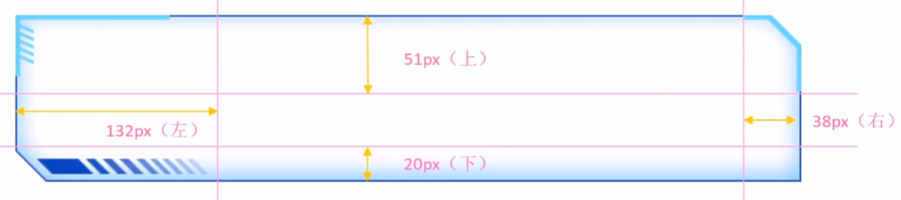

# CSS

## 第1章 CSS基础知识

### 1.1 CSS结构与类型

1. 结构：头部`<head>`里写`<style>...</style>`

2. 样式表类型：

   1）内部样式表：单独写到style标签内部

   ```html
   <style>
     div {
       color: pink;
     }
   </style>
   ```
   
   2）行内样式表：直接在标签内写样式属性
   
   ```html
   <p style="color: pink; font-size: 20px">给我一个粉红的回忆</p>
   ```
   
   3）外部样式表：
   
   ```html
   <link rel="stylesheet" href="style.css">
   ```

### 1.2 CSS书写顺序

1. 布局定位

   ```css
   display / position / float / clear / visibility / overflow
   ```

2. 自身属性

   ```css
   width / height / margin / padding / margin / border / background
   ```

3. 文本属性

   ```css
   color / font / text-decoration / text-align / vertical-align / white-space / break-word
   ```

4. 其他属性

   ```css
   content / cursor / border-radius / box-shadow / text-shadow / background:linear-gradient
   ```

### 1.3 CSS常用工具

#### 1.3.1 emmet语法

1. 标签：

   1）输入标签名，按Tab键即可生成

   2）生成多个相同标签，加上`*`即可，如：`div*3 ` + Tab

   3）生成多个不同选择器的div：`.name1+.name2+...+.namex` + Tab

   4）生成父子级关系标签，用>即可，如：`ul>li` + Tab

   5）生成兄弟级关系标签，用+即可，如：`div+p `+ Tab

   6）生成带有类名或id名的标签，用 `标签名.name或#name` + Tab

   7）生成带顺序的标签，用 `标签名$.name*n` + Tab

   8）生成标签内部写内容，用{}表示：`标签名{}` + Tab

2. 样式名缩写:数值 + Tab

   1）`w200` --> width:200px

   2）`lh26` --> line-height:26px

   3）`ti2` --> text-indent: 2em

3. 首字母缩写 + Tab

   1）`tac` --> text-align: center

   2）`tdn` --> text-decoration: none

#### 1.3.2 自动格式化代码

* 设置 --> emmet.include--> settings.json

  ```json
  "editor.formatOnType": true
  "editor.formatOnSave": true
  ```

#### 1.3.3 兼容性检查

* 网站：[caniuse.com](https://caniuse.com/)

### 1.4 CSS初始化

1. CSS reset：消除不同浏览器差异，重设浏览器样式

2. 所有标签`*`：内外边距清零

   ```css
   * {
     margin: 0;
     padding: 0;
   }
   ```

3. 文字样式`em, i`：不倾斜

   ```css
   em,
   i {
     font-style: normal;
   }
   ```

4. 列表项目`li`：去掉圆点

   ```css
   il {
     list-style: none;
   }
   ```

5. 图片`img`：去除边框、消除图片底侧的空白缝隙

   ```css
   img {
     /* 照顾低版本浏览器，如果图片外面包含了链接会有边框的问题 */
     border: 0;
     /* 取消图片底侧有空白缝隙的问题 */
     vertical-align: middle;
   }
   ```

6. 按钮`buttton`：鼠标经过时变为小手、设置字体

   ```css
   button {
     cursor: pointer;
   }
   ```

7. 超链接`a`：删除下划线、设置鼠标经过颜色

   ```css
   a {
     color: #666;
     text-decoration: none;
   }
   a:hover {
     color: #c81623;
   }
   ```

8. 输入框`input`：设置字体

   ```css
   button,
   input {
     /* "\5B8B\4F53" 就是宋体的意思 这样浏览器兼容性比较好 */
     font-family: Microsoft YaHei, Heiti SC, tahoma, arial, Hiragino Sans GB, '\5B8B\4F53', sans-serif;
   }
   ```

9. 主体`body`：CSS3抗锯齿性、背景色、字体（"\5B8B\4F53"代表宋体）、字体颜色

   ```css
   body {
     /* CSS3抗锯齿形：让文字显示的更加清晰 */
     -webkit-font-smoothing: antialiased;
     background-color: #fff;
     font: 12px/1.5 Microsoft YaHei, Heiti SC, tahoma, arial, Hiragino Sans GB, '\5B8B\4F53', sans-serif;
     color: #666;
   }
   ```

10. 清除浮动：.clearfix:after；.clearfix

    ```css
    .clearfix:after {
      visibility: hidden;
      clear: both;
      display: block;
      content: '.';
      height: 0;
    }
    
    .clearfix {
      *zoom: 1;
    }
    ```

### 1.5 网站标准

#### 1.5.1 文件结构

1. 样式：css

   1）初始化样式：base.css

   2）公共样式：common.css

   * 首页
   * 列表页
   * 详情页

2. 脚本：js

3. 素材：images

4. 产品：upload

5. 字体：fonts

#### 1.5.2 开发技巧

1. 导航栏：

   1）用`<li>`包含`<a>`，并给`<li>`加浮动

   2）如果直接用`<a>`，搜索引擎容易辨别为有堆砌关键字嫌疑，降低排名

   3）由于导航栏文字不一样多，给`<a>`左右padding撑开盒子，而不是给宽度

2. 陈列窗的图片，设定 `width=100%`，这样不会超出盒子大小

#### 1.5.3 头部 head

1. 浏览器私有前缀

   1）firefox：`-moz-border-radius: 10px`

   2）Safari/Chrome：`-webkit-border-radius: 10px`

   3）Opera：`-o-border-radius: 10px`

   4）最后添加：`border-radius: 10px`

2. SEO优化：TDK

   1）标题：网站名（产品名）-网站介绍30字内

   ```html
   <title>website name-awesome website</title>
   ```

   2）网站说明：SEO专业文案

   ```html
   <meta name="description" content="XXX" />
   ```

   3）关键字：6~8个关键词逗号隔开

   ```html
   <meta name="keywords" content="XXX" />
   ```

3. favicon图标

   ```html
   <link rel="shortcut icon" href="favicon.ico" />
   ```

#### 1.5.4 常用模块命名

1. 快捷导航栏：`shortcut`
2. 购物车：`shopcar`
3. 热点词：`hotwords`
4. 导航：`nav`
5. 导航左侧：`dropdown` 包含 `.dd``.dt`
6. 导航右侧：`navitems`
7. 页面底部服务模块：`mod_service`
8. 页面底部帮助模块：`mod_help`
9. 页面底部版权模块：`mod_copyright`

#### 1.5.5 LOGO SEO优化

1. `<h1>`标签提升权重，里面放置链接可返回首页，背景图设置为logo

2. 链接里面放文字但不显现：

   1）方法1（淘宝）

   ```css
   text-indent:-9999px;
   overflow：hidden
   ```

   2）方法2（京东）

   ```css
   font-size: 0
   ```

3. 给链接一个 title 属性，鼠标放在logo上显示提示文字

#### 1.5.6 Tab栏切换

1. 用JavaScript实现，但是对HTML结构有严格要求
2. 分为2个部分：tab_list、tab_content
3. 可以用box_hd装tab-list，用box_bd装tab-content

#### 1.5.7 注册界面

1. 不需要做SEO优化，因为保护个人信息隐私

2. 常用写法：

   1）注册专区：registerarea

   2）注册内容：reg-form

   3）错误/成功/默认：error/success/default

------

## 第2章 基础属性

### 2.1 字体属性

1. `font-style`：文字风格

   1）正常：normal

   2）倾斜：italic

   ```css
   em {
     /* 让倾斜的字体不倾斜*/
     font-style: normal;
   }
   ```

2. `font-weight`：字体粗细（无单位）

   1）正常：400

   2）加粗：700

3. `font-size`：字体大小，标题h1~h6需要单独指定文字大小

   ```css
   h2 {
     font-weight: 400;
   }
   ```

4. `font-family`：字体类型，可以写多个，用逗号隔开

   ```css
   font-family: 'Times New Roman', Times, serif;
   ```

5. `font`：复合简写，默认顺序：文字风格、字体粗细、字体大小/行高、字体类型

   ```css
   font: font-style font-weight font-size/line-height font-family
   
   font: italic 700 16px 'Microsoft yahei';
   font: 12px/1.5 'Microsoft YaHei';
   ```

------

### 2.2 文本属性

1. `color`：颜色

   1）预定义文字：deeppink

   2）十六进制：#cc00ff

   3）RGB：rgb(255, 0, 255)

   ```css
   div {
     /* color: deeppink; */
     /* color: #cc00ff; */
     color: rgb(255, 0, 255);
   }
   ```

2. `text-align`：对齐

   1）left：默认，左对齐

   2）right：右对齐

   3）center：居中对齐（图片居中对齐，要为其父元素添加此代码）

   ```css
   h1 {
     /* 本质是让h1盒子里面的文字水平居中对齐 */
     /* text-align: center; */
     text-align: right;
   }
   ```

3. `text-decoration`：装饰

   1）none：默认，无

   2）underline：下划线

   3）overline：上划线

   4）line-through：删除线

   ```css
   div {
     /* 下划线 */
     text-decoration: underline;
     /* 删除线 */
     text-decoration: line-through;
     /* 上划线 */
     text-decoration: overline;
   }
   
   a {
     /* 取消a默认的下划线 */
     text-decoration: none;
     color: #333;
   }
   ```

4. `text-indent`：缩进，单位：em，表示缩进几个文字大小

   ```css
   p {
     /* 文本的第一行首行缩进多少距离  */
     text-indent: 20px;
     /* 如果写了2em，则是缩进当前元素2个文字大小的距离  */
     text-indent: 2em;
   }
   ```

5. `line-height`：行间距，单位：px，如果写成【字体大小/行高X】的样式，则行高为字体大小的X倍

   ```css
   div {
     line-height: 26px;
   }
   ```

6. `user-select`：用户是否可以选中文字

   1）auto：默认，可选中

   2）none：不可选中

------

### 2.3 透明度属性

1. `opacity(0~1)`：0完全透明，1完全不透明

------

### 2.4 背景属性

1. 背景颜色：`background-color`

   1）颜色：pink ....

   2）透明：transparent

   3）半透明：rgba（X, X, X, alpha【0~1小数】）

   ```css
   div {
     width: 200px;
     height: 200px;
     /* 透明 */
     background-color: transparent;
     /* 红色 */
     background-color: red;
     /* 半透明 */
     background-color: rgba(0, 0, 0, 0.3);
   }
   ```

2. 背景图片：`background-img`

   1）参数：`url（images/logo.png）`

   2）注意：页面元素既可以添加背景颜色也可以添加背景图片，只不过背景图片会压住背景颜色

   ```css
   div {
     width: 300px;
     height: 300px;
     background-image: url(images/logo.png);
   }
   ```

3. 背景平铺：`background-repeat`

   1）不平铺：no-repeat

   2）平铺：repeat

   3）沿着X轴平铺：repeat-x

   4）沿着Y轴平铺：repeat-y

   ```css
   div {
     width: 300px;
     height: 300px;
     background-image: url(images/logo.png);
     /* 1.背景图片不平铺 */
     background-repeat: no-repeat;
     /* 2.默认的情况下,背景图片是平铺的 */
     background-repeat: repeat;
     /* 3.沿着x轴平铺 */
     background-repeat: repeat-x;
     /* 4. 沿着Y轴平铺 */
     background-repeat: repeat-y;
   }
   ```

4. 背景固定：`background-attachment`

   1）背景图片固定：fixed

   2）随着页面其余部分滚动：scroll

   ```css
   body {
     background-image: url(images/bg.jpg);
     background-repeat: no-repeat;
     background-position: center top;
     /* 把背景图片固定住 */
     background-attachment: fixed;
     color: #fff;
     font-size: 20px;
   }
   ```

5. 背景位置：`background-position：x y`

   1）方位名词：`top`、`center`、`bottom`、`left`、`center`、`right`

   * 先写哪个没关系，center right 和 right center是等价的，默认居中对齐

   2）精确单位：

   * 百分数、浮点数字+单位标识符
   * 顺序：第一个肯定是X坐标，第二个肯定是Y坐标（距上顶、左侧的距离）

   3）混合单位：

   * 方位名词+精确单位：第一个肯定是X坐标，第二个肯定是Y坐标
   * 注意：x和y之间没有逗号，是空格！

   ```css
   div {
     width: 300px;
     height: 300px;
     background-color: pink;
     background-image: url(images/logo.png);
     background-repeat: no-repeat;
     /* x轴20，y轴50 */
     background-position: 20px 50px;
     /* x轴20，y轴垂直居中 */
     background-position: 20px;
     /* 中间靠上 */
     background-position: center top;
     /* 中间靠右 */
     background-position: right center;
     /* 水平靠右：第二个参数省略，y轴垂直居中 */
     background-position: right;
     /* 中间靠上：第二个参数省略，y轴垂直居中 */
     background-position: top;
     /* x轴水平居中，y轴20 */
     background-position: center 20px;
   }
   ```

6. 背景缩放：`background-size：x y`

   1）像素单位px：宽、高，只写一个则默认是宽度，高度随着等比例缩放

   2）百分比单位%：相对于父级盒子拉伸，只写一个则默认是宽度，高度随着等比例缩放

   3）cover：等比例拉伸铺满，可能有部分背景图显示不全

   4）contain：宽高等比例拉伸，如果宽或高其中一个铺满盒子就不再拉伸，可能有部分空白

   5）注意：x和y之间没有逗号，是空格！

   ```html
   <style>
     div {
       width: 500px;
       height: 500px;
       border: 2px solid red;
       background: url(images/dog.jpg) no-repeat;
       /* 1. 像素单位px：宽、高，只写一个则默认是宽度，高度随着等比例缩放 */
       background-size: 500px 200px;
       background-size: 500px;
       /* 2. 百分比单位%：相对于父级盒子拉伸 */
       background-size: 50%;
       /* 3. cover：等比例拉伸铺满，可能有部分背景图显示不全 */
       background-size: cover;
       /* 4. contain：宽高等比例拉伸，如果宽或高其中一个铺满盒子就不再拉伸，可能有部分空白 */
       background-size: contain;
     }
   </style>
   ```

7. 复合简写：`background`，默认顺序：颜色、图片地址、平铺、固定、位置 / 缩放

   ```css
   background: url(../images/bg.jpg) no-repeat 0 0 / cover;
   ```

8. 背景渐变：`background: -webkit-linear-gradient（起始方向，颜色1，眼色2，……）`

   1）方位名词：`top`(默认)、`bottom`、`left`、`right`，以及它们的组合使用

   2）注意：必须添加浏览器私有前缀
   
   ```html
   <style>
     div {
       width: 600px;
       height: 200px;
       /* 背景渐变必须添加浏览器私有前缀 */
       /* background: -webkit-linear-gradient(left, red, blue); */
       /* background: -webkit-linear-gradient(red, blue); */
       background: -webkit-linear-gradient(top left, red, blue);
     }
   </style>
   <div></div>
   ```

------

### 2.5 边框属性

#### 2.5.1 默认边框 border

> 边框会向外延伸大小，如盒子大小为200px，10px的边框让盒子整体变为220px

1. 边框粗细：`border-width`，单位：px

2. 边框颜色：`border-color`

3. 边框样式：`border-style`

   1）实线边框：solid

   2）虚线边框：dashed

   3）点线边框：dotted

   ```css
   div {
     width: 300px;
     height: 200px;
     /* border-width 边框的粗细 */
     border-width: 5px;
     /* border-style 边框的样式*/
     border-style: solid;
     border-style: dashed;
     border-style: dotted;
     /* border-color 边框颜色  */
     border-color: pink;
   }
   ```

4. 边框位置：

   1）上边框：`border-top`

   2）下边框：`border-bottom`

   3）左边框：`border-left`

   4）右边框：`border-right`

5. 复合简写：`border`，没有顺序：粗细、样式、颜色

   ```css
   div {
     width: 300px;
     height: 200px;
     /* 边框的复合写法 */
     border: 5px solid pink;
     /* 上边框 */
     border-top: 5px solid pink;
     /* 下边框 */
     border-bottom: 10px dashed purple;
   }
   ```

6. 表格相邻边框合并：`border-collapse`

   1）分开：separate（默认）

   2）合并：collapse

   ```css
   table {
     width: 500px;
     height: 249px;
   }
   th {
     height: 35px;
   }
   table,
   td,
   th {
     border: 1px solid pink;
     /* 合并相邻的边框 */
     border-collapse: collapse;
     font-size: 14px;
     text-align: center;
   }
   ```

7. 相邻单元格边框间距：`border-spacing`

   1）仅用于“边框分离 separate”模式

   2）两个数值：水平间隔px，垂直间隔px

------

#### 2.5.2 圆角边框 border-radius

1. 边框半径：

   1）单位：px

   2）百分比：50%（半径是宽高的一半，可以做圆形）

2. 多种写法：例：`border-top-left-radius`

3. 复合简写：`border-radius`，顺序：左上、右上、右下、左下（规则与padding相同）

   ```css
   <style>
     .yuanxing {
       width: 200px;
       height: 200px;
       background-color: pink;
       /* border-radius: 100px; */
       /* 50% 就是宽度和高度的一半  等价于 100px */
       border-radius: 50%;
     }
     .juxing {
       width: 300px;
       height: 100px;
       background-color: pink;
       /* 圆角矩形设置为高度的一半 */
       border-radius: 50px;
     }
     .radius {
       width: 200px;
       height: 200px;
       border-radius: 10px 20px 30px 40px;
       /* border-radius: 10px 40px; */
       /* border-top-left-radius: 20px; */
       background-color: pink;
     }
   </style>
   
   1. 圆形的做法:
   <div class="yuanxing"></div>
   2. 圆角矩形的做法:
   <div class="juxing"></div>
   3. 可以设置不同的圆角:
   <div class="radius"></div>
   ```

------

#### 2.5.3 边框图片 border-image

> 需要与border、border-width、内部盒子相配合使用，盒子模型设置为 `box-sizing:border-box`

1. 作用：盒子大小不一，但边框样式相同，可以自定义边框样式

2. 图片路径：`border-image-source:url(...)`

3. 边框切图：`border-image-slice`

   

   1）原理：把四个角切出去（类似九宫格），中间部分可以铺排、拉抻、环绕

   2）顺序：上、右、下、左（不加单位）

   ```css
   border-image-slice: 51 38 20 132;
   ```

4. 边框宽度：`border-image-width`，里面的内容不会被挤压、保持原位

5. 边框平铺：拉抻的是九宫格上下左右中间部分

   1）平铺：repeat

   2）铺满：round

   3）拉抻：stretch（默认）

------

### 2.6 边距属性

> 不同浏览器有不同的默认设定值，为了统一起见，最好清除默认边距：`* {margin: 0;padding: 0;}`

#### 2.6.1 内边距：padding

> 内边距会向外延伸大小，如盒子大小为200px，10px的边距让盒子整体变为220px。

1. 内边距：`padding-XXX`，顺时针顺序：上/右/下/左（top/right/bottom/left)

   ```css
   div {
     width: 200px;
     height: 200px;
     background-color: pink;
     padding-left: 20px;
     padding-top: 30px;
   }
   ```

2. 复合简写：`padding`

   1）1个值：padding: 5px （上下左右都有5px内边距）

   2）2个值：padding: 5px 10px（上下5px，左右10px）

   3）3个值：padding: 5px 10px 20px（上5px，左右10px，下20px）

   4）4个值：padding: 5px 10px 20px 30px（上5px，左10px，右20px，下30px）

   ```css
   div {
     width: 200px;
     height: 200px;
     background-color: pink;
     /* 内边距复合写法 */
     padding: 5px;
     padding: 5px 10px;
     padding: 5px 10px 20px;
     padding: 5px 10px 20px 30px;
   }
   ```

3. 注意：

   1）如果盒子本身没有指定width/height属性，则padding不会撑开盒子大小

   2）对于子级元素，如果仅是继承了父级元素的width/height属性，padding也不会撑开盒子大小

------

#### 2.6.2 外边距：margin

> 外边距不会撑大盒子，但会使盒子周围出现空白。

1. 外边距：`margin-XXX`，顺时针顺序：上/右/下/左（top/right/bottom/left)

2. 块级元素水平居中：

   ```css
   margin-left/right: auto
   margin: auto
   margin: 0 auto
   ```

   ```css
   .header {
     width: 900px;
     height: 200px;
     background-color: pink;
     margin: 100px auto;
   }
   ```

3. 行内、行内块元素水平居中

   ```css
   text-align：center
   ```

   ```css
   .header {
     width: 900px;
     height: 200px;
     background-color: pink;
     margin: 100px auto;
     text-align: center;
   }
   ```

4. 复合简写：`margin`（与padding规则相同）

   * 特殊应用：auto自动适应

   ```css
   margin：100px auto
   ```

5. 外边距合并问题

   1）相邻块元素垂直外边距合并：总边距取最大值(上盒子`margin-bottom`，下盒子`margin-top`)

   ```html
   <style>
     .damao,
     .ermao {
       width: 200px;
       height: 200px;
       background-color: pink;
     }
     .damao {
       margin-bottom: 100px;
     }
     .ermao {
       margin-top: 200px;
     }
   </style>
   <!--总边距：200px-->
   <div class="damao">大毛</div>
   <div class="ermao">二毛</div>
   ```

   2）嵌套块元素垂直外边距塌陷：对于嵌套父子元素，父元素有上边距，同时子元素也有上边距，此时父元素会塌陷较大的外边距值

   * 为父元素定义上边框：`border: 1px solid transparent`
   * 为父元素定义上内边框：`padding: 1px`
   * 为父元素添加：`overflow: hidden`
   * 注意：浮动、固定、绝对定位的盒子不会有塌陷问题

   ```html
   <style>
     .father {
       width: 400px;
       height: 400px;
       background-color: purple;
       margin-top: 50px;
       /* border: 1px solid red; */
       /* border: 1px solid transparent; */
       /* padding: 1px; */
       overflow: hidden;
     }
     .son {
       width: 200px;
       height: 200px;
       background-color: pink;
       margin-top: 100px;
     }
   </style>
   
   <div class="father">
     <div class="son"></div>
   </div>
   ```

6. margin负值应用：浮动盒子一行紧密排列时，如果都有边框，会出现边框合并变粗的问题

   1）写法：`margin-left：-1`

   2）鼠标移动时显示边框

   * 若盒子无定位，hover里加 `pisition：relative`，可覆盖盒子
   * 若盒子有定位，hover里加 `z-index：1`，提高层级

   ```html
   <style>
     ul li {
       position: relative;
       float: left;
       list-style: none;
       width: 150px;
       height: 200px;
       border: 1px solid red;
       margin-left: -1px;
     }
     
     /* 1. 如果盒子没有定位，则鼠标经过添加相对定位即可 */
     /* ul li:hover {
       position: relative;
       border: 1px solid blue;
     } */
     
     /* 2.如果li都有定位，则利用 z-index提高层级 */
     ul li:hover {
       z-index: 1;
       border: 1px solid blue;
     }
   </style>
   <ul>
     <li>1</li>
     <li>2</li>
     <li>3</li>
     <li>4</li>
     <li>5</li>
   </ul>
   ```

   

------

### 2.7 列表属性

1. 列表项的标记：`list-style-type`

   1）去掉小圆点：none

   2）实心圆：disc

   3）空心圆：circle

   4）实心方块：suqare

   5）阿拉伯数字：decimal

------

### 2.8 阴影属性

1. 盒子阴影：`box-shadow`

   1）h-shadow：水平阴影距离，允许负值

   2）v-shadow：垂直阴影距离，允许负值

   3）blur：模糊距离，可选

   4）spread：阴影尺寸，可选

   5）color：阴影颜色，可选

   6）inset：将外部阴影(outset)改为内部阴影，可选

   ```css
   div {
     width: 200px;
     height: 200px;
     background-color: pink;
     margin: 100px auto;
   }
   div:hover {
     box-shadow: 10px 10px 10px -4px rgba(0, 0, 0, 0.3);
   }
   ```

2. 文字阴影：`text-shadow`

   1）h-shadow：水平阴影距离，允许负值

   2）v-shadow：垂直阴影距离，允许负值

   3）blur：模糊距离，可选

   4）color：阴影颜色，可选
   
   ```css
   div {
     font-size: 50px;
     color: orangered;
     font-weight: 700;
     text-shadow: 5px 5px 6px rgba(0, 0, 0, 0.3);
   }
   ```

------

## 第3章 高级属性

### 3.1 盒子模型 box-sizing

1. `content-box`（默认）：盒子大小 = width+padding+border

2. `border-box`：盒子大小 = width（无需再担心边框、内边距撑大盒子）

   * 注意：此时使用`line-height=height`值不一定能居中对齐了，需要将`line-height`设置为`height减去边框后的大小`

   ```html
   <style>
     div:nth-child(1) {
       /* 传统盒子模型：盒子大小 = width + border + padding */
       width: 200px;
       height: 200px;
       background-color: pink;
       padding: 10px;
       border: 10px solid red;
       box-sizing: content-box;
     }
     div:nth-child(2) {
       /* CSS3盒子模型：盒子大小 = width */
       /* padding 和 border 不会撑大盒子 */
       box-sizing: border-box;
       width: 200px;
       height: 200px;
       background-color: purple;
       padding: 10px;
       border: 10px solid blue;
     }
   </style>
   <div></div>
   <div></div>
   ```

### 3.2 图片滤镜 filter

1. `blur(5px)`：图片模糊，括号中填写像素大小，越大越模糊

   ```html
   <style>
     img {
       /* blur是一个函数：括号里面数值越大，图片越模糊，注意数值要加px单位 */
       filter: blur(15px);
     }
     img:hover {
       filter: blur(0);
     }
   </style>
   
   ```

### 3.3 计算函数 calc()

1. 宽度计算：`width:calc(100%-30)`，子元素比父元素宽度小30px

   ```html
   <style>
     .father {
       width: 300px;
       height: 200px;
       background-color: pink;
     }
     .son {
       /* width: calc(150px + 30px); */
       width: calc(100% - 30px);
       height: 30px;
       background-color: skyblue;
     }
   </style>
   <!-- 子盒子宽度永远比父盒子小30像素 -->
   <div class="father">
     <div class="son"></div>
   </div>
   ```

### 3.4 过渡效果 transition

1. 作用：可以不用Flash或JS的情况下制作元素样式变换的效果，常与`:hover`配合使用

2. 书写位置：谁做过渡给谁加，要写在原来的元素上！

   ```html
   <style>
     div {
       width: 200px;
       height: 100px;
       background-color: pink;
       /* transition: 变化的属性、花费时间、运动曲线、何时开始; */
       transition: width .5s ease 0s, height .5s ease 1s;
       /* 如果想要写多个属性，利用逗号进行分割 */
       transition: width .5s, height .5s;
       /* 如果想要多个属性都变化，属性写all就可以了 */
       transition: height .5s ease 1s;
       /* 谁做过渡，给谁加 */
       transition: all 0.5s;
     }
     div:hover {
       width: 400px;
       height: 200px;
       background-color: skyblue;
     }
   </style>
   <div></div>
   ```

3. 属性：添加多个属性可用逗号分隔，按顺序写

   1）要变换的属性：如width、height，全部变换为all

   2）花费时间 ：如 .5s

   3）运动曲线：

   * 逐渐变慢：`ease`（默认）
   * 匀速：`linear`
   * 加速：`ease-in`
   * 减速：`ease-out`
   * 先加速再减速：`ease-in-out`

   4）何时开始：延迟触发时间，如 .5s，可省略

   ```html
   <!--案例：进度条-->
   <style>
     .bar {
       width: 150px;
       height: 15px;
       border: 1px solid red;
       border-radius: 7px;
       padding: 1px;
     }
     .bar_in {
       width: 50%;
       height: 100%;
       background-color: red;
       border-radius: 7px 0 0 7px;
       /* 谁做过渡给谁加 */
       transition: all 0.7s;
     }
     .bar:hover .bar_in {
       width: 100%;
     }
   </style>
   ```

### 3.5 2D转换 transform

1. 位移：`translate(x,y)`

   1）单位：px 或 百分比%（相对于自身）

   2）沿轴移动：`translateX(n)`、`translateY(n)`

   ```html
   <style>
     div {
       width: 200px;
       height: 200px;
       background-color: pink;
       margin-top: 30px;
       /* transform: translate(x, y); */
       transform: translate(100px, 100px);
       /* 1. 如果只移动x坐标 */
       transform: translate(100px, 0);
       transform: translateX(100px);
       /* 2. 如果只移动y坐标 */
       transform: translate(0, 100px);
       transform: translateY(100px); 
     }
     div:first-child {
       transition: all 0.5s;
     }
     div:first-child:hover {
       transform: translate(0, -10px);
       background-color: rebeccapurple;
     }
     div:last-child {
       background-color: purple;
     }
   </style>
   <div></div>
   <div></div>
   ```

   3）水平垂直居中：绝对定位-50%，位移-50%

   ```html
   <style>
     div {
       position: relative;
       width: 500px;
       height: 500px;
       background-color: pink;
       /* 1. tranlate参数可以用 % */
       /* 2. 如果参数是 %，移动的距离是盒子自身的宽度或高度 */
       /* 这里的50%就是 50px，因为盒子的宽度是 100px */
       transform: translateX(50%);
     }
     p {
       position: absolute;
       top: 50%;
       left: 50%;
       width: 200px;
       height: 200px;
       background-color: purple;
       /* translate(-50%, -50%)：盒子往左右各走自己的一半  */
       transform: translate(-50%, -50%);
     }
     span {
       /* translate 对于行内元素是无效的 */
       transform: translate(300px, 300px);
     }
   </style>
   <div>
     <p></p>
   </div>
   ```

   4）注意：对行内元素无效，比如`<span>`

   ```html
   <style>
     span {
       /* translate 对于行内元素是无效的 */
       transform: translate(300px, 300px);
     }
   </style>
   <span>123</span>
   ```

2. 旋转：`rotate(n deg)`

   1）单位：deg，正数顺时针，负数逆时针

   ```html
   <style>
     img {
       width: 150px;
       border-radius: 50%;
       border: 5px solid pink;
       /* 过渡写到本身上，谁做动画给谁加 */
       transition: all 0.3s;
     }
     img:hover {
       /* 顺时针旋转360度 */
       transform: rotate(360deg);
     }
   </style>
   
   ```

   2）应用：制作CSS三角形，div旋转45度，只给底部、右侧边框

   ```html
   <style>
     div {
       position: relative;
       width: 249px;
       height: 35px;
       border: 1px solid #000;
     }
     div::after {
       content: '';
       position: absolute;
       top: 8px;
       right: 15px;
       width: 10px;
       height: 10px;
       border-right: 1px solid #000;
       border-bottom: 1px solid #000;
       transform: rotate(45deg);
       transition: all 0.2s;
     }
     /* 鼠标经过div，里面的三角旋转 */
     div:hover::after {
       transform: rotate(225deg);
     }
   </style>
   <div></div>
   ```

3. 中心点：`transform-origin:x y`

   1）像素：px（x和y之间没有逗号，是空格！）

   2）方位名词：left、right、top、bottom、center

   3）百分比：50% 50%（默认，等价于center center）

   ```html
   <style>
     div {
       width: 200px;
       height: 200px;
       background-color: pink;
       margin: 100px auto;
       transition: all 1s;
       /* 1. 方位名词 */
       transform-origin: left bottom;
       /* 2. 默认50% 50%，等价于center center */
       transform-origin: 50% 50%;
       /* 3. 可以是px 像素 */
       transform-origin: 50px 50px;
     }
     div:hover {
       transform: rotate(360deg);
     }
   </style>
   <div></div>
   ```

   4）应用：制作鼠标移动从底部旋转出现的效果

   ```html
   <style>
     div {
       float: left;
       overflow: hidden;
       width: 200px;
       height: 200px;
       margin: 10px;
       border: 1px solid pink;
     }
     div::before {
       display: block;
       content: '黑马';
       text-align: center;
       line-height: 200px;
       width: 100%;
       height: 100%;
       background-color: hotpink;
       transform: rotate(180deg);
       transform-origin: left bottom;
       transition: all 0.4s;
     }
     /* 鼠标经过div，里面的before 复原 */
     div:hover::before {
       transform: rotate(0deg);
     }
   </style>
   <div></div>
   <div></div>
   <div></div>
   ```

4. 缩放：`scale(x,y)`

   1）2个数字：等于倍数，如scale(2,3)即宽度变成2倍，高度变成3倍

   2）1个数字：等于倍数，如scale(2)即宽高都变成2倍

   3）可以设置缩放中心点，如果写了宽高则以最新数值为参考，且不影响其他盒子位置

   ```html
   <style>
     div {
       width: 200px;
       height: 200px;
       background-color: pink;
       margin: 100px auto;
       /* 缩放中心点，如果写了宽高则以最新数值为参考 */
       transform-origin: left bottom;
     }
     div:hover {
       /* 1. 参数无单位，代表倍数：transform: scale(x, y) */
       transform: scale(2, 2);
       /* 2. 修改宽度为原来的2倍，高度不变 */
       transform: scale(2, 1);
       /* 3. 等比例缩放：同时修改宽度和高度 */
       transform: scale(2);
       /* 4. 缩放：参数小于1 */
       transform: scale(0.5, 0.5);
       transform: scale(0.5);
       /* 5. scale 的优势：不会影响其他的盒子，而且可以设置缩放的中心点 */
       width: 300px;
       height: 300px;
       transform: scale(2);
     }
   </style>
   ```

   ```html
   <!--案例：图片放大-->
   <style>
     div {
       overflow: hidden;
       float: left;
       margin: 10px;
     }
     div img {
       transition: all 0.4s;
     }
     div img:hover {
       transform: scale(1.1);
     }
   </style>
   <div>
     <a href="#"></a>
   </div>
   ```

   ```html
   <!--案例：分页按钮-->
   <style>
     li {
       float: left;
       width: 30px;
       height: 30px;
       border: 1px solid pink;
       margin: 10px;
       text-align: center;
       line-height: 30px;
       list-style: none;
       border-radius: 50%;
       cursor: pointer;
       transition: all 0.4s;
     }
     li:hover {
       transform: scale(1.2);
     }
   </style>
   <ul>
     <li>1</li>
     <li>2</li>
     <li>3</li>
   </ul>
   ```

5. 复合简写：`transform: translate(x,y) rotatae(n deg) scale(n)`

   * 注意：书写顺序会影响效果，有位移的时候必须先写位移

   ```html
   <style>
     div {
       width: 200px;
       height: 200px;
       background-color: pink;
       transition: all 0.5s;
     }
     div:hover {
       /* 以下两种效果完全不同 */
       transform: translate(150px, 50px) rotate(180deg);
       transform: rotate(180deg) translate(150px, 50px);
       
       /* 同时有位移和其他属性，需要把位移放到最前面 */
       transform: translate(1200px, 0px) rotate(180deg) scale(1.2);
     }
   </style>
   ```

### 3.5 3D转换 transform

1. 坐标系：x轴右正左负，y轴下正上负，z轴外正里负

2. 透视：`perspective`

   1）单位：px，数值越小，盒子越大

   2）写到被观察元素的父盒子上面，即眼睛到屏幕的距离，近大远小

3. 3D移动：`translate3d（x,y,z）`

   1）等价写法：`transform: translateX(n) translateY(n) translateZ(n)`

   2）x、y、z不能省略，没有就写0

   ```html
   <style>
     body {
       /* 透视写到被观察元素的父盒子上面 */
       perspective: 200px;
     }
     div {
       width: 200px;
       height: 200px;
       background-color: pink;
       transform: translateX(100px) translateY(100px) translateZ(100px); 
       /* 简写方法 */
       transform: translate3d(100px, 100px, 100px);
     }
   </style>
   ```

4. 3D旋转：`rotate3d（x,y,z,deg）`

   1）x,y,z用：0/1 代表是否选中，并合成矢量，例：rotate3d(1, 1, 0, 45deg)

   2）等价写法：`transform:rotateX(n deg) rotateY(n deg) rotateZ(n deg)`

   3）X/Y/旋转：左手准则，大拇指指向正轴，四指弯曲指向正角度旋转方向

   4）Z轴旋转：类似2D旋转效果

   ```html
   <style>
     body {
       perspective: 500px;
     }
     img {
       display: block;
       margin: 100px auto;
       transition: all 1s;
     }
     img:hover {
       /* transform: rotateZ(180deg); */
       /* transform: rotate3d(x,y,z,deg); */
       /* transform: rotate3d(1, 0, 0, 45deg); */
       /* transform: rotate3d(0, 1, 0, 45deg); */
       transform: rotate3d(1, 1, 0, 45deg);
     }
   </style>
   
   ```

5. 3D呈现：`trasnform-style`

   1）preserve-3d：让子元素保持3D立体空间环境

   2）flat：默认，子元素不开启3D立体空间环境
   
   ```html
   <style>
     body {
       perspective: 500px;
     }
     .box {
       position: relative;
       width: 200px;
       height: 200px;
       margin: 100px auto;
       transition: all 2s;
       /* 让子元素保持3d立体空间环境 */
       transform-style: preserve-3d;
     }
     .box:hover {
       transform: rotateY(60deg);
     }
     .box div {
       position: absolute;
       top: 0;
       left: 0;
       width: 100%;
       height: 100%;
       background-color: pink;
     }
     .box div:last-child {
       background-color: purple;
       transform: rotateX(60deg);
     }
   </style>
   <div class="box">
     <div></div>
     <div></div>
   </div>
   ```

6. 案例：两面反转的盒子

   ```html
   <style>
     body {
       perspective: 400px;
     }
     .box {
       position: relative;
       width: 300px;
       height: 300px;
       margin: 100px auto;
       transition: all 0.4s;
       /* 让背面的盒子保留立体空间 */
       transform-style: preserve-3d;
     }
     .box:hover {
       transform: rotateY(180deg);
     }
     .front,
     .back {
       position: absolute;
       top: 0;
       left: 0;
       width: 100%;
       height: 100%;
       border-radius: 50%;
       font-size: 30px;
       color: #fff;
       text-align: center;
       line-height: 300px;
     }
     .front {
       background-color: pink;
       z-index: 1;
     }
     .back {
       background-color: purple;
       /* 背靠背旋转 */
       transform: rotateY(180deg);
     }
   </style>
   <div class="box">
     <div class="front">黑马程序员</div>
     <div class="back">pink老师这里等你</div>
   </div>
   ```

7. 案例：3D导航

   ```html
   <style>
     * {
       margin: 0;
       padding: 0;
     }
     ul {
       margin: 100px;
     }
     ul li {
       float: left;
       margin: 0 5px;
       width: 120px;
       height: 35px;
       list-style: none;
       text-align: center;
       line-height: 35px;
       color: white;
       /* 子盒子都有透视效果 */
       perspective: 500px;
     }
     .box {
       position: relative;
       width: 100%;
       height: 100%;
       transform-style: preserve-3d;
       transition: all 0.4s;
     }
     .box:hover {
       transform: rotateX(90deg);
     }
     .front,
     .bottom {
       position: absolute;
       left: 0;
       top: 0;
       width: 100%;
       height: 100%;
     }
     .front {
       background-color: pink;
       color: purple;
       z-index: 1;
       /* 注意：如果在正面的盒子不往前移动，则旋转效果会像T型一样，一定要保持中心点在立方体中间 */
       transform: translateZ(17.5px);
     }
     .bottom {
       background-color: purple;
       /* x轴一定是负值 */
       /* 如果有移动或者其他样式，必须先写移动 */
       transform: translateY(17.5px) rotateX(-90deg);
     }
   </style>
   <ul>
     <li>
       <div class="box">
         <div class="front">黑马程序员</div>
         <div class="bottom">pink老师等你</div>
       </div>
     </li>
     <li>
       <div class="box">
         <div class="front">黑马程序员</div>
         <div class="bottom">pink老师等你</div>
       </div>
     </li>
   </ul>
   ```

8. 案例：旋转木马

   ```html
   <style>
     body {
       perspective: 1000px;
     }
     section {
       position: relative;
       width: 300px;
       height: 200px;
       margin: 150px auto;
       transform-style: preserve-3d;
       /* 添加动画效果 */
       animation: rotate 10s linear infinite;
       background: url(media/pig.jpg) no-repeat;
     }
     section:hover {
       /* 鼠标放入section 停止动画 */
       animation-play-state: paused;
     }
     @keyframes rotate {
       0% {
         transform: rotateY(0);
       }
       100% {
         transform: rotateY(360deg);
       }
     }
     section div {
       position: absolute;
       top: 0;
       left: 0;
       width: 100%;
       height: 100%;
       background: url(media/dog.jpg) no-repeat;
     }
     section div:nth-child(1) {
       transform: rotateY(0) translateZ(300px);
     }
     section div:nth-child(2) {
       /* 先旋转、再移动距离 */
       transform: rotateY(60deg) translateZ(300px);
     }
     section div:nth-child(3) {
       /* 先旋转、再移动距离 */
       transform: rotateY(120deg) translateZ(300px);
     }
     section div:nth-child(4) {
       /* 先旋转、再移动距离 */
       transform: rotateY(180deg) translateZ(300px);
     }
     section div:nth-child(5) {
       /* 先旋转、再移动距离 */
       transform: rotateY(240deg) translateZ(300px);
     }
     section div:nth-child(6) {
       /* 先旋转、再移动距离 */
       transform: rotateY(300deg) translateZ(300px);
     }
   </style>
   <section>
     <div></div>
     <div></div>
     <div></div>
     <div></div>
     <div></div>
     <div></div>
   </section>
   ```

### 3.6 轮播图 swiper

1. 插件工具：swiper，网址：[www.swiper.com.cn](www.swiper.com.cn)
2. 下载文件：swiper.min.js、swiper.min.css
3. 使用方法：找到案例查看源码，复制HTML、CSS、JS代码，按需修改

------

## 第4章 动画效果

1. 语法：中间可以自定义百分比过程

   1）`@keyframes 动画名称 { 0% { 开始状态的效果 } 100% {结束状态的效果}}`

   2）`@keyframes 动画名称 { from { 开始状态的效果 } to {结束状态的效果}}`

   ```html
   <style>
     /* from to：等价于0%和100% */
     /* @keyframes move {
       from {
         transform: translate(0, 0);
       }
       to {
         transform: translate(1000px, 0);
       }
     } */
     /* 动画序列 */
     /* 1. 可以做多个状态的变化 keyframe 关键帧 */
     /* 2. 里面的百分比要是整数 */
     /* 3. 里面的百分比就是总的时间 */
     @keyframes move {
       0% {
         transform: translate(0, 0);
       }
       25% {
         transform: translate(1000px, 0);
       }
       50% {
         transform: translate(1000px, 500px);
       }
       75% {
         transform: translate(0, 500px);
       }
       100% {
         transform: translate(0, 0);
       }
     }
     div {
       width: 100px;
       height: 100px;
       background-color: pink;
       animation-name: move;
       animation-duration: 10s;
     }
   </style>
   <div></div>
   ```

2. 调用：至少写动画名称、动画时间2个属性，同一个元素中多个动画可以一起调用，用逗号隔开即可

3. 属性：

   1）动画名称（必填）：`animation-name`

   2）动画时间（必填）：`animation-duration`

   3）运动曲线：`animation-timing-function`

   * 效果：ease/ease-in/ease-out/ease-in-out/linear
   * 步长：steps（n），适合做轮播图式动画

   4）延迟时间：`animation-delay: 1s`

   5）重复次数：`animation-iteration-count: infinite/数字次数`

   6）反方向播放：`animation-direction: alternate（是）/normal（否）`

   7）结束后状态：`animation-fill-mode: forwards（停留在结束状态）/backwards（默认恢复初始状态）`

4. 播放状态：`animation-play-state: paused/running`

   ```html
   <style>
     @keyframes move {
       0% {
         transform: translate(0, 0);
       }
       100% {
         transform: translate(500px, 500px);
       }
     }
     div {
       width: 100px;
       height: 100px;
       background-color: pink;
       border-radius: 50%;
       box-shadow: 1px 1px 1px;
       /* 动画名称 */
       animation-name: move;
       /* 持续时间 */
       animation-duration: 1s;
       /* 运动曲线 */
       animation-timing-function: ease-in-out;
       /* 何时开始 */
       animation-delay: 1s;
       /* 重复次数 */
       animation-iteration-count: infinite;
       /* 是否反方向播放 */
       animation-direction: alternate;
       /* 动画结束后的状态 */
       animation-fill-mode: forwards;
     }
     div:hover {
       /* 鼠标经过停止动画，鼠标离开就继续动画 */
       animation-play-state: paused;
     }
   </style>
   <div></div>
   ```

5. 复合简写：动画名称(必填)，持续时间(必填)，运动曲线，延迟时间，重复次数，反方向播放，结束后状态

   ```css
   animation: name duration timing-function delay iteration-count direction fill-mode; 
   ```

   ```html
   <style>
     @keyframes move {
       0% {
         transform: translate(0, 0);
       }
       100% {
         transform: translate(500px, 500px);
       }
     }
     div {
       width: 100px;
       height: 100px;
       background-color: pink;
       border-radius: 50%;
       box-shadow: 1px 1px 1px;
       /* 复合简写：动画名称，持续时间，运动曲线，延迟时间，重复次数，反方向播放，结束后状态 */
       animation: name duration timing-function delay iteration-count direction fill-mode;
       animation: move 2s linear 0s 1 alternate forwards;
       animation: move 2s linear alternate forwards;
     }
     div:hover {
       /* 鼠标经过停止动画，鼠标离开就继续动画 */
       animation-play-state: paused;
     }
   </style>
   <div></div>
   ```

6. 案例：无限无缝滚动效果（竖向）

   1）先用JS的遍历clone方法克隆一份元素，添加到大盒子后面

   ```js
   $('.marquee-view .marquee').each(function () {
     var rows = $(this).children().clone()
     $(this).append(rows)
   })
   ```

   2）用CSS的@keyframes定义动画，translateY(-50%)

   ```css
   @keyframes move {
     0% {
     }
     100% {
       transform: translateY(-50%);
     }
   }
   ```

   3）动作效果animation：move 10s linear infinite

   ```css
   .marquee-view .marquee {
     animation: move 15s linear infinite;
   }
   ```

7. 案例：大数据热点图

   ```html
   <style>
     body {
       background-color: #333;
     }
     .map {
       position: relative;
       width: 747px;
       height: 616px;
       background: url(media/map.png) no-repeat;
       margin: 0 auto;
     }
     .city {
       position: absolute;
       top: 227px;
       right: 193px;
       color: #fff;
     }
     .tb {
       top: 500px;
       right: 80px;
     }
     .gz {
       top: 539px;
       right: 190px;
     }
     .dotted {
       width: 8px;
       height: 8px;
       background-color: #09f;
       border-radius: 50%;
     }
     .city div[class^='pulse'] {
       /* 保证小波纹在父盒子里面水平垂直居中，放大之后就会中心向四周发散 */
       position: absolute;
       top: 50%;
       left: 50%;
       transform: translate(-50%, -50%);
       width: 8px;
       height: 8px;
       box-shadow: 0 0 12px #009dfd;
       border-radius: 50%;
       animation: pulse 1.2s linear infinite;
     }
     .city div.pulse2 {
       animation-delay: 0.4s;
     }
     .city div.pulse3 {
       animation-delay: 0.8s;
     }
     @keyframes pulse {
       0% {
       }
       70% {
         width: 40px;
         height: 40px;
         opacity: 1;
       }
       100% {
         width: 70px;
         height: 70px;
         opacity: 0;
       }
     }
   </style>
   <div class="map">
     <div class="city">
       <div class="dotted"></div>
       <div class="pulse1"></div>
       <div class="pulse2"></div>
       <div class="pulse3"></div>
     </div>
     <div class="city tb">
       <div class="dotted"></div>
       <div class="pulse1"></div>
       <div class="pulse2"></div>
       <div class="pulse3"></div>
     </div>
     <div class="city gz">
       <div class="dotted"></div>
       <div class="pulse1"></div>
       <div class="pulse2"></div>
       <div class="pulse3"></div>
     </div>
   </div>
   ```

8. 案例：无限奔跑的大熊

   ```html
   <style>
     body {
       background-color: #ccc;
     }
     .box {
       position: relative;
       margin-top: 150px;
       height: 350px;
       width: 100%;
     }
     .am {
       position: absolute;
       width: 100%;
     }
     .bg2_big {
       height: 350px;
       opacity: 0.6;
       background: url(media/bg2.png) repeat;
       background-size: auto 100%;
       animation: bg2_move 500s linear infinite;
     }
     .bg2 {
       top: 70px;
       height: 250px;
       background: url(media/bg2.png) repeat;
       background-size: auto 100%;
       animation: bg2_move 200s linear infinite;
     }
     @keyframes bg2_move {
       0% {
         background-position: 0 0;
       }
       100% {
         background-position: -3840px 0;
       }
     }
     .bg1 {
       top: 130px;
       height: 200px;
       background: url(media/bg1.png) repeat;
       background-size: auto 100%;
       animation: bg1_move 60s linear infinite;
     }
     @keyframes bg1_move {
       0% {
         background-position: 0 0;
       }
       100% {
         background-position: -3840px 0;
       }
     }
     .bear {
       top: 200px;
       width: 200px;
       height: 100px;
       background: url(media/bear.png) no-repeat;
       /* 元素可以添加多个动画，用逗号分隔 */
       animation: bear 0.4s steps(8) infinite, move 2s forwards;
     }
     @keyframes bear {
       0% {
         background-position: 0 0;
       }
       100% {
         background-position: -1600px 0;
       }
     }
     @keyframes move {
       0% {
         left: 0;
       }
       100% {
         left: 50%;
         transform: translateX(-50%);
       }
     }
   </style>
   <div class="box">
     <div class="am bg2_big"></div>
     <div class="am bg2"></div>
     <div class="am bg1"></div>
     <div class="am bear"></div>
   </div>
   ```

------

## 第5章 选择器

### 5.1 选择器特性

1. 层叠性：相同选择器如有最新属性定义，会覆盖旧定义

   ```css
   div {
     color: red;
     font-size: 12px;
   }
   div {
     color: pink;
   }
   ```

2. 继承性：如果不特殊定义子元素选择器，子元素会继承父元素的选择器样式

   ```html
   <style>
     div {
       color: pink;
       font-size: 14px;
     }
   </style>
   <div>
     <p>龙生龙，凤生凤，老鼠生的孩子会打洞</p>
   </div>
   ```

3. 优先级：

   1）若选择器相同，执行层叠性

   2）若选择器不同，根据权重执行

   |    权重     |                      适用情况                      |
   | :---------: | :------------------------------------------------: |
   | （0,0,0,0） | 继承、*【父级选择器无论权重多大，继承的权重都为0】 |
   | （0,0,0,1） |              元素选择器、伪元素选择器              |
   | （0,0,1,0） |  类选择器、伪类选择器、属性选择器、结构伪类选择器  |
   | （0,1,0,0） |                      ID选择器                      |
   | （1,0,0,0） |                      行内样式                      |
   |   无穷大    |                     !important                     |

4. 权重叠加：可以叠加，但不会有进位

   ```html
   <style>
     /* 权重：0,0,0,1 + 0,0,0,1 = 0,0,0,2  */
     ul li {
       color: green;
     }
     /* 权重：0,0,0,1 */
     li {
       color: red;
     }
     /* 权重：0,0,1,0 + 0,0,0,1 = 0,0,1,1 */
     .nav li {
       color: pink;
     }
   </style>
   <!--最终效果：color: pink-->
   <ul class="nav">
     <li>大猪蹄子</li>
     <li>大肘子</li>
     <li>猪尾巴</li>
   </ul>
   ```

### 5.2 基础选择器

1. 标签选择器：对HTML默认标签定义属性

   ```css
   div {
     color: pink;
   }
   ```

2. 类选择器（最常用）：点.+文字（.name)

   1）调用：`class="name"`

   2）叠加调用：`class="name1 name2 ..."`

   ```html
   <style>
     .red {
       color: red;
     }
     .font35 {
       font-size: 35px;
     }
   </style>
   
   <div class="red font35">刘德华</div>
   ```

3. id选择器：井号#+文字（#name）

   1）调用：id="name"

   2）注意：只能调用一次，别人不能使用

   ```css
   #pink {
     color: pink;
   }
   ```

4. 通配符选择器：星号 `* `，把所有HTML默认标签都进行修改，覆盖全局

   ```css
   * {
     color: red;
   }
   ```

### 5.3 复合选择器

1. 后代选择器：针对父子级&兄弟级元素嵌套

   1）`ol li`：针对有序列表中的子项目

   2）`ol li a`：针对有序列表中子项目中的`<a>`

   3）`.nav li a`：针对nav类选择器中子项目中的`<a>`

   4）`.nav .bg`：针对nav类选择器中的bg伪类，只能在nav的子项目中应用

   ```html
   <style>
     .nav li a {
       color: yellow;
     }
   </style>
   <div class="nav"><p class="bg">...</p></div>
   ```

2. 子元素选择器：只针对嵌套1个层级的子元素

   1）`.nav>a`：只能更改nav类选择器中第1层子项目的`<a>`

   ```css
   .nav > a {
     color: red;
   }
   ```

3. 并集选择器：选取多个元素合并修改，竖着写并用逗号隔开，最后一个选择器不要加逗号

   ```css
   div,
   p,
   .pig li {
     color: pink;
   }
   ```

4. 链接伪类选择器：

   1）未访问的链接：`a:link`

   2）已访问的链接：`a:visited`

   3）鼠标经过的链接：`a:hover`

   4）鼠标按下的链接：`a:active`

   5）注意：一般要把`<a>`的默认样式改成不加下划线的

   ```css
   /* 1.未访问的链接 a:link  把没有点击过的(访问过的)链接选出来 */
   a:link {
     color: #333;
     text-decoration: none;
   }
   /*2. a:visited 选择点击过的(访问过的)链接 */
   a:visited {
     color: orange;
   }
   /*3. a:hover 选择鼠标经过的那个链接 */
   a:hover {
     color: skyblue;
   }
   /* 4. a:active 选择的是我们鼠标正在按下还没有弹起鼠标的那个链接 */
   a:active {
     color: green;
   }
   ```

5. focus伪类选择器：把获得光标的元素选出来，常与input元素结合使用

   ```css
   /* 把获得光标的input表单元素选取出来 */
   input:focus {
     background-color: pink;
     color: red;
   }
   ```

### 5.4 属性选择器

1. 无需借助类/ID选择器：`E[att]`，选中具有att属性的E元素

2. 选择属性等于某值的某元素：`E[att=val]`，选中具有att属性且属性值等于val的E元素

3. 选择属性值开头的元素：`E[att^=val]`，匹配具有att属性且值以val开头的E元素

4. 选择属性值结尾的元素：`E[att$=val]`，匹配具有att属性且值以val结尾的E元素

5. 选择属性包含某值的某元素：`E[att*=val]`，匹配具有att属性且值包含val的E元素

   ```html
   <style>
     /* 选中具有value属性的input元素 */
     input[value] {
       color: pink;
     }
     /* 选中type='text'的input元素 */
     input[type='text'] {
       color: pink;
     }
     /* 选中包含class属性，且属性值以icon开头的div元素 */
     div[class^='icon'] {
       color: red;
     }
     /* 选中包含class属性，且属性值以data结尾的section元素 */
     section[class$='data'] {
       color: blue;
     }
     div.icon1 {
       color: skyblue;
     }
     /* 权重：元素选择器+属性选择器，1+10=11 */
     /* 选中包含class属性，且属性值包含ico的section元素 */
     section[class*='ico'] {
       color: rebeccapurple;
     }
   </style>
   
   <!-- 1. 属性选择器：选中具有某属性的元素 -->
   <input type="text" value="请输入用户名" />
   <input type="text" />
   <!-- 2. 属性选择器：选中属性=某值的元素-->
   <input type="text" name="" id="" />
   <input type="password" name="" id="" />
   <!-- 3. 属性选择器：选中属性以某值开头的元素 -->
   <div class="icon1">小图标1</div>
   <div class="icon2">小图标2</div>
   <div class="icon3">小图标3</div>
   <div class="icon4">小图标4</div>
   <div>我是打酱油的</div>
   <!-- 4. 属性选择器：选中属性以某值结尾的元素 -->
   <section class="icon1-data">我是安其拉</section>
   <section class="icon2-data">我是哥斯拉</section>
   <section class="icon3-ico">哪我是谁</section>
   ```

### 5.5 结构伪类选择器

1. 匹配父元素中的第一个子元素：`E：first-child`

2. 匹配父元素中最后一个E元素：`E：last-child`

3. 匹配父元素中第n个子元素E：`E：nth-child(n)`

   1）n=数字：选中第n个

   2）n=odd、even：选中奇数/偶数个（隔行效果）

   3）n=公式（从0开始算）

   * n：选中所有
   * 2n：选中偶数
   * 2n+1：选中奇数
   * 5n：选中5的倍数
   * n+3：选中从第3个开始到最后
   * -n+3：选中前3个

   4）执行的时候首先看 `:nth-child(n)`中的n，即先把所有父元素中的子元素排序，之后回去看前面的E是否能对上，如果不匹配则语法无效

   ```css
   /* 1. 选择ul里面的第一个孩子 */
   ul li:first-child { background-color: pink; }
   /* 2. 选择ul里面的最后一个孩子 */
   ul li:last-child { background-color: pink; }
   /* 3. 选择ul里面的第2个孩子 */
   ul li:nth-child(2) { background-color: skyblue; }
   /* 4.把所有的偶数even的孩子选出来 */
   ul li:nth-child(even) { background-color: #ccc; }
   /* 5.把所有的奇数odd的孩子选出来 */
   ul li:nth-child(odd) { background-color: gray;}
   /* 6.nth-child(n)：选中所有孩子 */
   ol li:nth-child(n) { background-color: pink; }
   /* 7.nth-child(2n)：选中偶数的孩子 */
   ol li:nth-child(2n) { background-color: pink; }
   /* 8.nth-child(2n+1)：选中奇数的孩子 */
   ol li:nth-child(2n + 1) { background-color: skyblue; }
   /* 9.nth-child(5n)：选中5的倍数 */
   ol li:nth-child(5n) { background-color: pink; }
   /* 10.nth-child(n+3)：选中从第3个开始到最后 */
   ol li:nth-child(n + 3) { background-color: pink;}
   /* 11.nth-child(-n+3)：选中前3个 */
   ol li:nth-child(-n + 3) { background-color: pink;}
   ```

4. 指定类型E的第一个：`E：first-of-type`

5. 指定类型E的最后一个：`E：last-of-type`

6. 指定类型E的第n个：`E：nth-of-type(n)`
   * 执行的时候首先看E，即选中了哪个子元素，之后再去看后面的`:nth-child(n)`中的n，判断是E中的第n个元素
   
   ```html
   <style>
     ul li:first-of-type {
       background-color: pink;
     }
     ul li:last-of-type {
       background-color: pink;
     }
     ul li:nth-of-type(even) {
       background-color: skyblue;
     }
     /* nth-child 会把所有的盒子都排列序号 */
     /* 执行的时候首先看 :nth-child(1)，之后回去看前面 div */
     section div:nth-child(1) {
       background-color: red;
     }
     /* nth-of-type 会把指定元素的盒子排列序号 */
     /* 执行的时候首先看div指定的元素，之后回去看 :nth-of-type(1) 第几个孩子 */
     /* 权重计算：2个元素选择器+1个结构伪类选择器，1+1+10=12 */
     section div:nth-of-type(1) {
       background-color: blue;
     }
   </style>
   <ul>
     <li>我是第1个孩子</li>
     <li>我是第2个孩子</li>
     <li>我是第3个孩子</li>
     <li>我是第4个孩子</li>
     <li>我是第5个孩子</li>
     <li>我是第6个孩子</li>
     <li>我是第7个孩子</li>
     <li>我是第8个孩子</li>
   </ul>
   <!-- 区别 -->
   <section>
     <p>光头强</p>
     <div>熊大</div>
     <div>熊二</div>
   </section>
   ```

### 5.6 伪元素选择器

1. 语法：`element::before/after{ content:XXX；....}`（必须有content属性）

2. 权重：1，与元素选择器一起写的话权重变为2

3. 作用：利用CSS创建新标签元素，而不需要HTML标签，简化HTML结构，在文档树中找不到

4. 注意：有行内元素属性，如果想设置宽高需要转换，或添加浮动、定位

   ```html
   <style>
     div {
       width: 200px;
       height: 200px;
       background-color: pink;
     }
     /* div::before 权重是2 */
     div::before {
       /* content必须要写 */
       content: '我';
       /* 伪元素有行内元素的属性，如果想设置宽高，需要转换为行业块元素 */
       /* display: inline-block;
       width: 30px;
       height: 40px;
       background-color: purple; */
     }
     div::after {
       content: '小猪佩奇';
     }
   </style>
   <div>是</div>
   ```

5. 应用1：伪元素字体图标

   ```css
   <style>
     @font-face {
       font-family: 'icomoon';
       src: url('fonts/icomoon.eot?1lv3na');
       src: url('fonts/icomoon.eot?1lv3na#iefix') format('embedded-opentype'), url('fonts/icomoon.ttf?1lv3na') 
   format('truetype'), url('fonts/icomoon.woff?1lv3na') format('woff'), url('fonts/icomoon.svg?
   1lv3na#icomoon') format('svg');
       font-weight: normal;
       font-style: normal;
       font-display: block;
     }
     div {
       position: relative;
       width: 200px;
       height: 35px;
       border: 1px solid red;
     }
     div::after {
       position: absolute;
       top: 10px;
       right: 10px;
       font-family: 'icomoon';
       /* content: ''; */
       content: '\e91e';
       color: red;
       font-size: 18px;
     }
   </style>
   <div></div>
   ```

6. 应用2：播放缩略图遮罩（伪元素版）

   ```css
   <style>
     .tudou {
       position: relative;
       width: 444px;
       height: 320px;
       background-color: pink;
       margin: 30px auto;
     }
     .tudou img {
       width: 100%;
       height: 100%;
     }
     .tudou::before {
       content: '';
       /* 隐藏遮罩层 */
       display: none;
       position: absolute;
       top: 0;
       left: 0;
       width: 100%;
       height: 100%;
       background: rgba(0, 0, 0, 0.4) url(images/arr.png) no-repeat center;
     }
     /* 当鼠标经过土豆这个盒子，就让里面before遮罩层显示出来 */
     .tudou:hover::before {
       /* 显示元素 */
       display: block;
     }
   </style>
   <div class="tudou">
     
   </div>
   ```

------

## 第6章 显示模式

### 6.1 块级元素

1. 包括：`<div>`、`<h1~h6>`、`<p>`、`<ul>`、`<ol>`、`<li>`

2. 特点:

   1）自己独占一行

   2）高度、行高、内外边距都可以控制

   3）宽度默认是容器（父级宽度）的100%

   4）是一个大容器及盒子，里面可以放行内或块级元素

3. 文字类元素内不可使用块级元素：`<p>`、`<h1~h6>`里面不能放其他块级元素

4. 特殊应用：单行文字垂直居中

   1）直接在`<div>`中输入文字会顶格显示，而不会垂直居中

   2）设置：hight、line-height 两者同样数值，即可使文字垂直居中
   
   ```html
   <style>
     div {
       width: 200px;
       height: 40px;
       line-height: 40px;
       background-color: pink;
     }
   </style>
   <div>我要居中</div>
   ```

### 6.2 行内元素

1. 包括：`<span>`、`<a>`、`<strong>`、`<b>`、`<em>`、`<i>`、`<del>`、`<s>`、`<ins>`、`<u>`

2. 特点:

   1）相邻行内元素在一行上，一行可显示多个

   2）高度、宽度直接设置是无效的

   3）默认宽度就是它本身内容的宽度

   4）行内元素只能容纳文本或其他行内元素

3. 注意：链接里不能再放链接了，如果非要放需要将`<a>`转为块级元素

### 6.3 行内块元素

1. 包括：`<input />`、``、`<td>`

2. 特点：

   1）和相邻行内元素在同一行上，之间有空白缝隙，一行可以显示多个

   2）如果想去掉一行元素之间的空白缝隙，可以设置为浮动排列

   ```css
   div {
     float: left;
     width: 150px;
     height: 200px;
     background-color: pink;
     /* display: inline-block;  如果已经设置为float，这里默认转换为block块级元素 */
   }
   ```

   3）默认宽度就是它本身内容的宽度

   4）高度、行高、内外边距都可以控制

3. 应用：侧边栏

   ```html
   <!--案例：简单版小米侧边栏-->
   <style>
     /* 1. 把a转换为块级元素 */
     a {
       display: block;
       width: 200px;
       height: 40px;
       background-color: #55585a;
       font-size: 14px;
       color: #fff;
       text-decoration: none;
       padding-left: 30px;
       line-height: 40px;
     }
     /* 2 鼠标经过链接变换背景颜色 */
     a:hover {
       background-color: #ff6700;
     }
   </style>
   <a href="#">手机 电话卡</a>
   <a href="#">电视 盒子</a>
   <a href="#">笔记本 平板</a>
   <a href="#">出行 穿戴</a>
   <a href="#">智能 路由器</a>
   <a href="#">健康 儿童</a>
   <a href="#">耳机 音响</a>
   ```

4. 应用：页码模块，点击跳转页面

   ```html
   <style>
     * {
       margin: 0;
       padding: 0;
     }
     .box {
       text-align: center;
     }
     .box a {
       /* 行内块元素 */
       display: inline-block;
       width: 36px;
       height: 36px;
       background-color: #f7f7f7;
       border: 1px solid #ccc;
       text-align: center;
       line-height: 36px;
       text-decoration: none;
       color: #333;
       font-size: 14px;
     }
     .box .prev,
     .box .next {
       width: 85px;
     }
     .box .current,
     .box .elp {
       background-color: #fff;
       border: none;
     }
     .box input {
       height: 36px;
       width: 45px;
       border: 1px solid #ccc;
       outline: none;
     }
     .box button {
       width: 60px;
       height: 36px;
       background-color: #f7f7f7;
       border: 1px solid #ccc;
     }
   </style>
   <div class="box">
     <a href="#" class="prev">&lt;&lt;上一页</a>
     <a href="#" class="current">2</a>
     <a href="#">3</a>
     <a href="#">4</a>
     <a href="#">5</a>
     <a href="#">6</a>
     <a href="#" class="elp">...</a>
     <a href="#" class="next">&gt;&gt;下一页</a>
     到第
     <input type="text" />
     页
     <button>确定</button>
   </div>
   ```

### 6.4 元素转换

1. 块级元素-->行内元素：`display: inline`

   ```css
   div {display: inline;}
   ```

2. 行内元素-->块级元素：`display: block`

   ```css
   a {display: block;}
   ```

3. 行内元素-->行内块元素：`display: inline-block`

   ```css
   span {display: inline-block;}
   ```

------

## 第7章 布局模式

### 7.1 普通布局

1. 名称：普通流、标准流、文档流

2. 标签按默认方式排列

   1）块级元素独占一行，从上向下排列

   2）行内元素按顺序从左到右排列，碰到父级元素边缘自动换行

------

### 7.2 浮动布局

> 将块级元素`<div>`转为行内块元素无法紧密排列，中间有空隙，此时使用 float 属性可以解决空隙问题。

#### 7.2.1 浮动布局

1. 属性：`float`，选项：`none`、`left`、`right`

2. 特性：

   1）浮动元素会脱离标准流（脱标），不再保留原位置

   ```html
   <style>
     /* 设置了浮动（float）的元素会：
       1. 脱离标准普通流的控制（浮）移动到指定位置（动）。
       2.浮动的盒子不在保留原先的位置 */
     .box1 {
       float: left;
       width: 200px;
       height: 200px;
       background-color: pink;
     }
     .box2 {
       width: 300px;
       height: 300px;
       background-color: rgb(0, 153, 255);
     }
   </style>
   <div class="box1">浮动的盒子</div>
   <div class="box2">标准流的盒子</div>
   ```

   2）浮动元素会一行内显示且元素顶对齐，若父元素装不下则会另起一行对齐

   ```html
   <style>
     div {
       float: left;
       width: 200px;
       height: 200px;
       background-color: pink;
     }
     .two {
       background-color: purple;
       height: 249px;
     }
     .four {
       background-color: skyblue;
     }
   </style>
   <div>1</div>
   <div class="two">2</div>
   <div>3</div>
   <div class="four">4</div>
   ```

   3）浮动元素具有行内块元素的属性

   * 任何元素都可以浮动
   * 行内元素有了浮动，无需再转为行内块元素，可直接设置宽高

   ```html
   <style>
     /* 任何元素都可以浮动。不管原先是什么模式的元素，添加浮动之后具有行内块元素相似的特性。 */
     span,
     div {
       float: left;
       width: 200px;
       height: 100px;
       background-color: pink;
     }
     /* 如果行内元素有了浮动,则不需要转换块级\行内块元素就可以直接给高度和宽度 */
     p {
       float: right;
       height: 200px;
       background-color: purple;
     }
   </style>
   <span>1</span>
   <span>2</span>
   <div>div</div>
   <p>ppppppp</p>
   ```

3. 垂直居中：直接在父元素中定义`height`和`line-height`相同值，子元素继承后便垂直居中了

4. 应用：文字围绕浮动元素：利用浮动不会盖住文字的特性，制作左图+右文字的效果，无需再另用盒子装文字

   ```html
   <style>
     * {
       margin: 0;
       padding: 0;
     }
     .box {
       width: 300px;
       height: 70px;
       background-color: pink;
       margin: 0 auto;
       padding: 5px;
     }
     .pic {
       /* 设置图片为浮动定位 */
       float: left;
       width: 120px;
       height: 60px;
       margin-right: 5px;
     }
     .pic img {
       width: 100%;
     }
   </style>
   <div class="box">
     <div class="pic">
       
     </div>
     <p>【集锦】热身赛-巴西0-1秘鲁 内马尔替补两人血染赛场</p>
   </div>
   ```

5. 注意：

   1）先用标准流父元素排列上下位置，之后内部子元素浮动排列左右位置

   2）若一个子元素浮动，其他元素也要浮动，保证子元素同一行显示

   3）浮动盒子只能影响后面的标准流，无法覆盖前面的标准流

   4）浮动只会压住下面标准流的盒子，但不会压住下面标准流盒子里面的文字、图片，因为浮动最初目的是为了做文字环绕效果的

   ```html
   <style>
     .box {
       width: 1226px;
       height: 615px;
       background-color: pink;
       margin: 0 auto;
     }
     .left {
       float: left;
       width: 234px;
       height: 615px;
       background-color: purple;
     }
     .right {
       float: left;
       width: 992px;
       height: 615px;
       background-color: skyblue;
     }
     .right > div {
       float: left;
       width: 234px;
       height: 300px;
       background-color: pink;
       margin-left: 14px;
       margin-bottom: 14px;
     }
   </style>
   <div class="box">
     <div class="left">左青龙</div>
     <div class="right">
       <div>1</div>
       <div>2</div>
       <div>3</div>
       <div>4</div>
       <div>5</div>
       <div>6</div>
       <div>7</div>
       <div>8</div>
     </div>
   </div>
   ```

#### 7.2.2 清除浮动

> 如果不确定内容长度、子元素数量，父元素无法事先定义高度，但会使下方标准流元素错误排列，需要清除浮动的影响，让父元素自动检测高度

1. 额外标签法（隔墙法）：`clear：both（主要）、left、right`

   1）末尾新增一个块级元素，属性包含clear

   2）新增的元素必须是块元素，不能是行内元素，否则无效

   ```html
   <style>
     .box {
       width: 800px;
       border: 1px solid blue;
       margin: 0 auto;
     }
     .damao {
       float: left;
       width: 300px;
       height: 200px;
       background-color: purple;
     }
     .ermao {
       float: left;
       width: 200px;
       height: 200px;
       background-color: pink;
     }
     .footer {
       height: 200px;
       background-color: black;
     }
     .clear {
       clear: both;
     }
   </style>
   <div class="box">
     <div class="damao">大毛</div>
     <div class="ermao">二毛</div>
     <div class="ermao">二毛</div>
     <div class="ermao">二毛</div>
     <div class="ermao">二毛</div>
     <!-- 这个新增的盒子要求必须是块级元素不能是行内元素 -->
     <div class="clear"></div>
     <!-- <span class="clear"></span> -->
   </div>
   ```

2. 父级添加overflow属性：`overflow：hidden、auto、scroll`

   * 缺点：无法显示溢出部分

   ```html
   <style>
     .box {
       /* 清除浮动 */
       overflow: hidden;
       width: 800px;
       border: 1px solid blue;
       margin: 0 auto;
     }
     .damao {
       float: left;
       width: 300px;
       height: 200px;
       background-color: purple;
     }
     .ermao {
       float: left;
       width: 200px;
       height: 200px;
       background-color: pink;
     }
     .footer {
       height: 200px;
       background-color: black;
     }
   </style>
   <div class="box">
     <div class="damao">大毛</div>
     <div class="ermao">二毛</div>
   </div>
   <div class="footer"></div>
   ```

3. 父级添加after伪元素：`.clearfix:after`

   * 父级元素引用：`class="box clearfix"`

   ```html
   <style>
     .clearfix:after {
       content: '';
       display: block;
       height: 0;
       clear: both;
       visibility: hidden;
     }
     .clearfix {
       /* IE6、7 专有 */
       *zoom: 1;
     }
     .box {
       width: 800px;
       border: 1px solid blue;
       margin: 0 auto;
     }
     .damao {
       float: left;
       width: 300px;
       height: 200px;
       background-color: purple;
     }
     .ermao {
       float: left;
       width: 200px;
       height: 200px;
       background-color: pink;
     }
     .footer {
       height: 200px;
       background-color: black;
     }
   </style>
   <div class="box clearfix">
     <div class="damao">大毛</div>
     <div class="ermao">二毛</div>
   </div>
   <div class="footer"></div>
   ```

4. 父级添加双伪元素：`.clearfix:before, .clearfix:after`

   ```html
   <style>
     .clearfix:before,
     .clearfix:after {
       content: '';
       display: table;
     }
     .clearfix:after {
       clear: both;
     }
     .clearfix {
       *zoom: 1;
     }
     .box {
       width: 800px;
       border: 1px solid blue;
       margin: 0 auto;
     }
     .damao {
       float: left;
       width: 300px;
       height: 200px;
       background-color: purple;
     }
     .ermao {
       float: left;
       width: 200px;
       height: 200px;
       background-color: pink;
     }
     .footer {
       height: 200px;
       background-color: black;
     }
   </style>
   
   <div class="box clearfix">
     <div class="damao">大毛</div>
     <div class="ermao">二毛</div>
   </div>
   <div class="footer"></div>
   ```

------

### 7.3 定位布局

> 定位 position：某元素自由在盒子内移动、或固定在屏幕的某个位置，并压住其他盒子。

#### 7.3.1 定位属性

##### 7.3.1.1 边偏移

1. 方位：顶、底、左、右：`top、bottom、left、right`
2. 单位：px
3. 注意：如果left、right冲突时，按left执行；如果top、bottom冲突时，按top执行

##### 7.3.1.2 叠放次序 z-index

1. 单位：数字，可正可负，默认为`auto`，数值越大越靠上

2. 如果属性相同，按照书写顺序，后来者居上

3. 只有定位的盒子才有z-index属性

   ```html
   <style>
     .box {
       position: absolute;
       top: 0;
       left: 0;
       width: 200px;
       height: 200px;
     }
     .xiongda {
       background-color: red;
       z-index: 1;
     }
     .xionger {
       background-color: green;
       left: 50px;
       top: 50px;
       z-index: 2;
     }
     .qiangge {
       background-color: blue;
       left: 100px;
       top: 100px;
     }
   </style>
   <div class="box xiongda">熊大</div>
   <div class="box xionger">熊二</div>
   <div class="box qiangge">光头强</div>
   ```

#### 7.3.2 静态定位：static

1. 定义：默认方式，无定位，依然是标准流

#### 7.3.3 相对定位：relative

> 原位置继续占有，后面盒子依然以标准流方式对待。元素可以直接设置宽高。

1. 以元素原来的位置作为参照点

2. 应用：【子绝父相】父元素用相对定位，子元素用绝对定位；可以不写边偏移，并配合float使用

   ```html
   <style>
     .box1 {
       position: relative;
       top: 100px;
       left: 100px;
       width: 200px;
       height: 200px;
       background-color: pink;
     }
     .box2 {
       width: 200px;
       height: 200px;
       background-color: deeppink;
     }
   </style>
   <div class="box1"></div>
   <div class="box2"></div>
   ```

3. 注意：

   1）行内元素加绝对、相对定位，可以直接设置宽高

   2）跨级元素加绝对、相对定位，如果不给宽高，默认大小是内容大小

   ```html
   <style>
     span {
       position: absolute;
       top: 300px;
       width: 200px;
       height: 150px;
       background-color: pink;
     }
     div {
       position: absolute;
       background-color: skyblue;
     }
   </style>
   <span>123</span>
   <div>abcd</div>
   ```

#### 7.3.4 绝对定位：absolute

> 不在占有原先的位置（脱标），后面元素会“上位”，会完全压住下面盒子的所有内容（与浮动不同之处）。元素可以直接设置宽高。

1. 若没有祖先元素、或祖先元素没有定位，则以浏览器定位为准（定位于父元素无关了）

   ```html
   <style>
     .father {
       width: 500px;
       height: 500px;
       background-color: skyblue;
     }
     .son {
       position: absolute;
       left: 10px;
       bottom: 10px;
       width: 200px;
       height: 200px;
       background-color: pink;
     }
   </style>
   <div class="father">
     <div class="son"></div>
   </div>
   ```

2. 若祖先元素有定位（相对、绝对、固定），则以最近一级的有定位的祖先元素为参考位置

   ```html
   <style>
     .yeye {
       position: relative;
       width: 800px;
       height: 800px;
       background-color: hotpink;
       padding: 50px;
     }
     .father {
       width: 500px;
       height: 500px;
       background-color: skyblue;
     }
     .son {
       position: absolute;
       left: 30px;
       bottom: 10px;
       width: 200px;
       height: 200px;
       background-color: pink;
     }
   </style>
   <div class="yeye">
     <div class="father">
       <div class="son"></div>
     </div>
   </div>
   ```

3. 小技巧：水平垂直居中

   ```css
   left: 50%;
   margin-left: 自身长度的一半（magin: auto失效）
   ```

   ```html
   <style>
     .box {
       position: absolute;
       /* 1. left走50%：父容器宽度的一半 */
       left: 50%;
       /* 2. margin负值：往左边走自己盒子宽度的一半 */
       margin-left: -100px;
       top: 50%;
       margin-top: -100px;
       width: 200px;
       height: 200px;
       background-color: pink;
     }
   </style>    
   ```

4. 注意：为了照顾IE兼容性，需要加上

   ```css
   line-height: 0;
   font-size: 0;
   ```

5. 绝对定位会压住下面标准流所有的内容（而浮动布局不会）

   ```html
   <style>
     .box {
       position: absolute;
       width: 150px;
       height: 150px;
       background-color: pink;
     }
   </style>
   <div class="box"></div>
   <p>阁下何不同风起，扶摇直上九万里</p>
   ```

6. 注意：

   1）行内元素加绝对、相对定位，可以直接设置宽高

   2）块级元素加绝对、相对定位，如果不给宽高，默认大小是内容大小

   ```html
   <style>
     span {
       position: absolute;
       top: 300px;
       width: 200px;
       height: 150px;
       background-color: pink;
     }
     div {
       position: absolute;
       background-color: skyblue;
     }
   </style>
   <span>123</span>
   <div>abcd</div>
   ```

#### 7.3.5 固定定位：fixed

> 不在占有原先的位置（脱标），后面元素会“上位”，会完全压住下面盒子的所有内容（与浮动不同之处）。

1. 固定于浏览器可视区的位置，滚动时位置不变

2. 参考位置：浏览器的可视窗口（默认），与父级元素无关

3. 必须要有宽度，不然显示不出来；其中的子元素也可以使用绝对定位

   ```html
   <style>
     .dj {
       position: fixed;
       top: 100px;
       left: 40px;
     }
   </style>
   <div class="dj">
     
   </div>
   <p>请尽情吩咐妲己，主人</p>
   <p>请尽情吩咐妲己，主人</p>
   <p>请尽情吩咐妲己，主人</p>
   <p>请尽情吩咐妲己，主人</p>
   <p>请尽情吩咐妲己，主人</p>
   ```

4. 紧贴版心右侧

   ```css
   left: 50%;
   margin-left: 版心宽度/2+5px
   ```

   ```html
   <style>
     .w {
       width: 800px;
       height: 1400px;
       background-color: pink;
       margin: 0 auto;
     }
     .fixed {
       position: fixed;
       /* 1. 走浏览器宽度的一半 */
       left: 50%;
       /* 2. 利用 margin 走版心盒子宽度的一半距离 */
       margin-left: 405px;
       width: 50px;
       height: 150px;
       background-color: skyblue;
     }
   </style>
   <div class="fixed"></div>
   <div class="w">版心盒子 800像素</div>
   ```

5. 水平居中

   ```css
   left: 50%;
   transform: translateX(-50%);
   
   移动端另加：
   -webkit-transform: translateX(-50%);
   ```

#### 7.3.6 粘性定位：sticky

> 相对定位+固定定位的混合，如某元素先随着页面滚动，随后到某位置固定住。

1. 特点：浏览器的可视窗口（绝对定位特点）+占有原先的位置（相对定位特点）

2. 必须添加 `top、bottom、left、right` 其中一个才能有效

3. 注意：兼容性差，IE完全不支持，尽量用JS实现

   ```html
   <style>
     body {
       height: 3000px;
     }
     .nav {
       position: sticky;
       top: 0;
       width: 800px;
       height: 50px;
       background-color: pink;
       margin: 100px auto;
     }
   </style>
   <div class="nav">我是导航栏</div>
   ```

------

### 7.4 隐藏布局

> 应用：网站广告，点击关闭就不见了，重新刷新页面又会出现

#### 7.4.1 显示隐藏：display

> 元素隐藏后，不再占有原来的位置。

1. `none`：隐藏元素

2. `block`：转换为块级元素、或显示元素；与hover等属性配合，可以做出很多效果

3. 案例：播放缩略图遮罩（隐藏布局版）

   ```html
   <style>
     .tudou {
       position: relative;
       width: 444px;
       height: 320px;
       background-color: pink;
       margin: 30px auto;
     }
     .tudou img {
       width: 100%;
       height: 100%;
     }
     .mask {
       /* 隐藏遮罩层 */
       display: none;
       position: absolute;
       top: 0;
       left: 0;
       width: 100%;
       height: 100%;
       background: rgba(0, 0, 0, 0.4) url(images/arr.png) no-repeat center;
     }
     /* 当鼠标经过了土豆这个盒子，就让里面遮罩层显示出来 */
     .tudou:hover .mask {
       /* 显示元素 */
       display: block;
     }
   </style>
   <div class="tudou">
     <div class="mask"></div>
     
   </div>
   ```

#### 7.4.2 显示隐藏：visibility

> 元素隐藏后，继续占有原来的位置。

1. `hidden`：隐藏元素

2. `visible`：显示元素

   ```html
   <style>
     .baba {
       visibility: hidden;
       width: 200px;
       height: 200px;
       background-color: pink;
     }
     .mama {
       width: 200px;
       height: 200px;
       background-color: skyblue;
     }
   </style>
   <div class="baba">猪爸爸</div>
   <div class="mama">猪妈妈</div>
   ```

#### 7.4.3 溢出显示隐藏：overflow

1. `hidden`：不显示超过对象尺寸的内容，注意：对于有定位的盒子，慎用hidden，因为会隐藏多余部分

2. `visible`：不剪切内容也不加滚动条

3. `auto`：剪切内容并添加滚动条（默认）

4. `scroll`：无论是否溢出，总显示滚动条

   ```html
   <style>
     .peppa {
       /* overflow: visible; */
       /* overflow: hidden; */
       /* scroll：溢出的部分显示滚动条，不溢出也显示滚动条 */
       overflow: scroll;
       /* auto：溢出的时候才显示滚动条，不溢出不显示滚动条 */
       /* overflow: auto; */
       width: 200px;
       height: 200px;
       border: 3px solid pink;
       margin: 100px auto;
     }
   </style>
   <div class="peppa">
     《小猪佩奇》，又译作《粉红猪小妹》，是由英国人阿斯特利（Astley）、贝克（Baker）、戴维斯（Davis）创作、导演和...
      Pig》，是历年来最具潜力的学前儿童品牌。故事围绕小猪佩奇与家人的愉快经历，幽默而有趣，借此宣扬传统家庭观念与...
   </div>
   ```

------

## 第8章 常用技巧

### 8.1 精灵图 sprites

1. 对于网页上的小图片，频繁请求服务器会造成压力，把所有小图拼到一张大图上，利用背景定位原理进行切割，称为精灵图

2. 位移：利用PS中的x/y轴坐标，注意变为负号，网页端的原点在左上角，水平向右为X轴，垂直向下为Y轴

   ```html
   <style>
     .box1 {
       float: left;
       width: 60px;
       height: 60px;
       background: url(images/sprites.png) no-repeat -182px 0;
     }
     .box2 {
       float: left;
       width: 27px;
       height: 25px;
       margin-left: 10px;
       background: url(images/sprites.png) no-repeat -155px -106px;
     }
   </style>
   <div class="box1"></div>
   <div class="box2"></div>
   ```

------

### 8.2 字体图标 iconfont

> 展示的是图标，本质是字体，可以自由变换颜色和大小

1. 下载站：

   1）icomoon字体库：[icomoon.io](https://icomoon.io/)

   2）iconfont字体库：[iconfont.cn](https://www.iconfont.cn/)

   3）追加：上传之前下载包中的selection.json文件，添加图标后重新下载

2. 格式：

   1）ttf：Windows、Mac最常见字体

   2）woff：较新的主流字体，不太兼容旧的浏览器

   3）eot：IE专用字体

   4）svg：SVG字体渲染的格式

3. 使用方法1：

   1）找到style.css中默认代码块，复制粘贴即可

   2）注意路径问题：相对路径要用 ../XXX

   3）span 的样式中指定 font-family：icomoon

   4）在下载站找到对应的方块图标□，或用VS插件找到ttf中对应的符号，复制到`<span>`中

   ```css
   <style>
     /* 字体声明 */
     @font-face {
       font-family: 'icomoon';
       src: url('fonts/icomoon.eot?p4ssmb');
       src: url('fonts/icomoon.eot?p4ssmb#iefix') format('embedded-opentype'), url('fonts/icomoon.ttf?p4ssmb') 
   format('truetype'), url('fonts/icomoon.woff?p4ssmb') format('woff'), url('fonts/icomoon.svg?
   p4ssmb#icomoon') format('svg');
       font-weight: normal;
       font-style: normal;
       font-display: block;
     }
     span {
       font-family: 'icomoon';
       font-size: 100px;
       color: pink;
     }
   </style>
   
   <span></span>
   <span></span>
   <span>&#xe902;</span>
   ```

4. 使用方法2：

   1）引入css文件：

   ```html
   <link rel="stylesheet" href="fonts/style.css">
   ```

   2）标签调用类名：

   ```html
   <span class="icon-angelist"></span>
   ```

------

### 8.3 CSS三角

1. 原理：给没有width的元素加上四个有粗度的边框，将其余三个边框变为透明色

2. 如果想在元素上方加三角，可以用子绝父相定位，top值设为负数

   ```html
   <style>
     .box1 {
       width: 0;
       height: 0;
       border-top: 10px solid pink;
       border-right: 10px solid red;
       border-bottom: 10px solid blue;
       border-left: 10px solid green;
     }
     .box2 {
       width: 0;
       height: 0;
       border: 50px solid transparent;
       border-left-color: pink;
       margin: 100px auto;
     }
     .jd {
       /* 父元素：相对定位 */
       position: relative;
       width: 120px;
       height: 249px;
       background-color: blueviolet;
     }
     .jd span {
       /* 子元素：绝对定位 */
       position: absolute;
       right: 15px;
       /* top设为负值，相当于放置在父元素的上侧 */
       top: -10px;
       width: 0;
       height: 0;
       /* 为了照顾兼容性 */
       line-height: 0;
       font-size: 0;
       border: 5px solid transparent;
       border-bottom-color: blueviolet;
     }
   </style>
   <div class="box1"></div>
   <div class="box2"></div>
   <div class="jd">
     <span></span>
   </div>
   ```

3. 应用：价格标签梯形（长方形+直角三角形叠加）：上/下边框大，左/右边框小，保证有2条挨着的边为0px，绝对定位

   ```css
   <style>
     .box1 {
       width: 0;
       height: 0;
       /* 1.只保留右边的边框有颜色 */
       border-color: transparent red transparent transparent;
       /* 2. 样式都是solid */
       border-style: solid;
       /* 3. 上边框宽度要大， 右边框 宽度稍小， 其余的边框该为 0 */
       border-width: 100px 50px 0 0;
     }
     .price {
       width: 160px;
       height: 24px;
       line-height: 24px;
       border: 1px solid red;
       margin: 0 auto;
     }
     .miaosha {
       position: relative;
       float: left;
       width: 90px;
       height: 100%;
       background-color: red;
       text-align: center;
       color: #fff;
       font-weight: 700;
       margin-right: 8px;
     }
     /* 直角三角形 */
     .miaosha i {
       position: absolute;
       right: 0;
       top: 0;
       width: 0;
       height: 0;
       border-color: transparent #fff transparent transparent;
       border-style: solid;
       border-width: 24px 10px 0 0;
     }
     .origin {
       font-size: 12px;
       color: gray;
       text-decoration: line-through;
     }
   </style>
   <div class="box1"></div>
   <div class="price">
     <span class="miaosha">
       ¥1650
       <i></i>
     </span>
     <span class="origin">¥5650</span>
   </div>
   ```

------

### 8.4 用户界面

1. 鼠标样式：`cursor`

   1）default：小白

   2）pointer：小手

   3）move：移动

   4）text：文本

   5）not-allowed：禁止

   ```html
   <ul>
     <li style="cursor: default">我是默认的小白鼠标样式</li>
     <li style="cursor: pointer">我是鼠标小手样式</li>
     <li style="cursor: move">我是鼠标移动样式</li>
     <li style="cursor: text">我是鼠标文本样式</li>
     <li style="cursor: not-allowed">我是鼠标禁止样式</li>
   </ul>
   ```

2. 表单轮廓：`outline`

   1）none：取消蓝色选中轮廓

3. 防止拖拽：`resize`

   1）none：防止拖拽textarea右下角

   ```html
   <style>
     * {
       margin: 0;
       padding: 0;
     }
     input,
     textarea {
       display: block;
       width: 400px;
       /* 取消表单轮廓 */
       outline: none;
     }
     textarea {
       margin-top: 5px;
       width: 400px;
       /* 防止拖拽文本域 */
       resize: none;
     }
   </style>
   
   <!-- 1. 取消表单轮廓 -->
   <input type="text" />
   <!-- 2. 防止拖拽文本域 -->
   <textarea name="" id="" cols="30" rows="10">Jason</textarea>
   ```

------

### 8.5 垂直居中 

1. `vertical-align`，属性：`baseline`、`top`、`middle`、`bottom`

2. 去除图片的顶端缝隙：`vertical-align: middle`

3. 文字和图片垂直居中对齐，只针对行内元素、行内块元素有效

   ```html
   <style>
     img {
       /* vertical-align: bottom; */
       /* vertical-align: top; */
       /* 让图片和文字垂直居中 */
       vertical-align: middle;
     }
     textarea {
       vertical-align: middle;
     }
   </style>
    pink老师是刘德华
   <br />
   <textarea name="" id="" cols="30" rows="10"></textarea> 请您留言
   ```

4. 盒子装入图片后加边框，底部有空白缝隙，因为图片默认和文字是基线对齐

   1）方法1：设置图片对齐：`vertical-align: middle | top | bottom`

   2）方法2：设置图片属性：`display：block`

   ```html
   <style>
     div {
       border: 2px solid red;
     }
     img {
       /* 以下两种方式任选其一 */
       /* vertical-align: middle; */
       display: block;
     }
   </style>
   <div>
     
   </div>
   ```

   

------

### 8.6 溢出文字

1. 换行：`white-spcae`

   1）normal：自动换行

   2）nowrap：强制一行内显示

2. 单行文本：

   1）强制一行内显示：`white-spcae：nowrap`

   2）超出部分隐藏：`overflow：hidden`

   3）用省略号代替超出部分：`text-overflow：ellipsis`

   ```css
   div {
     width: 150px;
     height: 80px;
     background-color: pink;
     margin: 100px auto;
     /* 如果文字显示不开自动换行 */
     /* white-space: normal; */
     /* 如果文字显示不开也必须强制一行内显示 */
     white-space: nowrap;
     /* 溢出的部分隐藏起来 */
     overflow: hidden;
     /* 文字溢出的时候用省略号来显示 */
     text-overflow: ellipsis;
   }
   ```

3. 多行文本：有兼容性问题，适用于webkit浏览器或移动端

   1）隐藏多余部分：`overflow：hidden`

   2）弹性伸缩盒子模型显示：`display：-webkit-box`

   3）限制在块元素显示的文本行数：`-webkit-line-clamp：3`

   4）伸缩盒子子元素的排列方式：`-webkit-box-orient：vertical`

   ```css
   div {
     width: 150px;
     height: 65px;
     background-color: pink;
     margin: 100px auto;
     /* 溢出的部分隐藏起来 */
     overflow: hidden;
     /* 文字溢出的时候用省略号来显示 */
     text-overflow: ellipsis;
     /* 弹性伸缩盒子模型显示 */
     display: -webkit-box;
     /* 限制在一个块元素显示的文本的行数 */
     -webkit-line-clamp: 3;
     /* 设置或检索伸缩盒对象的子元素的排列方式 */
     -webkit-box-orient: vertical;
   }
   ```

------

## 第9章 移动端设计

### 9.1 移动端基础知识

#### 9.1.1 技术选型

1. 单独制作移动端页面（主流）

   1）流式布局（百分比布局）

   2）flex弹性布局（推荐）

   3）less+rem+媒体查询布局

   4）混合布局

2. 响应式页面兼容移动端：

   1）媒体查询

   2）bootstrap

#### 9.1.2 CSS初始化

1. 使用 normalize.css
2. 官网：[necolas.github.io/normalize.css/](https://necolas.github.io/normalize.css/)

#### 9.1.3 视口Viewport

1. 定义：浏览器显示界面内容的屏幕区域

2. 分类：

   1）布局视口 layout viewport：解决早期PC端界面在手机显示问题，IOS/安卓默认为980px

   2）视觉视口 visual viewport：是网站的区域，可以缩放操作，但不影响布局视口

   3）理想视口 ideal viewport：手动填写meta视口标签，让布局视口宽度与理想视口宽度一致，乔布斯发明

3. meta标签

   1）width：宽度，可设置device-width特殊值

   2）initial-scale：初始缩放比

   3）maximum-scale：最大缩放比

   4）minimum-scale：最小缩放比

   5）user-scalable：用户是否可以缩放，yes/no (1/0)

   ```html
   <meta name="viewport" content="width=device-width, initial-scale=1.0,maximum-scale=1.0, minimum-scale=1.0, user-scalable=no">
   ```

#### 9.1.4 二倍图

1. 像素概念：

   1）物理像素点：分辨率，屏幕的最小颗粒，是物理真实存在的，厂商出厂时已经设置好

   2）物理像素比：1px能显示的物理像素点的个数

   3）开发时1px不一定等于1个物理像素，PC端基本符合，移动端不符合，iphone8中 1px=2个物理像素

   4）注意：chrome模拟器中的尺寸就是开发尺寸的px，已经转换完毕了

2. 对于低像素的图片，经过retina级别显示屏的放大，会造成模糊的情况，需要二倍图

3. 方法：手机需要`50*50`的图片，准备`100*100`的图片设置宽高缩小为`50*50`，背景图另外需要用`background-size`设置

   ```html
   <style>
     /* 2倍图：准备的图片比实际需要的大小大2倍*/
     /* 需要一个50*50像素（css像素）的图片，直接放到iphone8里会放大2倍（即100* 100）就会模糊 */
     /* 放一个100* 100图片，然后手动的把这个图片缩小为 50* 50（css像素） */
     img:nth-child(2) {
       width: 50px;
       height: 50px;
     }
   </style>
   <!-- 模糊的 -->
   
   <!-- 2倍图 -->
   
   ```

4. 工具：[cutterman](http://www.cutterman.cn/zh)

5. 二倍精灵图：

   1）先用PS把原来的精灵图等比例缩小一半，测量坐标位置
   2）`background-size`: 精灵图原来的宽度一半 auto;

#### 9.1.5 特殊属性

1. 盒子模型

   ```css
   -webkit-box-sizing: border-box
   ```

2. 点击效果：点击高亮去除

   ```css
   * {
     -webkit-tap-highlight-color: transparent;
   }
   ```

3. 输入框`<input>`：去除iOS默认样式，才能给按钮和输入框自定义样式

   ```css
   input {
     -webkit-tap-highlight-color: transparent;
   }
   ```

4. 图片``+链接`<a>`：禁用长按页面时的弹出菜单

   ```css
   img,
   a {
     -webkit-touch-callout: none;
   }
   ```

5. 字体`font-family`：苹果默认字体

   ```css
   font-family: -apple-system
   ```

#### 9.1.6 图片格式

1. `dpg`：京东推出的一种压缩格式，缩减至1/2，全平台兼容
2. `webp`：谷歌推出的一种压缩格式，缩减至2/3

------

### 9.2 流式布局

1. 父盒子设置

   ```css
   width: 100%
   max-width: xxx px
   min-width: xxx px
   ```

2. 子盒子设置

   ```css
   width: xxx %
   ```

3. 案例

   ```html
   <style>
     * {
       margin: 0;
       padding: 0;
     }
     section {
       width: 100%;
       max-width: 980px;
       min-width: 320px;
       margin: 0 auto;
     }
     section div {
       float: left;
       width: 50%;
       height: 400px;
     }
     section div:nth-child(1) {
       background-color: pink;
     }
     section div:nth-child(2) {
       background-color: purple;
     }
   </style>
   <section>
     <div></div>
     <div></div>
   </section>
   ```

------

### 9.3 flex布局

#### 9.3.1 flex特点

1. 任何元素都可以用，布局极为简单，移动端应用广泛，但PC端支持较差
2. 行内元素也可以直接调整大小
3. 父元素设为flex布局后，子元素的float、clear、vertical-align都失效
4. 伸缩布局=弹性布局=伸缩盒布局=flex布局
5. 父元素为容器(container)，子元素为项目（item)

#### 9.3.2 flex父元素

1. `display: flex`：flex布局

2. `flex-direction`：主轴方向

   1）row：从左到右（默认）

   2）row-reverse：从右到左

   3）column：从上到下

   4）column-reverse：从下到上

   ```html
   <style>
     div {
       /* 给父级添加flex属性 */
       display: flex;
       width: 800px;
       height: 300px;
       background-color: pink;
       /* 默认主轴是x轴，y轴为侧轴 */
       flex-direction: row;
       /* 翻转 */
       flex-direction: row-reverse;
       /* 主轴设置为y轴，x轴就成了侧轴 */
       flex-direction: column;
     }
     div span {
       width: 150px;
       height: 100px;
       background-color: purple;
       margin: 1px;
     }
   </style>
   <div>
     <span>1</span>
     <span>2</span>
     <span>3</span>
   </div>
   ```

3. `justify-content`：主轴上子元素的排列方式

   1）flex-start：从头部开始（默认）

   2）flex-end：从尾部开始

   3）center：在主轴居中对齐

   4）space-around：平分剩余空间

   5）space-between：先分布两边，再平分剩余空间

   ```html
   <style>
     div {
       display: flex;
       width: 800px;
       height: 300px;
       background-color: pink;
       /* 设置x轴为主轴 */
       flex-direction: row;
       /* 设置主轴上子元素的排列方式 */
       justify-content: flex-start;	/* 从头部开始（默认）*/
       justify-content: flex-end;		/* 从尾部开始 */
       justify-content: center;		/* 居中对齐 */
       justify-content: space-around; 	/* 平分剩余空间 */
       justify-content: space-between;	/* 先分布两边，再平分剩余空间 */
     }
     div span {
       width: 150px;
       height: 100px;
       background-color: purple;
     }
   </style>
   <div>
     <span>1</span>
     <span>2</span>
     <span>3</span>
     <span>4</span>
   </div>
   ```

4. `flex-wrap`：子元素是否换行

   1）no-wrap：不换行（默认），如果装不开，会自动缩小宽度

   2）wrap：换行

   ```html
   <style>
     div {
       display: flex;
       width: 600px;
       height: 400px;
       background-color: pink;
       /* flex布局中，默认子元素不换行，如果装不开会缩小子元素的宽度 */
       /* flex-wrap: nowrap; */
       flex-wrap: wrap;
     }
     div span {
       width: 150px;
       height: 100px;
       background-color: purple;
       color: #fff;
       margin: 10px;
     }
   </style>
   <div>
     <span>1</span>
     <span>2</span>
     <span>3</span>
     <span>4</span>
     <span>5</span>
   </div>
   ```

5. `align-items`：侧轴上子元素排列方式（单行，flex-wrap: no-warp 不换行）

   1）stretch：拉伸（默认），但主轴沿行/列排列时子盒子不要给高度/宽度

   2）center：挤在一起居中（垂直居中）

   3）flex-start：从上到下

   4）flex-end：从下岛上

   ```html
   <style>
     div {
       display: flex;
       width: 800px;
       height: 400px;
       background-color: pink;
       /* 主轴是 x 轴*/
       flex-direction: row;
       /* 主轴子元素的排列方式：居中 */
       justify-content: center;
       /* 侧轴子元素排列方式：拉伸，但子盒子不要给高度 */
       align-items: stretch;
       /* 侧轴子元素排列方式：挤在一起居中（垂直居中） */
       /* align-items: center; */
     }
     div span {
       width: 150px;
       /* height: 100px; */
       background-color: purple;
       color: #fff;
       margin: 10px;
     }
   </style>
   <div>
     <span>1</span>
     <span>2</span>
     <span>3</span>
   </div>
   ```

6. `align-content`：侧轴上子元素排列方式（多行，flex-wrap: warp 换行）

   1）flex-start：从头部开始（默认）

   2）flex-end：从尾部开始

   3）center：在侧轴居中对齐

   4）space-around：平分剩余空间

   5）space-between：先分布两边，再平分剩余空间

   6）stretch：平分父元素高度

   ```html
   <style>
     div {
       display: flex;
       width: 800px;
       height: 400px;
       background-color: pink;
       /* 子元素换行 */
       flex-wrap: wrap;
       /* 因为有了换行，此时侧轴上子元素对齐方式用 align-content */
       /* 从头部开始（默认） */
       align-content: flex-start;
       /* 在侧轴居中对齐 */
       align-content: center;
       /* 先分布两边，再平分剩余空间 */
       align-content: space-between;
       /* 平分剩余空间 */
       align-content: space-around;
     }
     div span {
       width: 150px;
       height: 100px;
       background-color: purple;
       color: #fff;
       margin: 10px;
     }
   </style>
   ```

7. `flex-flow`：复合简写，即同时设置 `flex-direction` 和 `flex-wrap`

   ```css
   <style>
     div {
       display: flex;
       width: 600px;
       height: 300px;
       background-color: pink;
       /* flex-direction: column; */
       /* flex-wrap: wrap; */
       /* 复合简写：设置主轴方向、是否换行 */
       flex-flow: column wrap;
     }
     div span {
       width: 150px;
       height: 100px;
       background-color: purple;
     }
   </style>
   <div>
     <span>1</span>
     <span>2</span>
     <span>3</span>
     <span>4</span>
     <span>5</span>
   </div>
   ```

#### 9.3.3 flex子元素

1. `flex`：定义子项目分配剩余空间，表示占多少份数，默认为0

   1）如果单元素为1表示占领所有剩余空间（所有元素全是1的话表示均分空间）

   2）可以写成百分比%，相对父元素而言

   ```html
   <style>
     section {
       display: flex;
       width: 60%;
       height: 150px;
       background-color: pink;
       margin: 0 auto;
     }
     section div:nth-child(1) {
       width: 100px;
       height: 150px;
       background-color: red;
     }
     section div:nth-child(2) {
       flex: 1;
       background-color: green;
     }
     section div:nth-child(3) {
       width: 100px;
       height: 150px;
       background-color: blue;
     }
     p {
       display: flex;
       width: 60%;
       height: 150px;
       background-color: pink;
       margin: 100px auto;
     }
     p span {
       flex: 1;
     }
     p span:nth-child(2) {
       flex: 2;
       background-color: purple;
     }
   </style>
   <section>
     <div></div>
     <div></div>
     <div></div>
   </section>
   <p>
     <span>1</span>
     <span>2</span>
     <span>3</span>
   </p>
   ```

2. `align-self`：控制子项在侧轴上的排列方式，允许单个元素与其他元素不同的排列方式，可覆盖align-items属性

   1）auto：继承父元素align-items属性（默认），若没有父元素，等同于stretch

   2）flex-start：从头部开始（默认）

   3）flex-end：从尾部开始

   4）center：在侧轴居中对齐

   5）stretch：平分父元素高度

3. `order`：定义项目的排列顺序，数值越小排列越靠前，默认为0

   1）与z-index不同之处：order是排列次序，如1、2盒子左右排列可以改成2、1盒子左右排列
   
   ```html
   <style>
     div {
       display: flex;
       width: 80%;
       height: 300px;
       background-color: pink;
     }
     div span {
       width: 150px;
       height: 100px;
       background-color: purple;
       margin-right: 5px;
     }
     div span:nth-child(2) {
       /* 默认是0，-1比0小所以在前面 */
       order: -1;
     }
     div span:nth-child(3) {
       /* 让3号子盒子沿着侧轴底侧对齐 */
       align-self: flex-end;
     }
   </style>
   <div>
     <span>1</span>
     <span>2</span>
     <span>3</span>
   </div>
   ```

------

### 9.4 rem布局

> 通过修改html里面的文字大小来改变页面中元素的大小，可以整体控制，等比例缩放。

#### 9.4.1 rem单位

1. rem：全称`root em`，是相对单位，类似于em，em是父元素字体大小，但rem是根元素html元素字体大小

2. 例：html设置font-size=12px，非根元素设置width=2rem，换成px为24px

   ```html
   <style>
     html {
       font-size: 12px;
     }
     div {
       font-size: 12px;
       width: 15rem;
       height: 15rem;
       background-color: purple;
     }
     p {
       /* 1. em 相对于父元素的字体大小来说的 */
       width: 10em;
       height: 10em;
       /* 2. rem 相对于html元素字体大小来说的 */
       width: 10rem;
       height: 10rem;
       background-color: pink;
       /* 3.rem的优点：可以通过修改html的文字大小来改变页面中元素的大小 */
     }
   </style>
   <div>
     <p></p>
   </div>
   ```

#### 9.4.2 媒体查询

1. 用途：针对不同的屏幕尺寸设置不同样式，最好的方法是按从小到大的尺寸来设置

2. 语法：`@media 媒体类型 and/not/only (媒体特性){...}`

   1）媒体类型：

   * all：所有设备
   * print：用于打印和预览
   * screen：用于PC、平板、手机等

   2）关键字：

   * and：且，将多个媒体特性连接到一起
   * not：排除某个媒体类型，可省略
   * only：指定某特定的媒体类型，可省略

   3）媒体特性：

   * width：宽度
   * min-width：最大宽度
   * max-width：最小宽度

3. 案例：根据不同窗口尺寸，变更页面背景颜色

   ```css
   /* 小于540px：页面背景变为蓝色 */
   @media screen and (max-width: 539px) {
     body {
       background-color: blue;
     }
   }
   /* 540px-970px：页面背景变为绿色 */
   @media screen and (min-width: 540px) and (max-width: 969px) {
     body {
       background-color: green;
     }
   }
   /* 大于等于970px：页面背景变为红色 */
   @media screen and (min-width: 970px) {
     body {
       background-color: red;
     }
   }
   ```

4. 案例：配合rem，根据窗口尺寸调整元素大小

   ```html
   <style>
     * {
       margin: 0;
       padding: 0;
     }
     @media screen and (min-width: 320px) {
       html {
         font-size: 50px;
       }
     }
     @media screen and (min-width: 640px) {
       html {
         font-size: 100px;
       }
     }
     .top {
       height: 1rem;
       font-size: 0.5rem;
       background-color: green;
       color: #fff;
       text-align: center;
       line-height: 1rem;
     }
   </style>
   <div class="top">购物车</div>s
   ```

5. 引入资源：

   1）原理：根据屏幕大小引入不同css文件进行适配

   2）语法：`<link rel="stylesheet" media="mediatype and|not|only (media feature)" href="stylesheet.css">`

   ```html
   <style>
     /* 当屏幕大于等于640px，让div一行显示2个 */
     /* 当屏幕小于640px，让div一行显示一个 */
     /* 引入资源：针对于不同的屏幕尺寸，调用不同的css文件 */
   </style>
   <link rel="stylesheet" href="style320.css" media="screen and (min-width: 320px)" />
   <link rel="stylesheet" href="style640.css" media="screen and (min-width: 640px)" />
   ```

#### 9.4.3 less语言

> 全称[Leaner Style Sheets](http://lesscss.cn/)，是一门CSS扩展语言，引入了变量、Mixin、运算、函数功能。（其他CSS预处理器：Sass、Stylus）

1. less变量：`@变量名: 值；`，不能包含特殊字符、不能以数字开头、大小写敏感

   ```less
   @color: pink;
   body {
     background-color: @color;
   }
   ```

2. less编译：由于html不能直接引入less，需要编译成css文件才行

   1）工具：`easy LESS`

   2）方法：control+s保存之后自动生成css文件

3. less嵌套：

   1）直接在父选择器里面写子选择器，不用再单独另起一行

   2）如果有伪类、交集选择器、 伪元素选择器，内层选择器：

   * 内层选择器前没有&号，被解析为父选择器的后代
   * 如果有&号，解析为父元素自身或父元素伪类：`&:hover`、`&::before`

   ```less
   .header {
     width: 200px;
     height: 200px;
     background-color: pink;
     // 1. less嵌套 子元素的样式直接写到父元素里面就好了
     a {
       color: red;
       // 2. 如果有伪类、交集选择器、 伪元素选择器 我们内层选择器的前面需要加&
       &:hover {
         color: blue;
       }
     }
   }
   .nav {
     .logo {
       color: green;
     }
     &::before {
       content: '';
     }
   }
   ```

4. less运算：数字、颜色、变量都可以参与运算（加减乘除）

   1）运算符的左右两侧必须用一个空格隔开

   2）除法需要用括号括起来，如:（80/50rem）

   3）两个数参与运算  如果只有一个数有单位，则最后的结果就以这个单位为准

   4）两个数参与运算，如果2个数都有单位，而且不一样的单位，最后的结果以第一个单位为准
   
   ```less
   @baseFont: 50px;
   html {
     font-size: @baseFont;
   }
   @border: 5px + 5;
   div {
     width: 200px - 50;
     height: (200px + 50px) * 2;
     border: @border solid red;
     background-color: #666 - #222;
   }
   img {
     width: 82rem / @baseFont;
     height: 82rem / @baseFont;
   }
   ```

#### 9.4.4 适配方案

1. 方案1：rem+less+媒体查询

   1）常见屏幕尺寸：750px（大多数适用）

   2）html里的文字大小：把屏幕划分为15等份（也可以是20、10份），每份为50px，设为字体大小，如果屏幕为320px则设置为21.33px

   3）页面元素 rem ：页面元素px /（屏幕宽度/划分份数）= 页面元素px / HTML字体大小

   ```css
   @media screen and (min-width: 320px) {
     html {
       font-size: 21.33px;
     }
   }
   @media screen and (min-width: 750px) {
     html {
       font-size: 50px;
     }
   }
   div {
     width: 2rem;
     height: 2rem;
     background-color: pink;
   }
   ```

2. 方案2：flexible.js+rem（主流）

   1）简介：手机淘宝团队出品的简洁高效移动端适配库，无需再做媒体查询适配不同屏幕，可以自动计算处理，默认10等份，即在750px的屏幕下设置html文字大小为75px即可

   2）网址：github.com/amfe/lib-flexible

   3）引入JS：`<script src="js/flexible.js"> </script>`

   4）工具：`cssrem`，可以自动将px转为rem，但是他默认的字体大小是16px，需要在设置中修改为750px/10=75px

   5）注意：需要限定屏幕宽度最大为750px

   ```less
   /* 如果屏幕超过了750px，就按750px设计稿来，不让页面超过750px */
   @media screen and (min-width: 750px) {
     html {
       font-size: 75px !important;
     }
   }
   ```

#### 9.4.5 文件结构

1. common.less

   1）常见尺寸：320、360、375、384、400、414、424、480、540、720、750px

   2）划分份数：15份，@no=15;

   3）默认html字体大小为50px，必须写到最上面：`html {font-size: 50px;}`

   ```less
   @no=15;
   @media screen and (min-width: 320px) {
     html {
       font-size: 320px / @no;
     }
   }
   @media screen and (min-width: 360px) {
     html {
       font-size: 360px / @no;
     }
   }
   /* 按上面规律一直写到750px */
   @media screen and (min-width: 750px) {
     html {
       font-size: 750px / @no;
     }
   }
   ```

2. index.less：

   1）引入common文件：@import "common"

   2）body指定宽度width: 份数rem，默认15rem

   3）指定基础字体大小：@baseFont: 50px;

   4）所有涉及大小的属性，先在750px分辨率下测量px大小，再转换为rem形式

   ```less
   // @import：可以把一个样式文件导入到另外一个样式文件里面
   @import 'common';
   @baseFont: 50;
   nav {
     width: 750rem / @baseFont;
     a {
       float: left;
       width: 150rem / @baseFont;
       height: 140rem / @baseFont;
       text-align: center;
       img {
         display: block;
         width: 82rem / @baseFont;
         height: 82rem / @baseFont;
         margin: 10rem / @baseFont auto 0;
       }
       span {
         font-size: 25rem / @baseFont;
         color: #333;
       }
     }
   }
   ```

### 9.5 响应式布局

> 利用媒体查询适配不同屏幕宽度，每个宽度下有一个container，令网页大盒子class="container"。

#### 9.5.1 屏幕尺寸

1. 超小屏幕（手机）：<767px，宽度：100%

2. 小屏设备（平板）：768px-991px，宽度：750px

3. 中屏设备（显示器）：992px-1200px，宽度：970px

4. 大屏设备（大显示器）：>=1201px，宽度：1170px

   ```html
   <style>
     .container {
       height: 150px;
       background-color: pink;
       margin: 0 auto;
     }
     /* 1. 超小屏幕下  小于 768  布局容器的宽度为 100% */
     @media screen and (max-width: 767px) {
       .container {
         width: 100%;
       }
     }
     /* 2. 小屏幕下  大于等于768  布局容器改为 750px */
     @media screen and (min-width: 768px) {
       .container {
         width: 750px;
       }
     }
     /* 3. 中等屏幕下 大于等于 992px   布局容器修改为 970px */
     @media screen and (min-width: 992px) {
       .container {
         width: 970px;
       }
     }
     /* 4. 大屏幕下 大于等于1200 布局容器修改为 1170 */
     @media screen and (min-width: 1200px) {
       .container {
         width: 1170px;
       }
     }
   </style>
   <!-- 响应式开发里面，首先需要一个布局容器 -->
   <div class="container"></div>
   ```

   ```html
   <!--案例：响应式布局-->
   <style>
     * {
       margin: 0;
       padding: 0;
     }
     ul {
       list-style: none;
     }
     .container {
       width: 750px;
       margin: 0 auto;
     }
     .container ul li {
       float: left;
       width: 93.75px;
       height: 30px;
       background-color: green;
     }
     @media screen and (max-width: 767px) {
       .container {
         width: 100%;
       }
       .container ul li {
         width: 33.33%;
       }
     }
   </style>
   <div class="container">
     <ul>
       <li>导航栏</li>
       <li>导航栏</li>
       <li>导航栏</li>
       <li>导航栏</li>
       <li>导航栏</li>
       <li>导航栏</li>
       <li>导航栏</li>
       <li>导航栏</li>
     </ul>
   </div>
   ```

#### 9.5.2 Bootstrap框架

> [Bootstrap官网](https://www.bootcss.com/)下载，复制css/js/font三个文件夹

##### 9.5.2.1 容器

1. 作用：无需再写媒体查询了，已经预先定义完成了，直接放进`<div class="container"></div>`即可

2. `container`类：响应式布局，固定宽度（先放大缩小屏幕进行试验，选择一个最常用的尺寸进行编辑，再单独对其他尺寸编辑）

   1）大屏（>=1200px）：1170px，类前缀：`.col-lg-`

   2）中屏（>=992px）：970px，类前缀：`.col-md-`

   3）小屏（>=768px）：750px，类前缀：`.col-sm-`

   4）超小屏（<768px）：100%，类前缀：`.col-xs-`

3. `container-fluid`类：流式布局，百分百宽度；适合单独做移动端开发

   ```html
   <!--[if lt IE 9]>
     <script src="https://oss.maxcdn.com/html5shiv/3.7.2/html5shiv.min.js"></script>
     <script src="https://oss.maxcdn.com/respond/1.4.2/respond.min.js"></script>
   <![endif]-->
   <link rel="stylesheet" href="bootstrap/css/bootstrap.min.css" />
   <div class="container">123</div>
   <div class="container-fluid">123</div>
   ```

##### 9.5.2.2 栅格系统 Grid

1. 定义：布局模式，将页面划分成等宽的列，通过列数定义布局，默认划分成12列

2. 行：`class="row"`，可以消除容器内边距

3. 用法：

   1）给盒子加上类前缀，最后加数字，使得所有数字之和为12

   2）如果数字相加之和小于12，则不占满整个屏幕

   3）如果数字相加之和大于12，则多于12的列会另起一行显示

   4）全适配

   ```html
   <link rel="stylesheet" href="bootstrap/css/bootstrap.min.css" />
   <style>
     [class^='col'] {
       border: 1px solid #ccc;
     }
     .row:nth-child(1) {
       background-color: pink;
     }
   </style>
   <div class="container">
     <div class="row">
       <div class="col-lg-3 col-md-4 col-sm-6 col-xs-12">1</div>
       <div class="col-lg-3 col-md-4 col-sm-6 col-xs-12">2</div>
       <div class="col-lg-3 col-md-4 col-sm-6 col-xs-12">3</div>
       <div class="col-lg-3 col-md-4 col-sm-6 col-xs-12">4</div>
     </div>
     <!-- 如果孩子的份数相加等于12，则孩子能占满整个的container的宽度 -->
     <div class="row">
       <div class="col-lg-6">1</div>
       <div class="col-lg-2">2</div>
       <div class="col-lg-2">3</div>
       <div class="col-lg-2">4</div>
     </div>
     <!-- 如果孩子的份数相加小于12，则占不满整个container的宽度（会有空白） -->
     <div class="row">
       <div class="col-lg-6">1</div>
       <div class="col-lg-2">2</div>
       <div class="col-lg-2">3</div>
       <div class="col-lg-1">4</div>
     </div>
     <!-- 如果孩子的份数相加大于 12，则多于的那一列会另起一行显示 -->
     <div class="row">
       <div class="col-lg-6">1</div>
       <div class="col-lg-2">2</div>
       <div class="col-lg-2">3</div>
       <div class="col-lg-3">4</div>
     </div>
   </div>
   ```

4. 列嵌套：

   1）在其中一列里再写一个row，里面再放列

   2）如果不写row直接放子列，则有内边距，无法顶边排列

   ```html
   <link rel="stylesheet" href="bootstrap/css/bootstrap.min.css" />
   <style>
     .row > div {
       height: 50px;
       background-color: pink;
     }
   </style>
   <div class="container">
     <div class="row">
       <div class="col-md-4">
         <!-- 列嵌套最好加1个行row，这样可以取消父元素的padding值，而且高度自动和父级一样高 -->
         <div class="row">
           <div class="col-md-4">a</div>
           <div class="col-md-8">b</div>
         </div>
       </div>
       <div class="col-md-4">2</div>
       <div class="col-md-4">3</div>
     </div>
   </div>
   ```

5. 列偏移：`col-md-offset-偏移量`

   1）如果是一个盒子，偏移量=（12-盒子所占份数）/2

   2）如果是多个盒子，确保偏移量+盒子所占份数=12

   ```html
   <link rel="stylesheet" href="bootstrap/css/bootstrap.min.css" />
   <style>
     .row div {
       height: 50px;
       background-color: pink;
     }
   </style>
   <div class="container">
     <div class="row">
       <div class="col-md-3">左侧</div>
       <!-- 偏移的份数=12，两个盒子的份数=6 -->
       <div class="col-md-3 col-md-offset-6">右侧</div>
     </div>
     <div class="row">
       <!-- 如果只有一个盒子，那么偏移 = (12 - 8) /2 -->
       <div class="col-md-8 col-md-offset-2">中间盒子</div>
     </div>
   </div>
   ```

6. 列排序

   1）左移：`col-md-pull-数值`

   2）右移：`col-md-push-数值`

   ```html
   <link rel="stylesheet" href="bootstrap/css/bootstrap.min.css" />
   <style>
     .row div {
       height: 50px;
       background-color: pink;
     }
   </style>
   <div class="container">
     <div class="row">
       <div class="col-md-4 col-md-push-8">左侧</div>
       <div class="col-md-8 col-md-pull-4">右侧</div>
     </div>
   </div>
   ```

7. 响应式工具：针对不用设备展示/隐藏页面内容

   1）隐藏：`hidden-xs`、`hidden-sm`、`hidden-md`、`hidden-lg`

   2）显示：`visible-xs`、`visible-sm`、`visible-md`、`visible-lg`

   ```html
   <link rel="stylesheet" href="bootstrap/css/bootstrap.min.css" />
   <style>
     .row div {
       height: 300px;
       background-color: purple;
     }
     .row div:nth-child(3) {
       background-color: pink;
     }
     span {
       font-size: 50px;
       color: #fff;
     }
   </style>
   <div class="container">
     <div class="row">
       <div class="col-xs-3">
         <span class="visible-lg">我会显示哦</span>
       </div>
       <div class="col-xs-3">2</div>
       <div class="col-xs-3 hidden-md hidden-xs">我会变魔术哦</div>
       <div class="col-xs-3">4</div>
     </div>
   </div>
   ```

------

### 9.6 vw/vh布局

> vw/vh是一个相对单位，vw是viewport width视口宽度，vh是viewport height视口高度（一般使用vw就够了，无需使用vh）

1. 尺寸：

   1）1vw = 1/100视口宽度

   2）1vh = 1/100视口高度

2. 换算

   1）元素尺寸/(屏幕尺寸/100)：例：375px屏幕下，元素宽50px，换算：50/(375/100)=13.3333vw

   3）工具：像素大厨

   4）插件：`px2vw`
   
   ```html
   <style>
     div {
       width: 13.3333vw;
       height: 13.3333vw;
       background-color: pink;
       font-size: 5.3333vw;
       white-space: nowrap;
       overflow: hidden;
       text-overflow: ellipsis;
     }
   </style>
   <div>pink老师真帅</div>
   ```

------
