# MySQL 在 Windows 系统下的安装

1. 双击 `mysql-installer-community-8.0.19.0.msi`，启动 MySQL 安装程序。

2. 如果弹框提示如下的警告信息，证明你的电脑需要安装额外的 `.NET Framework` 依赖包。此时，先退出 MySQL 的安装程序，然后双击 `NDP452-KB2901907-x86-x64-AllOS-ENU.exe`，启动 `.NET Framework 4.5.2` 的安装程序。

   

3. 重新启动 MySQL 的安装程序，看到如下界面：

   

4. 进入如下界面：

   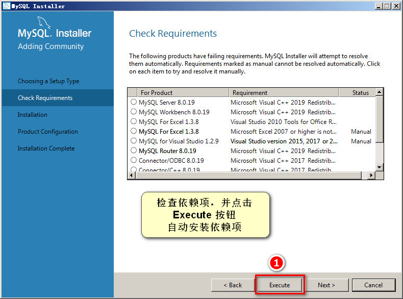

5. 正在安装依赖项：

   

   

   

   

   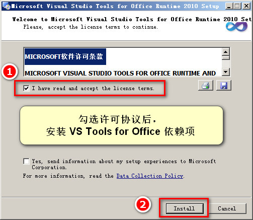

   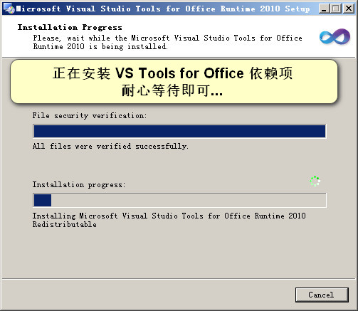

   

6. 完成依赖项的安装：

   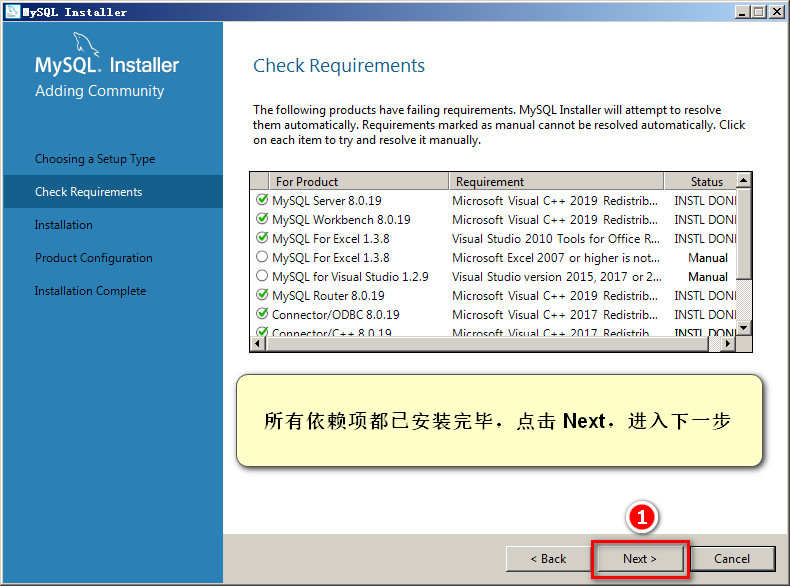

   此时，会弹出如下警告窗，直接点击 Yes 即可：

   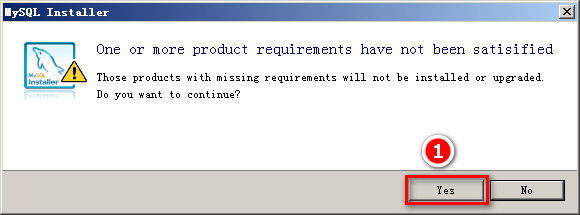

7. 进入 MySQL 的安装页面：

   

   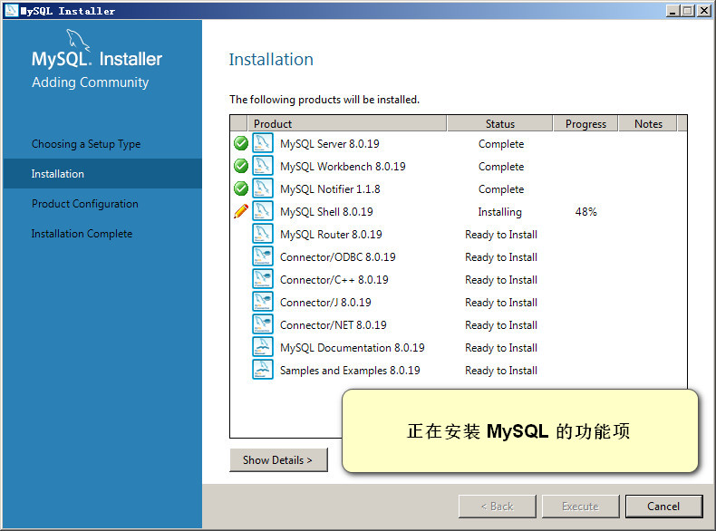

8. 完成 MySQL 功能项的安装：

   

9. 配置 MySQL：

   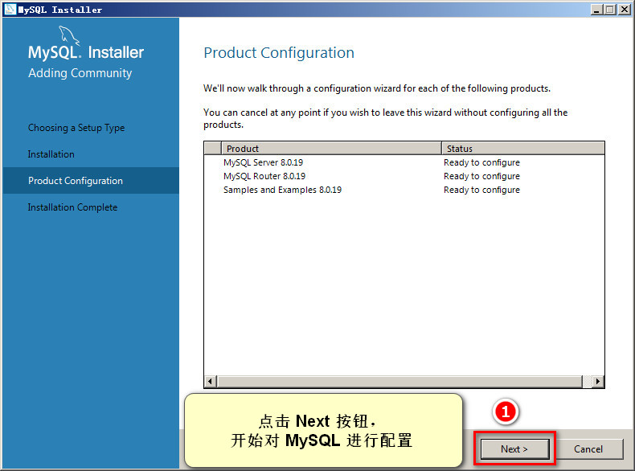

10. 选择 MySQL 数据库的运行模式：

    

11. 设置网络模式：

    

12. 配置身份认证方式：

    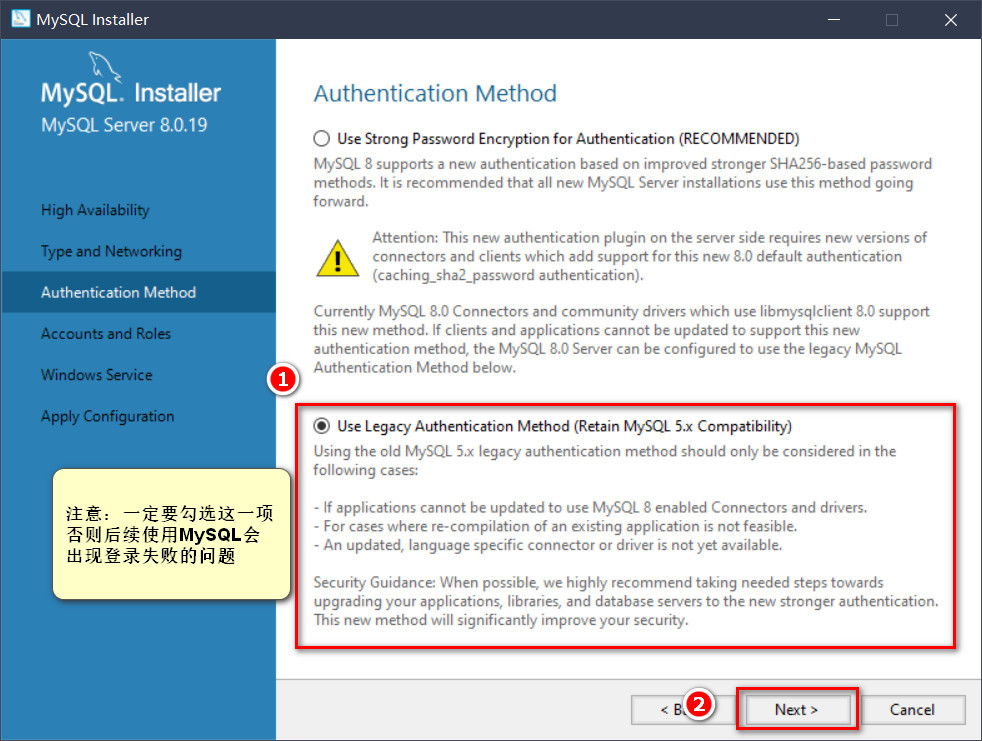

13. 将 MySQL 的默认 root 用户密码，设置为 admin123

    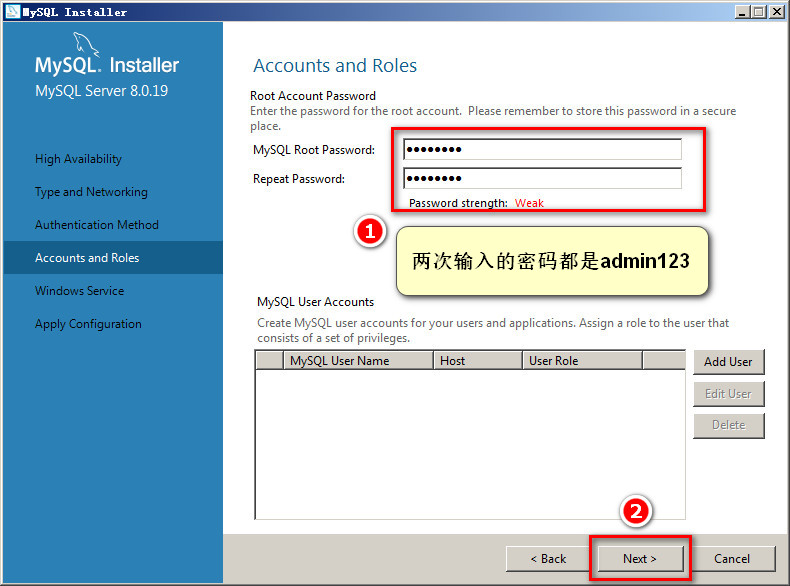

14. 将 MySQL 配置为 Windows 的服务：

    

15. 保存刚才对 MySQL 配置的修改：

    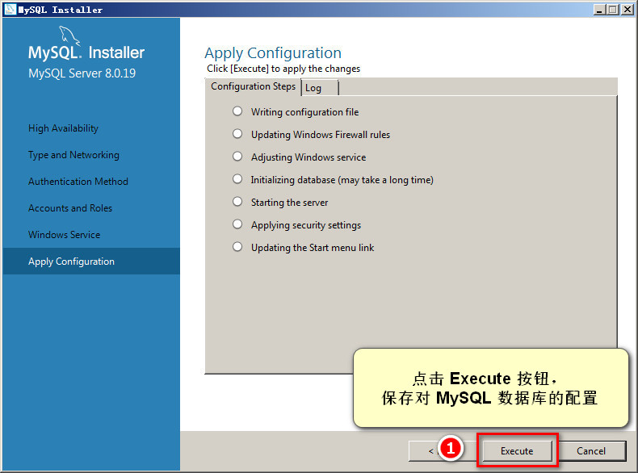

    

    

16. 继续完成后续的配置流程：

    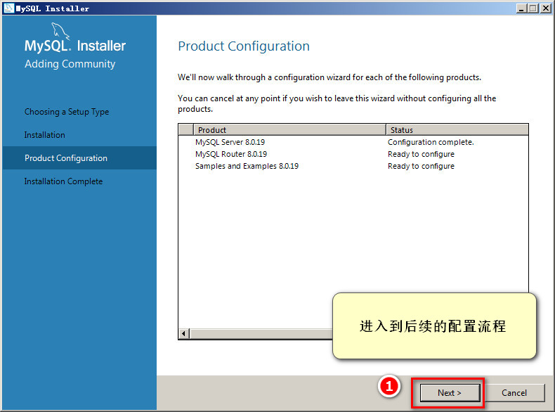

    

17. 最后一个配置项：

    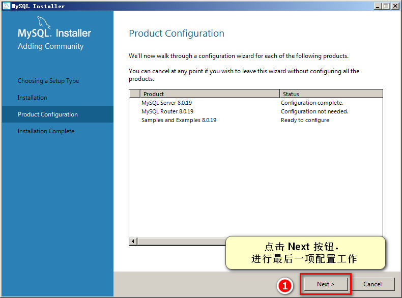

    测试能否正常连接到刚才安装的 MySQL 数据库：

    

18. 保存刚才的配置：

    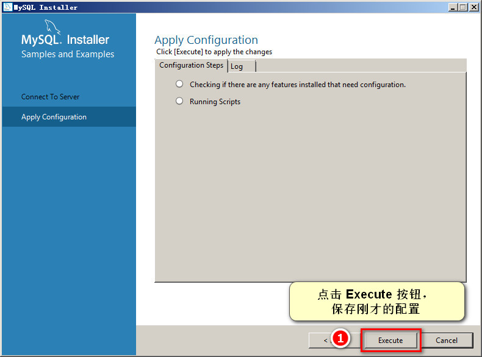

    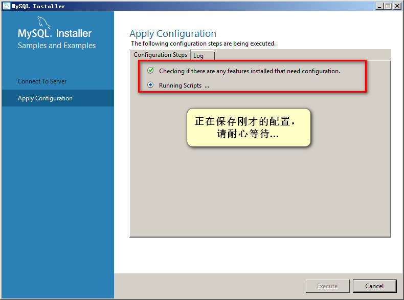

    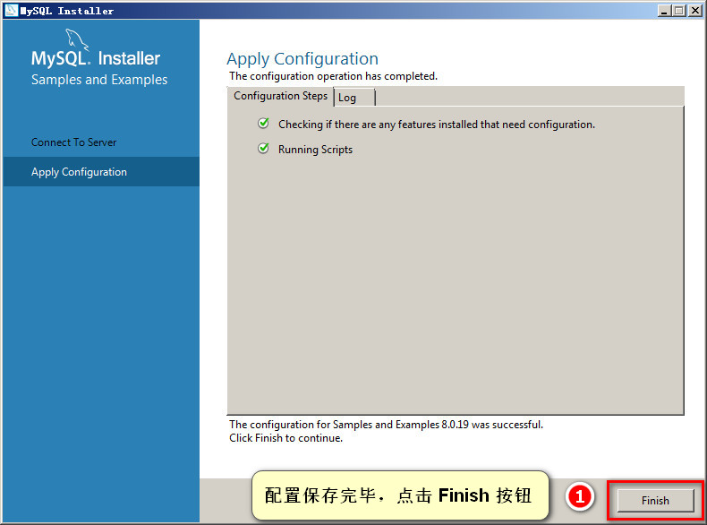

    

19. 完成 MySQL 的安装与配置：

    