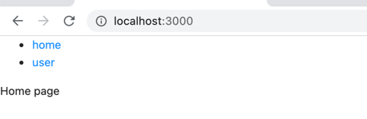

# 安装

```

yarn add react-router-dom 

```

如果用的ts开发,还需要安装

```
yarn add  @types/react-router-dom

```

# 基本示例

新建两个组件

```tsx
//  pages/User.tsx
import React, {Component} from "react";

export default class User extends Component<any, any> {
    render() {
        return (
            <>
                user page
            </>
        )
    }
}
	

// pages/Home.tsx

import React, {Component} from "react";

export default class Home extends Component<any, any> {

    render() {
        return (
            <>

                Home page
            </>
        )
    }
}

```

引入react-router-dom

```tsx
import React from 'react';
import {BrowserRouter as Router, Link, Route, Switch} from "react-router-dom";
import Home from "./pages/Home";
import User from "./pages/User";

function App() {
    return (
        <>

            <Router>
                <ul>
                    <li><Link to='/'>home</Link></li>
                    <li><Link to='/user'>user</Link></li>
                </ul>
                <Switch>
                    <Route path="/" exact><Home/></Route>
                    <Route path="/user" exact><User/></Route>
                </Switch>
            </Router>
        </>

    );
}

export default App;

```


路由切换效果展示





1. 用`BrowserRouter` 组件包含所有内容
2. 用 `Link` 组件生成链接
3. 用`switch` 切换路由，展示不同的dom结构
4. 用  `Route` 定义路由匹配规则，展示路由内容


参考文档：

[react-router-dom文档](https://reactrouter.com/web/guides/quick-start)

