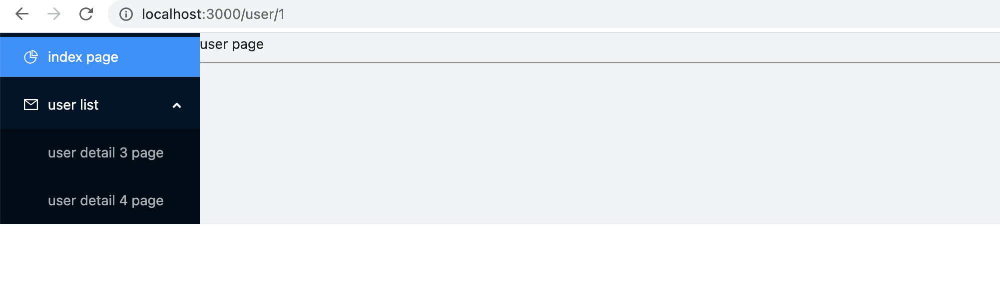

# 综合实例.md

> 在实际开发过程中，我们需要晋中管理我们的路由，特别在做后台项目的时候，我们需要动态渲染我们的路由

1. 定义我们的路由格式

```typescript
interface IRouter {
    id: number//路由id
    path: string//路由路径
    title: string//路由标题
    exact?: boolean//是否精确匹配
    component?: ReactNode//路由节点
    children?: IRouter[]//子路由
}

```

2. lazy懒加载组件

   ```typescript
   import {ReactNode, lazy} from "react";
   import Welcome from "../pages/Welcome";
   import Lee from "../pages/Lee";
   
   const Home = lazy(() => import("../pages/Home"));
   const UserDetail = lazy(() => import("../pages/UserDetail"));
   
   
   ```


3. 最终路由格式

```tsx
import {ReactNode, lazy} from "react";
import Welcome from "../pages/Welcome";
import Lee from "../pages/Lee";

const Home = lazy(() => import("../pages/Home"));
const UserDetail = lazy(() => import("../pages/UserDetail"));

interface IRouter {
    id: number//路由id
    path: string//路由路径
    title: string//路由标题
    exact?: boolean//是否精确匹配
    component?: ReactNode//路由节点
    children?: IRouter[]//子路由
}


export const router: IRouter[] = [
    {
        id: 1,
        path: '/',
        title: 'index page',
        exact: true,
        component: <Home/>
    },
    {
        id: 3,
        path: '/welcome',
        title: 'Welcome page',
        component: <Welcome/>
    },
    {
        id: 4,
        path: '/lee',
        title: 'Lee page',
        component: <Lee/>
    },
    {
        id: 2,
        path: '/user',
        title: 'user list',
        children: [
            {

                id: 3,
                path: '/user/detail/3',
                title: 'user detail 3 page',
                component: <UserDetail/>
            },
            {

                id: 4,
                path: '/user/detail/4',
                title: 'user detail 4 page',
                component: <UserDetail/>
            }
        ]
    }
]

```

4. 动态渲染路由

   ```tsx
   import React, {Suspense} from 'react';
   import {Menu} from 'antd';
   import {MailOutlined, PieChartOutlined,} from '@ant-design/icons';
   
   import {Layout} from 'antd';
   
   
   import {BrowserRouter as Router, Link, Route, Switch} from "react-router-dom";
   import {router} from "./router";
   
   const {SubMenu} = Menu;
   const {Sider, Content} = Layout;
   
   function App() {
       return (
           <>
   
               <Router>
                   <Suspense fallback={<>loading</>}>
                       <Layout>
                           <Layout>
                               <Sider>
                                   <div style={{width: 200}}>
                                       <Menu
                                           defaultSelectedKeys={['1']}
                                           defaultOpenKeys={['sub1']}
                                           mode="inline"
                                           theme="dark"
                                       >
                                           {
                                               router.map((r, index) => {
                                                   if (r.children) {
                                                       return (
                                                           <SubMenu key={r.id} icon={<MailOutlined/>} title={r.title}>
                                                               {
                                                                   r.children.map((r1, index) => (
                                                                       <Menu.Item key={r1.id}>
                                                                           <Link to={r1.path}>{r1.title}</Link>
                                                                       </Menu.Item>
                                                                   ))
                                                               }
                                                           </SubMenu>
                                                       )
                                                   } else {
                                                       return (
                                                           <Menu.Item key={r.id} icon={<PieChartOutlined/>}>
                                                               <Link to={r.path}>{r.title}</Link>
                                                           </Menu.Item>
                                                       )
   
                                                   }
                                               })
                                           }
                                       </Menu>
                                   </div>
                               </Sider>
                               <Content>
                                   <Switch>
                                       {
                                           router.map((r, index) => {
                                               if (r.children) {
                                                   return (
                                                       <Route path={r.path} exact={r.exact} key={r.id}>
                                                           {r.component}
                                                           <Switch>
                                                               {
                                                                   r.children.map((r1, i) => {
                                                                       return (
                                                                           <Route path={r1.path} key={r1.id}>
                                                                               {r1.component}
                                                                           </Route>
                                                                       )
                                                                   })
                                                               }
                                                           </Switch>
                                                       </Route>
                                                   )
                                               } else {
                                                   return (
                                                       <Route path={r.path} exact={r.exact} key={r.id}>
                                                           {r.component}
                                                       </Route>
                                                   )
                                               }
                                           })
                                       }
                                   </Switch>
                               </Content>
                           </Layout>
                       </Layout>
                   </Suspense>
   
               </Router>
           </>
   
       );
   }
   
   export default App;
   
   ```

最终效果

