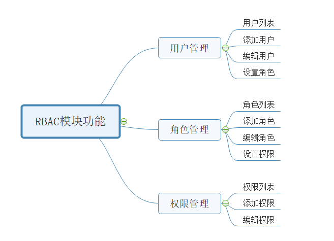
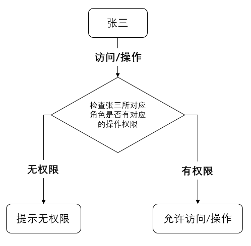

# RBAC简介

RBAC 是基于角色的访问控制（Role-Based Access Control ）在 RBAC
中，权限与角色相关联，用户通过成为适当角色的成员而得到这些角色的权限。这就极大地简化了权限的管理。这样管理都是层级相互依赖的，权限赋予给角色，而把角色又赋予用户，这样的权限设计很清楚，管理起来很方便。

# RBAC的核心问题。

> RBAC 实际上是在处理Who 、What 、How 三元组之间的关系

1. Who：是权限的拥有者或主体（如：User，Role）

2. What：权限的主体能做什么（例如：删除用户）
3. How：权限的主体怎么做（判断是否给某个用户展示删除按钮）

# RBAC的核心功能

# RBAC执行流程

