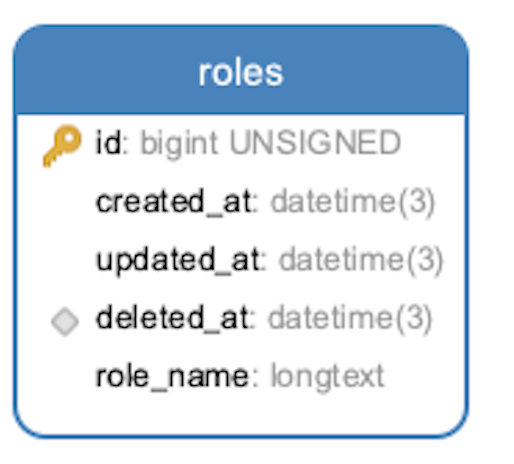
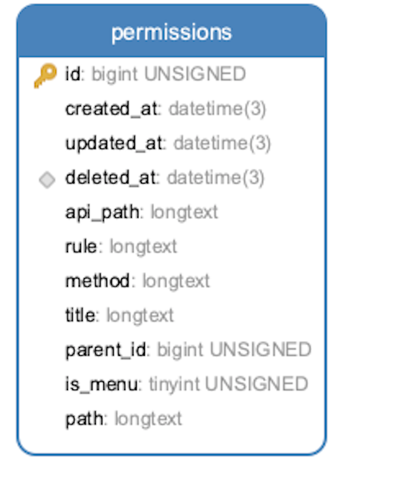
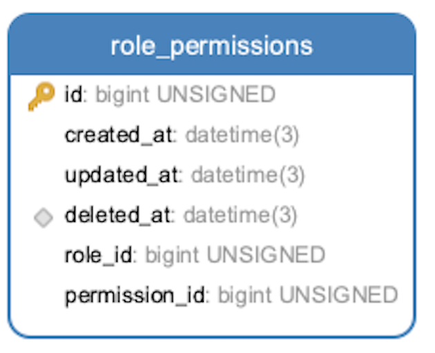

# 权限设计

## 前端权限设计

1. 路由数据格式

```typescript

export interface IRoute {
    id: string,//唯一标识
    exact?: boolean//是否精确匹配
    path: string//路由地址
    title: string//标题
    parentId?: number//父级id
    isMenu?: number//是否是菜单
    component?: ReactNode//路由的内容主体，有于显示该条路由的内容
    routes?: IRoute[]//子路由
    redirect?: string//重定向地址
    icon?: ReactNode//图标
}

```

2. 左侧菜单路由

```typescript

export const leftRoute: IRoute[] = [
    {
        id: '1-1',
        icon: <DashboardOutlined/>,
        exact: true,
        path: '/admin/dashboard',
        title: '仪表盘',
        isMenu: 0,
        component: <Index/>
    },
    {
        id: '3-0',
        icon: <UserOutlined/>,
        path: '/admin/list',
        title: '管理员管理',
        isMenu: 1,
        routes: [
            {
                id: '3-1',
                icon: <UserOutlined/>,
                path: '/admin/admin/list',
                title: '管理员列表',
                isMenu: 0,
                component: <AdminList/>
            }
        ]
    },
    {
        id: '4-0',
        icon: <TeamOutlined/>,
        path: '/admin/role',
        title: '角色管理',
        isMenu: 1,
        routes: [
            {
                id: '4-1',
                icon: <DashboardTwoTone/>,
                path: '/admin/role/list',
                title: '角色列表',
                isMenu: 0,
                component: <RoleList/>
            }
        ]
    }
]


```

3. 顶部路由

```typescript
export const topRoute: IRoute[] = [
    {
        id: '5-0',
        icon: <DashboardOutlined/>,
        exact: true,
        path: '/admin/top1',
        title: 'top1',
        isMenu: 0,
        component: <>top1</>
    },
    {
        id: '5-1',
        icon: <DashboardOutlined/>,
        exact: true,
        path: '/admin/top2',
        title: 'top2',
        isMenu: 0,
        component: <>top2</>
    }
]


```

4. 公共路由

```typescript
export const unAuthRouters: IRoute[] = [
    {
        id: '0-0',
        path: '/login',
        title: '登录',
        isMenu: 1,
        component: <Login/>
    },
    {
        id: '55555555555555555-0',
        path: '/403',
        title: '403',
        isMenu: 0,
        component: <Page403/>
    },
    {
        id: '6666666666666666-0',
        path: '*',
        title: '404',
        isMenu: 0,
        component: <Page404/>
    }
]

```

5. 需要认证的路由
> 只有认证通过之后才可以展示

```typescript

export const authRoutes: IRoute[] = [
    ...leftRoute,
    ...topRoute
]

```


## 后端权限设计


1. 角色

   

2. 权限

   

3. 角色与权限

   
